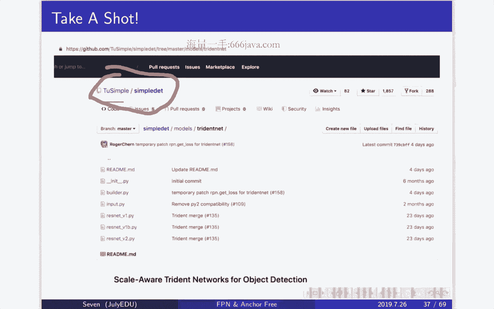
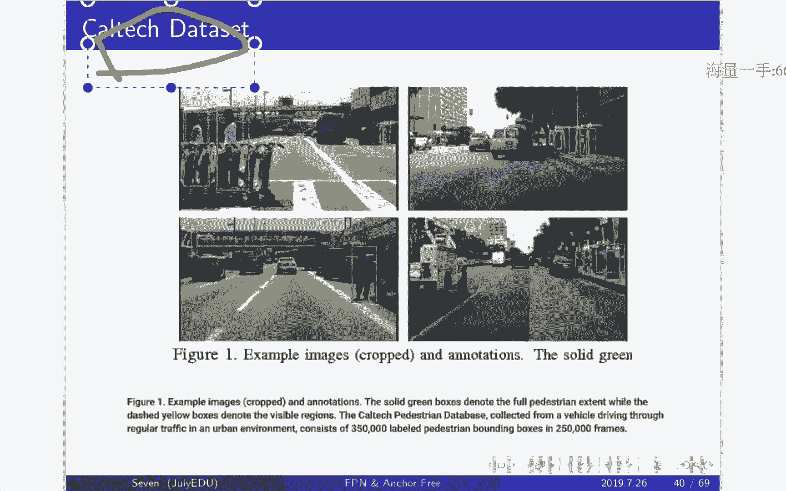
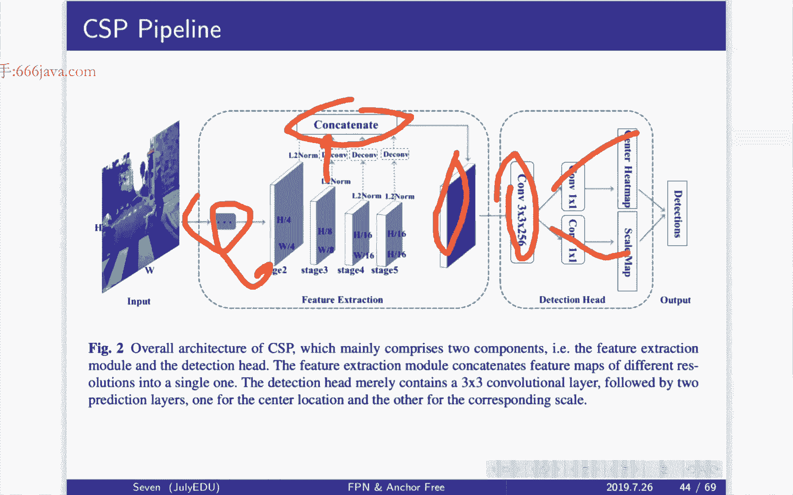
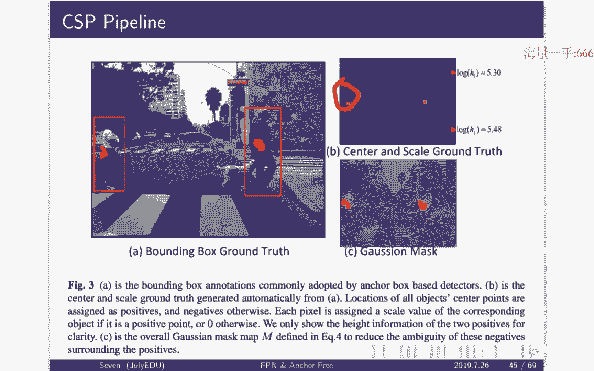
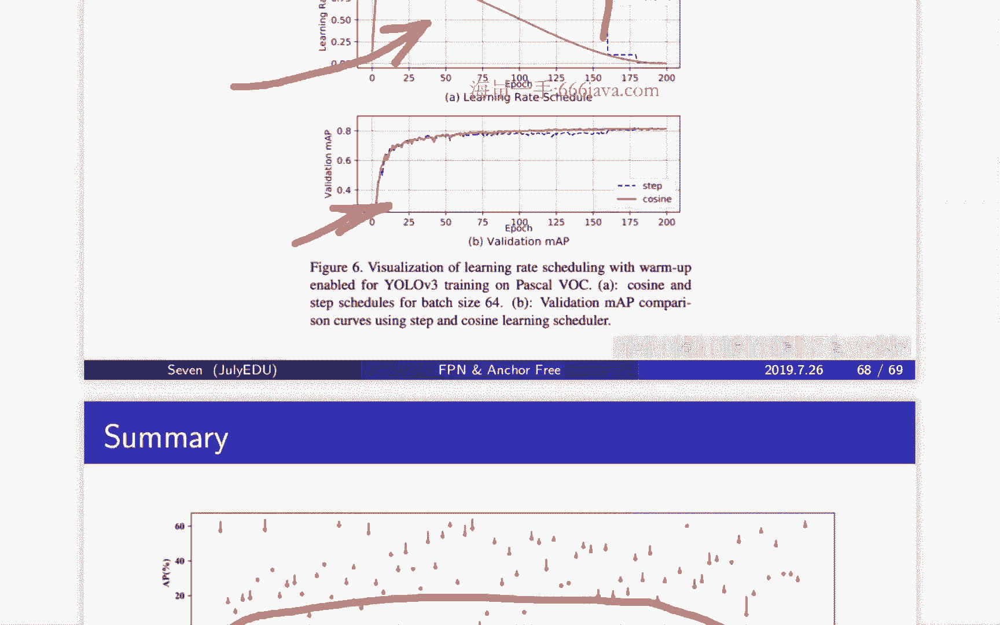

# 七月在线-深度学习集训营 第三期[2022] - P3：深度学习在物体检测中的应用（下）🚀

## 概述
在本节课中，我们将要学习物体检测领域中的高级网络结构与特征提取方法。我们将重点探讨如何解决检测算法在不同大小物体上表现不一致的问题，并介绍无需预设锚框（Anchor-Free）的检测新范式。此外，我们还将分享几个能显著提升检测性能的实用训练技巧。

---

## 第一部分：特征金字塔网络（FPN）与三叉戟网络（TridentNet）

上一节我们介绍了单阶段（One-Stage）检测算法，如YOLO和SSD。本节中我们来看看如何通过改进特征提取结构，来更好地处理多尺度物体检测问题。

### 1.1 多尺度检测的挑战与早期方案
在物体检测中，一个核心挑战是让同一套算法能有效检测不同大小的物体。卷积神经网络（CNN）的下采样特性导致深层特征图感受野大，适合检测大物体，但会丢失小物体的细节信息。

早期解决多尺度问题的思路主要有两种：
*   **图像金字塔**：将输入图像缩放成多个尺寸，分别送入网络检测。这种方法计算和内存开销大，不切实际。
*   **单一特征图预测**：如Faster R-CNN，只在网络最后一层特征图上进行预测。这种方式受限于单一尺度的感受野，难以兼顾所有大小的物体。

### 1.2 特征金字塔网络（FPN）的核心思想
FPN提出了一种高效构建特征金字塔的方法，它包含两条路径：
*   **自底向上路径（Bottom-up）**：即常规CNN的前向传播过程，随着网络加深，特征图分辨率降低，语义信息增强。
*   **自顶向下路径（Top-down）**：对深层、低分辨率的特征图进行上采样，使其与浅层、高分辨率的特征图尺寸对齐。
*   **横向连接（Lateral Connection）**：将上采样后的深层特征与对应的浅层特征（通常经过1x1卷积降维后）进行**逐元素相加**，融合高层的语义信息和低层的细节信息。融合后的特征再经过一个3x3卷积来消除上一步融合可能带来的混叠效应。

**公式/代码描述**：
对于第 `l` 层（如 `l=4`），其融合过程可表示为：
```
P_l = Conv3x3( Conv1x1(C_l) + Upsample(P_{l+1}) )
```
其中 `C_l` 是自底向上路径第 `l` 层的特征，`P_{l+1}` 是上一层（更深层）融合后的特征。

### 1.3 FPN与检测框架的融合
FPN本身是一种特征提取器，可以无缝集成到如Faster R-CNN等两阶段检测器中。在RPN（区域提议网络）阶段，FPN在不同层级的特征图（P2, P3, P4, P5...）上分别定义不同尺度的锚框（Anchor），让不同大小的物体在最适合的层级被提议出来。

一个有趣的现象是，集成了FPN的Faster R-CNN推理速度有时反而比原始版本更快。这主要有两个原因：
1.  **更轻量的RPN头**：FPN的RPN设计通常更简洁。
2.  **非极大值抑制（NMS）的并行化**：由于不同层级的提议框（Proposal）尺寸差异大，重叠可能性小，因此可以对不同层级的提议框**并行**进行NMS，大大降低了计算复杂度（从O(N²)降至约O((N/k)² * k)，其中k为金字塔层数）。

### 1.4 三叉戟网络（TridentNet）
TridentNet是2019年提出的一个更简洁优雅的多尺度检测网络。其灵感来源于一个实验观察：在特征图上使用不同膨胀率（Dilation Rate）的空洞卷积进行预测时，**膨胀率越大（感受野越大），对大物体的检测效果越好；膨胀率越小，对小物体的检测效果越好**。

基于此，TridentNet设计了并行的三个分支，每个分支使用相同的网络权重，但具有不同的空洞卷积膨胀率（例如1，2，3），分别专注于检测小、中、大物体。最后将三个分支的预测结果合并。

**核心优势**：结构统一、设计直观，并且在保持高性能的同时，可以通过只使用中间分支（对应中等大小物体）来平衡精度与速度，适用于实际业务部署。

---

## 第二部分：Anchor-Free检测方法（CSP与CenterNet）

上一节我们介绍了通过改进特征金字塔来处理多尺度问题。本节中我们来看看一种更根本的思路：抛弃预设锚框（Anchor），直接预测目标的关键点。

### 2.1 Anchor-Based方法的局限
以锚框为基础的检测器（如Faster R-CNN， SSD， YOLOv3）需要精心设计锚框的尺寸、长宽比和数量。这引入了大量超参数，调优复杂，且锚框与真实物体的匹配策略（如IoU阈值）对性能影响敏感。

### 2.2 CSP：行人检测中的Anchor-Free方案
CSP（Center and Scale Prediction）专为行人检测设计，思路极其直接：
1.  **中心点预测**：网络直接预测行人边界框的中心点位置。这被建模为一个热图（Heatmap），真实中心点位置为峰值。
2.  **尺度预测**：在中心点对应的位置上，网络预测行人的高度（或高度和宽度）。由于行人宽高比相对稳定，仅预测高度通常已足够。

**训练挑战与解决方案**：
*   **正负样本极端不平衡**：一张图中只有少数几个正样本（中心点），其余全是负样本。直接训练网络难以收敛。
*   **解决方案**：
    *   **高斯掩码（Gaussian Mask）**：不以非0即1的硬标签作为监督，而是在真实中心点周围生成一个2D高斯分布作为软标签。这样，靠近中心点的位置也有较高的监督信号，缓解了正负样本的尖锐矛盾。
    *   **Focal Loss**：进一步使用Focal Loss来降低大量简单负样本在训练中的权重，使网络更专注于学习困难样本。

**损失函数（示意）**：
中心点预测的损失借鉴了Focal Loss的形式：
```
L_k = -1/N * Σ[ (1 - Y_hat)^α * (Y)^β * log(Y_hat) ]
```
其中 `Y` 是高斯软标签，`Y_hat` 是预测值，`α` 和 `β` 是超参数，用于调节难易样本和正负样本的权重。

### 2.3 CenterNet：通用的Anchor-Free检测器
CenterNet将CSP的思想推广到通用物体检测（如COCO数据集）。其核心与CSP一致：将物体检测转化为对**中心点、尺寸（宽高）和偏移量**的回归问题。它同样使用高斯掩码和修改版的Focal Loss进行训练。





**优势**：
*   **结构简单**：无需非极大值抑制（NMS）后处理（因为每个物体理论上只由一个中心点预测），Pipeline更简洁。
*   **易于扩展**：同样的框架可以轻松扩展到人体姿态估计、3D检测等任务。



---



## 第三部分：物体检测实用训练技巧 🛠️

掌握了核心网络结构后，本节我们来看看几个能显著提升模型性能的训练技巧。这些技巧简单有效，在多个检测框架上都能带来稳定提升。

以下是三个关键技巧：

1.  **MixUp 数据增强**
    *   **原理**：将两张训练图像以一定比例混合，同时其标签也以相同比例混合。例如：`新图像 = λ * 图像A + (1-λ) * 图像B`，`新标签 = λ * 标签A + (1-λ) * 标签B`。λ从Beta分布中采样。
    *   **作用**：鼓励模型在训练数据之间进行线性行为，提高泛化能力和鲁棒性。在检测任务中，λ的分布通常与图像分类任务不同，需要调整。

2.  **标签平滑（Label Smoothing）**
    *   **原理**：修改分类任务中常用的one-hot硬标签。例如，对于正样本，将标签“1”改为“0.9”，并将剩余的“0.1”均匀分配给其他类别（或将背景类视为一个特殊类别）。
    *   **作用**：防止模型对训练标签过于自信，减轻过拟合，尤其能缓解数据集标签可能存在错误（噪声）带来的影响。
    *   **代码描述**：
        ```python
        # 原始one-hot标签: [0, 0, 1, 0]
        # 平滑后 (epsilon=0.1):
        # smoothed_label = (1 - epsilon) * one_hot + epsilon / K
        # 结果: [0.025, 0.025, 0.925, 0.025] (K=4)
        ```

3.  **余弦学习率衰减（Cosine Learning Rate Decay）**
    *   **原理**：学习率随训练周期（epoch）的变化遵循余弦函数曲线，从初始值缓慢下降到0。
    *   **作用**：相比传统的阶梯式下降（Step Decay），余弦衰减过程更加平滑，让模型在训练末期也能进行更精细的权重更新，通常能带来更好的收敛效果和最终精度。

---

## 总结
本节课中我们一起学习了物体检测领域的进阶内容：
1.  **多尺度特征融合**：我们深入探讨了**FPN**通过自顶向下和横向连接构建特征金字塔的机制，以及**TridentNet**利用不同膨胀率的并行分支来优雅解决多尺度检测问题的思路。
2.  **Anchor-Free检测范式**：我们分析了**CSP**和**CenterNet**如何摒弃复杂的锚框设计，直接预测目标的中心点和尺寸，并通过**高斯掩码**和**Focal Loss**解决了训练中的样本不平衡问题。
3.  **实用训练技巧**：我们介绍了**MixUp**、**标签平滑**和**余弦学习率衰减**这三个简单却高效的技巧，它们能显著提升检测模型的最终性能。




理解这些现代检测网络的核心思想与技巧，将帮助你更好地应对实际项目中复杂的检测需求，并具备跟进最新研究进展的能力。