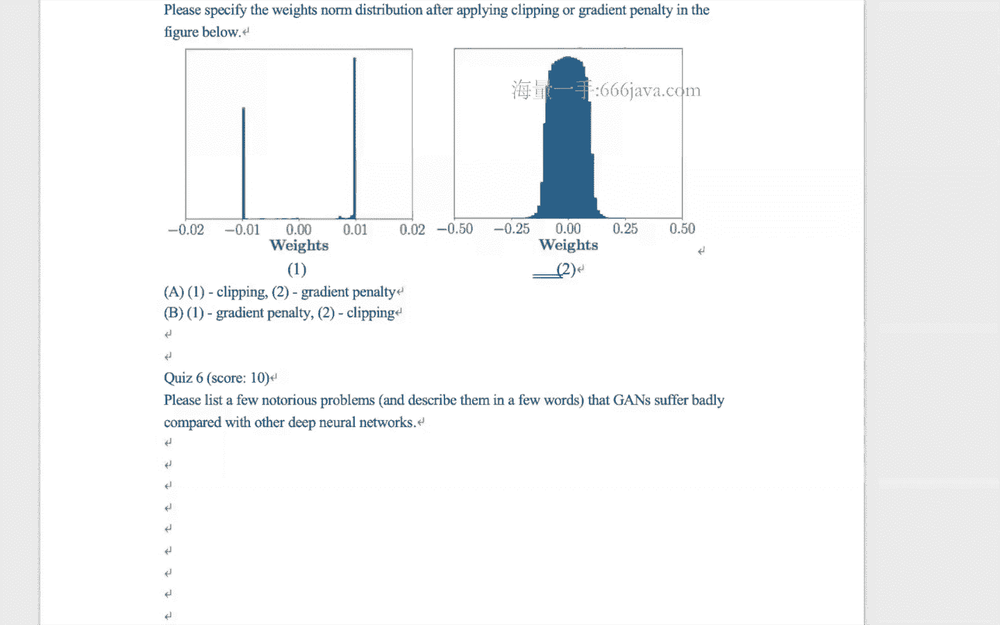

# 🧠 七月在线-深度学习集训营 第三期[2022] - P5：生成式对抗网络（GAN）教程

在本节课中，我们将要学习生成式对抗网络（GAN）的核心原理、数学基础、训练挑战及其重要变体WGAN。课程内容将从基础概念入手，逐步深入到模型优化与实践技巧，旨在让初学者能够清晰理解GAN的工作机制。

---

## 📚 预备知识：KL散度与JS散度

在正式讲解生成式对抗网络之前，我们需要先理解两个衡量数据分布差异的重要概念：KL散度和JS散度。

### KL散度（Kullback-Leibler Divergence）

KL散度用于衡量两个概率分布之间的差异。给定两个分布 \( P(x) \) 和 \( Q(x) \)，KL散度的定义如下：

**对于连续变量：**
\[
D_{KL}(P \parallel Q) = \int P(x) \log \frac{P(x)}{Q(x)} \, dx
\]

**对于离散变量：**
\[
D_{KL}(P \parallel Q) = \sum_{x} P(x) \log \frac{P(x)}{Q(x)}
\]

KL散度具有**非对称性**，即 \( D_{KL}(P \parallel Q) \neq D_{KL}(Q \parallel P) \)。当两个分布完全相同时，KL散度达到最小值0。

### JS散度（Jensen-Shannon Divergence）

JS散度建立在KL散度的基础之上，通过计算两个分布与其平均分布之间的KL散度的均值来定义，具有对称性。

\[
D_{JS}(P \parallel Q) = \frac{1}{2} D_{KL}(P \parallel M) + \frac{1}{2} D_{KL}(Q \parallel M)
\]
其中 \( M = \frac{P + Q}{2} \)。

JS散度的值域在0到1之间，当两个分布完全相同时为0，完全不同时为1。

---

## 🤖 生成式对抗网络（GAN）核心框架

上一节我们介绍了衡量分布差异的工具，本节中我们来看看如何利用这种思想构建一个“对抗”的网络。

生成式对抗网络由两个核心组件构成：**生成器（Generator）** 和 **判别器（Discriminator）**。

*   **判别器（D）**： 如同一个“验钞机”，其目标是准确区分输入数据是来自真实分布 \( P_{data}(x) \) 的“真钞”，还是来自生成器分布的“假钞”。对于真实数据，它应输出高概率（接近1）；对于生成数据，应输出低概率（接近0）。
*   **生成器（G）**： 如同一个“造假者”，其目标是生成足以“以假乱真”的数据，骗过判别器。它接收一个随机噪声向量 \( z \)（通常来自简单分布如均匀分布或高斯分布），并输出一个伪造的数据样本 \( G(z) \)。

### 🎯 GAN的数学目标

GAN的训练过程是一个**极小极大博弈（Minimax Game）**。其目标函数 \( V(D, G) \) 定义如下：

\[
\min_G \max_D V(D, G) = \mathbb{E}_{x \sim P_{data}(x)}[\log D(x)] + \mathbb{E}_{z \sim P_z(z)}[\log (1 - D(G(z)))]
\]

*   **判别器（D）的目标（内层max）**： 最大化这个函数。即，最大化对真实数据的判别概率 \( \log D(x) \)，同时最大化对生成数据的判别错误概率 \( \log (1 - D(G(z))) \)（即认为它是假的）。
*   **生成器（G）的目标（外层min）**： 最小化这个函数。即，希望生成的数据 \( G(z) \) 能被判别器误判为真，也就是最小化 \( \log (1 - D(G(z))) \)，等价于最大化 \( D(G(z)) \)。

### 🔍 最优判别器与纳什均衡

理论分析表明，对于固定的生成器 \( G \，最优的判别器 \( D^*_G(x) \) 为：
\[
D^*_G(x) = \frac{P_{data}(x)}{P_{data}(x) + P_G(x)}
\]
其中 \( P_G(x) \) 是生成器产生的数据分布。

当生成器完美地学习了真实数据分布，即 \( P_G = P_{data} \) 时，最优判别器对任何输入都只能给出 \( D^*_G(x) = \frac{1}{2} \)，意味着它无法区分真假，达到了纳什均衡点。此时，生成器生成的样本与真实样本在分布上已无区别。

---

## ⚠️ GAN训练中的挑战

尽管GAN思想巧妙，但在实际训练中面临诸多挑战。

以下是GAN训练中常见的几个问题：

1.  **梯度消失（Gradient Vanishing）**： 当判别器过于强大时，它对生成样本的梯度会非常小，导致生成器无法获得有效的更新信号。
2.  **模式崩溃（Mode Collapse）**： 生成器倾向于生成多样性有限的、安全的样本，而无法覆盖真实数据分布的所有模式（例如，只生成某一种人脸，而不生成其他类型）。
3.  **评估困难**： 原始的GAN损失函数无法直接反映生成样本的质量，通常需要人工观察生成结果来评估训练进度。
4.  **分布不重叠问题**： 真实数据分布 \( P_{data} \) 和生成器分布 \( P_G \) 通常都是高维空间中的低维流形，它们很可能没有交集或交集测度为零。此时，JS散度会是一个常数（例如 \(\log 2\)），导致梯度为零，训练停滞。

---

## 🚀 WGAN：使用Wasserstein距离改进GAN

为了克服原始GAN的缺陷，Wasserstein GAN（WGAN）被提出。其核心思想是使用**Wasserstein距离（又称推土机距离，EM距离）** 替代JS散度来衡量分布差异。

### 🌊 Wasserstein距离

Wasserstein距离直观上理解为：将一个分布 \( P \) 的“土堆”搬动成另一个分布 \( Q \) 的形状所需的最小“工作量”。它即使在不重叠的分布之间也能提供平滑的梯度。

根据对偶性，Wasserstein距离可以转化为一个最大化问题：
\[
W(P_{data}, P_G) = \sup_{\| f \|_L \leq 1} \left[ \mathbb{E}_{x \sim P_{data}}[f(x)] - \mathbb{E}_{x \sim P_G}[f(x)] \right]
\]
其中，\( f \) 是一个满足 **1-Lipschitz连续性** 的函数（即其梯度的绝对值几乎处处不超过1）。

### 🛠️ WGAN的实现改动

在WGAN中，我们用一组参数 \( w \)（通过神经网络实现）来逼近函数 \( f \)，并称之为“批评器（Critic）”。相比原始GAN的判别器（输出0/1概率），批评器输出一个实数分数。

以下是WGAN相对于原始GAN的主要改动：

1.  **移除判别器最后一层的Sigmoid激活函数**，使批评器输出一个无界的分数。
2.  **不再使用基于对数（log）的损失函数**，损失函数直接采用Wasserstein距离的对偶形式。
3.  **对批评器的权重进行梯度裁剪（Weight Clipping）**，例如限制在 \([-c, c]\) 区间内，以近似满足Lipschitz约束。
4.  **推荐使用RMSProp或SGD等优化器**，而非基于动量的Adam，以获得更稳定的训练。

### ✨ WGAN-GP：梯度惩罚（Gradient Penalty）

权重裁剪是一种简单但可能影响网络表达能力的强制约束。WGAN-GP提出了更优雅的**梯度惩罚（Gradient Penalty）** 方法。

其核心思想是：直接强制批评器对随机采样的数据点 \( \hat{x} \) 的梯度范数接近1。具体做法是在损失函数中添加一项惩罚项：
\[
\lambda \cdot \mathbb{E}_{\hat{x} \sim P_{\hat{x}}} \left[ (\| \nabla_{\hat{x}} D(\hat{x}) \|_2 - 1)^2 \right]
\]
其中 \( \hat{x} \) 是真实样本和生成样本连线上的随机插值点。这种方法能更稳定地训练出性能更好的WGAN。

---

## 📝 总结

本节课中我们一起学习了生成式对抗网络（GAN）的核心内容：

1.  我们首先了解了衡量分布差异的**KL散度和JS散度**。
2.  然后深入探讨了**GAN的基本框架**，包括生成器与判别器的对抗博弈过程及其数学目标函数。
3.  我们分析了原始GAN在训练中面临的**主要挑战**，如梯度消失、模式崩溃和评估困难。
4.  最后，我们介绍了**WGAN及其改进版本WGAN-GP**，它们通过使用Wasserstein距离和梯度惩罚技巧，有效解决了原始GAN的梯度问题，使训练更加稳定。

生成式对抗网络是生成模型领域的里程碑，理解其原理和变体对于深入掌握现代深度学习至关重要。