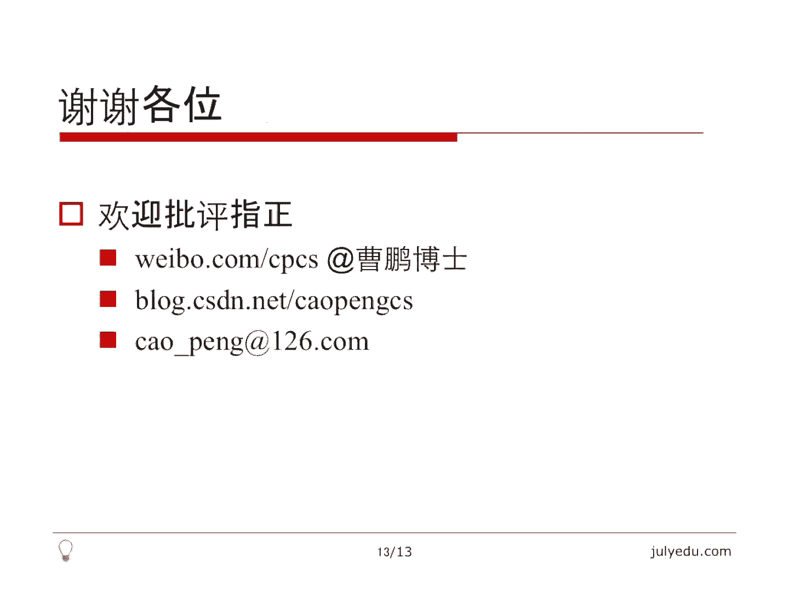

# 七月在线—算法coding公开课 - P1：实战动态规划（直播coding） 🚀


在本节课中，我们将通过三个具体的编程例题，深入学习动态规划（Dynamic Programming, DP）的实战应用。我们将从问题分析入手，推导出状态转移方程，并最终实现代码，同时探讨空间优化的技巧。

---

## 例一：最小路径和 📉

给定一个 `M` 行 `N` 列的二维矩阵，每个元素为非负整数。从左上角出发，每次只能向右或向下移动，最终到达右下角。目标是找到一条路径，使得路径上经过的所有数字之和最小。

### 问题分析与思路

最直接的思路是枚举所有可能的路径。从左上角到右下角需要走 `M + N - 2` 步，其中向下 `M - 1` 步，向右 `N - 1` 步。路径总数为组合数 `C(M+N-2, M-1)`。当 `M` 和 `N` 较大时（例如各为50），这个数字非常庞大，枚举法在实际中不可行。

因此，我们采用动态规划方法。

### 动态规划解法

我们定义状态 `dp[i][j]` 为：从左上角 `(0, 0)` 走到位置 `(i, j)` 的最小路径和。

要到达 `(i, j)`，只能从正上方 `(i-1, j)` 向下走一步，或者从左方 `(i, j-1)` 向右走一步。因此，状态转移方程为：
`dp[i][j] = min(dp[i-1][j], dp[i][j-1]) + grid[i][j]`

以下是初始条件的设置：
*   `dp[0][0] = grid[0][0]`，因为起点就是其本身的值。
*   对于第一行 `(i=0, j>0)`，只能从左方来：`dp[0][j] = dp[0][j-1] + grid[0][j]`。
*   对于第一列 `(j=0, i>0)`，只能从上方来：`dp[i][0] = dp[i-1][0] + grid[i][0]`。

最终答案即为 `dp[M-1][N-1]`。该算法的时间复杂度和空间复杂度均为 `O(M * N)`。

### 空间优化

观察状态转移方程，`dp[i][j]` 的值仅依赖于 `dp[i-1][j]` 和 `dp[i][j-1]`。我们可以使用一个一维数组 `dp` 进行滚动更新。在按行遍历时，`dp[j]` 在更新前存储的是上一行的值 `dp[i-1][j]`，更新后存储的是当前行的值 `dp[i][j]`。优化后的空间复杂度为 `O(N)`。

### 贪心算法反例 ❌

贪心策略（每次都选择相邻格子中数字较小的方向前进）在此问题上不成立。例如，对于矩阵 `[[1, 2], [100, 100]]`，贪心会选择 `1 -> 100 -> 100`，和为201。而最优路径是 `1 -> 2 -> 100`，和为103。

### 代码实现

以下是空间优化后的代码实现：
```cpp
int minPathSum(vector<vector<int>>& grid) {
    int m = grid.size();
    int n = grid[0].size();
    vector<int> dp(n, 0);
    
    dp[0] = grid[0][0];
    for (int j = 1; j < n; ++j) {
        dp[j] = dp[j-1] + grid[0][j];
    }
    
    for (int i = 1; i < m; ++i) {
        dp[0] += grid[i][0];
        for (int j = 1; j < n; ++j) {
            dp[j] = min(dp[j], dp[j-1]) + grid[i][j];
        }
    }
    return dp[n-1];
}
```

---

上一节我们介绍了如何用动态规划解决网格路径问题，本节中我们来看看另一个经典问题：如何在一个数列中寻找和最大的连续子数组。

## 例二：最大子数组和 📈

给定一个整数数组，找到一个具有最大和的连续子数组（子数组最少包含一个元素），返回其最大和。

### 多种解法思路

1.  **暴力枚举（O(N³)）**：枚举所有子数组的起点和终点，再循环求和。
2.  **优化枚举（O(N²)）**：枚举起点，在枚举终点的同时累加和，避免内层循环。
3.  **分治法（O(N log N)）**：将数组分为两半，最大子数组和可能出现在左半部分、右半部分或跨越中点。递归求解。
4.  **动态规划（O(N)）**：这是最高效的方法。

### 动态规划解法

定义状态 `dp[i]` 为：以第 `i` 个元素 **结尾** 的最大子数组和。

对于 `dp[i]`，我们有两种选择：
*   只包含当前元素 `nums[i]`，子数组和为 `nums[i]`。
*   将当前元素接在以 `nums[i-1]` 结尾的最大子数组之后，子数组和为 `dp[i-1] + nums[i]`。

我们需要在这两种方案中取最大值。因此，状态转移方程为：
`dp[i] = max(nums[i], dp[i-1] + nums[i])`

初始条件为 `dp[0] = nums[0]`。最终答案并非 `dp[n-1]`，而是所有 `dp[i]` 中的最大值，因为最大子数组可能以任意位置结尾。

### 空间优化

由于 `dp[i]` 只依赖于 `dp[i-1]`，我们可以用一个变量 `curr_max` 来代替整个 `dp` 数组，在遍历过程中不断更新。空间复杂度优化至 `O(1)`。

### 另一种线性思路：前缀和

定义前缀和 `sum[i]` 为 `nums[0]` 到 `nums[i]` 的和（`sum[-1] = 0`）。子数组 `nums[i..j]` 的和等于 `sum[j] - sum[i-1]`。
对于固定的 `j`，要使 `sum[j] - sum[i-1]` 最大，就需要 `sum[i-1]` 最小。因此，在遍历数组计算 `sum[j]` 时，同时维护一个 `min_sum` 记录已遍历前缀和的最小值，用 `sum[j] - min_sum` 更新答案即可。

### 代码实现

以下是动态规划（空间优化版）和前缀和两种方法的实现：

**动态规划（O(1)空间）:**
```cpp
int maxSubArray(vector<int>& nums) {
    int curr_max = nums[0];
    int global_max = nums[0];
    for (int i = 1; i < nums.size(); ++i) {
        curr_max = max(nums[i], curr_max + nums[i]);
        global_max = max(global_max, curr_max);
    }
    return global_max;
}
```

**前缀和法:**
```cpp
int maxSubArray(vector<int>& nums) {
    int sum = 0;
    int min_sum = 0; // 对应 sum[-1] = 0
    int ans = nums[0];
    for (int num : nums) {
        sum += num;
        ans = max(ans, sum - min_sum);
        min_sum = min(min_sum, sum);
    }
    return ans;
}
```

---

解决了数组上的动态规划问题后，我们进入一个更复杂的领域：字符串编辑。如何衡量两个字符串的相似度，并计算将它们变得相同所需的最少操作次数？

## 例三：编辑距离 ✏️

给定两个单词 `word1` 和 `word2`，计算将 `word1` 转换成 `word2` 所使用的最少操作数。操作包括：插入一个字符、删除一个字符、替换一个字符。

### 问题转化：字符串对齐

我们可以将编辑操作转化为一个“字符串对齐”问题。在两个字符串中插入一种特殊的“空白”字符（如 `-`），使它们长度相等，然后进行对齐。
*   如果对齐的两个字符相同，不产生代价。
*   如果对齐的两个字符不同，则产生 `1` 点代价（代表替换操作）。
*   如果 `word1` 的字符与“空白”对齐，产生 `1` 点代价（代表删除操作）。
*   如果 `word2` 的字符与“空白”对齐，产生 `1` 点代价（代表插入操作）。

最小编辑距离就等价于寻找一种对齐方式，使得总代价最小。

### 动态规划解法

定义状态 `dp[i][j]` 为：将 `word1` 的前 `i` 个字符转换为 `word2` 的前 `j` 个字符所需的最少操作数。

我们考虑如何得到 `dp[i][j]`：
1.  **替换或匹配**：让 `word1[i-1]` 和 `word2[j-1]` 对齐。
    *   如果它们相等，无需额外操作，代价为 `dp[i-1][j-1]`。
    *   如果不等，需要一次替换操作，代价为 `dp[i-1][j-1] + 1`。
2.  **删除**：让 `word1[i-1]` 与一个“空白”对齐。这意味着 `word1` 的前 `i-1` 位已经和 `word2` 的前 `j` 位对齐，现在删除 `word1[i-1]`。代价为 `dp[i-1][j] + 1`。
3.  **插入**：让 `word2[j-1]` 与一个“空白”对齐。这意味着 `word1` 的前 `i` 位已经和 `word2` 的前 `j-1` 位对齐，现在插入 `word2[j-1]`。代价为 `dp[i][j-1] + 1`。

我们需要从这三种可能的“最后一步操作”中选择代价最小的一个。因此，状态转移方程为：
`dp[i][j] = min(dp[i-1][j-1] + cost, dp[i-1][j] + 1, dp[i][j-1] + 1)`
其中，`cost = 0` 若 `word1[i-1] == word2[j-1]`，否则 `cost = 1`。

**初始条件**：
*   `dp[0][j] = j`：将空字符串变为 `word2` 的前 `j` 个字符，需要 `j` 次插入。
*   `dp[i][0] = i`：将 `word1` 的前 `i` 个字符变为空字符串，需要 `i` 次删除。

最终答案为 `dp[m][n]`，其中 `m` 和 `n` 分别为两个单词的长度。时间复杂度和空间复杂度均为 `O(m * n)`。

### 空间优化

状态 `dp[i][j]` 依赖于其左方 `dp[i][j-1]`、上方 `dp[i-1][j]` 和左上方 `dp[i-1][j-1]` 的值。我们可以使用一维数组进行优化，但需要额外一个变量来保存被覆盖掉的 `dp[i-1][j-1]` 的值。

### 代码实现

以下是空间优化后的代码实现：
```cpp
int minDistance(string word1, string word2) {
    int m = word1.length(), n = word2.length();
    vector<int> dp(n + 1, 0);
    for (int j = 0; j <= n; ++j) dp[j] = j; // 初始化第一行
    
    for (int i = 1; i <= m; ++i) {
        int prev = dp[0]; // 保存左上角的值 dp[i-1][j-1]
        dp[0] = i; // 更新当前行的第一列 dp[i][0]
        for (int j = 1; j <= n; ++j) {
            int temp = dp[j]; // 保存旧的 dp[j]，即下一轮的 dp[i-1][j-1]
            if (word1[i-1] == word2[j-1]) {
                dp[j] = prev;
            } else {
                dp[j] = min(prev, min(dp[j], dp[j-1])) + 1;
            }
            prev = temp; // 为下一列更新 prev
        }
    }
    return dp[n];
}
```

---

## 总结与思考 🎯

本节课中我们一起学习了动态规划的实战应用，通过三个由浅入深的例题掌握了其核心思想与解题步骤：

1.  **定义状态**：用 `dp[i]` 或 `dp[i][j]` 等形式清晰地表示子问题的解。
2.  **建立状态转移方程**：找出状态之间的关系，这是动态规划的核心。通常需要枚举“最后一步”或“当前决策”的所有可能情况。
3.  **确定初始条件（边界）**：这是递推的起点，必须仔细考虑。
4.  **计算顺序与答案**：确定填表顺序，并找到最终答案对应的状态。
5.  **空间优化**：观察状态依赖关系，常常可以通过滚动数组将空间复杂度降低一维。

动态规划的本质是一种高效的递推，它通过存储子问题的解避免了重复计算。要熟练掌握动态规划，关键在于**多练习、多思考**，培养对问题状态定义和转移的直觉。

**推荐练习**（LeetCode题号）：
*   70. 爬楼梯
*   121. 买卖股票的最佳时机
*   198. 打家劫舍
*   322. 零钱兑换
*   1143. 最长公共子序列
*   300. 最长递增子序列




希望本教程能帮助你更好地理解和运用动态规划这一强大的算法工具。