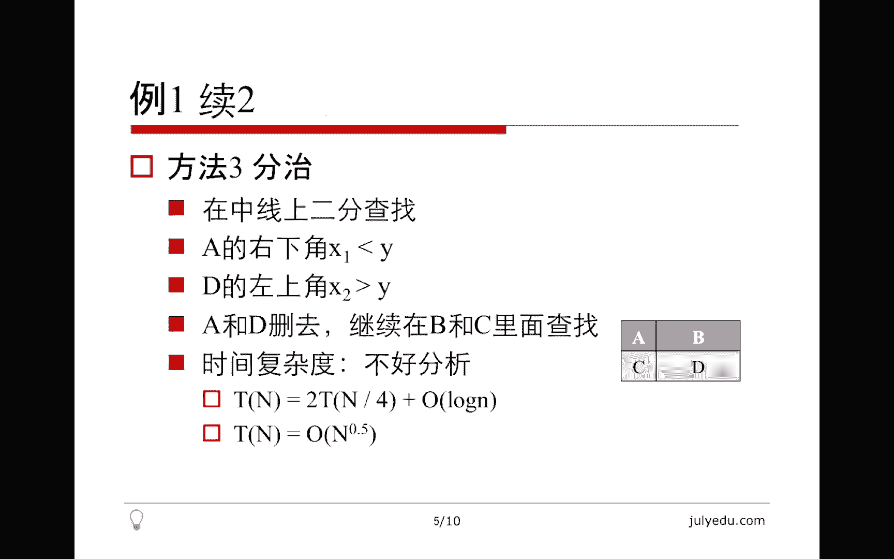
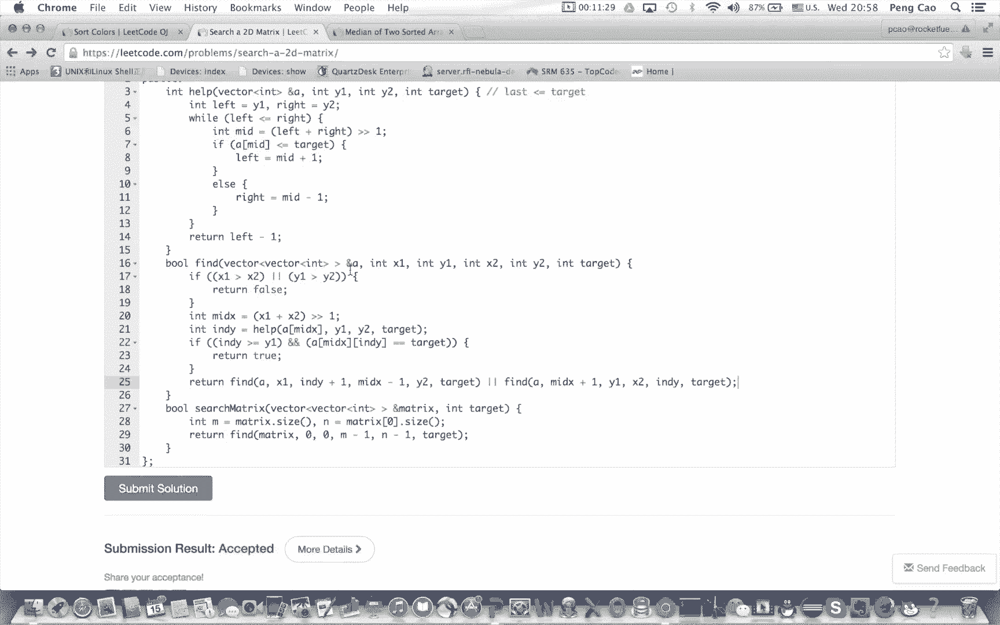
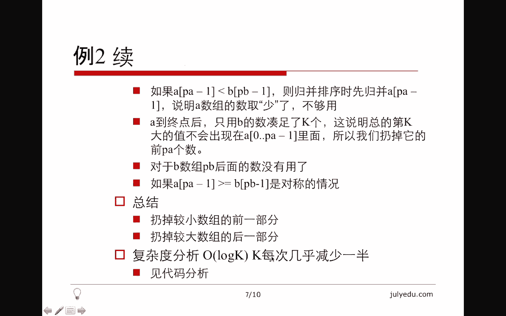
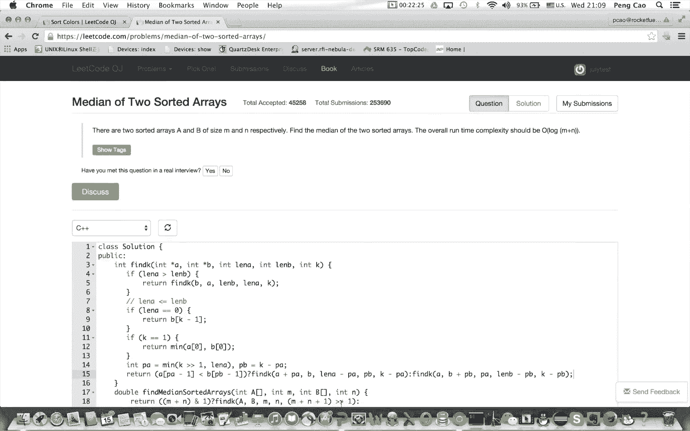
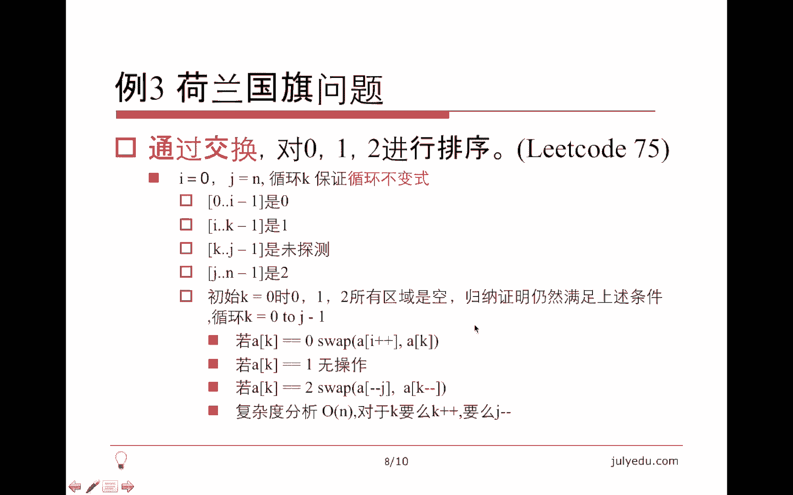
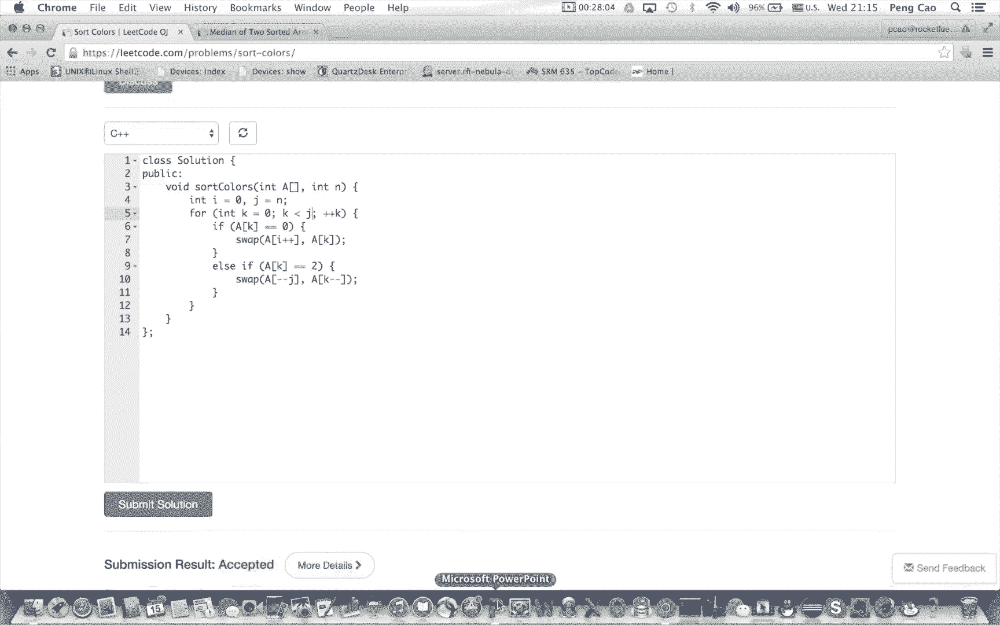
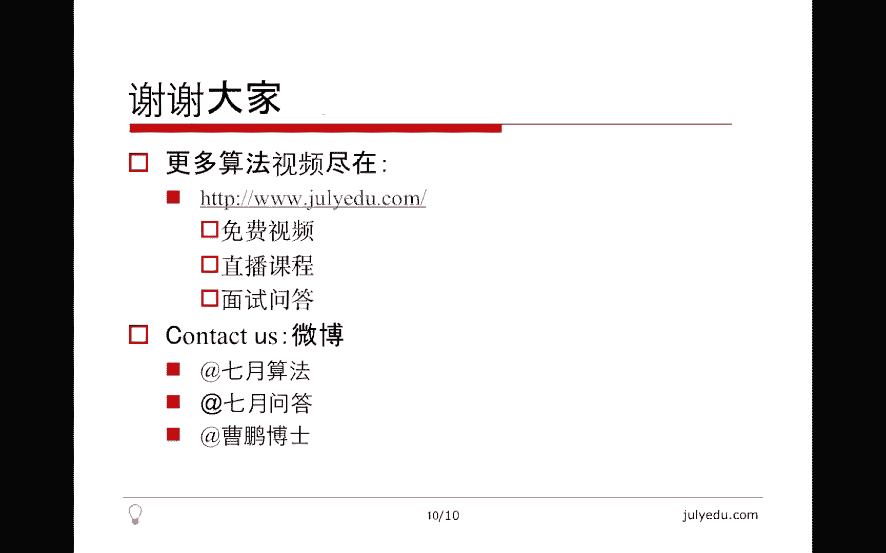

# 七月在线—算法coding公开课 - P2：排序查找实战 🎯


在本节课中，我们将通过三个实战例题，深入探讨排序与查找算法的核心思想与代码实现。我们将学习如何利用矩阵的有序性进行高效查找，如何合并两个有序数组并寻找中位数，以及如何使用“循环不变式”思想解决经典的荷兰国旗问题。课程将结合算法思路讲解与现场代码编写，帮助初学者理解并掌握这些关键技巧。

---

## 例题一：杨氏矩阵查找 🔍

所谓杨氏矩阵，是指矩阵的每一行、每一列都满足**单调递增**的性质。我们的任务是在这样的矩阵中，查找一个给定的目标值 `target` 是否出现。

### 方法一：行列缩减法



上一节我们介绍了问题背景，本节中我们来看看第一种解法。该方法的核心思想是：每次尝试删掉矩阵的一行或一列，并保证目标值 `target` 不在被删除的行列中，从而将问题规模缩小。

我们从矩阵的**右上角**（第一行最后一列）开始比较。设当前位置的值为 `x`，目标值为 `target`：
*   如果 `x < target`，根据杨氏矩阵的性质，**第一行所有元素都小于 `target`**。因此可以安全地删除第一行。
*   如果 `x > target`，则**最后一列所有元素都大于 `target`**。因此可以安全地删除最后一列。
*   如果 `x == target`，则查找成功。

每次操作后，我们始终关注剩余子矩阵的右上角元素。该算法的时间复杂度为 **O(m + n)**，其中 `m` 为行数，`n` 为列数。

以下是该方法的代码实现：
```python
def searchMatrix(matrix, target):
    if not matrix:
        return False
    m, n = len(matrix), len(matrix[0])
    row, col = 0, n - 1  # 起始位置：右上角
    while row < m and col >= 0:
        if matrix[row][col] == target:
            return True
        elif matrix[row][col] < target:
            row += 1  # 删除当前行
        else:
            col -= 1  # 删除当前列
    return False
```

### 方法二：中心点分治法

接下来，我们看看利用分治思想的第二种方法。我们取矩阵的**中心点** `x`，并与目标值 `target` 比较。
*   如果 `x < target`，则中心点左上方的子矩阵 `A` 中所有值均小于 `target`，可删除。
*   如果 `x > target`，则中心点右下方的子矩阵 `D` 中所有值均大于 `target`，可删除。

删除一部分后，问题被分解为在剩余的几个子矩阵中递归查找。该方法的时间复杂度分析较为复杂，介于 **O(√(m*n)) 到 O(m*n)** 之间。

### 方法三：中线二分法

最后，我们介绍一种更高效的分治法。我们在矩阵的**中间一行**进行二分查找，找到最后一个小于等于 `target` 的值 `x1`，以及紧邻其后第一个大于 `target` 的值 `x2`。
*   以 `x1` 为右下角的子矩阵 `A` 中所有值均小于 `target`。
*   以 `x2` 为左上角的子矩阵 `D` 中所有值均大于 `target`。



因此，我们可以同时删除 `A` 和 `D` 两个子矩阵，仅在剩余的 `B` 和 `C` 两个子矩阵中递归查找。该方法的时间复杂度可优化至 **O(√(m*n))**。

以下是利用中线二分法的代码框架：
```python
def searchMatrix(matrix, target):
    def binary_search_row(arr, left, right, target):
        # 在数组arr的[left, right]区间内，二分查找最后一个<=target的索引
        while left <= right:
            mid = (left + right) // 2
            if arr[mid] <= target:
                left = mid + 1
            else:
                right = mid - 1
        return right  # 返回最后一个<=target的索引

    def search_sub(matrix, x1, y1, x2, y2, target):
        # 在子矩阵（左上角[x1,y1], 右下角[x2,y2]）中查找
        if x1 > x2 or y1 > y2:
            return False
        mid_row = (x1 + x2) // 2
        # 在中间行二分查找临界点
        col_idx = binary_search_row(matrix[mid_row], y1, y2, target)
        # 检查是否找到目标
        if col_idx >= y1 and matrix[mid_row][col_idx] == target:
            return True
        # 递归搜索剩余的两个子矩阵
        return (search_sub(matrix, x1, col_idx + 1, mid_row - 1, y2, target) or
                search_sub(matrix, mid_row + 1, y1, x2, col_idx, target))
    # 主函数调用
    if not matrix:
        return False
    return search_sub(matrix, 0, 0, len(matrix)-1, len(matrix[0])-1, target)
```

---



## 例题二：两个有序数组的中位数 📊

现在，我们来看一个更复杂的问题：如何找到两个有序数组合并后的中位数。这可以泛化为寻找两个有序数组的**第 k 小元素**问题。

### 方法一：归并法

最直观的方法是模拟归并排序的合并过程，从两个数组头部开始比较，取出前 `k` 个元素，第 `k` 个即为所求。此方法时间复杂度为 **O(k)**，在最坏情况下（`k` 接近 `m+n`）为 **O(m+n)**。

以下是归并法的核心代码逻辑：
```python
def findKthSortedArrays(A, B, k):
    i, j = 0, 0
    while i < len(A) and j < len(B):
        k -= 1
        if A[i] < B[j]:
            if k == 0:
                return A[i]
            i += 1
        else:
            if k == 0:
                return B[j]
            j += 1
    # 某个数组已耗尽
    if i < len(A):
        return A[i + k - 1]
    else:
        return B[j + k - 1]
```

### 方法二：分治法（高效版）

为了达到对数级复杂度，我们需要更巧妙的分治策略。假设我们要从数组 `A` 和 `B` 中找第 `k` 小的数。
1.  我们尝试从较短的数组 `A` 中取前 `pa = min(k//2, len(A))` 个元素，从 `B` 中取前 `pb = k - pa` 个元素。
2.  比较 `A[pa-1]` 和 `B[pb-1]`：
    *   如果 `A[pa-1] < B[pb-1]`：说明 `A` 中这 `pa` 个元素一定属于合并后的前 `k` 小元素，且第 `k` 小的数不可能在 `A` 的这前 `pa` 个元素中（因为它们太小了），也不可能在 `B` 的第 `pb` 个元素之后（因为光靠 `A` 的这 `pa` 个和 `B` 的前 `pb` 个已经凑够 `k` 个候选了）。因此，我们可以**丢弃 `A` 的前 `pa` 个元素和 `B` 的 `pb` 之后的所有元素**，然后在剩余部分中寻找第 `(k - pa)` 小的数。
    *   如果 `A[pa-1] >= B[pb-1]`：情况对称，**丢弃 `B` 的前 `pb` 个元素和 `A` 的 `pa` 之后的所有元素**，在剩余部分寻找第 `(k - pb)` 小的数。

每次递归，`k` 的值至少减少一半，因此时间复杂度为 **O(log k)**，对于中位数问题即为 **O(log(m+n))**。

以下是分治法的实现：
```python
def findKth(A, B, k):
    # 保证A是较短的数组
    if len(A) > len(B):
        A, B = B, A
    if not A:
        return B[k-1]
    if k == 1:
        return min(A[0], B[0])
    pa = min(k // 2, len(A))
    pb = k - pa
    if A[pa-1] < B[pb-1]:
        # 丢弃A的前pa个，B的pb之后的部分
        return findKth(A[pa:], B[:pb], k - pa)
    else:
        # 丢弃B的前pb个，A的pa之后的部分
        return findKth(A[:pa], B[pb:], k - pb)
```

---



## 例题三：荷兰国旗问题 🏳️‍🌈

荷兰国旗问题要求我们将一个仅包含 `0`, `1`, `2` 的数组，通过**交换**操作，排序成 `0` 在前，`1` 在中，`2` 在后的形式。

### 循环不变式解法

解决此问题的经典方法是使用**三指针**，并维护一个“循环不变式”来保证算法的正确性。我们定义三个指针：
*   `i`：指向下一个`0`应该放置的位置（`[0, i-1]`区间全是`0`）。
*   `j`：指向下一个`2`应该放置的位置（`[j, n-1]`区间全是`2`）。
*   `k`：当前遍历的指针（`[i, k-1]`区间全是`1`，`[k, j-1]`是待处理区间）。

**循环不变式**：在遍历过程中，始终保证：
1.  `[0, i-1]` 全是 `0`。
2.  `[i, k-1]` 全是 `1`。
3.  `[k, j-1]` 是待处理的未知区域。
4.  `[j, n-1]` 全是 `2`。

算法过程如下，遍历指针 `k` 从 `0` 到 `j-1`：
*   若 `nums[k] == 0`：交换 `nums[k]` 和 `nums[i]`，然后 `i++`, `k++`。因为交换后 `nums[k]` 变成了 `1`（来自原 `nums[i]`），符合区间定义。
*   若 `nums[k] == 1`：`k++` 即可。
*   若 `nums[k] == 2`：交换 `nums[k]` 和 `nums[j-1]`，然后 `j--`。**注意，此时 `k` 不能增加**，因为从后面交换过来的元素是未处理的，需要在下一次循环中判断。

该算法只需一次遍历，时间复杂度为 **O(n)**，空间复杂度为 **O(1)**。



以下是代码实现：
```python
def sortColors(nums):
    i, k, j = 0, 0, len(nums)
    while k < j:
        if nums[k] == 0:
            nums[i], nums[k] = nums[k], nums[i]
            i += 1
            k += 1
        elif nums[k] == 1:
            k += 1
        else: # nums[k] == 2
            j -= 1
            nums[k], nums[j] = nums[j], nums[k]
            # k 不自增，因为交换过来的 nums[j] 尚未处理
```



---

## 总结 📝

本节课中我们一起学习了排序与查找的三大实战案例：
1.  **杨氏矩阵查找**：我们探讨了利用矩阵有序性的三种策略——行列缩减、中心分治和中线二分，理解了如何将二维查找问题化归为一维或更小的子问题。
2.  **两个有序数组的中位数**：我们将其抽象为寻找第 k 小元素问题，并对比了直观的归并法与高效的分治法。分治法的核心在于通过比较“试探点”，安全地丢弃不可能包含目标的大量子数组。
3.  **荷兰国旗问题**：我们学习了“循环不变式”这一重要的算法证明与设计思想，并利用三指针一次扫描解决了三分类排序问题，这同时也是快速排序中“三路划分”的核心思想。




查找的本质在于**利用数据的有序性**，通过分治（如二分）快速缩小搜索范围。排序则涉及多种策略，本节课涉及的划分思想是快速排序等高效算法的基础。掌握这些核心思想，是理解和设计更复杂算法的关键。