# 七月在线—算法coding公开课 - P3：链表实战（直播coding） 🧩


在本节课中，我们将学习链表相关的几个经典问题及其解决方案。课程将涵盖链表是否有环的判断、奇偶节点分离、链表排序以及有序链表去重等核心算法。我们将通过分析问题、推导数学原理，并最终用代码实现，帮助初学者掌握链表操作的关键技巧。

---

## 1. 链表是否有环 🔄

上一节我们介绍了课程概述，本节中我们来看看第一个经典问题：如何判断一个单链表是否有环，并找出环的起点。

普通单链表的最后一个节点指向空。如果链表有环，则最后一个节点会指向前面的某个节点。环的形状可能像数字“6”，即前面有一条“尾巴”（线段），后面连接一个环。

最直接的方法是使用一个集合（如 `set` 或 `map`）记录遍历过的节点。遍历链表时，检查当前节点是否已在集合中。如果出现过，则说明有环，且该节点即为环的起点。

以下是使用集合方法的代码示例：

```python
def hasCycle(head):
    visited = set()
    while head:
        if head in visited:
            return head  # 找到环的起点
        visited.add(head)
        head = head.next
    return None  # 无环
```

此方法的时间复杂度为 O(N)，空间复杂度也为 O(N)，因为需要额外的存储空间。

更优的方法是使用**双指针**（快慢指针）。定义两个指针 `slow` 和 `fast`，`slow` 每次移动一步，`fast` 每次移动两步。如果链表有环，它们最终会相遇。

**数学推导**：
假设链表“尾巴”部分有 `B` 个节点，环部分有 `A` 个节点。当 `slow` 进入环时，`fast` 已在环中，设其领先 `slow` `C` 步（`C < A`）。由于 `fast` 速度是 `slow` 的两倍，它们之间的距离每步减少 1。因此，经过 `A - C` 步后，两者相遇。

第一次相遇后，将 `slow` 移回链表头部，然后 `slow` 和 `fast` 都以每次一步的速度移动。当它们再次相遇时，相遇点即为环的起点。

以下是双指针方法的代码实现：

```python
def detectCycle(head):
    slow = fast = head
    while fast and fast.next:
        slow = slow.next
        fast = fast.next.next
        if slow == fast:  # 第一次相遇
            slow = head
            while slow != fast:
                slow = slow.next
                fast = fast.next
            return slow  # 环的起点
    return None  # 无环
```

此方法的时间复杂度为 O(N)，空间复杂度为 O(1)。

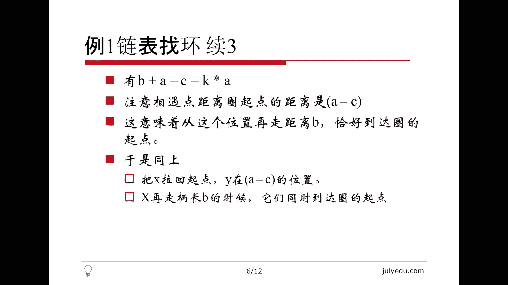

---

## 2. 奇偶节点分离 ⚖️

上一节我们学习了如何检测链表中的环，本节中我们来看看如何将链表中的奇数位置节点和偶数位置节点分离，并重新排列。

问题要求将奇数位置节点按原顺序排在前面，偶数位置节点按原顺序排在后面。关键思路是创建两个新链表，分别存储奇数位置节点和偶数位置节点，最后将偶数链表连接到奇数链表之后。

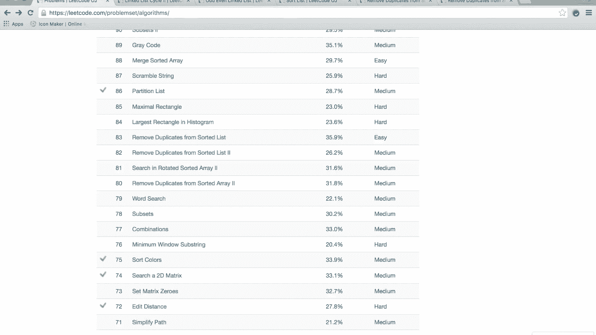

以下是实现步骤：

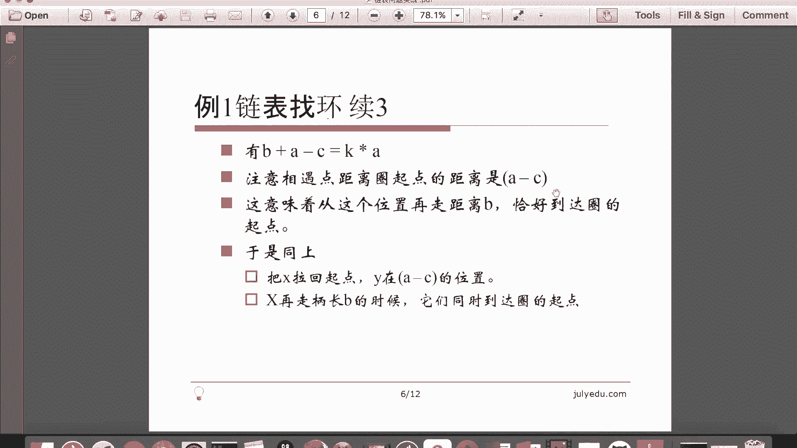

1. 初始化四个指针：`odd_head`, `odd_tail`, `even_head`, `even_tail`，分别表示奇数链表和偶数链表的头尾。
2. 遍历原链表，根据节点位置（索引）将其添加到对应的链表中。
3. 处理边界情况，如链表为空或只有一个节点。
4. 连接奇数链表尾部与偶数链表头部，并确保新链表的最后一个节点指向 `None`。

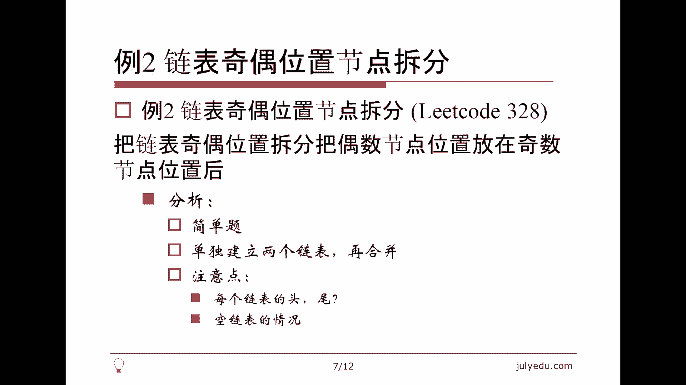

以下是代码实现：

```python
def oddEvenList(head):
    if not head:
        return None
    
    odd_head = odd_tail = None
    even_head = even_tail = None
    index = 1
    current = head
    
    while current:
        if index % 2 == 1:  # 奇数位置
            if odd_tail:
                odd_tail.next = current
                odd_tail = current
            else:
                odd_head = odd_tail = current
        else:  # 偶数位置
            if even_tail:
                even_tail.next = current
                even_tail = current
            else:
                even_head = even_tail = current
        current = current.next
        index += 1
    
    # 连接两个链表
    if odd_tail:
        odd_tail.next = even_head
    else:
        odd_head = even_head
    
    # 确保链表尾部指向 None
    if even_tail:
        even_tail.next = None
    
    return odd_head
```

此方法的时间复杂度为 O(N)，空间复杂度为 O(1)。

---

## 3. 链表排序 📊

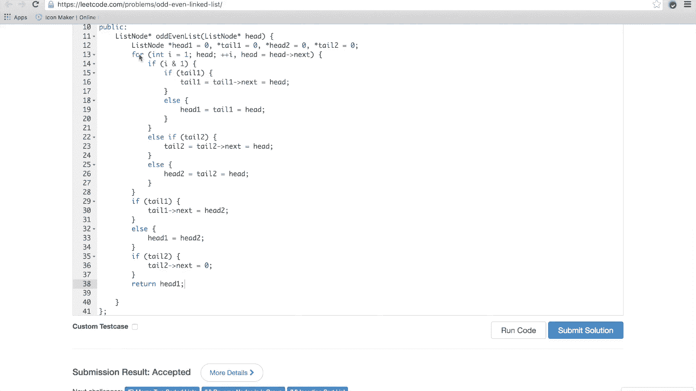

上一节我们完成了奇偶节点的分离，本节中我们来看看如何对链表进行排序，要求时间复杂度为 O(N log N)，空间复杂度为 O(1)。

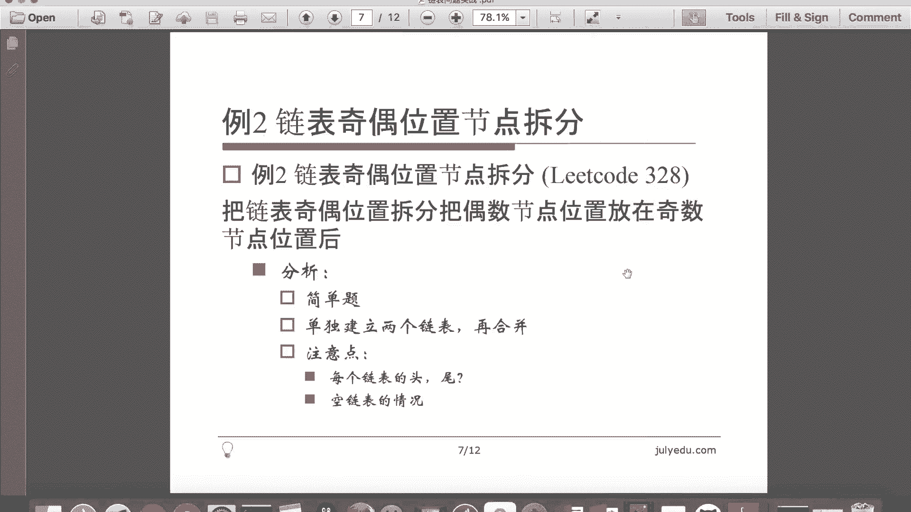

由于链表不支持随机访问，归并排序是更适合的选择。递归实现归并排序的步骤如下：

1. 找到链表的中点，使用快慢指针法。
2. 递归地对前半部分和后半部分进行排序。
3. 合并两个已排序的链表。

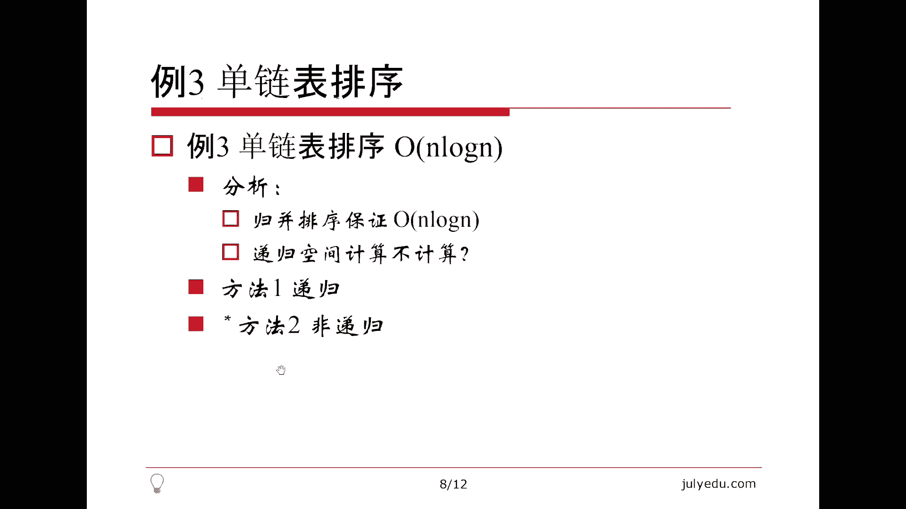


以下是递归实现归并排序的代码：

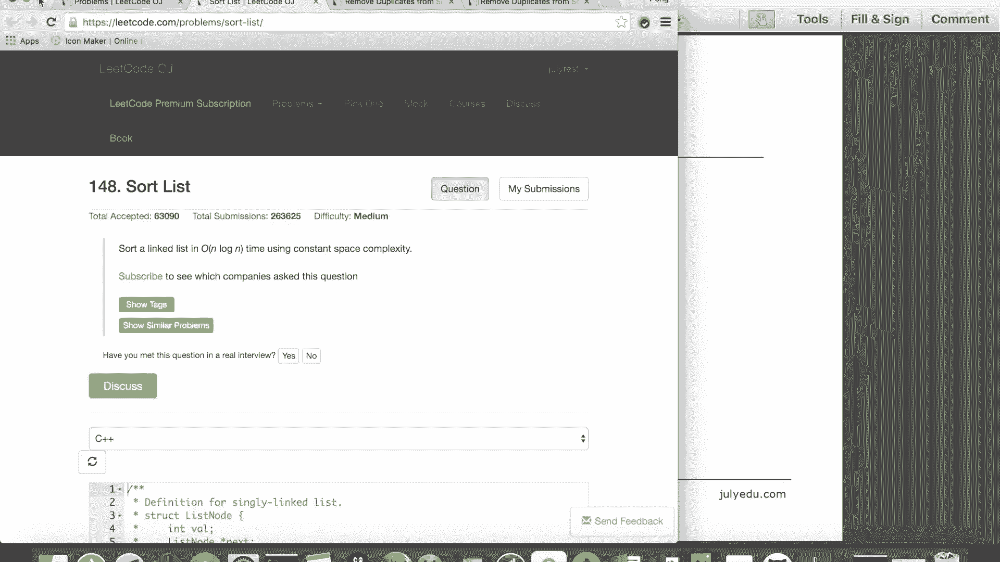

```python
def sortList(head):
    # 边界条件：链表为空或只有一个节点
    if not head or not head.next:
        return head
    
    # 使用快慢指针找到链表中点
    slow, fast = head, head.next
    while fast and fast.next:
        slow = slow.next
        fast = fast.next.next
    
    # 分割链表
    mid = slow.next
    slow.next = None
    
    # 递归排序
    left = sortList(head)
    right = sortList(mid)
    
    # 合并两个有序链表
    return merge(left, right)

def merge(l1, l2):
    dummy = ListNode(0)
    tail = dummy
    
    while l1 and l2:
        if l1.val < l2.val:
            tail.next = l1
            l1 = l1.next
        else:
            tail.next = l2
            l2 = l2.next
        tail = tail.next
    
    # 处理剩余节点
    tail.next = l1 if l1 else l2
    
    return dummy.next
```

此方法的时间复杂度为 O(N log N)，空间复杂度为 O(log N)（递归栈空间）。若要求严格 O(1) 空间，需使用非递归实现。

---

## 4. 有序链表去重 🧹

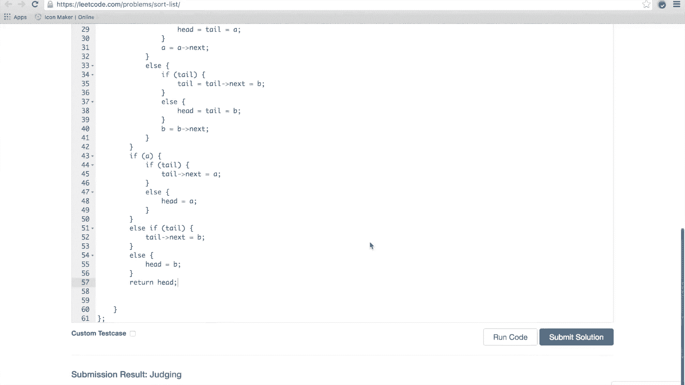

上一节我们学习了链表的排序，本节中我们来看看如何对有序链表进行去重。根据要求不同，去重分为两种：删除所有重复节点（保留唯一值）和保留重复节点中的一个。

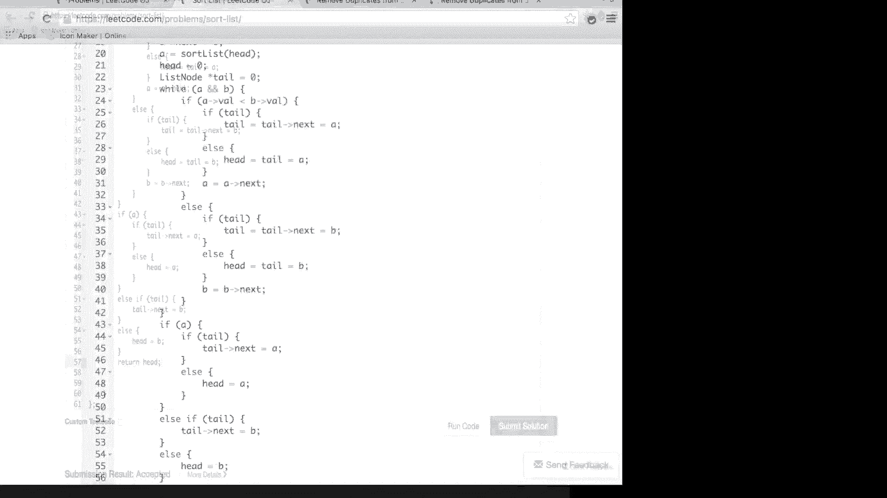


### 4.1 删除所有重复节点

以下是删除所有重复节点的实现步骤：

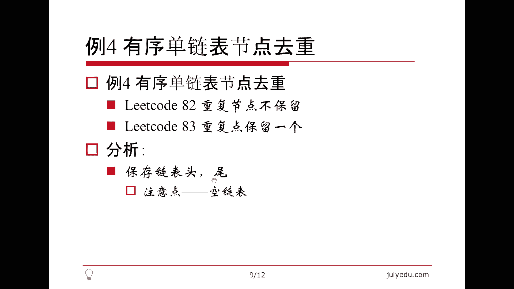

1. 创建一个虚拟头节点，简化边界处理。
2. 遍历链表，如果当前节点与下一个节点值相同，则跳过所有重复节点。
3. 将非重复节点连接到新链表中。

以下是代码实现：

```python
def deleteDuplicatesAll(head):
    dummy = ListNode(0)
    dummy.next = head
    prev = dummy
    
    while head:
        if head.next and head.val == head.next.val:
            # 跳过所有重复节点
            while head.next and head.val == head.next.val:
                head = head.next
            prev.next = head.next
        else:
            prev = prev.next
        head = head.next
    
    return dummy.next
```

### 4.2 保留重复节点中的一个

以下是保留重复节点中的一个的实现步骤：

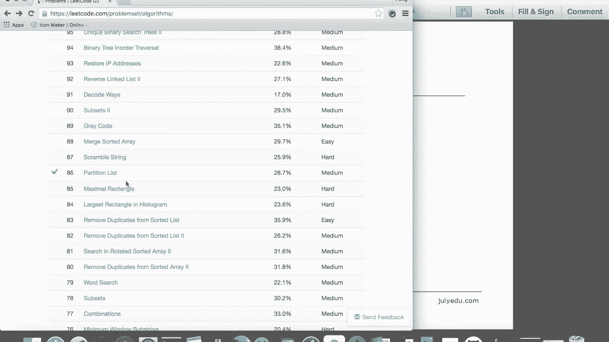

1. 遍历链表，如果当前节点与下一个节点值相同，则跳过重复节点，只保留一个。
2. 直接修改原链表。

以下是代码实现：

```python
def deleteDuplicatesOne(head):
    current = head
    
    while current and current.next:
        if current.val == current.next.val:
            current.next = current.next.next
        else:
            current = current.next
    
    return head
```

这两种方法的时间复杂度均为 O(N)，空间复杂度为 O(1)。

---

## 总结 📝

本节课中我们一起学习了链表相关的四个核心问题：

1.  **链表是否有环**：通过双指针法（快慢指针）可以在 O(N) 时间和 O(1) 空间内检测环并找到环的起点。
2.  **奇偶节点分离**：通过创建两个子链表并重新连接，可以在 O(N) 时间内完成节点重排。
3.  **链表排序**：使用归并排序可以在 O(N log N) 时间内对链表进行排序，递归实现较为简洁。
4.  **有序链表去重**：根据需求选择删除所有重复节点或保留一个，均可在 O(N) 时间内完成。

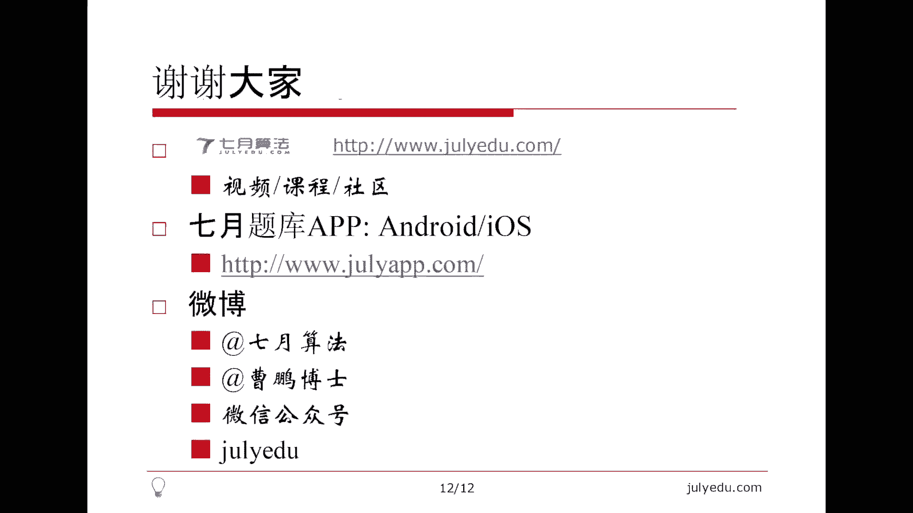


链表操作的关键在于正确处理指针的指向和边界条件（如头节点、尾节点和空值）。通过本节课的学习，希望大家能够掌握链表问题的基本解决思路，并能够灵活应用到其他类似问题中。