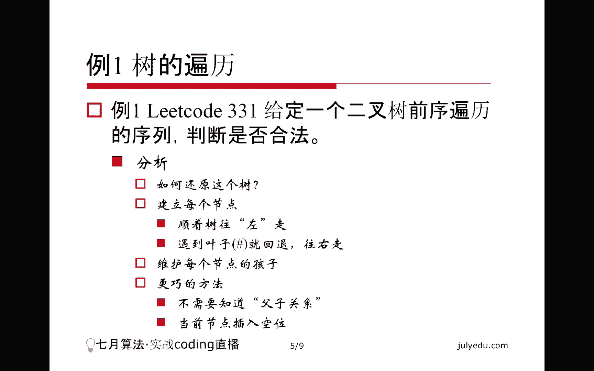
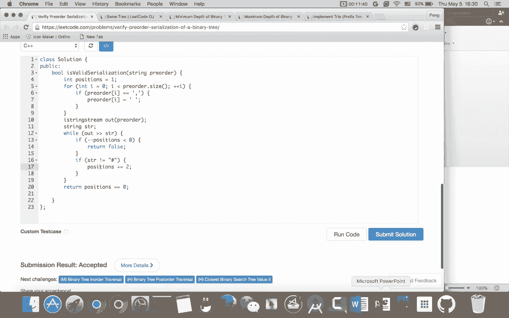
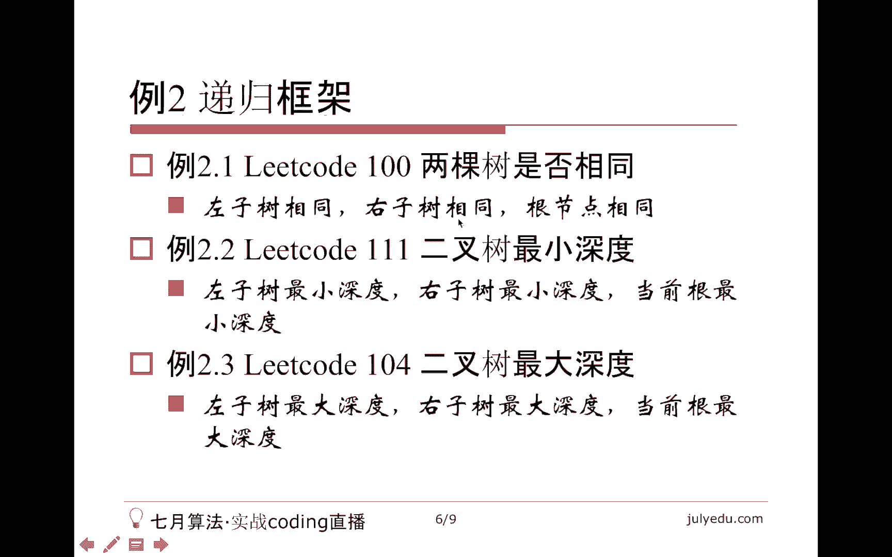
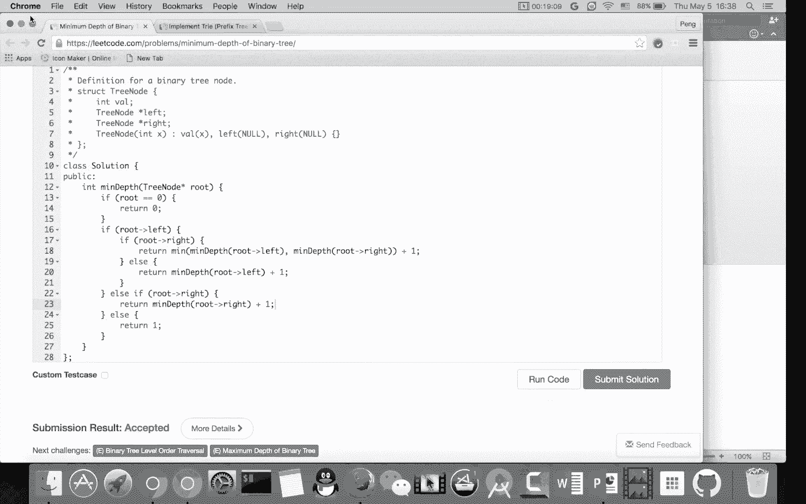
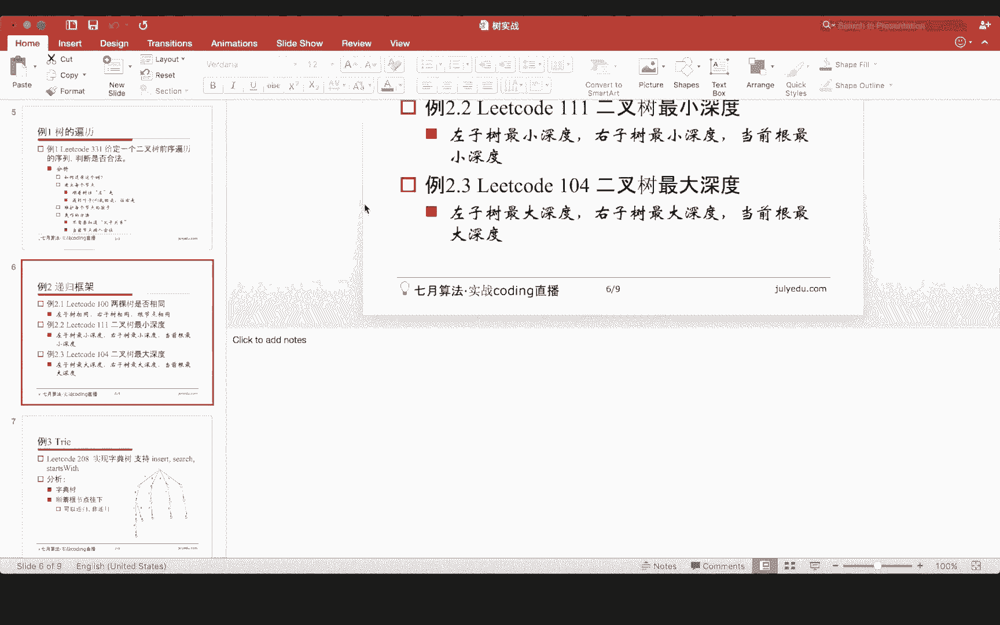
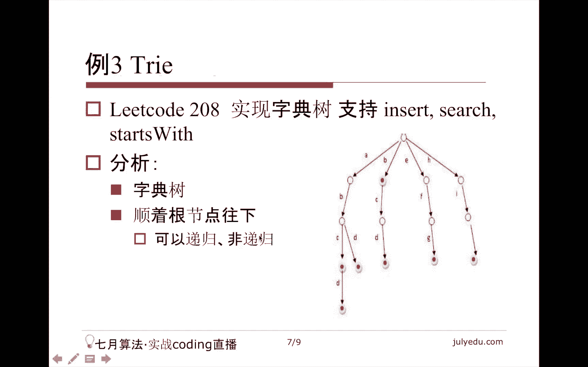
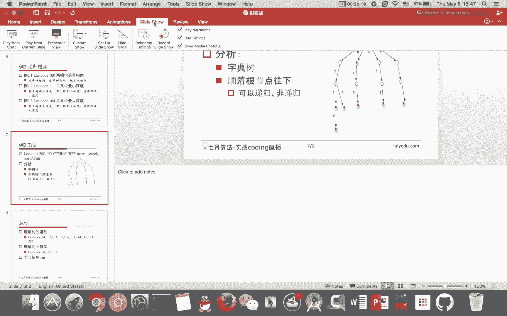
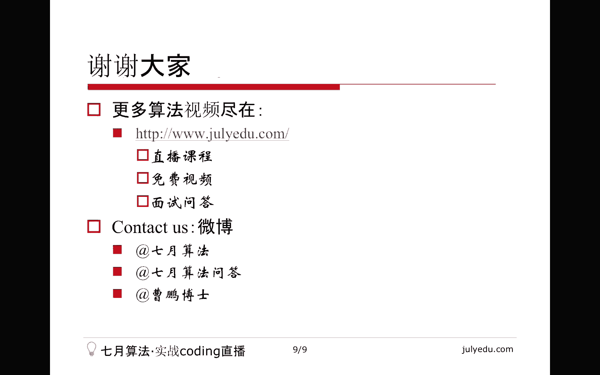

# 七月在线—算法coding公开课 - P4：树实战 🌳


在本节课中，我们将学习树这种数据结构的基础知识、核心性质，并通过解决几个LeetCode上的经典题目来实践树的遍历、递归应用以及字典树（Trie）的使用。

---

## 树的定义与分类 📚

树是一种特殊的图。图由节点和边构成。树需要满足三个条件：它是一个无向图、无环图且连通图。这三个条件缺一不可。

树可以分为两类：
*   **有根树**：存在一个特殊节点称为根。定义了根后，节点间便有了父子关系。
*   **无根树**：没有特殊根节点的树。

在计算机科学中，**二叉树**尤为重要，例如二叉搜索树。普通树的研究则更多在图论领域。

---

## 树的核心性质 🔑

以下是树的一些关键性质：
*   **节点与边的关系**：一棵有 `N` 个节点的树，恰好有 `N-1` 条边。
*   **叶子节点存在性**：当 `N >= 2` 时，树中至少存在两个度为1的节点（叶子节点）。
*   **路径唯一性**：树中任意两个节点之间有且仅有一条简单路径。
*   **最小连通图**：树是使所有 `N` 个节点连通所需边数最少的图。这意味着树中的每条边都是“割边”，移除任何一条边都会破坏连通性。
*   **成环性**：在树中添加任意一条新边，都会形成一个环。

上一节我们介绍了树的基本概念，本节中我们来看看如何应用这些知识解决实际问题。

---

## 例题一：验证二叉树的前序序列化 (LeetCode 331) 🔍



**问题概述**：给定一个用逗号分隔的字符串，表示二叉树的前序遍历序列（空节点用 `#` 表示），判断该序列是否是一个合法的二叉树前序序列。

**核心思路**：我们无需重建整棵树。可以将问题转化为“槽位”的分配与消耗。每个非空节点会消耗父节点的一个槽位，并为自己创造两个新的槽位（用于连接左右孩子）；每个空节点（`#`）只消耗父节点的一个槽位，不创造新槽位。

开始时，我们假设存在一个虚拟根节点，它提供1个初始槽位用于放置真正的根节点。然后遍历序列：
1.  无论遇到什么节点，首先需要消耗一个槽位。如果此时槽位不足，则序列非法。
2.  如果节点非空（不是 `#`），则在消耗一个槽位后，增加两个新槽位。
3.  如果节点是空节点（`#`），则只消耗槽位，不增加。

遍历结束后，合法的序列必须恰好用完所有槽位（槽位数为0）。

以下是实现该思路的代码：



```cpp
bool isValidSerialization(string preorder) {
    // 将逗号替换为空格，便于使用字符串流处理
    for (char &c : preorder) if (c == ',') c = ' ';
    stringstream ss(preorder);
    string node;
    int slots = 1; // 初始槽位数（虚拟根提供）
    
    while (ss >> node) {
        // 消耗一个槽位
        slots--;
        if (slots < 0) return false; // 槽位不足，非法
        // 若非空节点，增加两个槽位
        if (node != "#") slots += 2;
    }
    // 遍历结束，槽位必须恰好为0
    return slots == 0;
}
```

---



## 例题二：递归框架应用（三题合一） 🔄

接下来，我们通过三个紧密相关的问题来理解处理二叉树的递归框架。这三个问题分别是：判断两棵树是否相同（LeetCode 100）、求二叉树的最大深度（LeetCode 104）和最小深度（LeetCode 111）。

它们的核心都是递归地处理根节点、左子树和右子树。

### 1. 相同的树 (LeetCode 100)

判断以 `p` 和 `q` 为根的两棵二叉树是否完全相同。

**递归逻辑**：两棵树相同，当且仅当它们的根节点值相同，并且左子树相同、右子树也相同。

```cpp
bool isSameTree(TreeNode* p, TreeNode* q) {
    if (!p && !q) return true; // 都为空
    if (!p || !q) return false; // 一个空一个非空
    if (p->val != q->val) return false; // 根节点值不同
    // 递归判断左右子树
    return isSameTree(p->left, q->left) && isSameTree(p->right, q->right);
}
```

### 2. 二叉树的最大深度 (LeetCode 104)

计算二叉树的最大深度（根节点到最远叶子节点的最长路径上的节点数）。

**递归逻辑**：空树深度为0。非空树的最大深度等于其左右子树最大深度的较大值加1（加1代表根节点自身）。





```cpp
int maxDepth(TreeNode* root) {
    if (!root) return 0;
    return 1 + max(maxDepth(root->left), maxDepth(root->right));
}
```

### 3. 二叉树的最小深度 (LeetCode 111)

计算二叉树的最小深度（根节点到最近叶子节点的最短路径上的节点数）。

**递归逻辑**：需要特别注意，最小深度的终点必须是叶子节点（左右孩子都为空）。
*   如果当前节点为空，返回0。
*   如果左右子树均存在，最小深度为左右子树最小深度的较小值加1。
*   如果只有一棵子树存在，最小深度为该子树的最小深度加1（因为路径必须到达叶子，不能在半路停止）。
*   如果当前节点就是叶子节点，返回1。

```cpp
int minDepth(TreeNode* root) {
    if (!root) return 0;
    if (root->left && root->right) {
        return 1 + min(minDepth(root->left), minDepth(root->right));
    } else if (root->left) {
        return 1 + minDepth(root->left);
    } else if (root->right) {
        return 1 + minDepth(root->right);
    } else {
        return 1; // 叶子节点
    }
}
```

---



## 例题三：实现 Trie (前缀树/字典树) (LeetCode 208) 📖

**Trie 概述**：Trie（发音同 “try”）是一种用于高效存储和检索字符串数据集的前缀树。对于只包含小写字母的单词，可以将其视为一棵26叉树。每个节点包含一个长度为26的子节点指针数组和一个布尔标记，表示从根到该节点的路径是否构成一个完整单词。

**核心操作**：
1.  **插入**：从根开始，沿着单词每个字符对应的分支向下走。如果路径不存在则创建新节点。遍历完单词后，在最后一个节点标记为单词结束。
2.  **搜索**：从根开始，沿着单词每个字符对应的分支向下走。如果中途路径断开，或遍历完后当前节点未标记为单词结束，则返回 `false`。
3.  **前缀搜索**：与搜索类似，但只需检查路径是否存在，无需检查节点是否标记为单词结束。

以下是Trie的实现：

```cpp
class TrieNode {
public:
    vector<TrieNode*> children;
    bool isEnd;
    TrieNode() : children(26, nullptr), isEnd(false) {}
};

class Trie {
private:
    TrieNode* root;
public:
    Trie() {
        root = new TrieNode();
    }
    
    void insert(string word) {
        TrieNode* node = root;
        for (char c : word) {
            int idx = c - 'a';
            if (!node->children[idx]) {
                node->children[idx] = new TrieNode();
            }
            node = node->children[idx];
        }
        node->isEnd = true;
    }
    
    bool search(string word) {
        TrieNode* node = root;
        for (char c : word) {
            int idx = c - 'a';
            if (!node->children[idx]) return false;
            node = node->children[idx];
        }
        return node->isEnd;
    }
    
    bool startsWith(string prefix) {
        TrieNode* node = root;
        for (char c : prefix) {
            int idx = c - 'a';
            if (!node->children[idx]) return false;
            node = node->children[idx];
        }
        return true; // 只要路径存在即可
    }
};
```

---

## 总结 📝



本节课中我们一起学习了树结构的实战应用。

1.  **理解树的遍历**：通过验证前序序列化问题，我们掌握了如何在不显式建树的情况下，利用遍历顺序的性质（如槽位计算）解决问题。
2.  **掌握递归框架**：通过判断树相同、求最大深度和最小深度这三个问题，我们深入理解了处理二叉树问题的通用递归范式——分解为根、左子树、右子树的子问题。
3.  **学习使用 Trie**：我们实现了字典树（Trie），理解了其高效处理字符串前缀相关查询的原理，并掌握了插入、搜索和前缀搜索三个核心操作的代码实现。




树是算法中极其重要的数据结构，熟练掌握其遍历、递归操作以及高级变种（如Trie），是解决更复杂问题的基础。