# 七月在线—算法coding公开课 - P5：数组实战（直播coding） 🎯


在本节课中，我们将通过三个LeetCode上的经典问题，深入探讨数组相关的算法实战技巧。我们将学习如何利用归并排序、分桶、二进制运算、二分查找以及动态规划等多种方法来解决数组问题，并体会“一题多解”的思维魅力。

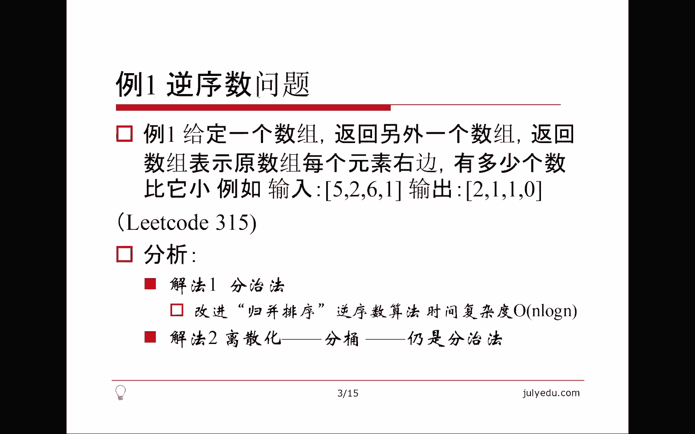

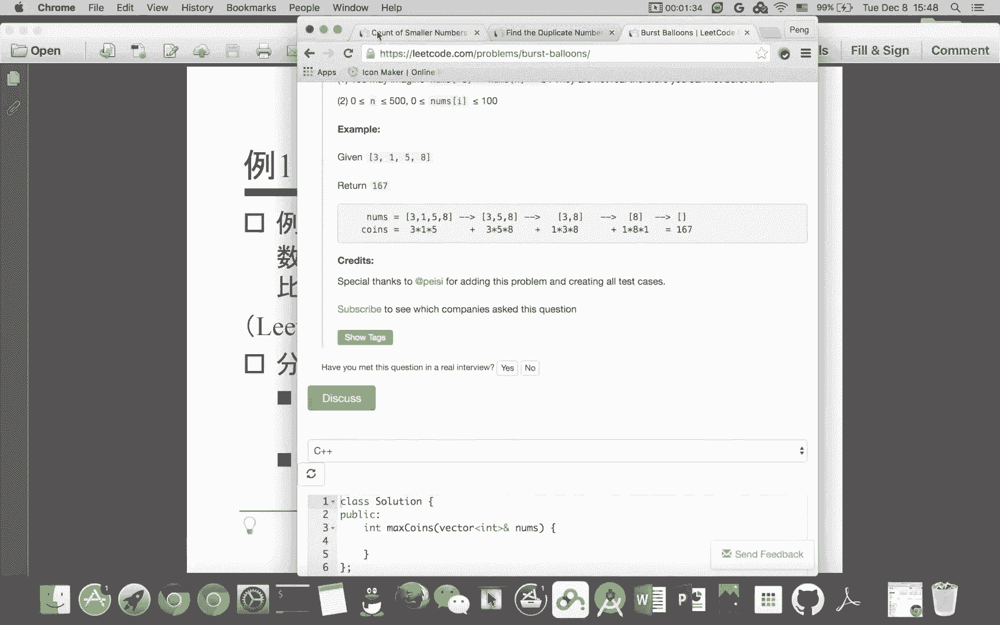

## 概述 📋

数组是算法中最基础的数据结构之一。本节课我们将聚焦于数组的实战应用，通过解决三个具体问题，学习如何将理论知识转化为代码。我们将重点关注算法的时间与空间复杂度优化，以及不同解法的核心思想。

## 问题一：计算右侧小于当前元素的个数 🔢

LeetCode第315题。给定一个整数数组，要求返回一个新数组，新数组的每个元素表示原数组中该位置元素右侧比它小的元素个数。例如，输入 `[5, 2, 6, 1]`，输出应为 `[2, 1, 1, 0]`。

这个问题本质上是计算每个元素的“逆序数”。我们将介绍三种不同的解法。

### 解法一：归并排序法

上一节我们介绍了问题，本节中我们来看看如何使用经典的归并排序算法来解决它。关键在于，我们不能直接对原数组排序，否则会丢失元素的原下标信息。因此，我们改为对下标数组进行排序。

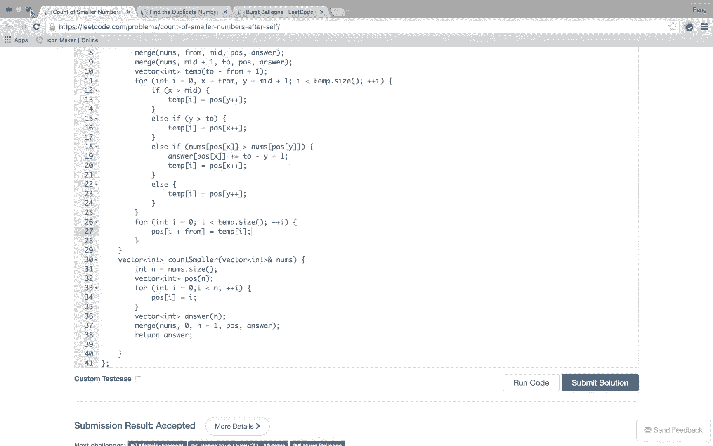

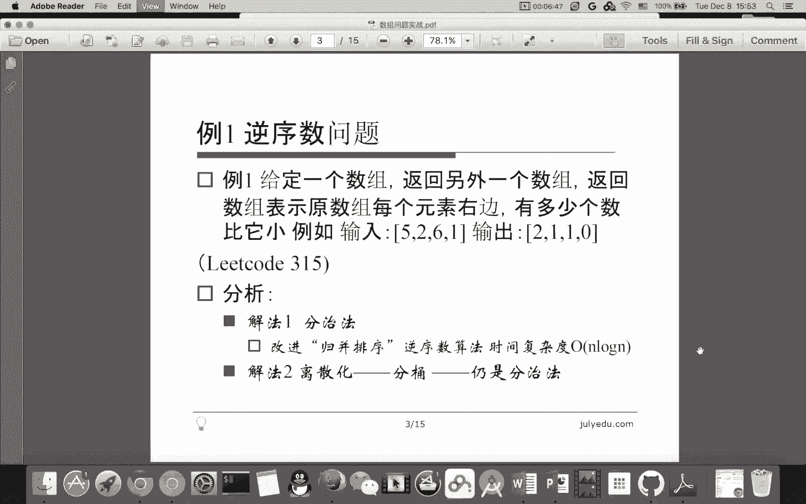

以下是实现步骤：

1.  定义一个递归函数 `mergeSort`，用于对下标数组 `indices` 在区间 `[left, right]` 内进行归并排序。
2.  在归并过程中，当合并两个已排序的子数组时，如果左侧子数组的当前元素大于右侧子数组的当前元素，则意味着左侧当前元素大于右侧当前元素及其之后的所有元素。此时，需要更新答案数组 `answer`。
3.  注意处理元素相等的情况，应优先移动右侧指针，以保证计数的正确性。

核心代码逻辑如下：
```cpp
void mergeSort(vector<int>& nums, vector<int>& indices, vector<int>& answer, int left, int right) {
    if (left >= right) return;
    int mid = left + (right - left) / 2;
    mergeSort(nums, indices, answer, left, mid);
    mergeSort(nums, indices, answer, mid + 1, right);
    // 合并并统计逆序数
    // ... 具体合并逻辑
}
```
这种方法的时间复杂度为 **O(n log n)**，空间复杂度为 **O(n)**。

### 解法二：离散化 + 分桶法

归并排序的代码量较大。本节我们来看看一种更直观的暴力优化方法——离散化加分桶。

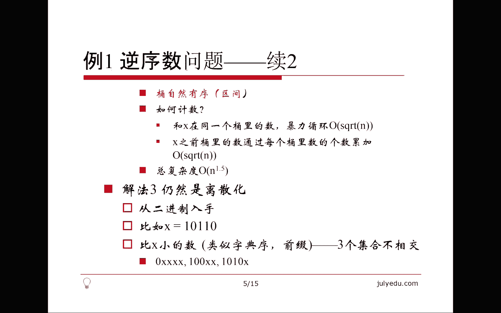

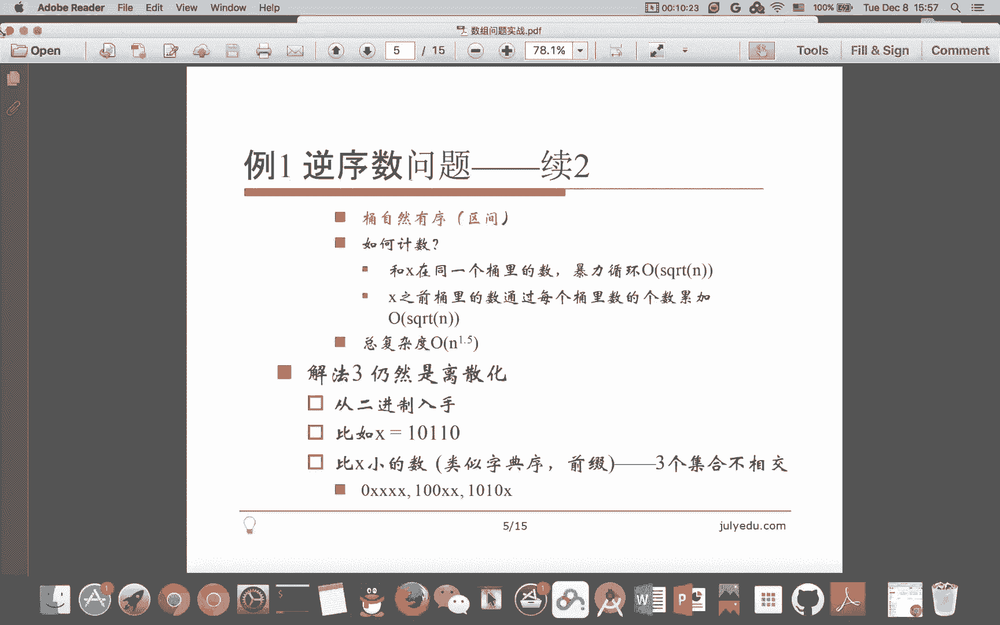

首先进行离散化：将原数组中的数字映射到 `0` 到 `n-1` 的范围内，忽略绝对大小，只保留相对顺序。这可以通过排序实现，时间复杂度为 **O(n log n)**。

接着进行分桶：我们将数值范围 `[0, n-1]` 分成大小为 `bucket_size = sqrt(n)` 的桶。然后从右向左遍历数组：
*   对于当前数 `x`，比它小的数由两部分组成：
    1.  所有编号比 `x` 所在桶编号小的桶中的数。我们可以直接累加这些桶的计数，复杂度为 **O(√n)**。
    2.  与 `x` 在同一个桶中，但数值比 `x` 小的数。我们需要遍历这个桶内的元素进行统计，复杂度也是 **O(√n)**。
*   统计完毕后，将当前数 `x` 加入对应的桶和计数数组中。

由于每个数处理一次的复杂度为 **O(√n)**，总时间复杂度为 **O(n√n)**。虽然比归并排序慢，但代码简洁，且易于理解。

### 解法三：离散化 + 二进制索引法

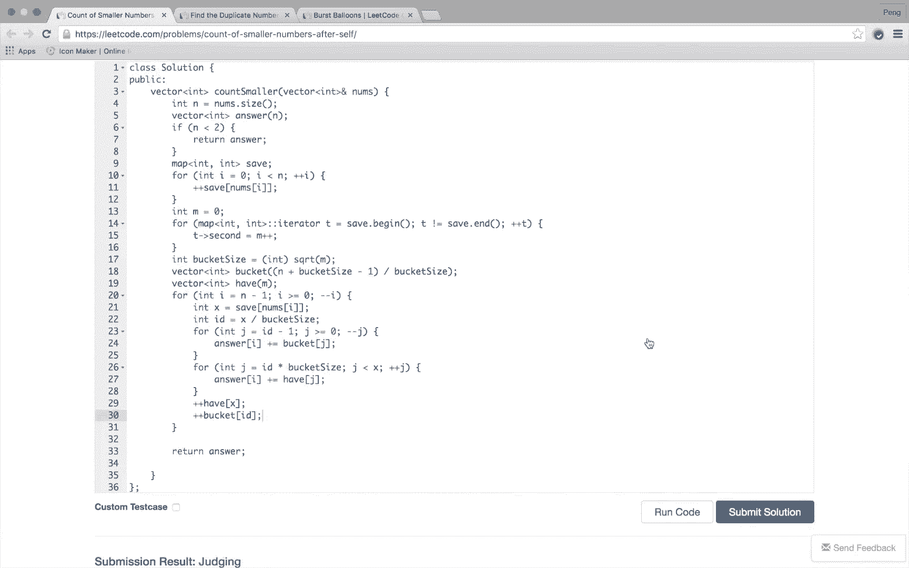

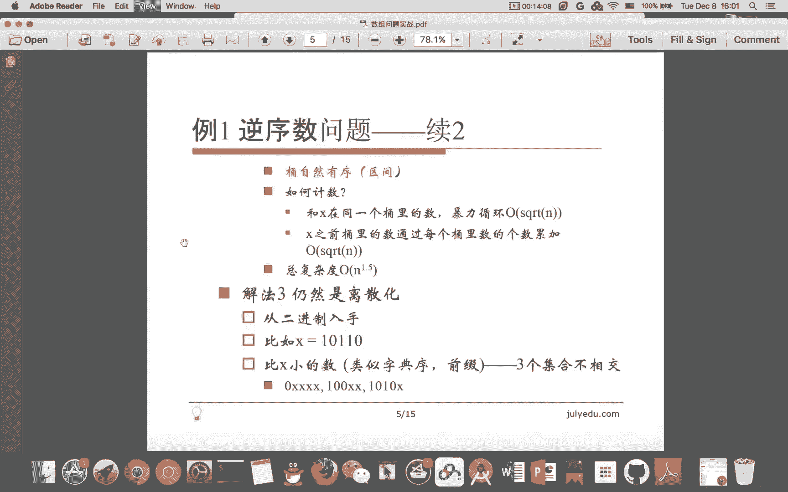

本节我们来看一种利用二进制位运算的巧妙方法，它也能达到 **O(n log n)** 的时间复杂度。

离散化步骤同上。核心思想是：对于任意一个数 `x`，比它小的数可以按二进制位分类。我们从最低位开始，将 `x` 右移。每当遇到 `x` 的某一位是 `1` 时，我们就将这一位变为 `0`，然后查看以这个新数为前缀的数出现了多少次（这些数都比 `x` 小）。

我们维护一个计数数组 `count`。从右向左遍历原数组（映射后的）：
1.  初始化答案 `ans[i] = 0`。
2.  对于当前数 `x`，只要 `x > 0`，就循环：
    *   如果 `x` 的最低位是 `1`，则 `ans[i] += count[x ^ 1]`（`x^1` 即把最低位 `1` 变为 `0`）。
    *   将 `count[x]++`。
    *   将 `x` 右移一位 (`x >>= 1`)。
3.  循环结束后，`ans[i]` 即为右侧小于 `nums[i]` 的元素个数。

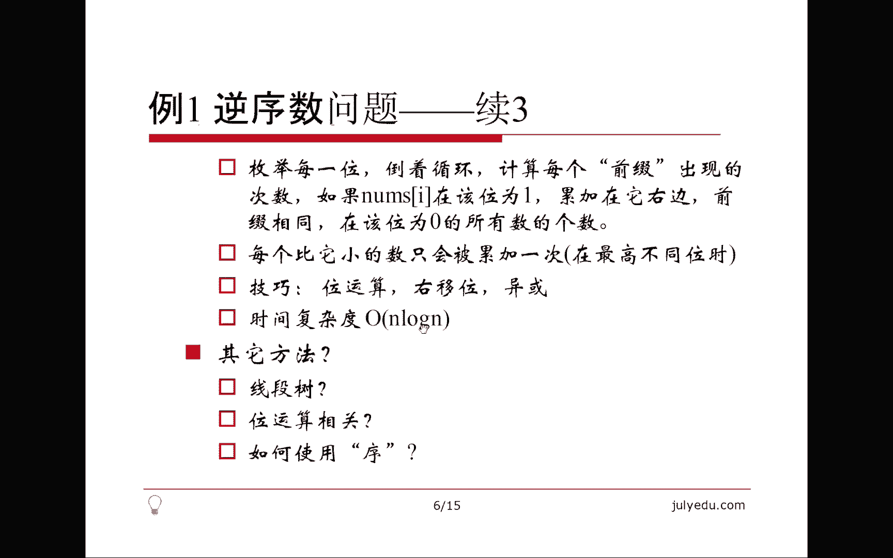

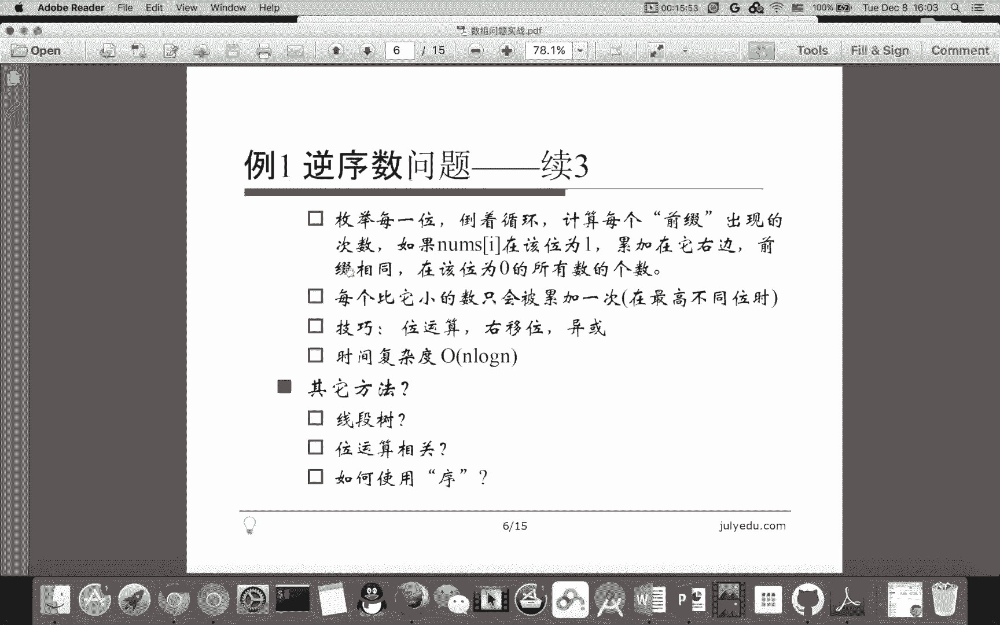

这种方法代码量小，且效率高。

## 问题二：寻找重复数 🔍

LeetCode第287题。给定一个包含 `n + 1` 个整数的数组 `nums`，其数字都在 `1` 到 `n` 之间（包含 `1` 和 `n`），可知至少存在一个重复的整数。假设只有一个重复的整数，找出这个重复的数。要求不能更改原数组，只能使用 **O(1)** 的额外空间，且时间复杂度小于 **O(n²)**。

### 解法一：二进制位运算法

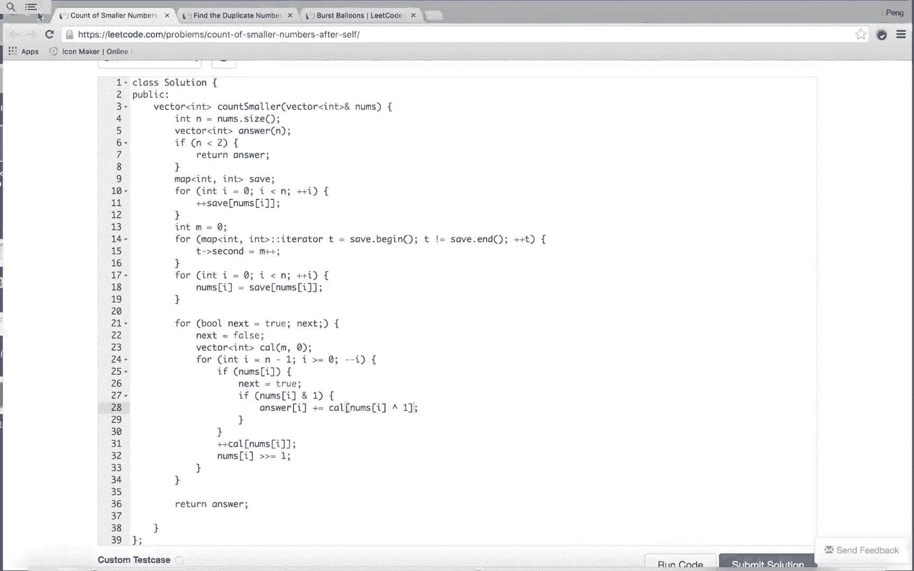

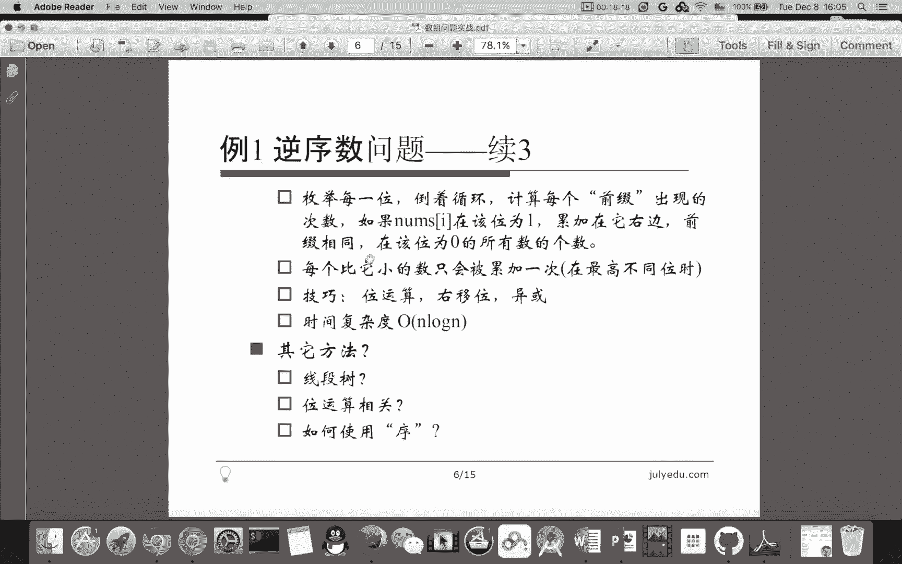

上一节我们处理了逆序数问题，本节中我们来看看如何利用二进制位来寻找重复数。由于数字范围是 `1` 到 `n`，这相当于天然做好了离散化。

思路是逐位确定重复数的二进制位。对于第 `i` 位：
*   计算 `1` 到 `n` 这 `n` 个数中，第 `i` 位为 `1` 的数的个数，记为 `cnt_expected`。
*   计算数组 `nums` 中（共 `n+1` 个数），第 `i` 位为 `1` 的数的个数，记为 `cnt_actual`。
*   如果 `cnt_actual > cnt_expected`，说明重复的数在第 `i` 位上是 `1`，否则是 `0`。

通过遍历所有二进制位（最多 `log n` 位），即可拼凑出重复的数。每次统计需要遍历整个数组，因此总时间复杂度为 **O(n log n)**。

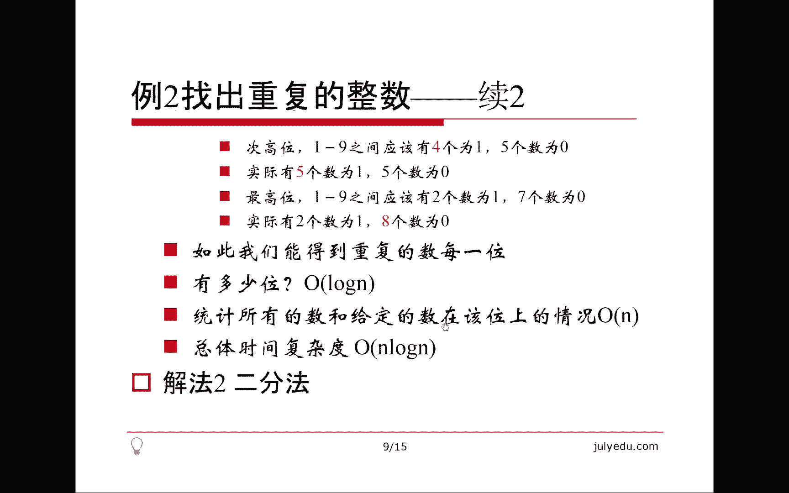

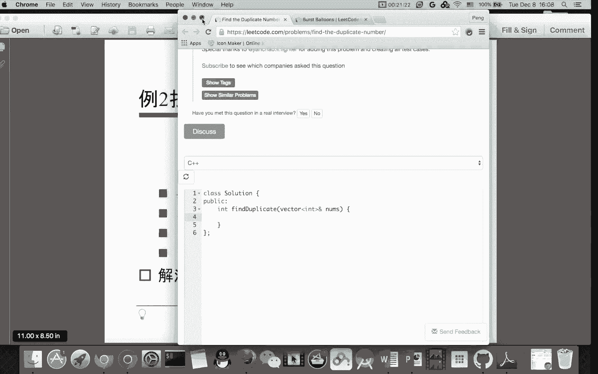

### 解法二：二分查找法

除了位运算，我们还可以使用二分查找的思想。虽然数组无序，但我们可以二分**数值的范围**。

设当前查找的数值范围为 `[left, right]`，计算中点 `mid`。统计原数组 `nums` 中，值在 `[left, mid]` 区间内的元素个数 `count`。
*   如果 `count > (mid - left + 1)`，说明重复的数一定在 `[left, mid]` 这个区间内（因为区间内应有的数字数量是 `mid-left+1`，现在多出来了）。
*   否则，重复的数在 `[mid+1, right]` 区间内。

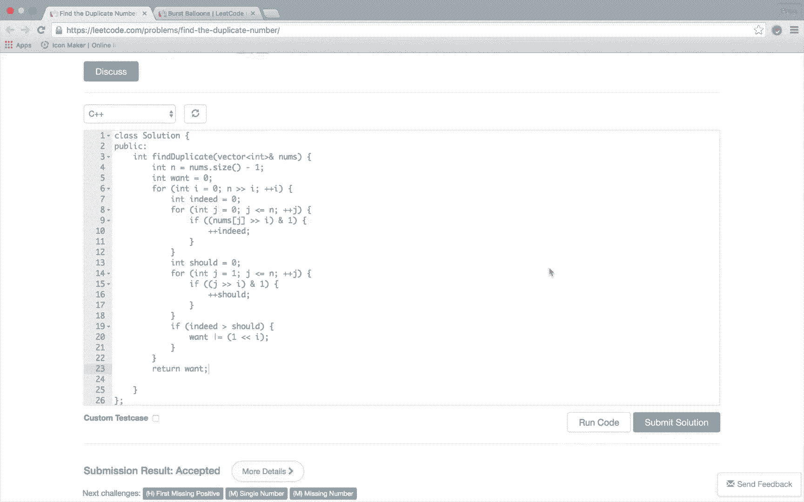

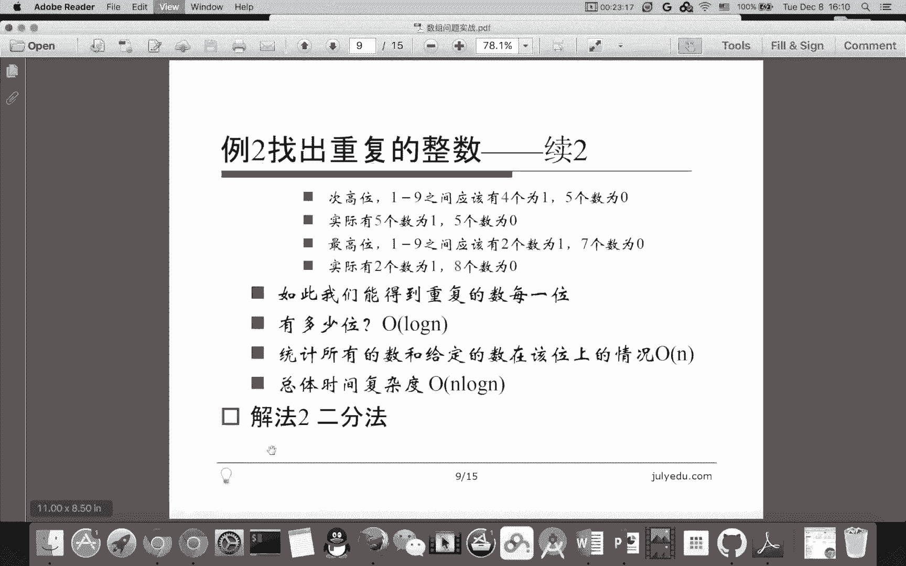

每次二分都将数值范围缩小一半，每次统计需要遍历整个数组，因此时间复杂度也是 **O(n log n)**。这种方法同样满足所有限制条件。

## 问题三：戳气球 🎈

LeetCode第312题。有 `n` 个气球，编号为 `0` 到 `n-1`，每个气球上都标有一个数字，这些数字存在数组 `nums` 中。现在要求你戳破所有的气球。戳破第 `i` 个气球，你可以获得 `nums[left] * nums[i] * nums[right]` 个硬币。这里的 `left` 和 `right` 代表和 `i` 相邻的两个气球的序号。注意当你戳破了气球 `i` 后，气球 `left` 和气球 `right` 就变成了相邻的气球。求所能获得硬币的最大数量。

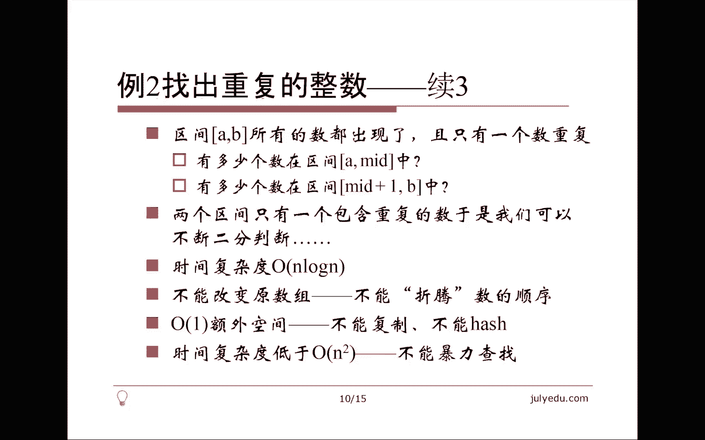

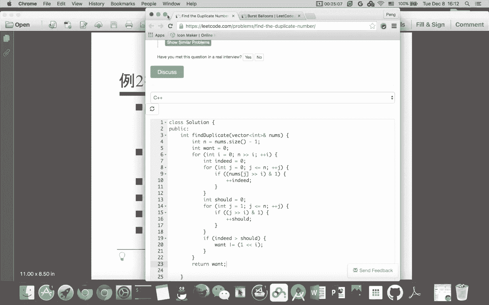

### 解法：动态规划法

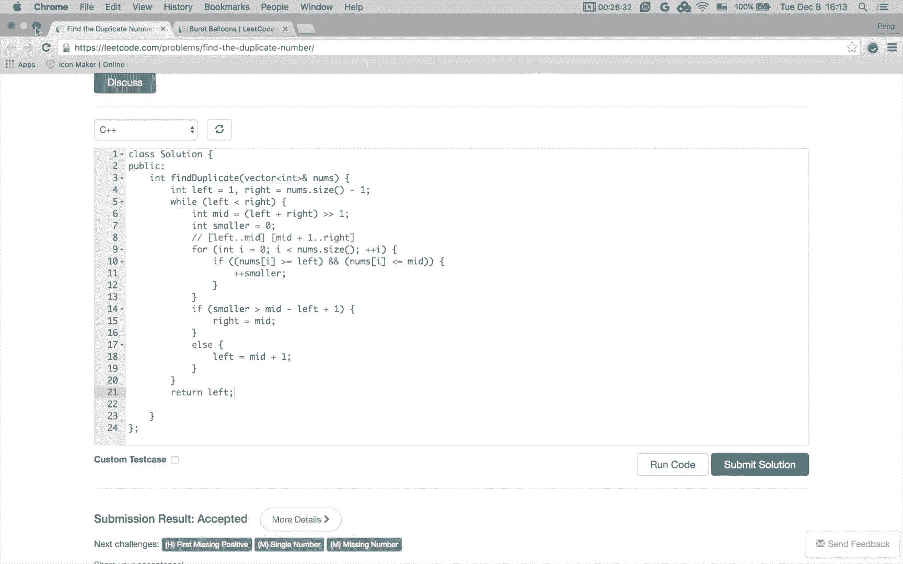

前两个问题我们关注了数组与序的关系，本节我们来看一个数组上的动态规划问题。戳气球的难点在于，每戳破一个气球，左右气球的相邻关系就会发生变化。

我们换个角度思考：**最后被戳破的气球是哪个？** 假设最后戳破的气球是 `k`，那么在戳破 `k` 之前，区间 `[0, k-1]` 和 `[k+1, n-1]` 的气球都已经被戳破了，并且这两个子问题相互独立。戳破 `k` 时，它的左右邻居就是原数组的 `nums[-1]`（边界外，视为1）和 `nums[n]`（边界外，视为1），或者说是其外部相邻的、尚未被戳破的“虚拟气球”。

因此，我们可以定义动态规划状态：
`dp[i][j]` 表示戳破开区间 `(i, j)`（即不戳 `i` 和 `j`）内的所有气球，能获得的最大硬币数。这里 `i` 和 `j` 是边界，可以理解为 `nums[-1]` 和 `nums[n]`。

状态转移方程：我们枚举区间 `(i, j)` 内**最后一个**被戳破的气球 `k`（`i < k < j`）。
*   戳破 `k` 时，区间 `(i, k)` 和 `(k, j)` 内的气球已经全部被戳破，所以 `k` 的左右邻居就是 `i` 和 `j`。
*   因此，戳破 `k` 获得的硬币为 `nums[i] * nums[k] * nums[j]`。
*   总收益为：`dp[i][k] + dp[k][j] + nums[i] * nums[k] * nums[j]`。

我们需要取所有可能的 `k` 中的最大值：
`dp[i][j] = max(dp[i][k] + dp[k][j] + nums[i] * nums[k] * nums[j])`，其中 `i < k < j`。

初始条件：当 `i + 1 >= j` 时，开区间内没有气球，`dp[i][j] = 0`。
最终答案：`dp[0][n+1]`，这里我们在原数组首尾添加值为 `1` 的虚拟气球。

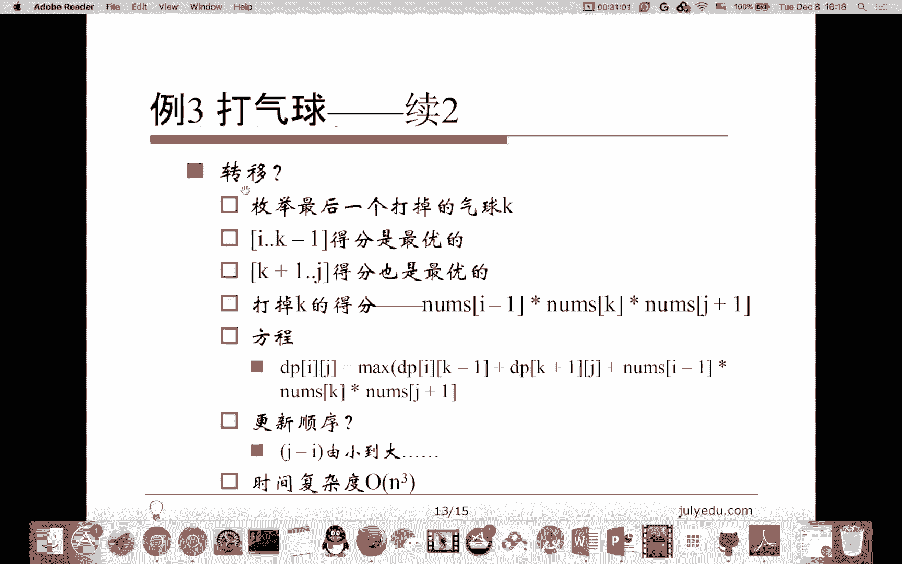

我们需要按区间长度从小到大的顺序来计算 `dp` 值。时间复杂度为 **O(n³)**，空间复杂度为 **O(n²)**。

核心代码结构如下：
```cpp
int maxCoins(vector<int>& nums) {
    int n = nums.size();
    vector<int> balloons(n + 2, 1);
    for (int i = 0; i < n; i++) balloons[i + 1] = nums[i];
    vector<vector<int>> dp(n + 2, vector<int>(n + 2, 0));
    for (int len = 2; len <= n + 1; len++) { // 区间长度
        for (int i = 0; i + len <= n + 1; i++) { // 区间起点
            int j = i + len;
            for (int k = i + 1; k < j; k++) { // 枚举最后戳破的气球k
                dp[i][j] = max(dp[i][j], dp[i][k] + dp[k][j] + balloons[i] * balloons[k] * balloons[j]);
            }
        }
    }
    return dp[0][n + 1];
}
```

## 总结 🏁

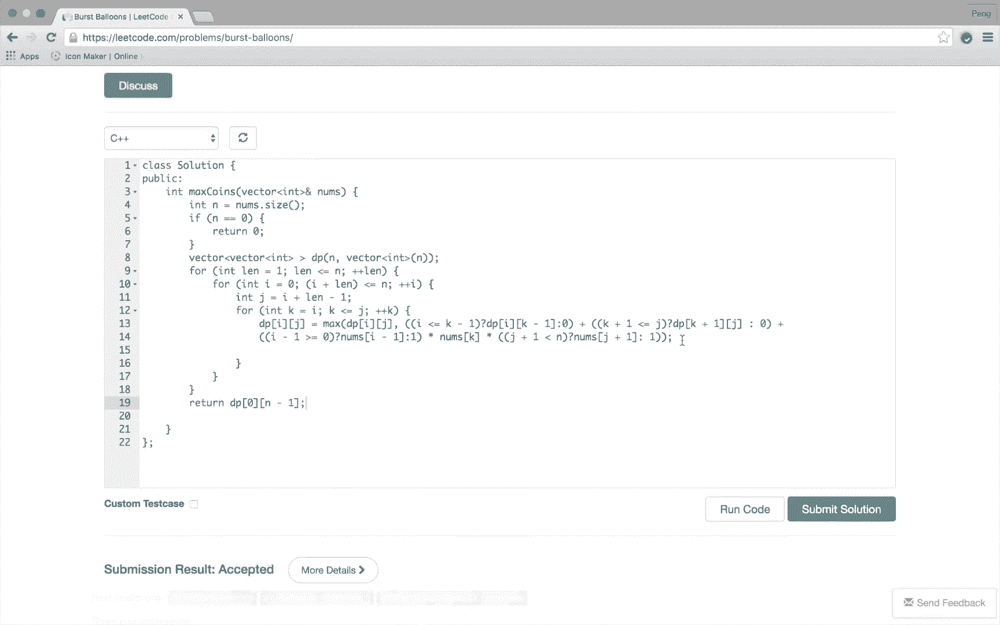

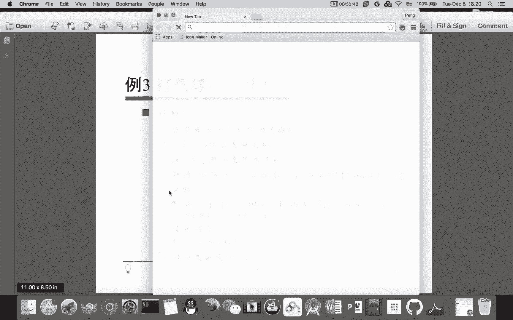

本节课我们一起学习了三个数组相关的经典算法问题：

1.  **计算右侧小于当前元素的个数**：我们掌握了归并排序、离散化分桶以及二进制索引三种解法，理解了如何利用“序”和二进制位来高效统计逆序对。
2.  **寻找重复数**：在严格的限制条件下，我们运用二进制位统计和二分查找值域两种 **O(n log n)** 的方法找到了重复数，避免了修改数组和使用额外空间。
3.  **戳气球**：我们学习了如何将复杂的交互性问题转化为动态规划模型，通过定义“最后戳破的气球”这一状态，巧妙地处理了状态转移的依赖关系。

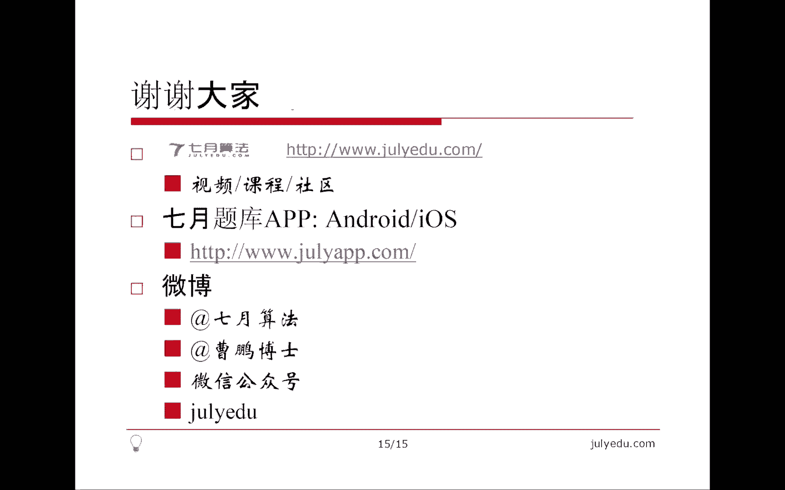

数组作为基础数据结构，其相关算法博大精深。解决数组问题不仅需要熟悉排序、查找、二分等基础操作，更需要灵活运用位运算、分治、动态规划等高级技巧，并时常进行“一题多解”的思考与练习。希望本课的内容能为大家的算法学习之路提供有益的启发。