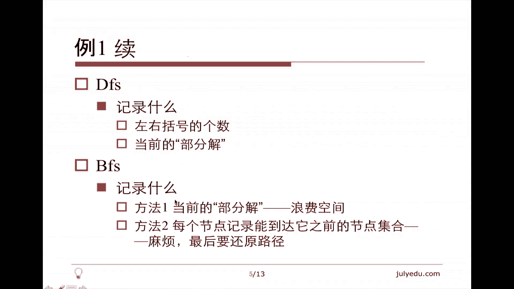
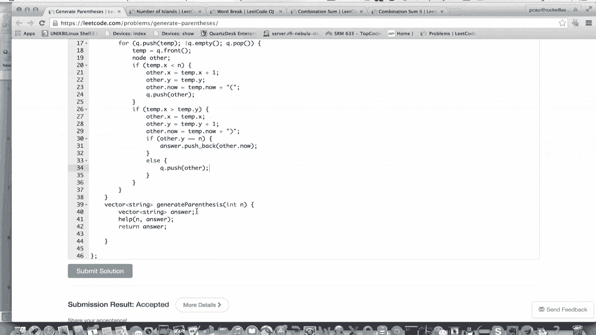
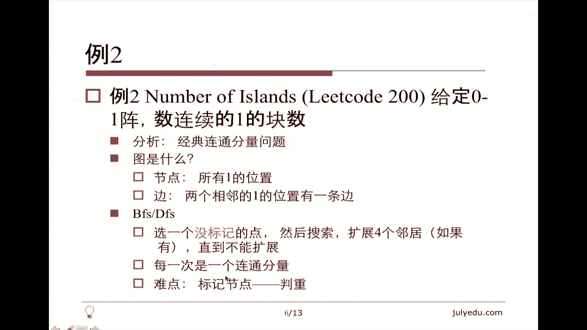
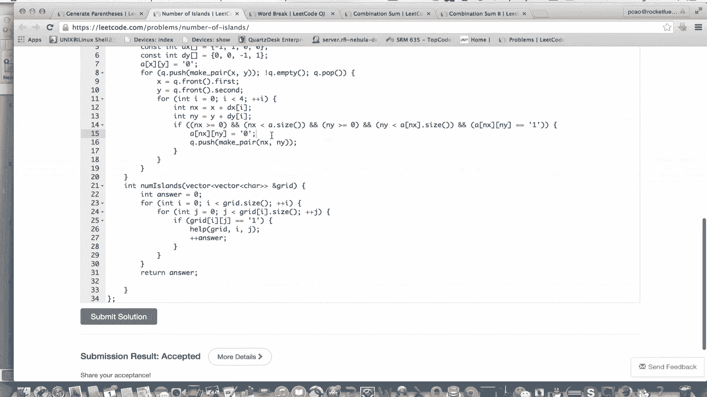
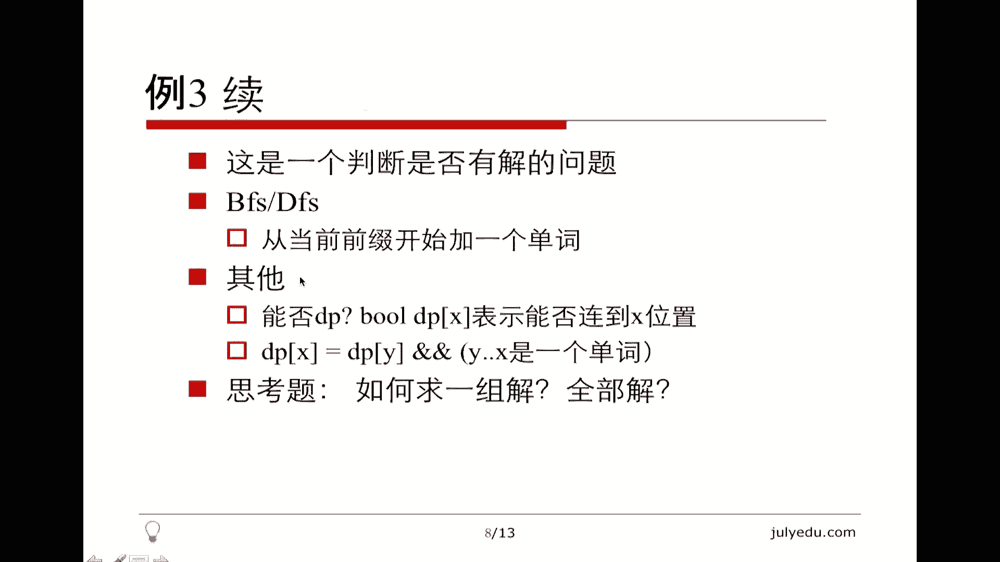
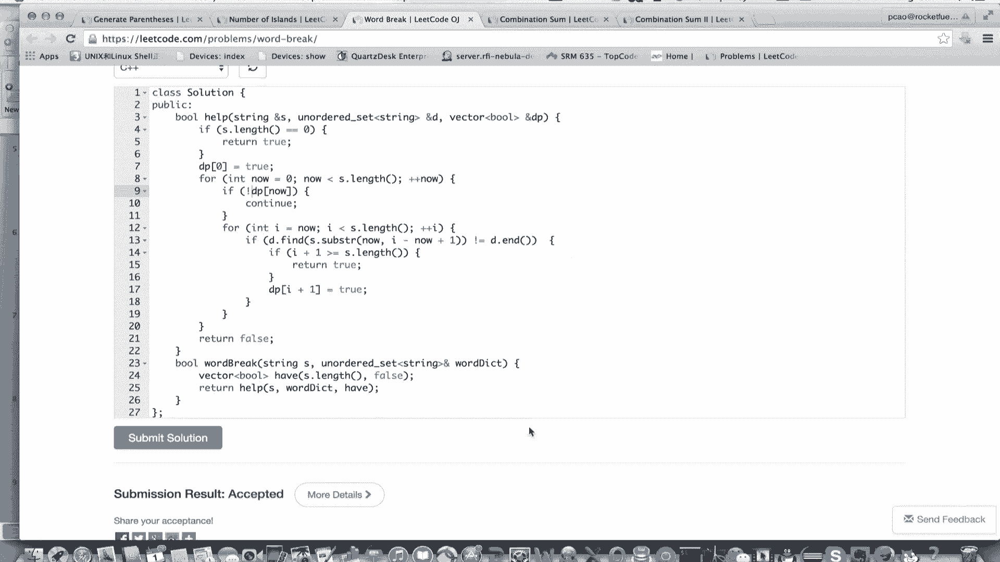
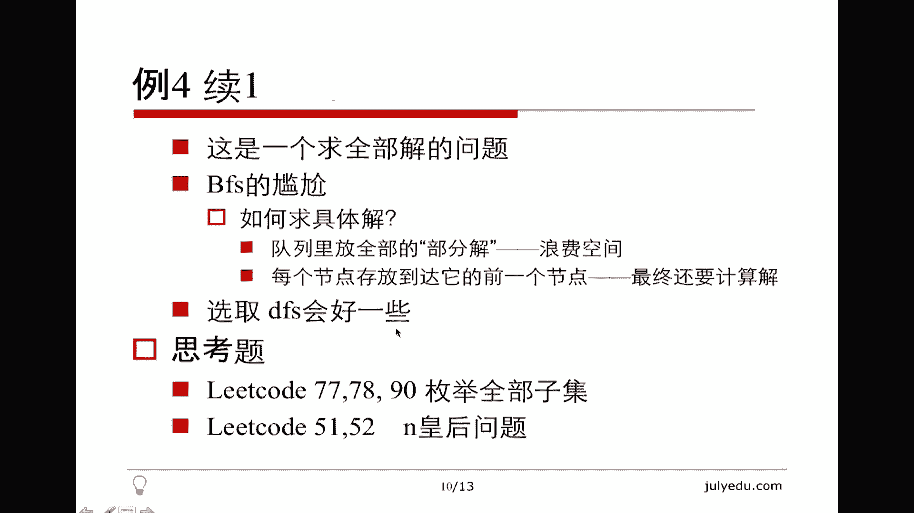
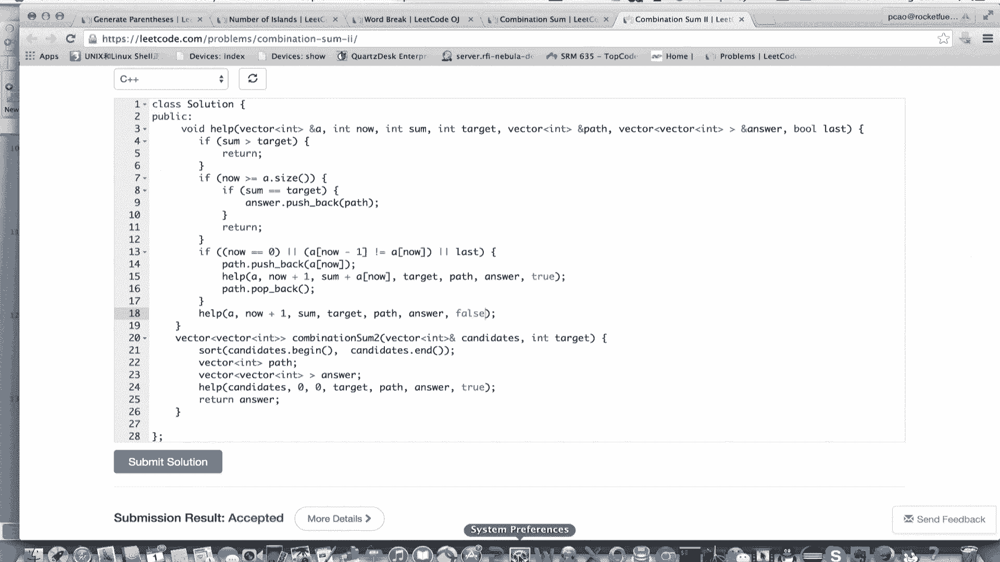

# 七月在线—算法coding公开课 - P6：图搜索实战（直播coding） 🧭


在本节课中，我们将学习图搜索算法的实战应用。图搜索是深度优先搜索（DFS）和广度优先搜索（BFS）的统称。我们将通过几个经典例题，学习如何将实际问题抽象为图搜索问题，并分别用DFS和BFS进行求解。

## 课程简介 📖

上一节我们介绍了图搜索的基本概念，本节中我们来看看如何将其应用于实战。

图的核心是**节点**和**边**。节点代表元素，边代表元素之间的关系。在题目中，图通常是**隐式**的，需要我们自行发现并构建。

图搜索相关的题型主要分为以下几大类：



以下是常见的图搜索题型：
1.  **求连通分量**：相对简单和单一。
2.  **求任意一组解**：与判断是否有解等价。
3.  **枚举求全部解**：找出所有可能的解。
4.  **求满足特定要求的解**：介于求任意解和求全部解之间。推荐在搜索过程中直接维护解的合法性，这比先求全部解再过滤更高效。

## 例题一：括号生成 🧩

**题目**：LeetCode 22题。给定数字 `N`，生成所有由 `N` 对括号组成的有效组合。

**问题分析**：这是一个求全部解的问题。关键在于定义“合法”：在任何位置，左括号的数量不能少于右括号的数量。

**图的构建**：
*   **节点**：用 `(X, Y)` 表示，其中 `X` 是当前左括号数，`Y` 是当前右括号数。为保证合法性，始终有 `X >= Y`。
*   **边**：从节点 `(X, Y)` 出发，可以添加一个左括号到达 `(X+1, Y)`，或者（当 `X > Y` 时）添加一个右括号到达 `(X, Y+1)`。
*   **目标**：寻找所有从起点 `(0, 0)` 到终点 `(N, N)` 的路径，每条路径对应一个有效括号序列。

### DFS解法



DFS的思路是递归探索，每次在当前部分解的基础上进行修改。

```cpp
class Solution {
public:
    vector<string> generateParenthesis(int n) {
        vector<string> answer;
        dfs(answer, "", 0, 0, n);
        return answer;
    }

    void dfs(vector<string>& ans, string str, int x, int y, int n) {
        if (y == n) { // 找到一组解
            ans.push_back(str);
            return;
        }
        if (x < n) { // 可以加左括号
            dfs(ans, str + '(', x + 1, y, n);
        }
        if (x > y) { // 可以加右括号
            dfs(ans, str + ')', x, y + 1, n);
        }
    }
};
```

### BFS解法



BFS需要借助队列，并记录每个状态对应的部分解，空间消耗通常更大。

```cpp
class Solution {
public:
    vector<string> generateParenthesis(int n) {
        vector<string> answer;
        if (n == 0) {
            answer.push_back("");
            return answer;
        }
        // 队列元素：当前左括号数x，右括号数y，部分解str
        queue<tuple<int, int, string>> q;
        q.push({0, 0, ""});

        while (!q.empty()) {
            auto [x, y, str] = q.front();
            q.pop();

            if (x < n) { // 扩展左括号
                q.push({x + 1, y, str + '('});
            }
            if (x > y) { // 扩展右括号
                string newStr = str + ')';
                if (y + 1 == n) { // 找到一个完整解
                    answer.push_back(newStr);
                } else {
                    q.push({x, y + 1, newStr});
                }
            }
        }
        return answer;
    }
};
```

**小结**：对于求全部解的问题，DFS代码通常更简洁。BFS需要显式维护队列和状态，代码较长。

## 例题二：岛屿数量 🏝️

**题目**：LeetCode 200题。给定一个由 `'1'`（陆地）和 `'0'`（水）组成的二维网格，计算岛屿的数量。岛屿由水平或垂直方向上相邻的陆地连接形成。

**问题分析**：这是一个经典的求**连通分量**问题。



**图的构建**：
*   **节点**：每个值为 `'1'` 的网格位置 `(i, j)`。
*   **边**：如果两个 `'1'` 位置在水平或垂直方向相邻，则它们之间有一条边。
*   **目标**：找出图中连通分量的数量。关键在于**标记访问过的节点（判重）**，避免重复访问。

### DFS解法

```cpp
class Solution {
public:
    int numIslands(vector<vector<char>>& grid) {
        if (grid.empty()) return 0;
        int m = grid.size(), n = grid[0].size();
        int count = 0;
        for (int i = 0; i < m; ++i) {
            for (int j = 0; j < n; ++j) {
                if (grid[i][j] == '1') {
                    dfs(grid, i, j);
                    ++count; // 找到一个连通分量
                }
            }
        }
        return count;
    }

    void dfs(vector<vector<char>>& grid, int x, int y) {
        // 边界检查及合法性检查
        if (x < 0 || x >= grid.size() || y < 0 || y >= grid[0].size() || grid[x][y] != '1') {
            return;
        }
        grid[x][y] = '0'; // 标记为已访问
        // 递归搜索四个方向
        dfs(grid, x + 1, y);
        dfs(grid, x - 1, y);
        dfs(grid, x, y + 1);
        dfs(grid, x, y - 1);
    }
};
```

### BFS解法

```cpp
class Solution {
public:
    int numIslands(vector<vector<char>>& grid) {
        if (grid.empty()) return 0;
        int m = grid.size(), n = grid[0].size();
        int count = 0;
        // 方向数组：上下左右
        vector<pair<int, int>> directions = {{1,0}, {-1,0}, {0,1}, {0,-1}};

        for (int i = 0; i < m; ++i) {
            for (int j = 0; j < n; ++j) {
                if (grid[i][j] == '1') {
                    ++count;
                    queue<pair<int, int>> q;
                    q.push({i, j});
                    grid[i][j] = '0'; // 标记起点
                    while (!q.empty()) {
                        auto [x, y] = q.front();
                        q.pop();
                        for (auto& dir : directions) {
                            int nx = x + dir.first;
                            int ny = y + dir.second;
                            if (nx >= 0 && nx < m && ny >= 0 && ny < n && grid[nx][ny] == '1') {
                                grid[nx][ny] = '0'; // 标记为已访问
                                q.push({nx, ny});
                            }
                        }
                    }
                }
            }
        }
        return count;
    }
};
```



**小结**：对于连通分量问题，DFS和BFS思想一致，都是从一个起点出发，标记所有能到达的点。DFS实现更简洁。

## 例题三：单词拆分 🔗

**题目**：LeetCode 139题。给定一个非空字符串 `s` 和一个包含非空单词列表的字典 `wordDict`，判断 `s` 是否可以被空格拆分为一个或多个字典中的单词。

**问题分析**：这是一个判断是否有解（或求一组解）的问题。

**图的构建**：
*   **节点**：整数 `i`，表示字符串 `s` 的前 `i` 个字符（前缀）。
*   **边**：如果从位置 `i` 开始，截取的一个子串是字典中的单词，那么就有一条从节点 `i` 到节点 `i+单词长度` 的边。
*   **目标**：判断是否存在一条从节点 `0` 到节点 `s.length()` 的路径。同样需要**判重**，避免对同一节点重复搜索。

### DFS解法

```cpp
class Solution {
public:
    bool wordBreak(string s, vector<string>& wordDict) {
        unordered_set<string> dict(wordDict.begin(), wordDict.end());
        vector<bool> visited(s.length(), false);
        return dfs(s, 0, dict, visited);
    }

    bool dfs(const string& s, int start, const unordered_set<string>& dict, vector<bool>& visited) {
        if (start >= s.length()) return true; // 成功匹配完整个字符串
        if (visited[start]) return false; // 该起点已搜索过且失败
        visited[start] = true;

        for (int end = start + 1; end <= s.length(); ++end) {
            string sub = s.substr(start, end - start);
            if (dict.find(sub) != dict.end() && dfs(s, end, dict, visited)) {
                return true;
            }
        }
        return false;
    }
};
```

### BFS解法



```cpp
class Solution {
public:
    bool wordBreak(string s, vector<string>& wordDict) {
        unordered_set<string> dict(wordDict.begin(), wordDict.end());
        vector<bool> visited(s.length(), false);
        queue<int> q;
        q.push(0);

        while (!q.empty()) {
            int start = q.front();
            q.pop();
            if (!visited[start]) {
                for (int end = start + 1; end <= s.length(); ++end) {
                    string sub = s.substr(start, end - start);
                    if (dict.find(sub) != dict.end()) {
                        if (end == s.length()) return true;
                        q.push(end);
                    }
                }
                visited[start] = true;
            }
        }
        return false;
    }
};
```

### 动态规划思路



此问题也可用类似动态规划的“打表”思路解决，状态 `dp[i]` 表示前 `i` 个字符能否被拆分。

```cpp
class Solution {
public:
    bool wordBreak(string s, vector<string>& wordDict) {
        unordered_set<string> dict(wordDict.begin(), wordDict.end());
        vector<bool> dp(s.length() + 1, false);
        dp[0] = true; // 空串可以被拆分

        for (int i = 1; i <= s.length(); ++i) {
            for (int j = 0; j < i; ++j) {
                // 如果前j个字符可拆分，且子串s[j, i)在字典中，则前i个字符可拆分
                if (dp[j] && dict.find(s.substr(j, i - j)) != dict.end()) {
                    dp[i] = true;
                    break;
                }
            }
        }
        return dp[s.length()];
    }
};
```

**小结**：单词拆分问题展示了图搜索与动态规划之间的联系。DFS/BFS更直观，而DP方法在某些情况下可能更高效。

## 例题四：组合总和 🎯

**题目**：LeetCode 39题 & 40题。给定一个无重复元素的整数数组 `candidates` 和一个目标数 `target`，找出所有和为目标数的组合。39题中数字可无限重复选取；40题中每个数字在每个组合中只能使用一次。

**问题分析**：这是求**满足条件的所有解**的问题，通常使用DFS（回溯）更为方便。

**图的构建**（以39题为例）：
*   **节点**：当前的和 `sum` 以及当前考虑的数字下标 `index`。
*   **边**：选择当前数字（`sum` 增加，`index` 可能不变或变化）或不选择当前数字（`index` 增加）。
*   **目标**：找到所有从起点 `(0, 0)` 出发，到达 `sum == target` 的路径。

### 解法（LeetCode 39，数字可重复）

```cpp
class Solution {
public:
    vector<vector<int>> combinationSum(vector<int>& candidates, int target) {
        vector<vector<int>> answer;
        vector<int> path;
        sort(candidates.begin(), candidates.end()); // 排序便于处理
        dfs(candidates, target, 0, 0, path, answer);
        return answer;
    }

    void dfs(vector<int>& nums, int target, int index, int sum,
             vector<int>& path, vector<vector<int>>& ans) {
        if (sum > target) return; // 剪枝
        if (sum == target) {
            ans.push_back(path);
            return;
        }
        for (int i = index; i < nums.size(); ++i) {
            path.push_back(nums[i]);
            dfs(nums, target, i, sum + nums[i], path, ans); // 注意i不变，可重复选取
            path.pop_back(); // 回溯
        }
    }
};
```

### 解法（LeetCode 40，数字不可重复）

```cpp
class Solution {
public:
    vector<vector<int>> combinationSum2(vector<int>& candidates, int target) {
        vector<vector<int>> answer;
        vector<int> path;
        sort(candidates.begin(), candidates.end());
        dfs(candidates, target, 0, 0, path, answer);
        return answer;
    }

    void dfs(vector<int>& nums, int target, int index, int sum,
             vector<int>& path, vector<vector<int>>& ans) {
        if (sum > target) return;
        if (sum == target) {
            ans.push_back(path);
            return;
        }
        for (int i = index; i < nums.size(); ++i) {
            // 关键：跳过同一层中相同的元素，避免重复组合
            if (i > index && nums[i] == nums[i-1]) continue;
            path.push_back(nums[i]);
            dfs(nums, target, i + 1, sum + nums[i], path, ans); // i+1，不可重复选取
            path.pop_back();
        }
    }
};
```



**小结**：对于求所有组合的问题，DFS回溯是天然的工具。通过排序和跳过特定条件（如重复元素），可以有效去重和剪枝。

## 总结与思考 🧠

本节课中我们一起学习了图搜索算法的实战应用。

1.  **隐式图的构建**：关键是识别问题中的“状态”（节点）和“状态转移”（边）。
2.  **问题类型与算法选择**：
    *   **连通分量 / 判断有解**：DFS和BFS均可，实现难度相近。
    *   **求任意一组解**：DFS通常更简单。
    *   **求全部解 / 满足条件的解**：**强烈推荐DFS（回溯）**。它通过在单个解路径上修改和回溯来探索所有可能，代码简洁。BFS需要存储大量中间状态，且记录路径复杂。
    *   **求最优解（如最短路径）**：BFS更具优势，因为它按层搜索，首次到达目标即为最短。
3.  **核心技巧**：
    *   **状态标记（判重）**：防止在图中绕圈，对于DFS/BFS都至关重要。
    *   **剪枝**：在搜索过程中提前排除无效分支，提升效率。
    *   **路径记录**：DFS回溯时自然记录；BFS需要额外维护前驱信息。

**延伸思考**：LeetCode 77/78/90（子集问题）、51/52（N皇后问题）都可以套用DFS回溯的框架。对于组合总和问题，当 `target` 较小时，也可以用动态规划的思路求解，但记录具体组合方案依然需要类似回溯的方法。


希望本课程能帮助你更好地理解和运用图搜索算法。