# 七月在线—算法coding公开课 - P7：字符串实战（直播coding） 🧵


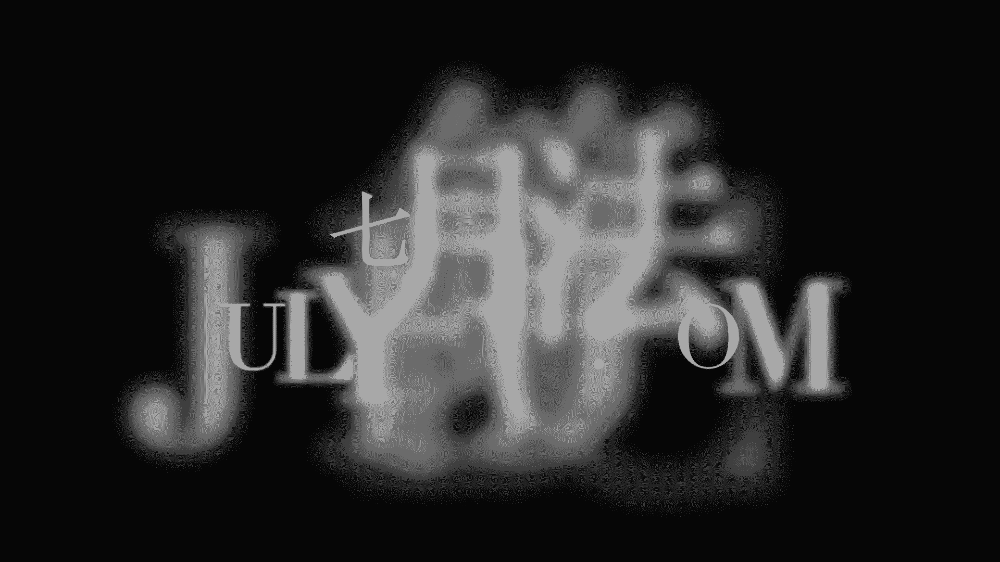

在本节课中，我们将学习四个典型的字符串处理问题。我们将从简单的滑动窗口开始，逐步深入到使用栈和动态规划解决更复杂的问题。课程内容旨在帮助初学者理解核心概念，并通过代码示例掌握解题思路。

---

## 概述 📋

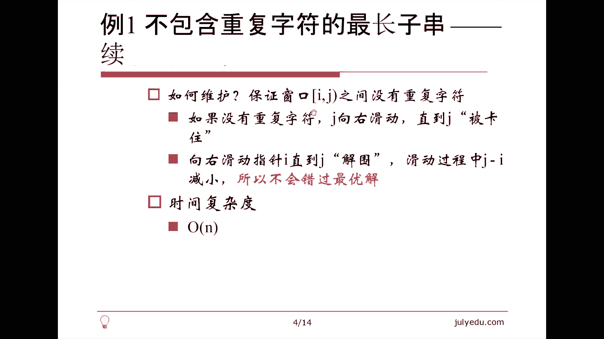

本节课我们将要学习四个字符串实战问题：
1.  无重复字符的最长子串（滑动窗口）
2.  去除重复字母（贪心/栈）
3.  翻转与交错字符串（栈的扩展应用）
4.  最长有效括号（动态规划/BFS）

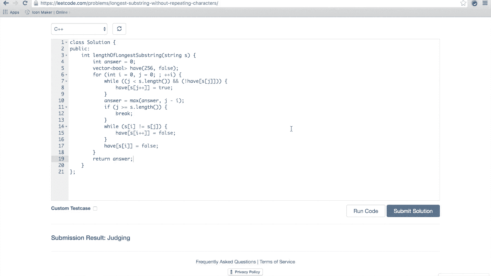

这些问题难度递增，涵盖了字符串处理中的多种核心技巧。

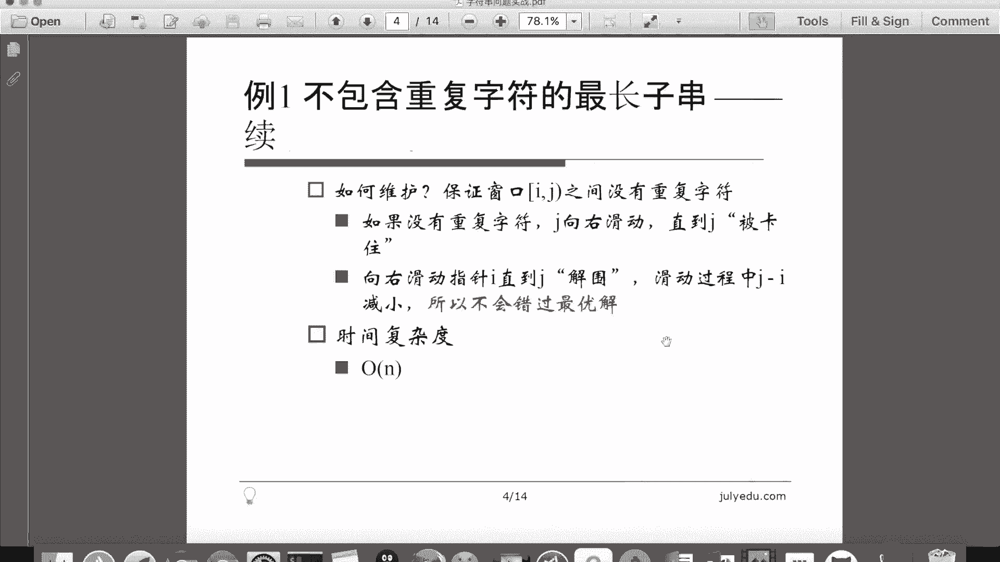

---

## 问题一：无重复字符的最长子串 🪟

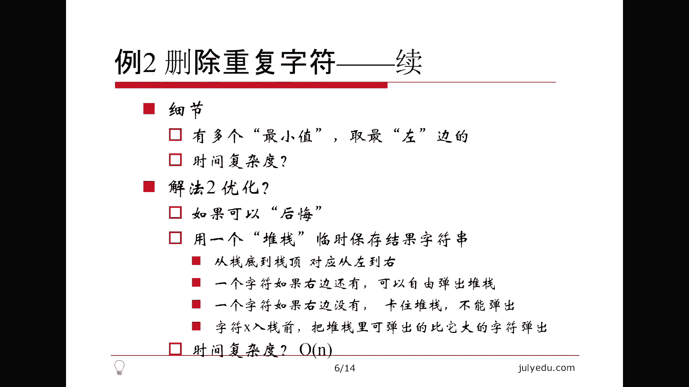

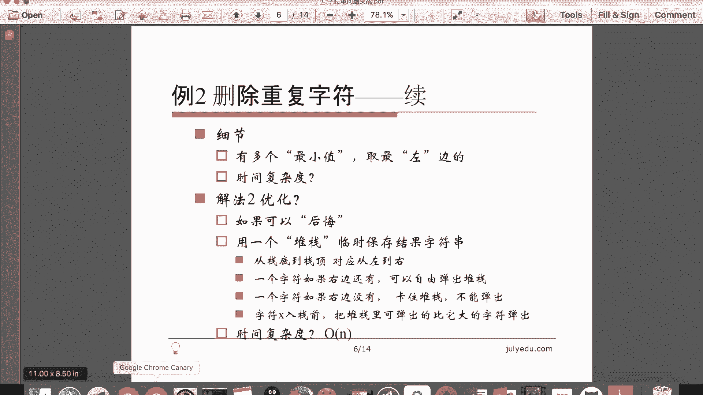

上一节我们介绍了课程概述，本节中我们来看看第一个问题：给定一个字符串，返回其不包含重复字符的最长子串的长度。

核心思路是使用**滑动窗口**（或双指针）技术。我们动态维护一个窗口 `[i, j)`，保证窗口内的字符不重复。当窗口满足条件时，向右移动 `j` 以扩大窗口；当 `j` 指向的字符在窗口内已存在时，则向右移动 `i` 以缩小窗口，直到窗口内再次无重复字符。

以下是实现该算法的关键步骤：

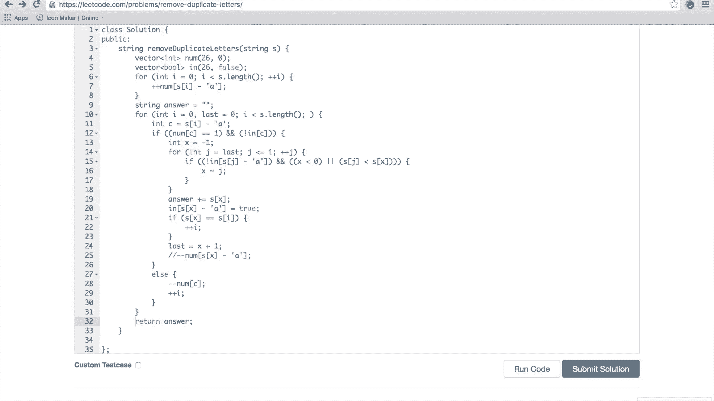

*   使用一个布尔数组 `have[256]` 来记录当前窗口内有哪些字符。
*   初始化 `i = 0`, `j = 0`, `answer = 0`。
*   循环执行以下操作：
    *   当 `j` 未越界且 `s[j]` 不在当前窗口内时，将 `s[j]` 加入窗口（`have[s[j]] = true`），并更新 `answer`，然后 `j++`。
    *   否则，将 `s[i]` 移出窗口（`have[s[i]] = false`），然后 `i++`。
*   循环结束后，返回 `answer`。

```cpp
int lengthOfLongestSubstring(string s) {
    int answer = 0;
    bool have[256] = {false};
    int i = 0, j = 0;
    int n = s.length();
    while (true) {
        if (j < n && !have[s[j]]) {
            have[s[j]] = true;
            answer = max(answer, j - i + 1);
            j++;
        } else {
            if (j >= n) break;
            while (s[i] != s[j]) {
                have[s[i]] = false;
                i++;
            }
            have[s[i]] = false;
            i++;
        }
    }
    return answer;
}
```

---

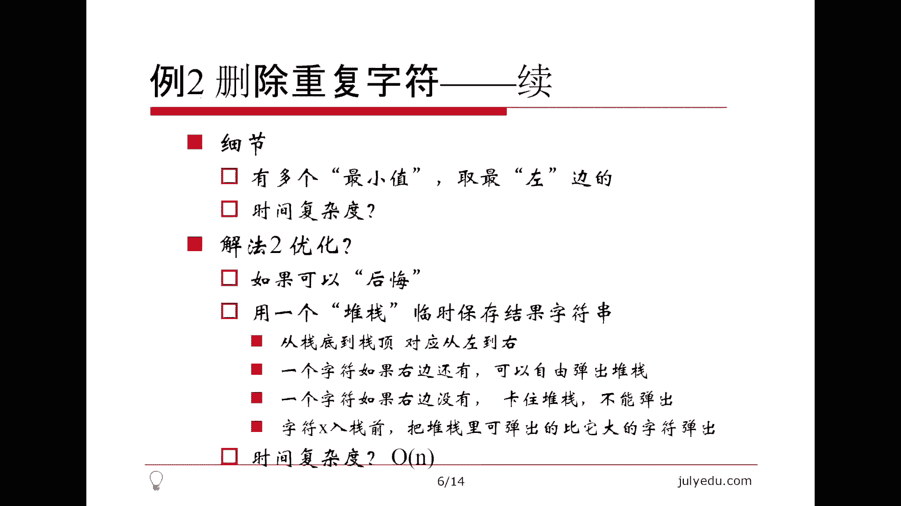

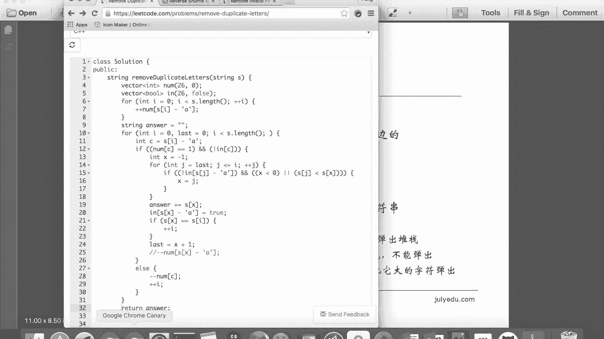

## 问题二：去除重复字母 🔤

上一节我们介绍了滑动窗口，本节中我们来看看一个去重问题：给定一个仅包含小写字母的字符串，去除字符串中的重复字母，使得每个字母只出现一次，并且返回结果的字典序最小。

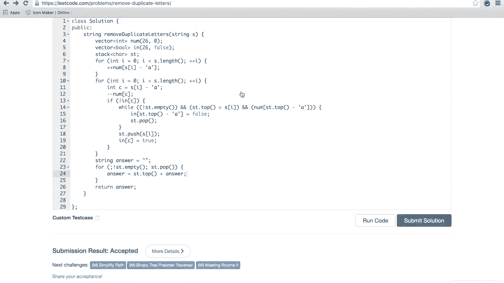

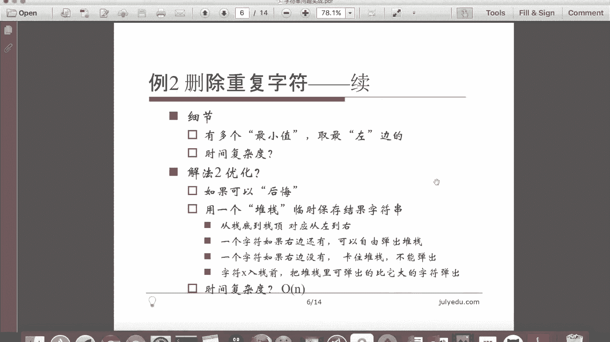

核心思路是使用**栈**来构建结果。我们希望栈底（结果字符串的开头）的字母尽可能小。遍历字符串，对于每个字符 `c`：
1.  如果 `c` 已经在栈中，则跳过。
2.  如果 `c` 不在栈中，则检查栈顶元素 `t`：
    *   如果 `t > c` 且 `t` 在后续字符串中还会出现，那么弹出 `t`（因为后面还有机会把它加回来，并且用 `c` 开头能得到更小的字典序）。
    *   重复此过程，直到栈顶元素不满足弹出条件。
3.  将 `c` 压入栈中。

以下是实现该算法的关键数据结构与步骤：

*   使用一个整型数组 `count[26]` 记录每个字符在剩余字符串中出现的次数。
*   使用一个布尔数组 `inStack[26]` 记录字符是否已在栈中。
*   使用一个栈 `stk` 来构建结果。
*   遍历字符串，对于每个字符 `c`：
    *   将 `count[c]` 减1。
    *   如果 `inStack[c]` 为真，跳过。
    *   否则，当栈非空，且栈顶字符 `top > c`，且 `count[top] > 0`（后面还有）时，弹出栈顶，并设置 `inStack[top] = false`。
    *   将 `c` 压栈，并设置 `inStack[c] = true`。
*   遍历结束后，将栈中字符从底到顶拼接成字符串返回。

```cpp
string removeDuplicateLetters(string s) {
    vector<int> count(26, 0);
    vector<bool> inStack(26, false);
    stack<char> stk;
    for (char c : s) count[c - 'a']++;
    for (char c : s) {
        count[c - 'a']--;
        if (inStack[c - 'a']) continue;
        while (!stk.empty() && stk.top() > c && count[stk.top() - 'a'] > 0) {
            inStack[stk.top() - 'a'] = false;
            stk.pop();
        }
        stk.push(c);
        inStack[c - 'a'] = true;
    }
    string ans;
    while (!stk.empty()) {
        ans = stk.top() + ans;
        stk.pop();
    }
    return ans;
}
```

---

## 问题三：翻转与交错字符串 🔄

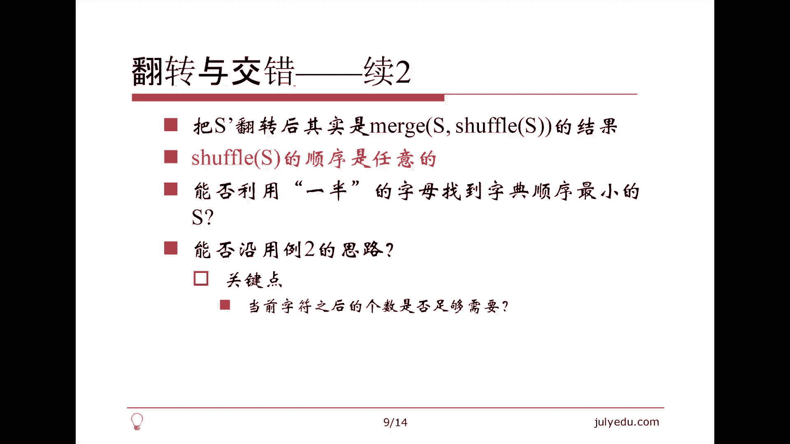

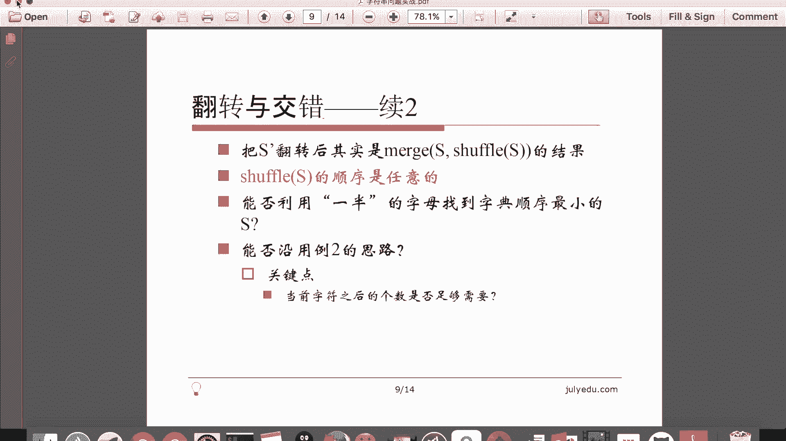

上一节我们学习了用栈去除重复字母，本节中我们来看一个类似但更复杂的问题。给定一个字符串 `S'`，已知它是原字符串 `S` 的翻转串 `reverse(S)` 和乱序串 `shuffle(S)` 交错合并（`merge`）的结果。要求找出字典序最小的原字符串 `S`。

这个问题可以转化为：将 `S'` 翻转后，得到的新字符串是 `S` 和 `shuffle(S)` 的 `merge` 结果。因此，我们需要从翻转后的字符串中，为每个字母恰好挑选出一半（因为 `S` 和 `shuffle(S)` 各包含一半的字母），并使得挑选出的序列（即 `S`）字典序最小。

思路与问题二完全一致，只是弹出栈顶的条件需要改变：只有当栈顶字符 `t > c`，并且**剩余字符串中字符 `t` 的数量加上已挑选的 `t` 的数量，仍然大于等于我们最终需要挑选的 `t` 的数量**时，才能弹出 `t`。这保证了弹出后我们仍有足够的机会在后面挑选到所需的 `t`。

以下是该算法的核心修改部分（假设 `need[c]` 是字符 `c` 最终需要的数量，`have[c]` 是当前已挑选的数量，`left[c]` 是剩余字符串中字符 `c` 的数量）：

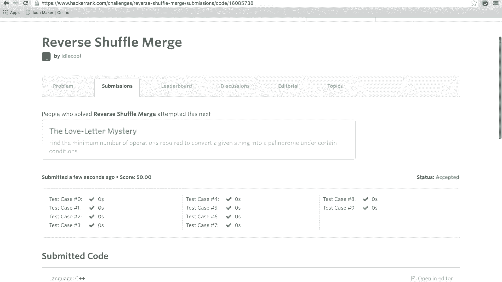

```cpp
// 弹出栈顶的条件变为：
while (!stk.empty() && stk.top() > c && have[stk.top()] + left[stk.top()] >= need[stk.top()]) {
    have[stk.top()]--;
    inStack[stk.top()] = false;
    stk.pop();
}
```

---

## 问题四：最长有效括号 🧱

上一节我们解决了基于栈的挑选问题，本节我们来看一个动态规划问题：给定一个可能包含无效字符的括号序列，通过删除最少的括号，使其变为有效的括号序列，并返回所有可能的最长有效序列。

我们可以使用**动态规划**。定义 `dp[i][j]` 表示考虑原字符串前 `i` 个字符，且左括号比右括号多 `j` 个时，能构成的最长有效子序列的长度（`j` 必须非负）。状态转移需要考虑第 `i` 个字符是左括号、右括号还是其他字符。

以下是状态转移方程的核心思想：

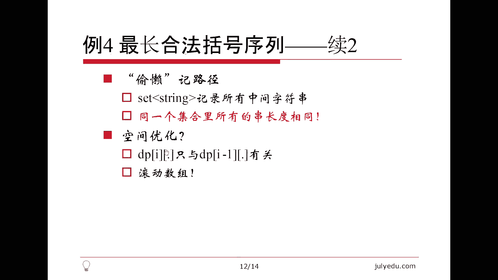

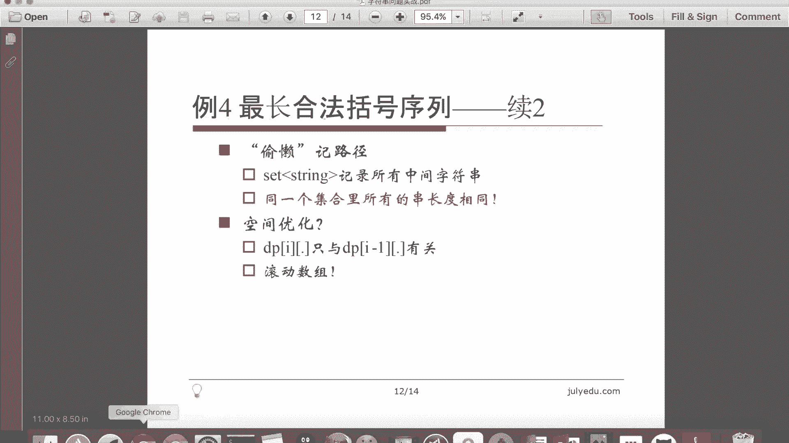

*   如果 `s[i]` 是 `'('`：我们可以选择不取它，则 `dp[i][j] = dp[i-1][j]`；或者选择取它，则 `dp[i][j] = dp[i-1][j-1] + 1`（前提是 `j>0`）。
*   如果 `s[i]` 是 `')'`：我们可以选择不取它，则 `dp[i][j] = dp[i-1][j]`；或者选择取它，则 `dp[i][j] = dp[i-1][j+1] + 1`。
*   如果 `s[i]` 是其他字符：只能选择取它，则 `dp[i][j] = dp[i-1][j] + 1`。

为了得到所有具体方案，我们可以在 `dp` 数组中存储集合，而不仅仅是长度。每个状态 `(i, j)` 对应的集合，存储所有能达到该状态且长度为 `dp[i][j]` 的字符串。在状态转移时，需要比较不同前驱状态带来的字符串集合，选择最优（更长）的，或者合并长度相等的。

由于空间优化和集合操作较为复杂，此处不展开完整代码，但核心是上述动态规划思想配合集合存储路径。

---

## 总结 🎯

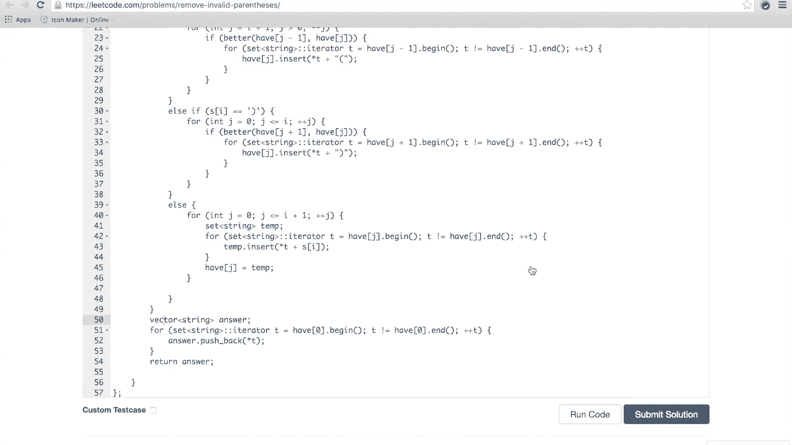

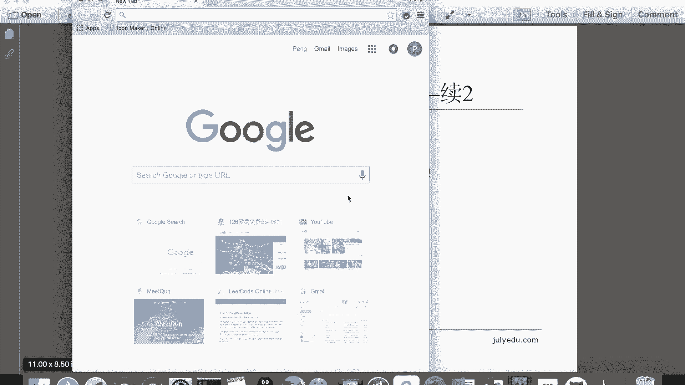

本节课中我们一起学习了四个字符串处理问题：
1.  **滑动窗口**用于解决无重复字符最长子串问题，时间复杂度为 `O(n)`。
2.  **单调栈**用于解决字典序最小的去重问题（问题二）及其变种（问题三），核心在于设定合理的弹出条件。
3.  **动态规划**用于解决最长有效括号序列问题，通过定义状态 `dp[i][j]` 并存储路径集合来找到所有最优解。

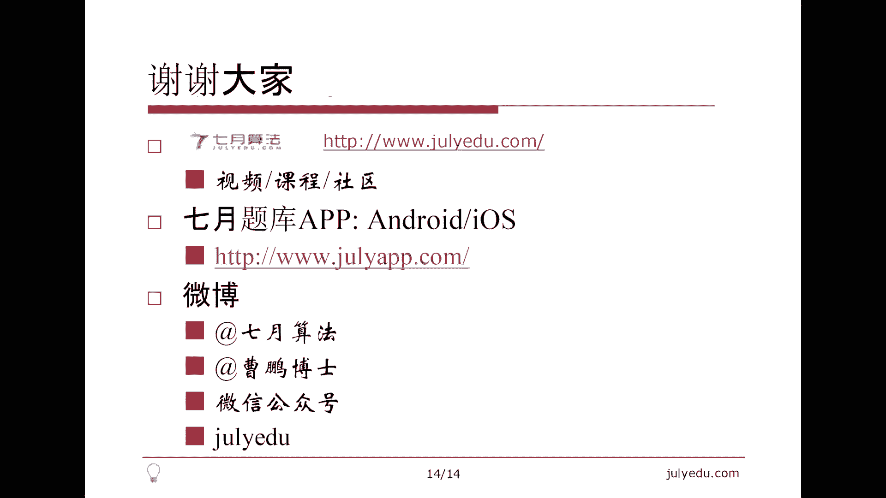


字符串题目变化多端，但滑动窗口、栈和动态规划是解决许多中等难度问题的有力工具。希望本课程能帮助你建立解决此类问题的基本思路。