# 🧠 人工智能公开课 P10：大学生AI成长计划

在本节课中，我们将要学习人工智能的基本概念、行业现状、项目流程以及成为一名AI工程师所需的核心技能。课程内容分为四个主要部分：对AI行业的思考、AI项目的基本流程、需要掌握的核心技能，以及七月在线提供的学习路径和资源。

## 🤔 第一部分：对AI行业的思考

人工智能的声音已逐步变得普遍理性，越来越多的AI创业项目已经开始下沉到应用层面，例如金融、电商、教育等领域。与此同时，AI技术型人才也同样着手于探究AI更深层次的技术难题。未来，这方面的人才会越来越多，对应的市场机会也会越来越大。

对于AI的发展及其对社会和行业的影响，我们可以从以下六个方面进行思考：

以下是六个核心思考维度：
1.  **What**：人工智能到底是什么？它的整个发展和经历是一个什么样的过程？
2.  **Why**：为什么要有这样的人工智能？
3.  **Where**：现在人工智能在各个应用场景下达到了一个什么样的水平？
4.  **How**：我们怎么去实现它？实现后有哪些成果？
5.  **When**：人工智能什么时候才能走进我们的生活，产生落地的价值？
6.  **Who**：在人工智能的浪潮里，我们充当什么样的角色？

### 人工智能的定义与发展

在讲人工智能之前，可以回想一下人类的智能是如何发展而来的。人类的智能是通过迭代进化产生的。人工智能时代的产生也有其迭代顺序：从能源时代，到电子时代，再到互联网时代，最后进入人工智能时代。

今天的人工智能依托于计算机及其背后的计算能力，并需要互联网和移动互联网所带来的大量数据作为支撑。人工智能可以被视为第四次工业革命，其终极目的是将人类从繁重的脑力劳动中解放出来。

人工智能的定义是利用数字计算机或数字计算机控制的机器，模拟、延伸和扩展人的智能，包括感知环境等，以获取并使用知识的系统。人工智能领域的研究包括机器人、语音识别、图像识别、自然语言处理和专家系统等。

### 人工智能的三个阶段

一般根据内容的难易程度，将人工智能分为三个阶段：运算智能、感知智能和认知智能。

*   **运算智能**：主要作用是能存会算，既能存储也可以进行大量运算。例如，阿尔法围棋（AlphaGo）本质上属于运算智能，它解决了在有限任务空间内的问题。
*   **感知智能**：主要表现是能听会说、能看会认。生活中常见的智能音箱、智能手环、无人机自主飞行、无人驾驶等设备都具有识别和感知能力。
*   **认知智能**：这是终极目标，即能够理解并且会思考。自然语言处理是人工智能皇冠上的明珠，但实现起来非常困难，因为语言本身含有多重含义，需要常识、知识、多模态等技术作为支撑。

人工智能的魅力在于其**持续向前进化**和**无成本复制**的能力。机器的性能可以持续优化，而一旦研发成功，其边际复制成本极低。

### 强人工智能与弱人工智能

在讨论如何实现人工智能时，需要区分两个重要概念：强人工智能和弱人工智能。

*   **强人工智能**：指机器能像人一样推理和思考，具有自我意识。这属于前瞻性研究。
*   **弱人工智能**：指专注于完成特定任务的智能系统。目前我们处于这个阶段，其主流技术路线是基于大数据和深度学习框架。

实现路径主要依赖于**深度学习算法、算力（计算能力）和大数据**这三者的结合。

### 人工智能的落地与挑战

人工智能要走进生活并产生价值，需要经历从理论、技术、原型、产品到商品、商业的漫长链条。在这个过程中，挑战非常大。公众对人工智能的期望很高，但对它的容错率却很低。例如，翻译系统或无人驾驶一旦出现小问题，就会被无限放大。

目前已经落地的人工智能应用包括人脸识别、智能音箱、无人车、病理检测、智能红绿灯和天气预报等。

在人工智能的浪潮中，像七月在线这样的教育培训公司，定位是培养AI人才，助力AI产业发展。

上一节我们探讨了AI行业的宏观图景，接下来我们将视角转向具体实践，看看一个AI项目是如何从想法变为现实的。

## 🔄 第二部分：AI项目的基本流程

企业中完成一个AI项目的大致流程可以分为五个步骤。需要注意的是，这只是一个通用框架，并非所有项目都严格遵循。

以下是AI项目的五个核心步骤：
1.  **提取问题**：找到出发点，明确需求，并将实际问题抽象成数学问题（如分类、回归、聚类）。
2.  **获取数据**：通过爬虫、购买等方式获取原始数据，并将其分为训练集和测试集。数据决定了机器学习结果的上限。
3.  **特征工程**：包含特征构建、特征提取和特征选择。实际工作中大部分时间都花在这个阶段，目的是从原始数据中提炼出对模型有用的信息。
4.  **建模**：核心环节包括训练、诊断、优化、验证和模型融合。
    *   **训练**：使用算法在数据上学习。
    *   **诊断**：判断模型是否过拟合或欠拟合，常用方法有交叉验证、绘制学习曲线等。
    *   **优化**：调整模型参数以提高性能。诊断与优化是一个反复迭代的过程。
    *   **验证**：使用测试数据集验证模型的有效性，分析误差来源。
    *   **融合**：将多个模型或特征工程的前后端结合，以提升算法精确度。
5.  **上线部署**：将模型集成到工程系统中。线上效果需综合准确度、误差、运行速度、资源消耗和稳定性等多个因素来判断。

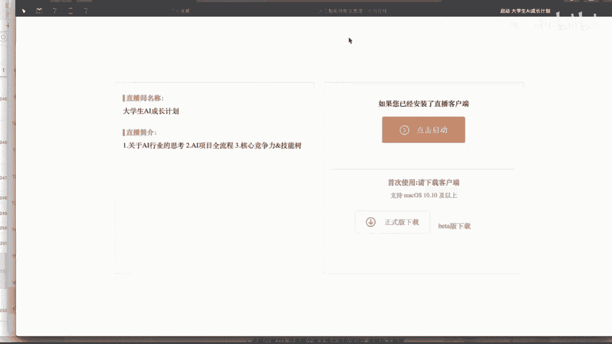

了解了项目流程后，我们就有了建造AI大厦的“施工蓝图”。那么，作为工程师，我们需要准备哪些“建筑材料”和“工具”呢？

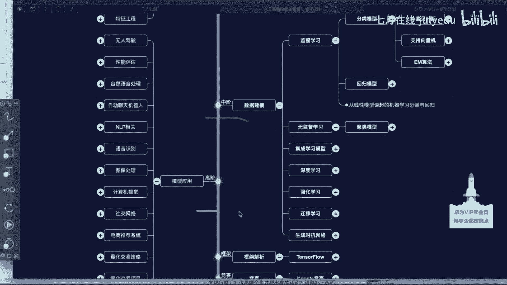

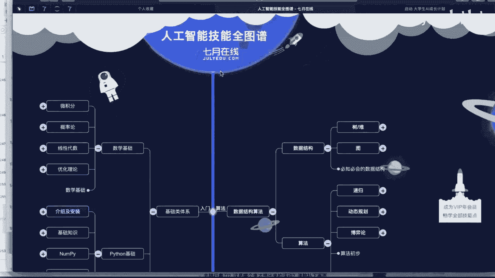

## ⚙️ 第三部分：需要掌握的核心技能

掌握基本流程后，就像大楼有了框架，接下来需要填充内容。我们可以根据七月在线的技能图谱（知识树）来规划学习路径，该图谱涵盖从入门到高级的各个阶段。

### 入门基础

以下是入门阶段需要掌握的基础技能：
*   **数学基础**：微积分、概率论、线性代数、图论。这些是理工科必修课程。
*   **编程语言**：首选Python，因为它简单且拥有丰富的数据处理库（如NumPy, Pandas, Matplotlib）。
*   **数据结构与算法**：理解堆、栈、树、图、递归、排序（冒泡、选择）等常见数据结构和算法。

### 初级阶段

初级阶段的核心是数据分析，需要敏锐的数据洞察力。
*   **数据获取**：使用Python进行网络爬虫（如Scrapy框架、requests库）。
*   **数据处理**：进行数据清洗、分组、合并等操作，为特征工程做准备。
*   **基础建模**：开始接触模型训练与选择。

### 中级阶段

中级阶段侧重于数据建模，学习主流的机器学习算法。
*   **监督学习**：逻辑回归、决策树、朴素贝叶斯、支持向量机（SVM）等。
*   **无监督学习**：聚类等算法。
*   **进阶领域**：集成学习、深度学习、强化学习、迁移学习、生成对抗网络（GAN）等。学习顺序建议从机器学习到深度学习，再逐步深入。

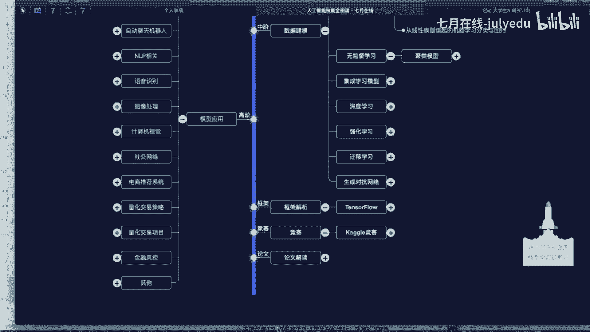

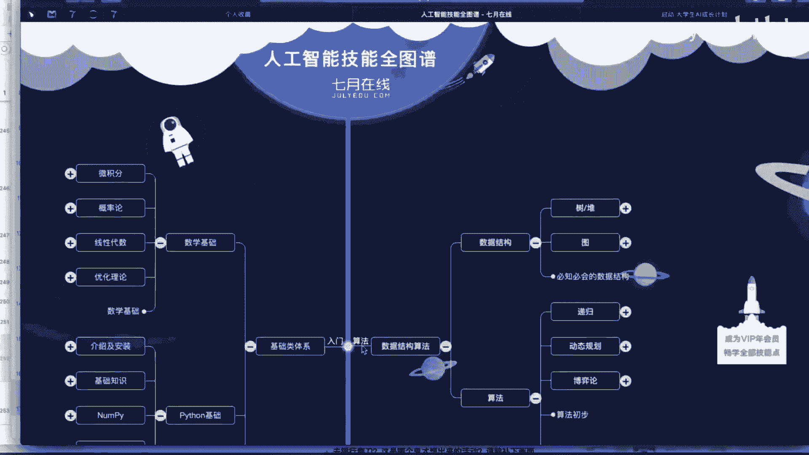

### 高级阶段

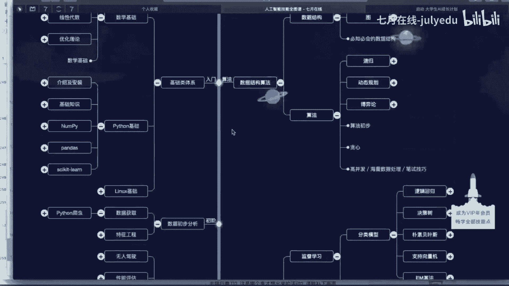

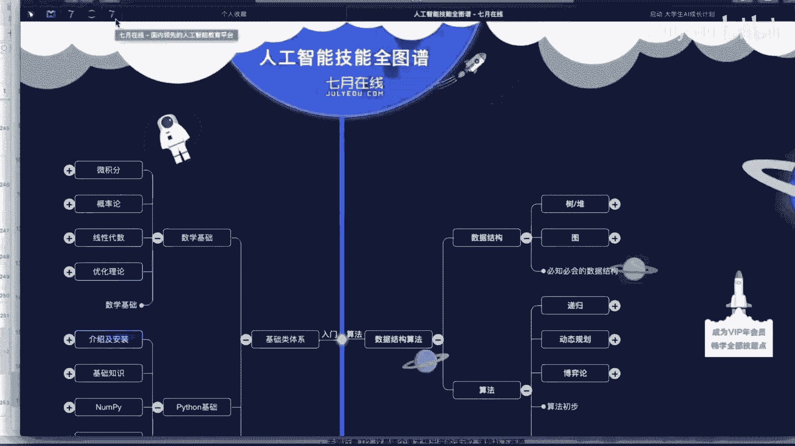

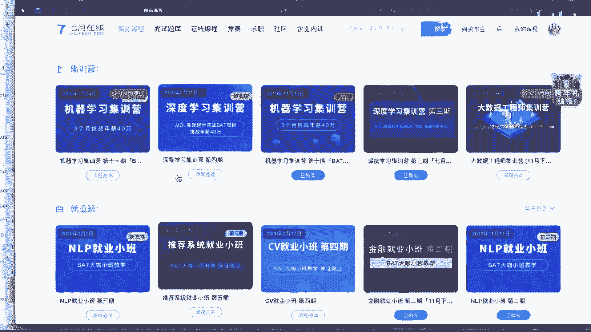

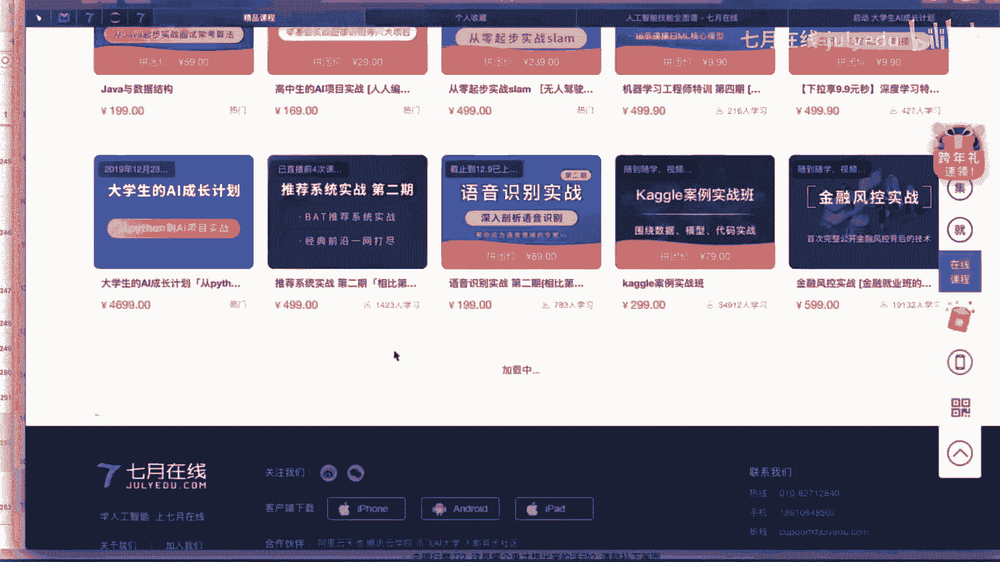

高级阶段是应用阶段，将所学知识用于解决实际问题。
*   **应用方向**：无人驾驶、自然语言处理（聊天机器人）、语音识别、图像处理、推荐系统、金融风控、计算广告、无人机自主飞行等。
*   **工具与框架**：直接使用成熟的框架如TensorFlow、PyTorch。
*   **实践与提升**：参与Kaggle等竞赛、阅读和解读前沿论文，以保持技术敏感度。

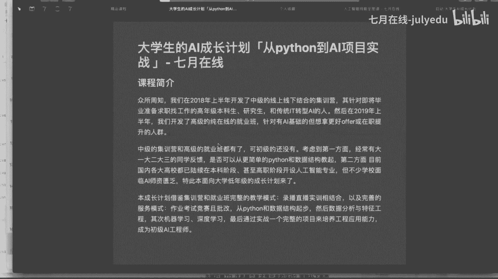

技能图谱为我们指明了学习方向。对于大学生而言，如何系统性地迈出第一步呢？七月在线为此设计了专门的学习计划。

## 🚀 第四部分：走进七月在线

七月在线是一家教育培训公司，目标是培养百万AI人才，助力AI产业发展。针对大学生群体，推出了“大学生AI成长计划”。

### 大学生AI成长计划课程

该课程面向高年级本科生或即将毕业的研究生，采用录播加直播的方式，包含在线视频、在线实训和在线直播三种形式。

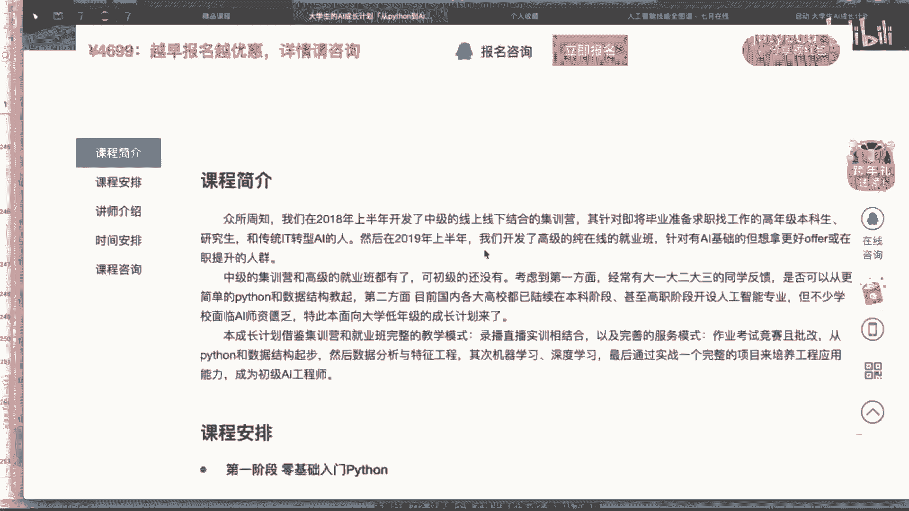

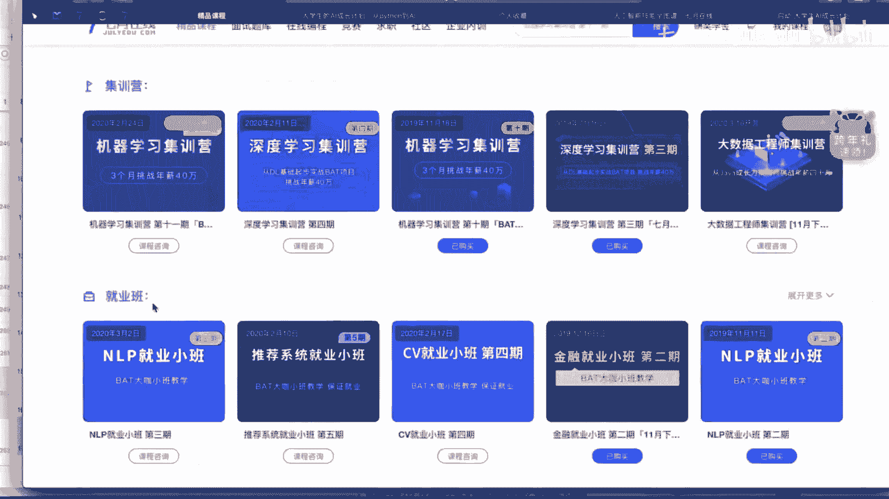

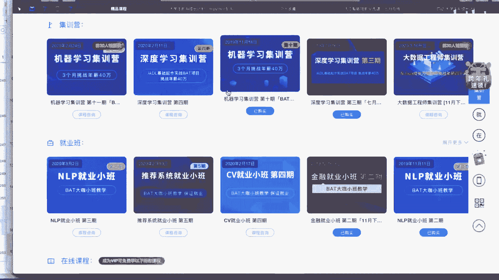

课程规划分为七个阶段：
1.  **Python入门**：掌握Python语言基础。
2.  **数据结构与算法**：学习栈、队列、哈希表等，为数据分析打基础。
3.  **数据分析**：重点学习NumPy、Pandas、Matplotlib，通过大量案例掌握数据处理与可视化。
4.  **机器学习原理**：学习线性回归、决策树、随机森林、SVM等基础算法原理。
5.  **机器学习实战**：通过Kaggle比赛等案例，将原理应用于实践。
6.  **深度学习原理与实战**：学习卷积神经网络（CNN）、循环神经网络（RNN）等，并实战搭建电影推荐网站项目。
7.  **进阶与就业**：学完后可向更高阶的集训营或就业班靠拢。就业班需通过笔试面试，并提供就业保障。

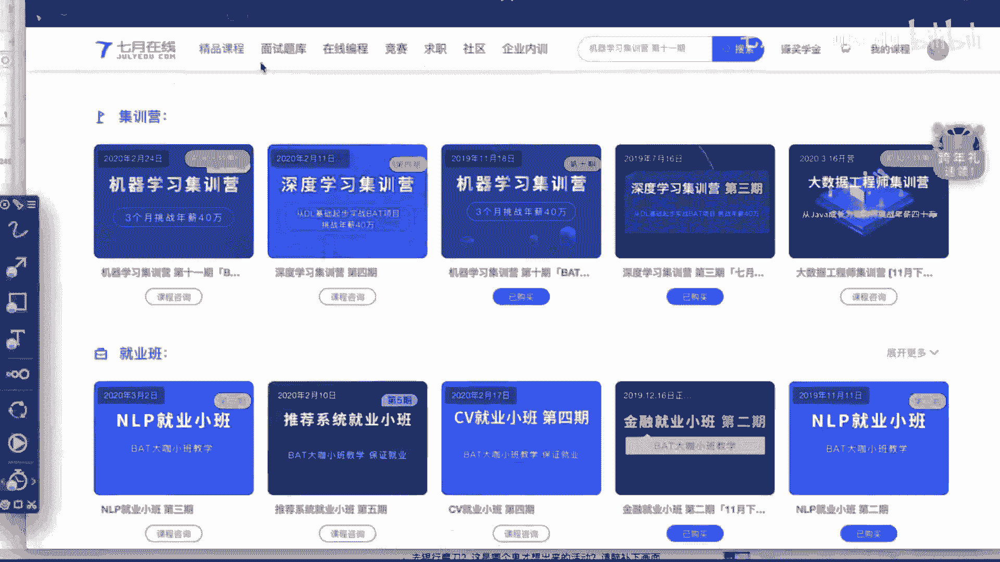

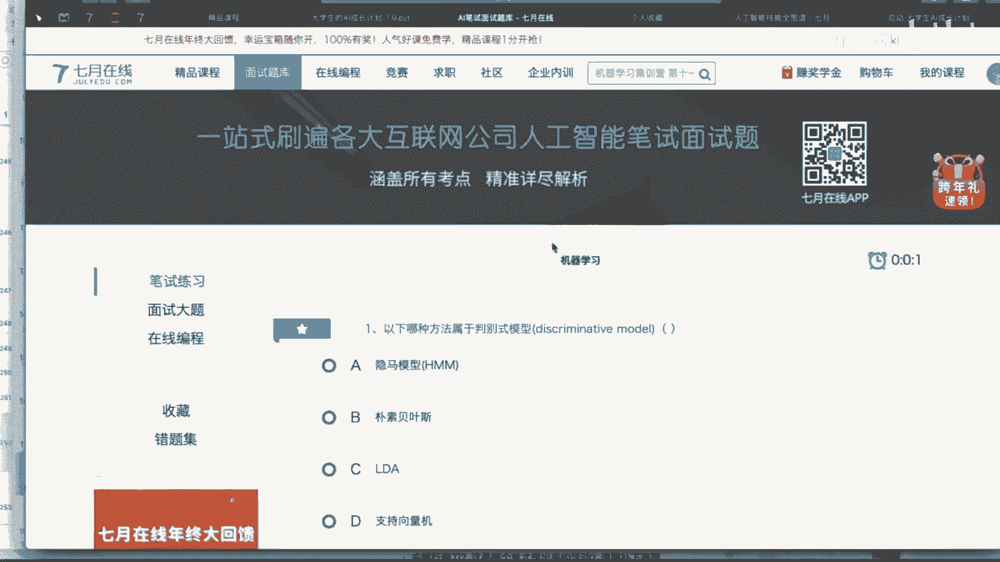

### 平台资源

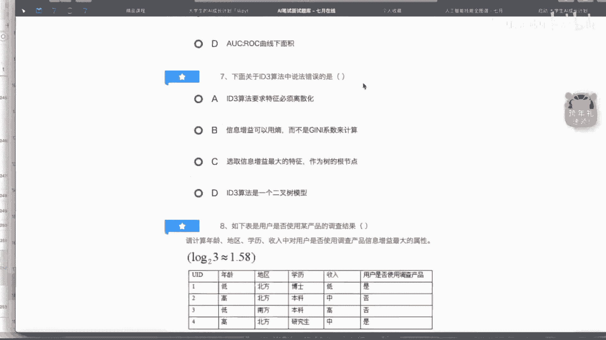

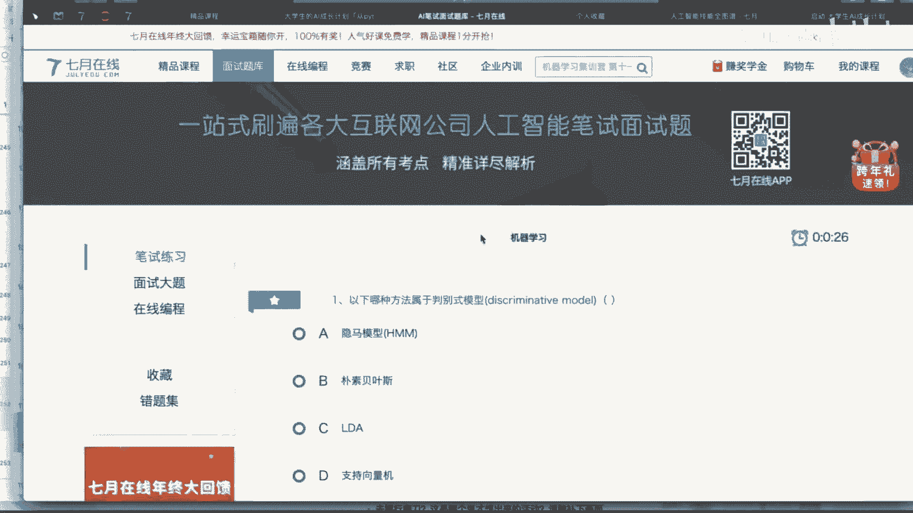

七月在线平台还提供丰富的辅助资源：
*   **题库**：包含4000多道来自大厂的面试真题（如机器学习330+道），可在线练习并查看解析。
*   **在线编程**：提供类似LeetCode的编程题目。
*   **竞赛平台**：举办手写体识别、文本情感分类等竞赛，供学员实践。
*   **社区**：学员可以交流学习经验，讨论问题。

## 📝 总结

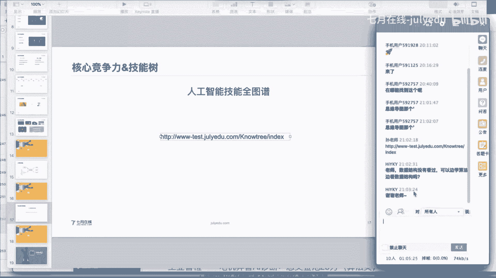

本节课我们一起学习了人工智能的基本概念、发展历程和三个阶段（运算、感知、认知）。我们探讨了AI项目的标准流程：从问题定义、数据获取、特征工程、建模调优到上线部署。接着，我们梳理了成为AI工程师所需的技能树，包括数学、编程、数据结构、机器学习、深度学习以及各领域的应用。最后，我们介绍了七月在线为大学生量身定制的“AI成长计划”课程及其丰富的学习资源。人工智能行业空间广阔，找准定位并系统学习，将有助于我们在这个持续发展的时代中把握机会。