# 人工智能—Python AI公开课（七月在线出品） - P3：三节课上手Python第三节 🧮


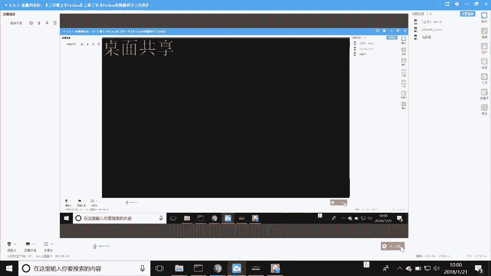

在本节课中，我们将要学习Python科学计算的核心库NumPy和Pandas的简介，并重点使用NumPy来计算一个Softmax函数。我们将从NumPy的基础概念讲起，逐步深入到数组操作和运算，最后通过一个实践项目来巩固所学知识。

## 课程回顾与概述

上一节我们介绍了Python的函数与面向对象编程，理解了如何通过封装来提高代码的复用性和可维护性。本节中，我们来看看Python在科学计算领域的强大工具。

本节课是“三节课上手Python”系列的最后一节，主题是“Python与科学计算”。我们将重点介绍NumPy库，它是一个专为高效数学运算而设计的库，解决了Python原生列表在数值计算上能力偏弱的问题。同时，我们也会简要提及Pandas库，它用于内存中的表格数据处理。由于时间关系，我们将主要精力放在NumPy上，掌握它之后，学习Pandas将会更加容易。

## 第一部分：NumPy库简介与导入

NumPy是“Numerical Python”的缩写，它是Python科学计算的基础包，提供了一个强大的N维数组对象`ndarray`，以及大量的数学函数。

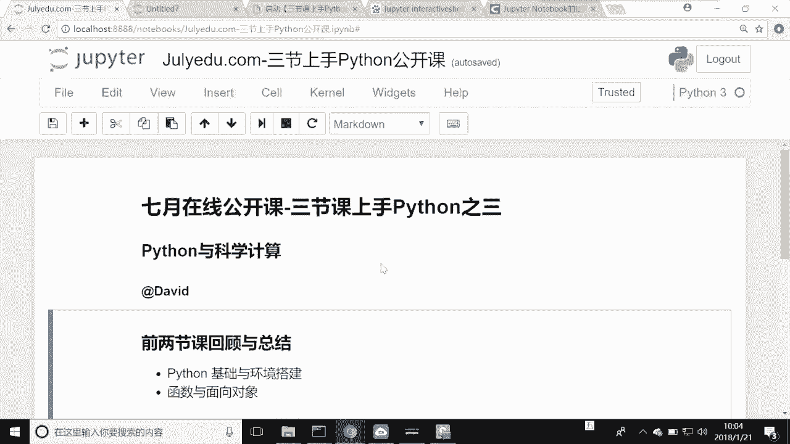

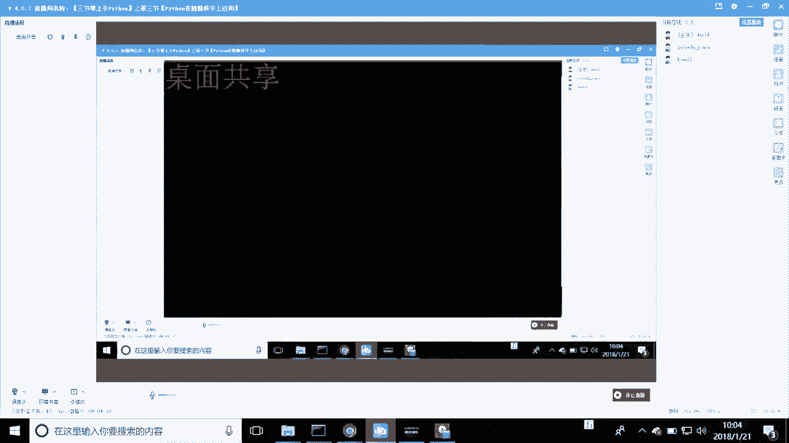

要使用NumPy，我们首先需要导入它。通常，我们为其设置一个简短的别名`np`，以方便后续调用。

```python
import numpy as np
```

导入成功后，我们就可以使用`np`来调用NumPy的所有功能了。

## 第二部分：为什么需要NumPy？🤔

在深入NumPy之前，让我们思考一个简单的问题：如何给一个Python列表中的每个元素都加1？

使用原生Python列表，这个过程比较繁琐：

```python
L1 = [1, 2, 3]
# 直接加1会报错
# L1 + 1

# 需要循环遍历
L2 = []
for i in L1:
    L2.append(i + 1)
print(L2)  # 输出：[2, 3, 4]
```

如果列表是多维的，代码会变得更加复杂。而使用NumPy，这一切变得非常简单：

```python
import numpy as np
L1_np = np.array([1, 2, 3])
result = L1_np + 1
print(result)  # 输出：[2 3 4]

# 同样支持乘法等运算
result_mul = L1_np * 4
print(result_mul)  # 输出：[ 4  8 12]
```

NumPy的`ndarray`对象支持这种“广播”式的元素级运算，极大地简化了代码。

## 第三部分：构建NumPy数组（ndarray）

`ndarray`是NumPy的核心对象，代表N维数组。`N`代表维度（Dimension），`D`就是维（Dimension），所以`ndarray`即N维数组。

以下是构建`ndarray`的几种常见方法：

**1. 从Python列表或元组创建**
这是最直接的方式，`np.array()`函数可以将序列对象转换为`ndarray`。

```python
# 一维数组
arr1d = np.array([1, 2, 3, 4, 5])
print(arr1d)

# 二维数组
arr2d = np.array([[1, 2, 3, 4, 5],
                  [6, 7, 8, 9, 10]])
print(arr2d)
```

**2. 使用NumPy内置函数快速创建**
NumPy提供了多种快速创建特殊数组的函数。

```python
# 生成指定形状的随机数组
arr_random = np.random.rand(2, 5)  # 2行5列，元素在[0,1)区间均匀分布
print(arr_random)

# 生成序列数组，类似range
arr_range = np.arange(10)  # 生成0到9的数组
print(arr_range)

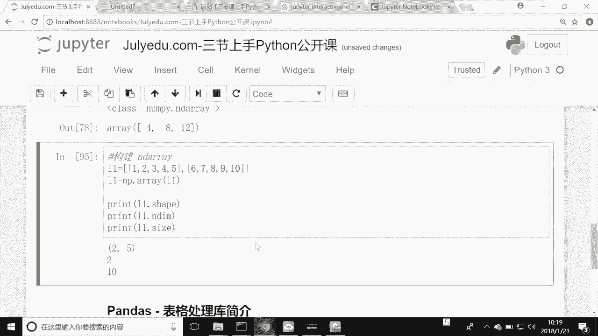


# 生成线性间隔数组
arr_linspace = np.linspace(1, 10, 100)  # 在1到10之间生成100个等间隔的数
print(arr_linspace)

# 生成全零数组
arr_zeros = np.zeros((4, 5))  # 4行5列的全0数组
print(arr_zeros)

# 生成全一数组
arr_ones = np.ones((3, 4))  # 3行4列的全1数组
print(arr_ones)

# 生成指定值的数组
arr_full = np.full((2, 3), 7)  # 2行3列，所有元素为7
print(arr_full)
```

## 第四部分：ndarray的基本属性

每个`ndarray`对象都有一些重要的属性，用于描述其状态。

以下是`ndarray`的几个核心属性：

*   **`shape`**: 返回一个元组，表示数组在每个维度上的大小（形状）。例如，`(2, 5)`表示2行5列。
*   **`ndim`**: 返回数组的维数（维度数量）。例如，二维数组的`ndim`为2。
*   **`size`**: 返回数组中元素的总数。它等于`shape`中各维度大小的乘积。
*   **`dtype`**: 返回数组中元素的数据类型，如`int64`, `float64`。

让我们通过代码查看这些属性：

```python
arr = np.array([[1, 2, 3, 4, 5],
                [6, 7, 8, 9, 10]])

print(“数组形状 (shape):”, arr.shape)   # 输出：(2, 5)
print(“数组维度 (ndim):”, arr.ndim)     # 输出：2
print(“元素总数 (size):”, arr.size)      # 输出：10
print(“数据类型 (dtype):”, arr.dtype)    # 输出：int64 (取决于系统)
```

其中，`shape`和`ndim`是最常用和最重要的两个属性。

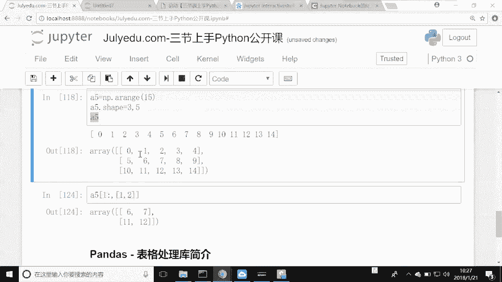

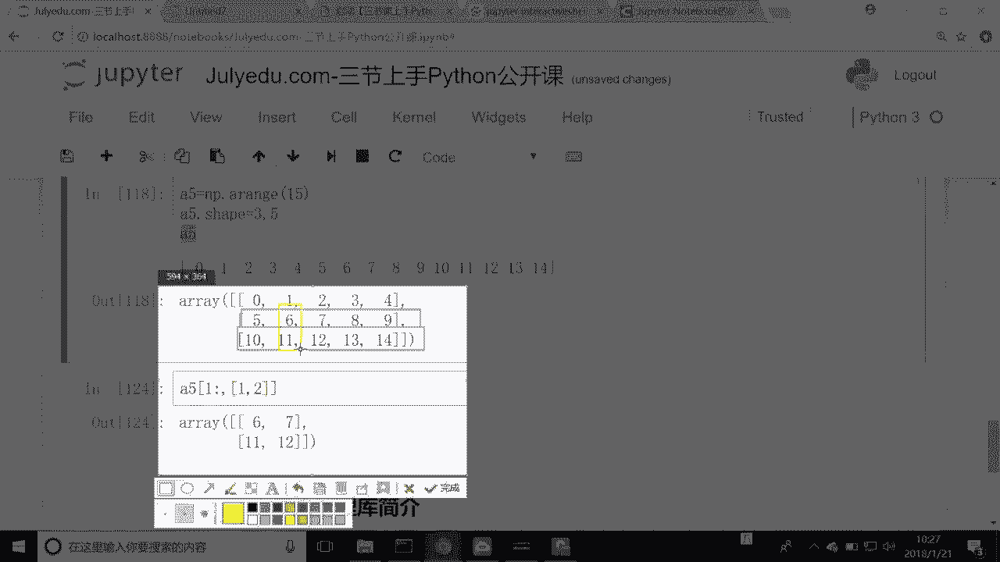

## 第五部分：ndarray的索引与切片

理解了数组的构建和属性后，我们需要学习如何访问和修改其中的数据。NumPy的索引和切片语法与Python列表类似，但可以扩展到多维。

**1. 基本索引与切片**
对于一维数组，其用法与列表完全一致。

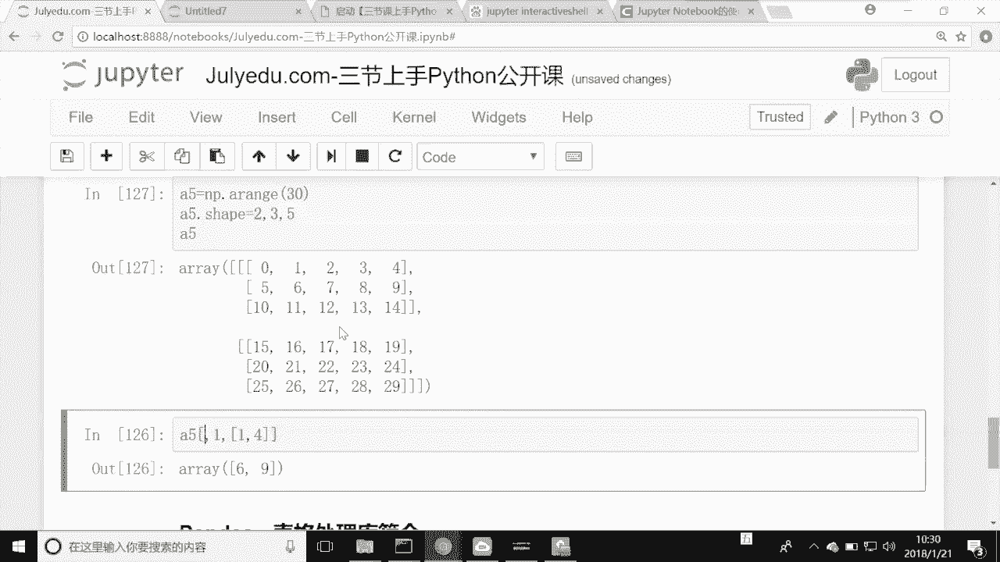

```python
arr = np.arange(10)  # [0 1 2 3 4 5 6 7 8 9]
print(arr[2])        # 输出：2 (索引)
print(arr[2:5])      # 输出：[2 3 4] (切片)
print(arr[:5])       # 输出：[0 1 2 3 4]
print(arr[5:])       # 输出：[5 6 7 8 9]
```

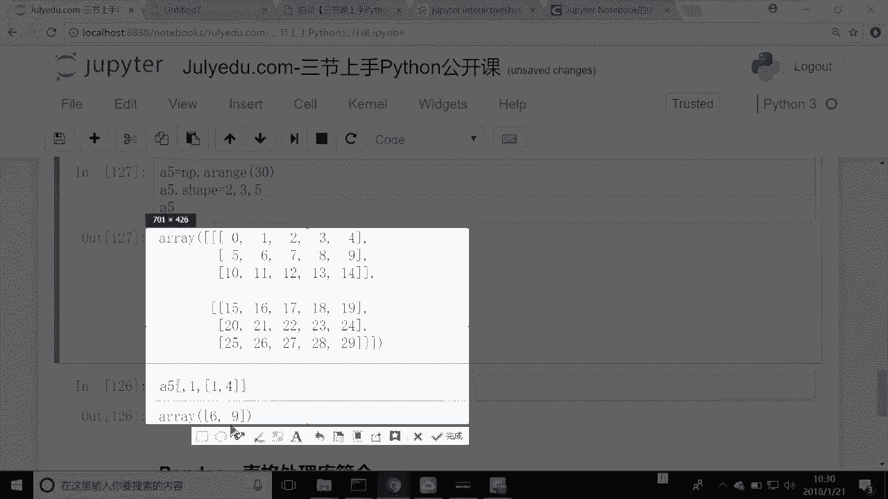

对于多维数组，使用逗号`,`分隔不同维度的索引。

```python
arr_2d = np.arange(15).reshape(3, 5) # 将0-14重组成3行5列
print(arr_2d)
# 输出：
# [[ 0  1  2  3  4]
#  [ 5  6  7  8  9]
#  [10 11 12 13 14]]

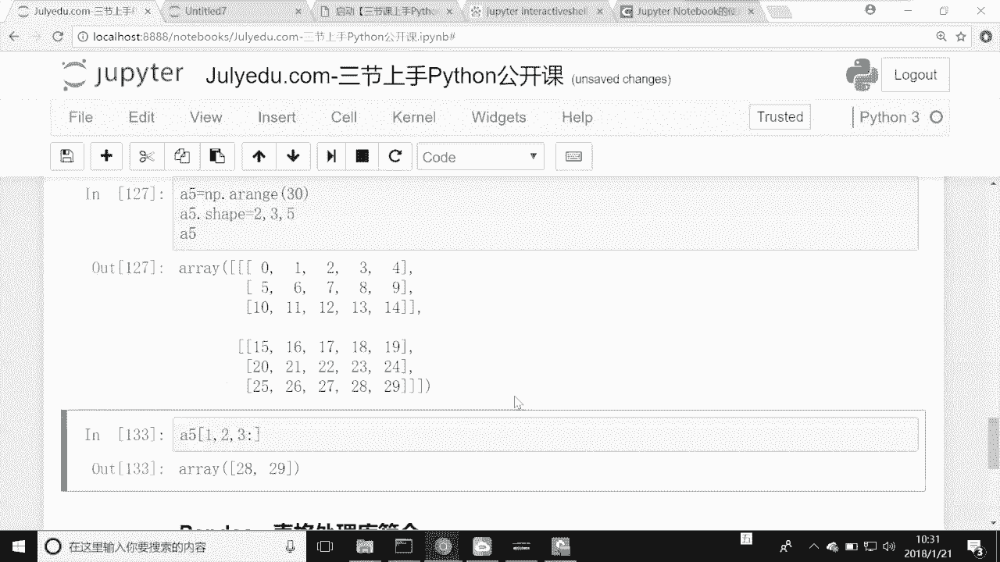


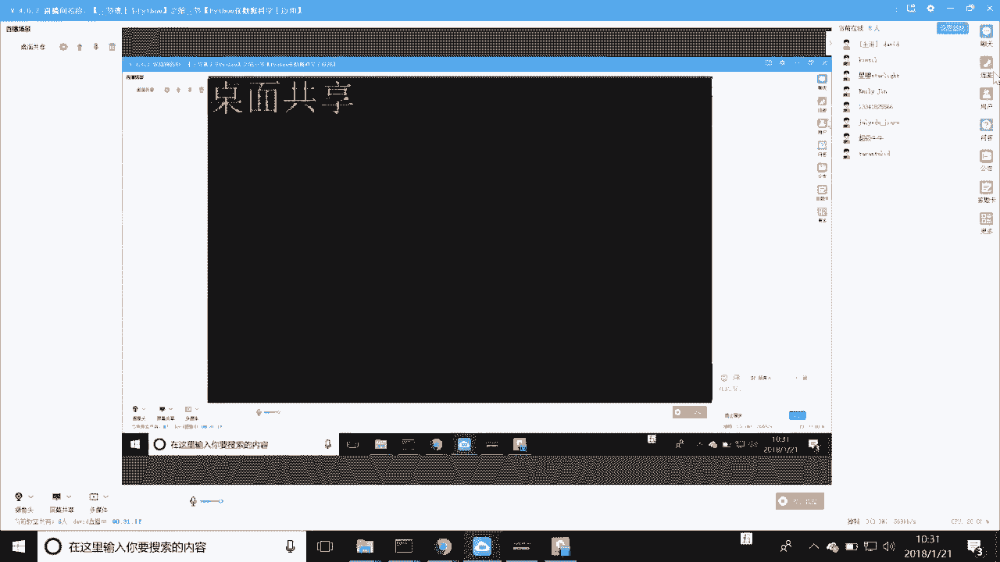

# 访问单个元素：第1行，第2列（索引从0开始）
print(arr_2d[1, 2])  # 输出：7

# 切片：第1行到最后一行，所有列
print(arr_2d[1:, :])
# 输出：
# [[ 5  6  7  8  9]
#  [10 11 12 13 14]]

# 切片：所有行，第2列到第4列
print(arr_2d[:, 2:4])
# 输出：
# [[ 2  3]
#  [ 7  8]
#  [12 13]]
```

**2. 花式索引 (Fancy Indexing)**
除了连续的切片，还可以传入一个索引列表来访问不连续的位置。

```python
arr_2d = np.arange(15).reshape(3, 5)
# 访问第0行和第2行，第1列和第3列
print(arr_2d[[0, 2], :][:, [1, 3]])
# 更直接的写法：
print(arr_2d[[0, 2]][:, [1, 3]])
# 或者使用 np.ix_ 函数更清晰（可选）
# 输出：
# [[ 1  3]
#  [11 13]]
```

**3. 布尔索引**
通过布尔数组来索引，常用于条件筛选。

```python
arr = np.array([1, 2, 3, 4, 5])
# 选出大于2的元素
mask = arr > 2
print(arr[mask])  # 输出：[3 4 5]
```

掌握了访问方法，赋值操作自然也就明白了，只需在等号左边指定索引位置即可。

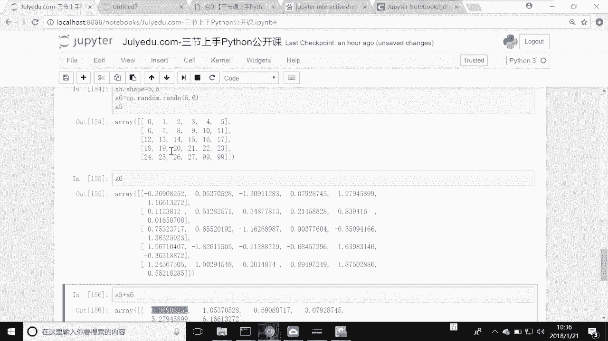

```python
arr_2d[0, 0] = 99
print(arr_2d[0, 0])  # 输出：99
```

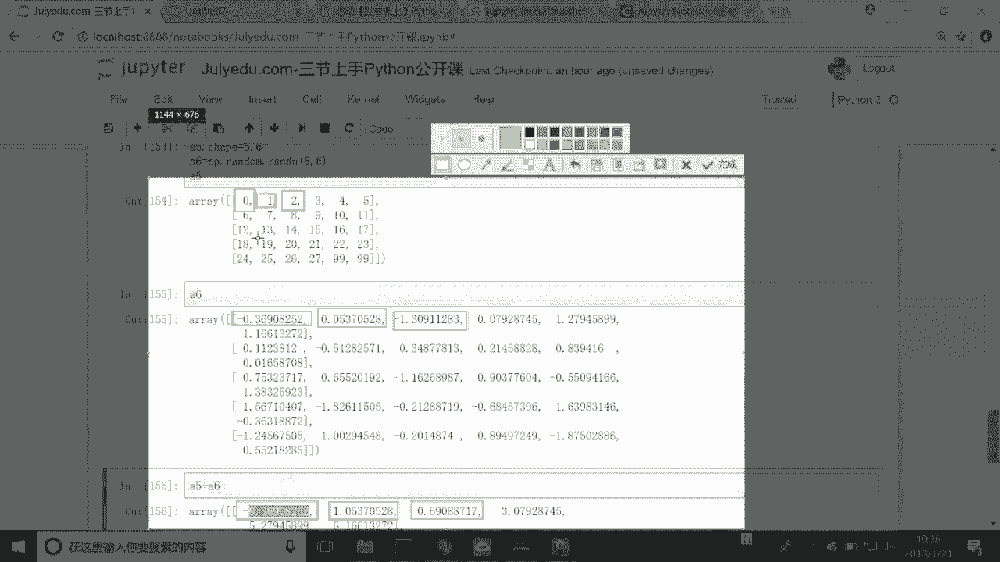

## 第六部分：ndarray的维度操作

有时我们需要改变数组的形状，NumPy提供了灵活的方法。

**1. `reshape`方法**
`reshape`方法返回一个指定形状的新数组视图，不改变原数组的数据。

```python
arr = np.arange(30)  # 一维，30个元素
arr_reshaped = arr.reshape(5, 6) # 变为5行6列的二维数组
print(arr_reshaped.shape)  # 输出：(5, 6)
print(arr.shape)           # 输出：(30,) 原数组未变
```

**2. `resize`方法或直接修改`shape`属性**
直接修改数组的`shape`属性或使用`resize`方法会**改变原数组**。

```python
arr = np.arange(30)
arr.shape = (5, 6)  # 直接修改shape属性
print(arr.shape)    # 输出：(5, 6)

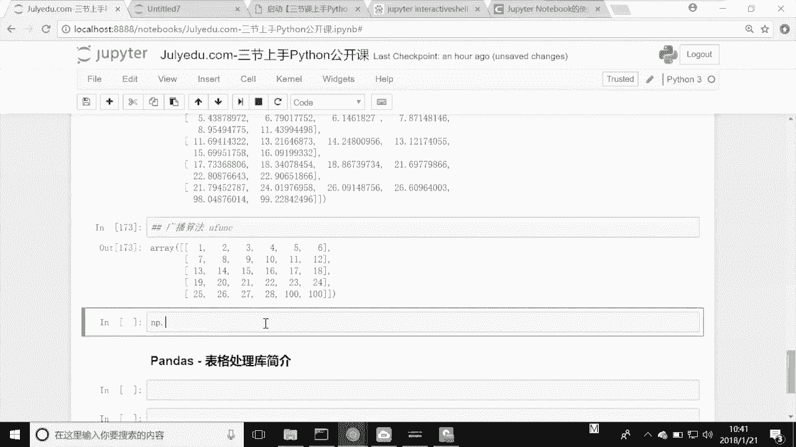

# 或者使用resize
arr = np.arange(30)
arr.resize((5, 6))
print(arr.shape)    # 输出：(5, 6)
```

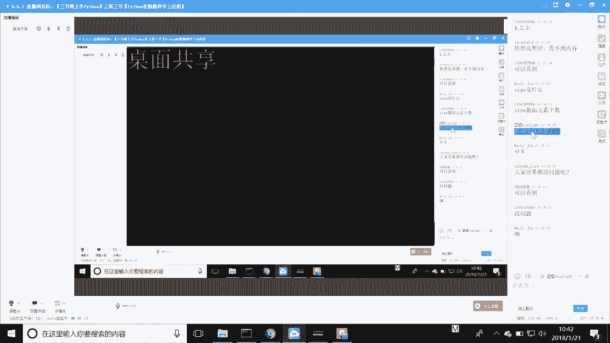

**3. `flatten`或`ravel`方法**
将多维数组“展平”为一维数组。`flatten`返回拷贝，`ravel`返回视图。

```python
arr_2d = np.arange(12).reshape(3, 4)
arr_flat = arr_2d.flatten()
print(arr_flat)  # 输出：[ 0  1  2  3  4  5  6  7  8  9 10 11]
```

## 第七部分：ndarray的运算

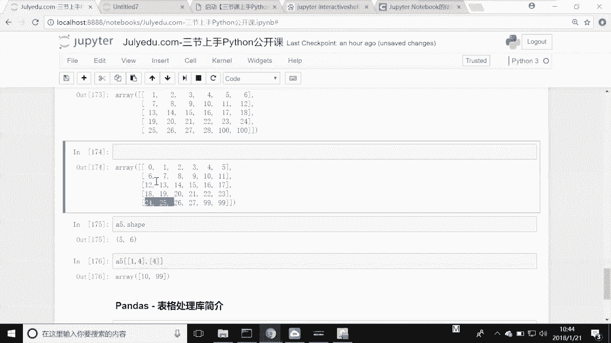

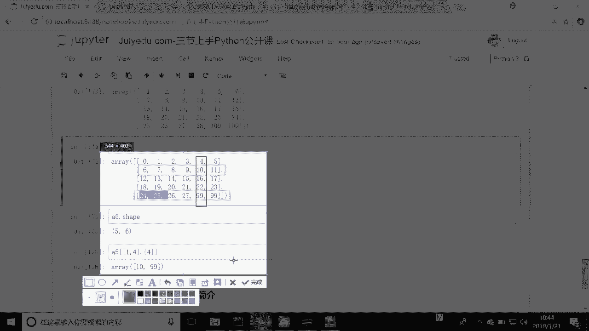

NumPy的强大之处在于其高效的数组运算能力。


**1. 元素级运算（广播机制）**
数组与标量之间的运算，会被广播到数组的每个元素上。

```python
arr = np.array([1, 2, 3])
print(arr + 1)   # 输出：[2 3 4]
print(arr * 2)   # 输出：[2 4 6]
print(arr ** 2)  # 输出：[1 4 9]
```

两个形状**相同**的数组之间的运算，也是对应位置的元素进行运算。

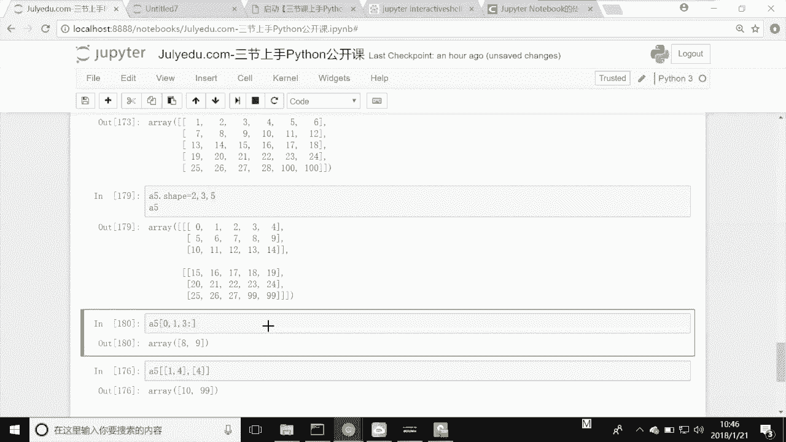

```python
a = np.array([1, 2, 3])
b = np.array([4, 5, 6])
print(a + b)  # 输出：[5 7 9]
print(a * b)  # 输出：[4 10 18]
```


**2. 矩阵乘法（点积）**
使用`np.dot()`函数或`@`运算符进行矩阵乘法。这要求第一个数组的列数等于第二个数组的行数。

```python
A = np.random.rand(5, 3)  # 5行3列
B = np.random.rand(3, 2)  # 3行2列
C = np.dot(A, B)          # 结果C的形状为 (5, 2)
# 或者使用 @ 运算符
C = A @ B
print(C.shape)  # 输出：(5, 2)
```

**3. 通用函数（ufunc）**
NumPy提供了许多对数组执行元素级运算的通用函数，如`np.sin`, `np.exp`, `np.log`等。

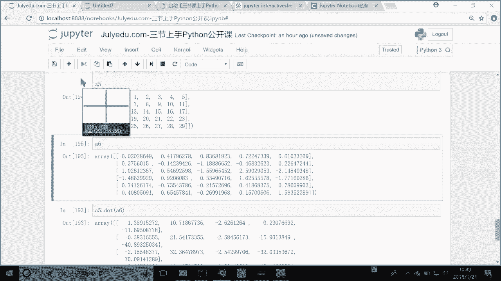

```python
arr = np.array([0, np.pi/2, np.pi])
print(np.sin(arr))  # 输出：[0.0000000e+00 1.0000000e+00 1.2246468e-16]
```

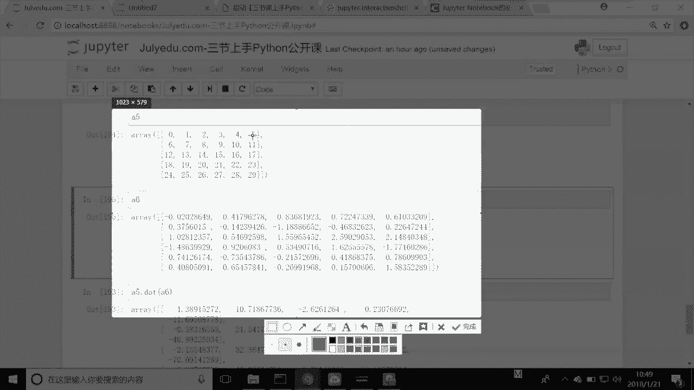

**4. 聚合函数**
沿指定轴（维度）进行统计计算，如求和、求均值、最大值、最小值等。


```python
arr = np.arange(15).reshape(3, 5)
print(arr)
# 输出：
# [[ 0  1  2  3  4]
#  [ 5  6  7  8  9]
#  [10 11 12 13 14]]


# 全局求和
print(np.sum(arr))          # 输出：105

# 沿轴0求和（跨行，即每列求和）
print(np.sum(arr, axis=0))  # 输出：[15 18 21 24 27]

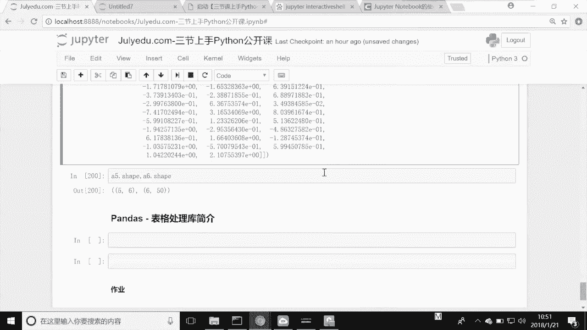


# 沿轴1求和（跨列，即每行求和）
print(np.sum(arr, axis=1))  # 输出：[10 35 60]

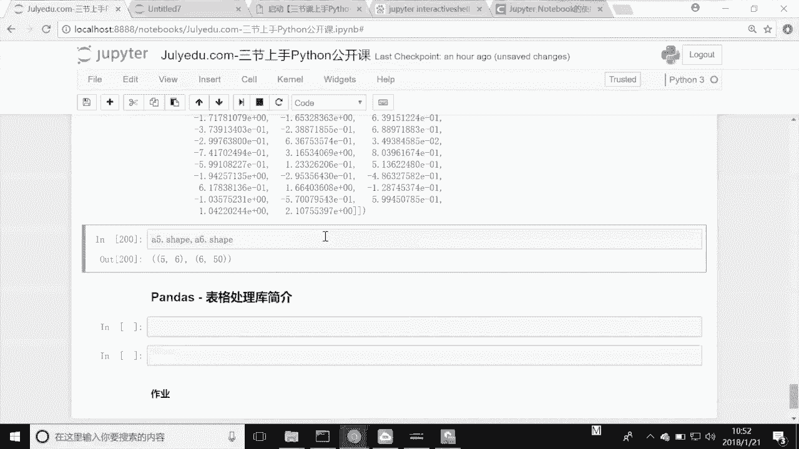

# 求最大值
print(np.max(arr))           # 输出：14
print(np.max(arr, axis=0))   # 输出：[10 11 12 13 14]
```

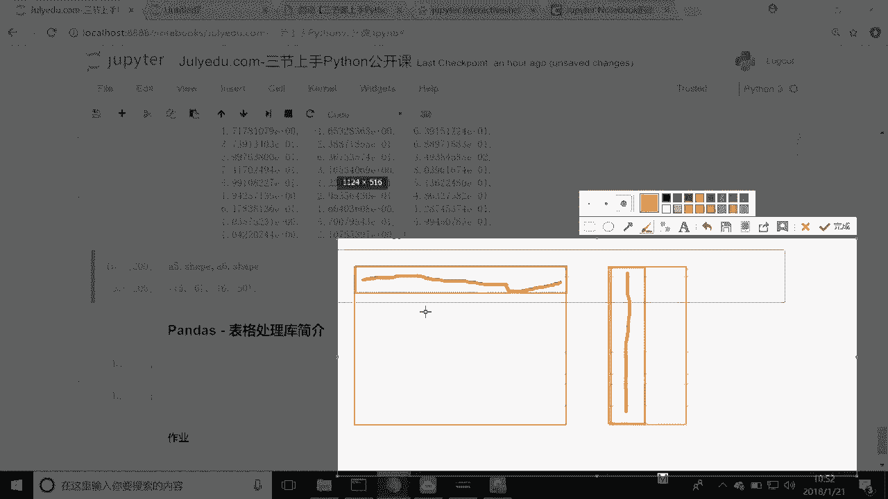

参数`axis`是关键：`axis=0`表示沿着第0轴（行方向）操作，结果数组的该维度会被“压缩”掉；`axis=1`表示沿着第1轴（列方向）操作。

## 第八部分：实战练习——实现Softmax函数

现在，让我们运用所学的NumPy知识来实现一个机器学习中常用的函数——Softmax。Softmax函数可以将一组任意实数转换为一组概率分布，所有输出值在(0,1)之间，且和为1。

Softmax的公式为：
**`S(x_i) = exp(x_i) / Σ(exp(x_j))`**，其中`j`遍历所有元素。


以下是实现步骤：


1.  给定一个输入数组（可能包含正负数）。
2.  对每个元素求指数（`np.exp`），确保所有值为正。
3.  计算所有指数值的和。
4.  将每个指数值除以总和，得到概率。

```python
def softmax(x):
    # 防止数值溢出，进行稳定性处理：减去最大值
    x_exp = np.exp(x - np.max(x))
    return x_exp / np.sum(x_exp)

# 测试
x = np.array([1.0, 2.0, 3.0, 4.0, 1.0, 2.0, 3.0])
probabilities = softmax(x)
print(“输入:”, x)
print(“Softmax概率:”, probabilities)
print(“概率和:”, np.sum(probabilities))  # 应非常接近1.0

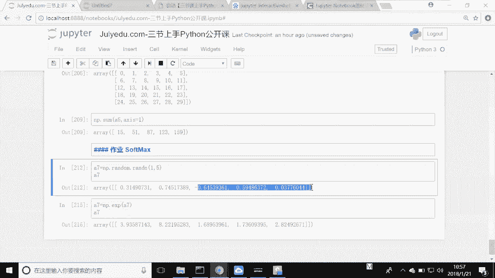


# 也可以处理二维数组（如多分类问题中每个样本的得分）
scores = np.random.randn(3, 5)  # 3个样本，5个类别得分
probs = softmax(scores)         # 对每一行（axis=1）计算softmax
print(“\n样本得分矩阵形状:”, scores.shape)
print(“Softmax概率矩阵形状:”, probs.shape)
print(“每行概率和:”, np.sum(probs, axis=1))  # 每行和都应接近1
```

这个练习综合运用了数组创建、数学运算、广播机制和聚合函数，是检验NumPy掌握程度的绝佳方式。

## 课程总结与作业 🎯

本节课中我们一起学习了Python科学计算的核心库NumPy。我们从理解为什么需要NumPy开始，逐步掌握了`ndarray`数组的构建、属性查看、索引切片、维度变换以及各种数学运算。最后，我们通过实现Softmax函数将理论知识应用于实践。

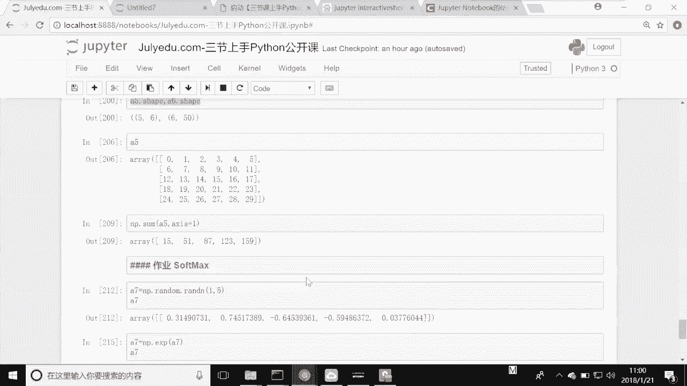


**本节课核心要点总结：**
1.  NumPy的`ndarray`对象是高效数值计算的基础。
2.  掌握数组的`shape`、`ndim`、`size`等属性。
3.  熟练使用索引和切片访问、修改多维数组数据。
4.  理解并运用`reshape`、`flatten`进行维度操作。
5.  掌握元素级运算、矩阵乘法和沿轴聚合计算。
6.  理解广播机制，它使数组与标量或不同形状数组间的运算变得简单。

**课后作业：**
请独立完成一个Softmax函数的实现，并对其进行测试。
1.  实现函数`softmax(x)`，能正确处理一维和二维输入。
2.  对二维输入，确保对**每一行**独立计算概率分布（即`axis=1`）。
3.  生成一些随机测试数据（包括正负数），验证你的函数输出概率和为1。

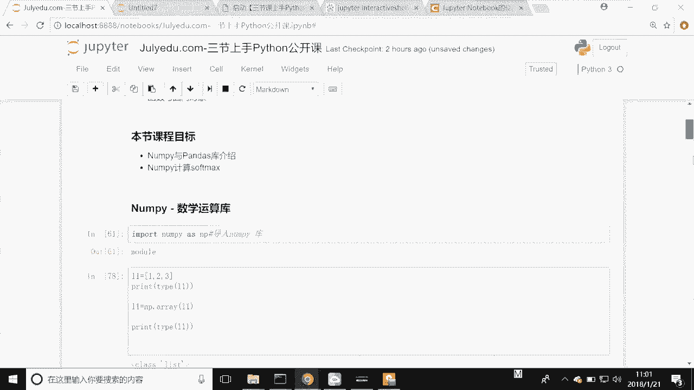

通过完成这个作业，你将能巩固本节课关于NumPy数组操作和运算的所有关键知识。科学计算是数据科学和人工智能的基石，熟练掌握NumPy将为你的后续学习铺平道路。


---
*教程内容根据“人工智能—Python AI公开课（七月在线出品）- P3：三节课上手Python第三节”视频内容整理翻译而成。*