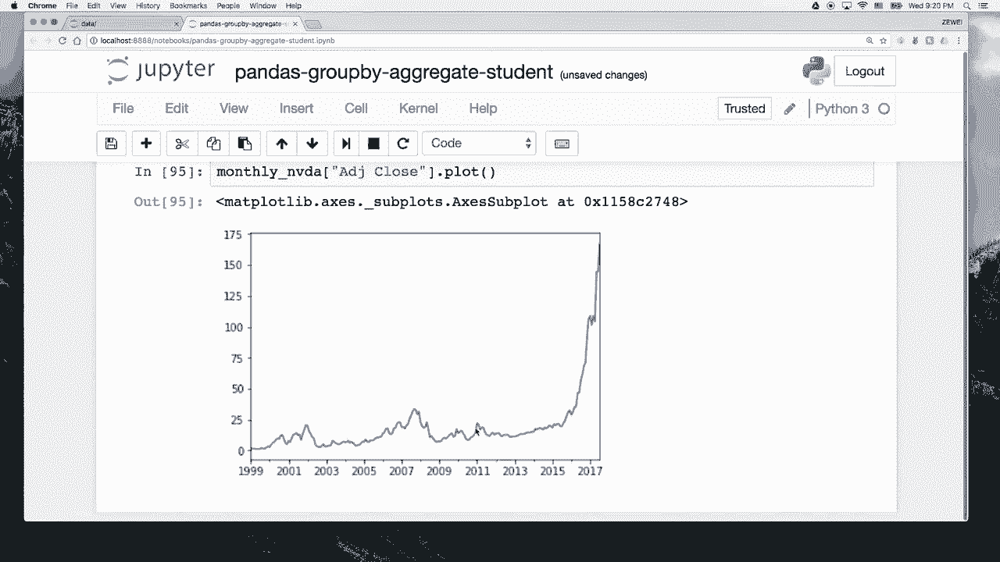

# 人工智能—Python AI公开课（七月在线出品） - P4：瑞士军刀pandas之数据分类 📊

在本节课中，我们将要学习pandas库中三个强大的数据处理操作：`groupby`、`aggregate`和`transform`。我们将通过具体的例子，学习如何对数据进行分类、汇总和逐行转换，从而更深入地理解和分析数据。

## 概述

在前面的课程中，我们已经初步了解了pandas的核心数据结构：一维的`Series`和二维的`DataFrame`。`DataFrame`是我们进行数据分析的主要工具。本节课将围绕`DataFrame`展开，重点介绍如何对数据进行分组、聚合和转换操作。

## 创建示例数据

在开始学习具体操作之前，我们首先需要创建一个示例数据集。假设我们有一个名为“七月在线”的公司，我们需要一张表格来记录每位员工的年度薪水和奖金流水。

以下是创建该数据集的代码：

```python
import pandas as pd
import numpy as np

# 创建一个包含员工信息的DataFrame
salaries = pd.DataFrame({
    'name': ['July', 'July', 'Han', 'Han', 'July', 'Zewei', 'Zewei', 'Zewei', 'July', 'Han'],
    'year': [2016, 2016, 2016, 2017, 2017, 2016, 2017, 2017, 2016, 2017],
    'salary': [80000, 82000, 70000, 72000, 85000, 90000, 95000, 92000, 81000, 73000],
    'bonus': [5000, 5500, 4500, 4800, 6000, 8000, 8500, 8200, 5200, 4700]
})
```

## 数据分组：groupby

上一节我们创建了示例数据，本节中我们来看看如何使用`groupby`对数据进行分类。`groupby`操作的核心思想是按照一个或多个列的值，将数据分成不同的组。

### 基本分组操作

以下是如何按照员工姓名（`name`列）进行分组：

```python
grouped_by_name = salaries.groupby('name')
print(type(grouped_by_name))
```

执行上述代码后，你会得到一个`DataFrameGroupBy`对象。这个对象本身并不直接显示数据，但它已经将数据按照姓名分成了不同的组。

### 理解groupby对象

`groupby`对象内部存储了分组信息。我们可以通过`.groups`属性查看每个组包含哪些数据行（通过索引标识）。

```python
print(grouped_by_name.groups)
```

输出结果会显示每个姓名对应的数据行索引，这有助于我们理解`groupby`是如何工作的：它遍历`DataFrame`，根据指定列的值将行索引归类到不同的组中。

## 数据聚合：aggregate

在将数据分组之后，我们通常希望对每个组进行汇总计算，这就是聚合（`aggregate`）操作。聚合操作可以与`groupby`无缝衔接。

### 基本聚合操作

以下是对分组后的数据求和：

```python
# 对每个组的所有数值列求和
sum_result = salaries.groupby('name').sum()
print(sum_result)

# 只对指定的列（salary和bonus）求和
sum_specific = salaries.groupby('name')[['salary', 'bonus']].sum()
print(sum_specific)
```

### 控制排序和多种聚合函数

默认情况下，`groupby`的结果会按分组键排序。你可以通过`sort=False`参数禁用排序。

```python
# 不排序的分组求和
sum_no_sort = salaries.groupby('name', sort=False).sum()
print(sum_no_sort)
```

`aggregate`（或简写为`agg`）方法可以接受一个函数，对每个组应用该函数。你甚至可以传递一个函数列表，一次性计算多个聚合指标。

以下是常用的聚合函数示例：

```python
grouped = salaries.groupby('name')
# 计算每个组的大小（记录数）
print(grouped.size())
# 计算平均值
print(grouped.mean())
# 计算中位数
print(grouped.median())
# 计算标准差
print(grouped.std())
# 生成描述性统计摘要
print(grouped.describe())
```

你还可以一次性计算多个聚合指标：

```python
# 同时计算最小值、标准差和总和
multi_agg = salaries.groupby('name').agg([np.min, np.std, np.sum])
print(multi_agg)
```

## 遍历与选择分组

有时我们需要手动检查或处理每个分组。`groupby`对象支持迭代，并且可以按组名选择特定的组。

以下是遍历分组的方法：

```python
# 遍历每个分组
for name, group in salaries.groupby('name'):
    print(f"Group name: {name}")
    print(group)
    print(f"Type of group: {type(group)}")
    print("-" * 20)
```

你也可以通过组名直接获取特定的分组：

```python
# 获取名为‘Han’的分组数据
han_group = salaries.groupby('name').get_group('Han')
print(han_group)
```

## 多列分组

`groupby`不仅支持单列分组，也支持基于多列的组合进行分组。这在分析多维数据时非常有用。

以下是如何按照姓名和年份进行分组：

```python
# 按照姓名和年份分组
grouped_multi = salaries.groupby(['name', 'year'])
# 对分组后的数据求和
sum_multi = grouped_multi.sum()
print(sum_multi)
```

## 数据转换：transform

上一节我们介绍了如何对分组数据进行聚合汇总，本节中我们来看看`transform`操作。`transform`会对`DataFrame`中的每一行数据应用一个函数，通常与`groupby`结合使用，在组内进行标准化或计算相对值。

### transform的基本用法

假设我们想计算每位员工薪水相对于其所在年份平均薪水的Z-score（标准分数）。这需要先按年份分组，然后在组内进行转换。

首先，我们加载一个更复杂的数据集（英伟达股票数据）来演示：

```python
# 读取股票数据，并将日期列解析为时间索引
nvda = pd.read_csv('data/NVDA.csv', index_col=0, parse_dates=['Date'])
nvda.index = pd.to_datetime(nvda.index)
```

接下来，定义一个按年份分组的键，并计算Z-score：

```python
# 定义一个函数，返回每个日期对应的年份
key = lambda x: x.year

# 定义Z-score转换函数
z_score = lambda x: (x - x.mean()) / x.std()

# 按年份分组，并对‘Adj Close’列进行Z-score转换
transformed = nvda.groupby(key)['Adj Close'].transform(z_score)
print(transformed.head())
```

### 结合groupby与transform的更多例子

`transform`非常灵活。例如，我们可以计算每年股价的波动范围（最高价-最低价），并将这个值赋给该年的每一天。

```python
# 计算每年股价的范围（最大值-最小值）
price_range = lambda x: x.max() - x.min()
yearly_range = nvda.groupby(key)['Adj Close'].transform(price_range)
print(yearly_range.head())
```

## 数据可视化初探

为了更直观地展示数据，我们可以使用pandas内置的绘图功能进行简单的可视化。这有助于我们快速理解数据的分布和趋势。

首先，确保在Jupyter Notebook中启用内联绘图：

```python
%matplotlib inline
```

然后，我们可以绘制股票调整后的收盘价：

```python
# 绘制英伟达调整后的收盘价走势图
nvda['Adj Close'].plot(grid=True, figsize=(10, 6))
```

我们还可以将原始数据与转换后的数据（如Z-score）进行对比绘图：

```python
# 创建一个包含原始数据和转换后数据的DataFrame用于对比
compare = pd.DataFrame({
    'Original': nvda['Adj Close'],
    'Transformed (Z-score)': transformed
})
compare.plot(grid=True, figsize=(12, 8))
```

## 实战练习：创建月K线图

最后，我们通过一个综合练习来巩固所学知识：将每日股票数据聚合为月度数据，并绘制月K线图。

以下是实现步骤：

```python
# 1. 按年份和月份分组，并取每月最后一天的收盘价
monthly_nvda = nvda.groupby([lambda x: x.year, lambda x: x.month]).last()

# 2. 提取调整后的收盘价
monthly_adj_close = monthly_nvda['Adj Close']

# 3. 为月度数据创建更友好的时间索引（如‘1999-01’）
new_index = pd.PeriodIndex([f'{i[0]}-{i[1]:02d}' for i in monthly_adj_close.index], freq='M')
monthly_adj_close.index = new_index

# 4. 绘制月度收盘价走势图
monthly_adj_close.plot(grid=True, figsize=(12, 6))
```

## 总结

本节课中我们一起学习了pandas中三个核心的数据处理操作：

1.  **`groupby`**：用于根据一个或多个列的值对数据进行分类。
2.  **`aggregate` (或 `agg`)**：用于对分组后的数据进行汇总计算，如求和、求平均值、计算标准差等。
3.  **`transform`**：用于对`DataFrame`的每一行数据进行转换，常与`groupby`结合在组内进行标准化等操作。




我们通过员工薪水数据和股票数据的例子，详细讲解了这些方法的用法和组合技巧。掌握这些操作，你将能更高效地对数据进行分类、汇总和转换，为后续更复杂的数据分析任务打下坚实的基础。