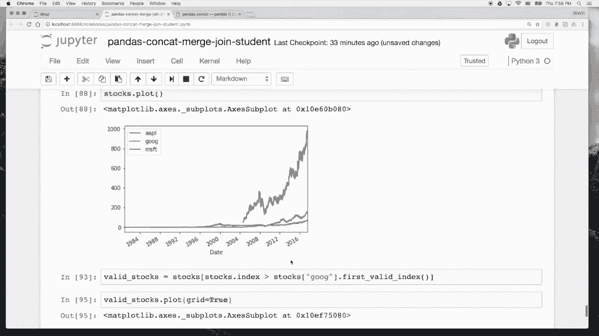

# 人工智能—Python AI公开课（七月在线出品） - P5：瑞士军刀pandas之数据整合 📊

在本节课中，我们将要学习如何使用pandas库进行数据整合，这是数据分析中连接和组合多个数据集的关键技能。我们将重点介绍三个核心函数：`concat`、`merge`和`join`，并通过实际代码演示它们的使用方法。

## 导入库与创建示例数据

首先，我们需要导入必要的库并创建一些示例数据框（DataFrame）用于演示。

```python
import numpy as np
import pandas as pd
```

我们创建三个简单的DataFrame，分别代表不同城市的一些数据。

```python
# 创建第一个DataFrame
df1 = pd.DataFrame({
    ‘apartments‘: [50000, 60000],
    ‘car‘: [300000, 350000]
}, index=[‘上海‘, ‘北京‘])

# 创建第二个DataFrame
df2 = pd.DataFrame({
    ‘apartments‘: [45000, 55000],
    ‘car‘: [280000, 320000]
}, index=[‘广州‘, ‘深圳‘])

# 创建第三个DataFrame
df3 = pd.DataFrame({
    ‘apartments‘: [40000],
    ‘car‘: [250000]
}, index=[‘杭州‘])
```

## 使用concat进行数据拼接

`concat`函数主要用于沿特定轴（行或列）拼接多个pandas对象。

### 按行拼接（纵向拼接）

默认情况下，`concat`按行（axis=0）进行拼接，即将数据框一个接一个地堆叠起来。

```python
result = pd.concat([df1, df2, df3])
print(result)
```

执行上述代码后，`df1`、`df2`和`df3`会按顺序纵向拼接成一个大的DataFrame。

### 指定拼接键（keys）

我们可以为每个被拼接的部分指定一个键（key），这会在结果中创建一个多级索引（MultiIndex）。

```python
result_with_keys = pd.concat([df1, df2, df3], keys=[‘x‘, ‘y‘, ‘z‘])
print(result_with_keys)
```

现在，结果的第一层索引是我们指定的键（‘x‘, ‘y‘, ‘z‘），第二层是原始索引。我们可以通过`.loc`方法访问特定部分。

```python
# 访问键为 ‘y‘ 的部分，即 df2
df2_extracted = result_with_keys.loc[‘y‘]
print(df2_extracted)
```

### 按列拼接（横向拼接）

通过设置参数`axis=1`，我们可以进行横向拼接，即按列合并。

首先，我们创建一个包含薪水信息的新DataFrame。

```python
df4 = pd.DataFrame({
    ‘salary‘: [15000, 18000, 16000, 14000, 13000]
}, index=[‘苏州‘, ‘北京‘, ‘上海‘, ‘广州‘, ‘天津‘])
```

现在，我们将`result`（之前的纵向拼接结果）与`df4`进行横向拼接。

```python
result_horizontal = pd.concat([result, df4], axis=1)
print(result_horizontal)
```

观察结果，只有索引匹配的城市（如‘上海‘、‘北京‘）的数据会被对齐，不匹配的索引位置会用`NaN`（空值）填充。

### 控制拼接方式：inner join

默认的拼接是`outer join`，保留所有索引。我们可以通过`join`参数指定为`inner`，只保留双方都匹配的索引。

```python
result_inner = pd.concat([result, df4], axis=1, join=‘inner‘)
print(result_inner)
```

这样，结果中只包含‘北京‘、‘上海‘、‘广州‘这三个在两个DataFrame中都存在的城市。

### 指定拼接轴（join_axes）

我们还可以指定以哪个DataFrame的索引为准进行拼接。这个功能在较新版本的pandas中已被弃用，更推荐使用`merge`或`join`方法。

```python
# 以 result 的索引为准（保留所有result中的行）
result_left = pd.concat([result, df4], axis=1, join_axes=[result.index])
print(result_left)

# 以 df4 的索引为准（保留所有df4中的行）
result_right = pd.concat([result, df4], axis=1, join_axes=[df4.index])
print(result_right)
```

### 使用append方法

`append`是`concat`在行方向（axis=0）上的一个简便方法，用于在DataFrame末尾添加行。

```python
# 将 df2 追加到 df1 的末尾
appended_df = df1.append(df2)
print(appended_df)

# 同时追加多个DataFrame
appended_multiple = df1.append([df2, df3])
print(appended_multiple)
```

### 拼接Series与DataFrame

`concat`也可以用于拼接Series和DataFrame。

```python
# 创建一个Series
s1 = pd.Series([60, 50], index=[‘上海‘, ‘北京‘], name=‘meal‘)
print(s1)

# 将Series与DataFrame按列拼接
combined = pd.concat([df1, s1], axis=1)
print(combined)
```

如果Series的索引能与DataFrame的列名匹配，也可以按行追加。

```python
# 创建一个索引为列名的Series
s2 = pd.Series([18000, 12000], index=[‘apartments‘, ‘car‘], name=‘厦门‘)
print(s2)

# 将Series追加为一行
df_with_series_row = df1.append(s2)
print(df_with_series_row)
```

上一节我们介绍了使用`concat`进行各种拼接操作，本节中我们来看看功能更强大的`merge`函数。

## 使用merge进行数据合并

`merge`函数用于基于一个或多个键（key）将两个DataFrame的行连接起来，它比`concat`更灵活，不局限于索引对齐。

首先，我们调整一下之前数据的结构，将索引重置为普通列，以便演示基于列的合并。

```python
# 重置 result 的索引，并将列重命名为 ‘cities‘
result_reset = result.reset_index().rename(columns={‘index‘: ‘cities‘})
print(result_reset)

# 同样处理 df4
df4_reset = df4.reset_index().rename(columns={‘index‘: ‘cities‘})
print(df4_reset)
```

现在，我们使用`merge`函数，基于‘cities‘列合并这两个DataFrame。

```python
# 基于 ‘cities‘ 列进行合并，默认是 inner join
merged_inner = pd.merge(result_reset, df4_reset, on=‘cities‘)
print(merged_inner)
```

### 指定合并方式（how参数）

`merge`的`how`参数用于指定合并类型。

以下是几种常见的合并方式：
*   **`inner`**：只保留两个DataFrame中键匹配的行（交集）。
*   **`outer`**：保留所有行，不匹配的位置用`NaN`填充（并集）。
*   **`left`**：以左边DataFrame的键为准，保留所有左表的行。
*   **`right`**：以右边DataFrame的键为准，保留所有右表的行。

```python
# 使用 outer join
merged_outer = pd.merge(result_reset, df4_reset, on=‘cities‘, how=‘outer‘)
print(merged_outer)

# 使用 left join (以 result_reset 为主)
merged_left = pd.merge(result_reset, df4_reset, on=‘cities‘, how=‘left‘)
print(merged_left)

# 使用 right join (以 df4_reset 为主)
merged_right = pd.merge(result_reset, df4_reset, on=‘cities‘, how=‘right‘)
print(merged_right)
```

了解了基于列的合并后，我们来看看如何基于索引进行合并，这时`join`函数就派上用场了。

## 使用join进行索引合并

`join`方法是`merge`的一个便捷用法，专门用于**基于索引**合并DataFrame。

首先，我们将DataFrame的索引设置回‘cities‘。

```python
# 将 ‘cities‘ 列重新设置为 df1 的索引
df1_indexed = df1.copy()
# df1 原本就有城市索引，这里确认一下

# 将 ‘cities‘ 列重新设置为 df4 的索引
df4_indexed = df4_reset.set_index(‘cities‘)
print(df4_indexed)
```

现在，使用`join`方法基于索引进行合并。

```python
# 默认是 left join，以调用者(df1)的索引为准
joined_default = df1.join(df4_indexed)
print(joined_default)
```

同样，`join`方法也支持`how`参数来指定合并类型。

```python
# 使用 outer join
joined_outer = df1.join(df4_indexed, how=‘outer‘)
print(joined_outer)

# 使用 right join (以 df4_indexed 的索引为准)
joined_right = df1.join(df4_indexed, how=‘right‘)
print(joined_right)
```

实际上，`merge`函数也可以通过指定`left_index`和`right_index`参数来实现基于索引的合并。

```python
# 使用 merge 实现基于索引的 outer join
merged_by_index = pd.merge(df1, df4_indexed, left_index=True, right_index=True, how=‘outer‘)
print(merged_by_index)
```

可以看到，`concat`、`merge`和`join`三者功能有重叠，许多操作可以通过不同方法实现。掌握它们各自的特点和适用场景是关键。

## 实战项目：整合与可视化多只股票数据

最后，我们将运用今天所学的数据整合知识，完成一个小型实战项目：下载并整合多只股票的历史数据，然后进行可视化比较。

以下是实现步骤：

1.  **读取股票数据**：我们从本地CSV文件读取Google、Apple和Microsoft的股票历史数据。
2.  **数据清洗**：处理数据中的异常值（例如，Apple数据中的字符串‘null‘）。
3.  **数据整合**：使用`concat`函数将三只股票的调整后收盘价合并到一个DataFrame中。
4.  **数据筛选与可视化**：筛选出Google上市后的数据，并绘制在一张图中进行比较。

```python
import matplotlib.pyplot as plt
# 确保图表能内嵌显示在Notebook中
%matplotlib inline

# 1. 读取数据
google = pd.read_csv(‘data/goog.csv‘, index_col=0, parse_dates=[‘Date‘])
apple = pd.read_csv(‘data/aapl.csv‘, index_col=0, parse_dates=[‘Date‘])
microsoft = pd.read_csv(‘data/msft.csv‘, index_col=0, parse_dates=[‘Date‘])

# 2. 数据清洗 (处理Apple数据中的 ‘null‘ 字符串)
# 将 ‘null‘ 替换为真正的NaN
apple[‘Adj Close‘] = apple[‘Adj Close‘].replace(‘null‘, np.nan)
# 将列转换为浮点数类型，无法转换的（NaN）保持原样
apple[‘Adj Close‘] = pd.to_numeric(apple[‘Adj Close‘], errors=‘coerce‘)
# 使用前向填充法填充NaN值
apple[‘Adj Close‘].fillna(method=‘ffill‘, inplace=True)

# 3. 提取需要的列并重命名
goog_adj_close = google[[‘Adj Close‘]].copy()
goog_adj_close.columns = [‘GOOG‘]

aapl_adj_close = apple[[‘Adj Close‘]].copy()
aapl_adj_close.columns = [‘AAPL‘]

msft_adj_close = microsoft[[‘Adj Close‘]].copy()
msft_adj_close.columns = [‘MSFT‘]

# 使用 concat 进行横向合并
stocks = pd.concat([aapl_adj_close, goog_adj_close, msft_adj_close], axis=1)
print(stocks.head())

# 4. 筛选数据（取Google上市后的数据）
# 找到GOOG列第一个非NaN值的索引日期
start_date = stocks[‘GOOG‘].first_valid_index()
# 筛选该日期之后的数据
stocks_filtered = stocks.loc[stocks.index >= start_date]

# 5. 绘制图表
plt.figure(figsize=(12, 6))
stocks_filtered.plot(grid=True)
plt.title(‘Stock Price Comparison (AAPL, GOOG, MSFT)‘)
plt.ylabel(‘Adjusted Close Price‘)
plt.xlabel(‘Date‘)
plt.show()
```

运行以上代码，我们将得到一张从2004年Google上市至今，三家公司股价走势的对比图。通过这个项目，我们实践了数据读取、清洗、整合（使用`concat`）和可视化的完整流程。

## 总结

本节课中我们一起学习了pandas中数据整合的三大核心工具。

*   **`concat`**：主要用于沿轴（行或列）简单堆叠多个DataFrame或Series，操作直观，适用于结构相似的数据集拼接。
*   **`merge`**：功能强大的合并函数，基于一个或多个键（列）连接行，支持多种连接类型（inner, outer, left, right），适用于数据库风格的合并操作。
*   **`join`**：`merge`的便捷方法，专门用于基于索引进行合并，语法更简洁。

我们还通过一个股票数据分析的实战项目，综合运用了`concat`等方法，将多个数据源整合后进行可视化分析。这些数据整合技能是进行复杂数据分析的基础，希望同学们能多加练习，熟练掌握。

> 提示：要深入了解这些函数的全部参数和高级用法，建议查阅官方文档（例如，搜索“pandas concat”、“pandas merge”）。




好，那我们今天的课就讲到这里。😊