# 人工智能—Python AI公开课（七月在线出品） - P7：如何从Python起步学习AI 🚀


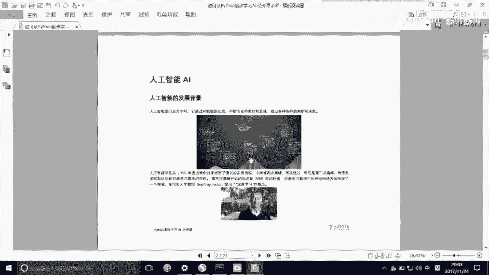

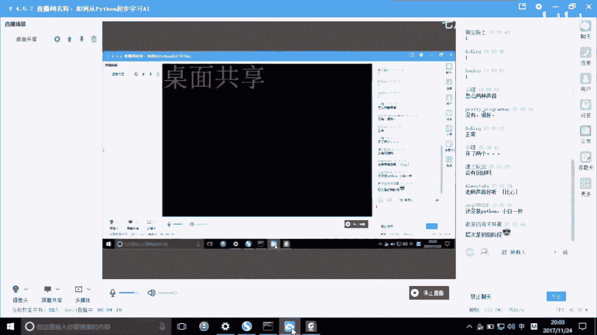

在本节课中，我们将要学习人工智能（AI）的基本概念、发展历程，以及如何规划一条从Python编程开始，系统学习AI的路径。课程内容将涵盖机器学习的核心思想、分类方法，并为你构建一个清晰的学习框架。

## 人工智能的发展背景 📜

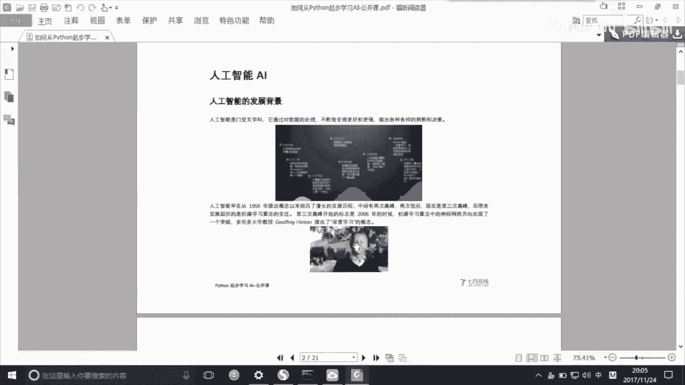

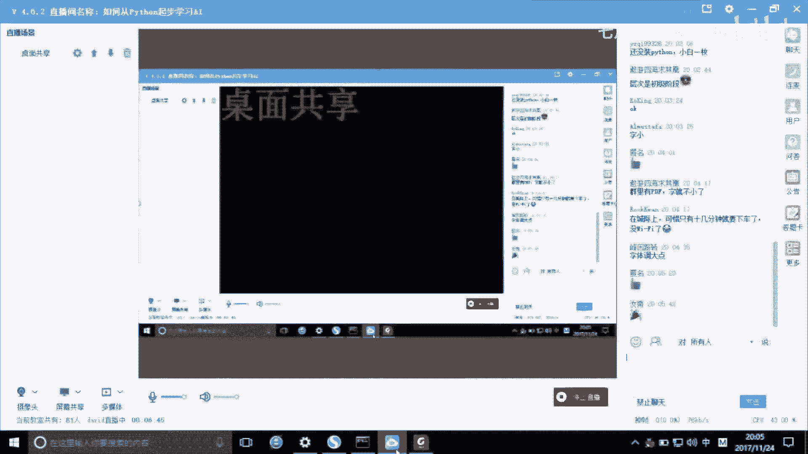

人工智能并非一个全新的概念。它在上世纪50至60年代就已提出，并经历了两次发展高峰。我们目前正处于以2006年深度学习理论提出、2013年在图像识别领域取得突破为标志的第三波发展浪潮中。

这次浪潮的兴起，不仅得益于理论的进步，更依赖于硬件计算资源（如GPU）的飞速发展和大数据平台的成熟。计算能力与数据量的同步提升，共同推动了人工智能技术在社会和工业界的广泛应用。

## 人工智能的发展路径 🛤️

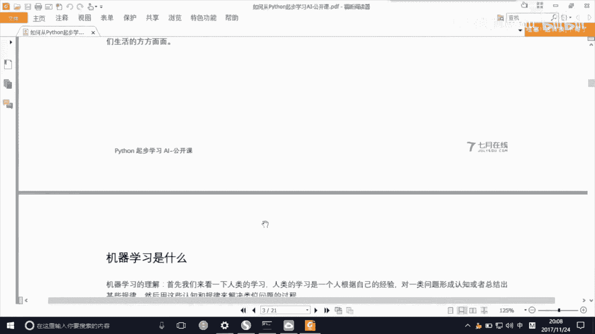

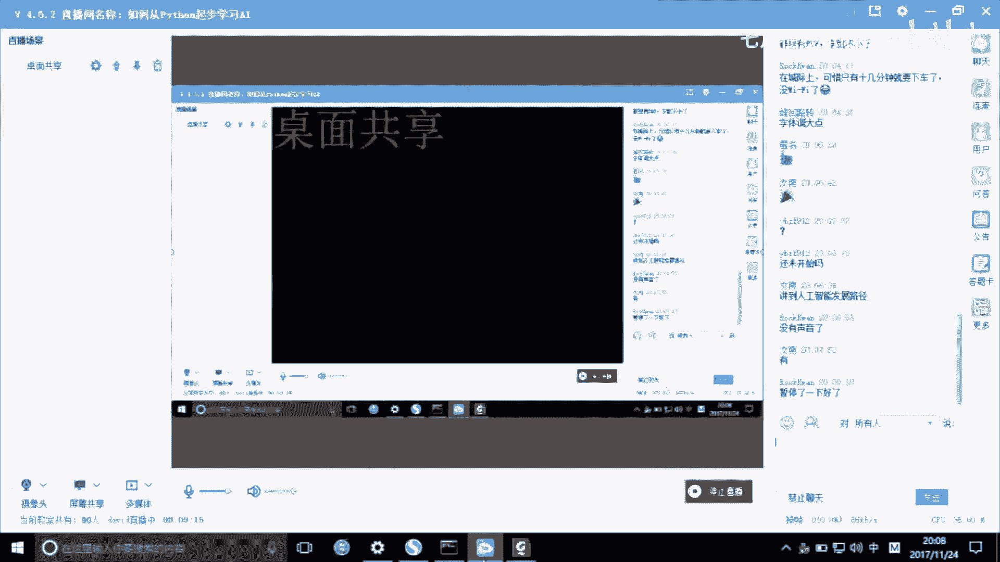

人工智能的终极目标是让机器在能力上接近并超越人类。过去的计算机擅长存储和计算，但在处理人类轻而易举的任务（如识别面孔）时却非常困难。在当前的第三波浪潮中，计算机开始在这些方面发力。

机器学习已经深度渗透到我们的日常生活中。例如，支付宝的面部识别、网易云音乐的歌曲推荐、电商平台的商品推荐等，都应用了机器学习技术。

## 什么是机器学习？ 🤔

我们可以从人类学习经验的角度来理解机器学习。人类通过总结规律来学习，例如“瑞雪兆丰年”或“朝霞不出门，晚霞行千里”。这些谚语就是经验的总结。

机器学习让计算机也能做类似的事情。它从数据中学习一套规律，以完成我们设定的目标。这个过程可以量化成一个学习模型。例如，预测明年收成，我们可以将“是否下雪”、“雪量”等作为数据特征，将“是否丰收”作为目标，让机器找出它们之间的关系。

在人类经验中，智慧通过“阅历”（如“吃亏是福”）来传递；在机器中，智慧则体现为学习到的**权重值**和**数字**。调整这些权重，就是机器积累“经验”的过程。

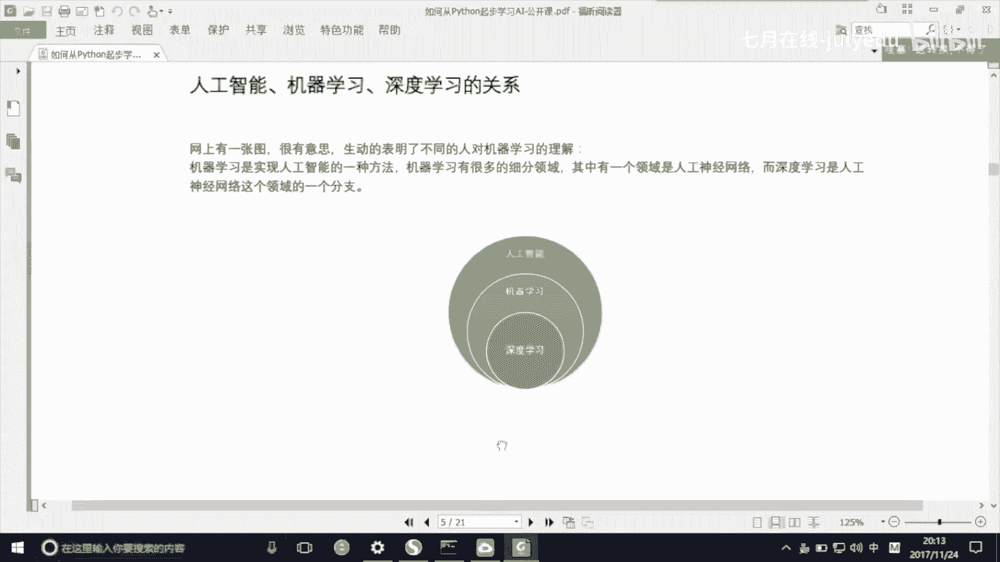

## 人工智能、机器学习与深度学习的关系 🎯

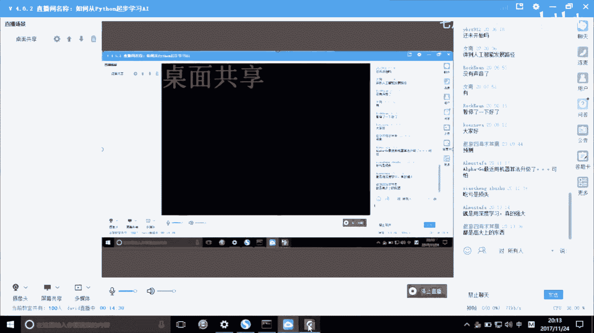

这几个概念是包含关系：
*   **人工智能**：一个非常宽泛的领域。
*   **机器学习**：实现人工智能的一种核心方法。
*   **深度学习**：是机器学习中“神经网络”方法的一个强大分支。因其在图像、语音、自然语言处理等领域的卓越表现，而被单独强调。

简单来说，深度学习是机器学习的一种，而机器学习是实现人工智能的一种方式。

## 机器学习的分类 📊

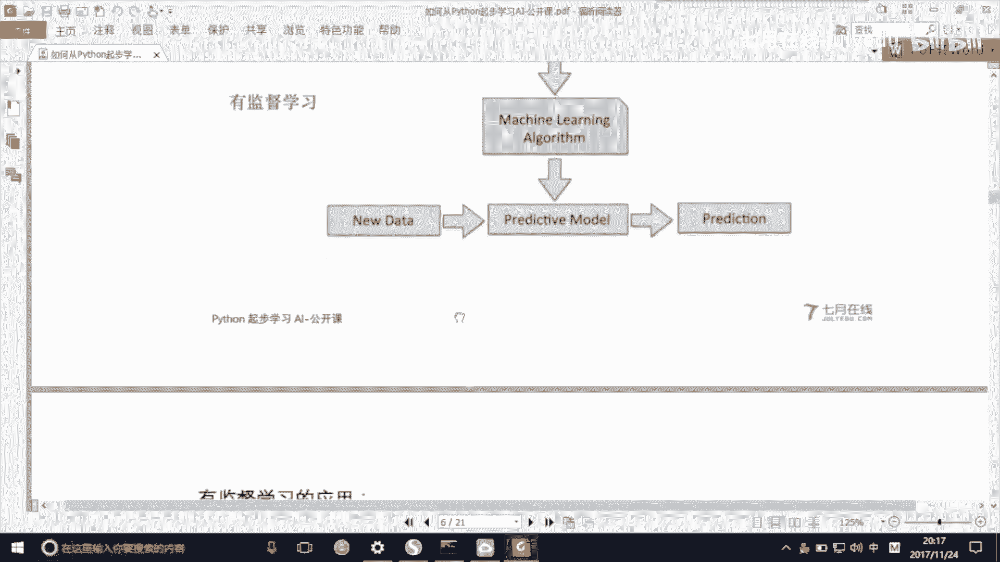

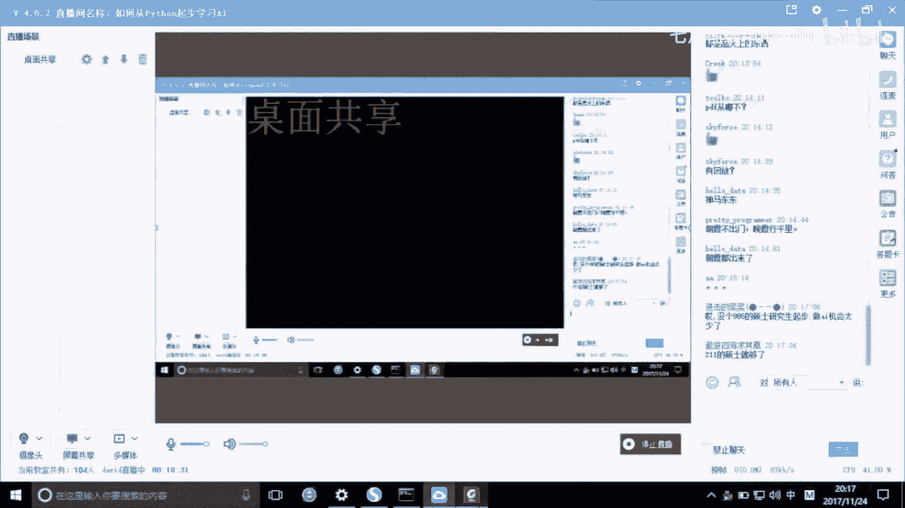

机器学习主要分为三大类：监督学习、无监督学习和强化学习。本节我们重点介绍前两类。

### 监督学习

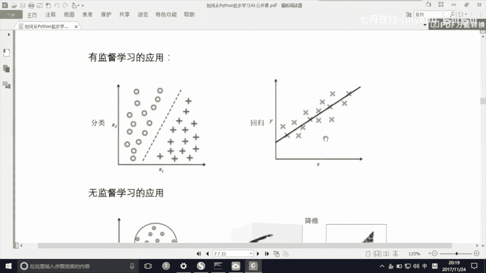


监督学习是最常用的方法。它的核心思想是：我们提供带有“标准答案”的数据，让机器学习数据与答案之间的关系。


上一节我们介绍了机器学习的思想，本节中我们来看看监督学习的具体例子。

以“瑞雪兆丰年”为例，构建一个监督学习模型：
1.  **训练数据**：收集1980年至2017年每年的冬季数据（特征：是否下雪、雪量等）和次年收成数据（标签：是否丰收，可用0/1表示）。
2.  **学习过程**：使用一个机器学习算法（如逻辑回归），学习特征（X）与标签（Y）之间的关系，即求解一个方程式 `Y = f(X)`。求得的方程系数就是**权重值**，即机器学到的“经验”。
3.  **预测**：将2017年的冬季数据输入学习好的模型，即可预测2018年的收成。

监督学习主要用于两类问题：
*   **分类**：预测目标变量是离散值（如猫/狗/猪，是否丰收）。
*   **回归**：预测目标变量是连续值（如房价、销售额）。

以下是监督学习的核心流程公式化表示：
```
给定训练数据集 {(x1, y1), (x2, y2), ..., (xn, yn)}
目标：学习一个映射函数 f: X -> Y
使得对于新数据 x_new，能预测 y_new = f(x_new)
```

### 无监督学习

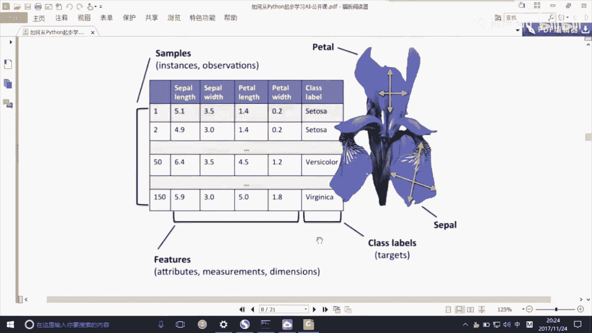

与监督学习不同，无监督学习的数据没有“标准答案”。它的目标是发现数据内部隐藏的结构或关系。

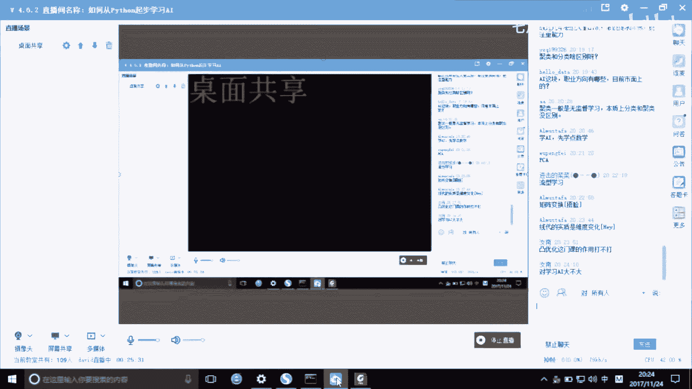

无监督学习主要有两类应用：
*   **聚类**：将相似的数据自动分组。例如，分析电商用户行为数据，自动发现喜欢同一类音乐或商品的用户群体。著名的“啤酒与尿布”案例就是聚类分析的结果。
*   **降维**：将高维数据压缩到低维空间，便于分析和可视化，同时尽可能保留数据的主要结构。常用方法有主成分分析（PCA）。

## 机器学习常见算法简介 ⚙️

以下是几种常见的机器学习算法：

*   **决策树**：模拟人类做决策的过程，通过一系列判断规则对数据进行分类。
*   **回归**（线性/逻辑回归）：寻找特征与连续目标（线性回归）或分类概率（逻辑回归）之间的线性关系。
*   **支持向量机**：通过核函数将数据映射到高维空间，以找到最佳分割超平面，尤其擅长处理线性不可分问题。
*   **神经网络/深度学习**：模拟人脑神经元网络。输入层与权重矩阵相连，通过多层计算（隐藏层）后得到输出。层数加深即为“深度”学习。
*   **朴素贝叶斯**：基于特征相互独立的假设，利用贝叶斯定理计算样本属于某个类别的概率。常用于垃圾邮件过滤。

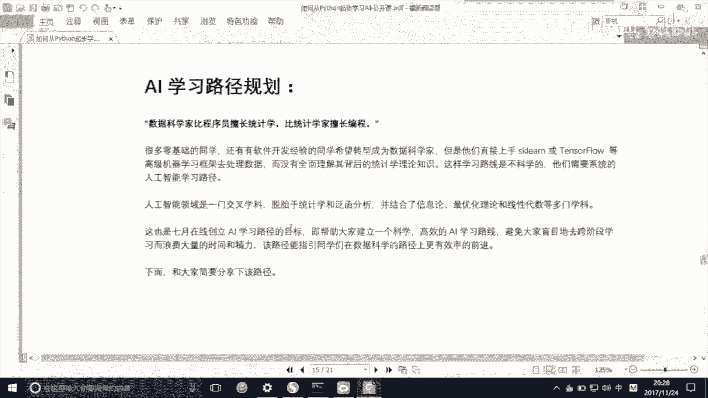

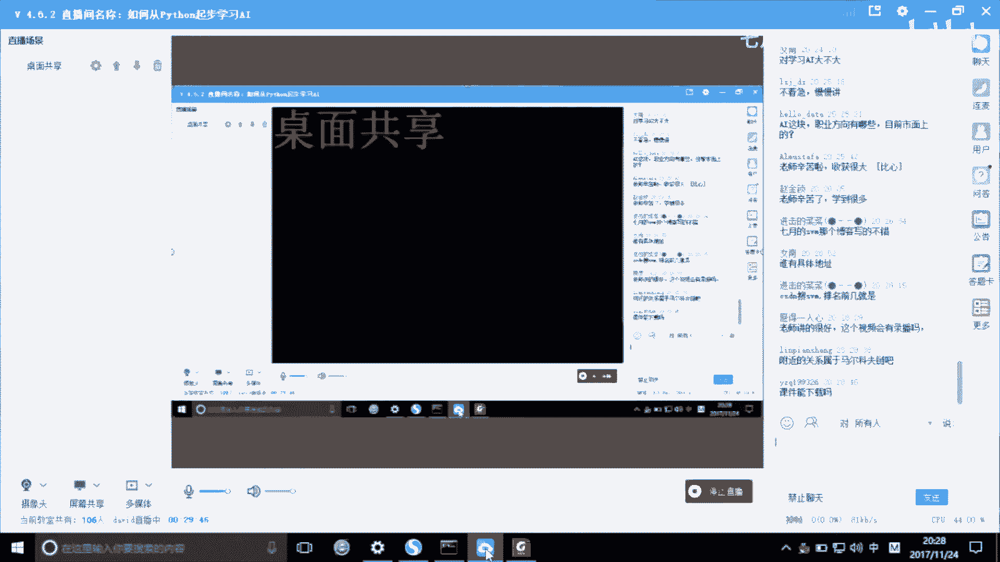

## AI学习路径规划 🗺️

了解了AI的基本概念后，我们来看看如何系统性地学习。一个科学的学习路径可以避免盲目和跨阶段学习，提升效率。以下是一个分为四个阶段的学习规划：

### 第一阶段：Python编程基础、算法与数据结构

这是计算机科学的基础。Python是当前AI领域最主流的编程语言，语法简洁，且有强大的第三方库生态支持（如NumPy, Pandas, Scikit-learn, TensorFlow）。同时，掌握基本算法和数据结构是通过技术面试的必备条件。

### 第二阶段：数理统计基础

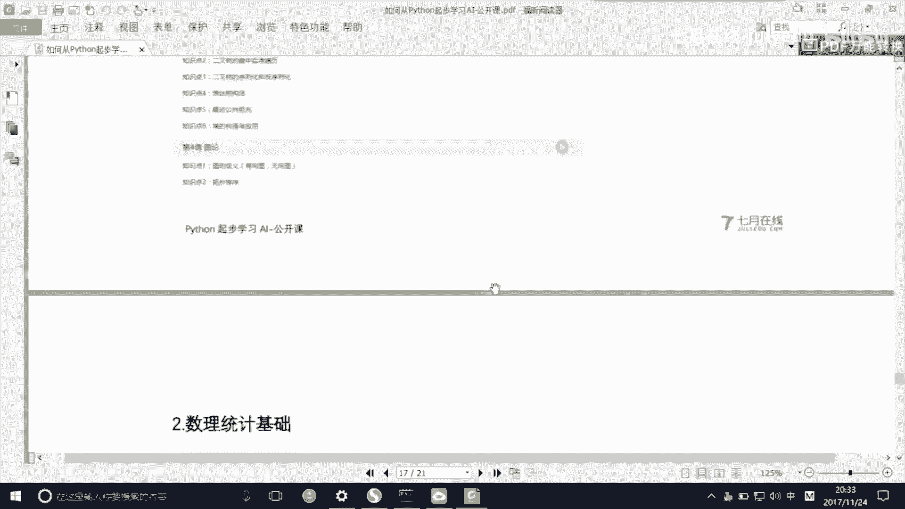

这是很多开发者的知识短板，却是理解机器学习算法原理的基石。例如，理解线性回归中的损失函数优化（梯度下降），就需要微积分和求导知识。扎实的数学基础能让你不仅知其然，更知其所以然。

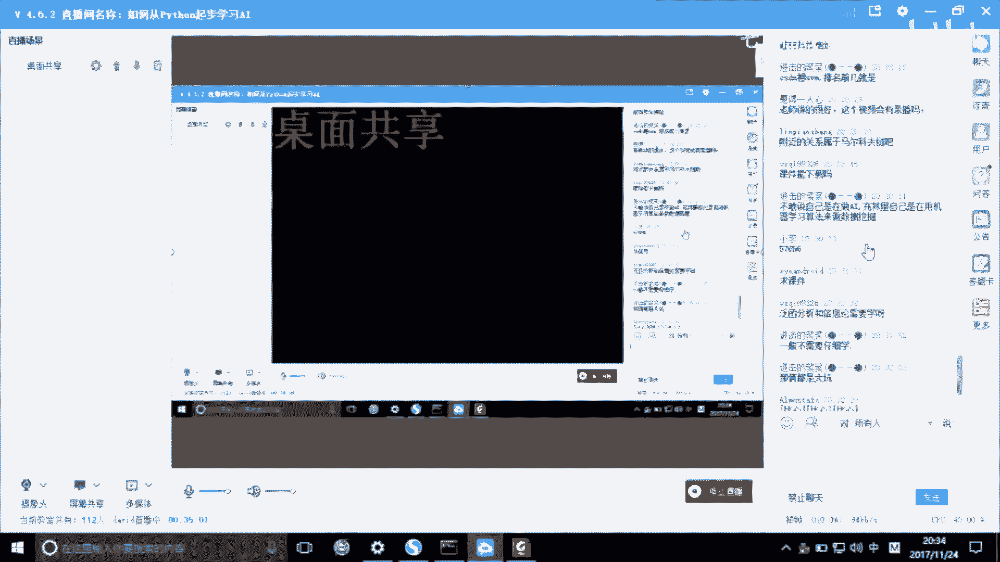

### 第三阶段：机器学习算法

此阶段需要深入学习和实践各种核心算法，如逻辑回归、决策树、SVM、聚类等。不仅要会用库（如Scikit-learn）调用，更要理解其数学模型、损失函数和调优方法。

### 第四阶段：实战应用

将前三个阶段的知识融会贯通，通过完整的项目来检验学习成果。只有亲手完成一个项目，才能将分散的知识点串联起来，形成解决实际问题的能力，这也是求职和转行时的重要凭证。

---

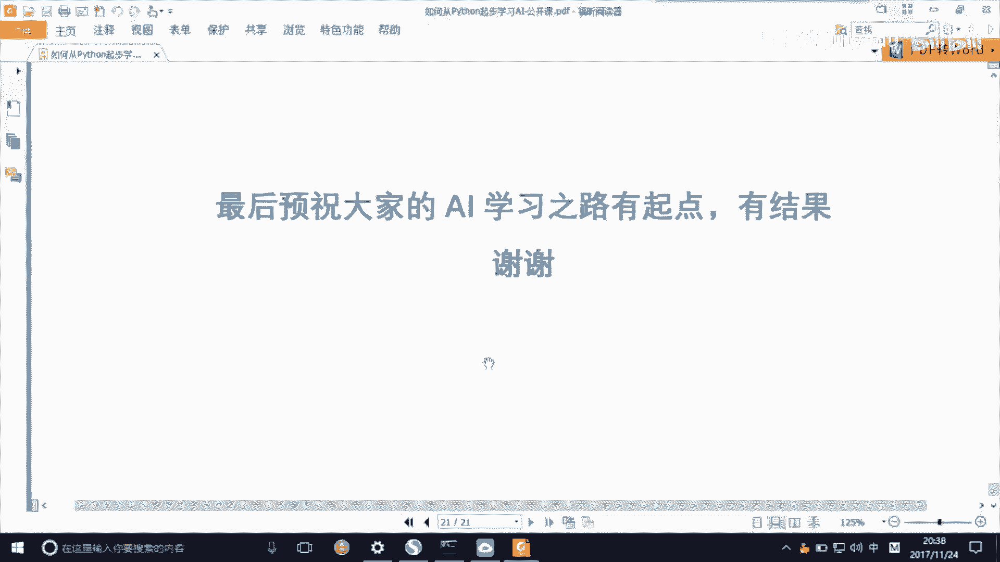

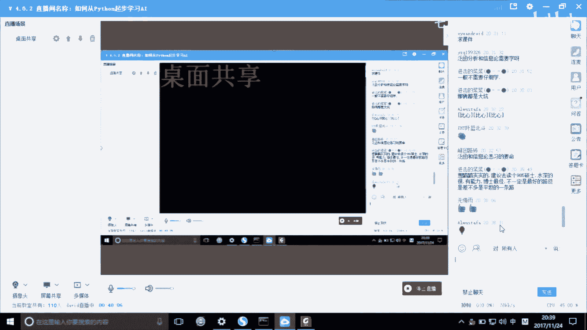

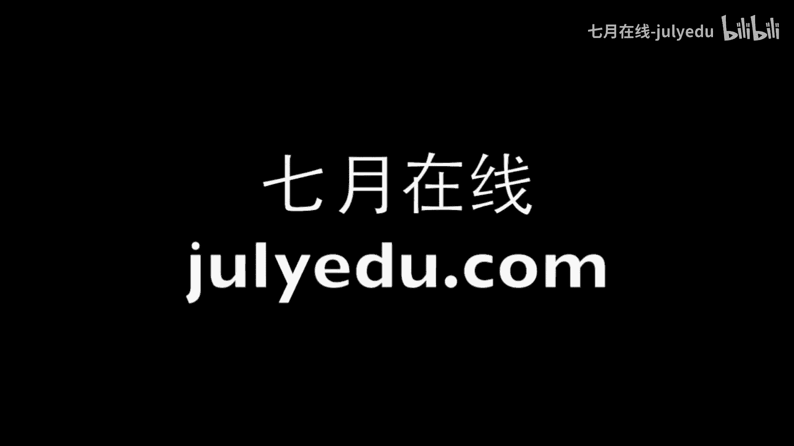

本节课中我们一起学习了人工智能的概况、机器学习的核心思想与分类，并规划了一条从Python入门到AI实战的系统学习路径。记住，学习AI是一个循序渐进的过程，希望你能有一个坚实的起点，并最终通过项目实践收获丰硕的成果。