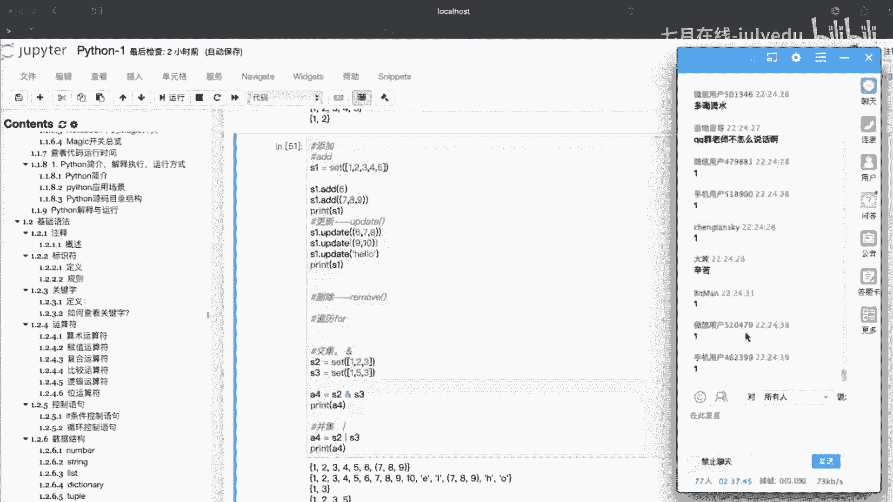

# 人工智能—Python AI公开课（七月在线出品） - P8：1小时带你熟练Python基础语法 🐍

在本节课中，我们将要学习Python的基础语法，包括注释、标识符、关键字、运算符、控制语句以及核心的数据结构。内容设计力求简单直白，让初学者能够轻松跟上。

## 概述 📋

Python是一门简洁而强大的编程语言。掌握其基础语法是进行后续人工智能和数据分析学习的基石。本节课程将系统性地介绍Python的核心语法元素，并通过实例帮助大家理解。

---

## 一、注释 📝

注释在每种编程语言中都有。它的作用主要是方便后期的代码阅读和维护。

注释在程序中不参与解释运行，也不会被输出。例如：

```python
# 这是一行注释，说明下面代码的功能
print("hello world")
```

运行上述代码，只会输出 `hello world`，而注释内容不会被显示。它仅起到辅助说明的作用，在后期代码维护时非常重要。如果没有注释，可能连开发者自己都会忘记代码的意图。

---

## 二、标识符 🏷️

上一节我们介绍了注释，本节中我们来看看标识符。

标识符就是一个名字，由开发人员在程序中自定义的一些符号和名称构成。例如变量名、函数名等，都可以称为标识符。

标识符的规则分为两大类：固定规则和行业规则。

### 固定规则
标识符由字母、下划线和数字组成。这三者可以任意组合，但数字不能作为开头。

以下是标识符规则的一些例子（√ 表示合法，× 表示不合法）：
*   `myVariable` (√)
*   `_private` (√)
*   `var123` (√)
*   `123var` (×，数字开头)
*   `my-var` (×，包含横线)
*   `my.var` (×，包含点号)

### 行业规则（命名规范）
在实际开发中，需要遵循一些命名规范，通常在项目开始前团队会统一约定。

以下是常见的行业命名规范：
1.  **见名知意**：尽量让标识符的名字直观反映其用途，例如 `name` 表示姓名，`student` 表示学生。
2.  **驼峰命名法**：
    *   **小驼峰**：第一个单词小写，后面每个单词首字母大写，例如 `myFirstName`。
    *   **大驼峰**：每个单词的首字母都大写，例如 `MyFirstName`。
3.  **下划线命名法**：用下划线连接单词，例如 `my_first_name`。这是目前Python社区比较流行的方式。

---

## 三、关键字 🔑

关键字是一些具有特殊功能的标识符。我们只需要了解两点：哪些是关键字，以及关键字不能用作自定义的标识符。

例如，`pass`, `and`, `or`, `not`, `True`, `False` 等都是Python的关键字。在定义变量或函数名时，应避免使用这些关键字，否则会引起歧义或错误。

查看Python中所有关键字的方法如下：

**方法一：在终端中查看**
```python
# 进入Python交互环境后执行
import keyword
print(keyword.kwlist)
```

**方法二：在代码文件中查看**
```python
import keyword
print(keyword.kwlist)
```

---

## 四、运算符 ⚙️

运算符用于执行程序代码运算。Python中常见的运算符有六类：算术运算符、赋值运算符、复合赋值运算符、比较运算符、逻辑运算符和位运算符。

### 1. 算术运算符
进行基本的数学运算。
*   `+` (加), `-` (减), `*` (乘), `/` (除)
*   `%` (取余), `//` (取整), `**` (幂)

### 2. 赋值运算符
将右侧的值赋给左侧的变量。
*   `=` (赋值)
```python
number = 10  # 将整数10赋值给变量number
```

### 3. 复合赋值运算符
将算术运算符和赋值运算符结合起来。
*   `+=`, `-=`, `*=`, `/=`, `%=`, `//=`, `**=`
```python
c += a  # 等价于 c = c + a
```

### 4. 比较运算符
比较两个值，返回布尔值（`True` 或 `False`）。
*   `==` (等于), `!=` (不等于)
*   `>` (大于), `<` (小于)
*   `>=` (大于等于), `<=` (小于等于)
> **注意**：一个等号 `=` 是赋值，两个等号 `==` 才是比较是否相等。

### 5. 逻辑运算符
用于连接多个条件，也返回布尔值。
*   `and` (与)：两个条件都为真时返回真。
*   `or` (或)：至少一个条件为真时返回真。
*   `not` (非)：对条件取反。
> **注意**：Python中使用关键字 `and`, `or`, `not` 作为逻辑运算符，而不是符号 `&&`, `||`, `!`。

### 6. 位运算符
直接对整数的二进制位进行操作，常用于底层优化。
*   `&` (按位与), `|` (按位或), `^` (按位异或)
*   `~` (按位取反), `<<` (左移), `>>` (右移)
```python
a = 60  # 二进制：0011 1100
b = 13  # 二进制：0000 1101
print(a & b) # 结果为 12 (二进制：0000 1100)
```

---

## 五、控制语句 🎮

控制语句用于控制程序的执行流程，主要包括条件判断和循环。

### 1. 条件判断 (if语句)
条件判断用于在满足特定条件时才执行某些代码。

Python中if语句有四种基本格式：

**格式一：简单的if**
```python
if 条件:
    # 条件成立时执行的代码
```

**格式二：if...else**
```python
if 条件:
    # 条件成立时执行的代码
else:
    # 条件不成立时执行的代码
```

**格式三：if...elif...else (多条件)**
```python
if 条件1:
    # 条件1成立时执行
elif 条件2:
    # 条件2成立时执行
else:
    # 以上条件都不成立时执行
```

**格式四：嵌套if**
可以在一个if代码块中嵌入另一个if语句。

示例：判断年龄
```python
age = 25
if age >= 18:
    print("你已经成年了。")
```

### 2. 循环
循环用于重复执行某段代码。Python主要有两种循环：`while` 循环和 `for` 循环。

#### while循环
`while` 循环在条件为真时重复执行代码块。
```python
# 计算1到100的和
i = 1
sum = 0
while i <= 100:
    sum += i
    i += 1
print(sum) # 输出 5050
```

#### for循环
`for` 循环常用于遍历序列（如字符串、列表等）。
```python
# 遍历字符串
name = "julyedu.com"
for char in name:
    print(char)
```

#### 循环控制关键字
*   `break`：立即终止整个循环。
*   `continue`：跳过本次循环的剩余语句，直接进入下一次循环。

```python
# break 示例
for char in "julyedu.com":
    if char == 'd':
        break
    print(char) # 只打印出 julye

# continue 示例
for char in "julyedu.com":
    if char == 'd':
        continue
    print(char) # 跳过 'd'，打印其他所有字符
```
> **注意**：`break` 和 `continue` 只对所在的最内层循环起作用。编写循环时，务必确保有明确的退出条件，避免死循环。

---

## 六、数据结构 🗃️

Python内置了六种核心数据结构：数字(Number)、字符串(String)、列表(List)、元组(Tuple)、字典(Dictionary)、集合(Set)。

### 1. 数字 (Number)
用于存储数值，分为四类：
*   `int` (整数)， 如 `10`
*   `float` (浮点数)， 如 `5.5`
*   `bool` (布尔)， 如 `True`, `False`
*   `complex` (复数)， 如 `4+3j`

使用 `type()` 函数可以查看变量的数据类型：
```python
a = 20
b = 5.5
c = True
d = 4+3j
print(type(a)) # <class 'int'>
print(type(b)) # <class 'float'>
print(type(c)) # <class 'bool'>
print(type(d)) # <class 'complex'>
```

### 2. 字符串 (String)
字符串是由单引号或双引号括起来的字符序列。
```python
my_str = "Hello, World!"
```

**字符串操作：**
*   **下标索引**：从0开始，通过 `字符串名[索引]` 访问特定字符。
*   **切片**：用于截取字符串的一部分，语法为 `[起始:结束:步长]`，遵循“左闭右开”原则。
```python
name = "ABCDEF"
print(name[0])    # 输出 'A'
print(name[0:3])  # 输出 'ABC' (索引0,1,2)
print(name[::2])  # 输出 'ACE' (从头到尾，步长为2)
print(name[::-1]) # 输出 'FEDCBA' (反转字符串)
```

### 3. 列表 (List)
列表是用方括号 `[]` 括起来的、可变的、有序的元素集合，可以存储不同类型的数据。
```python
my_list = ['小王', '小张', 1, True]
```

**列表的常见操作（增删改查）：**
```python
# 增加元素
my_list.append('新元素')       # 在末尾添加
my_list.insert(1, '插入元素') # 在指定索引前插入
my_list.extend([7,8,9])       # 合并另一个列表

# 删除元素
del my_list[0]      # 删除指定索引的元素
my_list.pop()       # 删除并返回末尾元素
my_list.remove('小张') # 删除第一个匹配的元素

# 修改元素
my_list[0] = '修改后的值'

# 查询与排序
if '小王' in my_list:
    print("存在")
my_list.sort()      # 升序排序
my_list.reverse()   # 反转列表
```

### 4. 字典 (Dictionary)
字典是用花括号 `{}` 括起来的、可变的、由键值对(`key:value`)组成的集合。键必须是不可变类型。
```python
student = {'name': '小明', 'id': 100, 'sex': '男'}
```

**字典的常见操作：**
```python
# 增/改：通过键直接赋值
student['age'] = 20  # 新增键值对
student['id'] = 200  # 修改已有键的值

# 删
del student['sex']   # 删除指定键值对
student.clear()      # 清空字典

# 查
print(student['name'])          # 直接通过键访问，键不存在会报错
print(student.get('name'))      # 使用get方法，键不存在返回None
print(student.keys())           # 获取所有键
print(student.values())         # 获取所有值
print(student.items())          # 获取所有键值对（元组形式）
```

### 5. 元组 (Tuple)
元组是用圆括号 `()` 括起来的、**不可变的**、有序的元素集合。一旦创建，其元素不能修改。
```python
my_tuple = (1, 2, 3, 'go', True)
```

**元组操作：**
```python
print(my_tuple[0])   # 通过索引访问，输出 1
# my_tuple[0] = 100  # 错误！元组元素不可修改
del my_tuple         # 可以删除整个元组
new_tuple = my_tuple + (4, 5) # 元组可以连接
```

### 6. 集合 (Set)
集合是用花括号 `{}` 或 `set()` 函数创建的、**无序的、元素不重复**的集合。常用于去重和关系测试。
```python
my_set = {1, 2, 3, 3, 2} # 实际存储为 {1, 2, 3}
```

**集合的常见操作：**
```python
# 增加元素
my_set.add(4)
my_set.update([5, 6, 7])

# 删除元素
my_set.remove(3) # 移除元素，不存在则报错
my_set.discard(10) # 移除元素，不存在也不报错

# 集合运算
set_a = {1, 2, 3}
set_b = {3, 4, 5}
print(set_a & set_b) # 交集 {3}
print(set_a | set_b) # 并集 {1, 2, 3, 4, 5}
print(set_a - set_b) # 差集 (在a中但不在b中) {1, 2}
```

---

## 总结 🎉

本节课中我们一起学习了Python的基础语法核心内容。我们从最基础的注释和标识符讲起，明确了代码书写规范。然后深入了解了关键字、各类运算符的用法。接着，我们掌握了控制程序流程的两种重要结构：条件判断(`if`)和循环(`while`, `for`)。最后，我们系统学习了Python的六大内置数据结构：数字、字符串、列表、元组、字典和集合，并了解了它们的基本特性和常用操作。




这些知识是编写任何Python程序的基石。理解并熟练运用它们，将为后续学习更高级的主题（如函数、面向对象编程、数据分析与人工智能库）打下坚实的基础。建议大家多动手练习，通过代码来巩固理解。