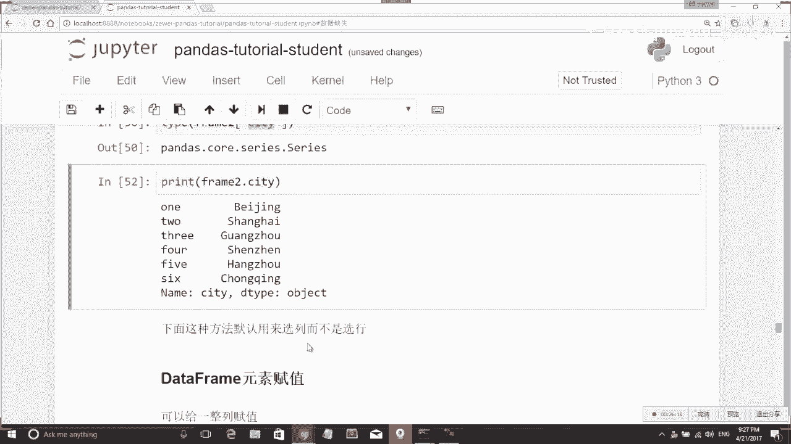

# 人工智能—Python AI公开课（七月在线出品） - P9：Pandas初步：Series与DataFrame操作 🐼

在本节课中，我们将要学习Pandas库的两个核心数据结构：Series和DataFrame。我们将从如何创建它们开始，逐步学习如何从中选择数据、进行赋值以及执行基本的数据运算。通过本教程，你将能够使用Pandas进行初步的数据操作。

## 导入必要的库

要使用Pandas，我们首先需要导入它。同时，我们也会导入NumPy库，因为Pandas的许多操作都构建在NumPy之上，并且后续可能会用到NumPy的功能。

```python
import pandas as pd
import numpy as np
```

现在，我们已经导入了Pandas和NumPy这两个库，这是我们今天工作的基础。

## 认识Series数据结构 📊

Series是Pandas中的一维数据结构。在Python中，一维数据结构通常是一个列表（list）。Series可以看作是对列表的一种封装，它为每个数据元素添加了一个索引。

### 创建Series

以下是创建Series的几种方法。

#### 方法一：使用列表创建

我们可以直接从一个列表创建一个Series。Pandas会自动为列表中的每个元素分配一个从0开始的整数索引。

```python
my_list = [‘a‘, ‘b‘, 1, 2, 3]
print(type(my_list))  # 输出：<class ‘list‘>

my_series = pd.Series(my_list)
print(my_series)
```

输出结果中，列表被封装成了一个Series，每个元素都带有一个索引，数据类型为`object`，因为列表中混合了字符串和数字。

#### 方法二：自定义索引

我们也可以在创建Series时，通过`index`参数自定义索引。

```python
my_series_custom = pd.Series(my_list, index=[‘A‘, ‘B‘, ‘C‘, ‘D‘, ‘E‘])
print(my_series_custom)
print(type(my_series_custom))
```

现在，Series的索引变成了我们指定的`[‘A‘, ‘B‘, ‘C‘, ‘D‘, ‘E‘]`。

#### 方法三：使用字典创建

由于Series本质上是一个键值对结构，我们也可以直接用一个字典来创建它。字典的键（key）会自动成为Series的索引。

```python
city_prices = {‘Beijing‘: 80000, ‘Guangzhou‘: 30000, ‘Hangzhou‘: 20000, ‘Shanghai‘: 70000, ‘Suzhou‘: np.nan}
apartments = pd.Series(city_prices)
print(apartments)
print(type(apartments))
```

这样，我们就用字典创建了一个表示城市房价的Series。

### 从Series中选择数据

创建了Series之后，我们需要知道如何从中提取我们需要的数据。

#### 通过索引选择单个值

我们可以像访问字典一样，通过索引键来获取对应的值。

```python
print(apartments[‘Hangzhou‘])  # 输出：20000.0
```

#### 通过索引列表选择多个值

我们可以传入一个索引列表，来获取多个值，返回的结果仍然是一个Series。

```python
selected_cities = apartments[[‘Hangzhou‘, ‘Beijing‘, ‘Shenzhen‘]]
print(selected_cities)
print(type(selected_cities))
```

#### 使用布尔索引进行条件筛选

布尔索引允许我们根据条件来筛选数据。例如，我们想筛选出所有房价低于5万元的城市。

```python
# 首先，创建一个布尔序列
condition = apartments < 50000
print(condition)

# 然后，使用这个布尔序列来筛选数据
cheap_cities = apartments[condition]
print(cheap_cities)
```

`apartments < 50000`这个操作会返回一个布尔类型的Series，其中满足条件的索引对应`True`，否则为`False`。然后我们可以用这个布尔Series来索引原数据。

### 为Series中的数据赋值

对Series中的元素进行赋值非常直接，方法与读取数据类似。

#### 为单个元素赋值

```python
apartments[‘Shenzhen‘] = 55000
print(apartments[‘Shenzhen‘])
```

#### 使用布尔索引为多个元素赋值

我们也可以利用布尔索引，一次性修改多个满足条件的值。

```python
apartments[apartments < 50000] = 40000
print(apartments)
```

现在，所有房价低于5万元的城市都被设置成了4万元。

### Series的基本数据运算

Series支持许多基本的数学运算，这些运算通常是向量化的，会作用在每一个元素上。

```python
# 所有值除以2
print(apartments / 2)

# 所有值乘以2
print(apartments * 2)

# 计算平方，可以使用NumPy的函数
print(np.square(apartments))

# 或者使用Python的幂运算符
print(apartments ** 2)
```

#### Series之间的运算

我们还可以对两个Series进行运算。需要注意的是，运算会基于索引进行对齐。只有两个Series中都存在的索引，才会进行运算；不存在的索引，结果会显示为`NaN`（Not a Number）。

```python
# 假设我们定义了另一个Series表示城市购车成本
car_costs = pd.Series({‘Beijing‘: 100000, ‘Guangzhou‘: 80000, ‘Shanghai‘: 120000, ‘Shenzhen‘: 90000})

# 计算在每个城市购买100平米房子和一辆车的总成本
total_cost = car_costs + apartments * 100
print(total_cost)
```

结果中，只有`Beijing`， `Guangzhou`， `Shanghai`， `Shenzhen`这四个在两个Series中都存在的城市有计算结果，其他城市的结果为`NaN`。

### 处理缺失数据（NaN）

在实际数据中，经常会出现缺失值，Pandas用`NaN`表示。Pandas提供了一些方法来检查和操作缺失值。

#### 检查索引是否存在

```python
print(‘Hangzhou‘ in apartments)  # 输出：True
print(‘Hangzhou‘ in car_costs)   # 输出：False
```

#### 检查数据是否为NaN

`isna()`方法返回一个布尔Series，指示哪些元素是`NaN`。`notna()`则相反。

```python
print(apartments.isna())   # 显示哪些是NaN
print(apartments.notna())  # 显示哪些不是NaN
```

我们可以利用这些布尔Series进行筛选。

```python
# 筛选出非空值
valid_prices = apartments[apartments.notna()]
print(valid_prices)

# 筛选出空值（NaN）
missing_prices = apartments[apartments.isna()]
print(missing_prices)
```

还有其他等价的写法，例如`apartments[apartments.isna() == False]`也能筛选出非空值。

上一节我们详细介绍了Series的创建、选择、赋值和运算。接下来，我们将目光转向更强大的二维数据结构——DataFrame。

## 认识DataFrame数据结构 📈

DataFrame是Pandas中最重要的数据结构，它是一个二维的、表格型的数据结构，可以看作是由多个Series按列组合而成，类似于Excel表格或SQL数据库中的表。

### 创建DataFrame

创建DataFrame有多种方式，最常用的是通过字典来创建。

#### 使用字典创建

字典的每个键值对代表一列数据，键是列名，值是一个列表，代表该列的所有数据。

```python
data = {
    ‘city‘: [‘Beijing‘, ‘Shanghai‘, ‘Guangzhou‘, ‘Shenzhen‘, ‘Hangzhou‘, ‘Suzhou‘],
    ‘year‘: [2010, 2010, 2010, 2010, 2010, 2010],
    ‘population‘: [1961, 2302, 1270, 1036, 870, 534]  # 单位：万，示例数据
}

frame_one = pd.DataFrame(data)
print(frame_one)
print(type(frame_one))
```

生成的DataFrame有行（自动生成的索引0,1,2...）和列（我们定义的`city`， `year`， `population`）。

#### 指定列的顺序

在创建时，我们可以通过`columns`参数指定列的顺序。

```python
frame_two = pd.DataFrame(data, columns=[‘year‘, ‘city‘, ‘population‘])
print(frame_two)
```

如果指定的列名在数据中不存在，Pandas会自动创建该列，并用`NaN`填充。

```python
frame_three = pd.DataFrame(data, columns=[‘year‘, ‘city‘, ‘population‘, ‘debt‘])
print(frame_three)
```

#### 指定行的索引

类似Series，我们也可以通过`index`参数为DataFrame指定自定义的行索引。

```python
frame_four = pd.DataFrame(data, index=[‘one‘, ‘two‘, ‘three‘, ‘four‘, ‘five‘, ‘six‘])
print(frame_four)
```

### 从DataFrame中选择数据

DataFrame的数据选择更加灵活，因为我们需要同时考虑行和列。

#### 选择单列数据

选择单列数据有两种常用方法，返回的是一个Series。

```python
# 方法一：使用点号（属性访问方式），列名必须是有效的Python变量名
city_series = frame_two.city
print(city_series)
print(type(city_series))  # 输出：<class ‘pandas.core.series.Series‘>

# 方法二：使用方括号（字典访问方式）
city_series_alt = frame_two[‘city‘]
print(city_series_alt)
```

#### 选择多列数据

要选择多列，需要传入一个列名的列表，返回的结果是一个新的DataFrame。



```python
sub_frame = frame_two[[‘city‘, ‘population‘]]
print(sub_frame)
print(type(sub_frame))  # 输出：<class ‘pandas.core.frame.DataFrame‘>
```


本节课中我们一起学习了Pandas库的两个基石：Series和DataFrame。我们掌握了如何创建它们，如何通过索引、布尔索引等方式灵活地选择和筛选数据，以及如何进行基本的数据运算和缺失值处理。DataFrame作为二维表格，其数据选择方式更为丰富，我们学习了如何选取单列和多列数据。这些是进行数据分析和处理的第一步，熟练掌握它们将为后续更复杂的数据操作打下坚实的基础。