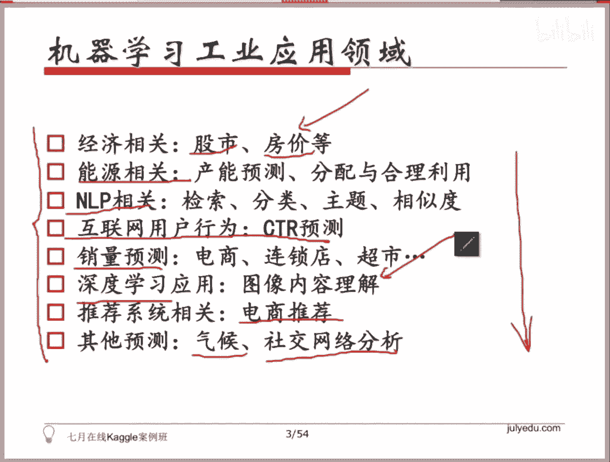

# 人工智能—Kaggle实战公开课（七月在线出品） - P1：机器学习到底应用在哪些酷炫领域？ 🚀

在本节课中，我们将要学习机器学习解决实际问题的完整流程，并了解机器学习在众多领域的广泛应用。课程将首先介绍一个通用的建模流程，然后讲解核心工具的使用，最后概览机器学习在各个行业中的具体应用场景。

## 课程概述与目标

首先感谢大家参加本次Kaggle比赛实战课程。从今天开始，我们将陆续看到机器学习建模解决各种问题的完整流程。课程将涵盖数据比赛和工业界对应的应用。

本节课作为开篇，旨在介绍机器学习解决实际问题的流程、建模与优化方式，以及可能用到的工具和模板。掌握工具后，后续应用会相对顺畅。

由于不清楚每位同学的背景和对机器学习的熟悉程度，今天的内容对部分同学可能已有所了解，对部分同学可能稍显深入。这没有关系，因为本节课主要目标是带大家熟悉流程和工具。许多内容可能需要课后消化，课上只需建立整体认知即可。

从下节课开始，嘉浩老师和我将带大家探讨具体场景下的机器学习应用和各类Kaggle比赛。希望大家在每节课后，都能在案例中找到与课程对应的知识点。本节课提到的完整工作流程，在后续学习比赛或工业应用时都会遇到。实际应用中，不一定涵盖所有环节，可能在特征选择或模型处理等环节有更深入的工作。

如果大家对今天的内容有任何不明白的地方，可以随时提问。

## 机器学习应用全流程解析 🔄

本节我们将首先了解使用机器学习解决问题（无论是参加比赛还是解决工业界实际问题）的大致总体流程。我们将根据这个流程，逐一介绍每个环节中可以调用的库和工具。

我们将使用一个在机器学习领域广泛使用的库——**Scikit-learn**。我们将按照流程，介绍其中涉及数据处理、特征工程、模型选择等环节可调用的类或函数。

流程主要涉及以下五个环节：
1.  数据处理
2.  特征工程
3.  模型选择与超参数优化
4.  模型评估与分析
5.  模型融合

以下是每个环节的简要说明：

*   **数据处理**：涉及数据清洗、缺失值处理、数据转换等预处理工作。
*   **特征工程**：通过创建、转换、选择特征，以更好地表示数据，提升模型性能。
*   **模型选择与超参数优化**：选择合适的算法模型，并寻找最优的超参数组合。模型性能的差异往往源于超参数的选择，例如决策树的数量、深度等。
*   **模型评估与分析**：使用合适的评估标准来衡量模型效果的好坏。
*   **模型融合**：结合多个模型的预测结果，以提升最终表现的常用策略。

我们将顺着这五个环节，带大家了解Scikit-learn这个工具包中哪些部分是可用的。相关链接已在PPT中提供。

## 理解评估标准：Kaggle Wiki的重要性 📚

接下来，我们将带大家浏览Kaggle的Wiki页面。了解历史比赛情况非常有用。更好的方式是，先了解历史上是否存在与你当前要解决的问题类似的问题。

这有几重含义，其中很重要的一点是：做任何工作都需要一个评判标准。**标准的不同会直接影响最终的效果**。如果你的优化是针对准确率进行的，但任务的评估标准是F1分数或AUC，那么即使准确率很高，最终排名或分数也可能不理想。

因此，你需要了解问题的评判标准是什么。Kaggle体系中有许多评判标准。例如，对于回归问题，有均方误差等标准；对于分类问题，又有其他不同的标准。这些标准的衡量方式各不相同。

如果不了解评估标准，直接以你认为的分类准确率去优化，结果可能并不理想。例如，一些企业举办的比赛，其评判标准可能与常见标准不同。了解并针对目标评估标准进行优化，才能在该体系下取得好成绩。

## 核心工具：XGBoost与自定义目标函数 ⚙️

以XGBoost为例，它支持用户自定义目标函数。这意味着你可以根据比赛特定的评估标准来设定优化目标。但自定义目标函数有一些要求，后续课程会详细说明。

了解最终的评判目标，并针对该目标进行优化，是取得好成绩的关键。

## 案例演示与工业界应用概览 🌐

最后，我们会简要过一下案例。这些案例的目的是展示完整流程，以及Scikit-learn和XGBoost等工具的基本调用方法。案例讲解并非本节课的核心内容。

机器学习在工业界有广泛的应用。本节课将涵盖其中大部分应用领域：

*   **经济金融**：如股市预测、房价预测等与资金密切相关的领域。
*   **能源行业**：如电力需求预测、异常用电检测等，传统行业正通过数据驱动方法优化资源配置。
*   **互联网应用**：
    *   **自然语言处理**：涉及文本分类、排序、主题模型、文本相似度计算等。
    *   **广告点击率预测**：直接影响Google、Facebook及国内BAT等公司营收的核心问题。
*   **零售与电商**：
    *   **销量预测**：帮助优化库存管理，例如在特定节日预测商品需求。
    *   **推荐系统**：根据用户历史行为进行商品推荐，有效提升转化率和营收。
*   **深度学习**：目前主要在**图像领域**落地较多，相关比赛基本由深度学习模型主导。在自然语言处理等领域，深度学习也在快速发展。
*   **其他领域**：
    *   **气象预测**：如短时精准天气预报应用。
    *   **社交网络分析**：从微博、微信等社交数据中挖掘有价值的信息。

列出这些方向，是为了让大家了解，无论是目前在该领域工作，还是未来希望进入该领域，你所涉及的工作大多可以归入上述应用范畴。我们的课程也是按照这些方向来组织的。

## 总结

本节课我们一起学习了机器学习解决实际问题的基本流程，认识了Scikit-learn等核心工具，并重点强调了理解问题评估标准的重要性。最后，我们概览了机器学习在经济、能源、互联网、零售、深度学习等多个领域的广泛应用场景。希望大家对机器学习的全貌有了初步的认识，为后续的实战课程打下基础。

