# 人工智能—Kaggle实战公开课（七月在线出品） - P10：征服Kaggle大数据竞赛 🚀

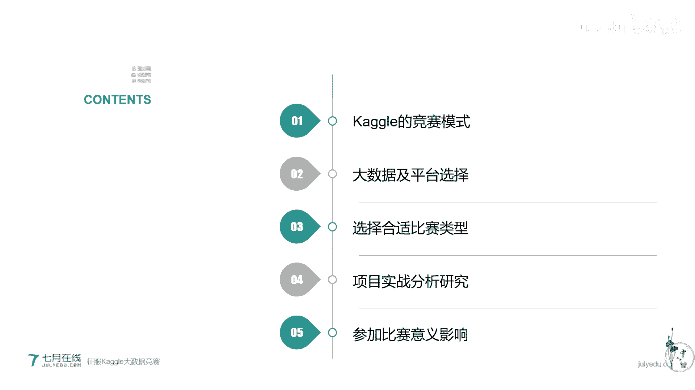

在本节课中，我们将要学习什么是Kaggle大数据竞赛，为什么要参加以及如何参加。我们将通过五个核心主题，系统地了解Kaggle的竞赛模式、数据处理、平台选择、项目流程以及参赛的意义，帮助初学者迈出征服Kaggle的第一步。

## 什么是Kaggle竞赛？🎯

Kaggle是一个进行模型预测的平台。在其官方网站上，会发布各种各样的问题以及相应的数据集。参赛者可以以个人或团队的形式，利用自己的知识和开发工具来参加比赛。最终的目标是构建一个预测模型来解决提出的问题。

Kaggle也是一个非常有影响力的大型比赛平台，最初专注于数据科学研究。它在全球200多个国家拥有超过60万的数据科学研究者。许多大公司如Google、Facebook、Amazon、Zillow、Lyft和Uber都与Kaggle合作。平台上涌现的优秀算法最终会应用于工业界和学术界。

除了奖金，更多参赛者会利用在Kaggle上取得的成绩为自己的履历增色，从而找到理想的工作。Kaggle平台本身也提供求职渠道。

Kaggle的趣味性在于其“实时排名”系统，它能激发强烈的竞争意识。通过组队合作，可以与众多高手相互讨论，在论坛上学习他们的方案，快速提升自己。它也是一个氛围友好的同行交流平台。对于取得优异成绩（如前三名）的选手，不仅有丰厚的奖金，还有很大机会获得知名公司的工作机会。

Kaggle的官方博客（Kaggle Blog）内容非常丰富，主要包括五类：数据科学新闻、Kaggle相关新闻、如何参赛的教程，以及最重要的——**获胜者访谈**。Kaggle通常会对每场比赛的前三名进行采访，分享他们的心得体会和解决问题的步骤。大多数获胜者也愿意公开自己的源代码。多研究获胜者的经验能有效提升自身能力。

## 如何报名与参赛？📝

进入Kaggle官网，选择一个竞赛（例如一个关于Twitter情感信息提取的比赛）。第一步是注册账号，可以使用Google账号或邮箱注册。完成注册后，点击“Join Competition”即可参赛。

之后，你需要进行建模、编写代码、多次调参。完成模型后，提交你的预测结果（Submit Prediction）。提交模型并非一锤子买卖，你可以每天优化模型并重新提交，以刷新实时排名。

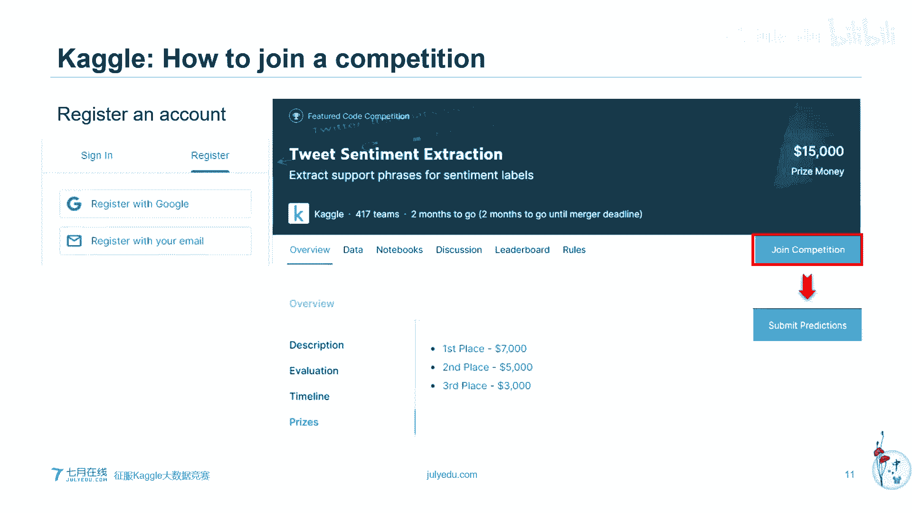

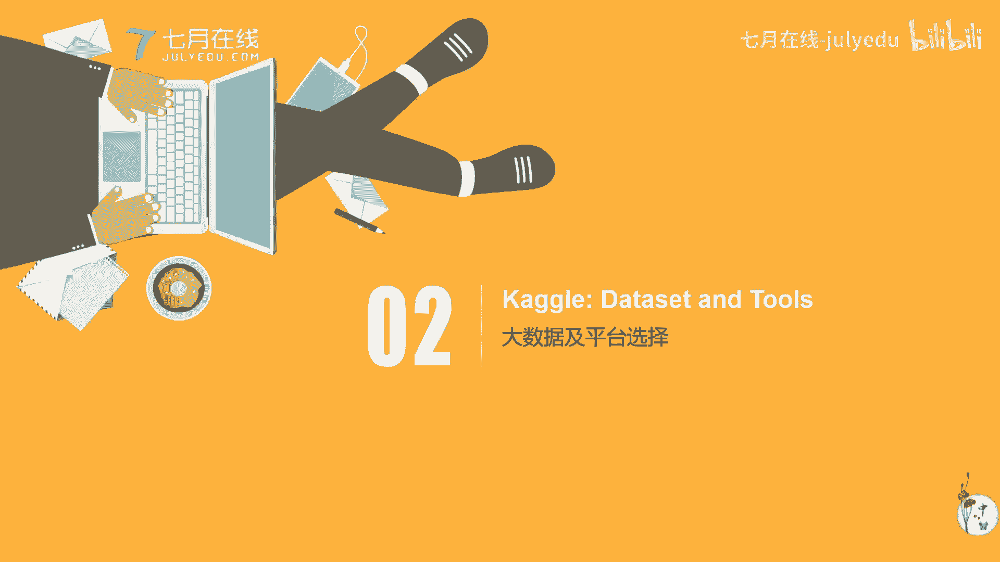

排名高的选手（通常是前三名）会获得奖金。例如，Twitter情感分析比赛的总奖金为15,000美元，会按名次分配给前三名。在Kaggle上，这并非最丰厚的奖金，还有更多奖金更高的比赛。

## Kaggle的数据与排名机制 📊

在Kaggle比赛中，主要有三种数据：
1.  **训练集**：用于模型训练。
2.  **测试集**：分为**公开测试集**和**私有测试集**。

参赛流程通常是：
1.  在训练集上构建并训练模型。
2.  在公开测试集上进行预测并提交模型，系统会根据此生成一个**公开排行榜**。
3.  比赛结束后，系统会在**私有测试集**上重新测试所有模型，生成**最终排行榜**。这个基于私有测试集的排名才是你的最终成绩。

因此，比赛期间的公开排行榜仅供参考，并不代表最终结果。

### 克服过拟合：交叉验证技巧

在以往经验中，有些队伍在公开排行榜上排名靠前，但最终成绩却不理想。为了克服这种现象，我们主要采用**交叉验证**的方法。

具体步骤如下：
1.  将训练集随机分成K等份（例如3份），每一份称为一个折。
2.  每次使用其中K-1份数据训练模型，并在剩余的那1份数据上进行验证。
3.  循环这个过程，确保每一份数据都充当过一次验证集。
4.  最后，综合所有折上的验证结果来评估模型性能。

核心建议是：**请更多相信你自己通过交叉验证得到的模型性能，而不要过度关注公开排行榜的排名**。

两个实用小技巧：
*   如果数据集较小，通常越简单的代码效果越好。
*   如果数据集非常大，则应更多关注快速迭代。

一个实际例子是Zillow房地产评估预测比赛。在最终私有排行榜上，有些队伍排名大幅上升（如从第10名升至第1名），而有些则下降（如从第1名跌出奖金区）。这往往是因为后者过度迎合公开测试集，导致了过拟合。因此，相信自己的交叉验证结果至关重要。

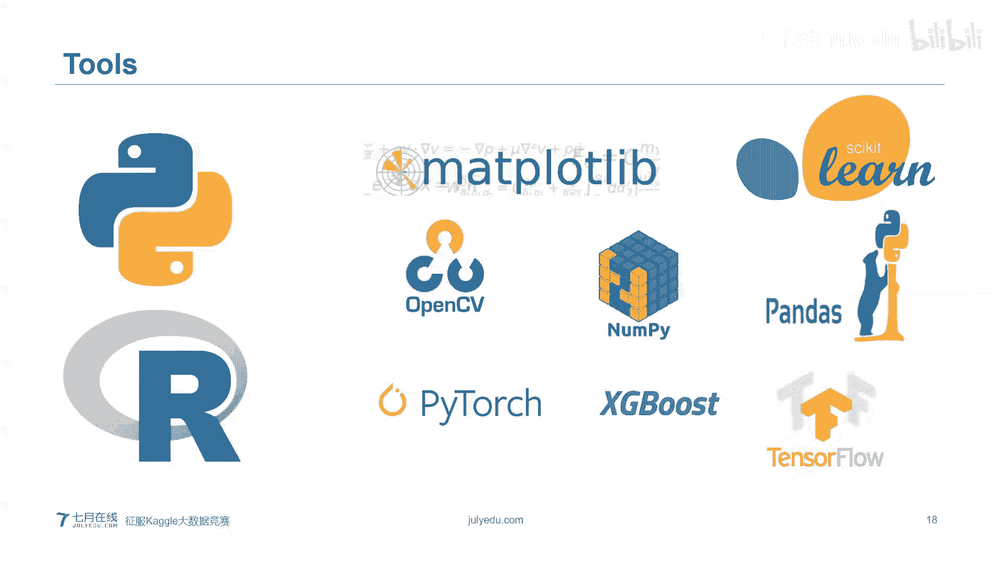

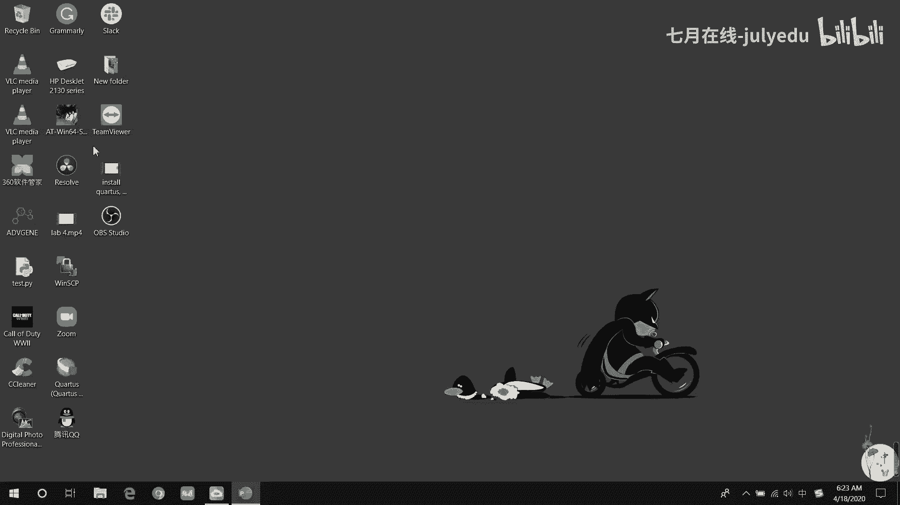

## 参赛工具与平台选择 💻

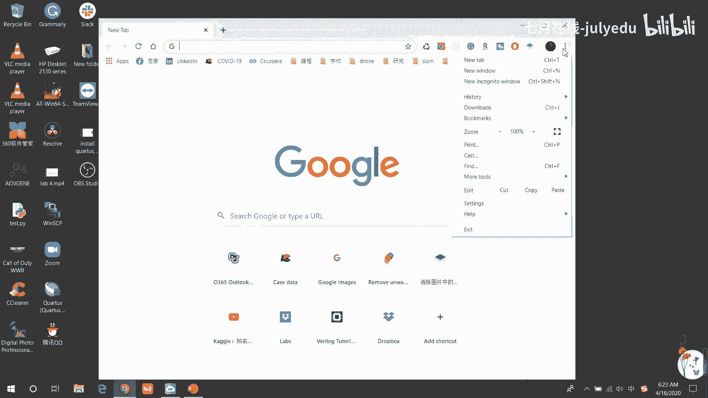

在Kaggle比赛中，主要使用两种编程语言：**Python**和**R**。选择你更熟悉的语言即可，两者没有优劣之分。

Kaggle平台提供了名为**Kaggle Kernels**的在线编程环境，它基于Jupyter Notebook，并预装了大量的常用库，如NumPy、Pandas、Scikit-learn、OpenCV、PyTorch等，方便用户直接在线编写和测试代码。

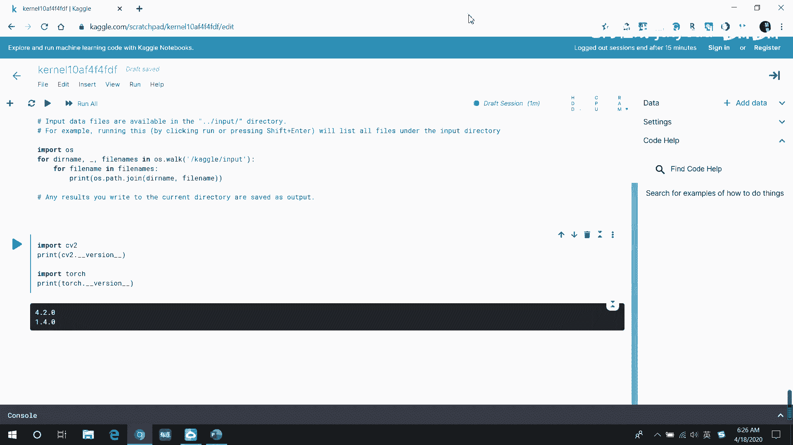

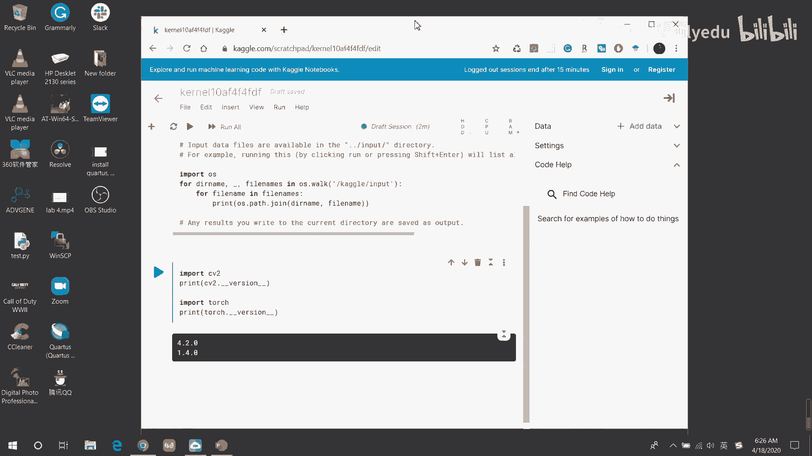

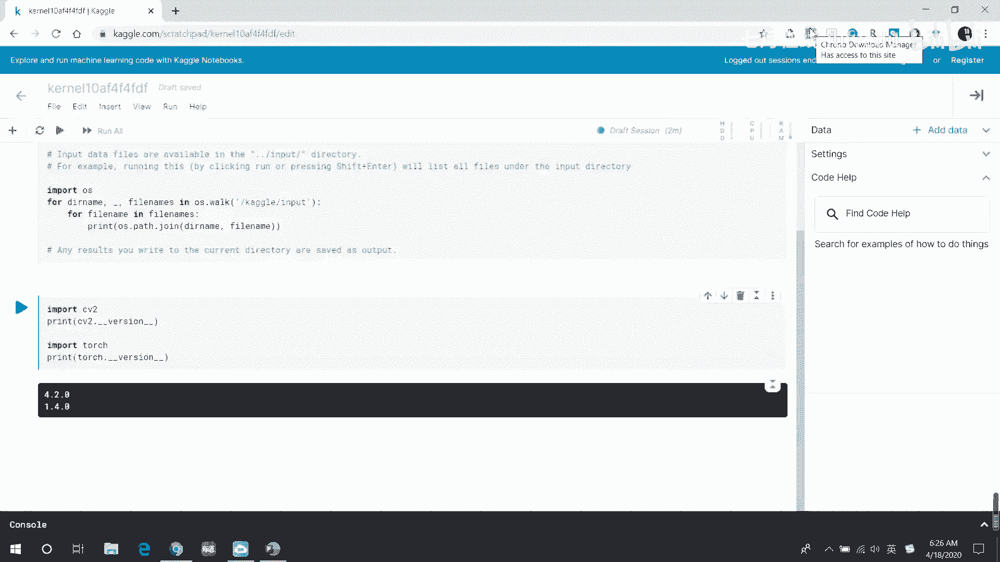

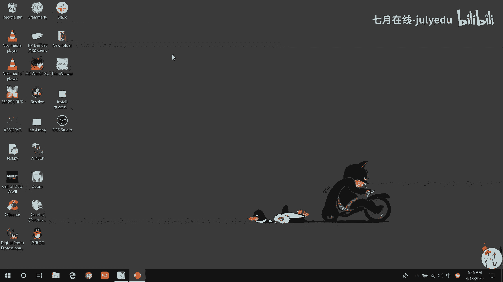

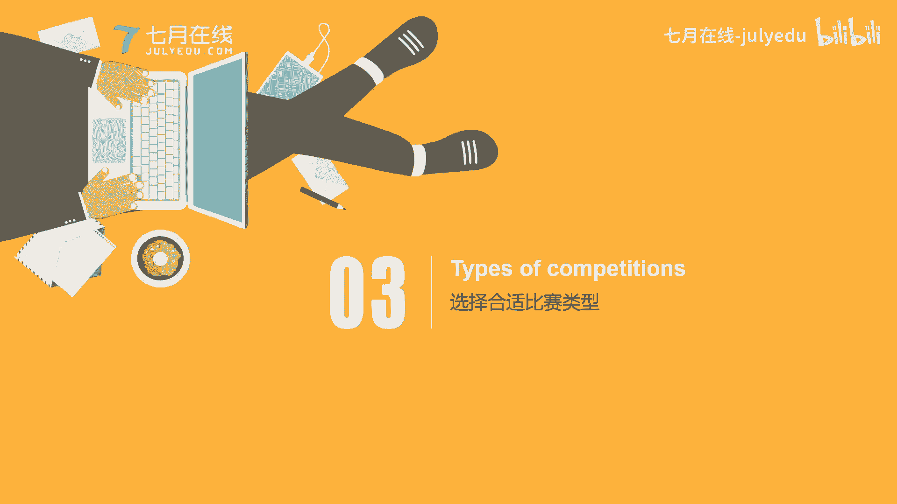

你可以在Kernel中创建自己的笔记本，并选择配置（如是否使用GPU/TPU）来加速训练过程。

## 如何选择合适的比赛类型？🏆

Kaggle的比赛类型主要分为两大类：常见类型和不常见类型。

### 常见竞赛类型

1.  **Featured**：
    *   **特点**：专注于机器学习，通常由大公司提出与其业务相关的预测问题，并提供**丰厚的奖金**（最高可达100万美元）。
    *   **举例**：Allstate保险公司销售预测、Wikipedia负面信息分类、Zillow房屋价格预测。
    *   **适合人群**：所有水平的参赛者，是提升能力、争取高额奖金的好机会。

2.  **Research**：
    *   **特点**：侧重于学术研究问题，通常是实验性质的。
    *   **举例**：Google地标识别、白细胞识别、Wikipedia大规模文本分类。
    *   **适合人群**：对学术研究感兴趣者，这类比赛通常**没有奖金**，但能提供解决问题和展示能力的机会。

3.  **Getting Started**：
    *   **特点**：专门为**新手**设计，题目长期开放，是很好的学习途径。
    *   **举例**：经典的泰坦尼克号生存预测、房价预测。
    *   **适合人群**：**强烈推荐初学者从此类比赛开始**，以了解基本套路和建立信心。此类比赛**没有奖金**，且提交结果只在排行榜上保留两个月。

4.  **Playground**：
    *   **特点**：趣味性较强，同样适合新手，有些会提供小额奖金或荣誉。
    *   **举例**：猫狗图像分类、树叶分类、纽约出租车路径规划。
    *   **适合人群**：初学者用于练手和娱乐。

### 不常见竞赛类型

1.  **Recruitment**：
    *   **特点**：公司为招聘举办的比赛，相当于一次求职筛选。
    *   **举例**：Walmart库存预测招聘、Airbnb新用户订房预测招聘。

2.  **Annual**：
    *   **特点**：Kaggle每年举办两次的赛事（三月机器学习赛和圣诞优化赛），并非严肃的商业或研究比赛。

3.  **Limited**：
    *   **特点**：**限制参与**的比赛，要么完全私有，要么需要收到邀请才能参加。通常是行业大师的专属领域。

### 比赛题目领域与参赛建议

Kaggle比赛题目主要涵盖四大领域：数据挖掘、计算机视觉、自然语言处理和优化问题。

**参赛建议**：
*   **初学者**：从**Getting Started**或**Playground**比赛开始。
*   **有经验者**：挑战**Featured**或**Research**比赛以争取奖金或深入研究。
*   **领域专注**：建议专注于你感兴趣或未来职业发展方向的领域（如计算机视觉）。同类型比赛的解题思路有共通之处，熟能生巧。
*   **细分领域**：在选定大领域后，可进一步选择细分领域（如计算机视觉下的生物医学图像分析）进行深入挖掘。
*   **寻求指导**：如果自学规划比赛路径有困难，可以寻找有经验的导师或课程进行系统学习。

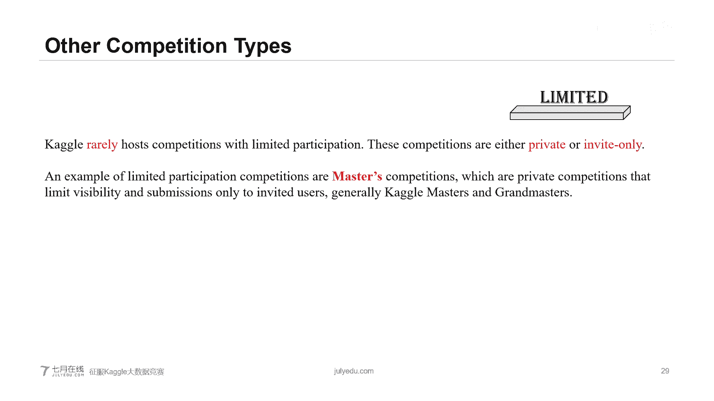

## 解决一个Kaggle项目的通用流程 🔄

本节中，我们来看看如何系统性地解决一个Kaggle项目。通常可以分为以下四个步骤：

### 第一步：数据分析与预处理

这是至关重要的一步，为后续所有工作打下基础。
*   **数据预处理**：清洗数据，去除噪声、冗余信息和异常值。对数据进行规范化等操作，使其更规整。
*   **数据可视化**：使用图表工具来验证预处理效果并理解数据分布。常用工具包括：
    *   **箱形图**：展示数据的最小值、第一四分位数、中位数、第三四分位数和最大值，以及异常值。
    *   **散点图、直方图**等。
    *   对于图像数据，可以使用Matplotlib或OpenCV进行可视化。

### 第二步：特征工程

在理解数据的基础上，进行特征处理与选择。
*   **特征处理**：根据领域知识创建、转换或组合特征。
*   **特征选择**：目标是**筛选出对预测最有效的特征**，这可以降低计算复杂度，并可能提升模型性能。

### 第三步：建模与验证

这是将想法付诸实践的核心环节。
1.  **建立基线模型**：首先构建一个简单的模型，让流程先运行起来。
2.  **交叉验证**：使用第一步中提到的交叉验证方法，在训练集上评估模型性能。
3.  **理解评估标准**：明确比赛使用的评估指标（如准确率、均方误差等）。
4.  **调参优化**：调整模型参数以提升性能。
5.  **尝试不同模型**：不要局限于最初的想法，多尝试不同的算法和模型架构，可能会有意外收获。
6.  **社区交流**：多参与Kaggle论坛的讨论，学习他人的思路和技巧。

**再次强调**：更多地相信你自己交叉验证的结果，而非公开排行榜的暂时排名。

### 第四步：提交与迭代

提交不是终点，而是迭代循环的一部分。
*   **多次提交**：Kaggle允许每天多次提交。你可以根据每次提交后的排名反馈，不断优化模型。
*   **循环改进**：根据与排行榜其他模型的对比，返回去修改模型，再次提交。
*   **运气**：有时，好运气也是实力的一部分。

## 参加Kaggle比赛的意义与影响 🌟

聊完技术流程，我们最后来看看参加Kaggle比赛的深远影响。

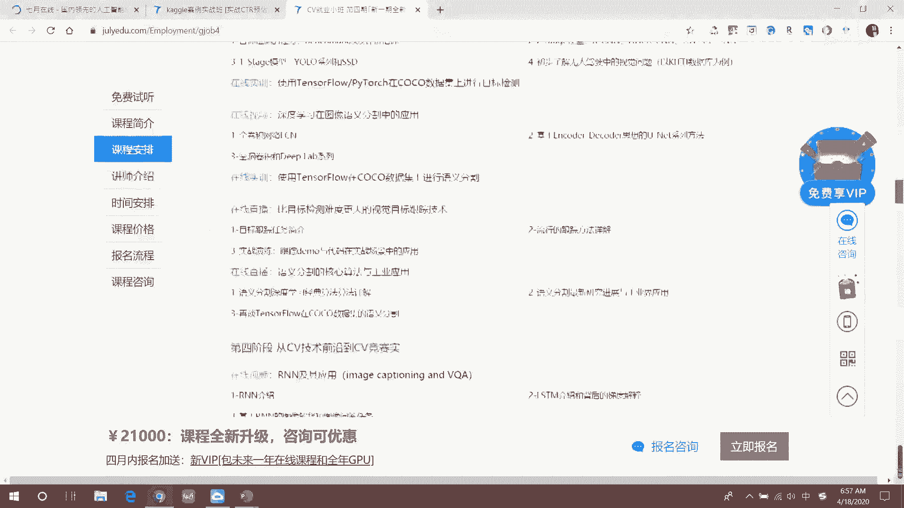

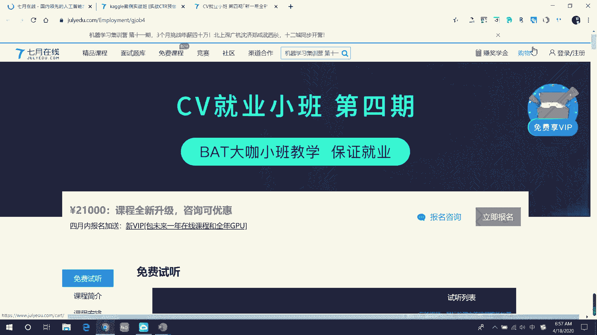

1.  **赢得奖金**：比赛奖金通常以美元结算，是一笔实实在在的丰厚奖励。
2.  **提升能力**：实战是提升编程、建模和解决问题能力的最佳途径。
3.  **助力求职**：一份优秀的Kaggle比赛成绩是求职时极具分量的筹码，能显著增加获得心仪工作的机会。
4.  **拓展人脉**：在Kaggle上，你可以结识众多志同道合的高手，进入专业圈子，这对个人成长和职业发展都大有裨益。
5.  **建立个人品牌**：通过比赛获得好成绩，能够提升你在领域内的知名度。无论是在求职、申请研究生还是与业界交流时，一个响亮的Kaggle排名都是强有力的背书。

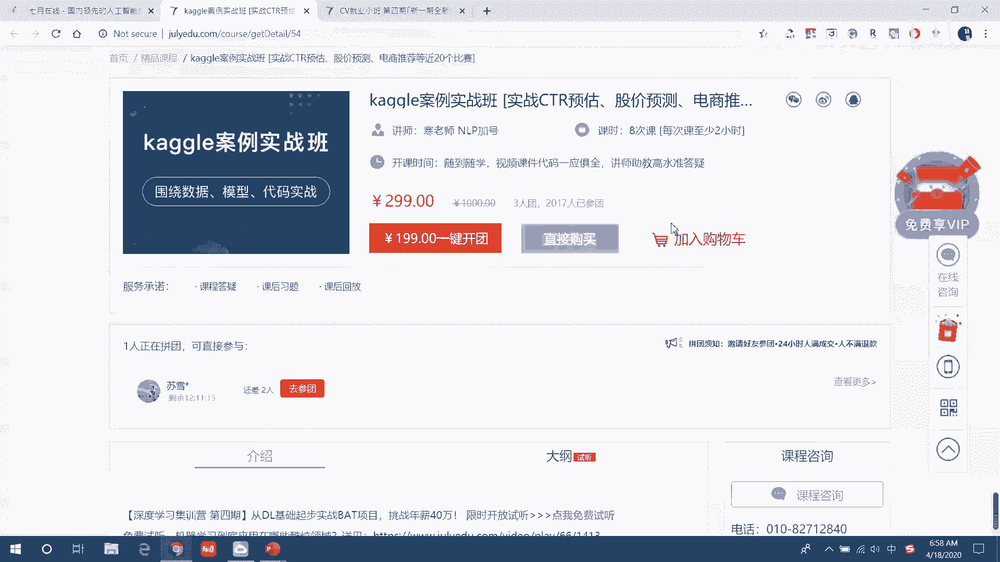

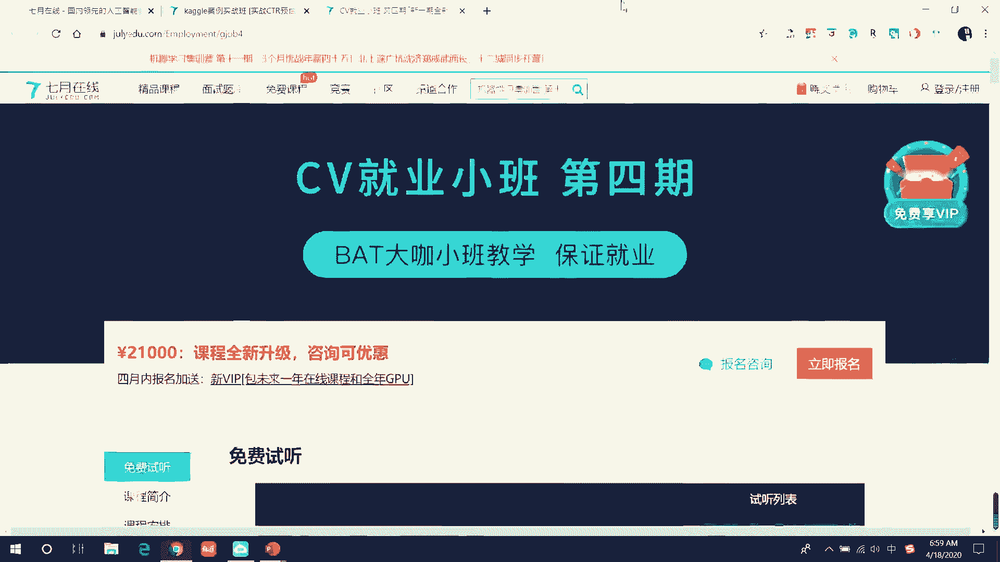

---

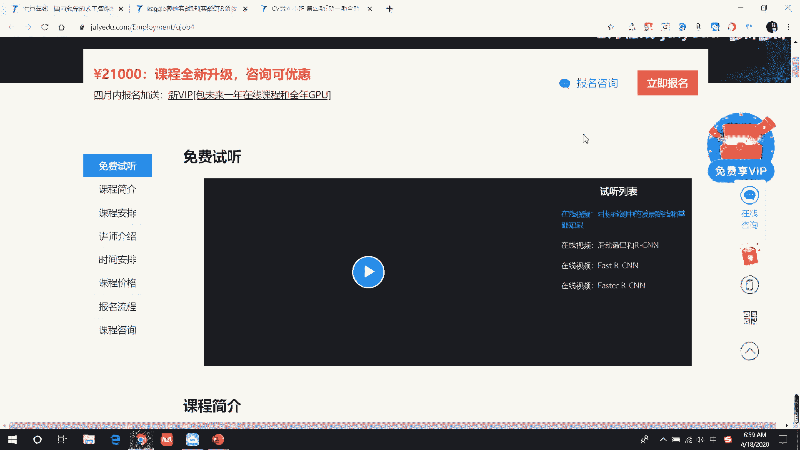

本节课中，我们一起学习了Kaggle竞赛的基本全貌：从平台介绍、报名方式、数据排名机制，到比赛类型选择、项目实战流程，以及参赛的多元价值。希望这份指南能帮助你自信地开启你的Kaggle征服之旅。记住，从简单的比赛开始，不断学习，持续迭代，你也能在数据科学的舞台上取得亮眼的成绩。