# 人工智能—Kaggle实战公开课（七月在线出品） - P3：Kaggle Expedia酒店推荐比赛 🏨


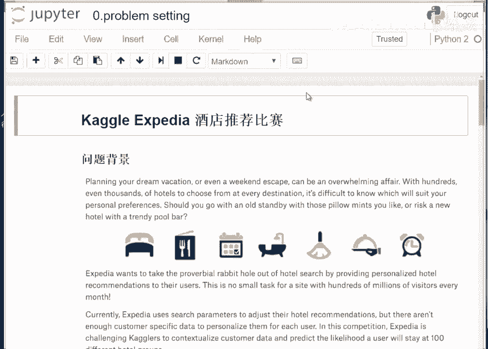

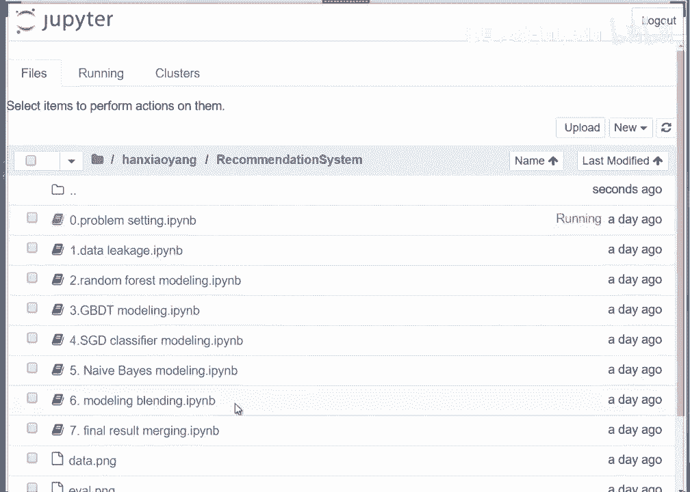

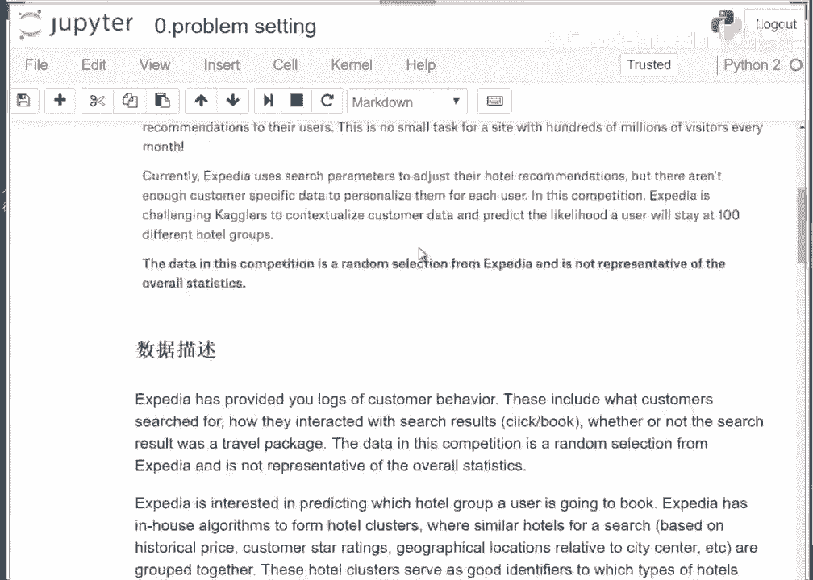

在本节课中，我们将学习如何解决Kaggle上的Expedia酒店推荐比赛。这是一个典型的推荐系统问题，我们将从理解问题背景开始，逐步进行数据探索、特征工程、模型构建与融合，最终生成可提交的预测结果。整个过程将涉及多个模型和技巧，旨在为大家展示一个完整的数据科学竞赛解决方案。

## 问题背景与设定

本节我们将介绍本次比赛的具体任务、数据概况以及评估标准。

Expedia是一个在线旅游服务平台，类似于国内的携程。当用户计划旅行时，需要在海量酒店中做出选择，这通常是一个耗时且困难的过程。为了帮助用户简化决策，Expedia希望利用历史数据构建一个推荐系统。

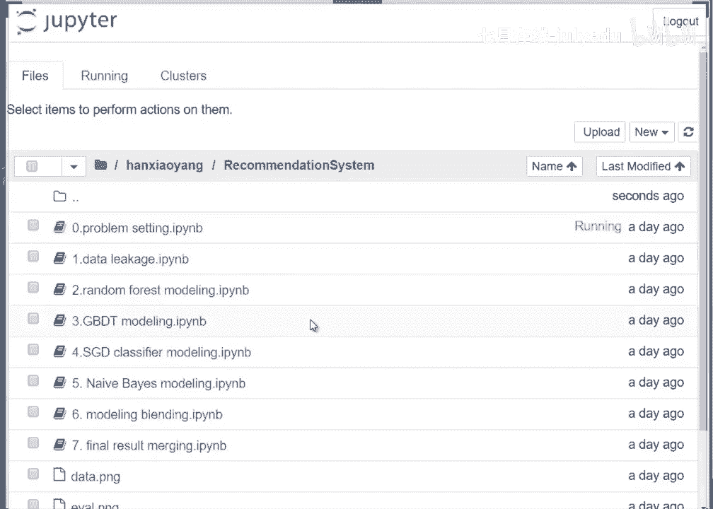

然而，直接推荐具体的酒店非常困难，因为用户的目的地信息通常只到城市级别。因此，比赛方将所有的酒店划分成了100个簇（cluster）。这些簇是根据酒店的历史价格、用户评分、地理位置（如相对于城市中心的位置）等多种属性划分的。例如，经济型连锁酒店可能被分到同一个簇中。

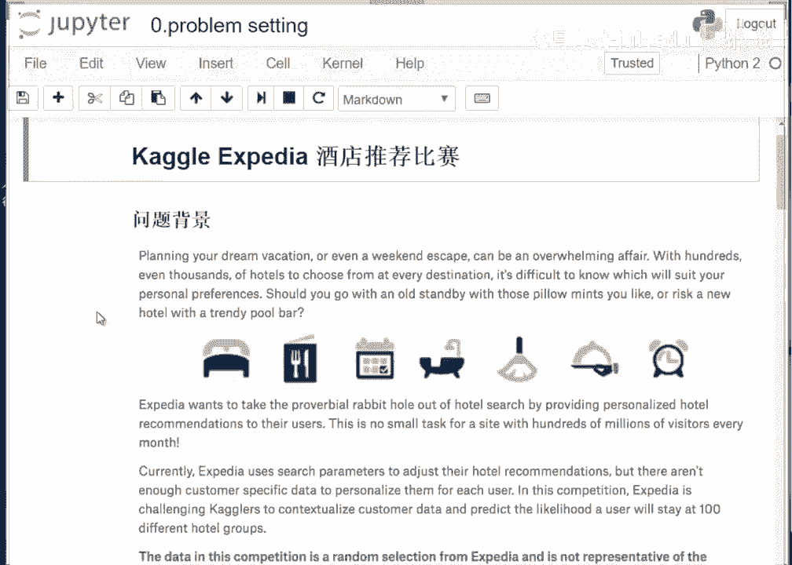

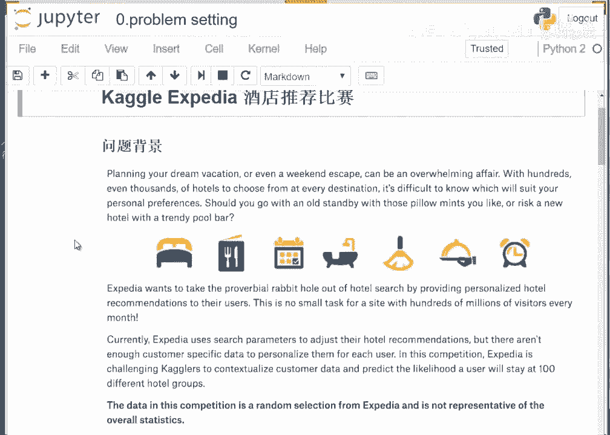

我们的任务不再是预测具体的酒店ID，而是预测用户最有可能预订的酒店**簇**（cluster）。比赛提供了从2013年到2015年的用户行为数据，其中2013-2014年的数据作为训练集，2015年的数据作为测试集。

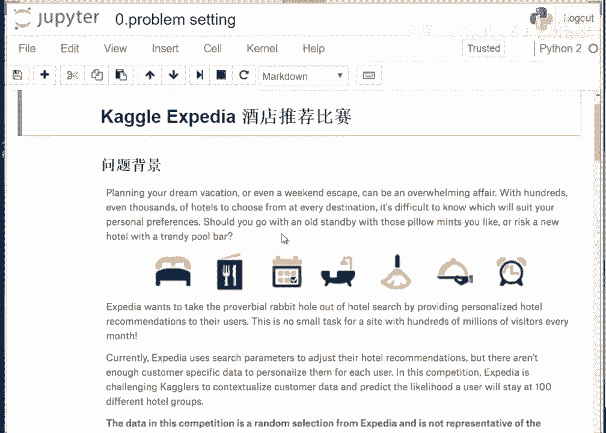

需要注意的是，训练集是从全量数据中随机采样得到的子集，这意味着其数据分布可能与全量数据不完全一致。因此，在建模时需要警惕过拟合（overfitting）问题。

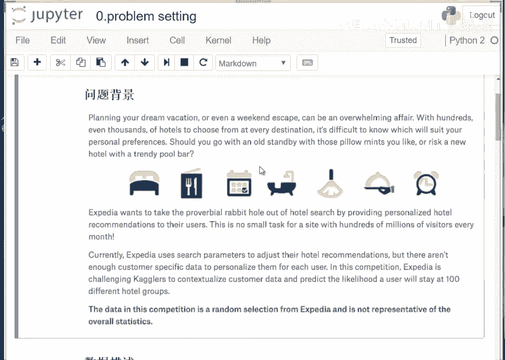

### 数据文件说明
比赛提供了多个数据文件：
*   **train.csv**: 训练数据集，包含用户历史行为记录。
*   **test.csv**: 测试数据集，我们需要为其预测酒店簇。
*   **destinations.csv**: 包含酒店相关属性（features）的文件。出于隐私保护，这些属性已被哈希处理（hash），我们得到的是匿名化的特征（D1-D149列），而非明文信息。
*   **sample_submission.csv**: 提交结果的格式示例。

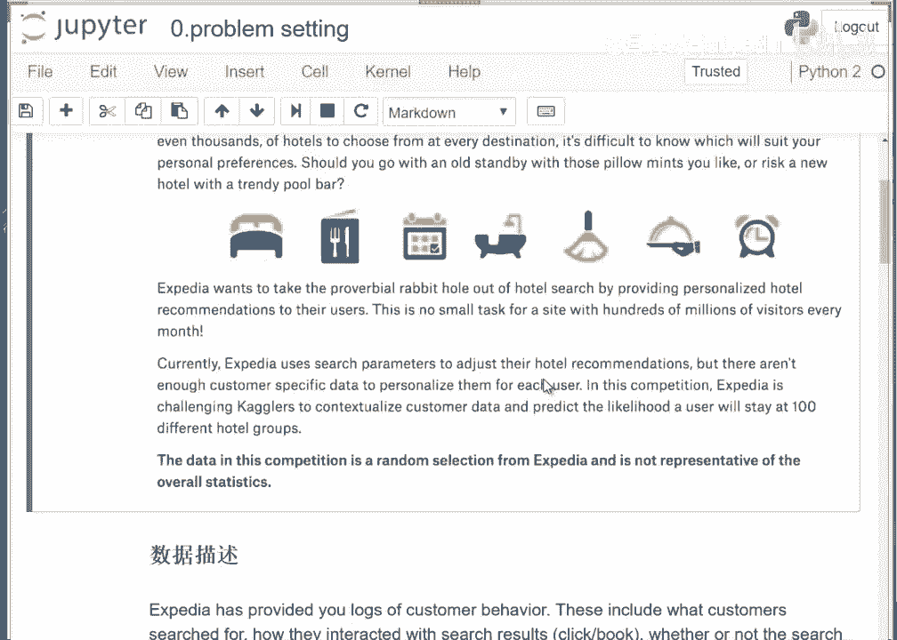

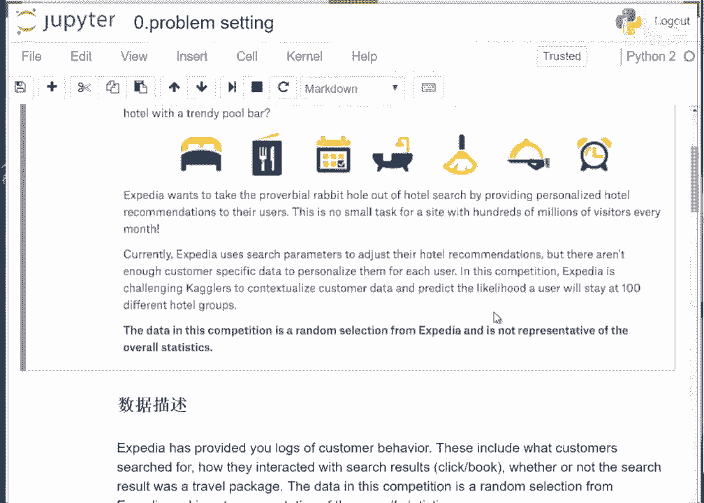

### 评估标准
比赛采用 **MAP@5** （Mean Average Precision at 5）作为评估指标。其含义是：系统为用户推荐5个酒店簇，只要这5个推荐中包含用户实际预订的簇，即视为本次推荐成功。这模拟了现实场景中，用户通常只浏览搜索结果第一页（例如显示5个结果）的行为。我们的目标是尽可能提高这个指标。

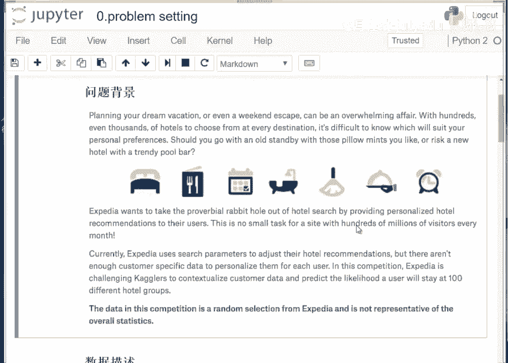

提交文件需要为测试集中的每个`user_id`和`srch_id`组合，预测5个酒店簇ID，格式如下：
```
id, hotel_cluster
1, 99 31 75 20 1
2, 65 12 98 46 77
...
```

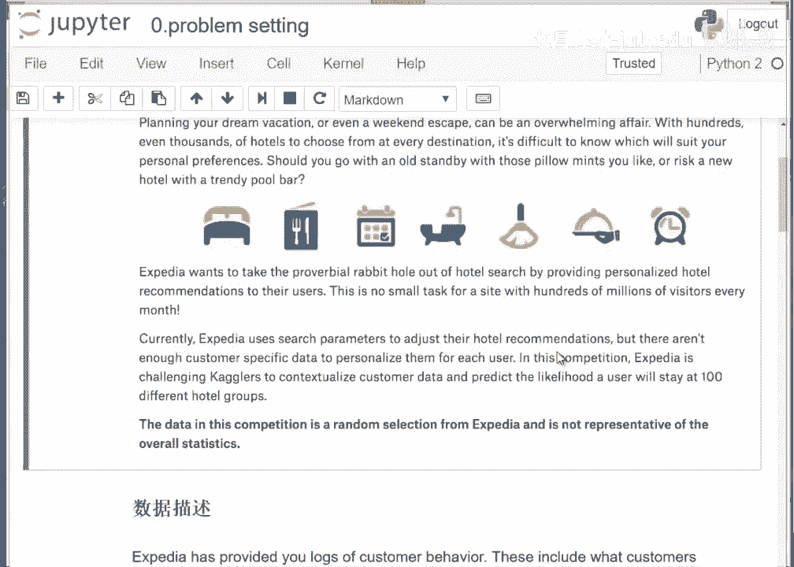

## 整体解决方案图示

上一节我们介绍了问题的背景，本节我们来看看解决这个问题的整体思路和流程。

我们将构建一个包含多个模型的混合（Blending）解决方案。核心流程如下图所示：

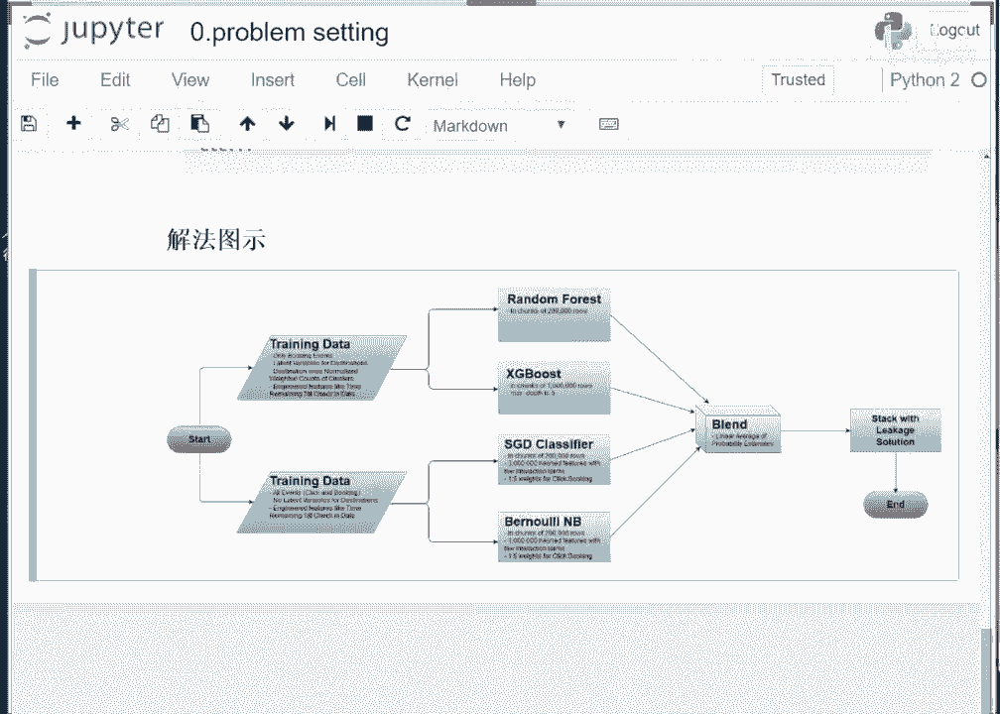

整个流程可以概括为以下步骤：
1.  **数据准备与探索**：加载并理解训练集和测试集。
2.  **利用数据泄露（Data Leakage）**：我们发现部分测试集数据在训练集中有完全匹配的记录。对于这部分数据（约占总测试集的1/3），我们可以直接“查表”得到准确答案。
3.  **多模型训练**：对剩余的数据，我们将使用四类不同的模型进行训练和预测：
    *   **随机森林（Random Forest）**
    *   **梯度提升决策树（GBDT）**
    *   **随机梯度下降分类器（SGDClassifier）**
    *   **伯努利朴素贝叶斯（Bernoulli Naive Bayes）**
4.  **模型混合（Model Blending）**：将上述四个模型的预测结果进行加权平均，得到最终的预测概率。
5.  **结果合并与提交**：将“数据泄露”部分的直接答案与模型混合的预测结果合并，整理成比赛要求的提交格式。

接下来，我们将逐一深入每个环节。

## 核心步骤详解

### 1. 处理数据泄露（Data Leakage）

在数据竞赛中，有时测试集数据会在训练集中“泄露”出来，即存在完全相同的记录。直接利用这部分信息可以显著提升分数。我们的分析发现，本次比赛约有1/3的测试数据存在这种情况。

以下是处理此问题的核心思路：
*   比对测试集与训练集，找出完全匹配的记录（基于用户、搜索、酒店等关键字段）。
*   对于这些匹配的记录，直接使用训练集中对应的`hotel_cluster`作为预测结果。
*   这部分“标准答案”将作为最终提交结果的一部分。

### 2. 多模型构建与训练

对于不存在数据泄露的测试数据，我们需要依靠模型进行预测。我们选择了四种各具特色的模型，并对数据和特征进行了差异化处理以适应不同模型的特点。

#### 模型一：随机森林（Random Forest）
随机森林是一种基于Bagging思想的集成学习模型，通过构建多棵决策树并综合其结果来提高泛化能力。

**关键处理：**
*   **数据使用**：仅使用训练集中`is_booking`标签为1（即实际发生预订）的记录进行训练。这基于一个假设：预订行为比点击行为更能反映用户的真实偏好。
*   **大数据处理**：由于数据量巨大（数千万条），我们使用Pandas的`chunksize`参数分块读取数据（例如每次20万条），以避免内存溢出。
```python
# 示例：分块读取数据
chunk_size = 200000
for chunk in pd.read_csv(‘train.csv‘, chunksize=chunk_size):
    # 处理每个数据块
    process(chunk)
```
*   **特征**：包含了哈希处理后的目的地特征（`destinations.csv`中的D1-D149列）。树模型能够较好地处理这类数值型特征。

#### 模型二：梯度提升决策树（GBDT）
GBDT是一种基于Boosting思想的集成学习模型，通过串行地训练一系列弱学习器（通常是决策树），每一棵树都致力于纠正前一棵树的错误。

**关键处理：**
*   与随机森林类似，**仅使用预订数据**进行训练。
*   同样采用**分块读取**策略处理大数据。
*   使用包含目的地哈希特征的完整特征集。

#### 模型三：随机梯度下降分类器（SGDClassifier）
SGDClassifier是一个使用随机梯度下降算法进行优化的线性分类器，适合在线学习或处理大规模数据。

**关键处理：**
*   **数据使用**：使用**全部训练数据**（包括点击和预订记录）。因为线性模型可能从更广泛的行为模式中学习。
*   **特征工程**：**不直接使用**哈希化的目的地特征（D1-D149）。因为原始的哈希值作为类别型变量，如果不进行适当的编码（如One-Hot），不适合直接输入线性模型。我们主要使用其他结构化特征。
*   模型支持`partial_fit`方法，可以**分批次训练**，非常适合处理无法一次性装入内存的大数据。


#### 模型四：伯努利朴素贝叶斯（Bernoulli Naive Bayes）
朴素贝叶斯是一种基于贝叶斯定理的简单概率分类器，它假设特征之间相互独立。伯努利版本适用于二值化特征。

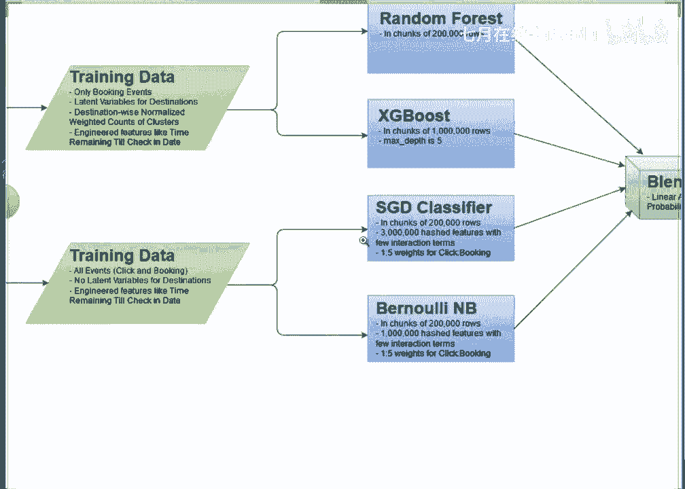

**关键处理：**
*   **数据使用**：使用**全部训练数据**。
*   **特征工程**：与SGDClassifier类似，**不使用**目的地哈希特征。需要对特征进行二值化处理，以符合伯努利分布的要求。

### 3. 模型混合（Model Blending）

上一节我们介绍了四个独立的模型，本节我们来看看如何将它们的结果有效地结合起来。我们采用**模型混合（Blending）** 而非更复杂的堆叠（Stacking）方法，以降低过拟合风险。

混合的基本思想是对不同模型的预测结果进行加权平均。例如：
```
最终预测概率 = w1 * RF预测概率 + w2 * GBDT预测概率 + w3 * SGD预测概率 + w4 * NB预测概率
```
其中，权重`w1, w2, w3, w4`可以通过在验证集上的表现来调整，也可以简单设为平均值。我们根据各个模型在本地验证集上的MAP@5得分来分配权重，表现更好的模型获得更高的权重。

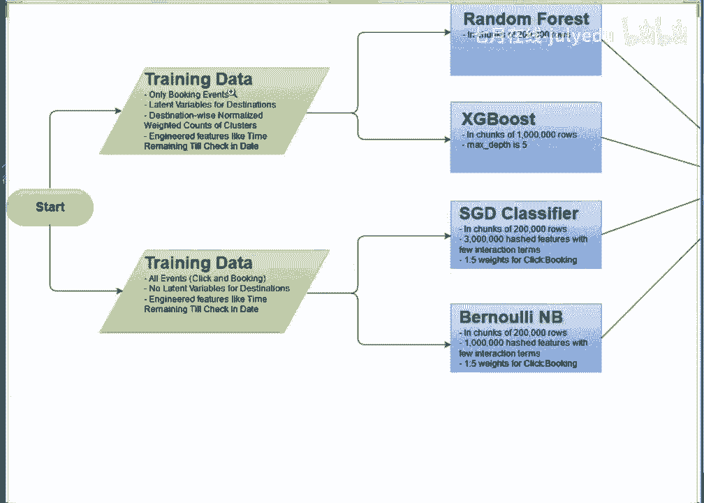

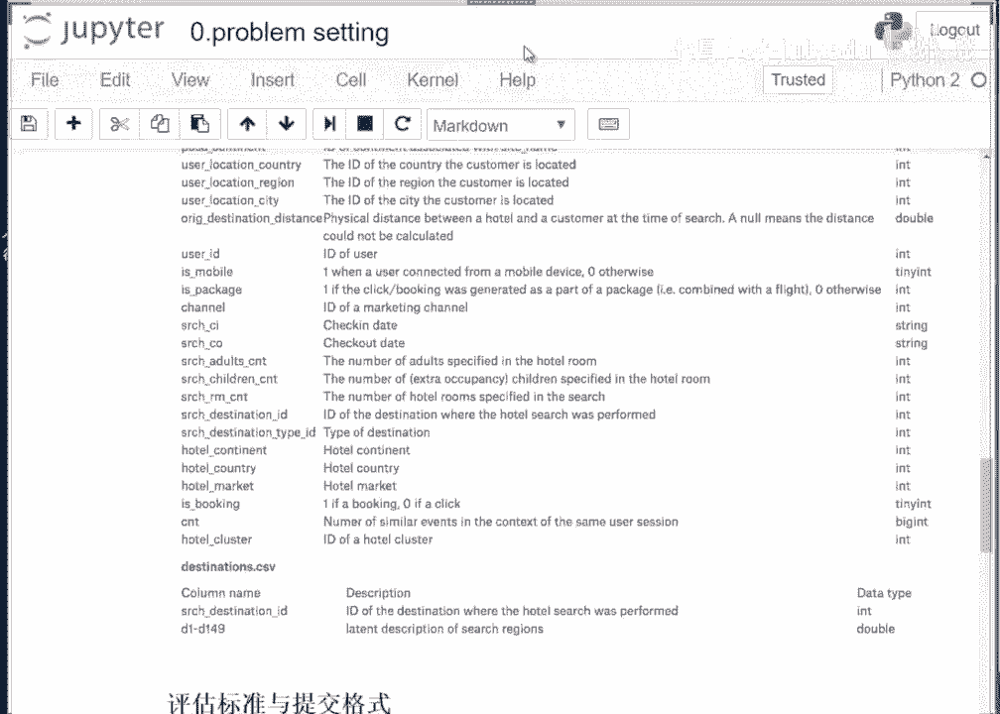


### 4. 生成最终提交结果

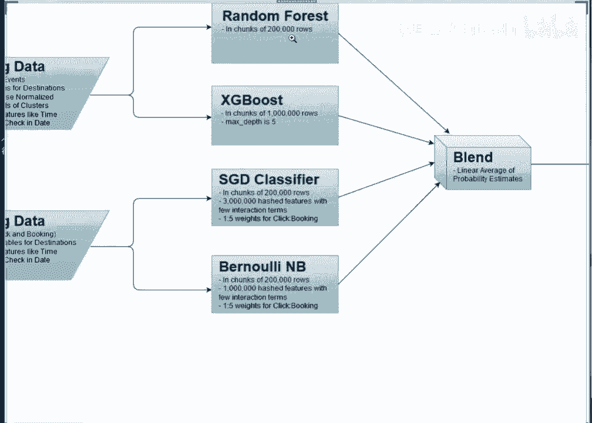

这是流程的最后一步。我们将两部分预测结果整合：
1.  **直接答案**：从数据泄露中获得的、约占总测试集1/3的准确预测。
2.  **模型预测**：对剩余2/3的测试数据，使用四个模型混合后得到的预测结果（取概率最高的5个簇）。

将这两部分按测试集原始顺序合并，就得到了完整的`hotel_cluster`推荐列表，将其格式化为与`sample_submission.csv`相同的结构，即可提交至Kaggle平台。

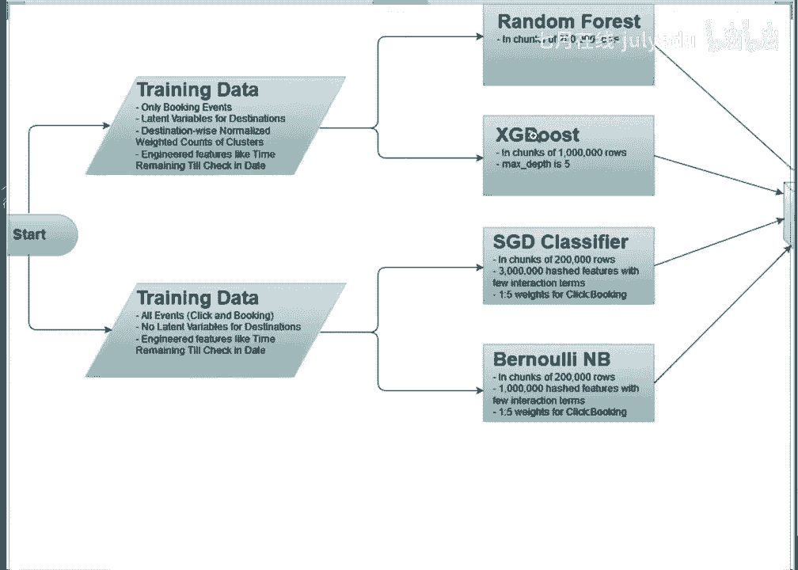

## 总结与要点回顾

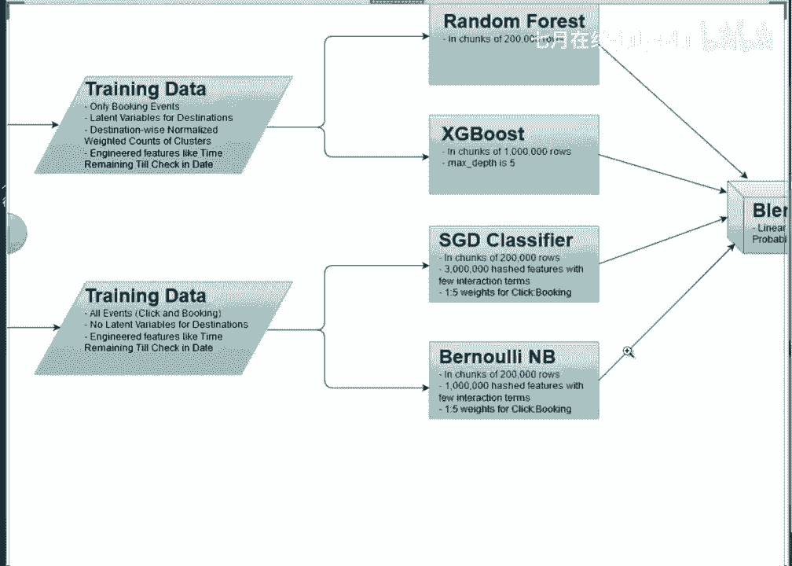

本节课中，我们一起学习了Kaggle Expedia酒店推荐比赛的完整解决方案。我们来回顾一下核心要点：

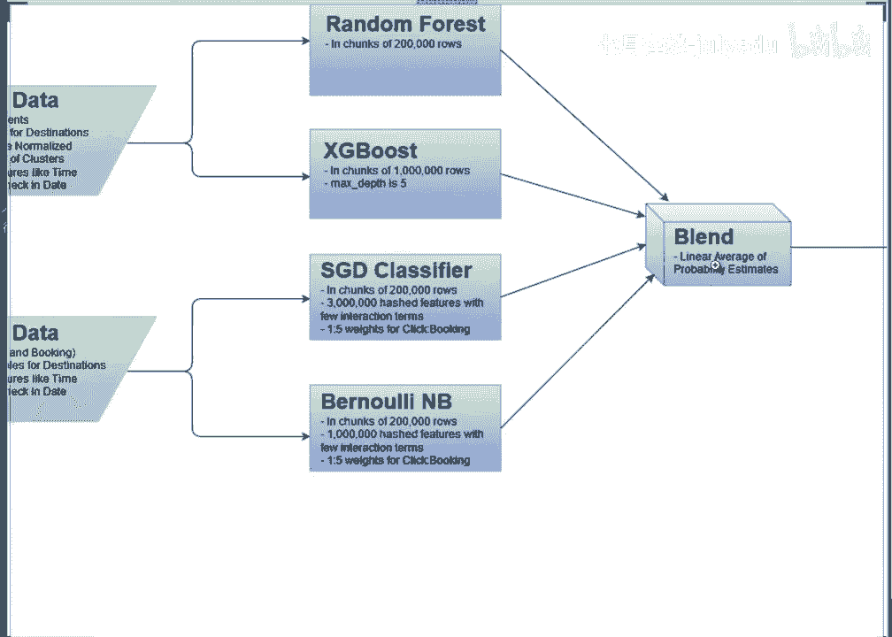

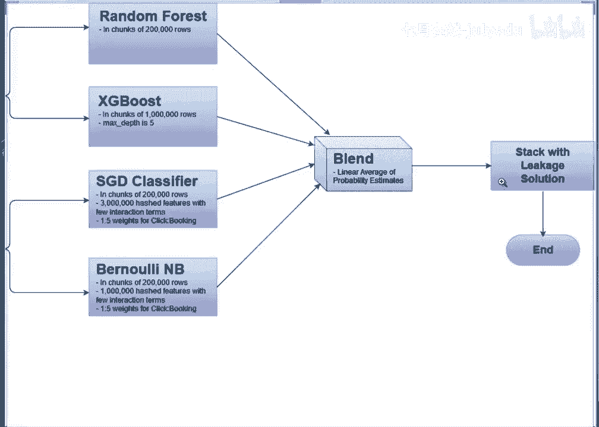

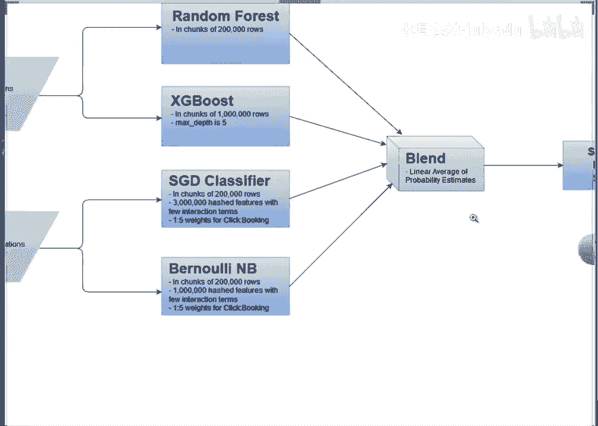

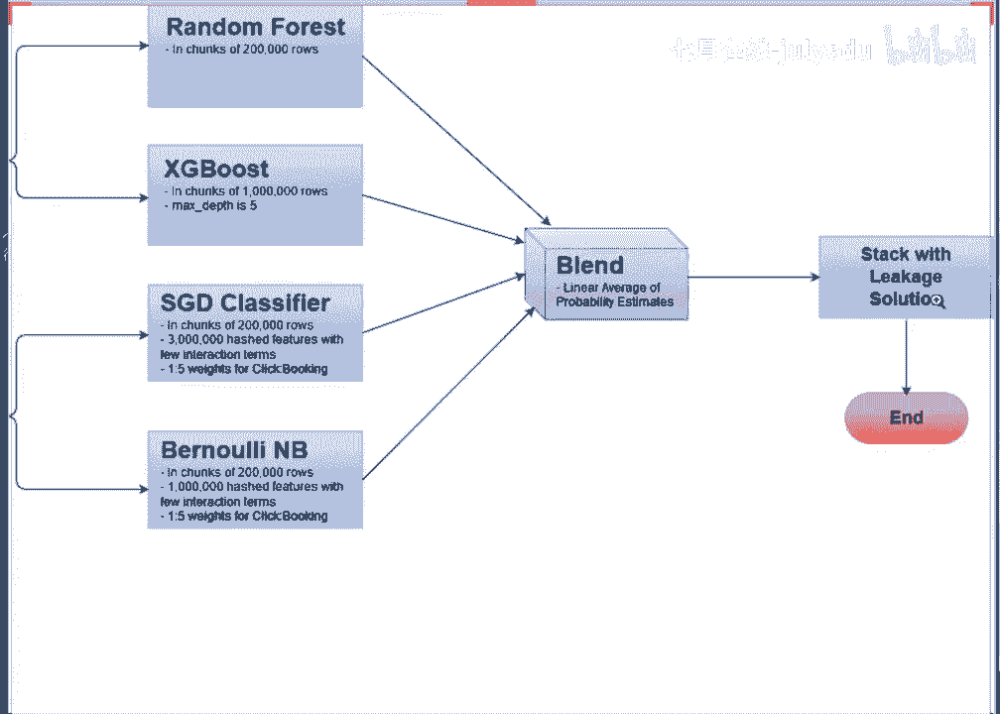

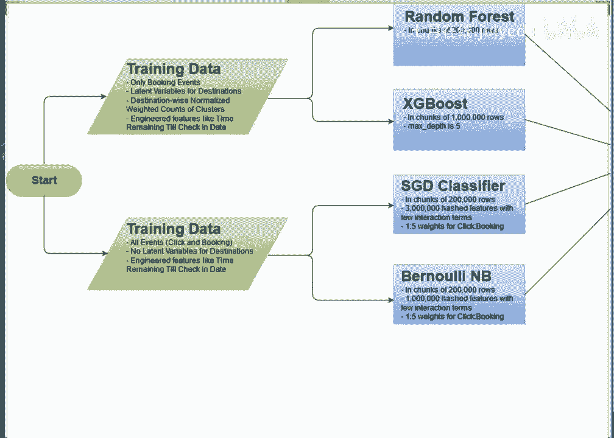

1.  **问题转化**：比赛将复杂的酒店推荐问题简化为预测100个酒店簇的任务，并使用**MAP@5**作为评估指标。
2.  **数据洞察**：我们发现了**数据泄露**现象，并巧妙地利用这部分“标准答案”来提升成绩。
3.  **大数据处理**：面对数千万级别的数据，我们采用了**分块读取（chunksize）** 和**在线学习（partial_fit）** 等技术来克服内存限制。
4.  **差异化建模**：我们根据模型特性，对数据和特征进行了差异化处理：
    *   **树模型（RF, GBDT）**：使用**预订数据**和**目的地哈希特征**。
    *   **线性/概率模型（SGD, NB）**：使用**全量数据**，并**避免使用原始哈希特征**。
5.  **模型融合**：通过**加权混合（Blending）** 的方式，融合了随机森林、GBDT、SGDClassifier和朴素贝叶斯四个模型的优势，得到了更鲁棒的预测结果。
6.  **完整流程**：我们实践了从数据探索、特征工程、模型训练与调优、模型融合到结果提交的完整数据科学竞赛流程。

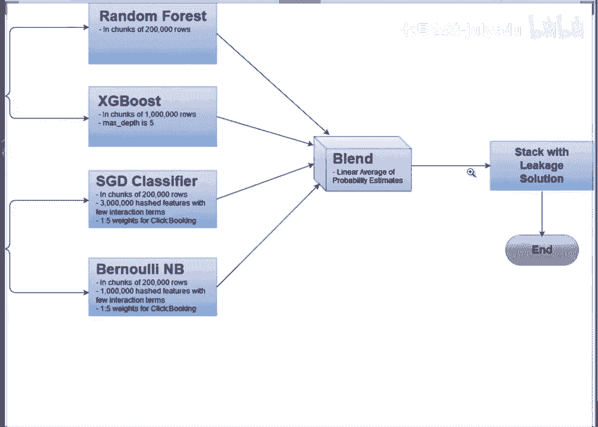

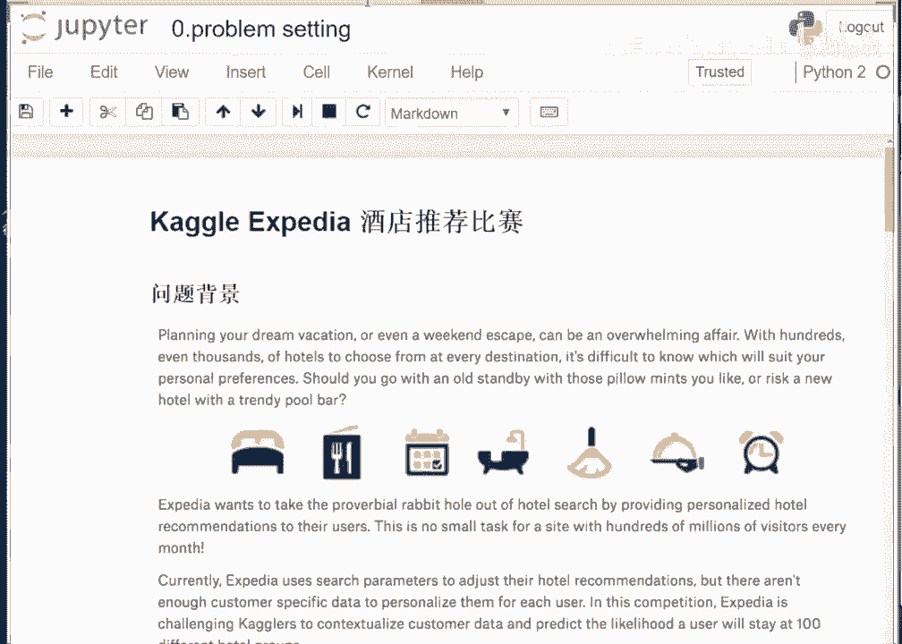

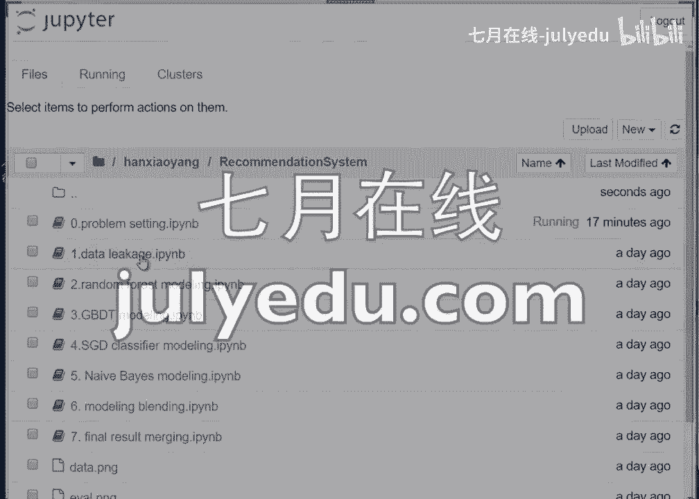

这个案例表明，一个成功的竞赛解决方案往往不是单一模型的胜利，而是对数据的深刻理解、合理的特征工程、恰当的模型选择以及有效的模型融合策略共同作用的结果。希望本教程能帮助你更好地理解如何系统性地解决一个真实的数据科学问题。