# 人工智能—Kaggle实战公开课（七月在线出品） - P4：Kaggle IEEE-CIS 欺诈检测二分类大赛思路分享 🎯

## 概述

在本节课中，我们将要学习如何应对一个典型的二分类问题——Kaggle IEEE-CIS 欺诈检测大赛。这个比赛的数据集来自一家银行，主要包含信用卡交易数据，好坏用户的比例大约是29:1。我们将从数据探索、性能优化、建立基线模型、分析模型问题，到实施特征工程，系统地分享整个比赛的解决思路和实战技巧。

---

## 比赛背景与数据介绍

上一节我们介绍了课程概述，本节中我们来看看比赛的具体背景和数据情况。

这个比赛的数据结构相对简单，主要包含两张表：
*   **主表（交易表）**：存放用户的交易卡信息。
*   **附表（身份表）**：存放用户使用设备的相关信息。

比赛的一个优点是，官方在讨论区对所有字段的含义进行了说明。例如：
*   `TransactionDT`：日期时间。
*   `TransactionAMT`：交易金额。
*   `ProductCD`：交易产品类型的编码。
*   `card1` 到 `card6`：用户的支付卡相关信息。
*   `P_emaildomain` 和 `R_emaildomain`：卡使用者的邮件信息。
*   `addr1` 和 `addr2`：支付卡对应的地址。

---

## 整体解题思路

了解了数据背景后，本节中我们来看看解决这类比赛的一般性流程化思路。

以下是打比赛的常见步骤：

1.  **理解比赛**：阅读比赛背景介绍和评分方式。本比赛字段含义大部分公开，属于“半匿名”比赛。
2.  **数据探索（EDA）**：通过可视化和计算统计值来熟悉数据，寻找异常。例如，查看类别特征的分布、训练集与测试集的差异等。
3.  **性能优化**：对Pandas内存占用和代码执行速度进行优化，以节省时间尝试更多方案。
4.  **建立基线模型**：在完成初步特征工程后，建立一个最基本的模型作为后续改进的基准。
5.  **确定交叉验证策略**：对于本比赛这种有时间序列特性的问题，需要谨慎选择CV策略（如`KFold`比`StratifiedKFold`更合适）。
6.  **针对性特征工程**：根据模型表现，进行特征衍生、转换或选择。
7.  **模型集成**：在特征工程难以突破时，考虑使用集成或堆叠方法上分。

---

## 数据探索分析实战

上一节我们介绍了整体思路，本节中我们进入实战，看看如何进行具体的数据探索分析。

首先读取数据并查看概况。

```python
import pandas as pd
train_transaction = pd.read_csv('train_transaction.csv')
train_identity = pd.read_csv('train_identity.csv')
```

需要注意，CSV中的一些类别特征（如`card1`, `card2`）是以整数或浮点数形式存储的，需要手动标注出来，否则模型可能将其误判为连续特征。

由于只有两张表，这里直接将副表合并到主表。一个小技巧是在副表中添加一个`had_id`字段，用以标识该用户是否在副表中出现。

```python
train_identity['had_id'] = 1
data = train_transaction.merge(train_identity, on='TransactionID', how='left')
data['had_id'].fillna(0, inplace=True)
```

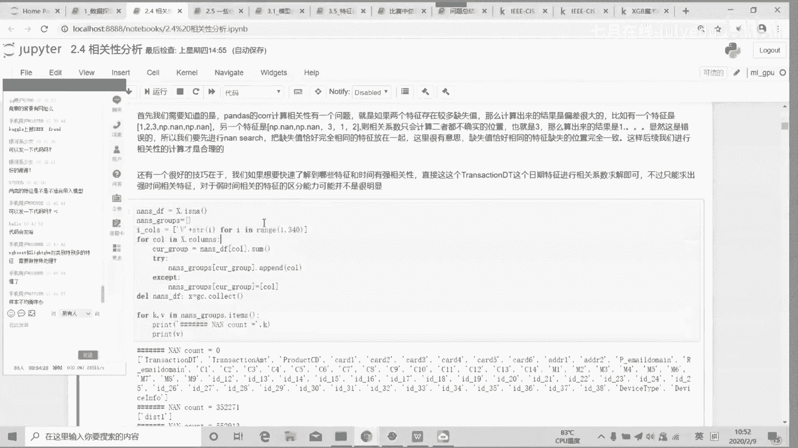

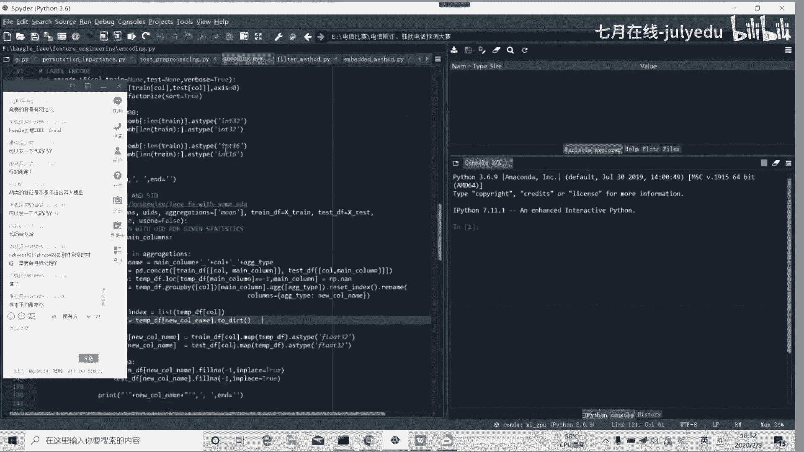

然后进行基本的统计描述。由于字段众多，建议将结果保存到本地文件查看。接着是可视化工
作，以下是对几个关键特征的探索：

*   **`TransactionDT`**：可视化发现它是一个表示时间的连续特征。但训练集和测试集的数据范围完全不同，因此这个特征无法直接用于建模，后续需要排除。
*   **`TransactionAMT`**：通过箱线图发现训练集和测试集分布有差异。对比正负样本发现，正常用户中有大额交易，而所有欺诈用户都倾向于小额交易。这个特征具有区分度。
*   **`ProductCD`**：这是一个低基数类别特征，只有五个类别。可视化显示其在好坏客户间的分布差异较大，是一个重要特征。
*   **`card1` - `card6`**：这些是高基数类别特征。例如`card1`有13553个不同类别。需要检查训练集和测试集中类别出现的差异。
*   **`card4`, `card6`**：这些特征包含文本信息（如`visa`, `mastercard`），可以结合先验知识进行挖掘（例如，不同类型卡的违约率可能不同）。
*   **`P_emaildomain`, `R_emaildomain`**：包含丰富文本信息的类别特征。可以进行合并处理（如`gmail.com`和`gmail`合并），或衍生新特征（如“是否使用匿名邮箱”）。
*   **`C`系列特征**：技术类特征，大部分值集中在某个区间。
*   **`D`系列特征**：时间间隔类特征，在不同样本类型上分布差异明显。
*   **`M`系列特征**：布尔型特征（`T/F`），只有两类，无需复杂处理。
*   **`V`系列特征**：数量众多，高度冗余，后续需要做相关性分析。
*   **`ID`系列特征**：`ID_01`到`ID_11`是连续型，`ID_12`到`ID_38`是类别型。对于高基数类别特征，需要进行编码处理。

---

## 相关性分析与特征处理

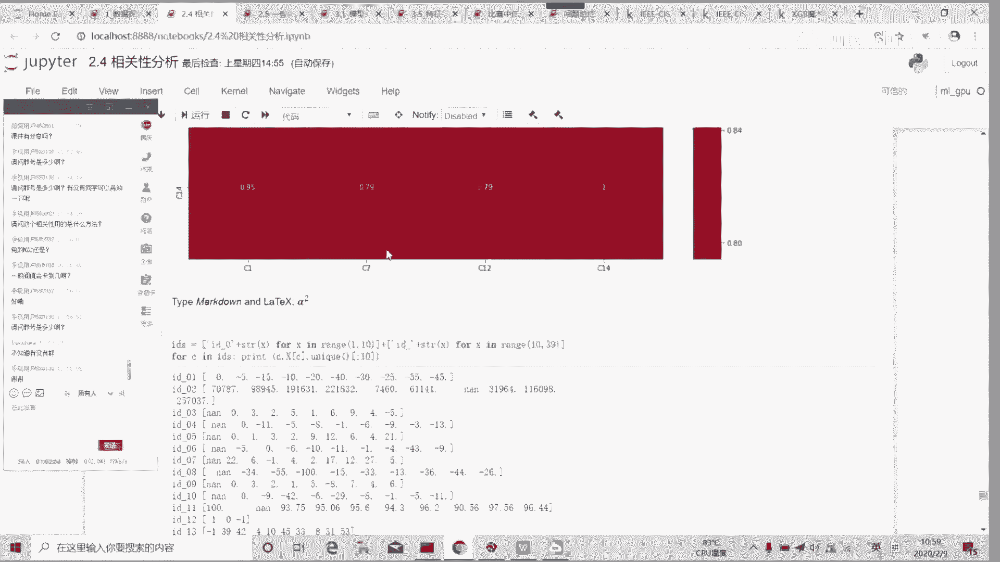

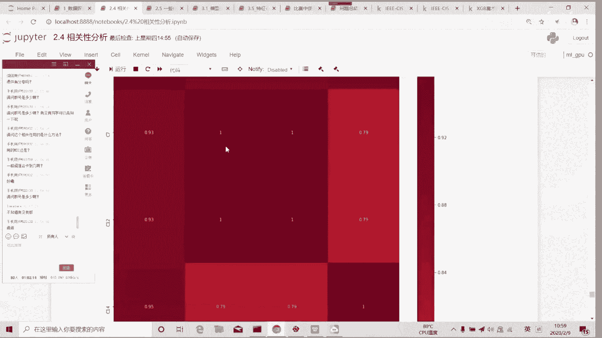

完成了初步的数据探索，本节中我们来看看如何处理特征间的相关性，并优化内存。

首先，对于`V`特征，官方说明它们是已知特征的衍生，可能冗余。因此可以进行严格的相关性分析并删除高相关特征（阈值设为0.75），这不仅能节约内存，还能提高模型泛化性能。

**注意**：计算相关性前，必须按缺失值情况对特征分组。因为`pandas.corr()`只计算两个特征均非缺失的样本，如果公共样本很少，计算结果会失真。

以下是分组和删除高相关特征的示例代码：

```python
# 根据缺失值情况分组
def get_missing_groups(df):
    missing_stats = df.isnull().sum()
    groups = {}
    for col in df.columns:
        missing_count = missing_stats[col]
        if missing_count not in groups:
            groups[missing_count] = []
        groups[missing_count].append(col)
    return groups

# 计算组内相关性并删除高相关特征
def remove_high_corr_in_group(df, group_cols, threshold=0.75):
    corr_matrix = df[group_cols].corr(method='spearman').abs()
    upper = corr_matrix.where(np.triu(np.ones(corr_matrix.shape), k=1).astype(bool))
    to_drop = [column for column in upper.columns if any(upper[column] > threshold)]
    # 删除时，保留取值数量更多的特征
    for col in to_drop:
        if df[col].nunique() < df[其他高相关特征].nunique(): # 伪代码，需具体实现
            df.drop(col, axis=1, inplace=True)
    return df
```

对于其他特征（如`C`特征），不建议使用如此严格的阈值，通常只删除相关性为0.99或1的完全冗余特征。

---

## 建立基线模型与交叉验证策略

处理完相关性后，本节中我们来建立基线模型并确定合适的交叉验证策略。

首先，固定所有随机种子，确保结果可复现。

```python
import numpy as np, random, os
def seed_everything(seed=42):
    random.seed(seed)
    os.environ['PYTHONHASHSEED'] = str(seed)
    np.random.seed(seed)
seed_everything()
```

然后进行内存优化，将类别特征进行标签编码，并使用工具函数降低数值型特征的内存占用。

```python
# 标签编码
from sklearn.preprocessing import LabelEncoder
for col in categorical_cols:
    data[col] = data[col].fillna(-1)
    le = LabelEncoder()
    data[col] = le.fit_transform(data[col].astype(str))

# 内存优化函数
def reduce_mem_usage(df):
    # ... 具体实现：根据数值范围调整数据类型
    return df
data = reduce_mem_usage(data)
```

接下来确定交叉验证策略。由于本比赛数据具有时间性，测试了多种CV方式：
*   `StratifiedKFold`：可能导致时间泄露，线上分数较低。
*   `KFold`：线上分数相对较高。
*   `GroupKFold`：分数与`KFold`接近。
*   `TimeSeriesSplit`：线上分数很差。

因此，后续选择`KFold`作为CV策略。建立初始的LightGBM基线模型后，发现线下AUC约为0.92，线上约为0.93，表明线下验证与线上得分差异不大，CV策略合理。

---

## 模型分析与过拟合问题诊断

建立了基线模型后，本节中我们深入分析模型存在的问题。

查看训练日志发现，模型过拟合严重：训练集AUC接近1，但验证集AUC只有0.9左右，泛化误差高达7个点。尝试调整参数（如降低`num_leaves`、增加`min_child_samples`）来增强模型约束，但效果有限。泛化误差很难单纯通过调参从7个点缩小到2-3个点。

因此，需要从其他角度解决过拟合问题。过拟合的本质是训练集和测试集的数据分布存在差异。针对表格数据，主要从特征工程的角度入手。

这里引入**对抗性验证**来检测特征分布偏移：
1.  将训练集标签设为1，测试集标签设为0。
2.  训练一个分类器（如LightGBM）来区分样本来自训练集还是测试集。
3.  如果AUC很高（例如>0.6），说明两组数据分布不同。通过特征重要性找出导致差异的特征。

首次对抗性验证发现，只有`TransactionDT`的特征重要性极高，其他都为0。这与EDA结论一致，`TransactionDT`是一个偏移严重的特征。删除它后再次进行对抗性验证，其他偏移特征（如`ID_31`, `card1`, `D15`）的重要性才显现出来。

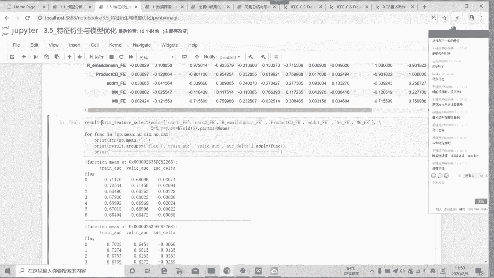

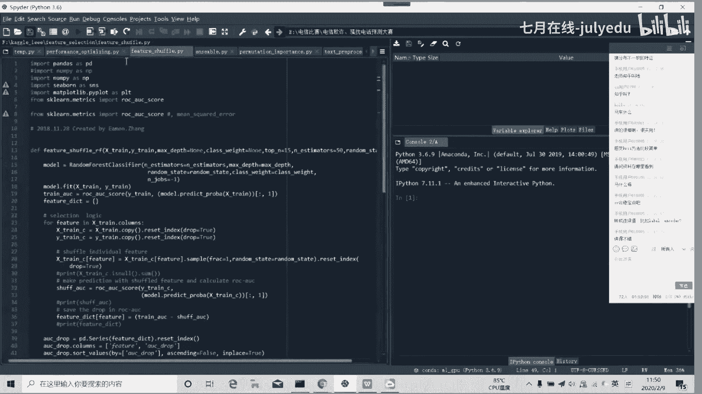

---

## 特征偏移的检测与处理

上一节我们使用对抗性验证找到了偏移特征，本节中我们介绍另一种更精细的偏移检测方法——“Quasi”验证法，并讨论如何处理这些偏移特征。

“Quasi”验证法（源自冠军解决方案）思路如下：
1.  单独抽取每一个特征。
2.  仅用该特征训练一个模型并进行交叉验证。
3.  计算该特征在训练折和验证折上的平均AUC差值（`delta_AUC = train_AUC - val_AUC`）。
`delta_AUC`越大，说明该特征带来的泛化误差可能越大。

通过这种方法，可以更细致地评估每个特征的偏移程度。排名靠前的偏移特征大多是类别特征（如`card1`, `addr1`）和`TransactionAMT`。

处理特征偏移的思路：
*   **类别特征**：
    *   直接删除：可能损失信息（如删除`card1`会导致分数下降）。
    *   转换为连续值：在本比赛中，将类别特征进行标签编码后当作连续值使用，效果很好，显著降低了泛化误差。
    *   特征编码/嵌入：如频率编码、目标编码。
*   **连续特征**：
    *   对数变换/分箱：尝试对`TransactionAMT`做对数变换，但效果不明显。


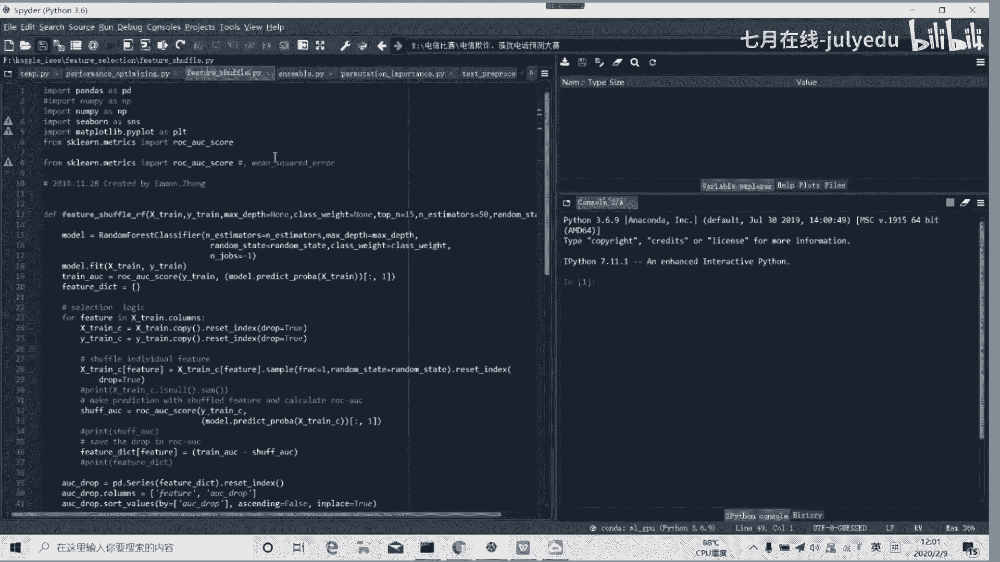

**实践尝试**：
1.  将类别特征转为连续值，并删除`Quasi`验证中`val_AUC`低于0.5的“无用”特征。结果：线上分数提升约0.0002。
2.  仅将类别特征转为连续值，不删除任何特征。结果：线上分数提升约0.0011，效果更好。这是因为转换后，虽然某些特征（如`card1`）的区分度（`train_AUC`）略有下降，但其泛化误差（`delta_AUC`）大幅降低，整体收益为正。

---


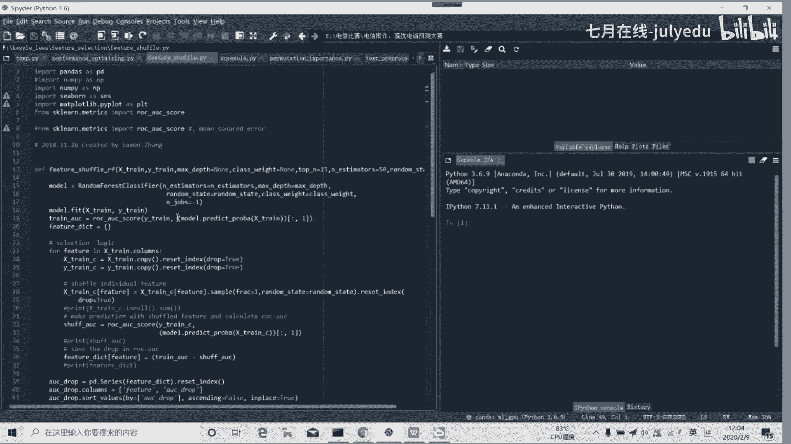


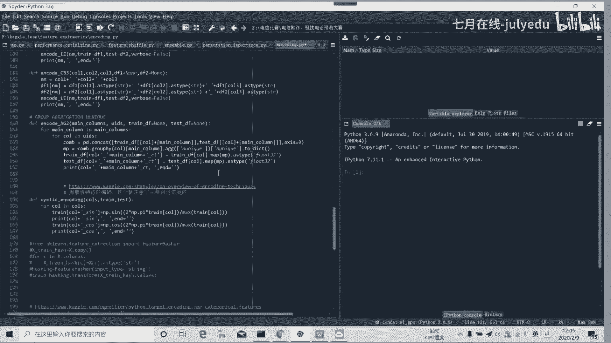

## 特征工程实战

解决了特征偏移问题，模型分数有了初步提升。本节中我们开始进行系统的特征工程来进一步提高性能。

特征工程遵循“衍生-评估”的迭代流程。首先从最重要的特征入手（参考基线模型的特征重要性）。

**1. 重要类别特征的编码**
对特征重要性排名靠前的类别特征（如`card1`, `addr1`）进行频率编码。

```python
for col in ['card1', 'addr1']:
    freq_enc = data[col].value_counts(normalize=True)
    data[col + '_freq'] = data[col].map(freq_enc)
```

衍生新特征后，需进行相关性分析，删除与原始特征或其他新特征高相关的特征。然后将保留的新特征加入数据集，运行交叉验证评估效果。频率编码带来了显著的分数提升。

**2. 类别特征之间的组合**
对重要的类别特征进行两两组合和三三组合，生成新的交叉特征。这会产生大量新特征。
同样需要进行相关性分析，并通过网格搜索确定最佳的相关性删除阈值（例如，本案例中阈值设为0.989时效果最好）。组合特征进一步提升了模型性能。

**3. 类别特征与连续特征的聚合**
对重要的类别特征和连续特征进行`groupby`聚合操作（如求均值、标准差、中位数等）。例如，`card1`和`TransactionAMT`的聚合特征，逻辑上可以理解为“每种卡类型的平均消费金额”，这类特征往往包含有价值的信息。
聚合会产生大量特征，需要处理常值特征和缺失值，并进行严格的相关性分析。通过测试不同相关性阈值对分数的影响，找到最优阈值。

**4. 其他技巧**
*   **用负值填充缺失值**：对于树模型，用-999等负值填充缺失值，可能让模型在分裂时考虑缺失样本，有时能缓解过拟合。但本案例中尝试后分数下降。
*   **挖掘“Magic Feature”**：冠军方案中通过深入的业务理解，构建了“用户唯一标识（UID）”特征（结合`card1`, `addr1`, 交易开始时间等），这是一个强特征，带来了巨大的分数提升。这依赖于对问题的深刻洞察，而非通用套路。
*   **交易金额小数部分**：有方案将`TransactionAMT`的小数部分单独作为一个特征，认为其可能代表不同的交易地区。

完成几轮特征工程后，再进行一次超参数调优（使用贝叶斯优化），分数还能得到小幅提升。


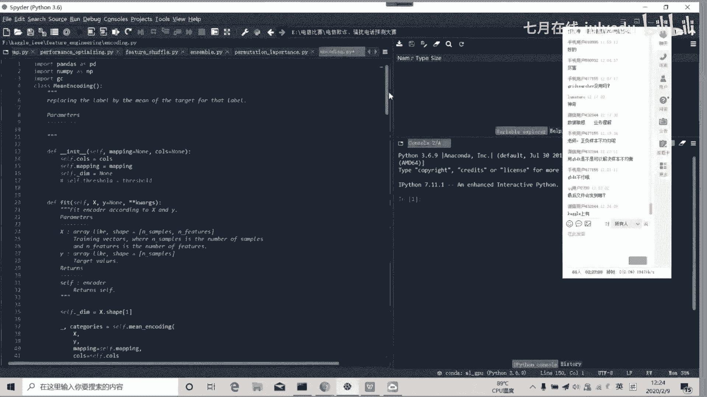

---

## 关键问题总结与优化技巧

我们一起走完了从数据探索到特征工程的完整流程。本节中我们对课程中的关键问题和实用技巧进行总结。

### 一、 类别不平衡问题
本比赛正负样本比为29:1，但排名靠前的方案均未使用重采样等方法。因为**类别不平衡的本质问题往往不是比例悬殊，而是类间重叠、小类样本子分布复杂等**。当少数类样本绝对数量足够时（本例中欺诈样本不少），模型可以学习到其模式，无需特殊处理。

### 二、 特征偏移问题
这是导致过拟合的核心。对抗性验证和“Quasi”验证是有效的检测工具。处理方法因特征类型而异，没有普适方案，需要结合业务理解进行尝试。

### 三、 性能优化技巧
1.  **内存优化**：使用`reduce_mem_usage`类函数优化数据类型。
2.  **代码提速**：使用`numba`加速关键计算（如AUC），使用多进程并行。
3.  **提前剪枝**：在特征工程前，删除常值特征、ID类特征等。

### 四、 特征选择方法
*   **过滤式**：如相关性分析。缺点是指标与模型目标可能脱节。
*   **包裹式**：如递归特征消除（RFE）。效果较好但计算成本高。
*   **嵌入式**：如模型的特征重要性。但传统`feature_importance`有缺陷：1) 强特征会掩盖其他特征；2) 只反映对训练集拟合的贡献，不反映泛化能力。
*   **改进方法**：`permutation importance`（打乱特征值看分数下降）、`shap value` 能更好地评估特征对模型预测的真实贡献。

### 五、 实用工具与模板
*   **固定随机种子**：确保实验可复现。
*   **超参数优化模板**：推荐使用贝叶斯优化（如`hyperopt`库），比网格/随机搜索更高效。
*   **项目目录模板**：规范化的目录结构（如`/data`, `/features`, `/models`）能极大提升工作效率。
*   **Kaggle工具函数集**：积累常用的数据读取、内存优化、特征编码、验证函数等，形成自己的工具箱。

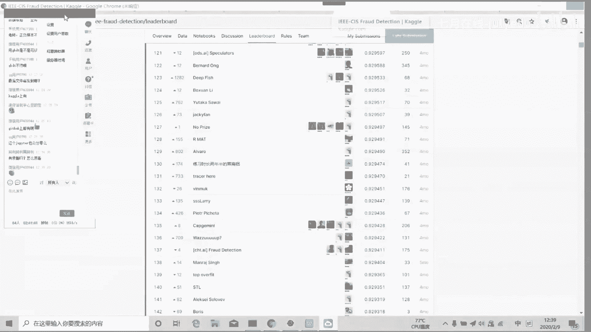

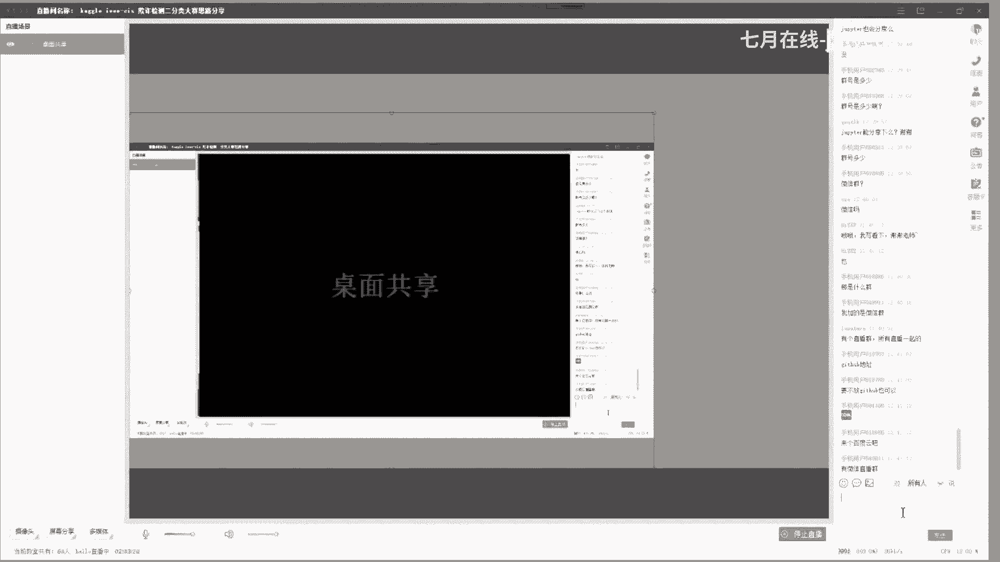

---

## 总结

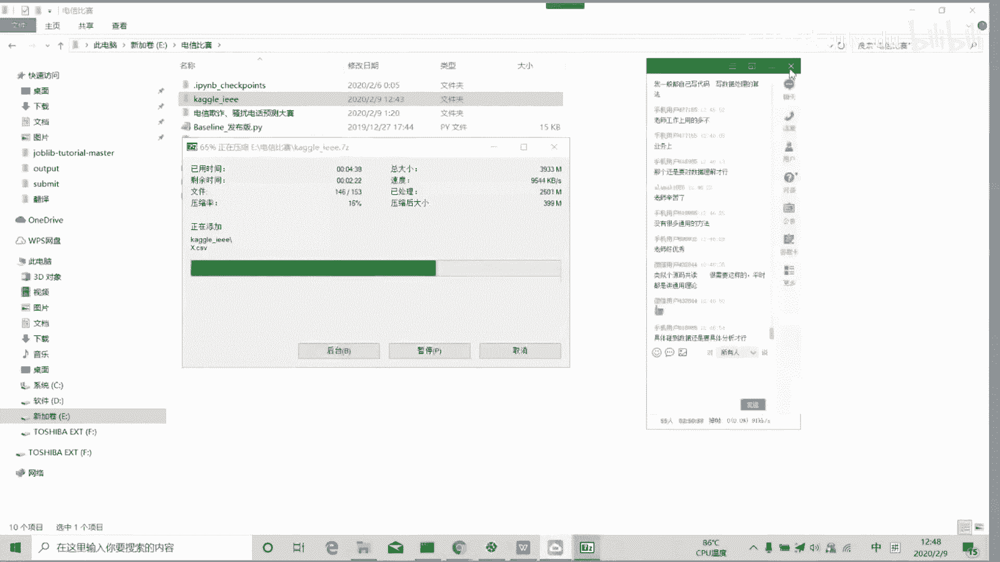


在本节课中，我们一起学习了如何系统性地解决一个Kaggle二分类比赛。我们从理解数据和比赛背景出发，通过EDA熟悉数据，然后建立基线模型并诊断出过拟合问题。利用对抗性验证等方法，我们定位了特征偏移这一根本原因，并针对性地处理了类别和连续特征。随后，我们通过多轮特征工程（编码、组合、聚合）稳步提升模型性能。最后，我们总结了类别不平衡、特征偏移、性能优化和特征选择等核心问题的理解与应对策略，并分享了一系列提升效率的实战工具和模板。希望这套从分析到解决问题的框架，能对大家未来的数据科学项目有所启发和帮助。