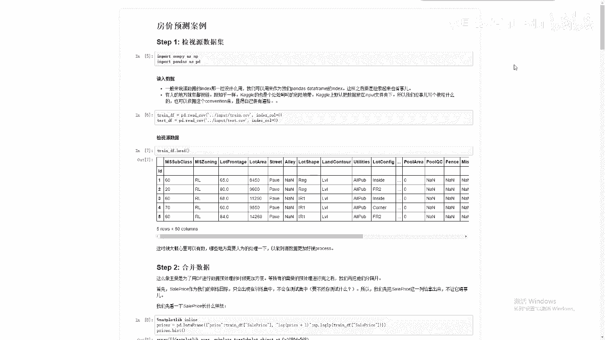
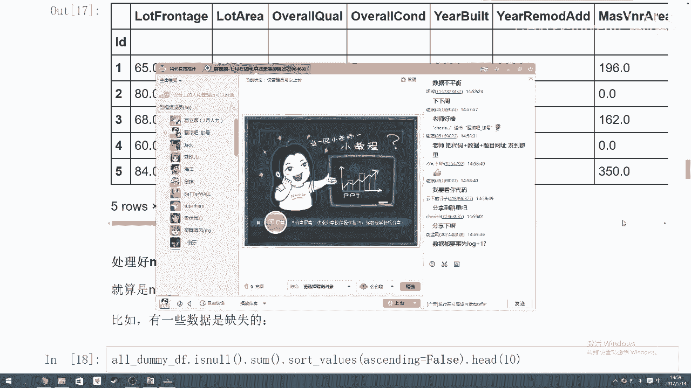

# 人工智能—Kaggle实战公开课（七月在线出品） - P5：Kaggle金融比赛实战：房价预测 🏠



在本节课中，我们将学习如何运用机器学习知识，在Kaggle平台上完成一个经典的房价预测竞赛项目。我们将从数据导入开始，逐步讲解数据预处理、特征工程、模型构建与集成，最终提交预测结果。


---

## 概述

Kaggle是一个知名的数据科学竞赛平台，国内类似的平台有天池。公司会在这些平台上发布数据集和问题，参赛者需要构建模型来解决问题并提交预测结果。本节课我们将以Kaggle上的“房价预测”竞赛为例，使用一个包含美国房屋多种特征（如房屋等级、占地面积、邻里状况等）的数据集，目标是预测房屋的最终售价。

我们将使用Pandas进行数据处理，并运用决策树、集成学习等模型来完成预测。

---

## 数据导入与初步观察

首先，我们需要导入必要的Python库并加载数据。在数据竞赛中，使用Pandas库处理数据是一种高效且通用的做法。

以下是导入库和读取数据的代码：

```python
import pandas as pd

# 读取训练数据和测试数据
train = pd.read_csv('../input/train.csv')
test = pd.read_csv('../input/test.csv')
```

读取数据后，我们通常需要查看数据的前几行，以了解数据的结构和内容。

```python
# 查看数据前五行
print(train.head())
```

通过观察，我们可能会发现数据中存在缺失值（显示为NaN）。这提示我们在后续步骤中需要进行数据清洗。

---

## 数据预处理

数据预处理是建模前至关重要的一步，目的是将原始数据转换为适合模型训练的格式。本节我们将介绍几个关键的预处理步骤。

### 目标变量平滑化

在回归问题中，如果目标变量（这里是房价`SalePrice`）的分布严重偏斜，可能会影响模型的拟合效果。我们通常希望目标变量的分布更接近正态分布。

一种常见的处理方法是使用对数变换。我们采用`log(1 + x)`的形式，其中的`+1`是为了防止出现对数为0或负数的情况。

```python
# 对训练数据的目标变量进行log(1+x)变换
train["SalePrice"] = np.log1p(train["SalePrice"])
```

这个变换可以使目标变量的分布更加平滑，有利于模型学习。

### 合并训练集与测试集

为了确保训练集和测试集经历完全相同的预处理流程（如填充缺失值、特征编码等），我们先将它们合并。

```python
# 合并数据集，同时标记数据来源
all_data = pd.concat((train.loc[:, 'MSSubClass':'SaleCondition'],
                      test.loc[:, 'MSSubClass':'SaleCondition']))
```

合并后，我们可以统一对`all_data`进行预处理，处理完成后再分割回训练集和测试集。

---

## 特征工程

特征工程是指将原始数据转换为更能代表问题本质的特征的过程。以下是两个主要方面。

### 分类变量处理

数据集中有些列是分类变量（如房屋等级`MSSubClass`），但它们以数字形式存储。数字本身带有大小关系，但这可能并不符合分类变量的真实含义。

首先，我们将这些列的数据类型转换为字符串，明确其分类属性。

```python
# 将MSSubClass列转换为字符串类型
all_data['MSSubClass'] = all_data['MSSubClass'].astype(str)
```

接着，对于所有分类变量，我们使用**独热编码**将其转换为数值形式。独热编码为每个类别创建一个新的二进制列（0或1），从而消除数字间的虚假顺序关系。

```python
# 对分类变量进行独热编码
all_data = pd.get_dummies(all_data)
```

### 数值变量处理

对于数值型变量，我们主要处理两个问题：缺失值和数据尺度。

**1. 填充缺失值**
对于缺失的数值，我们通常用平均值、中位数或0来填充。具体方法需参考竞赛说明。这里我们简单地用该列的平均值填充。

```python
# 用每列的平均值填充缺失值
all_data = all_data.fillna(all_data.mean())
```

**2. 数值标准化**
为了消除不同特征之间量纲和数值范围的差异，加速模型收敛，我们通常对数值特征进行标准化处理。标准化公式为：
`(x - mean(x)) / std(x)`

```python
from sklearn.preprocessing import StandardScaler
scaler = StandardScaler()
# 对数值列进行标准化
numeric_cols = all_data.select_dtypes(include=[np.number]).columns
all_data[numeric_cols] = scaler.fit_transform(all_data[numeric_cols])
```

标准化后，所有数值特征的均值约为0，标准差约为1。

---

## 模型构建与评估

预处理完成后，我们将数据分割回训练集和测试集，并开始构建预测模型。

### 数据分割

首先，从合并的数据中分离出训练集和测试集。

```python
# 分割数据
X_train = all_data[:train.shape[0]]
X_test = all_data[train.shape[0]:]
y_train = train.SalePrice
```

### 尝试基础模型

我们首先尝试两个基础模型：岭回归和随机森林，并使用交叉验证来评估它们的性能。

**1. 岭回归**
我们使用交叉验证来寻找岭回归的最佳正则化参数`alpha`。

```python
from sklearn.linear_model import Ridge
from sklearn.model_selection import cross_val_score

# 测试不同的alpha值
alphas = [0.05, 0.1, 0.3, 1, 3, 5, 10, 15, 30, 50, 75]
cv_ridge = [cross_val_score(Ridge(alpha=alpha), X_train, y_train, cv=5).mean()
            for alpha in alphas]
```

通过绘制`alpha`与交叉验证得分的关系图，我们可以找到使模型性能最优的`alpha`值（例如，可能在10到20之间）。

**2. 随机森林**
同样，我们对随机森林模型进行调参，例如调整树的数量`n_estimators`和每棵树考虑的最大特征比例`max_features`。

```python
from sklearn.ensemble import RandomForestRegressor

# 测试不同的max_features值
max_features = [0.1, 0.3, 0.5, 0.7, 0.9, 0.99]
cv_rf = [cross_val_score(RandomForestRegressor(n_estimators=200, max_features=mf),
                         X_train, y_train, cv=5).mean()
         for mf in max_features]
```

通过交叉验证，我们可以确定随机森林的最佳参数（例如，`max_features`可能在0.3左右）。

---

## 模型集成

上一节我们介绍了两个基础模型及其调参方法。本节中，我们来看看如何通过集成学习结合这两个模型的优势，以获得更稳健、更准确的预测。

集成学习的核心思想是“三个臭皮匠，顶个诸葛亮”。我们将训练好的岭回归模型和随机森林模型的预测结果进行平均，作为最终的预测值。

```python
# 使用最佳参数训练模型
ridge_model = Ridge(alpha=15).fit(X_train, y_train)
rf_model = RandomForestRegressor(n_estimators=200, max_features=0.3).fit(X_train, y_train)

# 获取两个模型的预测结果（注意：预测值经过了log变换）
ridge_pred = ridge_model.predict(X_test)
rf_pred = rf_model.predict(X_test)

# 对预测结果进行平均集成
final_pred = (ridge_pred + rf_pred) / 2
```

由于我们对目标变量`SalePrice`进行了`log(1+x)`变换，现在需要将集成后的预测值转换回原始尺度。

```python
# 将预测值从对数尺度转换回原始房价尺度
final_pred = np.expm1(final_pred)
```

---

## 生成提交文件

最后，我们需要按照Kaggle要求的格式生成提交文件。

```python
# 创建提交文件
submission = pd.DataFrame({'Id': test.Id, 'SalePrice': final_pred})
submission.to_csv('submission.csv', index=False)
```

将生成的`submission.csv`文件上传至Kaggle，即可查看模型在测试集上的得分。

---



## 总结

本节课中，我们一起学习了如何完整地参与一个Kaggle房价预测竞赛。我们从数据导入和观察开始，进行了包括目标变量平滑化、分类变量编码、缺失值填充和数值标准化在内的数据预处理与特征工程。然后，我们构建并调优了岭回归和随机森林两个基础模型，最后通过简单的平均法集成这两个模型，得到了最终的预测结果并生成了提交文件。


这个过程展示了将机器学习理论知识应用于实际问题的完整流程，特别是集成学习如何有效提升模型性能。希望这个案例能帮助你更好地理解数据竞赛的实战步骤。