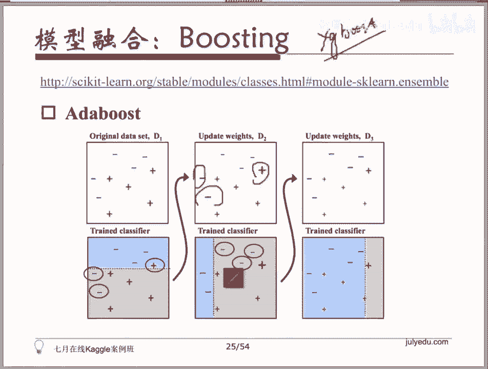

# 人工智能—Kaggle实战公开课（七月在线出品） - P6：ML必备技巧：模型分析与模型融合 🧩

在本节课中，我们将要学习机器学习流程中至关重要的一步：模型分析与模型融合。当你已经完成了特征工程、模型选择与调优，并拥有了一个或多个表现不错的模型后，下一步就是通过模型融合技术来进一步提升预测性能。

---

## 模型融合概述

上一节我们介绍了如何通过调优来获得一个不错的模型。本节中我们来看看如何将多个模型结合起来，以获得更稳定、更强大的预测效果。模型融合主要有三种常见方式。

以下是三种主要的模型融合方法：

1.  **Bagging**：旨在解决模型过拟合（Overfitting）问题。
2.  **Stacking**：通过组合多个模型的预测结果作为新特征，来训练一个“元模型”。
3.  **Boosting**：一种逐步增强的集成方法，如AdaBoost或梯度提升决策树。

---

## Bagging：降低方差，缓解过拟合

Bagging的核心思想是通过构建多个相互独立的基学习器，并对它们的结果进行综合（如投票或平均），来平滑单个模型可能产生的噪声或异常，从而降低整体模型的方差，缓解过拟合。

其过程可以概括为：
*   **训练**：从原始数据集中**有放回地**随机抽取多个子集，每个子集用于训练一个基学习器。
*   **预测**：对于分类任务，综合所有基学习器的预测结果进行**投票**；对于回归任务，则对所有结果求**平均**。

在Scikit-learn中，你可以方便地使用 `BaggingClassifier` 或 `BaggingRegressor`。

```python
from sklearn.ensemble import BaggingClassifier
from sklearn.tree import DecisionTreeClassifier

# 使用决策树作为基分类器，构建一个包含100个估计器的Bagging集成模型
bagging_model = BaggingClassifier(
    base_estimator=DecisionTreeClassifier(),
    n_estimators=100
)
```

---

## Stacking与Blending：元模型的力量

上一节我们介绍了Bagging，它是一种并行集成的思想。本节中我们来看看Stacking，它是一种层次化的模型融合策略。

Stacking的做法是：首先用原始数据训练多个不同的基学习器（第一层），然后将这些基学习器的预测结果作为**新的特征**，输入给另一个模型（第二层，或称元模型）进行训练，由元模型做出最终预测。

一个简化的理解是：神经网络的多层结构就在做类似的事情，每一层的输出作为下一层的输入。

**Blending** 可以看作是Stacking的一种简化或特例。它通常使用一个简单的线性模型（如线性回归）作为元模型，对第一层各个模型的预测结果进行**加权平均**。

例如，在房价预测回归问题中，三个基学习器分别给出预测值 `Y1`, `Y2`, `Y3`。Blending会学习一组权重 `(w1, w2, w3)`，使得线性组合 `w1*Y1 + w2*Y2 + w3*Y3` 最接近真实房价。表现好的基学习器会获得更大的权重。

> 注：Scikit-learn没有直接提供Stacking/Blending的接口，但实现起来并不复杂。通常需要手动获取第一层模型的预测输出，并将其作为特征训练第二层模型。

---

## Boosting：从错误中学习

Boosting与Bagging的并行思想不同，它是一种串行的集成方法。其核心在于让后续的模型重点关注之前模型**预测错误的样本**，通过不断修正错误来提升整体性能。

这个过程类似于学生做练习题：先做一遍，把做错的题目标记出来并给予更多重视，然后重点练习这些错题，如此反复，直到掌握所有题目。

以下是两种经典的Boosting算法：

*   **AdaBoost**：通过调整训练样本的**权重**，让后续模型更关注被前序模型分错的样本。
*   **梯度提升决策树（GBDT/Gradient Boosting）**：通过在损失函数（Loss Function）的**梯度下降方向**上构建新的模型，来不断减少残差。

在Scikit-learn中，你可以找到对应的实现：

```python
from sklearn.ensemble import AdaBoostClassifier, GradientBoostingClassifier

# AdaBoost分类器
ada_model = AdaBoostClassifier()
# 梯度提升分类器
gbdt_model = GradientBoostingClassifier()
```

> 提示：对于GBDT，在实际应用中（尤其是大数据集），更推荐使用 **XGBoost**、**LightGBM** 或 **CatBoost** 等优化过的库，它们比Scikit-learn中的实现速度更快、功能更强大。

---

## 总结与工具回顾

本节课中我们一起学习了三种核心的模型融合技术：用于降低方差的**Bagging**，层次化组合模型的**Stacking/Blending**，以及从错误中逐步增强的**Boosting**。

回顾整个机器学习流程，在Scikit-learn中我们可以找到大部分所需的工具：
1.  **数据预处理**：`sklearn.preprocessing` 和 `sklearn.impute`。
2.  **特征工程与选择**：`sklearn.feature_selection`。
3.  **模型训练与评估**：各种分类器、回归器及评估指标。
4.  **模型诊断**：通过学习曲线分析模型状态。
5.  **模型融合**：`sklearn.ensemble` 模块提供了Bagging、AdaBoost、GBDT、随机森林等集成方法。




通过合理运用这些技巧，你可以系统地构建出更强健、更准确的机器学习模型，从而在Kaggle等数据科学竞赛中取得更好的成绩。