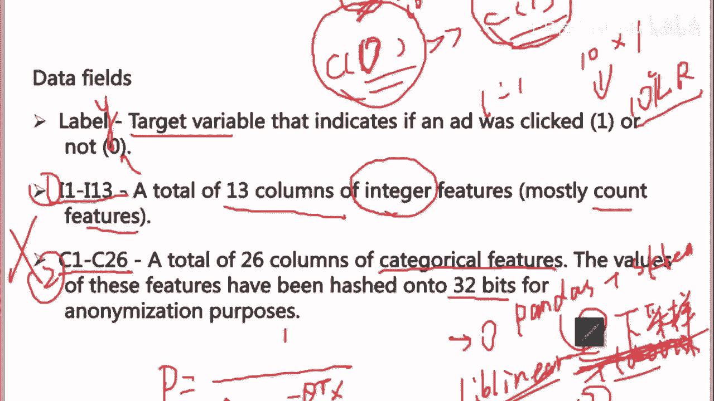
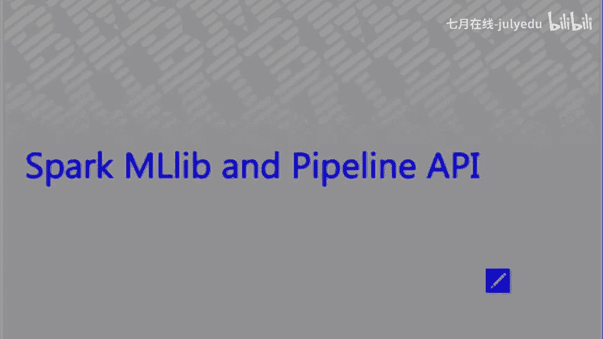
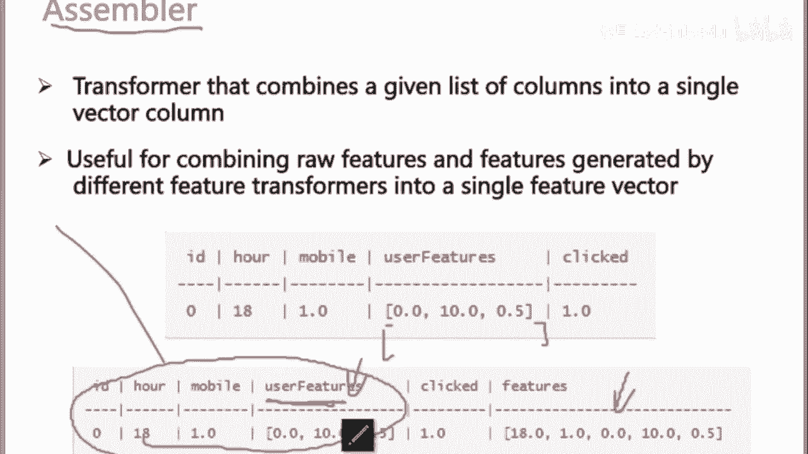
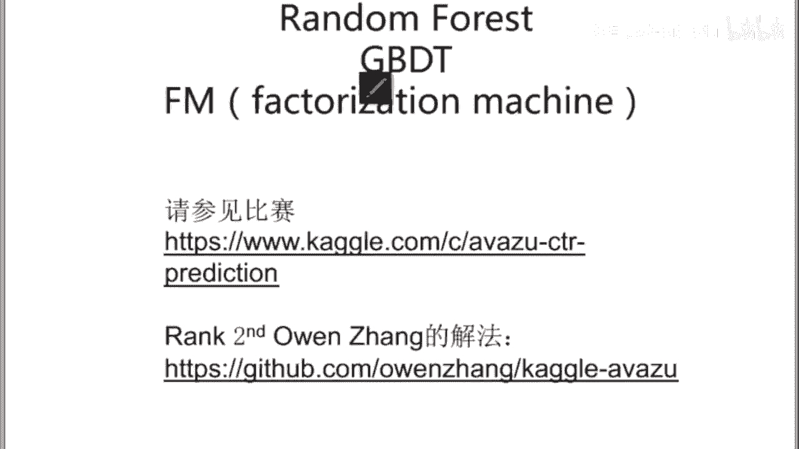

# 人工智能—Kaggle实战公开课（七月在线出品） - P7：Spark MLlib 与 Pipeline API 🚀



在本节课中，我们将学习如何利用 Spark MLlib 及其 Pipeline API 来处理海量数据，从而避免因采样而丢失信息。我们将重点介绍数据处理流程、特征工程以及如何在分布式环境中构建和评估模型。



---

## 大规模数据处理需求

当面对海量数据时，我们不想进行下采样或大量采样，以免丢失数据信息。这时，我们需要借助大规模计算工具，例如 Spark。

Spark 包含一个名为 MLlib 的组件，专门用于机器学习建模。除了 Spark SQL、Streaming 和 GraphX 用于其他数据处理任务（如流处理或 HDFS 上的 Hive 数据操作），真正的建模工作主要在 MLlib 中完成。

要使用 Spark MLlib，需要熟悉一个概念：**ML Pipeline**。它提供了一个流程化的框架来组织机器学习任务。

---

## Spark ML Pipeline 核心组件

Spark ML Pipeline 的核心组件与常见的数据科学工具类似，主要包括：

*   **DataFrame**：类似于 Pandas 中的 DataFrame，是 Spark SQL 中处理结构化数据的主要数据结构。
*   **Transformer**：用于对 DataFrame 进行转换，例如数据预处理和特征工程，输入一个 DataFrame 并输出一个新的 DataFrame。
*   **Estimator**：用于拟合模型，从数据中学习参数。
*   **Parameter**：用于向模型或转换器传递参数。
*   **Evaluator**：用于评估模型性能。

一个典型的 Pipeline 流程可以概括为：加载数据 -> 抽取特征 -> 训练模型 -> 评估模型。

---

## Pipeline 工作流程详解

以下是 Spark MLlib 中一个典型的 Pipeline 工作流程，我们将逐步解析每个步骤。

### 1. 数据读取与初步处理

首先，我们需要将数据读入 Spark。以下是一个使用 PySpark 读取 CSV 文件的示例代码，因为 PySpark 的语法对 Python 用户更友好。

```python
# 示例：读取CSV数据并创建DataFrame
from pyspark.sql import SparkSession
from pyspark.sql import Row

spark = SparkSession.builder.appName("MLExample").getOrCreate()

def parse_line(line):
    # 假设CSV文件以逗号分隔
    parts = line.split(',')
    # 假设第一列是标签，后续列是特征
    label = int(parts[0])
    int_features = [int(x) for x in parts[1:5]]  # 假设第2-5列是整数特征
    cat_features = parts[5:]                     # 假设第6列及之后是类别特征
    return Row(label=label, int_features=int_features, cat_features=cat_features)

# 读取文本文件并应用处理函数
lines = spark.sparkContext.textFile("data.csv")
parsed_data = lines.map(parse_line)
df = spark.createDataFrame(parsed_data)
df.show()
```

这段代码将 CSV 文件的每一行进行分割，并构建一个包含标签、整数特征和类别特征的 DataFrame。

### 2. 特征工程：类别特征编码

在机器学习中，类别特征（如“A”、“B”、“C”）需要转换为数值形式。一个常见的方法是 **One-Hot Encoding**。

在 Spark 中，这个过程通常分为两步：

1.  **StringIndexer**：为每个类别分配一个索引编号。Spark 会统计类别出现的频率，并按照频率从高到低分配索引（0, 1, 2...）。
2.  **OneHotEncoder**：根据索引，将类别转换为稀疏向量表示。

例如，对于类别值 `[A, A, C, B, C]`：
*   StringIndexer 统计后，A 出现2次，C 出现2次，B 出现1次。因此索引可能为：A->0, C->1, B->2。
*   OneHotEncoder 将其转换为稀疏向量。例如，A 转换为 `(3, [0], [1.0])`，表示一个长度为3的向量，在第0个位置值为1。

**核心概念公式**：
对于一个有 `k` 个类别的特征，One-Hot Encoding 将其转换为一个 `k` 维向量，其中只有对应类别索引的位置为1，其余为0。

### 3. 特征组装与模型训练

处理完所有特征列（例如，对多个类别列进行编码）后，我们需要将它们组合成一个最终的特征向量。这可以通过 **VectorAssembler** 完成。

接着，就可以将组装好的特征向量输入到分类器（如逻辑回归）中进行训练。

以下是一个简化的 Pipeline 构建示例：

```python
from pyspark.ml import Pipeline
from pyspark.ml.feature import StringIndexer, OneHotEncoder, VectorAssembler
from pyspark.ml.classification import LogisticRegression

# 1. 定义StringIndexer
indexer = StringIndexer(inputCol="cat_features", outputCol="cat_indexed")
# 2. 定义OneHotEncoder
encoder = OneHotEncoder(inputCol="cat_indexed", outputCol="cat_encoded")
# 3. 定义VectorAssembler，组合所有特征
assembler = VectorAssembler(
    inputCols=["int_features", "cat_encoded"],
    outputCol="features"
)
# 4. 定义逻辑回归模型
lr = LogisticRegression(featuresCol="features", labelCol="label")
# 5. 构建Pipeline
pipeline = Pipeline(stages=[indexer, encoder, assembler, lr])
# 6. 训练模型
model = pipeline.fit(df)
```



### 4. 模型评估与工业界实践


模型训练完成后，需要进行评估。在点击率预估等任务中，**AUC** 是一个关键指标，它是 **ROC 曲线** 下的面积。

此外，工业界在处理极高维特征时，常使用 **特征哈希** 等技术进行降维，以节省存储和计算资源。

一个完整的工业级 Pipeline 还包括：
*   将数据分割为训练集和验证集。
*   使用交叉验证进行超参数调优。
*   绘制 ROC 曲线并计算 AUC 值。
*   对模型进行持久化保存和加载。

---

## 总结

本节课我们一起学习了如何利用 Spark MLlib 和 Pipeline API 处理大规模数据。我们介绍了 Pipeline 的核心概念，包括 DataFrame、Transformer 和 Estimator。通过具体的代码示例，我们了解了如何读取数据、对类别特征进行 StringIndexer 和 OneHotEncoder 编码、使用 VectorAssembler 组合特征，以及最终构建和训练逻辑回归模型。




Spark MLlib 的 Pipeline 设计思想与 Scikit-learn 相似，但能够在分布式集群上运行，适合处理海量数据。对于熟悉 Python 的同学，PySpark 提供了便捷的接口。掌握这些工具，能够帮助你在 Kaggle 竞赛或工业界实践中，更高效地利用全量数据构建稳健的机器学习模型。