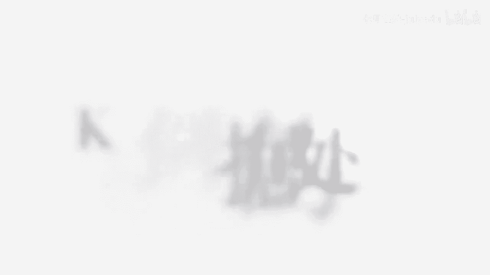
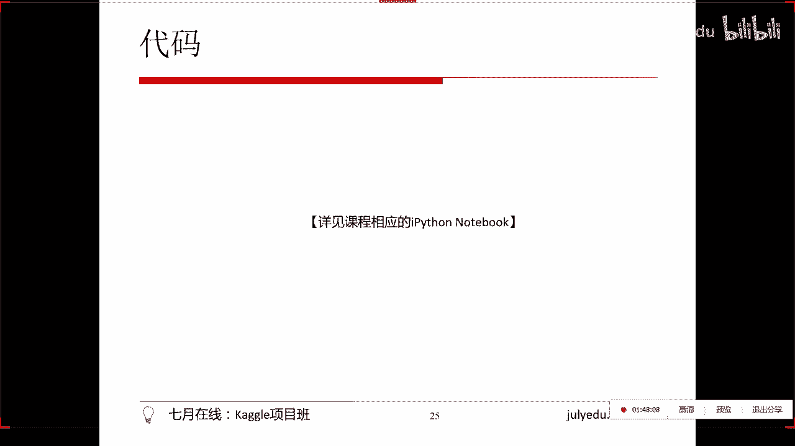
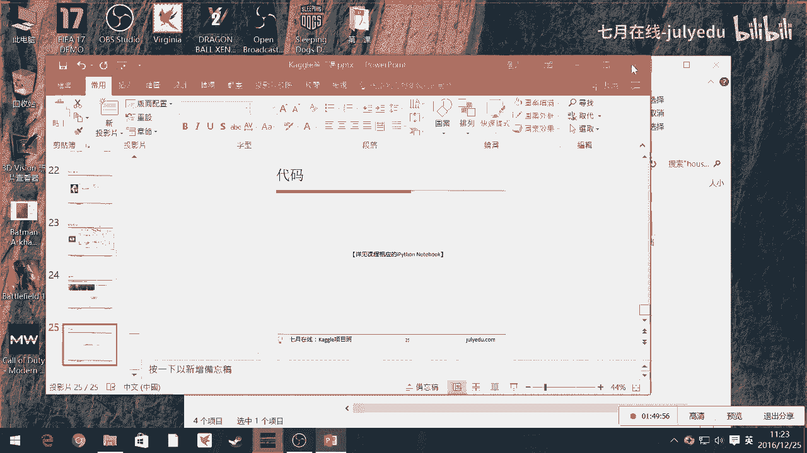
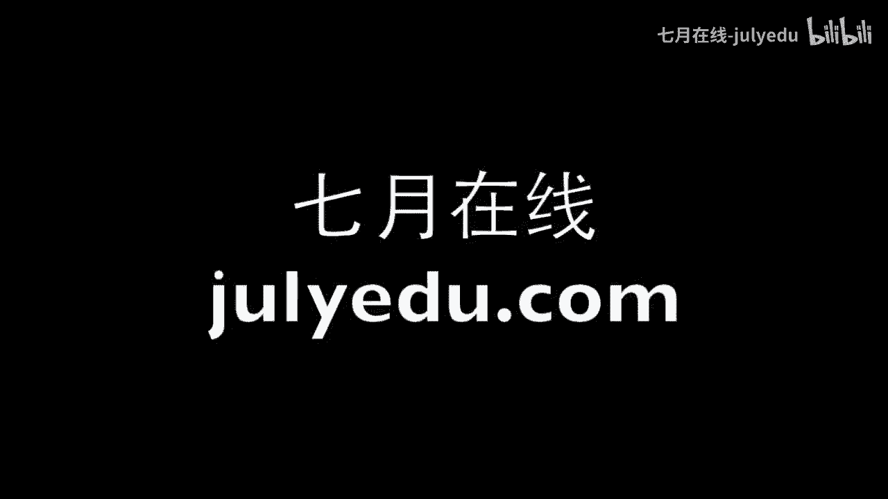

# 人工智能Kaggle实战公开课（七月在线出品） - P8：特征工程之非标准数据的处理 🛠️

在本节课中，我们将要学习如何处理非标准数据，将其转化为机器学习模型能够处理的标准化特征形式。我们将探讨文本、图片和视频等不同类型数据的处理方法。

## 概述

在之前的课程中，我们介绍了特征工程的基本概念，即处理那些已经是高维向量形式 `X = [特征1, 特征2, ..., 特征N]` 但不够“干净”的数据。然而，现实世界中的数据往往并非一开始就是这种规整的格式。

本节我们将关注那些更原始、非标准的数据，例如一句话、一张图片或一段视频。我们的核心任务是通过一系列步骤，将这些数据“数字化”和“向量化”，最终转化为模型可用的特征矩阵。

## 从非标准数据到特征向量

现实中的数据并非生来就是整齐划一的高维特征。我们需要通过降维、特征提取或数字化表达等方式，将原始数据转化为 `X = [特征1, 特征2, ..., 特征N]` 的形式。

这个过程可以宽泛地理解为更复杂的特征工程。与处理已结构化数据不同，这里我们面对的是数据本身形态的转换。

## 文本数据的处理 📝

文本数据，例如“hello world”，本身不是能被计算机直接按列处理的格式。我们需要借助自然语言处理技术将其转化为数字向量。

以下是几种常见的文本向量化方法：

*   **词袋模型**：统计每个单词在文本中出现的次数，转化为一个由0和1（或词频）组成的向量。例如，“hello”出现记为1，未出现的词记为0。
*   **词频-逆文档频率**：不仅考虑词频，还考虑词语在整个文档集合中的重要性。
*   **词嵌入**：例如 **Word2Vec**，通过语义网络将单词表达为一个固定维度的稠密向量，如 `[0.1, 0.43, -0.28, ...]`。

核心思想是，我们通过自定义的规则或模型，将文本数据转化为一个数字化的向量。

## 图片数据的处理 🖼️

图片数据本身是以RGB像素点阵构成的矩阵，这已经是一种数字化的表达形式，可以直接作为模型的输入。

然而，图片处理仍有其特殊性。例如，我们可能只想提取图片中“狗头”的部分，这就涉及到特征区域提取。更重要的是，原始的像素矩阵虽然数字化，但每个像素值本身并无明确语义。

通常，我们会使用**卷积神经网络** 等算法，从原始像素矩阵中提取出有意义的深层特征。这些提取出的特征值，才是真正意义上的、可用于后续机器学习模型（如分类器）的特征。关于CNN的详细内容，我们会在后续的深度学习课程中深入讲解。

## 视频数据的处理 🎬

视频数据的维度比图片更高，处理起来也更为复杂。基本的思路是将其分解为更易处理的低维组件。

处理视频数据通常遵循以下步骤：

1.  将视频流分离为**音轨**和**视频轨**。
2.  将视频轨按帧分解为一系列**图片**，每张图片可按上述图片处理方法转化为矩阵。
3.  音轨可以转化为**声波波形**（一系列振幅数值），或通过语音识别技术转化为**文本**，再按文本处理方法处理。

通过这种层层降维的方式，最终将所有信息都转化为数字化的向量表达形式。

## 案例与后续课程安排

本节课提到的文本分类具体案例（如Top News分类），将在下一堂专门讲解自然语言处理的课程中详细展开，这样更符合学习逻辑。课件已提前上传，供大家预习。

关于图片处理及卷积神经网络的应用，我们计划在第五或第六课，即深度学习部分进行系统讲解。

## 总结

本节课我们一起学习了特征工程中处理非标准数据的关键思想。我们了解到，无论是文本、图片还是视频，都可以通过**降维**和**数字化表达**的技术，将其转化为机器学习模型所需的标准化特征向量。文本常用词袋模型或词嵌入，图片本身是矩阵但需CNN提取特征，视频则可分解为图片和音频再分别处理。掌握这些预处理方法，是解决现实世界复杂机器学习问题的重要第一步。

---
**注**：课程相关资料与代码将会上传。感谢大家的学习。