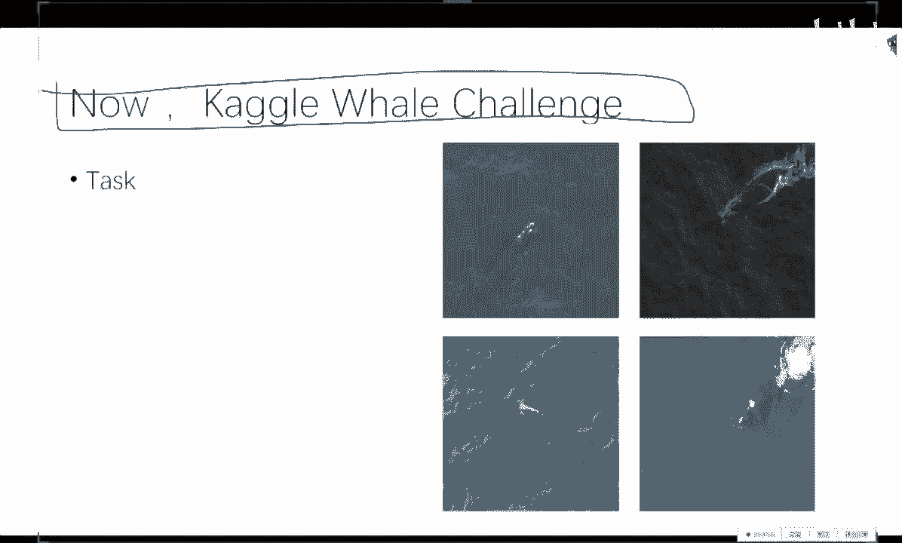
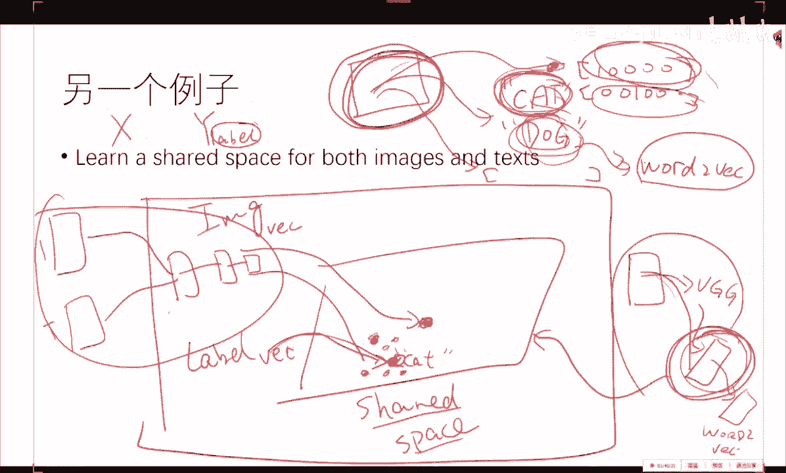
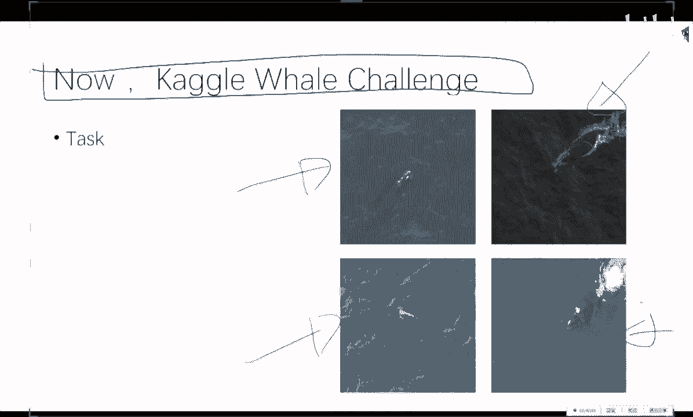
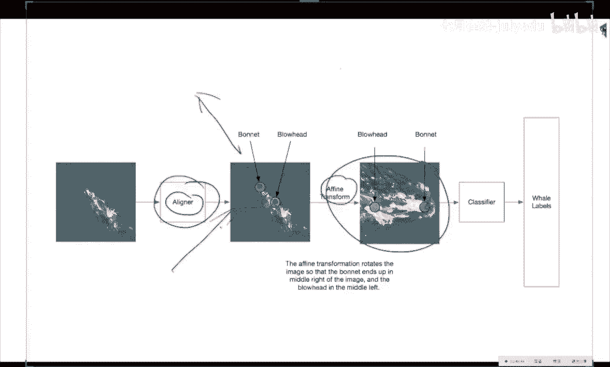

# 人工智能—Kaggle实战公开课（七月在线出品） - P9：以鲸鱼识别为例，利用深度学习解决Kaggle竞赛中的图像分类问题 🐋

在本节课中，我们将学习如何利用深度学习解决Kaggle竞赛中的图像分类问题，并以鲸鱼识别竞赛为例，详细讲解从基线模型到高级技巧的完整流程。我们将看到如何将复杂的计算机视觉任务分解为一系列可解决的机器学习子问题。

## 注意力机制的原理与应用

上一节我们介绍了深度学习的基础模型，本节中我们来看看如何将不同模型组合以解决更复杂的问题，例如图像描述生成中的注意力机制。

我们有一个目标：输入一张图片，输出描述该图片的文字序列，并希望模型在生成每个词时，能“注意”到图像中特定的区域。我们拥有CNN和RNN模型。

CNN的核心作用是将一张图像转换成一个张量表示。例如，VGG网络可以将图像转换为一个4096维的向量。这个表示包含了图像的多个实例信息，即张量中的每一个“小柱子”都对应着原始图像中的一个特定区域。从机器学习的角度看，这是实现注意力的关键。

注意力机制正是利用了CNN输出的这种张量表示。我们可以将这个张量中的每一个元素（每一个“框框”）视为图像的一个局部区域特征。然后，我们使用RNN来生成描述文字。在RNN生成每一个词时，我们对这些局部特征进行加权求和（通过一个softmax回归来决定权重），权重的大小就代表了模型对该区域的“注意力”程度。

因此，整个过程可以概括为：利用CNN提取的局部特征表示，结合RNN的序列生成能力，通过softmax动态地为每个生成步骤分配注意力权重。

## 共享语义空间：结合图像与文本

上一节我们介绍了如何让模型“注意”图像局部，本节中我们来看看如何融合图像和文本的语义信息，构建一个共享的表示空间。

在传统的图像分类任务中，我们有一个图像`X`和一个标签`Y`。标签通常被编码为`one-hot`向量，例如`[0,0,1,0,...,0]`。然而，这种表示忽略了标签词（如“cat”、“dog”）本身丰富的语义信息。

在自然语言处理中，`Word2Vec`等技术可以将词语嵌入到一个连续的向量空间中，其表示能力远超`one-hot`编码。因此，一个更圆满的思路是：我们是否可以将图像和文本标签都映射到同一个语义空间（共享空间）中，将分类任务转化为回归或度量学习任务？

从数学角度描述，我们学习两个映射函数：
*   `f_image(X)`：将图像`X`嵌入到共享空间。
*   `f_label(Y)`：将文本标签`Y`（通过`Word2Vec`初始化）也嵌入到同一个共享空间。

我们的目标是，通过监督学习，让带有“猫”标签的图片`f_image(X_cat)`，在共享空间中与标签“猫”的向量`f_label(“cat”)`距离尽可能近。

**模型结构示例**：
一个图像输入CNN（如VGG），经过几层全连接后，不再输出`one-hot`向量，而是输出一个与`Word2Vec`维度相同的向量。网络的训练目标就是让这个输出向量接近对应标签的`Word2Vec`向量。其中，倒数第二层的激活值就可以被视为图像在共享空间中的嵌入表示。

这种做法属于多模态学习，它能够利用文本的语义信息来辅助图像表示的学习，或者进行图像与文本的共同训练。

## Kaggle鲸鱼识别竞赛实战

前面我们探讨了一些高级概念，现在让我们进入实战环节，看看如何将这些思想应用于具体的Kaggle竞赛——鲸鱼识别。

### 任务概述与基线模型

本次竞赛的任务是：给定超过4000张在海上拍摄的鲸鱼照片，要求对一张新照片进行分类，判断它属于哪一种鲸鱼。这是一个细粒度图像分类问题。

训练集有4237张图片，对应427种鲸鱼。但数据分布极不均衡，有些类别的鲸鱼在训练集中仅出现了一次，这是后续需要处理的技巧。

拿到这个问题，最基础的基线方法是：
1.  对图像进行缩放和裁剪等预处理。
2.  将其输入一个预训练的卷积神经网络（如VGGNet）中。
3.  替换并重新训练网络的最后一层，以输出鲸鱼种类的分类结果。

在深度学习中，建议采用敏捷开发的方式：先从最简单的基线模型开始，逐步迭代改进。如果基线模型准确率已经很高（例如99%以上），则无需复杂操作。但通常情况并非如此。

### 问题分析与改进一：定位器

当我们对基线模型进行分析（例如通过可视化卷积层激活）时，可能会发现一个问题：分类器决策所依赖的特征可能并非鲸鱼头部，而是海面上的波纹或背景。这显然不是我们想要的。

因此，第一个改进思路是：我们能否先定位出鲸鱼的头部，只将头部区域裁剪出来，再送入分类网络？这样可以让模型更关注主体目标。

以下是实现定位器的思路：
我们想要的是图像中鲸鱼头部的边界框，这是一个目标检测问题。但我们掌握的机器学习工具主要是分类器和回归器。一个简单直接的方法是：将边界框的预测转化为回归问题。
1.  人工标注一部分训练图片的鲸鱼头部边界框（即四个坐标值）。
2.  训练一个回归模型（可以在CNN基础上接一个回归层），直接预测边界框的坐标。
3.  可以使用R-CNN或Faster R-CNN等更高级的目标检测方法，但核心思想一致：将检测任务转化为坐标回归。

### 改进二：对齐器

即使用定位器裁剪出头部后，还可能存在一个问题：鲸鱼头部的角度各异（朝左、朝右、倾斜）。对于神经网络来说，它可能将不同角度误认为是不同类别的特征。

因此，第二个改进技巧是对齐：将所有鲸鱼头部图像旋转到统一的标准角度（如正面朝左）。

以下是实现对齐器的思路：
我们想要的是找到头部的关键点（例如头部前端和颈部的一个点），然后根据这两点连线计算旋转角度。这又是一个关键点检测问题。
1.  我们将其再次转化为回归问题：人工标注这些关键点的坐标。
2.  训练一个回归模型来预测这些关键点的位置。
3.  根据预测出的关键点，计算所需旋转角度，对图像进行仿射变换，实现对齐。

通过“定位 -> 对齐 -> 分类”这一流程，我们可以显著提升模型在细粒度分类任务上的性能。这个过程清晰地展示了如何将一个复杂的现实问题（鲸鱼识别），分解为多个可解的机器学习子问题（分类、回归），并逐步优化。

## 课程总结

本节课中我们一起学习了如何系统性地解决Kaggle图像分类竞赛。我们从注意力机制和共享语义空间的理论出发，理解了模型融合与多模态学习的思路。接着，我们以鲸鱼识别竞赛为案例，实战演练了从构建基线模型开始，通过分析模型缺陷，逐步引入定位器和对齐器来优化性能的完整流程。关键在于掌握将复杂计算机视觉任务（如检测、对齐）分解并转化为基本的分类或回归问题的思想。