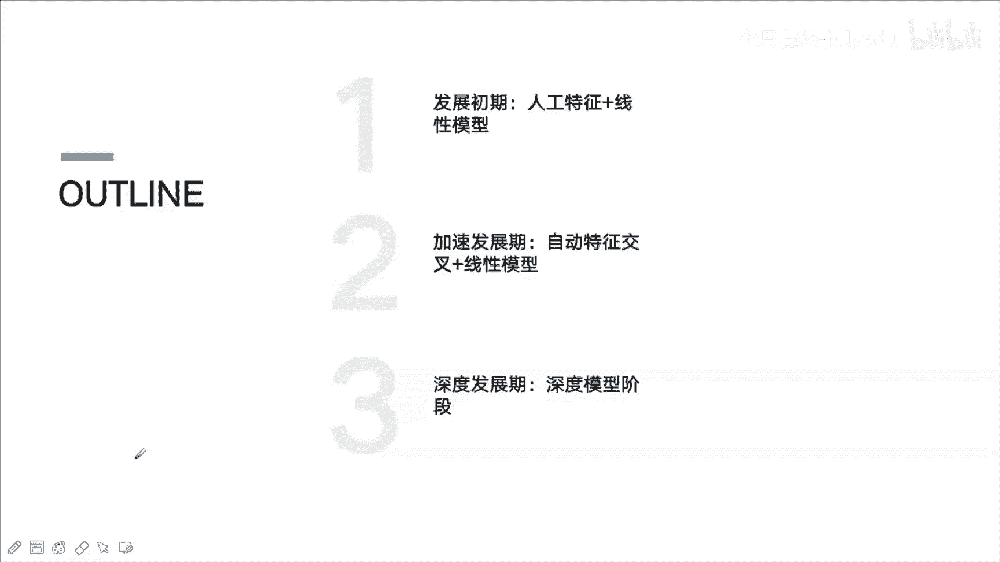
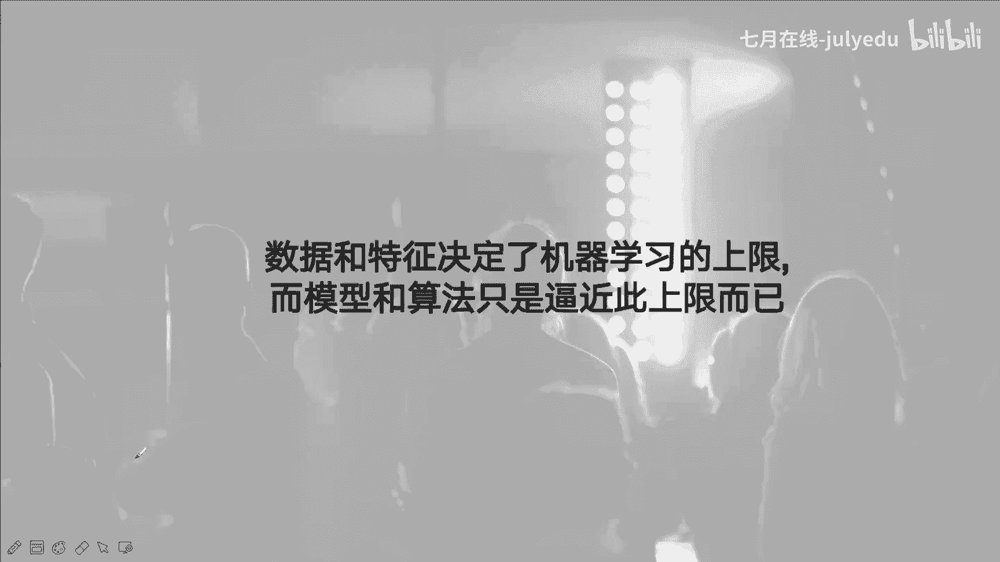
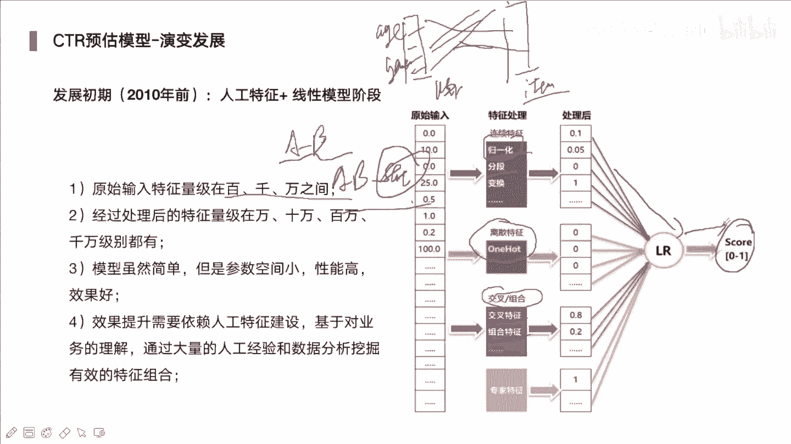
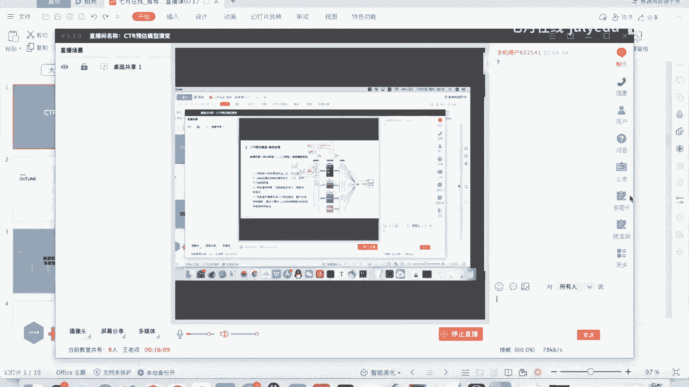
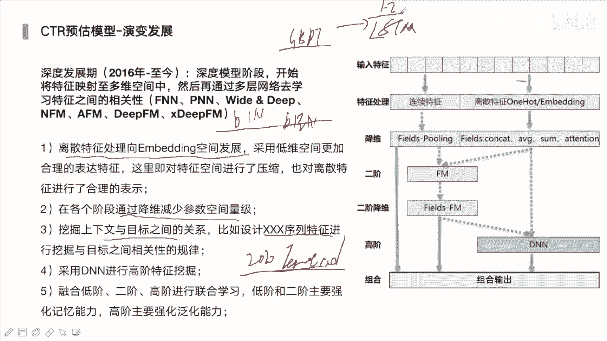
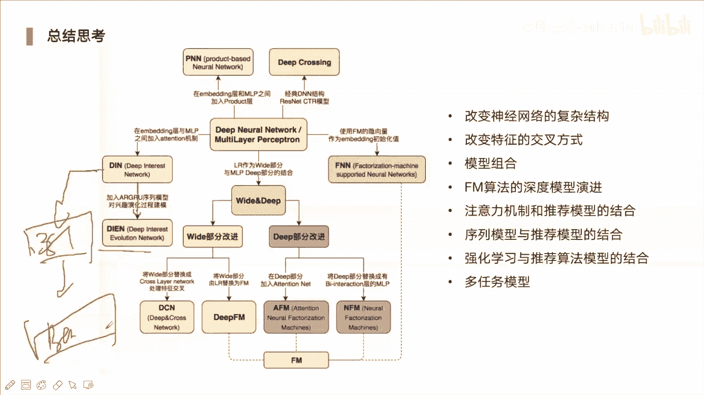
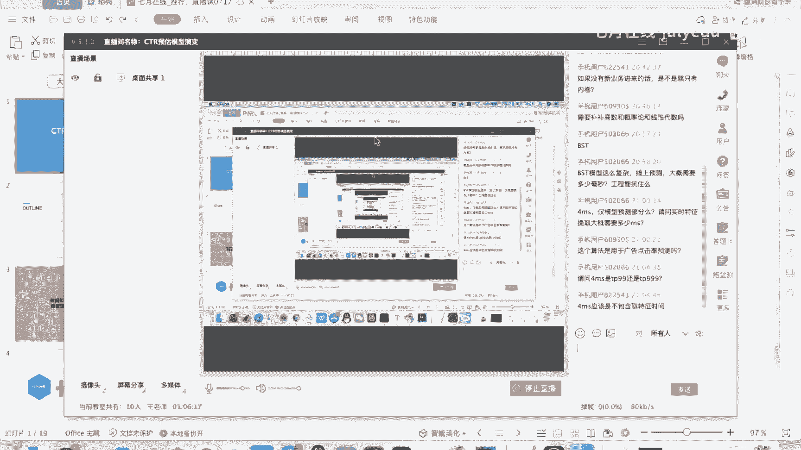

# 人工智能—推荐系统公开课（七月在线出品） - P10：CTR预估模型演变教程 📈

在本节课中，我们将要学习CTR（点击率）预估模型的演变历程。我们将从早期的简单线性模型开始，逐步深入到结合深度学习和注意力机制的复杂模型，了解其发展脉络、核心思想以及不同阶段模型的特点。

## 概述

CTR预估是推荐系统、在线广告等领域的核心技术，其目标在于预测用户点击某个物品（如商品、广告）的概率。模型的发展经历了从依赖人工特征工程到模型自动学习高阶交叉特征的演进过程。理解这一演变过程，有助于我们把握推荐系统技术的核心发展方向。

## 第一阶段：发展初期（人工特征 + 线性模型）

在深度学习发展相对缓慢的初期，CTR预估主要依赖于大量的人工构造特征和简单的线性模型，如逻辑回归（LR）。

这个阶段的核心思想是，由于模型本身（如LR）的学习能力有限，无法自动学习特征间的交互关系，因此需要算法工程师手动构造各种可能的特征组合，以帮助模型捕捉更多信息。

以下是该阶段的主要特点：

*   **模型简单**：主要使用逻辑回归等线性模型，复杂度低，但学习能力有限。
*   **特征工程繁重**：需要人工构造大量特征，包括一阶特征、二阶及更高阶的交叉特征、统计特征等。
*   **特征处理关键**：连续特征需要归一化或分桶；类别特征需要转换为One-Hot编码，这可能导致特征维度极高（如千万维）。
*   **流程固定**：经过复杂的特征构造和处理后，将特征输入LR模型，通过Sigmoid函数得到最终的点击率分数。

## 第二阶段：加速发展期（自动特征交叉）

随着业务发展，完全依赖人工构造特征变得效率低下且可能考虑不全。此阶段开始借助模型本身的能力来自动进行特征交叉，代表模型有因子分解机（FM）、域感知因子分解机（FFM）以及梯度提升树（GBDT）与LR的结合。

上一节我们介绍了完全依赖人工特征工程的阶段，本节中我们来看看如何利用模型自动学习特征交叉。

### 因子分解机（FM）与域感知因子分解机（FFM）

FM模型在线性模型的基础上，增加了特征二阶交叉项，能够有效捕获特征间的两两交互作用。

**FM模型公式**：
`ŷ = w₀ + Σᵢ wᵢ xᵢ + Σᵢ Σⱼ<ᵢ ⟨vᵢ, vⱼ⟩ xᵢ xⱼ`
其中，`⟨vᵢ, vⱼ⟩` 代表特征i和特征j的隐向量内积，用于建模二阶交叉。

FFM在FM的基础上引入了“域”的概念，认为特征在与不同域的特征交叉时，其重要性（权重）应该是不同的，从而进行了更精细的建模。

**FFM模型核心思想**：
特征i在与属于域fⱼ的特征j交叉时，使用特定的隐向量 `vᵢ, fⱼ`，而非FM中固定的 `vᵢ`。这增加了模型的表达能力，但也显著提高了计算复杂度和参数量。

### GBDT + LR 模型

该模型利用GBDT的非线性能力来自动进行特征组合与筛选，并将组合结果作为新的离散特征输入给LR模型。

以下是其工作原理：

1.  **GBDT生成特征**：样本输入GBDT（多棵树），最终会落到每棵树的某个叶子节点上。将样本在所有树上的叶子节点位置进行One-Hot编码，形成一个高维稀疏的01向量。
2.  **LR进行分类**：将这个由GBDT生成的01向量作为新的特征，输入到LR模型中进行最终的CTR预估。

这种结构尝试将树模型的强特征组合能力与线性模型的高效性相结合。

## 第三阶段：深度学习发展阶段

深度学习为CTR预估带来了革命性变化。模型不再局限于二阶交叉，可以学习更复杂的高阶非线性关系，并且能够自然地处理稀疏特征、序列特征等。

上一节我们介绍了利用传统机器学习模型进行自动特征交叉的方法，本节中我们进入当前的主流——深度学习模型阶段。

### 核心变化与方向

深度学习阶段的模型演变主要围绕以下几个方向展开：

*   **Embedding化**：将高维稀疏的类别特征通过Embedding层映射为低维稠密向量，这是深度学习处理推荐问题的基石。
*   **高阶特征交叉**：设计各种网络结构（如Deep & Cross Network）来自动学习显式或隐式的高阶特征组合。
*   **用户兴趣建模**：引入注意力（Attention）、序列模型（LSTM/GRU）、Transformer等结构，从用户历史行为序列中动态捕捉用户兴趣及其演化。

### 经典模型结构

以下是几种具有代表性的深度学习CTR模型结构：

**1. Wide & Deep / DeepFM**
这类模型通常采用并行的双路结构。
*   **Wide & Deep**：Wide部分（LR）负责记忆（memorization），Deep部分（深度神经网络）负责泛化（generalization）。
*   **DeepFM**：用FM替换了Wide部分，使其能自动学习二阶特征交叉，并与Deep部分共享Embedding输入。

**2. Deep & Cross Network (DCN)**
DCN专注于进行高效的高阶特征交叉。其Cross Network通过特殊的层叠公式，在每一层都与输入特征进行交叉，从而构造有限阶数的显式特征交叉。

**3. 深度兴趣网络（DIN）与深度兴趣进化网络（DIEN）**
这类模型专注于用户兴趣建模。
*   **DIN**：引入注意力机制，根据候选商品自适应地计算用户历史行为中每个商品的重要性权重，然后加权求和得到用户兴趣表示。
*   **DIEN**：在DIN基础上，进一步使用GRU等序列模型来模拟用户兴趣随时间的演化过程，捕捉兴趣的动态变化。

**4. Behavior Sequence Transformer (BST)**
BST利用Transformer架构来建模用户行为序列。通过Transformer中的自注意力机制，可以更好地捕捉行为序列中长距离的依赖关系，并理解不同行为之间的复杂交互。

### 前沿发展与挑战

当前，CTR预估模型仍在快速发展，趋势包括：
*   **多任务学习**：如MMOE、PLE模型，同时优化点击率、转化率等多个目标。
*   **实时性**：模型更新频率从天级别向小时级、分钟级演进（Online Learning）。
*   **预训练大模型**：探索将BERT等预训练大模型思想应用于推荐（如BERT4Rec）。
*   **图神经网络**：结合知识图谱（KG）解决冷启动等问题。

这些发展使得模型越来越复杂，但也对工程实现、线上服务性能（如要求推理在毫秒级完成）提出了严峻挑战。

## 总结

本节课我们一起学习了CTR预估模型的演变历程。我们从依赖**人工特征工程**的线性模型出发，经历了借助**FM、GBDT**等模型进行**自动特征交叉**的阶段，最终进入到以**深度学习**为核心的现代模型阶段。现代模型通过**Embedding**、**复杂网络结构**（如DCN、Transformer）和**注意力机制**，能够自动学习高阶特征交互并动态捕捉用户兴趣。理解这一演变路径，不仅有助于我们掌握现有技术，更能为我们紧跟前沿（如多任务学习、大模型推荐）奠定坚实的基础。在实际工作中，模型选择需综合考虑业务场景、数据特点、性能要求与可解释性等因素。