# 人工智能—推荐系统公开课（七月在线出品） - P11：手把手带你挖掘电商用户行为 👨‍💻


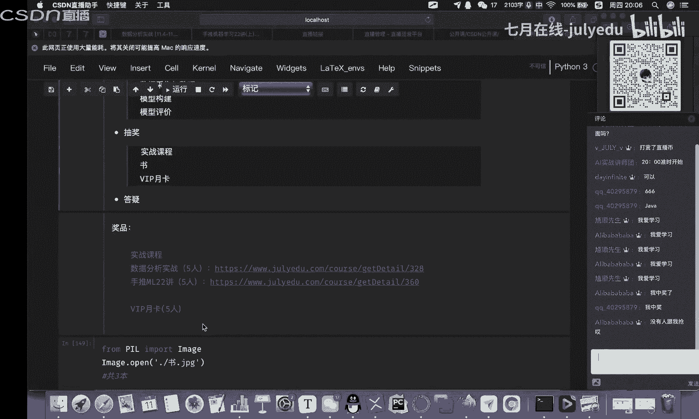

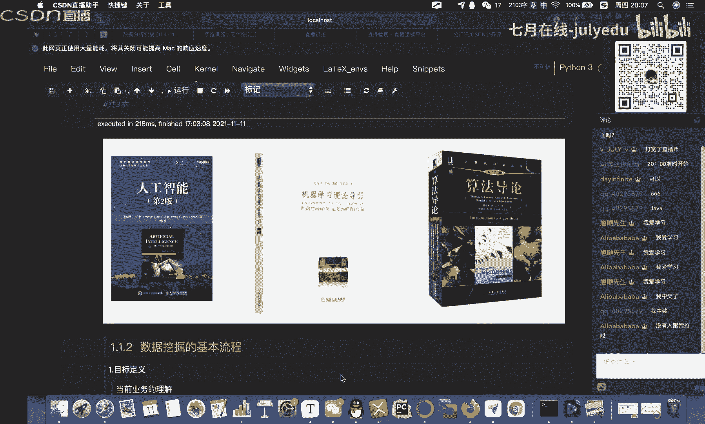

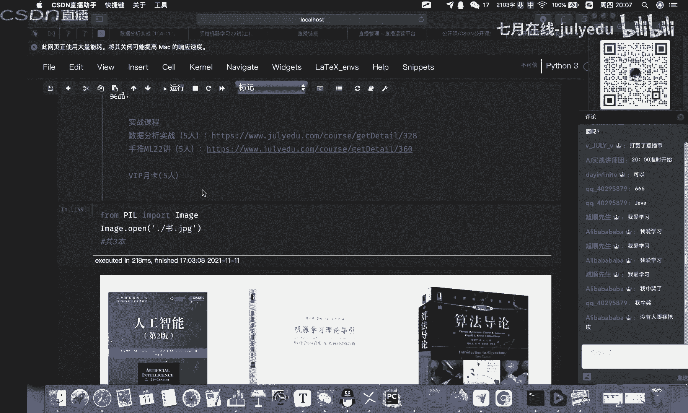

在本节课中，我们将学习如何对一个电商平台的用户行为数据进行完整的分析和挖掘。我们将遵循数据挖掘的标准流程，从目标定义、数据探索、特征工程到模型构建与评估，一步步完成一个预测用户购买行为的项目。

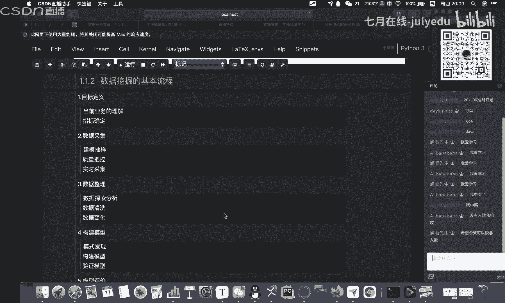

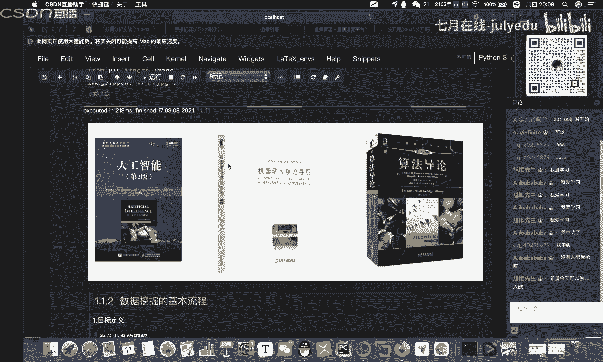

## 概述：数据挖掘的基本流程 📊

上一节我们介绍了课程背景，本节中我们来看看数据挖掘的标准流程。数据挖掘是从大量数据中总结泛化规律的过程，其核心流程通常包括以下几个步骤：

1.  **目标定义**：明确本次数据挖掘要解决的具体业务问题。
2.  **数据采集**：从业务系统中抽取与目标相关的样本数据子集。
3.  **数据整理**：对数据进行探索性分析、清洗和预处理。
4.  **模型构建**：根据问题类型选择合适的算法构建预测模型。
5.  **模型评价**：使用预定的标准评估模型性能，并进行优化。
6.  **模型发布**：将模型部署上线，并持续监控和维护。

这个流程并非单向的，在实际工作中可能需要反复迭代和探索。

## 项目背景与目标 🎯

上一节我们梳理了通用流程，本节中我们来看看具体的项目背景。电商平台竞争激烈，掌握用户行为、实现精准营销至关重要。本项目基于一份真实的电商用户行为数据集，包含用户的点击、收藏、加购、购买四种行为。

我们的挖掘目标是：**预测在下一个时间日期，用户对特定商品子集的购买情况**。这是一个典型的二分类预测问题（买或不买）。

模型的评估标准采用 **F1分数**，它是精确率（Precision）和召回率（Recall）的调和平均数，能综合衡量模型的性能。其公式如下：

**F1 = 2 * (Precision * Recall) / (Precision + Recall)**

## 数据采集与整理 🧹

明确了目标后，我们开始处理数据。首先使用Pandas读取数据文件，并查看数据的基本概况。

```python
import pandas as pd
df = pd.read_csv('user.csv')
df.head()
df.info()
```

数据包含用户ID、商品ID、行为类型、商品类目、时间戳等字段。其中“地理位置”字段存在大量空值且对目标预测帮助不大，我们将其删除。

```python
df = df.drop(columns=['地理位置'], axis=1) # axis=1表示按列删除
```

检查缺失值后发现数据质量很好，没有缺失。接着，我们将用数字编码的“行为类型”转换为可读的标签，并将“时间戳”拆分为“日期”、“具体时间”和“星期几”，以便进行更细致的时间维度分析。

```python
# 行为类型映射
behavior_map = {1: ‘点击‘, 2: ‘收藏‘, 3: ‘加购‘, 4: ‘购买‘}
df[‘行为类型‘] = df[‘行为类型‘].map(behavior_map)

# 拆分时间戳
df[‘日期‘] = df[‘时间戳‘].apply(lambda x: x.split(‘ ‘)[0])
df[‘具体时间‘] = df[‘时间戳‘].apply(lambda x: x.split(‘ ‘)[1])
df[‘星期几‘] = pd.to_datetime(df[‘日期‘]).dt.dayofweek
```

## 数据分析与可视化 📈

数据预处理完成后，我们进入探索性数据分析阶段，从多个维度洞察用户行为。

以下是几个关键的分析方向：

*   **用户流量分析**：分析页面浏览量（PV）和独立访客数（UV）随时间（如按日、按月）的变化趋势。例如，通过图表可以发现“双十二”活动期间PV和UV出现显著峰值。
*   **用户消费行为分析**：
    *   **时间习惯**：分析用户一天中不同时间段的活跃度。通常会发现用户活跃高峰与休息时间（如晚间）重合。
    *   **行为转化**：绘制从“点击”到“加购/收藏”，再到“购买”的转化漏斗图。通常点击到购买的转化率较低。
    *   **复购分析**：统计在一个月内购买超过一次的用户比例。
*   **商品销售分析**：统计热销商品、分析商品销售分布等。
*   **用户价值分析**：使用**RFM模型**或其他方法对用户进行分类（如高价值用户、发展期用户、保持用户、流失用户），并制定差异化运营策略。

这些分析主要通过Pandas进行数据聚合和统计，并借助Matplotlib或Seaborn库进行可视化呈现。

## 模型构建与评估 🤖

数据分析为我们提供了深刻的业务洞察，本节中我们基于这些洞察来构建预测模型。整个过程分为三步：构建数据集、特征工程和模型训练。

**1. 构建数据集**
首先需要划分训练集和测试集，通常按8:2的比例划分。

```python
from sklearn.model_selection import train_test_split
X_train, X_test, y_train, y_test = train_test_split(features, label, test_size=0.2, random_state=42)
```

**2. 特征工程**
特征质量直接决定模型效果。我们可以从原始数据中构建多种类型的特征：

*   **统计类特征**：用户历史购买次数、点击次数、最近一次购买时间间隔等。
*   **比率类特征**：用户购买点击比、加购点击比等。
*   **类别特征**：商品类目、用户年龄段（需从其他数据衍生）等。
*   **交叉特征**：用户对特定商品类目的偏好程度。

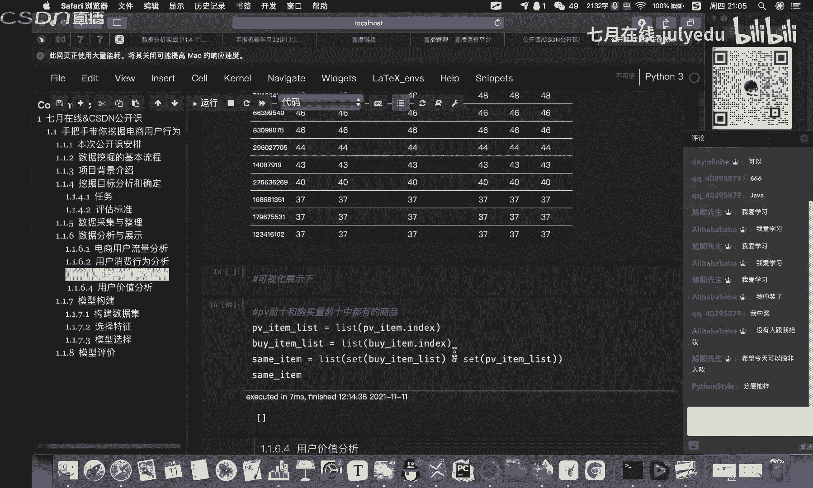

**3. 模型选择与训练**
我们选择两个经典模型进行尝试和对比：逻辑回归（LR）和梯度提升树（GBDT）。

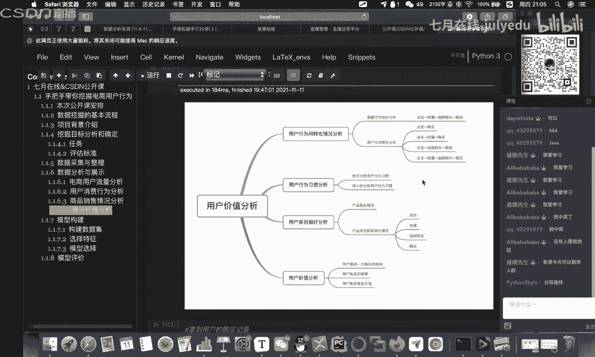

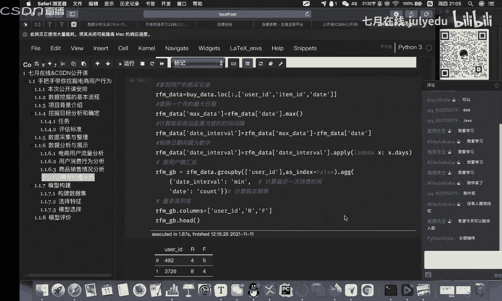

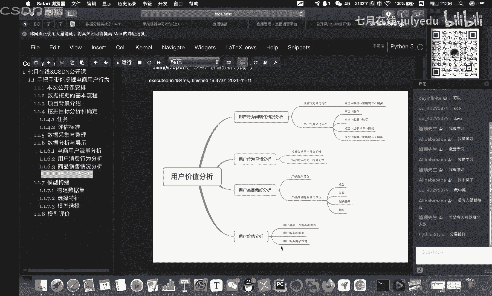

```python
from sklearn.linear_model import LogisticRegression
from sklearn.ensemble import GradientBoostingClassifier

model_lr = LogisticRegression()
model_gbdt = GradientBoostingClassifier()

model_lr.fit(X_train, y_train)
model_gbdt.fit(X_train, y_train)
```

**4. 模型评估**
使用之前定义的F1分数对两个模型在测试集上的表现进行评估。

```python
from sklearn.metrics import f1_score
y_pred_lr = model_lr.predict(X_test)
y_pred_gbdt = model_gbdt.predict(X_test)

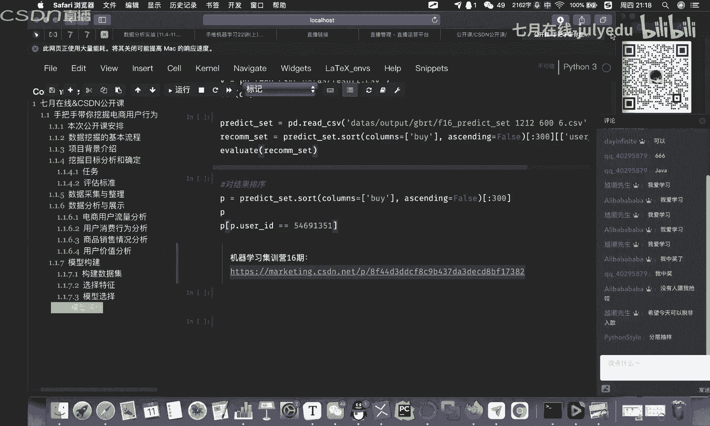

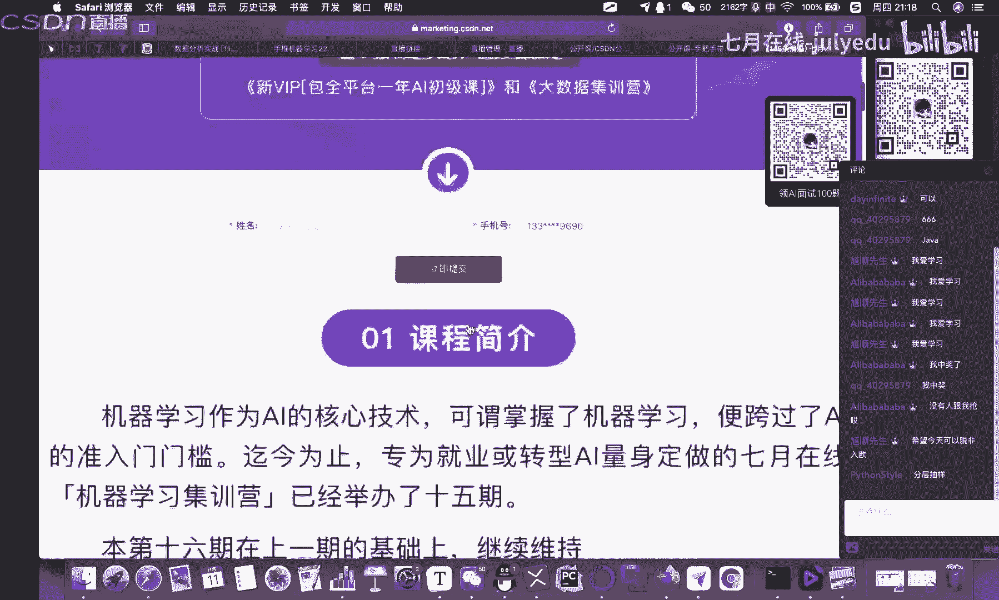

f1_lr = f1_score(y_test, y_pred_lr)
f1_gbdt = f1_score(y_test, y_pred_gbdt)
print(f“逻辑回归 F1分数： {f1_lr:.4f}“)
print(f“GBDT F1分数： {f1_gbdt:.4f}“)
```

根据F1分数选择性能更优的模型，并可以进一步进行模型调优。

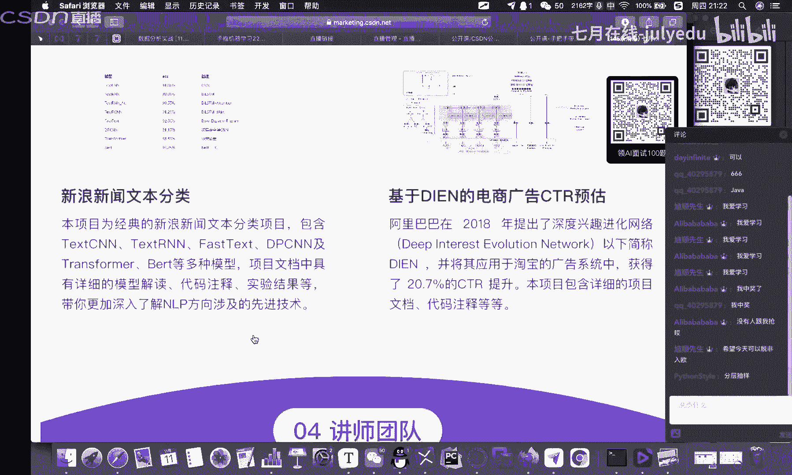

## 总结 🎓

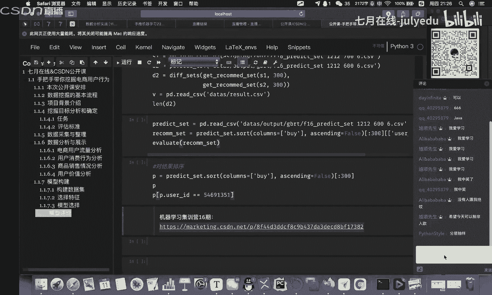

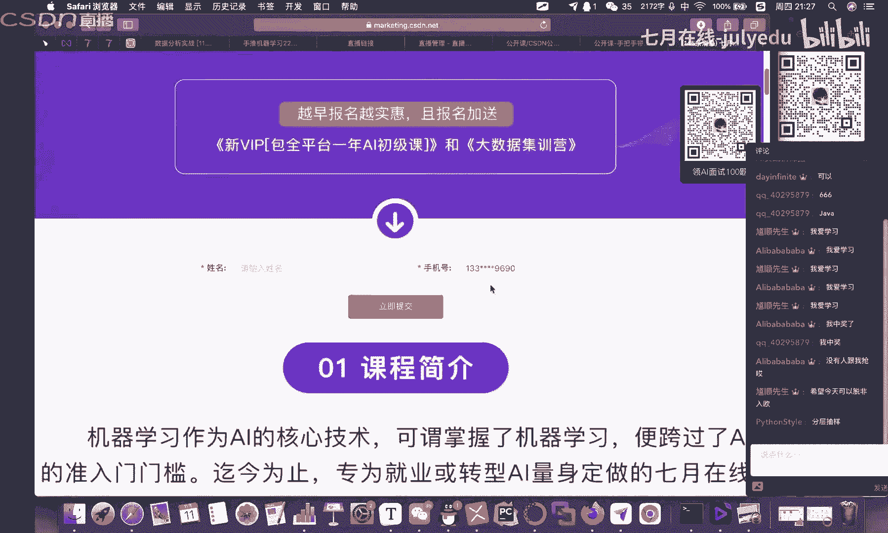

本节课中我们一起学习了电商用户行为数据挖掘的完整流程。我们从定义预测目标开始，经历了数据读取、清洗、探索性分析，并基于业务理解构建特征，最终使用机器学习模型进行预测和评估。

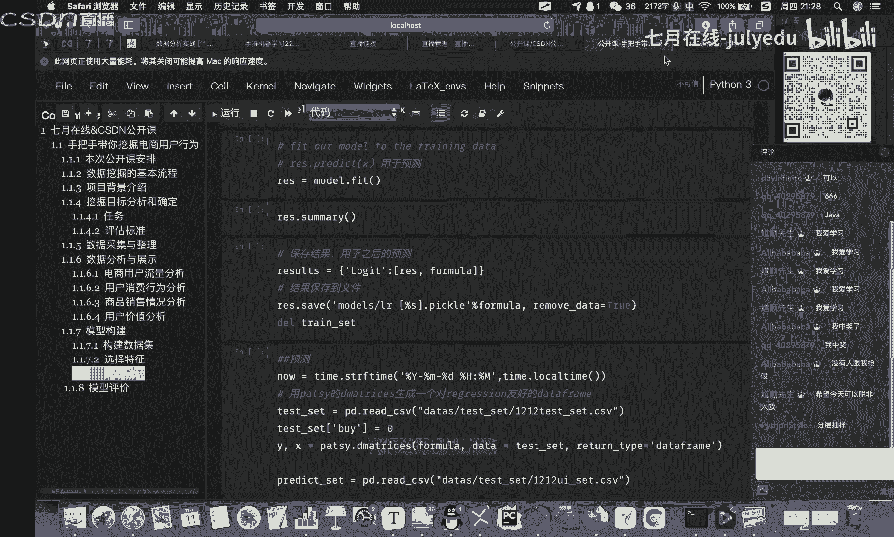

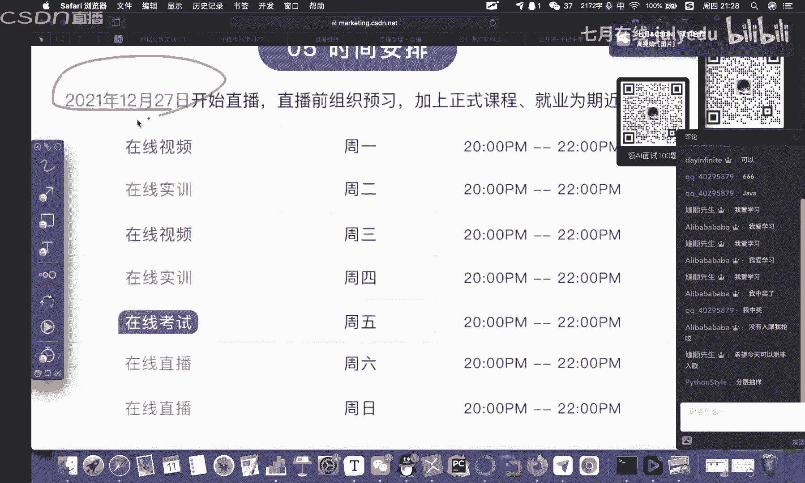


整个项目的核心在于：**理解业务逻辑比单纯调用模型代码更重要**。数据挖掘是一个业务驱动、反复迭代的过程，扎实的数据分析能力和清晰的业务思维是成功的关键。希望本教程能帮助你建立起数据挖掘的系统性认知。