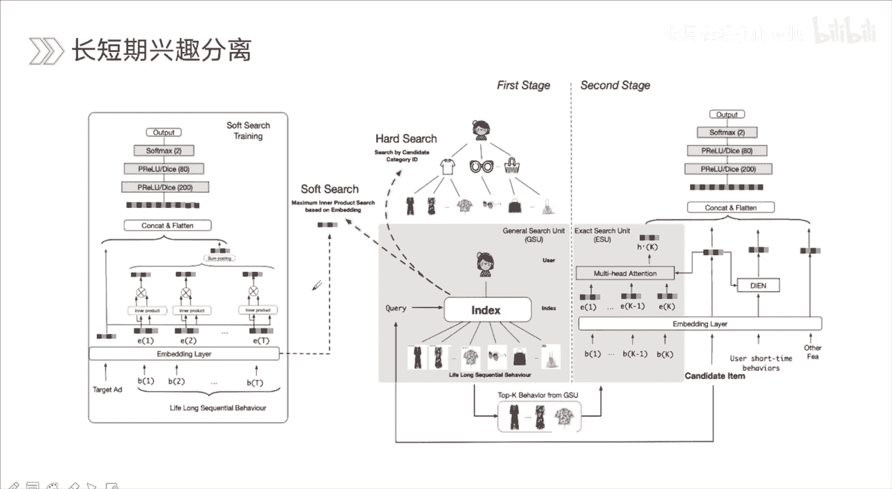
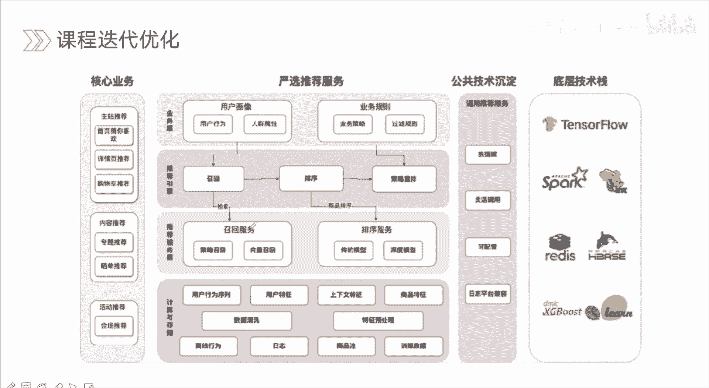
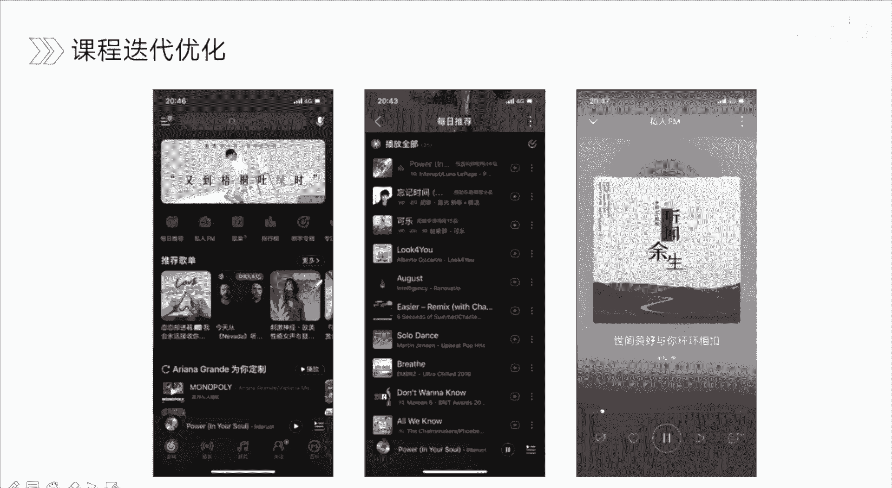

# 人工智能—推荐系统公开课（七月在线出品） - P12：排序算法发展趋势 📈

在本节课中，我们将学习点击率预估模型的最新发展趋势。点击率预估是推荐系统中的核心环节，负责对召回的商品进行精准排序，以提升用户体验和平台收益。

## 概述

点击率预估不仅指点击行为的预测，也泛指转化率、下载率等类似场景的预估。虽然具体场景的决策点和数据稀疏程度不同，但核心模型与算法是相通的。当前，CTR预估的发展主要围绕四个方向展开：特征交互组合、特征抽取优化、多模态融合以及长短期兴趣建模。我们将逐一探讨这些方向的核心思想与代表性工作。

## 特征交互组合 🤝

上一节我们概述了CTR预估的四个发展方向，本节中我们来看看第一个方向：特征交互组合。该方向关注模型如何捕捉特征间深层、复杂的交互信息，从早期的简单模型到如今的高阶交叉模型，其演进体现了对特征关系理解的深化。

以下是两组代表性的特征交互模型：

*   **浅层交互模型**：如FM、FFM。这类模型主要捕捉二阶特征交叉。FM为所有特征域交叉分配相同权重，而FFM进一步细化了不同特征域间交叉的权重差异。
*   **深层交互模型**：如DeepFM、DCN。这类模型通常结合深度神经网络来捕捉隐式高阶特征交互。例如，DCN通过其交叉网络显式地进行特征交叉，交叉阶数可人为设定，其核心操作遵循公式：**x_{l+1} = x_0 * x_l^T * w_l + b_l + x_l**。

目前，基于特征交互的模型大致可分为三类：

1.  **聚合用户历史行为序列**：通过注意力机制等加权方式，聚合用户行为序列信息，使其与候选商品进行交互，例如经典的DIN模型。
2.  **基于图结构的方法**：将特征视为图节点，通过图神经网络进行信息传播与聚合，例如GCN、GraphSAGE等模型在图推荐中的应用。
3.  **显式特征组合**：直接建模特征间的显式交叉，如前述的FM、DeepFM、DCN等模型。

以阿里的CAN模型为例，其核心是Co-Action Unit。该单元将用户历史行为序列中的每个商品与目标商品进行交互，同时也将用户属性（如年龄）与目标商品交互。其内部是一个多层感知机，通过将用户和商品的特征向量拆分并逐层交互，最终输出交叉信息，再与深度网络部分结合，共同进行CTR预估。

## 特征抽取优化 🔍

在了解了特征如何交互后，我们来看看如何从原始数据中更有效地抽取特征。不同的特征抽取器适用于不同的输入类型，能提取出不同层次的信息。

以下是几种核心的特征抽取器及其应用：

*   **Transformer**：核心是Multi-Head Self-Attention机制。它能并行处理序列中所有元素间的交互，捕捉全局依赖关系。其基本操作包括多头注意力计算和前馈神经网络。
*   **RNN**：适合处理序列数据，通过隐藏状态传递历史信息，最终输出对整个序列的表示，但属于串行计算。
*   **CNN**：可通过一维卷积从序列或文本中提取局部特征模式。

具体到CTR模型，BST模型利用Transformer层来处理用户行为序列与目标商品，捕捉其间的交互信息。而BERT4Rec模型则将NLP中的BERT架构引入推荐，用于序列推荐，它能进行双向的上下文编码，比传统的单向RNN更能充分理解用户行为序列的上下文信息。不过，考虑到线上推理的耗时，工业界通常会采用层数较浅的Transformer变体。

## 多模态融合 🖼️📝

现实世界中的信息是多元的。本节我们探讨如何将文本、图像、视频等多模态信息融合到推荐模型中，以更全面地理解用户和商品。

多模态信息主要包含以下几类：

1.  **人工特征**：用户/商品ID、统计特征等。
2.  **文本特征**：搜索Query、商品标题、描述、评论等。
3.  **用户行为特征**：用户点击、购买序列，社交关系图等。
4.  **图像/视频特征**：商品主图、宣传视频帧等。
5.  **音频特征**：音乐、语音描述等。

以图像特征为例，京东的CSCCN模型研究了如何将商品图像信息有效引入CTR预估。与离线预训练图像特征再接入模型不同，CSCCN将CNN结构嵌入到端到端的CTR模型中进行联合训练，使图像特征的优化目标与点击率目标一致，避免了目标偏差。

另一种思路是利用知识图谱。例如，通过图注意力网络聚合知识图谱中实体的多跳关联属性信息，更新实体嵌入，再输入推荐模型。这种方法能有效缓解新品（冷启动）推荐问题，因为可以通过其品牌、类别等属性信息进行推断。

## 长短期兴趣建模 ⏳⚡

用户的兴趣是动态变化的，既有稳定的长期偏好，也有易变的短期意图。本节我们学习如何对这两种兴趣分别进行建模。

兴趣建模的演进路径如下：

*   **Pooling/DIN**：早期采用平均池化或最大池化聚合用户行为序列，视为一视同仁。DIN引入注意力机制，根据候选商品动态加权历史行为，但未考虑兴趣随时间演化的趋势。
*   **DIEN**：在DIN基础上，引入GRU等序列模型来模拟用户兴趣的演化过程，捕捉兴趣的动态变化。
*   **MIMN**：首次将用户行为序列建模长度扩展到千级别，并将其编码到固定大小的记忆网络中，但可能引入大量噪声行为信息。
*   **SIM**：通过“搜索”机制（如软搜索）从超长行为序列中检索出与当前候选商品最相关的部分行为子序列，再进行建模，有效过滤了噪声，聚焦于长期兴趣中的关键信息。

## 总结

本节课我们一起学习了CTR预估模型的四大发展趋势：**特征交互组合**致力于挖掘特征间深层次关系；**特征抽取优化**利用更强大的网络结构（如Transformer）从原始数据中提取有效信息；**多模态融合**将图像、文本等多源信息纳入模型，提供更丰富的决策依据；**长短期兴趣建模**区分并分别建模用户稳定和动态变化的兴趣。理解这些趋势，有助于把握推荐系统前沿，并设计出更强大的排序模型。