# 人工智能—推荐系统公开课（七月在线出品） - P13：【公开课】快速入门推荐系统串讲

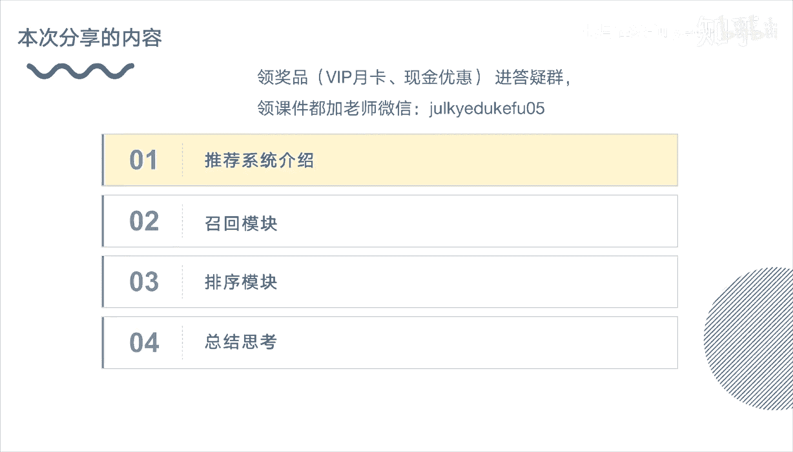

## 概述

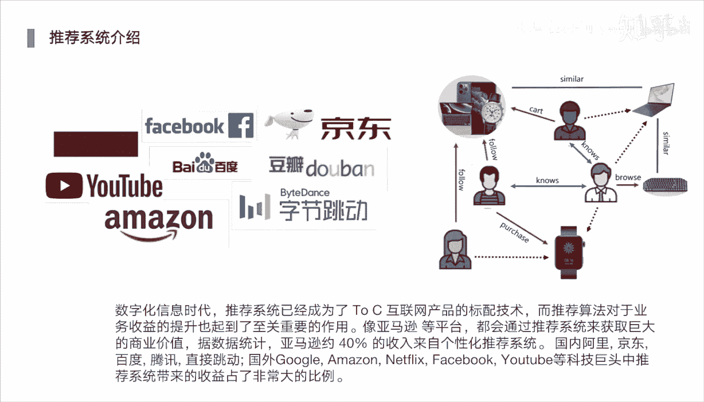

在本节课中，我们将快速入门推荐系统，了解其核心流程与关键技术。课程将围绕推荐系统的两大核心模块——召回与排序展开，介绍其基本概念、经典算法与发展脉络，帮助初学者建立对推荐系统的整体认知。

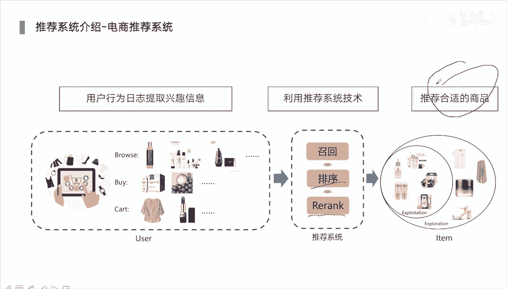

## 推荐系统介绍

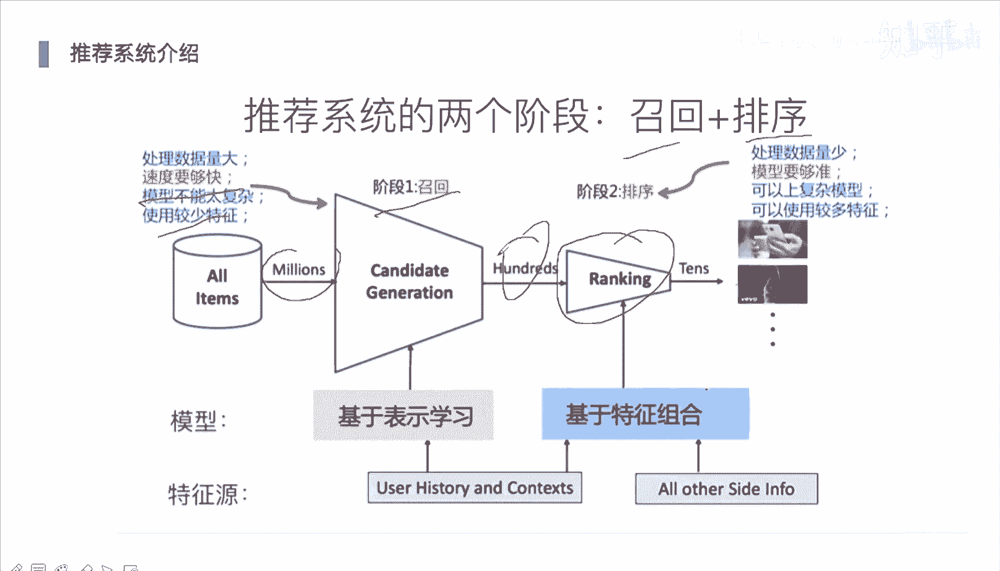

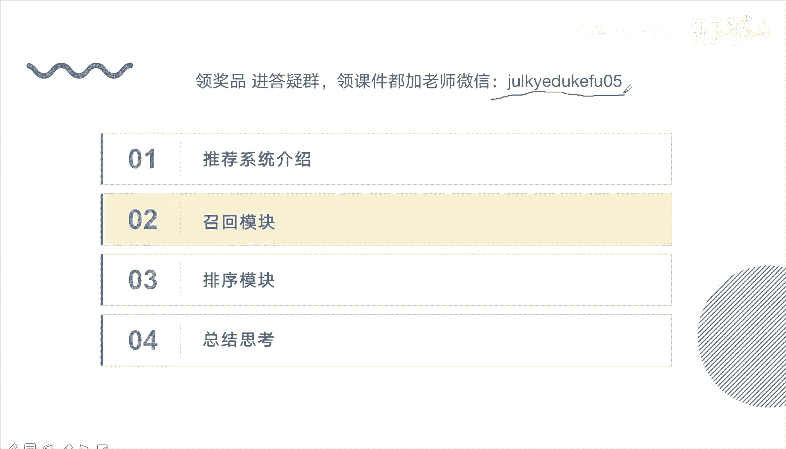

推荐系统是当前互联网产品中的核心组成部分，广泛应用于抖音、京东、YouTube等平台。它通过分析用户的历史行为数据，理解用户兴趣，从而为用户精准推送内容。对于大型互联网公司而言，推荐系统是重要的收入来源，其性能的微小提升都可能带来巨大的商业价值。

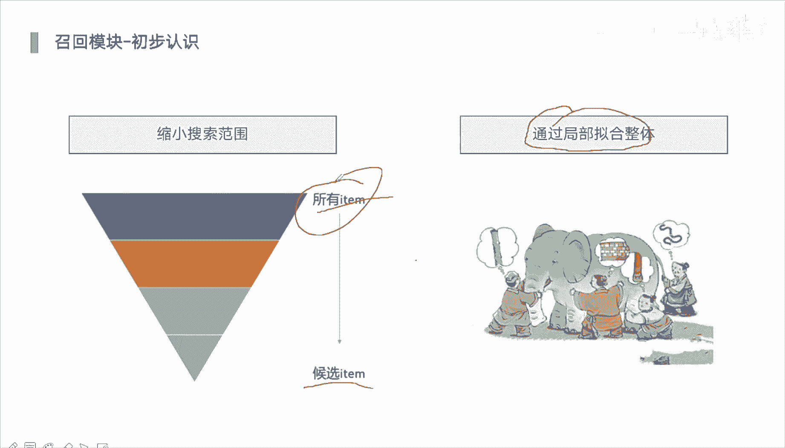

推荐系统的整体工作流程通常包含以下几个步骤：

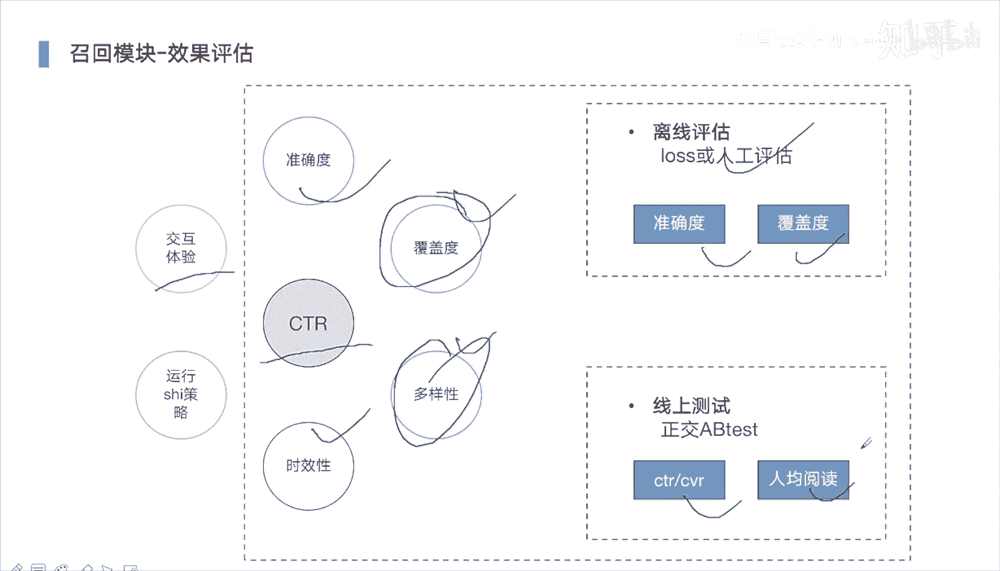

1.  **数据**：系统的基础是用户与平台产生的各种交互日志数据，例如浏览、点击、加购、购买等行为。
2.  **召回**：从海量（如百万或上亿）的商品或内容库中，快速筛选出数百或数千个可能与用户相关的候选集。
3.  **排序**：对召回得到的候选集，利用更复杂的模型和丰富的特征进行精细打分与排序，预测用户对每个候选项目的偏好概率。
4.  **重排与展示**：对排序后的结果进行多样性、新鲜度等策略调整，最终组合成展示给用户的列表。

召回阶段处理数据量巨大，要求速度快、模型相对简单。排序阶段则使用更复杂的模型和更多特征进行精准预测。

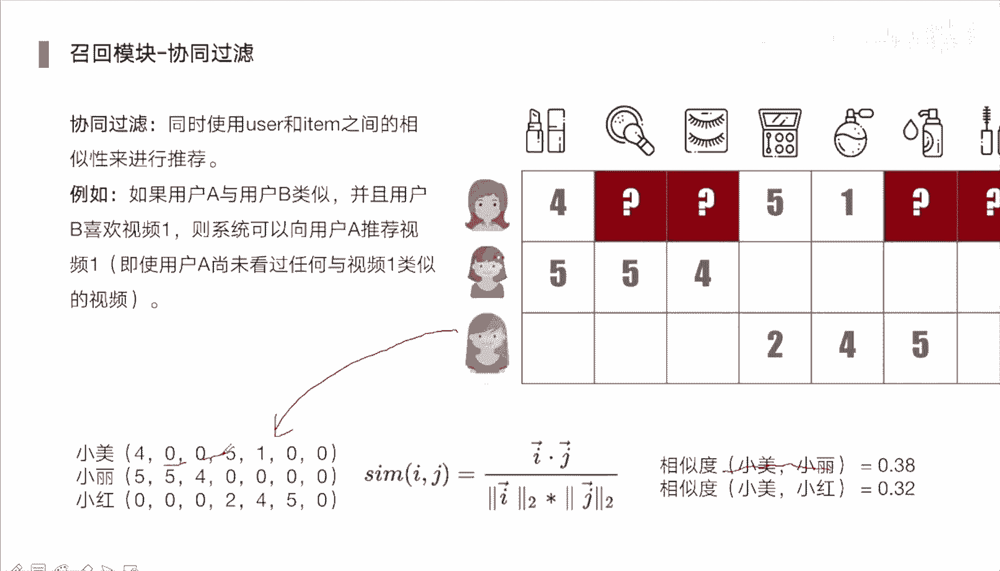

## 召回模块

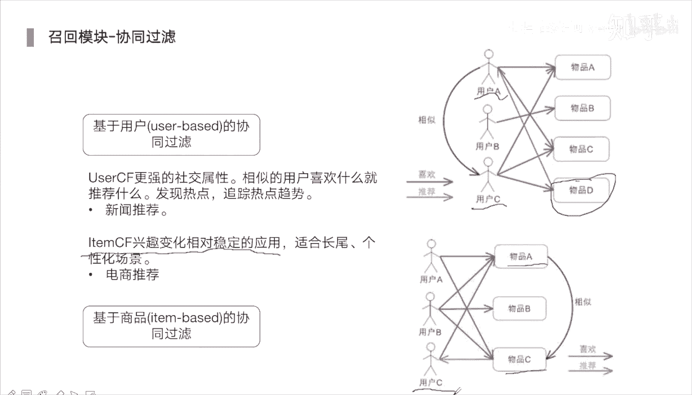

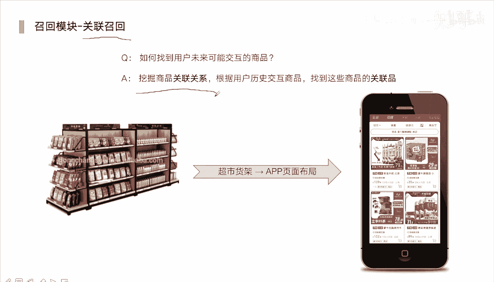

上一节我们介绍了推荐系统的整体流程，本节中我们来看看流程的第一步——召回模块。召回的核心任务是从全量物品库中快速缩小筛选范围，其设计理念类似于“盲人摸象”，需要从多个角度、采用多种策略来覆盖用户可能感兴趣的不同方面，避免兴趣单一化。

评估召回效果时，除了准确度，还需考虑覆盖度、多样性、时效性等指标，并通过离线评估（如损失函数、覆盖度）和线上测试（如点击率CTR）来综合衡量。

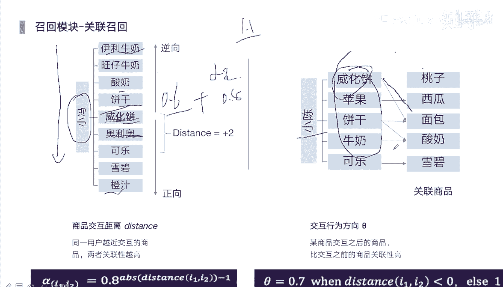

以下是召回模块中一些经典的方法与模型：

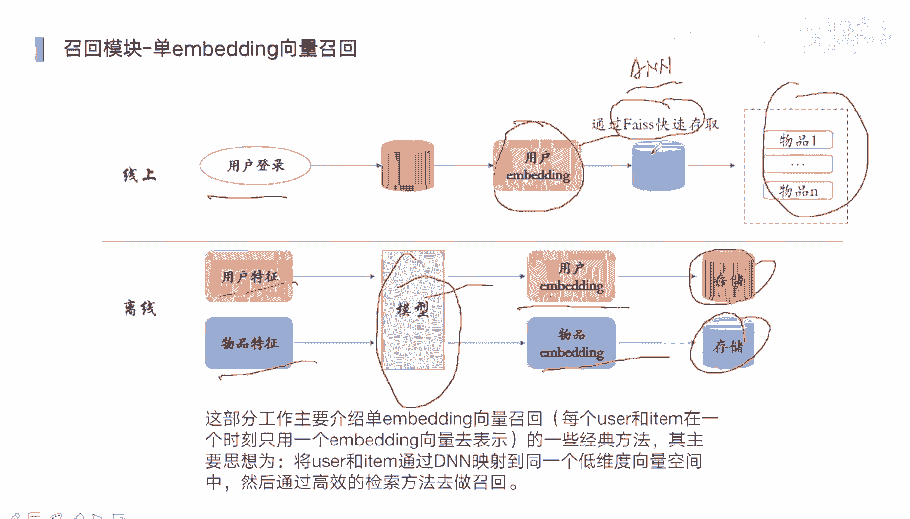

### 1. 协同过滤
协同过滤通过分析用户与物品之间的相似性进行推荐。其核心公式是计算用户或物品之间的相似度。例如，用户协同过滤的相似度计算可表示为：
`sim(u, v) = cosine(user_embedding_u, user_embedding_v)`
若用户A与用户B相似，且用户B喜欢物品I，则可将物品I推荐给用户A。

*   **UserCF**：核心是找到相似的用户。适用于社交属性强的平台（如微信视频号），将好友喜欢的内容推荐给用户。
*   **ItemCF**：核心是找到相似的物品。适用于物品属性稳定的场景（如电商），根据用户历史喜欢的物品，推荐与之相似的物品。

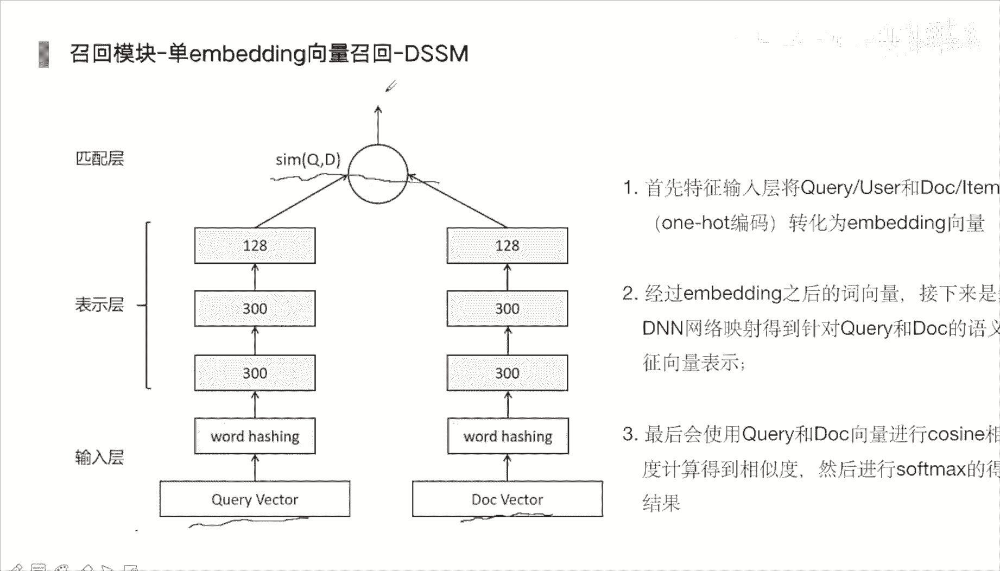

### 2. 关联规则召回
通过挖掘用户行为序列中物品之间的关联关系进行召回。例如，用户购买了啤酒后经常购买尿布，则两者具有强关联性。关联性的打分会考虑时间衰减和方向性（如购买手机后买手机壳是强正向关联）。

### 3. 向量化召回
将用户和物品映射到向量空间，通过计算向量相似度进行召回。

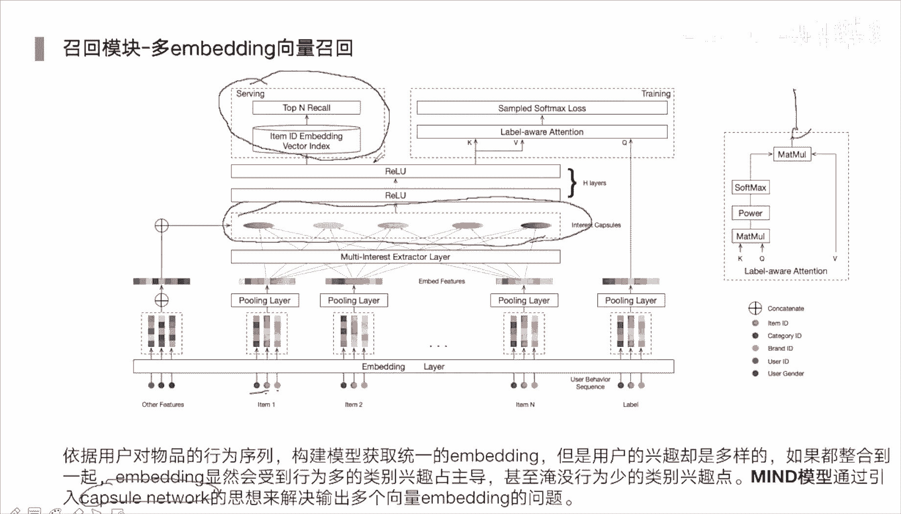

*   **Youtube DNN**：经典的双塔模型。离线训练模型，得到所有视频的向量并存储；线上实时计算用户向量，通过近似最近邻搜索快速找到最相似的视频。
*   **DSSM**：深度语义匹配模型，同样采用双塔结构，分别学习用户侧（Query）和物品侧（Document）的向量表示，通过计算余弦相似度或内积进行匹配。
*   **MIND（多兴趣网络）**：为了解决用户兴趣多样性的问题，利用胶囊网络从用户行为序列中提取多个兴趣向量，每个兴趣向量可以独立进行召回。

### 4. 基于图的召回
将用户和物品视为图中的节点，交互行为视为边，构建异构图。通过随机游走生成序列，再使用Word2Vec等方法学习节点（即用户或物品）的向量表示。**EGES** 算法是该方向的经典模型，它通过引入物品的边信息（如品类、品牌）来增强向量表示，缓解冷启动问题。

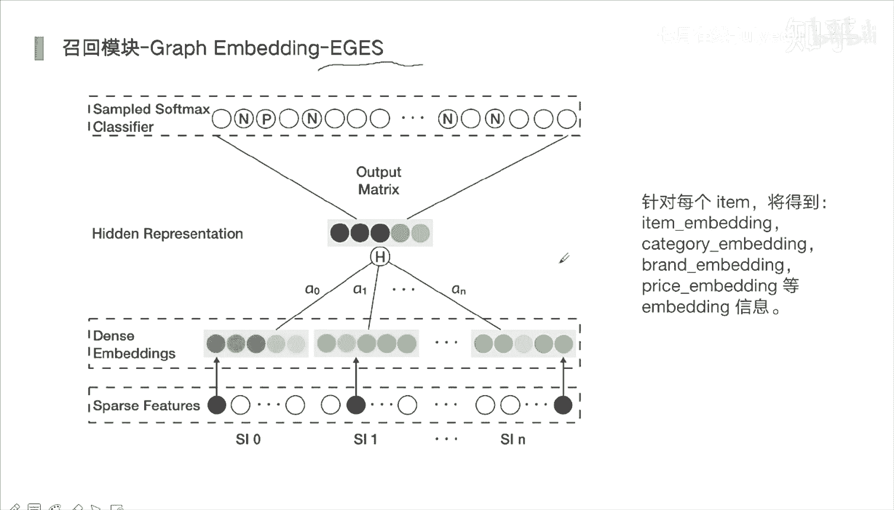

### 5. 基于知识图谱的召回
利用知识图谱中丰富的实体属性和关系进行召回。特别适用于解决新品冷启动和时效性热点问题。例如，新上市的手机在历史行为数据中很少，但通过知识图谱可以关联到其品牌、品类等已有信息，从而进行有效推荐。

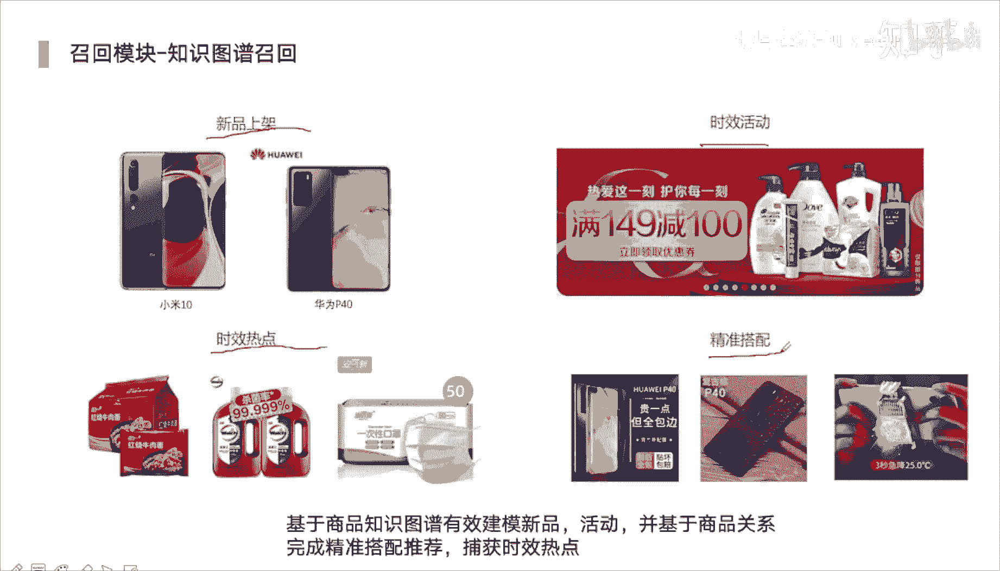

## 排序模块

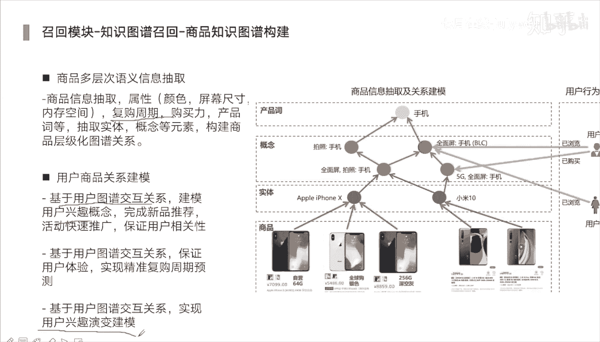

在召回模块为我们筛选出候选集之后，排序模块的任务是对这些候选进行精准打分与排序。排序模型的发展经历了从人工特征工程到自动化、深度学习化的演进。

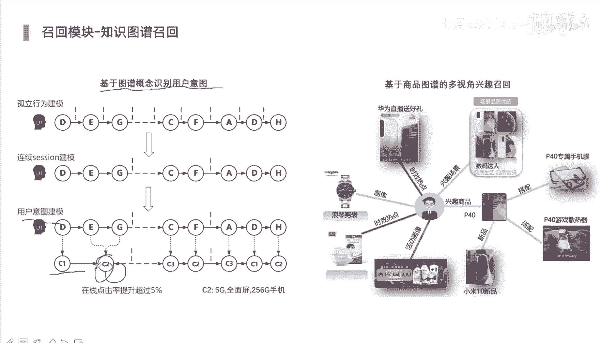

以下是排序模型发展的几个关键阶段及其代表模型：

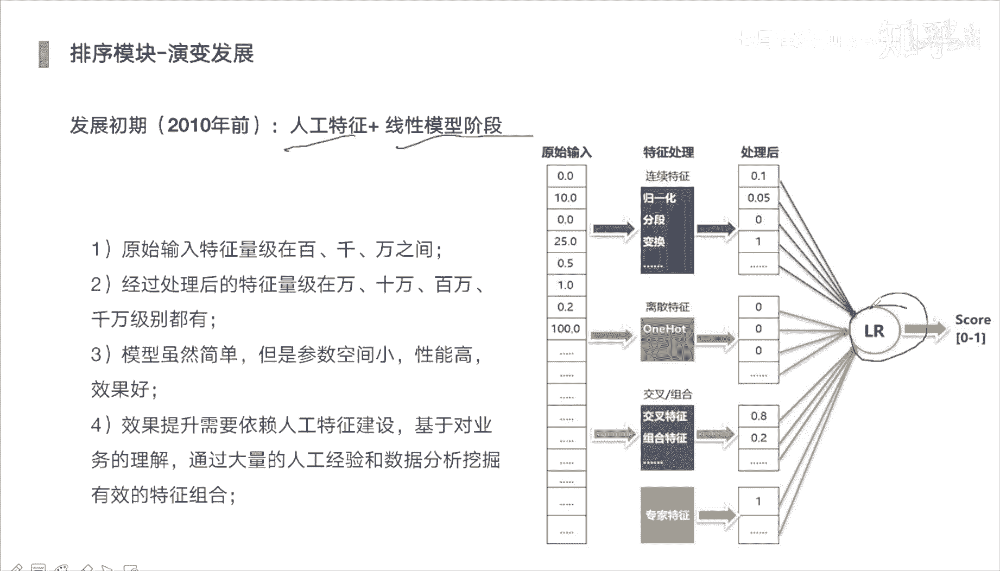

### 1. 发展初期：人工特征 + 线性模型
早期主要依赖人工构建的大量特征，结合逻辑回归等线性模型进行预测。模型公式简单，但特征工程负担重，且难以捕捉复杂的特征交叉关系。

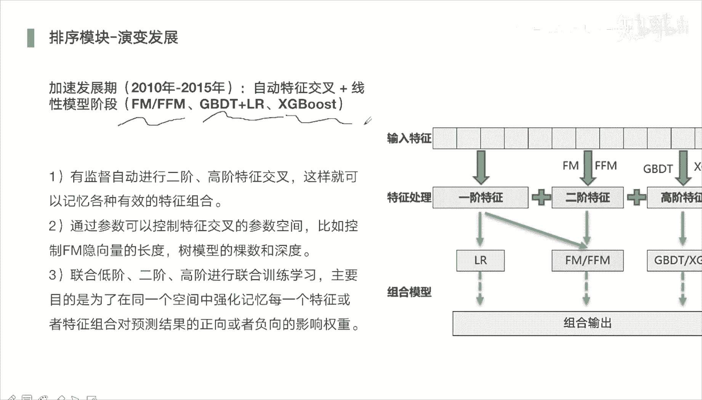

### 2. 加速发展：自动化特征交叉模型
模型开始具备自动学习特征交叉的能力。

*   **FM（因子分解机）**：在LR的基础上增加了二阶特征交叉项，能自动学习特征间的组合关系。其预测公式为：
    `ŷ = w0 + Σwi*xi + ΣΣ <vi, vj> * xi * xj`
*   **FFM（场感知因子分解机）**：在FM基础上引入“场”的概念，同一特征在与不同场的特征交叉时使用不同的隐向量，建模更细致，但参数量大。
*   **GBDT+LR**：Facebook提出的经典模型。利用GBDT进行自动特征组合与转换，将样本落在每棵树的叶子节点编号构成新的离散特征向量，再输入LR进行训练。这相当于利用树模型进行了高阶特征交叉。

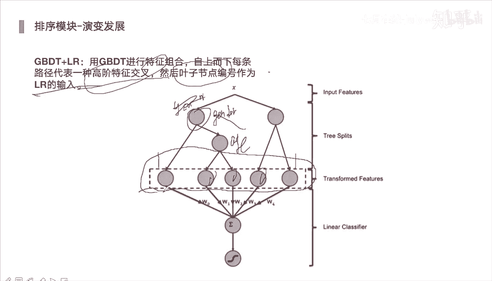

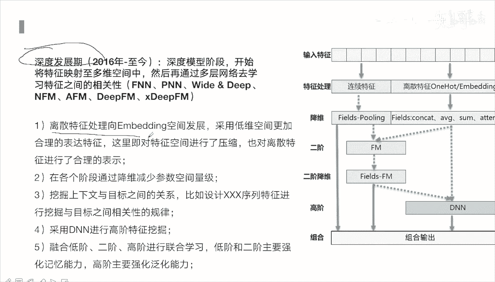

### 3. 深度发展：深度学习模型
利用深度神经网络强大的非线性拟合能力进行排序。

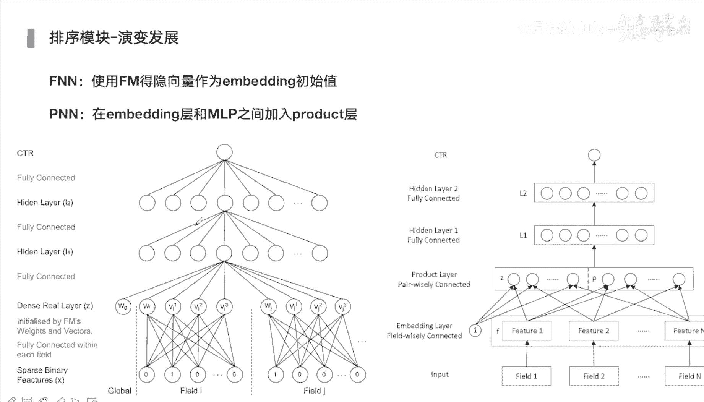

*   **Wide & Deep**：谷歌提出的模型，兼顾记忆与泛化。“Wide”部分（线性模型）记忆历史数据中的频繁模式，“Deep”部分（深度神经网络）泛化到新的特征组合。
*   **DeepFM**：华为提出的模型，用FM替换了Wide & Deep中的Wide部分。FM层可以低阶特征交叉，Deep层进行高阶特征交叉，两者共享输入，无需精细的特征工程。
*   **DIN（深度兴趣网络）**：阿里妈妈提出的模型，针对用户历史行为序列，引入注意力机制。模型会动态计算用户历史行为中每个物品与当前候选广告的相关性权重，从而形成与当前候选相关的用户兴趣表示。
*   **DIEN（深度兴趣进化网络）**：在DIN的基础上，进一步使用序列模型（如GRU）来模拟用户兴趣随时间的变化过程，能更好地捕捉兴趣的动态演进。

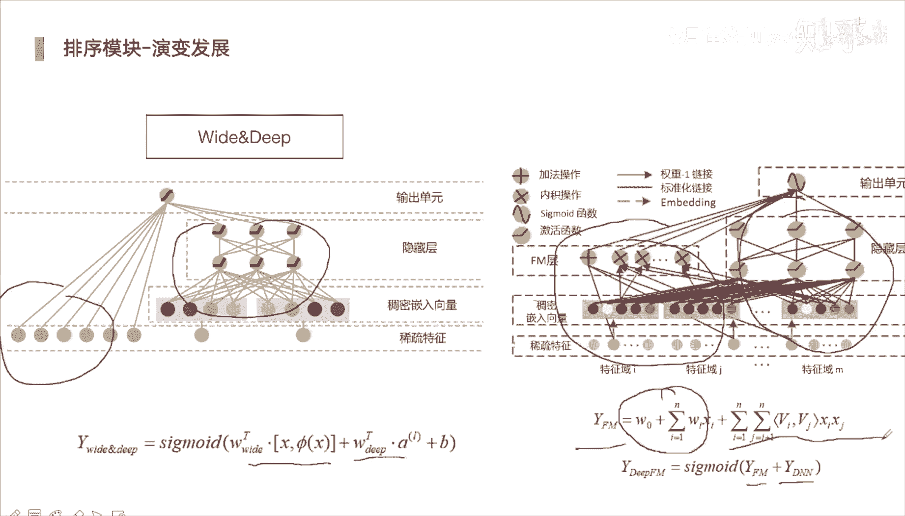

## 总结与思考

本节课中我们一起学习了推荐系统的核心框架与关键技术。

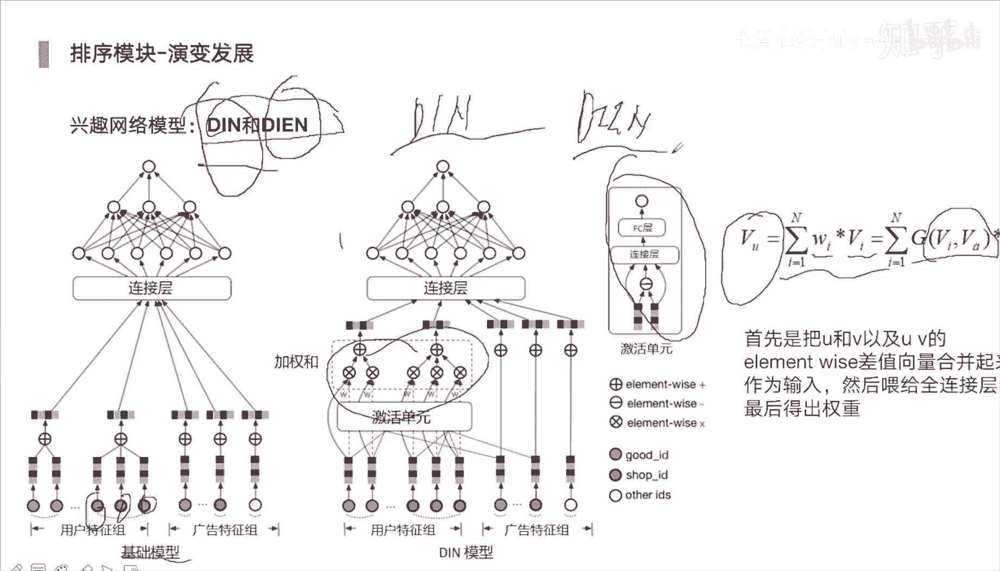

**召回模块**的核心在于**多路与多样**。它从海量信息中快速初筛，并需要从热度、协同过滤、向量化、知识图谱等多个角度设计召回策略，以确保候选集的覆盖度和多样性。其发展路径是从简单规则到复杂模型，从通用化召回走向深度个性化召回。

**排序模块**的核心在于**精准与智能**。它利用丰富的特征和复杂的模型（从线性模型、树模型到深度模型）对候选进行精细打分。模型演进的核心方向是更好地自动化学习特征交叉，以及更精准地建模用户兴趣（尤其是动态的兴趣序列）。

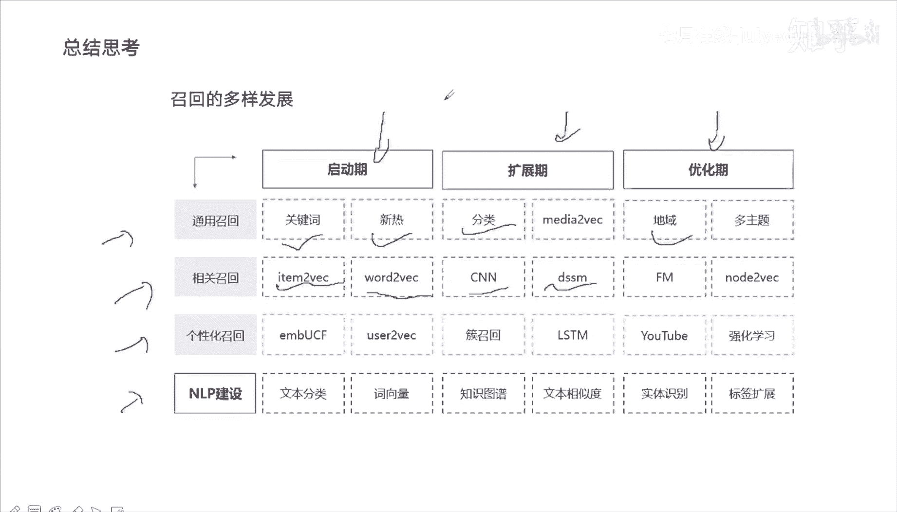

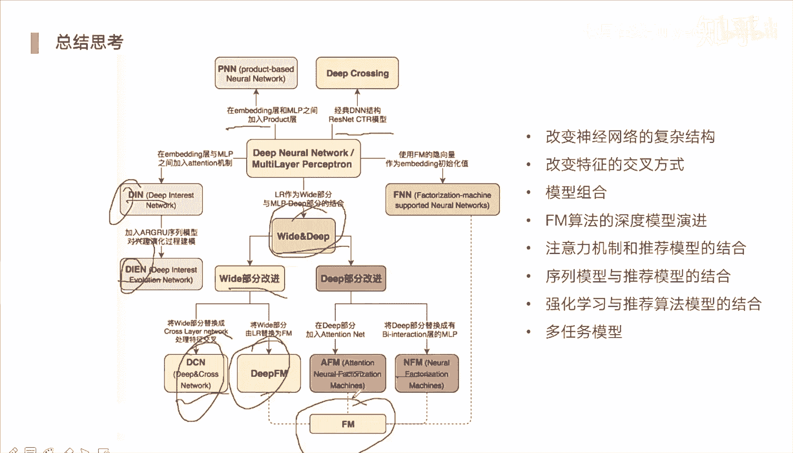

召回与排序相辅相成，共同决定了推荐系统的最终效果。一个高效的召回能为排序提供优质的候选，而一个精准的排序能将召回的价值最大化。掌握这两大模块的原理与实现，是构建现代推荐系统的基础。

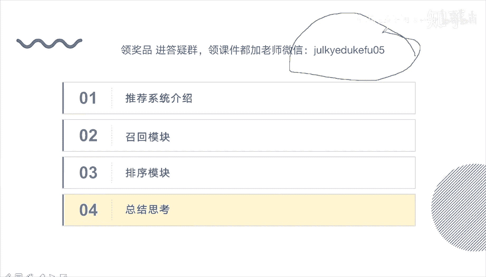

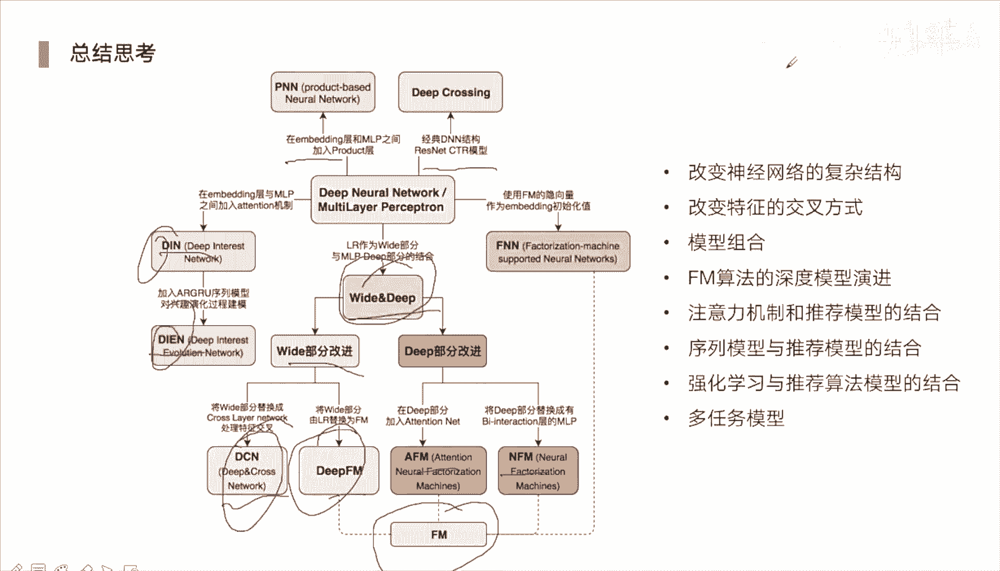

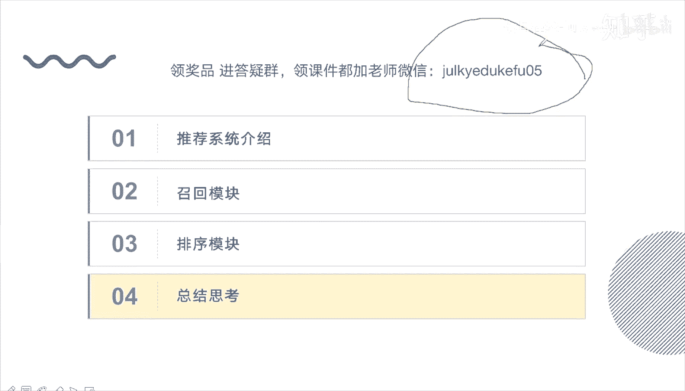

（注：课程中涉及的奖品领取、课件获取等内容已按您的要求省略，仅保留技术教程部分。）