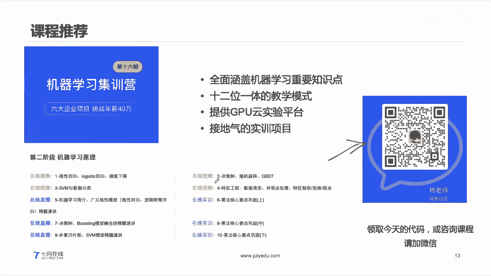
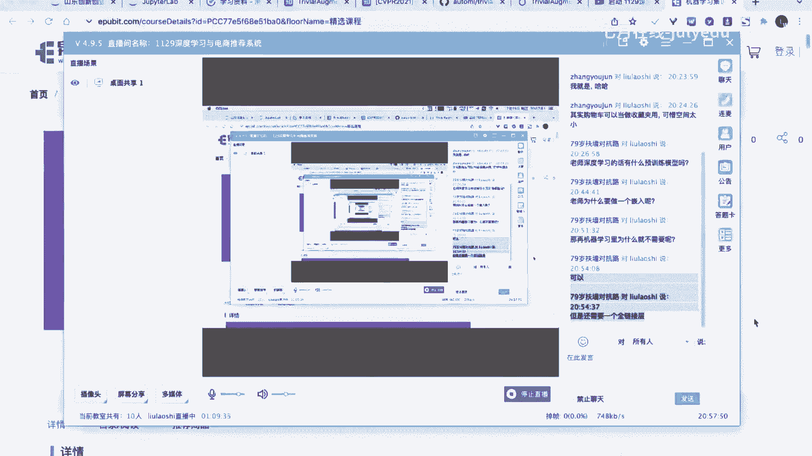
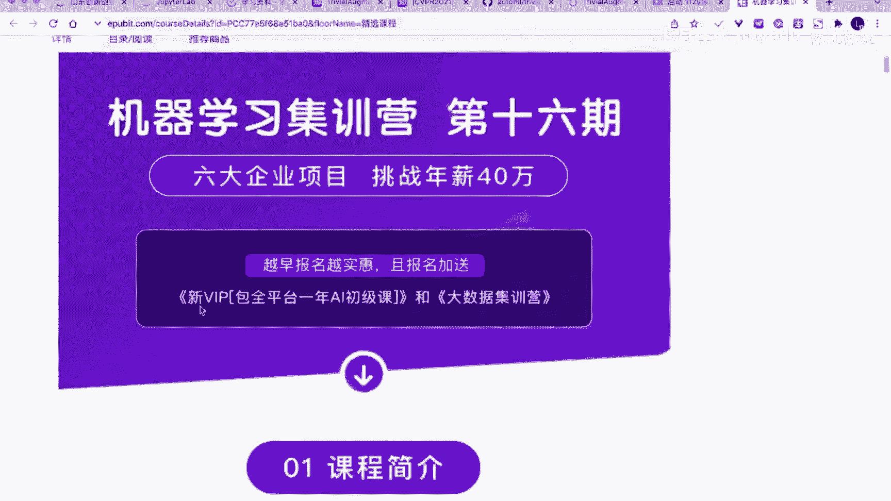
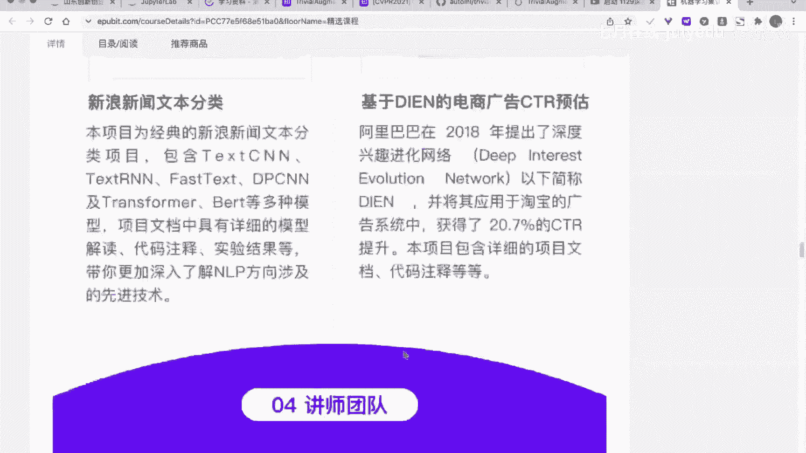
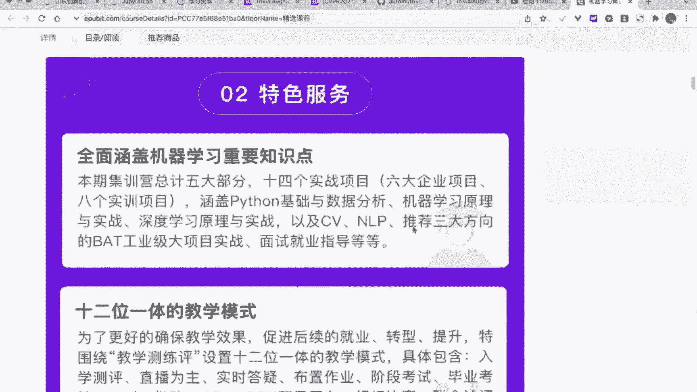
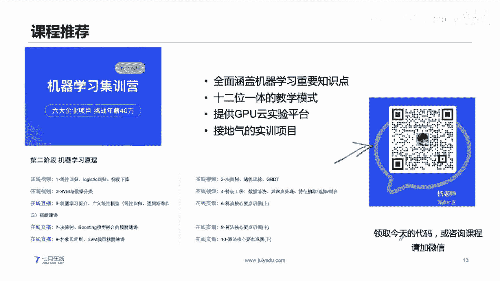
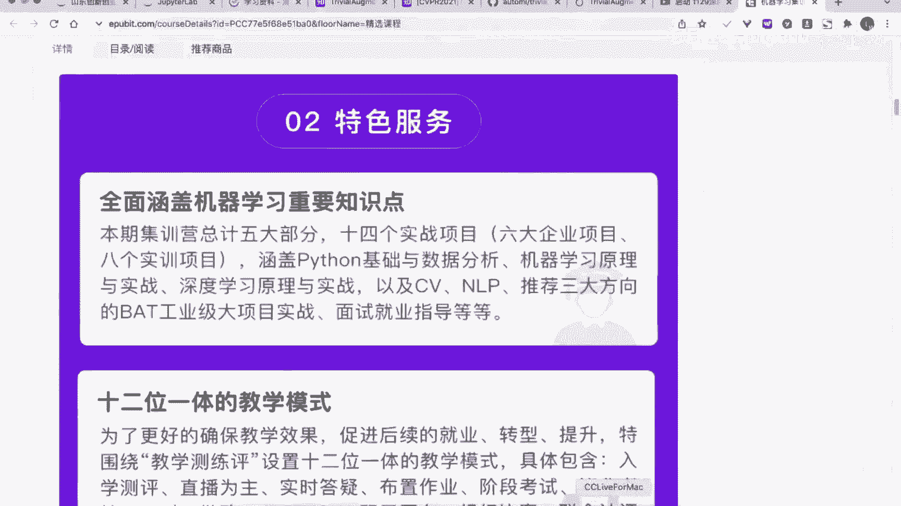
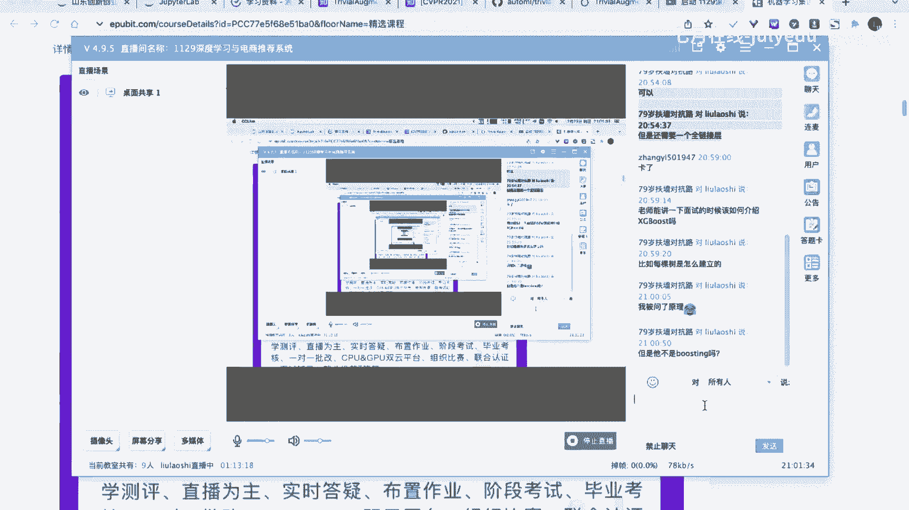
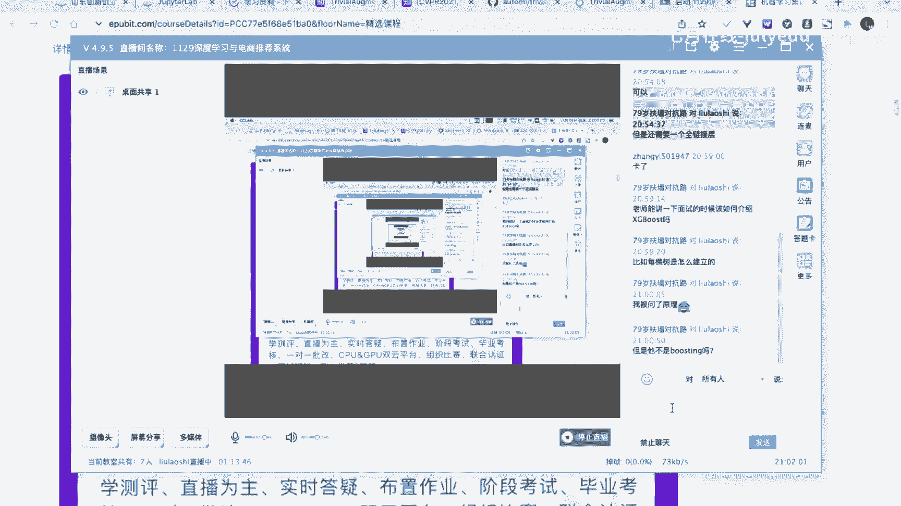

# 🧠 人工智能—推荐系统公开课（P14）：深度学习与电商推荐系统

在本节课中，我们将要学习深度学习的基础知识，并了解如何将其应用于电商推荐系统的构建。课程内容分为三部分：深度学习基础、推荐系统介绍以及一个基于淘宝数据集的电商推荐系统实战案例。

---

## 🧱 第一部分：深度学习基础

上一节我们介绍了课程的整体安排，本节中我们来看看深度学习的基础概念。

深度学习是机器学习的一个特定分支。它与传统机器学习算法（如线性模型、树模型、KNN、SVM等）是并列关系，而非对立关系。深度学习的核心特点在于其网络结构模拟了人脑的神经元组织。

深度学习有两个主要特点：
1.  **端到端（End-to-End）过程**：模型直接从输入得到输出，中间无需复杂的人工特征工程。
2.  **有向计算图**：网络由节点（计算过程）和边（数据流向）组成，可以形成复杂的、甚至带环的结构。

一个典型的深度学习网络包含输入层、隐含层和输出层。其中，隐含层可以是多层。层与层之间如果所有节点都相互连接，则称为**全连接层（Fully Connected Layer）**。由多个全连接层组成的网络称为**多层感知机（MLP）**。

在计算上，深度学习模型常利用矩阵乘法进行高效并行计算。例如，一个全连接层的计算可以表示为：
`输出 = 激活函数(输入矩阵 × 权重矩阵 + 偏置向量)`

深度学习特别适合处理**非结构化数据**（如图片、文本）的端到端任务。以下是几个例子：
*   **输入图片，输出标签**：人脸识别、车牌识别、动物分类、红绿灯检测。
*   **输入文本，输出文本**：机器翻译、对话机器人。

---

## 🔍 第二部分：推荐系统介绍

了解了深度学习的基础后，本节我们来看看推荐系统的基本概念及其在电商领域的应用。

推荐系统的核心目标是建立用户（User）与商品（Item）之间的连接，预测用户可能感兴趣或购买的商品。其方法主要分为两类：
1.  **基于机器学习的推荐**：依赖人工特征工程，从数据中提取刻画用户行为和商品属性的特征，再使用机器学习模型进行预测。
2.  **基于深度学习的推荐**：利用深度学习模型自动学习用户和商品的表示（嵌入），并完成匹配预测。

在电商场景中，基于机器学习的方法需要人工构建大量特征，例如：
以下是基于用户行为可以构建的部分特征示例：
*   用户浏览不同商品的心智指数（衡量偏好）。
*   用户浏览最多商品的品牌转化率。
*   用户最后一次操作的类型（如点击、收藏）。
*   用户活跃天数、历史购买次数、复购行为。
*   用户加购次数、注册时间等。

而基于深度学习的方法则更为简洁，通常采用**深度协同过滤**等模型。其核心思想是将用户ID和商品ID通过**嵌入层（Embedding Layer）** 映射为稠密向量，然后将这些向量拼接或交互，最后通过全连接层等网络结构预测用户对商品的偏好得分（如点击率、购买概率）。

---

## 🛒 第三部分：电商推荐系统实战

前面我们介绍了推荐系统的两种思路，本节我们将使用深度学习模型，在真实的淘宝用户行为数据集上构建一个推荐系统实战案例。

我们使用的数据集记录了2017年11月25日至12月3日间约100万用户的行为，每条数据包含：用户ID、商品ID、商品类目ID、行为类型（pv浏览、buy购买、cart加购、fav收藏）和时间戳。

### 数据准备与探索

首先，我们读取数据并进行初步分析，例如将时间戳转换为日期，统计每日行为量，分析不同商品的转化率（购买次数/浏览次数）等。

### 定义预测任务

我们定义一个具体的推荐任务：**预测用户是否会购买某个商品**。这是一个二分类问题。
*   **正样本**：用户-商品组合中，用户购买了该商品。
*   **负样本**：用户-商品组合中，用户未购买该商品（可从用户未交互的商品中采样）。

### 构建深度学习模型

我们构建一个简单的深度推荐模型，其结构如下：
1.  **输入层**：接收用户ID、商品ID、商品类目ID。
2.  **嵌入层（Embedding Layer）**：将高维稀疏的ID特征映射为低维稠密向量（例如32维）。公式上，这相当于一个查找表：`E(user_id) -> user_embedding`。
3.  **拼接层**：将用户嵌入向量、商品嵌入向量、类目嵌入向量拼接成一个长向量。
4.  **全连接层（Fully Connected Layers）**：接收拼接后的向量，通过一层或多层非线性变换学习高级特征。
5.  **输出层**：通过一个神经元（使用Sigmoid激活函数）输出一个0到1之间的值，表示用户购买该商品的预测概率。

模型使用二元交叉熵损失（BCELoss）进行训练。训练完成后，对于待推荐的商品列表，我们可以用该模型为用户可能购买的每个商品打分，并按分数从高到低进行推荐。

### 模型训练与总结

通过准备正负样本数据集，我们可以对该模型进行训练。训练过程与传统深度学习模型一致，包括前向传播、损失计算、反向传播和参数更新。

本节课中我们一起学习了深度学习的基础、推荐系统的原理，并实战演练了如何使用深度学习模型构建一个电商推荐系统。我们看到了深度学习如何通过嵌入技术自动学习用户和商品的表示，从而避免了繁琐的人工特征工程，为实现高效的个性化推荐提供了强大的工具。

---
*注：本教程根据公开课内容整理，侧重核心思路与流程阐述。完整代码、数据集及详细实现需参考相关课程资料。*