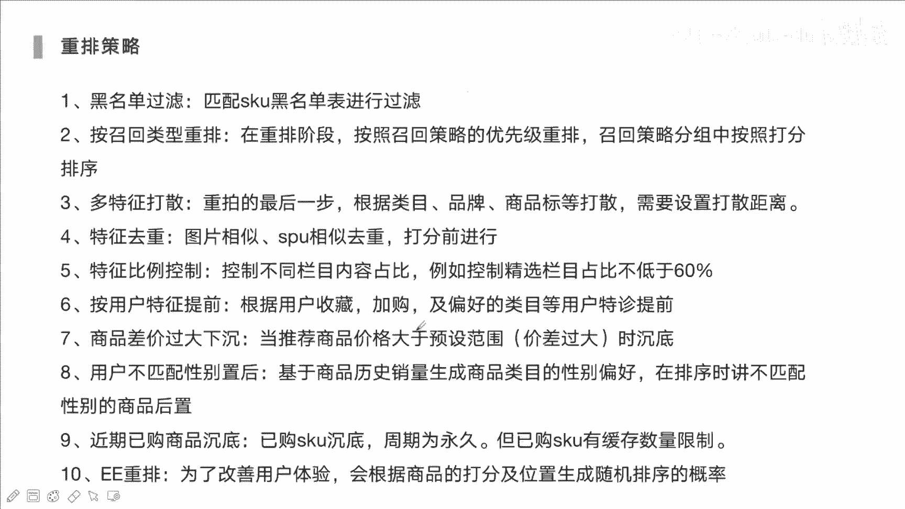
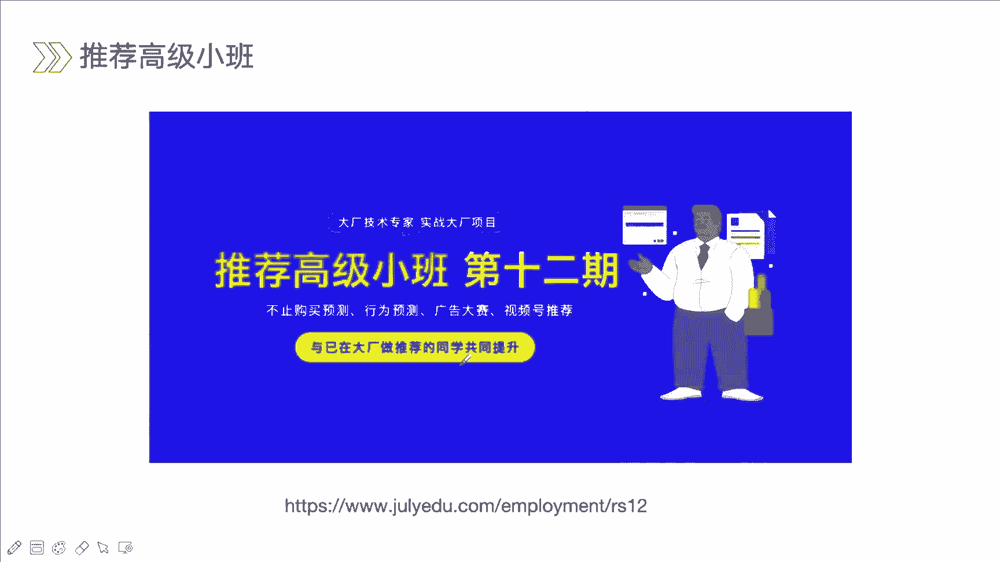
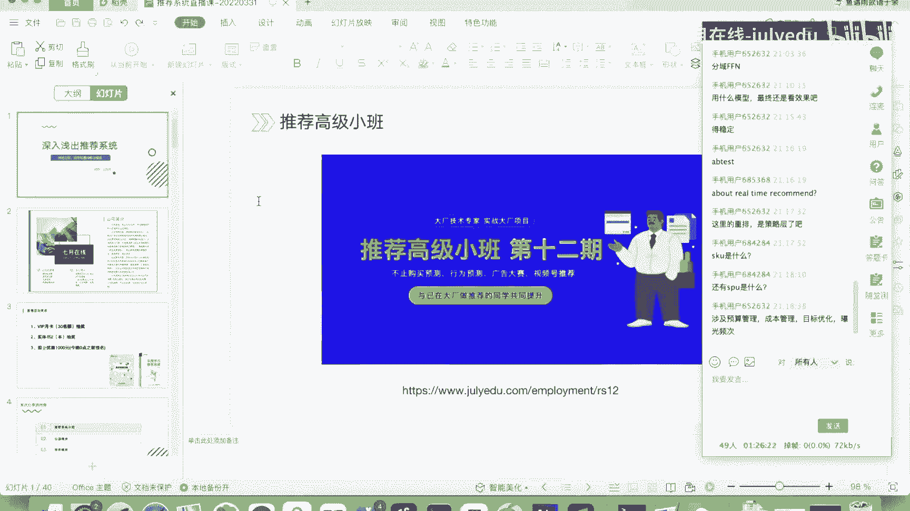
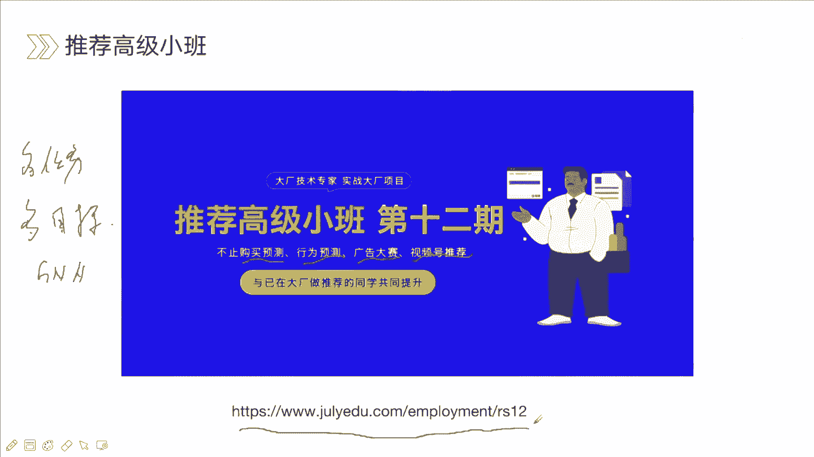
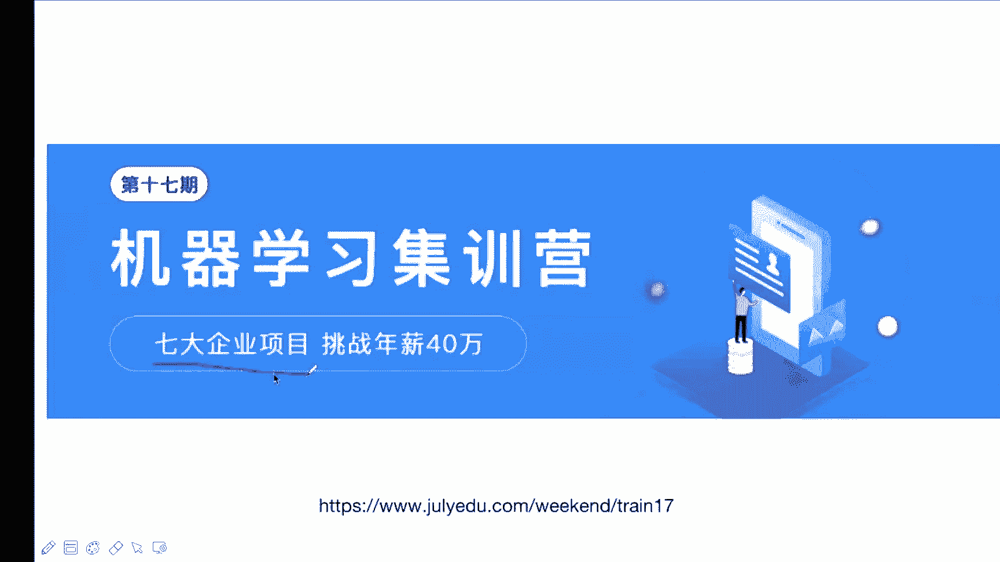
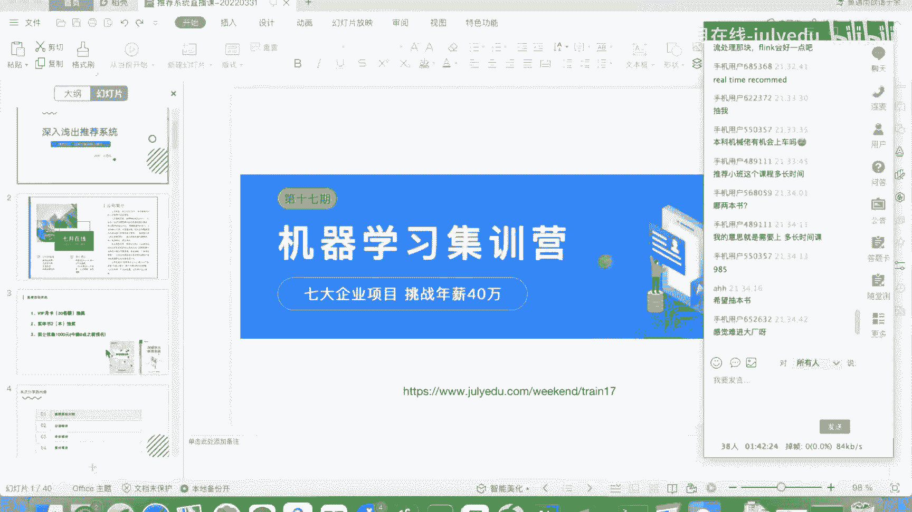
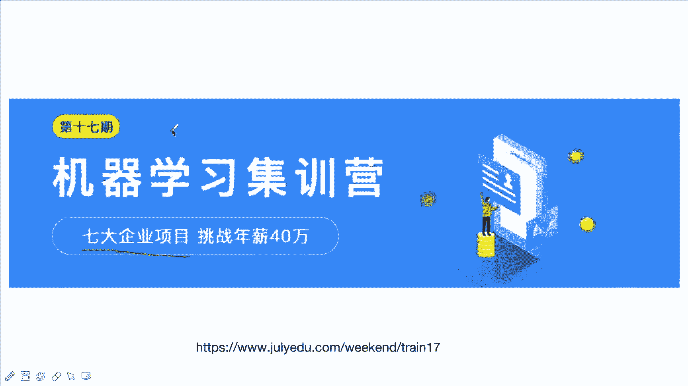
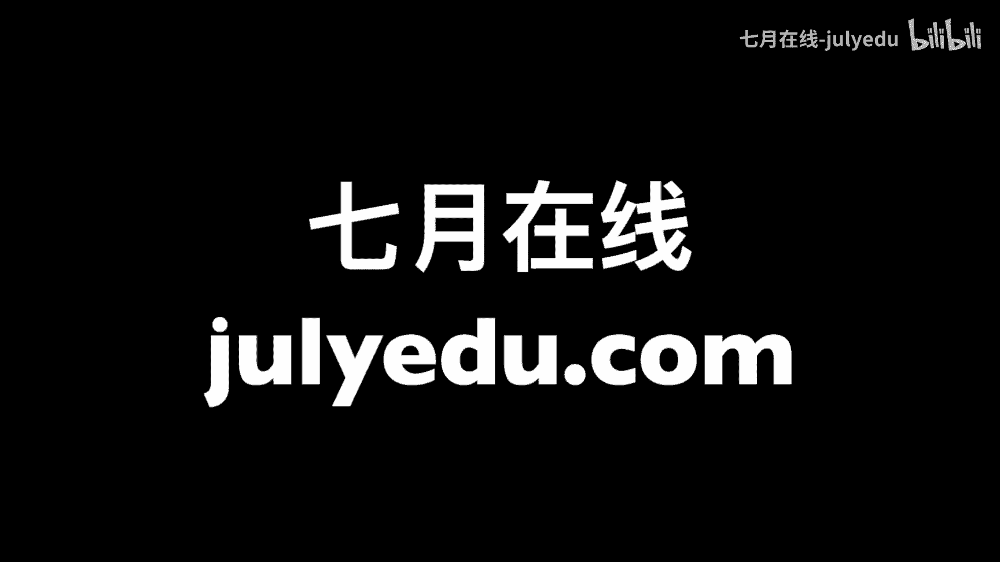

# 人工智能—推荐系统公开课（七月在线出品） - P15：22.3.31深入浅出推荐系统

## 概述

在本节课中，我们将要学习推荐系统的核心模块与经典算法。课程将围绕召回、排序、重排三大模块展开，介绍其基本概念、经典策略与模型演变，帮助初学者对推荐系统建立一个整体性的认识。

## 推荐系统简介

推荐系统是人工智能领域的热门方向，与搜索、广告并称为“搜广推”。其核心目标是提升用户体验，通过分析用户行为数据（如点击、浏览、购买），挖掘用户的潜在兴趣，从而进行个性化商品或内容推荐。

一个典型的电商推荐系统流程如下：首先从日志中提取用户行为数据，然后利用召回、排序、重排技术，最终挖掘出用户可能感兴趣的商品。

## 召回模块

上一节我们介绍了推荐系统的整体流程，本节中我们来看看召回模块。召回的核心任务是从海量商品池（如上亿商品）中快速筛选出用户可能感兴趣的几百或几千个商品，以缩小后续排序模块的搜索范围。

召回策略通常采用“盲人摸象”的思路，即通过多种策略（模型）从不同角度捕捉用户兴趣，因为单一模型难以覆盖所有可能性。评估召回效果时，不仅看准确度，还需考虑覆盖度、多样性、时效性等因素。

以下是几种经典的召回策略：

### 1. 协同过滤
协同过滤同时利用用户和物品之间的相似性进行推荐。它分为基于用户的协同过滤和基于物品的协同过滤。
*   **基于用户的协同过滤**：找到与目标用户相似的用户，将该相似用户喜欢的物品推荐给目标用户。其核心是计算用户之间的相似度，例如使用余弦相似度公式：`similarity(A, B) = (A·B) / (||A|| * ||B||)`。
*   **基于物品的协同过滤**：找到与目标物品相似的物品，将这些相似物品推荐给喜欢目标物品的用户。其核心是计算物品之间的相似度。

### 2. 关联规则召回
该策略通过挖掘商品之间的关联关系进行推荐。例如，经典案例“啤酒与尿布”，即购买啤酒的用户很可能也会购买尿布。
计算商品关联性时，可考虑购买序列中的距离和先后关系。一个简化的关联分数计算公式可以是：`score(i1, i2) = base^{distance} * θ`，其中`base`是距离衰减系数，`θ`在正向关联（先i1后i2）时为1，逆向时为小于1的系数。

### 3. 向量召回
向量召回通过模型得到用户和物品的嵌入向量，然后通过近似最近邻搜索快速找到与用户向量最相似的物品向量。
*   **单向量召回**：如YouTube DNN模型，为每个用户生成一个代表其整体兴趣的向量。线上服务时，实时计算用户向量，并通过Faiss等库检索相似物品。
*   **多向量召回**：如MIND模型，使用胶囊网络为每个用户生成多个兴趣向量，以表征其多样的兴趣意图，每个兴趣向量可独立召回一部分物品。

### 4. 图嵌入召回
基于图结构的学习方法，如DeepWalk、Node2Vec，通过随机游走生成物品序列，再利用Word2Vec思想学习物品的嵌入向量，从而捕捉物品在图结构中的相似性。

### 5. 知识图谱召回
利用知识图谱中实体（如商品、品牌、品类）的丰富属性和关系进行推荐，有助于解决新品冷启动、实现精准搭配（如手机与手机壳）等问题。

## 排序模块

上一节我们介绍了如何从海量商品中召回候选集，本节中我们来看看排序模块。排序模块的任务是对召回得到的几百个商品进行精准打分排序，需要构建复杂的特征和模型。

排序模型的发展大致分为三个阶段：
1.  **发展初期（2010年前）**：人工特征工程 + 线性模型（如LR）。
2.  **加速发展期（2010-2015年）**：自动特征交叉 + 线性模型，代表模型有FM（因子分解机）、FFM（场感知因子分解机）、GBDT+LR。
3.  **深度发展期（2016年至今）**：深度学习模型广泛应用，模型兼具记忆与泛化能力。

以下是几个核心的深度学习排序模型：

### 1. Wide & Deep
由Google提出，模型结构包含两部分：
*   **Wide部分**：线性模型，处理稀疏特征，负责记忆。
*   **Deep部分**：深度神经网络，处理稠密嵌入特征，负责泛化。
两部分结果相加后通过激活函数输出。

### 2. DeepFM
由华为提出，是对Wide & Deep的改进，用FM替换了Wide部分，能自动进行二阶特征交叉，结构更统一。

### 3. DIN（深度兴趣网络）
由阿里巴巴提出，针对用户历史行为序列，引入了注意力机制。它计算候选商品与历史行为商品之间的相关性权重，对历史行为进行加权求和，从而动态表征用户兴趣。
注意力权重的计算可简化为一个小型神经网络：`attention_score = f(v_item, v_hist, v_item - v_hist, v_item * v_hist)`。

### 4. DIEN（深度兴趣进化网络）
在DIN的基础上，使用GRU序列模型对用户历史兴趣的演化过程进行建模，能更好地捕捉兴趣的动态变化。

## 重排模块

排序模块输出了精准排序的列表，但直接展示给用户可能体验不佳。重排模块在排序结果之上，基于业务规则和用户体验进行最终调整。

以下是常见的重排策略：
*   **打散**：避免同一品类或相似商品连续出现，增加结果多样性。
*   **去重**：去除重复或高度相似的商品。
*   **新鲜度**：适当插入新品或热点内容。
*   **业务规则**：如价格带控制、品牌露出、库存过滤等。
*   **上下文适配**：根据用户实时场景（如时间、地点）微调。

## 总结

本节课我们一起学习了推荐系统的核心架构。我们从召回模块开始，了解了如何从海量商品中快速初筛，介绍了协同过滤、关联规则、向量召回、图嵌入和知识图谱等多种策略。接着，我们深入排序模块，回顾了从线性模型到深度学习模型（如Wide & Deep, DeepFM, DIN）的演进，这些模型负责对候选集进行精准打分。最后，我们简要介绍了重排模块，它通过一系列策略优化最终展示列表，以提升用户体验和业务指标。推荐系统是一个融合了算法、工程和业务理解的综合领域，希望本课能为你提供一个清晰的入门指引。