# 人工智能—推荐系统公开课（七月在线出品） - P16：快速入门推荐系统串讲 🚀


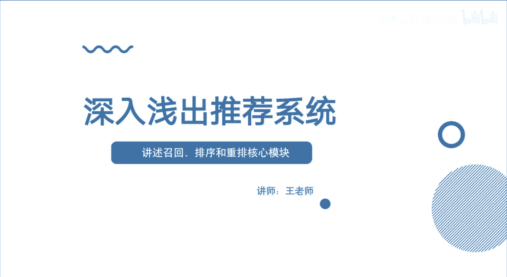

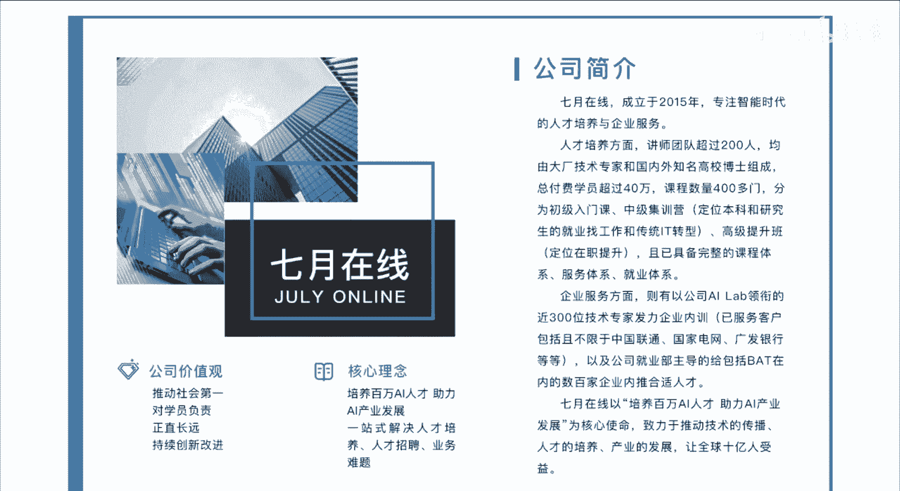

在本节课中，我们将要学习推荐系统的核心概念与整体架构。推荐系统是互联网应用中至关重要的技术，它帮助我们从海量数据中筛选出用户可能感兴趣的内容，如商品、视频或文章。我们将围绕召回、排序和重排这三个核心模块展开介绍，了解它们如何协同工作，最终为用户提供个性化的推荐结果。

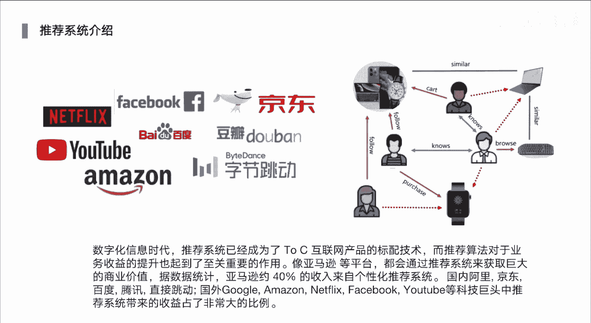

## 推荐系统概述与架构 📊

推荐系统随着互联网数据量的增长而变得日益重要。其核心挑战在于如何从海量数据中快速找到用户感兴趣的内容。这项技术直接影响着许多公司的收入，例如在电商或广告场景中，精准的推荐能显著提升用户的点击率和转化率。

一个典型的推荐系统，例如电商推荐系统，其工作流程始于用户行为日志。这些日志记录了用户的浏览、点击、加购、购买等行为。系统从这些数据中提取用户兴趣，例如，用户将商品加入购物车是一个强烈的兴趣信号。

基于这些数据，推荐系统技术开始发挥作用。整个过程主要分为三个阶段：
1.  **召回**：从拥有数百万甚至上亿商品的物料池中，快速筛选出几百或几千个用户可能感兴趣的商品。
2.  **排序**：对召回得到的少量商品，使用更复杂的模型和丰富的特征进行精准打分和排序，以提升推荐的准确性。
3.  **重排**：在最终展示前，对排序结果进行策略调整，例如过滤已购商品、增加推荐多样性，以优化用户体验。

最终，系统将处理好的商品展示在平台的各个推荐位上。

## 召回与排序：两大核心阶段 ⚙️

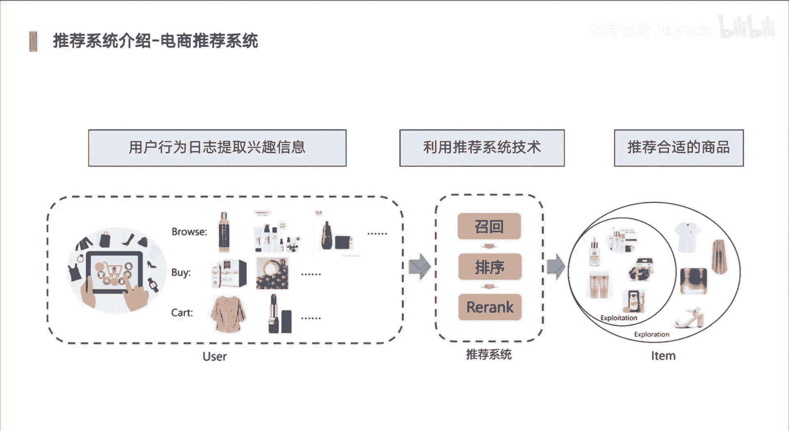

上一节我们介绍了推荐系统的整体架构，本节中我们来看看其核心的两个阶段：召回与排序。

召回阶段处理的是海量数据，其核心目标是“快”和“全”。它需要在毫秒级时间内，从庞大的商品池中初步筛选出用户可能感兴趣的一批商品。因此，召回模型通常相对简单，使用的特征也较少。

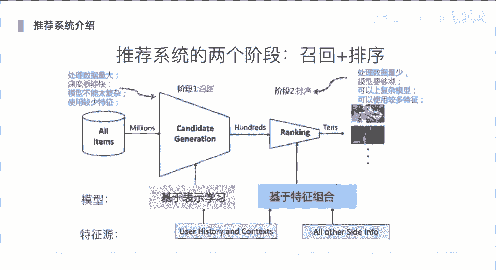

排序阶段则处理召回阶段筛选出的少量商品（例如几百个）。此时，核心目标是“准”。为了追求更高的准确性，排序模型可以设计得非常复杂，并引入大量特征。从早期的逻辑回归（LR）模型，到深度神经网络（DNN），再到结合Transformer等复杂结构，排序模型在不断演进。

简而言之，召回是“大海捞针”，快速找到可能的候选集；排序是“精挑细选”，对候选集进行精准打分和排序。

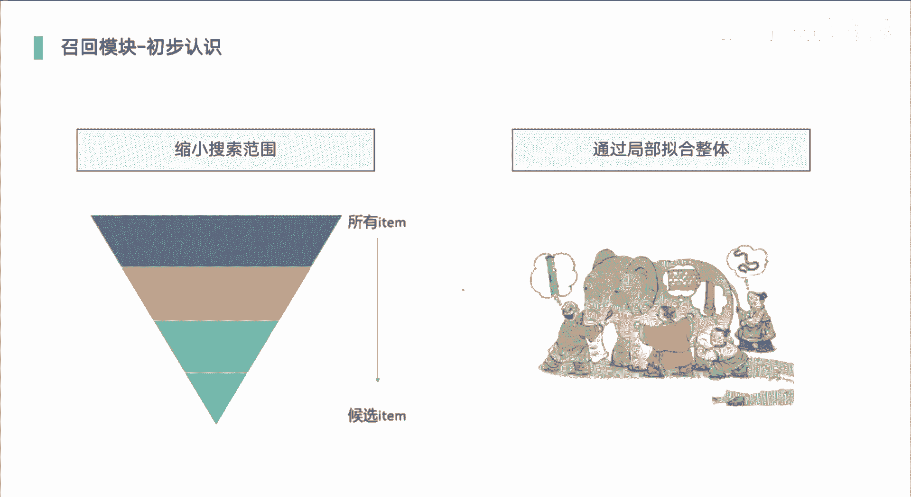

## 深入召回阶段：缩小搜索范围 🎯

上一节我们区分了召回与排序，本节中我们深入探讨召回阶段的具体目标与方法。

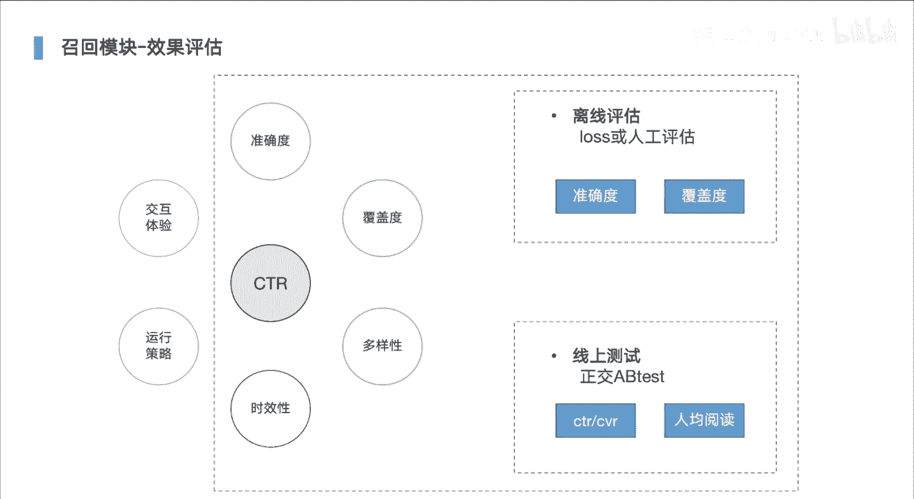

召回的核心任务是缩小搜索范围，即从几百万商品中筛选出几百个。更重要的是，它需要通过“局部拟合整体”，尽可能涵盖用户所有可能感兴趣的内容。由于用户行为数据可能稀疏或兴趣多样，单一召回策略往往不够。

因此，工业界通常采用多路召回策略，每一路从不同角度（如热门商品、相似用户喜好、关联商品等）进行筛选，最后将各路结果整合。这就像“盲人摸象”，每一路召回摸到“大象”的一部分，整合起来才能更接近全貌。

评估召回效果时，除了点击率（CTR）、转化率（CVR）等指标，在内容推荐场景还需考虑用户停留时长、转发、关注等互动指标。离线评估常用损失函数或人工评估，线上则通过A/B测试观察核心业务指标的变化。

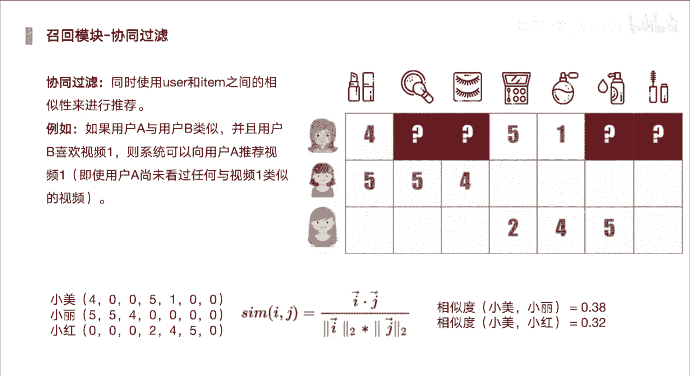

以下是几种经典的召回方法：

### 协同过滤（Collaborative Filtering）

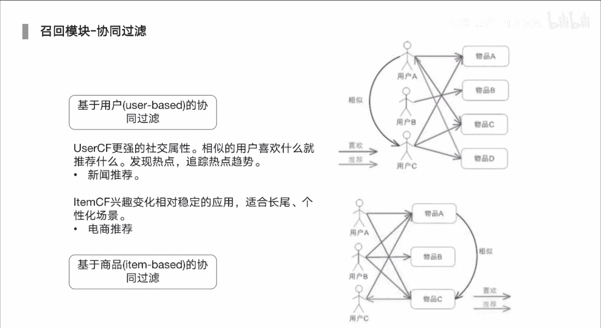

协同过滤利用用户（User）和物品（Item）之间的相似性进行推荐。其核心思想是“物以类聚，人以群分”。例如，如果用户A和用户B相似，且用户B喜欢了物品I，那么系统可以向用户A推荐物品I。

我们可以构建一个用户-物品评分矩阵。对于缺失值，简单的用0填充可能并不合理（未交互不代表不喜欢），实践中会采用均值或其他方法进行填充。计算用户相似度常用余弦相似度公式：

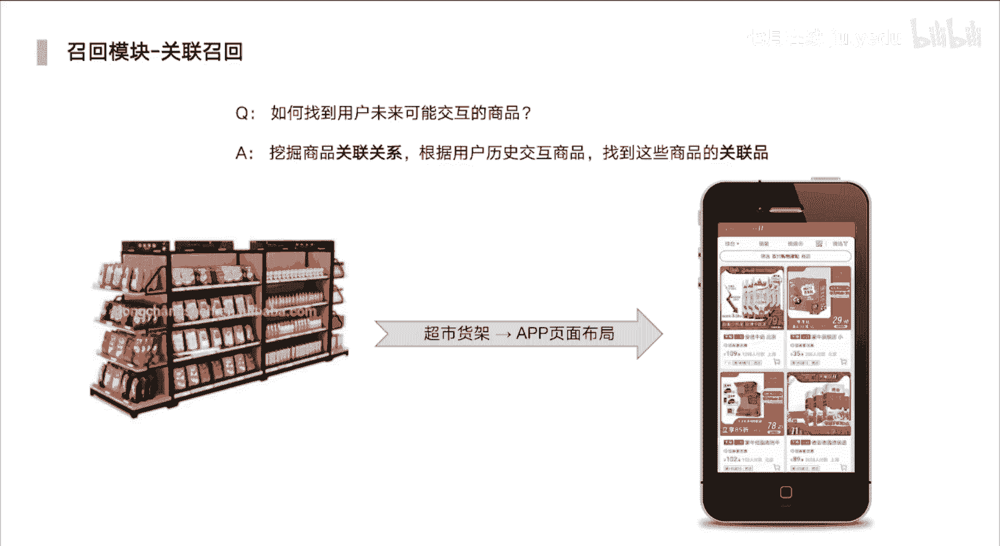

**相似度计算公式**：`sim(A, B) = (A·B) / (||A|| * ||B||)`

协同过滤主要分为两类：
*   **基于用户的协同过滤（User-CF）**：更强调社交属性，根据相似用户的行为进行推荐，适合发现热点和趋势。
*   **基于物品的协同过滤（Item-CF）**：基于物品本身的相似度，由于物品属性相对稳定，该方法在用户兴趣变化较慢的场景（如电商）中效果稳定。

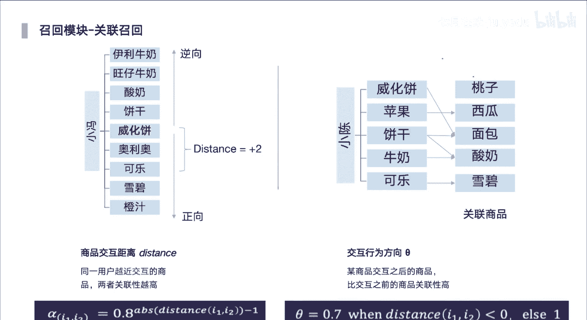

### 关联规则召回

关联规则召回属于协同过滤的一种，其核心是挖掘商品之间的关联关系。经典案例是“啤酒与尿布”。系统根据用户历史交互序列，统计商品A出现后商品B出现的概率，从而建立关联。

实践中，关联的强度（分数）会受到方向性和时间距离的影响：
*   **方向性**：用户先买A再买B（正向）与先买B再买A（逆向），其关联强度可能不同。
*   **时间距离**：购买A和B的时间间隔越近，通常认为关联性越强。

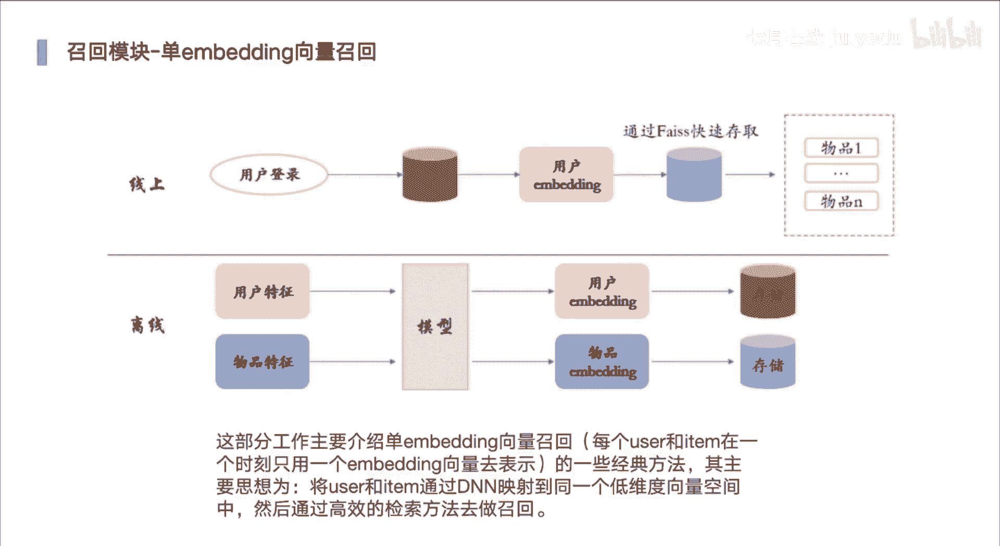

我们可以设计一个公式来综合计算关联分数，例如：`分数 = 基础关联度 * 方向系数 * 时间衰减系数`。根据用户最近交互的商品，找出关联分数高的商品进行推荐。

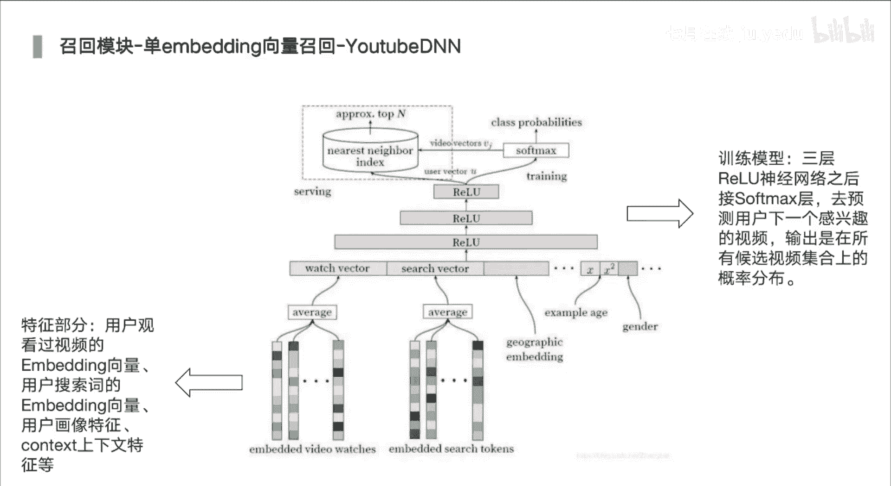

### 向量化召回（Embedding-Based Retrieval）

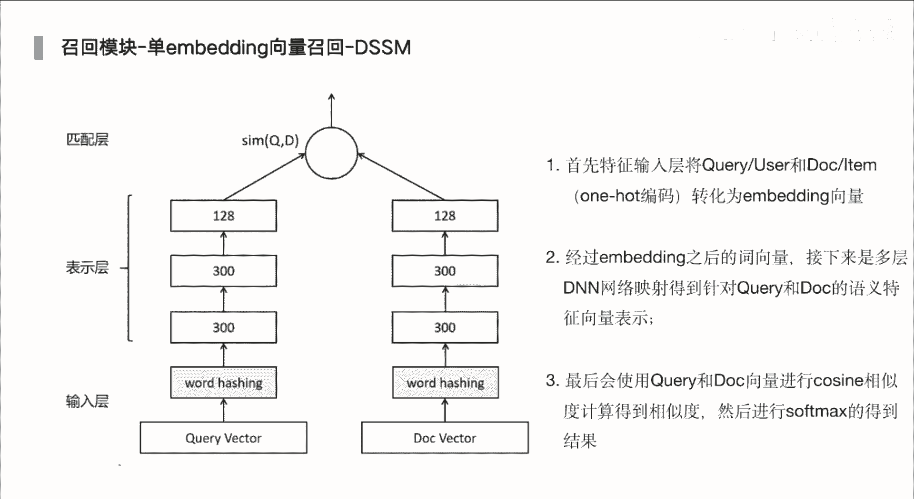

向量化召回是将用户和物品映射到同一个低维向量空间，通过计算向量相似度来寻找候选物品。其流程通常分为离线和在线两部分：
*   **离线**：使用模型（如双塔DNN）分别计算所有物品的向量（Embedding）并存储。
*   **在线**：实时计算用户的向量，然后通过近似最近邻搜索（ANN）算法，快速从海量物品向量中找出与用户向量最相似的Top-K个物品。

**双塔模型代码示意**：
```python
# 用户塔
user_embedding = user_tower(user_features)
# 物品塔
item_embedding = item_tower(item_features)
# 计算相似度（如点积）
similarity_score = tf.reduce_sum(user_embedding * item_embedding, axis=1)
```

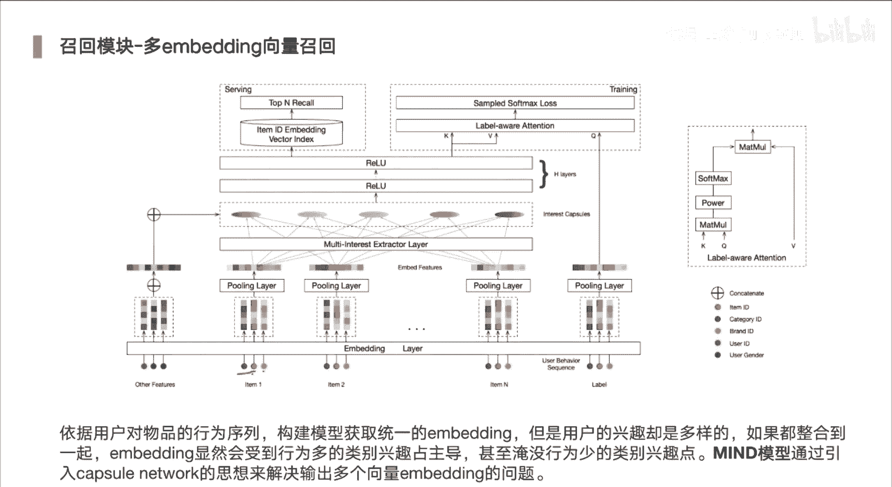

YouTube在2016年提出的深度神经网络推荐模型是这一方向的经典工作。它同样采用类似结构，并利用ANN进行高效检索。

### 深度结构化语义模型（DSSM）

DSSM最初用于搜索引擎，现也应用于推荐。它将查询（Query，可视为用户特征）和文档（Document，可视为物品特征）分别通过深度网络映射为向量，然后计算两者的相似度（如余弦相似度或点积），最终通过Softmax输出概率。

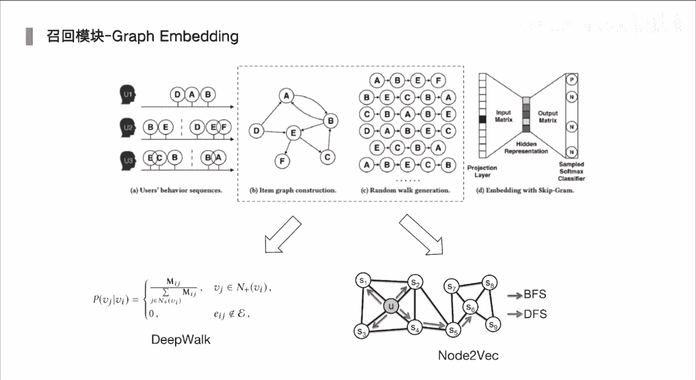

### 多兴趣向量召回（MIND）

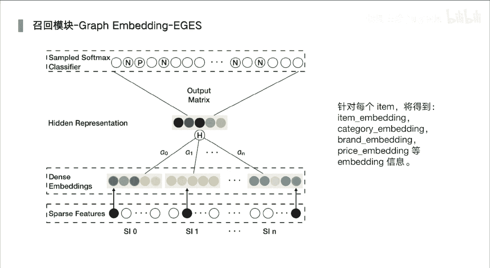

用户兴趣往往是多元的。MIND模型通过胶囊网络（Capsule Network）为每个用户生成多个兴趣向量（即多个Embedding），而不仅仅是一个。每个兴趣向量可以独立进行向量召回，最后将结果融合，从而更好地捕捉和满足用户的多样化兴趣。

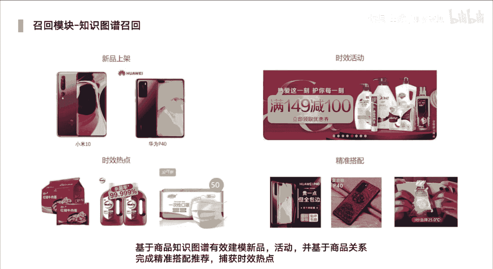

### 图神经网络召回

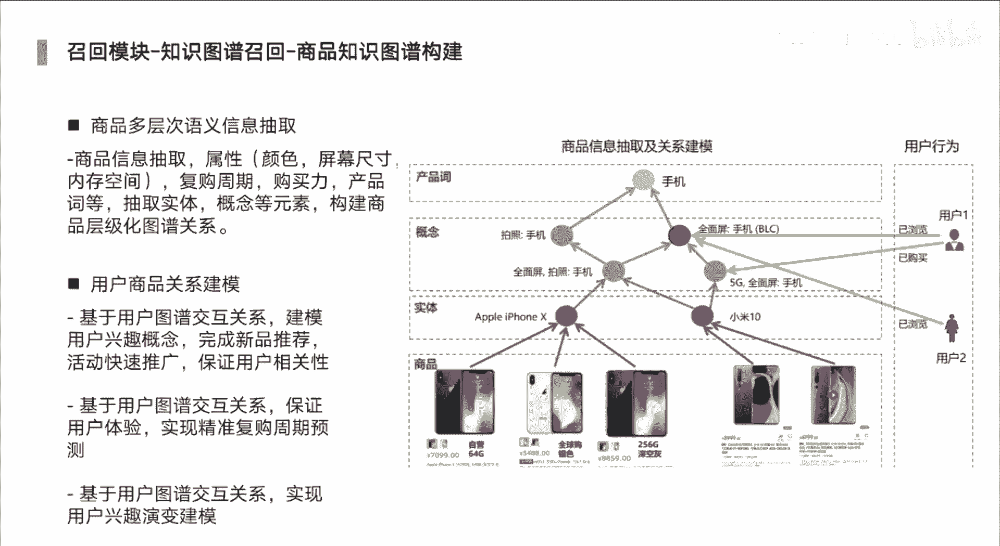

图召回通过构建用户-物品交互图来利用丰富的结构信息。例如，DeepWalk方法：
1.  **构图**：根据用户行为序列构建物品之间的转移关系图。
2.  **随机游走**：在图上进行随机游走，生成类似于文本的节点序列。
3.  **向量化**：使用Word2vec等算法，将节点序列转化为每个物品的向量表示。

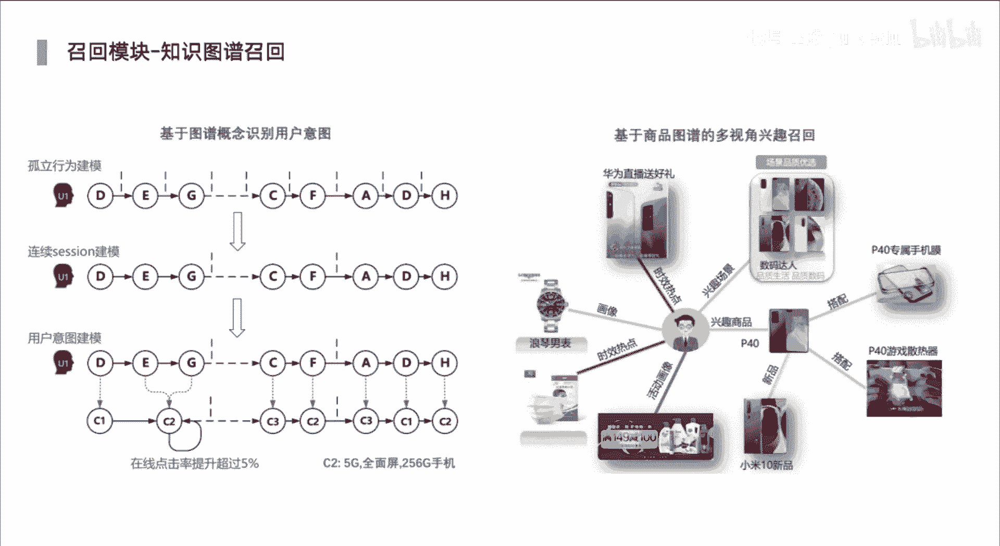

更复杂的方法如Node2vec，在游走时结合了广度优先搜索（BFS）和深度优先搜索（DFS）的策略。这类方法能有效挖掘物品间的高阶关联。

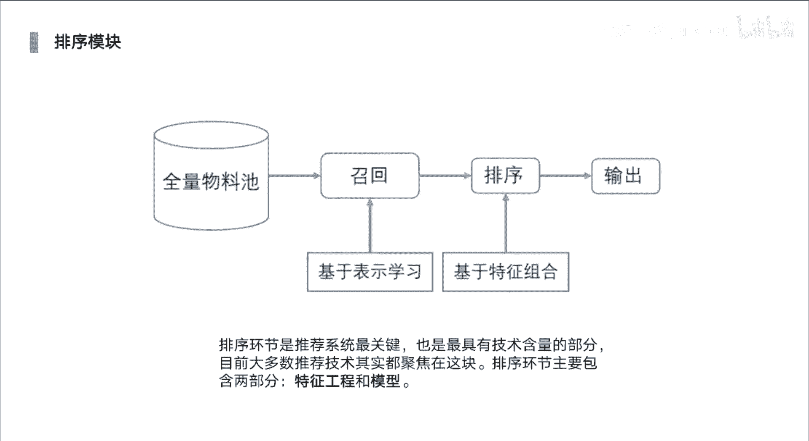

### EGES（Enhanced Graph Embedding with Side Information）

EGES针对冷启动问题（新品或行为稀疏的商品），在基础的图嵌入模型上加入了边信息（Side Information）。除了商品ID，它还考虑商品的品类、品牌等属性ID，并将这些属性的Embedding进行加权平均，得到商品的最终向量表示，从而丰富商品的表征。

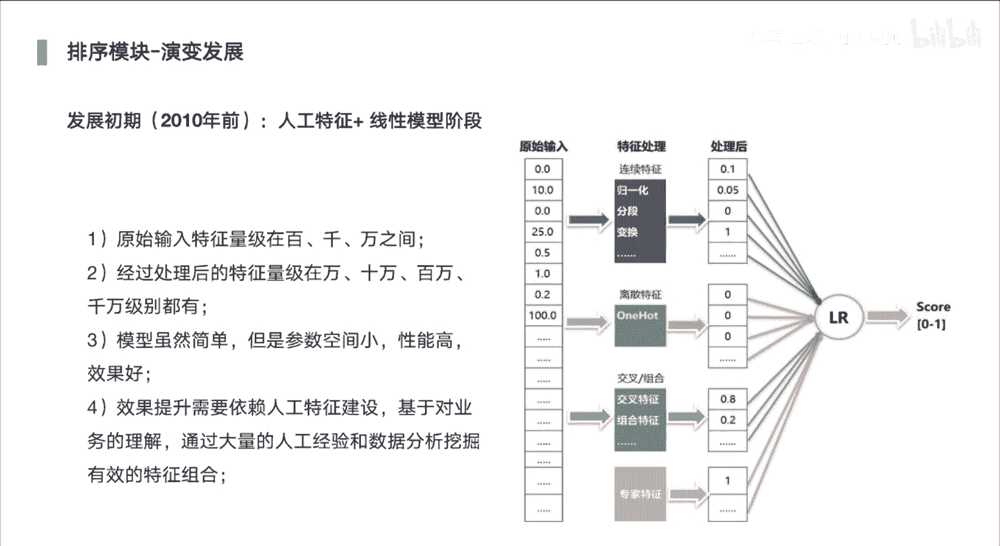

### 知识图谱召回

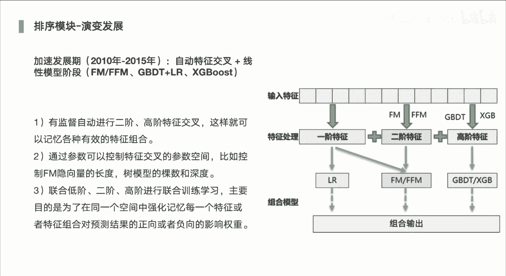

基于商品知识图谱的召回，能够有效建模新品、时尚热点和时效活动。通过构建包含商品属性、类别、品牌等实体及其关系的知识图谱，系统可以挖掘深层次的语义关联，实现精准搭配推荐或解决冷启动问题。

构建知识图谱涉及商品多维度信息抽取、用户-商品关系建模等。基于图谱，可以预测用户兴趣演变、实现精准复购周期预测等。

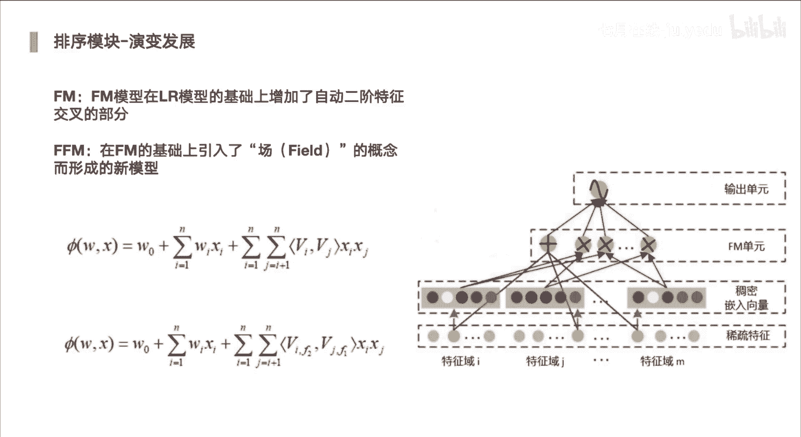

## 深入排序阶段：精准打分与排序 🏆

上一节我们详细探讨了多种召回策略，本节中我们进入排序阶段。排序阶段的目标是对召回得到的几百个候选物品，利用复杂模型和丰富特征，进行精准的点击率（CTR）、转化率（CVR）等预测，并据此进行最终排序。

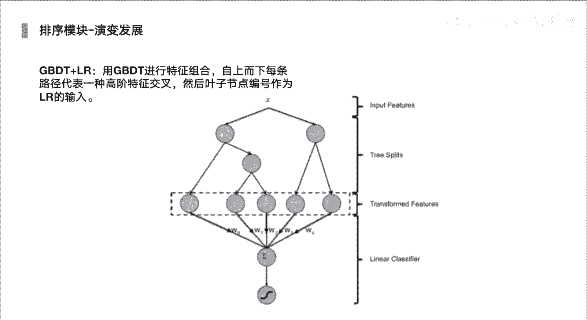

排序模块的核心是**特征工程**和**模型**。下面我们重点回顾排序模型的演进历程。

### 模型演进史

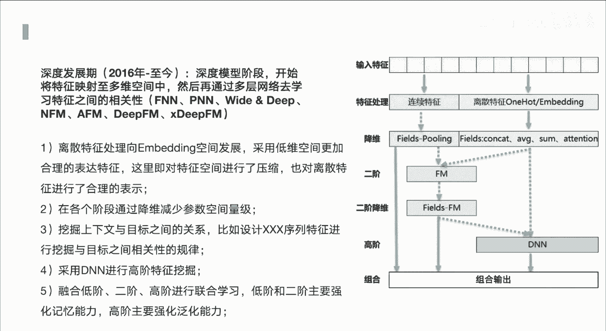

1.  **人工特征 + 线性模型（LR）时代**：早期（如2010年前后）主要依赖专家构建海量人工特征，结合简单的逻辑回归（LR）模型。特征工程的质量至关重要。
2.  **自动特征交叉 + 线性模型时代（2010-2015）**：为了更精细地捕捉特征交互，出现了能自动进行特征交叉的模型。
    *   **因子分解机（FM）**：通过为每个特征学习一个隐向量，实现特征间的二阶交互。
    *   **梯度提升树（GBDT）**：通过树的分裂过程天然实现特征交叉。常将GBDT的叶子节点输出作为新特征，输入到LR模型中（GBDT+LR范式）。
3.  **深度模型崛起时代（2016至今）**：深度学习被引入，模型结构变得复杂。
    *   **Wide & Deep**：谷歌提出，结合了“宽部分”（记忆历史特征共现）和“深部分”（泛化新特征组合）。
    *   **DeepFM**：华为提出，在Wide & Deep基础上，用FM层替换Wide部分，能同时学习低阶和高阶特征交互。
    *   **xDeepFM**：提出压缩交互网络（CIN），显式地学习高阶特征交互。
    *   **DIN（深度兴趣网络）**：阿里提出，针对用户历史行为序列，引入注意力（Attention）机制，动态评估不同历史行为对当前候选广告的重要性。
    *   **DIEN（深度兴趣进化网络）**：在DIN基础上，引入GRU等序列模型来模拟用户兴趣随时间的变化过程。

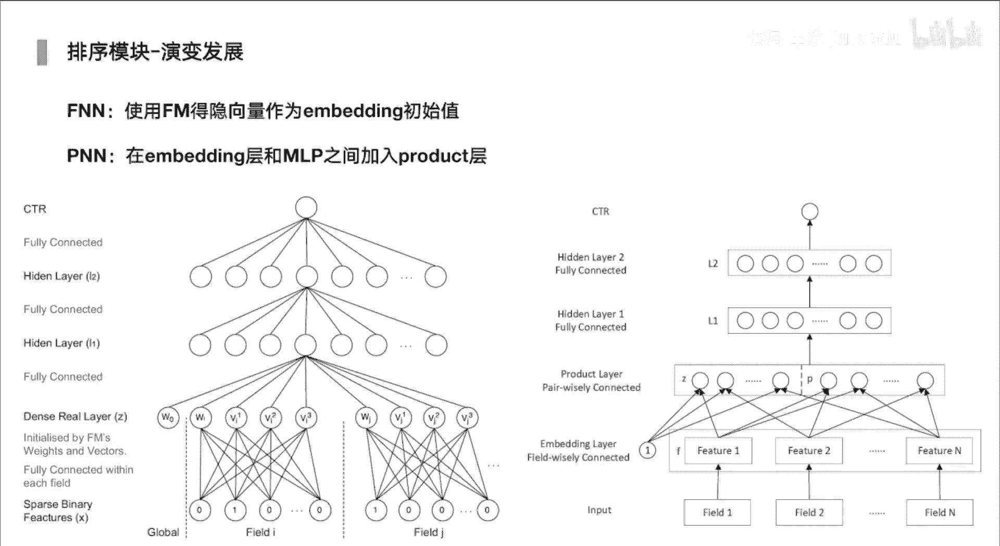

目前，排序模型的发展趋势是更深入地建模用户行为序列，并与其他领域（如图神经网络、强化学习）的技术相结合。

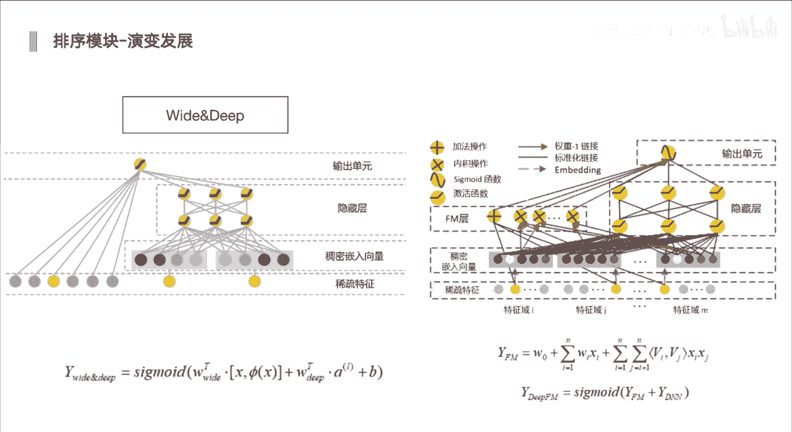

## 重排阶段：优化最终体验 ✨

排序之后、展示之前，还有一个重要的**重排**阶段。重排的目标不是进一步预测用户偏好，而是对排序列表进行策略调整，以优化整体用户体验和平台指标。

以下是常见的重排策略：
*   **去重与过滤**：过滤掉用户已购买的非快消品、加入黑名单的商品、重复的相似商品（如图片相似、同SPU）。
*   **多样性打散**：避免同一屏推荐结果过于同质化。可以按照商品类目、品牌、价格段等维度进行打散，保证结果多样性。
*   **业务规则干预**：根据业务需求调整展示比例，例如不同推荐栏目的内容占比控制、提升用户收藏/加购商品的排名、对近期已购商品进行沉底等。
*   **探索与利用**：适当插入一些新内容或热门内容，探索用户潜在兴趣。

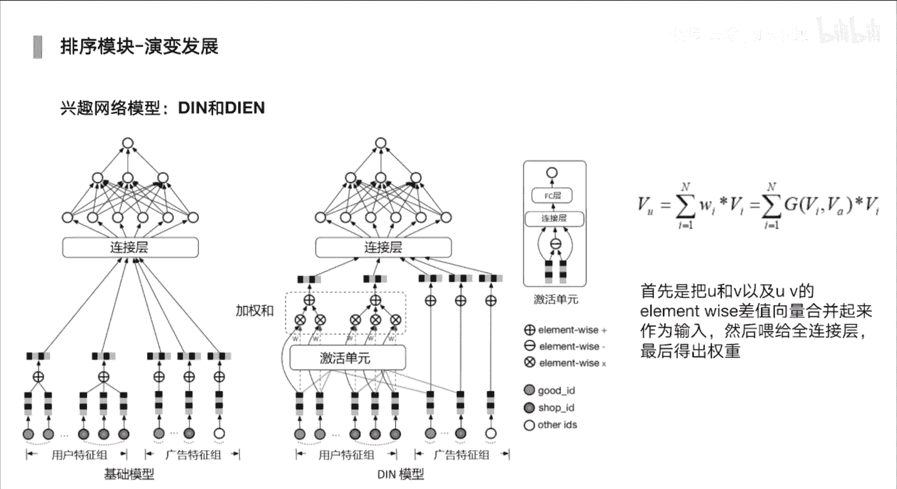

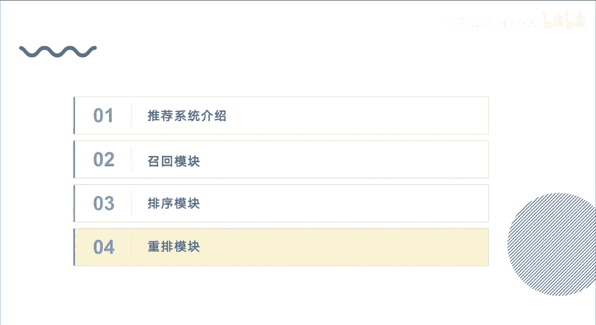

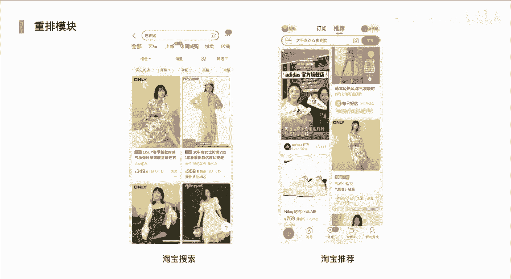

重排是连接算法与产品体验的关键环节，需要综合考虑算法分数和产品策略。

## 课程总结与展望 📚

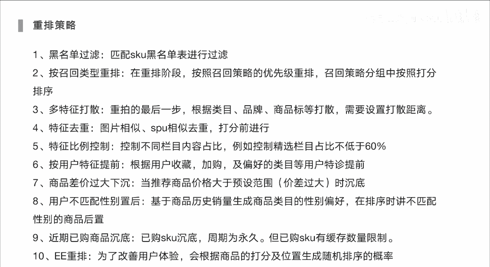

本节课中，我们一起学习了推荐系统的核心框架与关键技术。我们从推荐系统的商业价值与挑战出发，详细剖析了**召回**、**排序**、**重排**三大核心模块。

在召回部分，我们介绍了从经典的协同过滤、关联规则，到现代的向量化召回、多兴趣召回、图神经网络召回等多种技术，它们从不同角度“大海捞针”，快速筛选候选集。在排序部分，我们回顾了模型从线性模型、因子分解机到深度兴趣网络的演进历程，看到了模型如何变得越来越复杂以追求极致的精准度。最后，我们了解了重排阶段如何通过策略调整，使推荐结果更加多样、合理，提升用户体验。


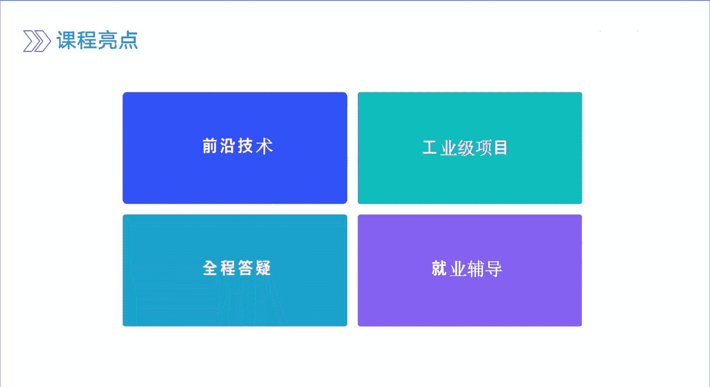

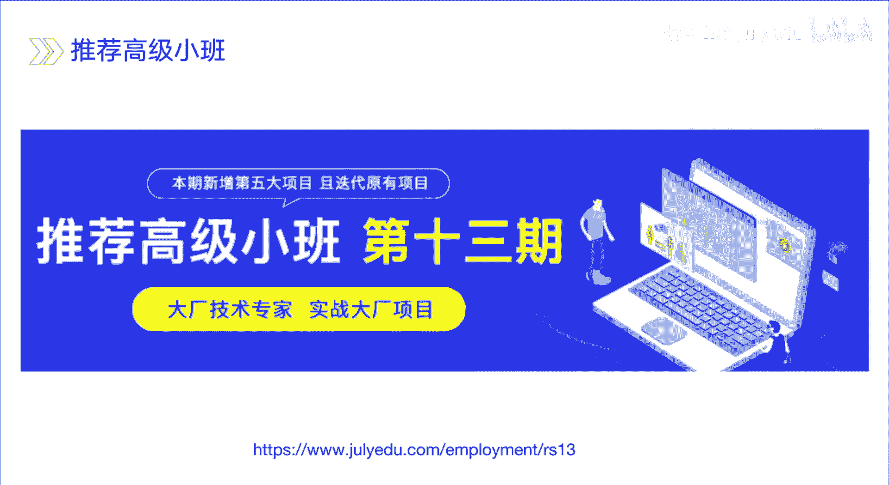

推荐系统是一个庞大且快速发展的领域，本节课只是一个入门串讲。要深入掌握工业级推荐系统的构建，还需要学习更具体的模型细节、特征工程方法、大数据平台工具以及项目实战经验。希望本次课程能为你打开推荐系统的大门，指引进一步学习的方向。