# 人工智能—推荐系统公开课（七月在线出品） - P2：大数据到推荐算法工程师的成长之路 🚀


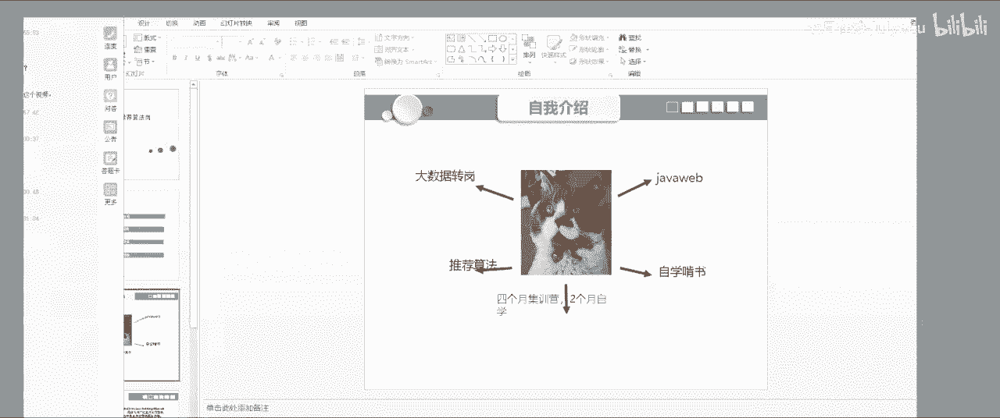

## 概述

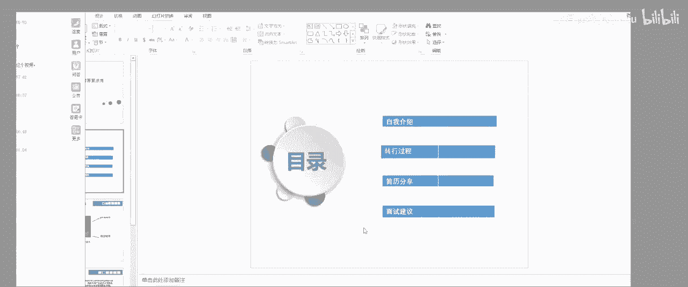

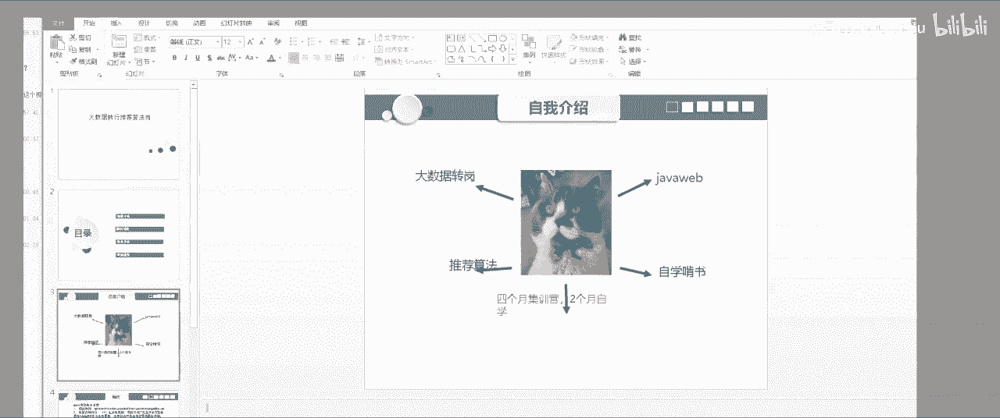

在本节课中，我们将跟随一位从大数据工程师成功转型为推荐算法工程师的讲师的经历，学习其成长路径、学习方法、项目实践以及面试经验。课程内容涵盖推荐系统的核心概念、技术栈构成、项目实战细节以及求职面试的关键要点。

## 个人转型经历

我于2015年毕业，最初从事Java Web开发工作。半年后，我决定转行，开始自学大数据技术，并找到了一份大数据相关的工作。在工作中，我接触了ETL和数据仓库，但始终不清楚这些数据的最终用途。


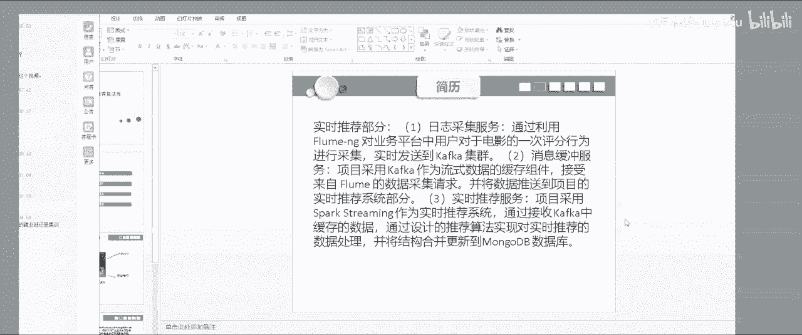

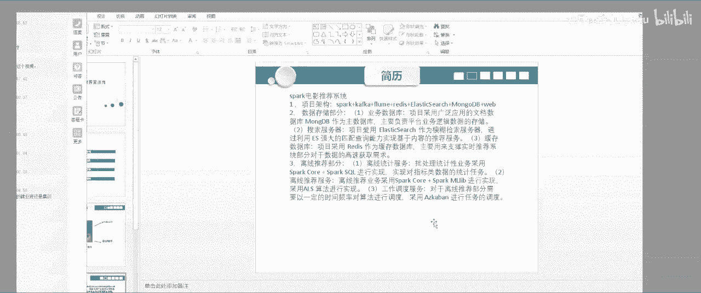

后来，我接触到机器学习和推荐算法，并决定从大数据领域转向算法领域。起初，我通过自学啃书，但效率低下且知识不成体系。最终，我选择报名七月在线的课程，系统性地构建了自己的知识架构。

## 学习方法与知识构建

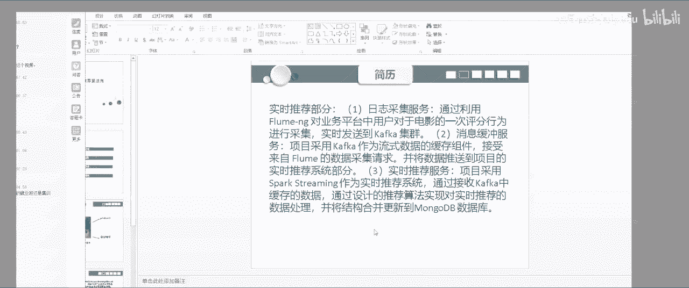

由于我有数学专业背景，学习数学基础部分相对较快。七月在线的课程讲解非常到位，细节清晰。为了掌握知识，我采取了以下方法：

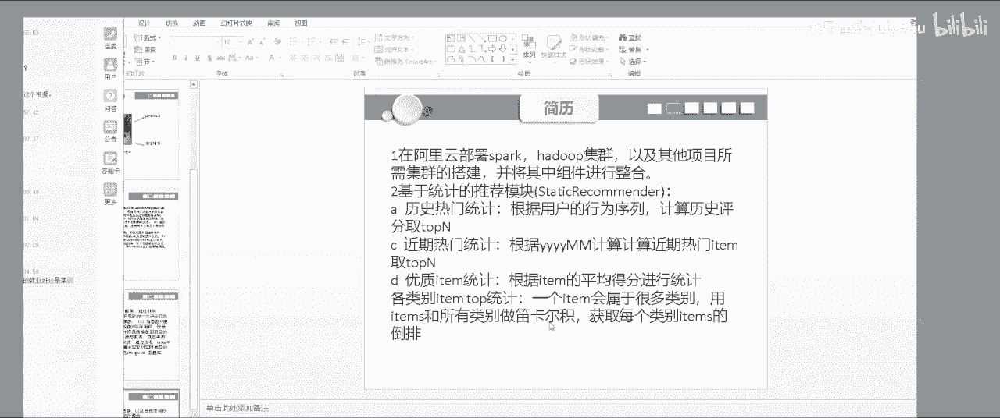

*   反复观看视频，每个视频都看了好几遍。
*   用笔记本记录所有知识点，并手动推导一遍。
*   动手实践，用Python实现核心算法，例如决策树和逻辑回归（LR）。

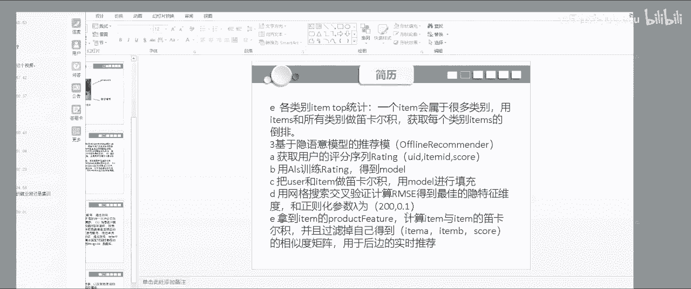

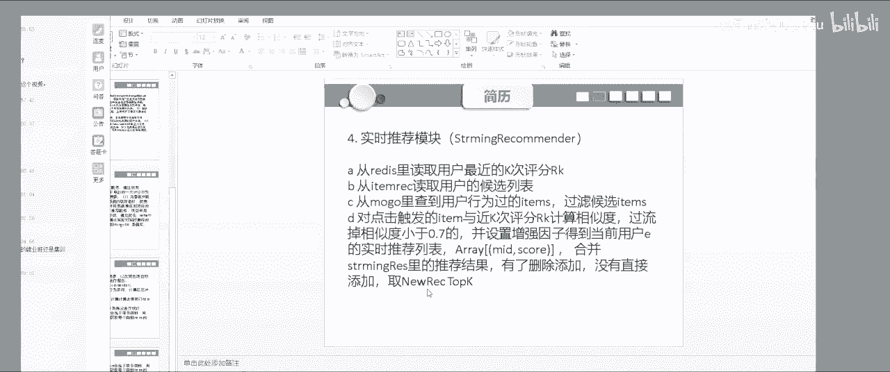

**决策树的核心思想是递归**，其伪代码如下：
```python
def build_tree(data):
    if 满足终止条件:
        return 叶子节点
    else:
        选择最佳特征进行分割
        左子树 = build_tree(左子集)
        右子树 = build_tree(右子集)
        return 决策节点(特征， 左子树， 右子树)
```

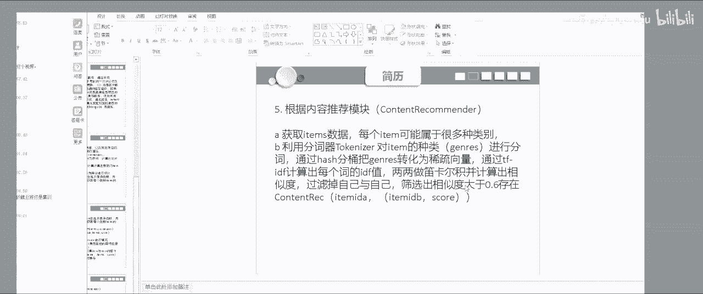

我认为编码能力和对原理的理解比掌握模型的数量更重要。

## 推荐系统项目实战：Park电影推荐系统

得益于之前的大数据经验，我在搭建系统环境时比较顺利。我在阿里云租用了三台服务器来搭建整个架构。

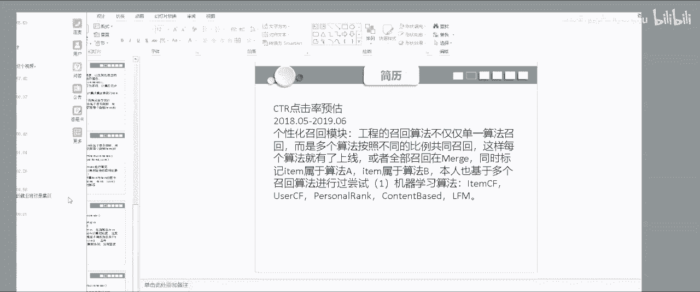

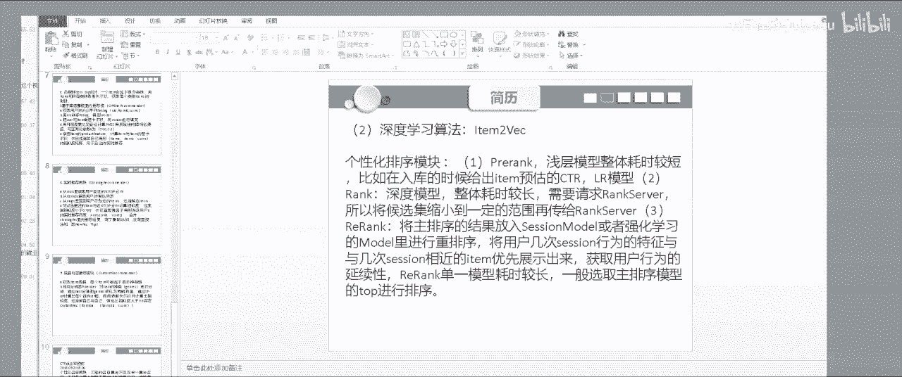

### 离线推荐：基于ALS的协同过滤

项目使用了Spark MLlib中的**交替最小二乘法（ALS）**进行矩阵分解，得到物品（item）之间的相似度矩阵。

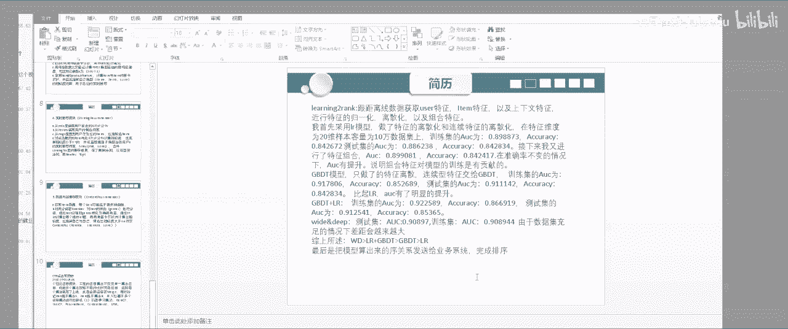

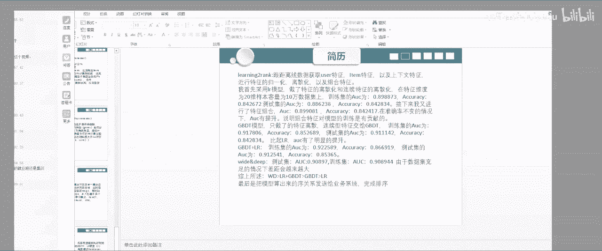

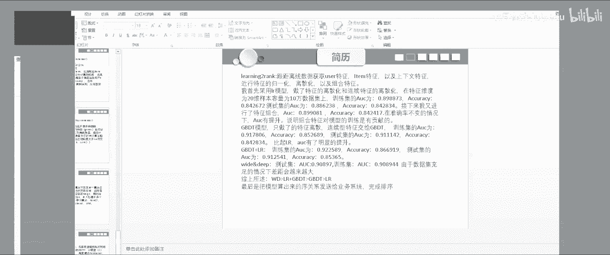

**矩阵分解公式可以简化为**：`R ≈ P * Q^T`，其中R是用户-物品评分矩阵，P是用户隐因子矩阵，Q是物品隐因子矩阵。

计算出的相似度矩阵被缓存起来，供线上实时推荐使用。

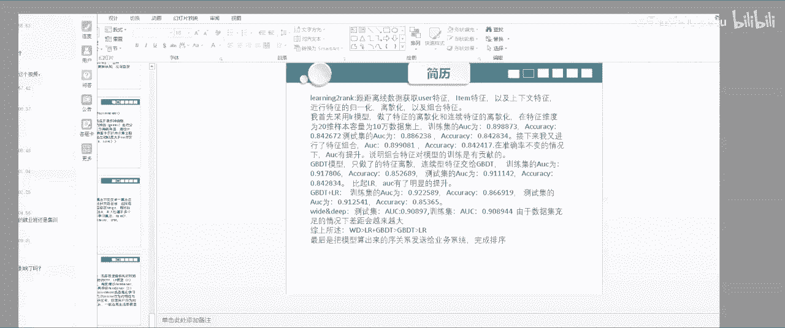

### 实时推荐

实时推荐的核心是维护一个**推荐列表堆（Heap）**。当用户点击一个物品时，系统会根据该物品与用户历史行为物品的相似度进行计算，并实时更新这个推荐列表。因此，用户的推荐列表是动态变化的。

### 基于统计的召回策略

除了协同过滤，项目还实现了基于统计特征的召回策略，例如“近期热门”。其核心是根据时间窗口（如按年月划分）对物品进行分组，然后根据评分进行加权排序。

### 基于内容的召回策略

项目还实现了基于电影名称的推荐，使用了**TF-IDF**算法将电影名称转化为向量，然后计算电影之间的余弦相似度，最后进行推荐。

**TF-IDF计算公式**：`TF-IDF(t, d) = TF(t, d) * IDF(t)`，其中`TF`是词频，`IDF`是逆文档频率。

无论是基于评分、统计还是内容，**推荐系统的核心任务之一就是计算相似度**。

## 面试经验与知识深度

在面试中，仅掌握ALS一种召回算法是不够的。面试官可能会深入询问以下问题：

*   **多种召回算法**：如Item-CF, User-CF, LFM（隐语义模型）的原理与区别。
*   **冷启动问题**：如何为新用户或新物品进行推荐。
*   **数据倾斜与性能**：当物品数量极大时，如何维护和优化相似度矩阵的计算与存储。一个可行的思路是结合物品类别信息，使用倒排索引或聚类方法，先筛选出具有潜在相似性的物品对，再进行精细计算。
*   **公式推导**：可能会要求手推LFM等模型的公式。

### 排序模型实践

在排序阶段，我实践了多种模型，并观察了模型融合的效果：

1.  **逻辑回归（LR）**：使用基础特征时，AUC（模型评价指标）一般。
2.  **LR + 特征组合**：加入组合特征后，AUC有明显提升。
3.  **梯度提升树（如XGBoost/LightGBM）**：AUC进一步提升。
4.  **GBDT + LR**：进行模型融合，效果通常优于单一模型。
5.  **深度学习模型**：在数据量充足时，其效果通常优于传统的机器学习模型组合。

最终效果排序大致为：深度学习 > GBDT+LR > GBDT > LR。

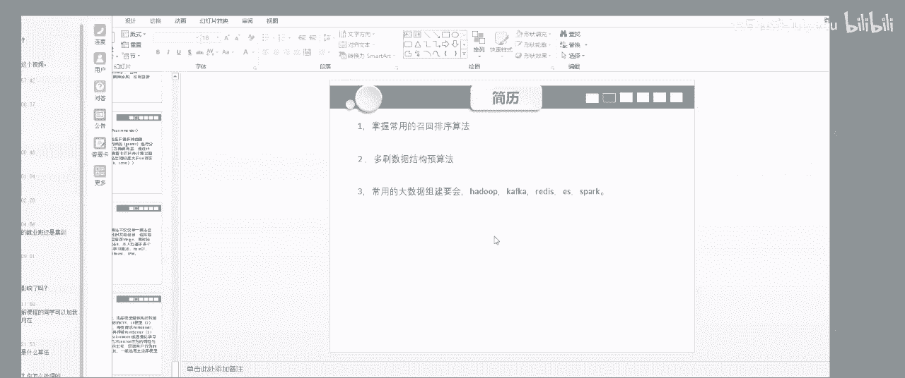

## 技术广度与深度建议

推荐算法工程师不仅需要算法深度，还需要相关的技术广度来构建完整的系统。

*   **大数据基础**：必须熟悉大数据生态，因为训练数据通常来自日志，代码运行在集群上。需要了解Hadoop、Spark、Kafka等组件的原理和使用。
    *   **数据倾斜处理**：需要理解其原理（如Shuffle阶段Key分布不均），并知道解决方案（如使用Combiner预聚合、加盐打散Key等）。
*   **编程与数据结构**：算法工程师的核心竞争力之一是扎实的编程能力和数据结构基础。面试中常要求手写代码，如链表、排序、堆栈等，并能分析时间/空间复杂度。
*   **系统架构**：形成自己的技术知识体系，能够清晰地描述推荐系统的整体架构（从数据采集、ETL、模型训练到线上服务）。

## 当前工作与扩展

目前我在公司从事与外卖推荐及物流调度相关的算法工作。例如，使用**层次聚类**和**凸包扫描算法**（Graham Scan）来解决商圈划分和骑手调度路径优化问题。这类问题大量运用了数据结构和几何计算知识。

**凸包扫描算法核心**：通过计算向量的叉积来判断点的转向，从而逐步构建凸包。

## 总结

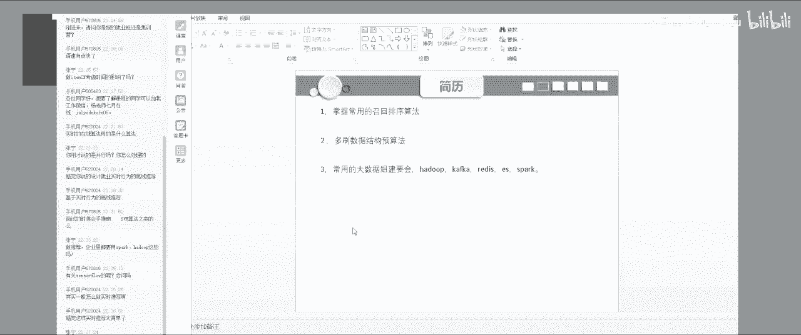

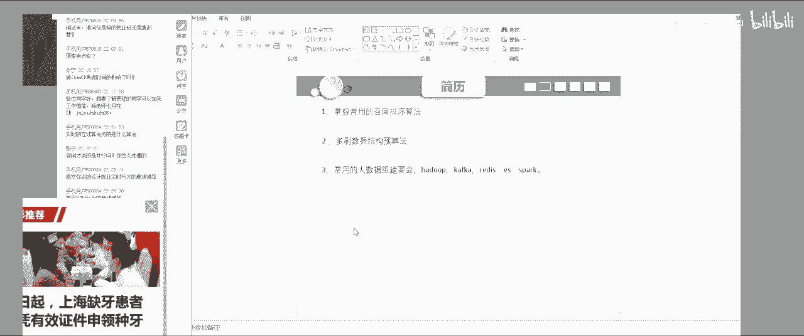

本节课我们一起学习了从大数据转型到推荐算法工程师的完整路径。关键点包括：

1.  **系统学习**：通过体系化课程（如七月在线）构建知识框架，并辅以反复学习和手动推导。
2.  **项目驱动**：动手实现一个完整的推荐系统项目，涵盖离线/实时推荐、多种召回与排序策略。
3.  **深入原理**：不仅要会用，还要理解多种召回算法（ALS, Item-CF, LFM等）和排序模型（LR, GBDT, 深度学习）的原理与差异。
4.  **拓宽视野**：掌握必要的大数据技能（处理数据倾斜、集群原理）和扎实的编程与数据结构基础。
5.  **面试准备**：形成自己的知识体系，能够清晰阐述项目细节、技术选型和解决方案。

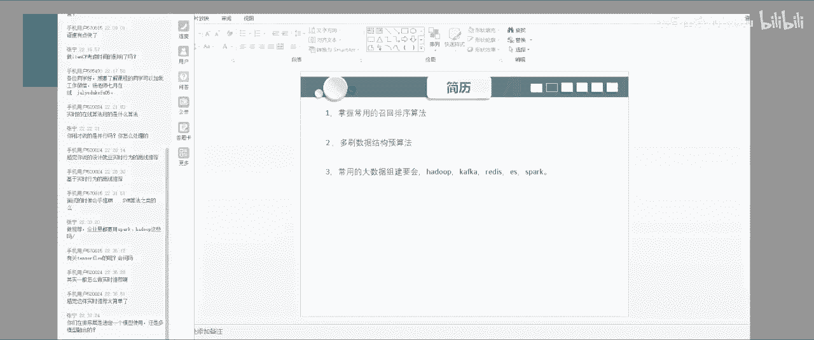

对于有志于进入推荐系统领域的同学，建议聚焦推荐算法本身，同时打好计算机基础，并积极进行项目实践，这样就能在求职市场中具备较强的竞争力。