# 🛒 人工智能—推荐系统公开课（七月在线出品） - P3：带你实战电商平台的推荐系统


在本节课中，我们将学习如何从零开始，使用一个真实的电商平台日志数据来训练一个推荐系统模型。我们将重点关注数据处理、模型训练、特征工程以及调参过程中的常见陷阱和最佳实践。

---

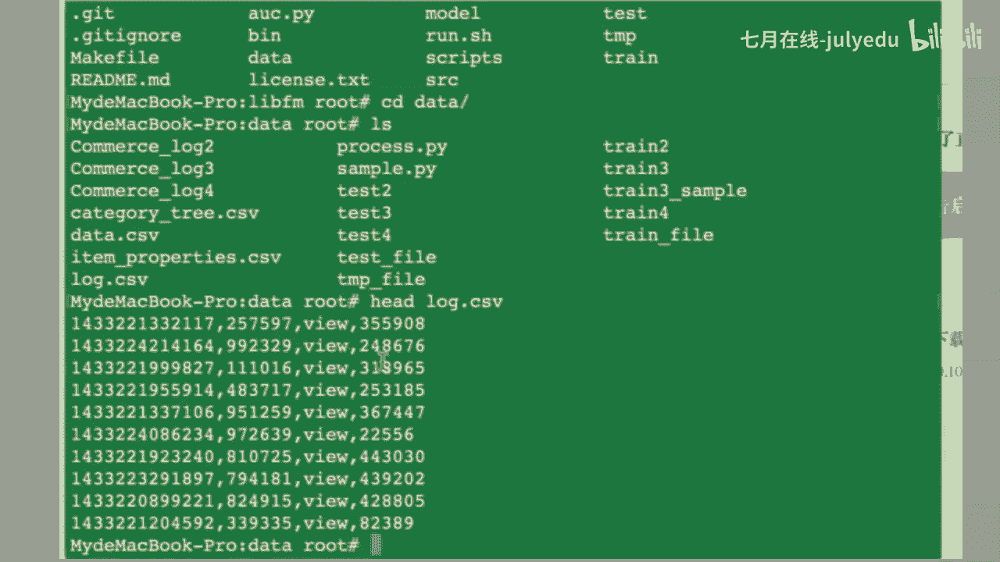


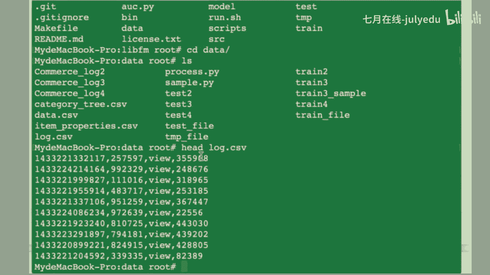

## 📊 课程概述

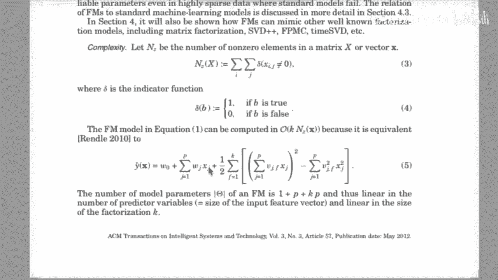

本节课的核心目标是使用 `libFM` 模型对电商用户行为日志进行训练，构建一个点击率预估模型。我们将从原始数据出发，逐步完成数据预处理、特征编码、模型训练和效果评估的全过程。过程中会特别强调数据处理的正确逻辑和模型理解的深度，避免初学者常犯的错误。

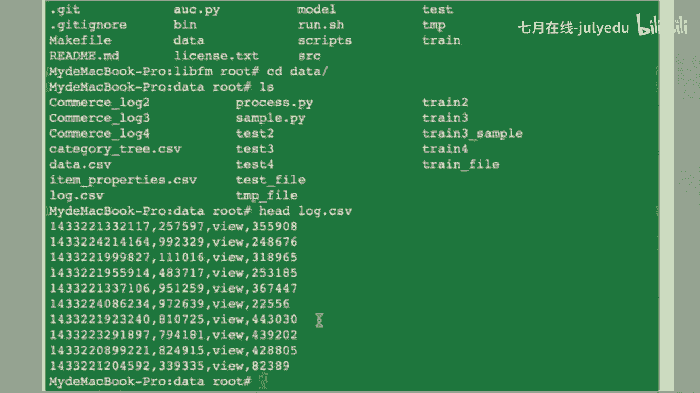


---

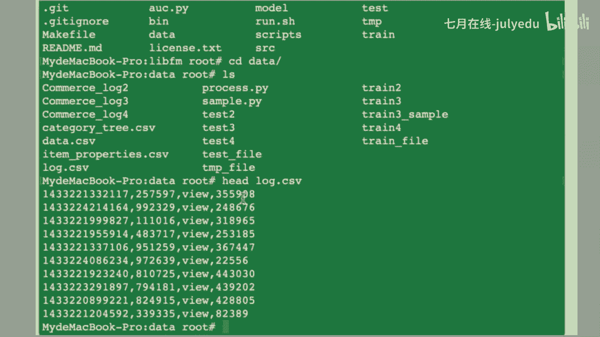

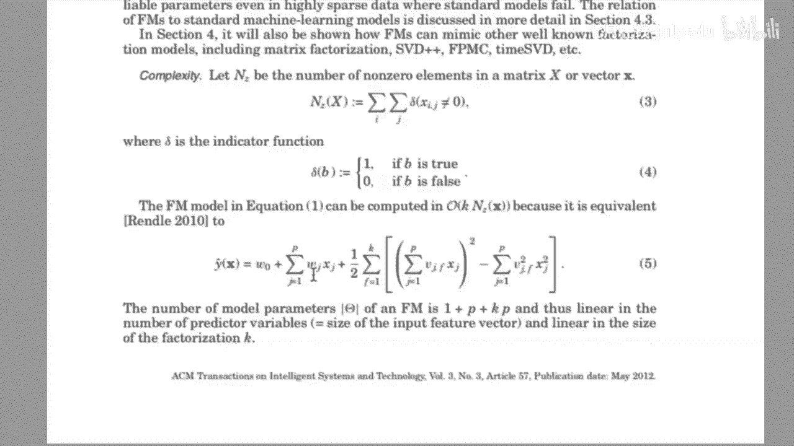

## 🔍 数据与问题定义

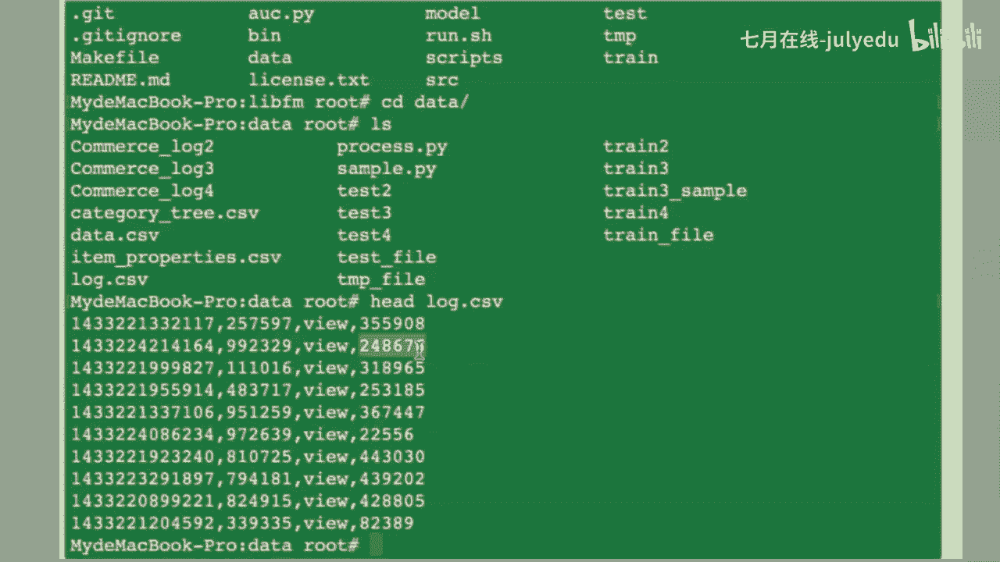

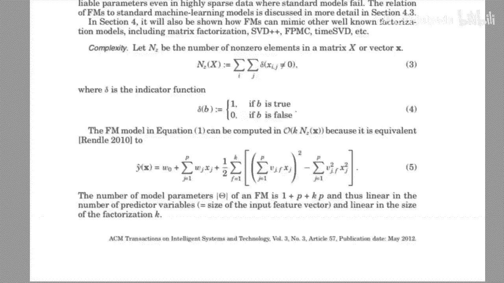

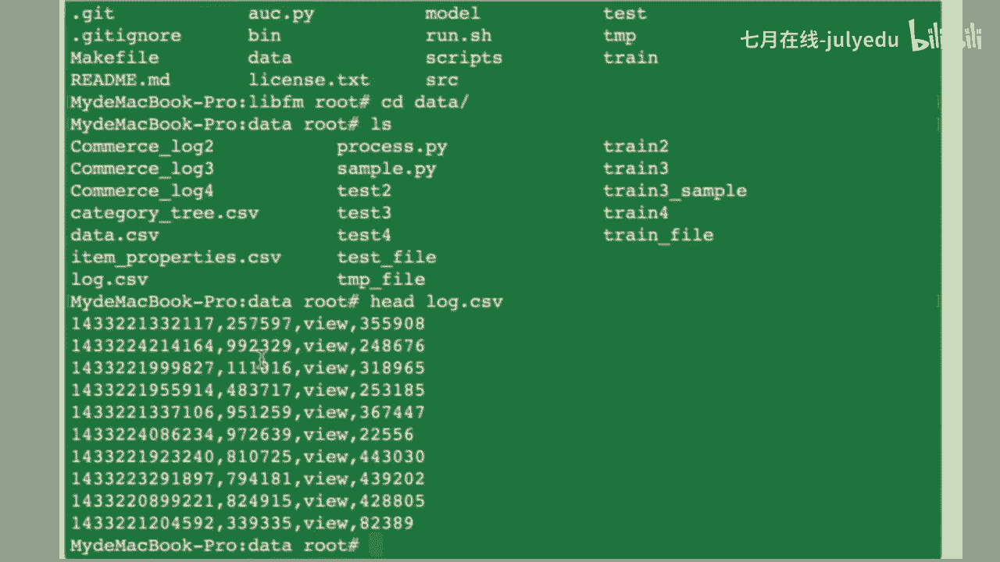

我们拥有的数据是电商平台的用户行为日志，主要包含以下字段：时间戳、用户ID (`user_id`)、商品ID (`item_id`)、商品类目ID (`category_id`) 以及行为类型（如浏览 `view` 和交易 `transaction`）。我们将交易行为视为正样本，浏览行为视为负样本。

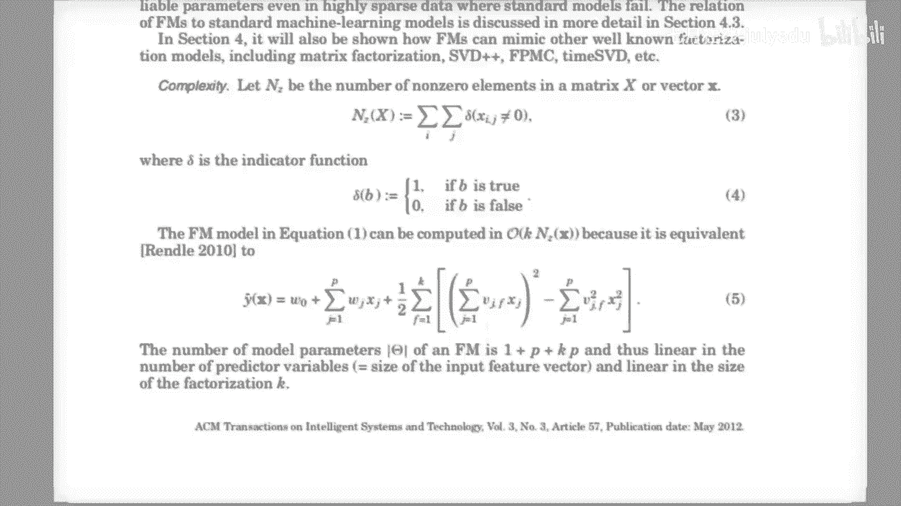

我们的任务是：仅使用 `user_id` 和 `item_id` 这两个ID类特征，训练一个 `libFM` 模型来预测用户对商品发生交易行为的概率。

首先，我们面临一个基础但关键的问题：直接将 `user_id` 和 `item_id` 两列数据抽取出来，丢给 `libFM` 模型进行训练，这样做是否合理？

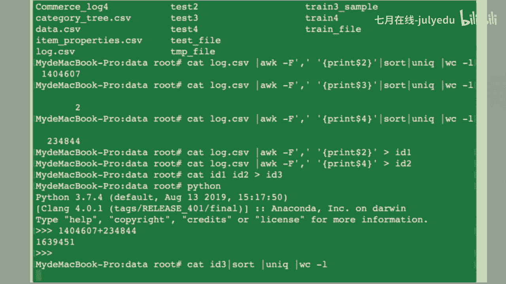

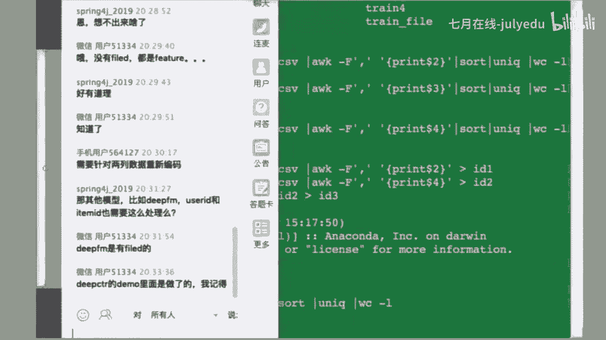

---

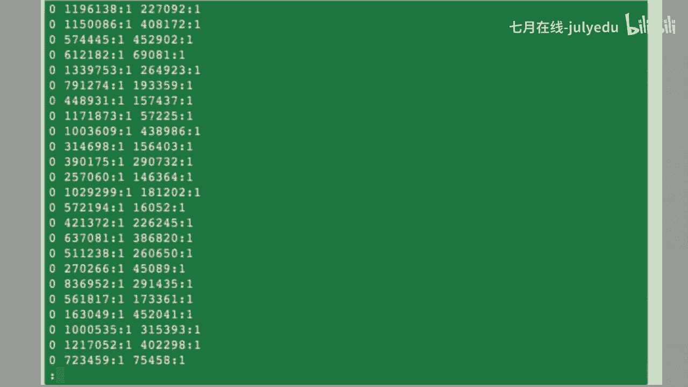

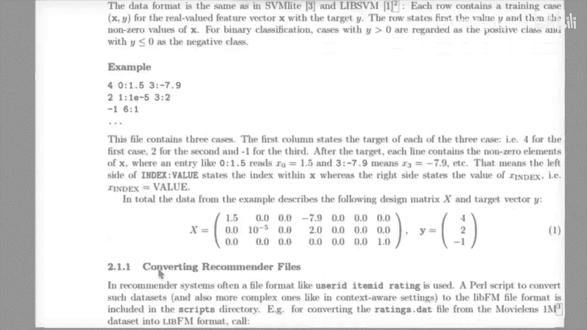

## ⚠️ 核心陷阱：特征ID冲突

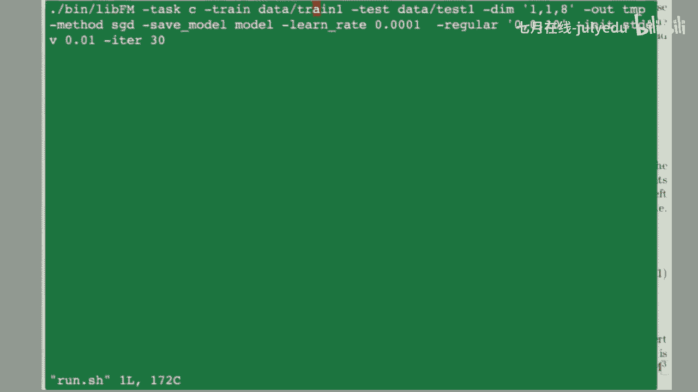

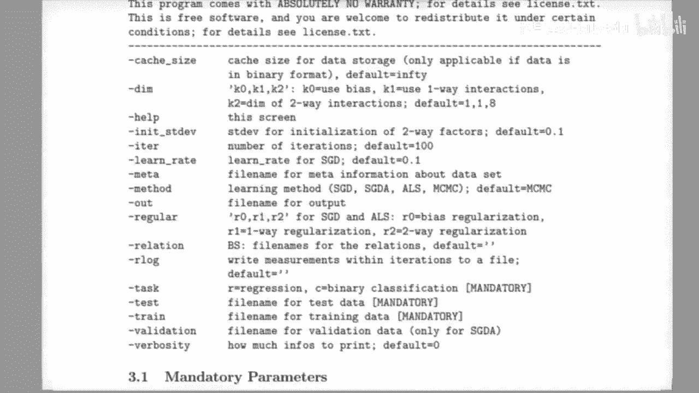

直接将 `user_id` 和 `item_id` 作为特征输入模型存在一个严重问题：**ID冲突**。

`libFM` 模型会将所有输入的特征视为同一空间下的ID进行处理。如果 `user_id` 和 `item_id` 的取值有重叠（例如，存在一个ID既是某个用户的ID，又是某个商品的ID），那么模型就会错误地将它们视为同一个特征，学习同一个隐向量。这显然不符合业务逻辑，因为用户和商品是完全不同的实体。

**解决方案**：我们必须对来自不同域（Field）的ID进行全局唯一的重编码（Re-encoding）。例如，为所有 `user_id` 加上前缀 `“U_”`，为所有 `item_id` 加上前缀 `“I_”`，确保它们在特征空间中是独一无二的。

```python
# 示例：全局唯一编码逻辑
feature_dict = {}
current_id = 0

def get_or_add_id(feature_value, prefix):
    global current_id
    key = f"{prefix}_{feature_value}"
    if key not in feature_dict:
        feature_dict[key] = current_id
        current_id += 1
    return feature_dict[key]

# 对每条样本中的 user_id 和 item_id 进行编码
encoded_user_id = get_or_add_id(raw_user_id, "U")
encoded_item_id = get_or_add_id(raw_item_id, "I")
```

上一节我们明确了数据输入前的关键处理步骤，本节中我们来看看如何构建训练流程并评估模型。

---

## 🚀 模型训练与初步评估

在完成正确的特征编码后，我们可以开始训练模型。我们使用 `libFM` 进行训练，初始参数设置如下：
*   学习率 (`learn_rate`): 0.001
*   正则化参数 (`regularization`): 0.01
*   隐向量维度 (`dimension`): 8
*   迭代轮数 (`iteration`): 30

训练完成后，我们首先观察模型的准确率（Accuracy）。然而，在正负样本极不均衡（如点击率仅为千分之八）的场景下，准确率是一个**不可靠的指标**。模型只需将所有样本预测为负类，就能获得很高的准确率，但这没有任何意义。

**正确的评估指标**：我们应该使用 **AUC (Area Under Curve)** 来评估模型的排序能力。AUC衡量的是模型将正样本排在负样本前面的概率，对样本比例不敏感。

我们首次训练得到的AUC为 **0.5**。这是一个危险的信号，因为AUC=0.5等同于随机猜测，说明模型完全没有学到任何规律。

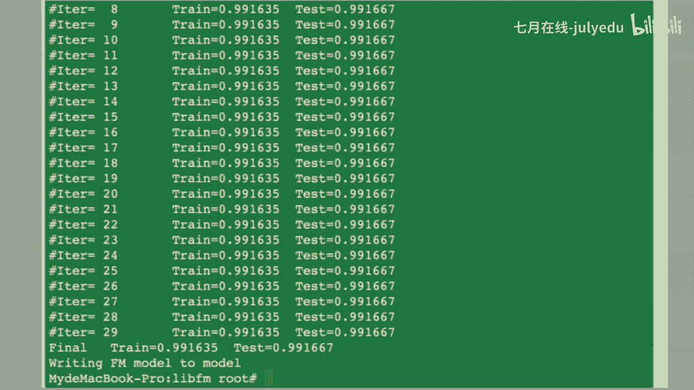


---

## 🔧 调试与问题排查

当遇到AUC=0.5时，我们的第一反应不应该是怀疑模型能力或盲目增加特征，而应该**系统性地排查流程中的Bug**。

以下是标准的排查思路：
1.  **检查数据**：确认训练集和测试集是否正确分离，是否有数据泄露。
2.  **检查特征**：确认特征编码是否正确，特别是之前提到的ID冲突问题是否已解决。
3.  **检查代码**：确认数据读取、格式转换、模型调用流程是否有误。
4.  **检查配置**：确认模型参数是否在合理范围内。

在我们的案例中，问题出在**使用了错误的测试集文件**。修正后，重新评估得到的AUC上升至 **0.8046**。这验证了流程的正确性。

---

## ⚙️ 模型调参实践

得到一个baseline后，我们可以尝试通过调参来提升模型效果。调参需要理解每个参数的意义：

*   **学习率 (`learn_rate`)**：控制参数更新的步长。太大可能导致无法收敛到最优点，太小则收敛过慢。我们从0.001尝试调大到0.01，发现AUC下降；调小到0.0005，AUC有轻微提升。
*   **迭代轮数 (`iteration`)**：增加迭代轮数让模型有更多机会学习。我们尝试了60轮和100轮，发现AUC反而略有下降，说明30轮已足够收敛。
*   **隐向量维度 (`dimension`)**：增加维度可以增强模型的表达能力。我们将维度从8增加到16，AUC从0.8046提升到了 **0.805**，获得了微小但稳定的提升。

**重要认知**：在工业界，通常不会进行耗时的网格搜索（Grid Search），而是依靠经验（Experience）进行快速调试。参数调优的收益往往是边际递减的，尤其是在千分位、万分位上的波动。

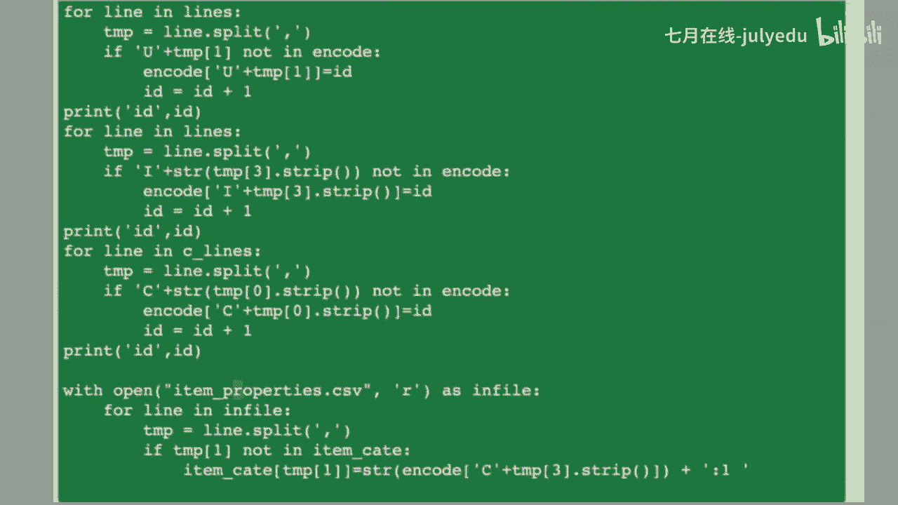

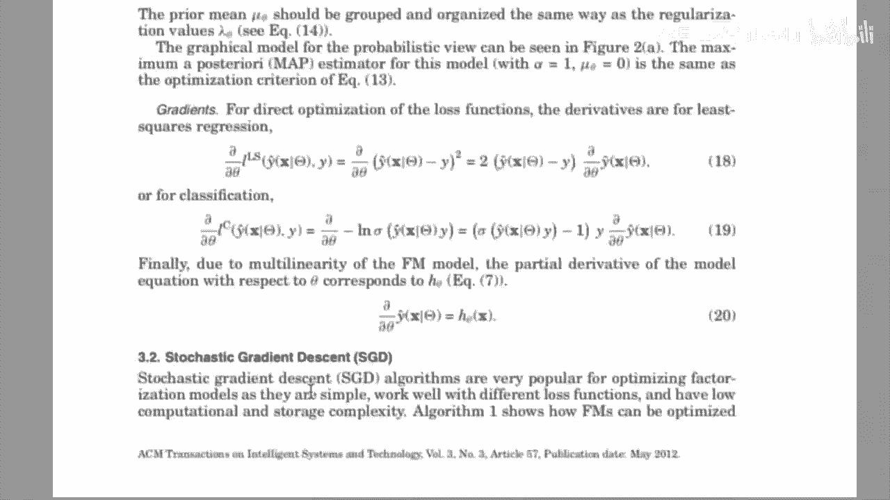

---

## 🧩 特征工程尝试：加入类目特征

为了进一步提升模型，我们考虑引入新的特征：商品类目ID (`category_id`)。我们希望模型能学习到“用户对某类商品的偏好”。

然而，加入新特征需要格外小心：
1.  **唯一编码**：`category_id` 也需要进行全局唯一编码（例如，加上前缀 `“C_”`），避免与用户ID、商品ID冲突。
2.  **数据关联**：需要根据 `item_id` 去关联对应的 `category_id`。注意，一个商品可能属于多个类目（一对多关系），处理代码需要能容纳这种关系。
3.  **模型特性**：`libFM` 是一个不考虑特征顺序的模型，因此我们不需要（也无法）利用 `category_id` 出现的时间序列信息。

加入 `category_id` 特征后，模型AUC**显著下降至0.7左右**。这说明新增的特征并没有带来正向收益，反而可能因为引入了噪声或与现有特征存在不利的交互，导致模型效果变差。

---

## 💡 核心总结与进阶思考

本节课我们一起学习了电商推荐系统实战的完整流程：

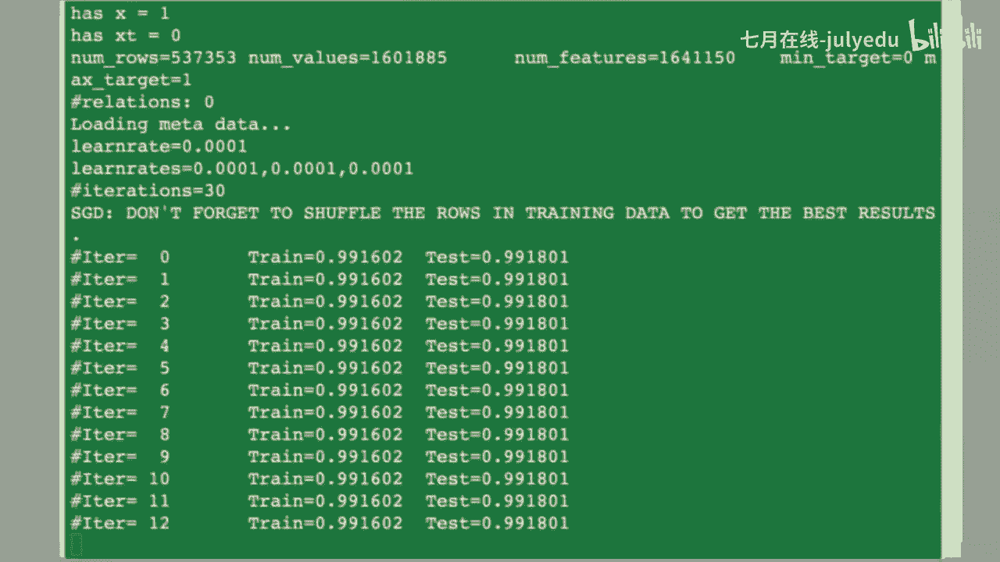

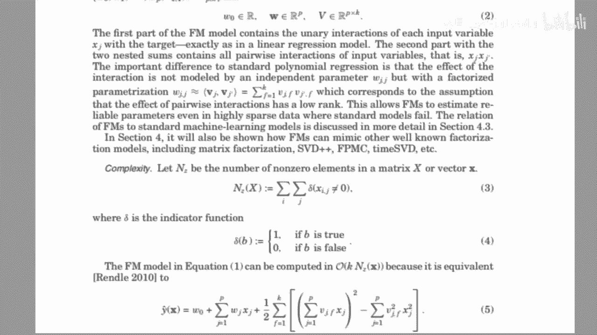

1.  **数据预处理是基石**：正确处理特征ID的唯一性是模型生效的前提，否则一切后续工作都是徒劳。
2.  **选择正确的评估指标**：在类别不平衡的场景下，AUC比准确率更能反映模型的排序能力。
3.  **系统化调试**：当模型效果不佳（如AUC=0.5）时，应优先排查数据、特征、代码流程中的错误。
4.  **理解调参的意义**：调参是在模型结构和特征确定后，寻找最优解的过程。理解参数对模型的影响比盲目搜索更重要。
5.  **特征工程的双刃剑**：不是所有特征都是有益的。增加特征可能带来负面影响，需要仔细评估和调试。特征的有效性往往与模型特性紧密相关。

**对于本案例的进一步优化，最大的潜力可能在于：**
*   **统计特征离散化**：例如，计算“用户的历史点击率”、“商品的热度”等统计值，并将其离散化（分桶）后作为新的特征加入模型。这类特征往往能提供强大的信息。
*   **深入理解模型**：`libFM` 本身已经在进行特征间的二阶交互（通过隐向量内积）。所谓的“特征交叉”已由模型自动完成。盲目地手动构造交叉特征可能事倍功半。

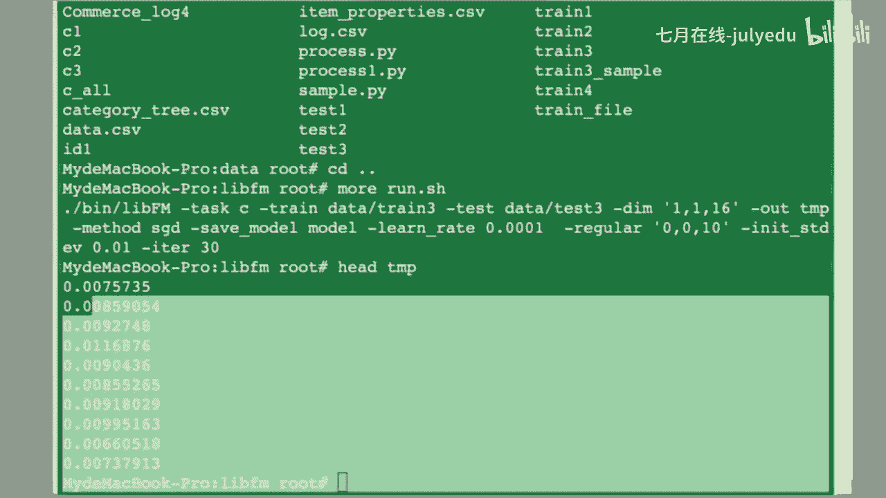

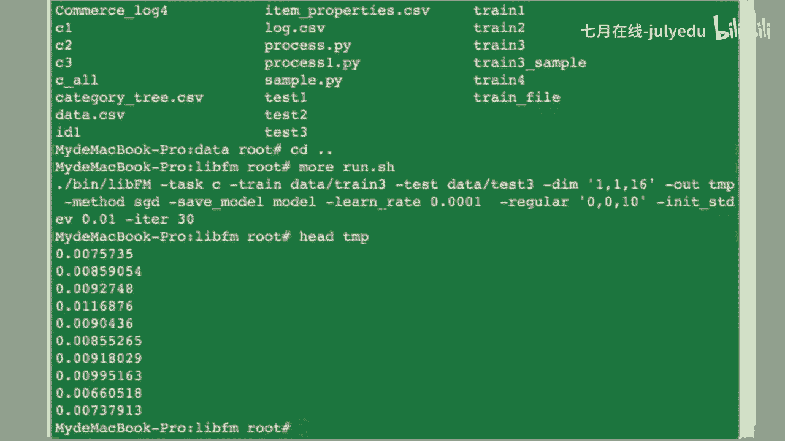


最终，推荐算法工程师的核心能力在于：**对业务的理解、对数据的敏感、对模型原理的深刻认知，以及通过“Just Do It”的实践精神去不断试错和积累经验**。本节课演示的每一个“坑”和解决方案，都是实践中宝贵的经验。