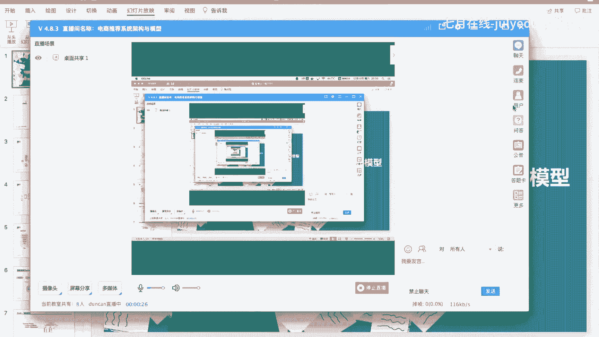
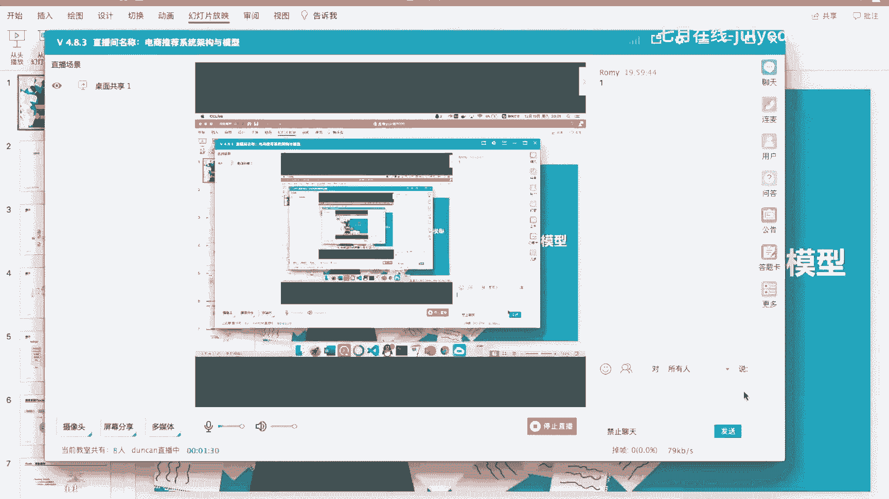
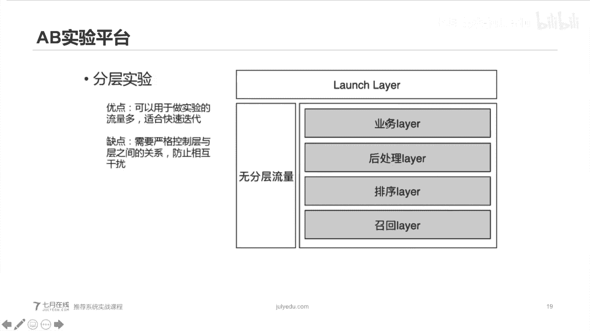
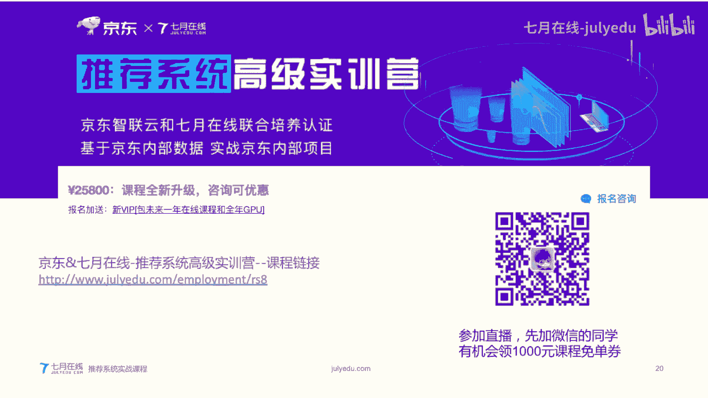
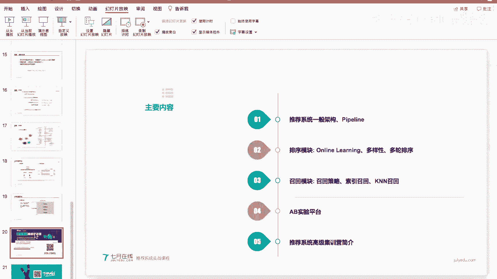
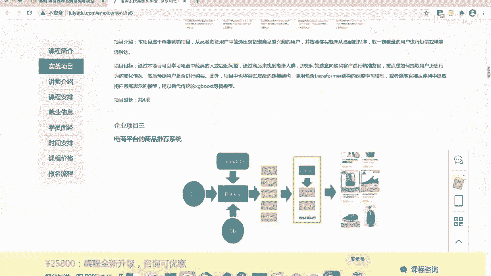
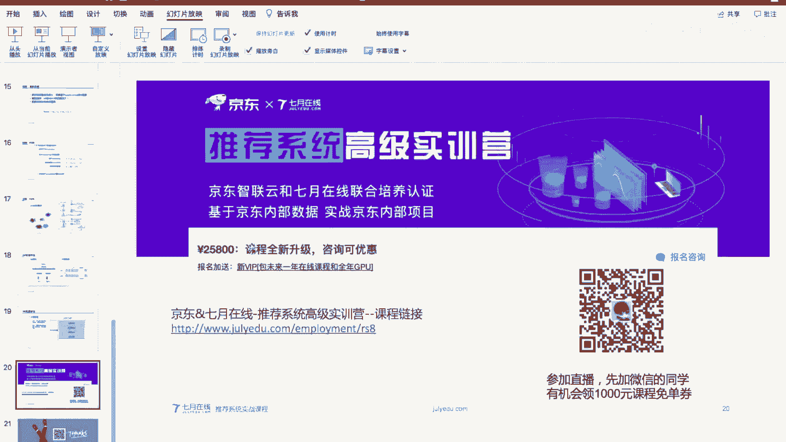
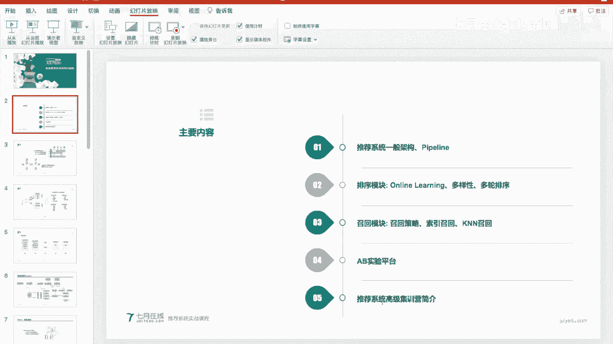
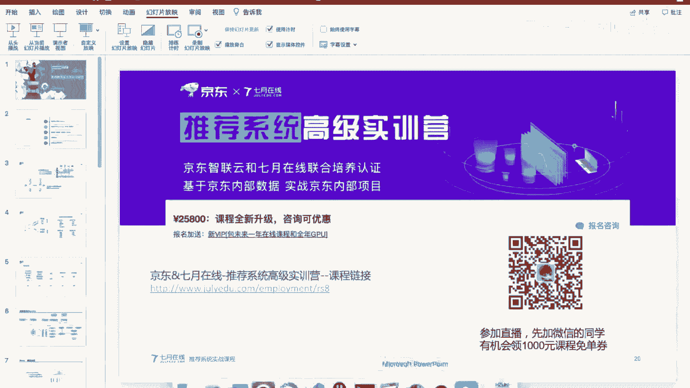

# 人工智能—推荐系统公开课（七月在线出品） - P4：电商推荐系统架构与模型 📚








在本节课中，我们将要学习电商推荐系统的核心架构与模型。我们将从推荐系统的一般流程开始，深入探讨排序和召回两大核心模块的工作原理，并了解线上AB实验平台如何科学地评估模型效果。课程内容力求简单直白，适合初学者理解。

## 一、推荐系统的一般架构与流程 🔄

上一节我们介绍了课程概述，本节中我们来看看推荐系统的基础架构。

推荐系统最经典的算法是协同过滤，它分为基于用户的协同过滤和基于物品的协同过滤。其核心思想是构造一个用户-物品的交互矩阵。矩阵的每一行代表一个用户，每一列代表一个商品。如果用户购买或点击了某商品，则标记为1，否则标记为0。

**公式：** 用户-物品交互矩阵 `R`，其中 `R[u][i] = 1` 表示用户 `u` 对物品 `i` 有正向行为。

基于此矩阵，可以计算用户或物品之间的相似度，从而进行推荐。然而，现代电商推荐系统已较少直接使用协同过滤，更多采用基于学习的排序方法。

电商推荐与新闻推荐存在差异。新闻推荐主要优化点击率、停留时长和用户留存，推荐内容是文章或视频。电商推荐的核心优化目标是销售额和成交转化，推荐内容主要是商品。

一个典型的用户交互流程是：用户打开应用，推荐引擎在几百毫秒内返回结果，用户产生点击、加购等行为，这些行为被记录到日志服务器中，用于离线构建用户画像和训练模型。

推荐系统的核心流程通常包括召回、过滤、排序、再过滤和调整几个步骤。其中，召回和排序是算法最核心的部分。

整个系统的流水线可以概括为：用户请求到达推荐引擎，引擎结合用户特征、商品特征和实时日志，通过召回和排序模型产生结果，再经过AB实验分流后返回给用户。离线部分则负责日志处理、特征工程和模型训练。

## 二、排序模块详解 🥇

上一节我们介绍了推荐系统的整体流程，本节中我们重点看看排序模块是如何工作的。

在电商平台中，目前最通用的排序模型结构是深度神经网络。模型底层是输入层，会对稀疏特征进行嵌入编码。

**代码：** 对用户ID这类稀疏特征进行嵌入操作。
```python
# 假设 user_id 是一个稀疏的整数索引
user_embedding = tf.keras.layers.Embedding(input_dim=num_users, output_dim=32)(user_id_input)
```

对于列表型特征，如用户标签，通常会对多个标签的嵌入向量进行平均或求和操作，以得到一个固定维度的向量。所有特征的嵌入向量会被拼接起来，作为DNN模型的输入。实数值特征则通常直接拼接，不做嵌入。

拼接后的向量会经过若干层全连接层，使用ReLU或Sigmoid等激活函数。模型训练通常是一个二分类任务，例如预测用户是否会点击商品。

**公式：** 模型输出为用户点击商品的概率 `P(click=1 | user, item)`。

这种DNN模型的参数量主要集中在嵌入层，因为用户和商品的数量可能达到亿级。模型训练和上线部署都较为耗时。

在线服务时，排序服务通常被单独部署。推荐主引擎将用户上下文信息发送给排序服务，排序服务加载训练好的模型进行实时打分。从模型训练到线上部署，中间需要严格的质量验证流程，以确保新模型不会引起线上故障。

为了捕捉用户实时兴趣和解决商品冷启动问题，系统还需要支持特征和模型的实时更新。这通过处理实时数据流，进行增量训练和模型更新来实现。

然而，仅按点击率排序是不够的，它可能面临三个问题：
1.  推荐结果缺乏多样性。
2.  需要平衡多个优化目标。
3.  在线计算资源有限，无法对所有候选商品打分。

以下是针对这些问题的一些解决方案：

**解决多样性问题**
一种常见方法是在排序分数中引入多样性分数。
**公式：** `最终分数 = α * 相关性分数 + (1 - α) * 新颖性分数`
其中，新颖性分数可以通过计算当前候选商品与已推荐商品集合的KL散度来衡量。算法可以采用贪心策略，逐步选择能使总体多样性分数最大的商品。

**解决多目标优化问题**
一个直接的实践方案是为每个目标单独训练模型，例如点击率模型、转化率模型。
**公式：** `综合分数 = w1 * CTR_score + w2 * CVR_score + ...`
最后对各个模型的输出进行加权融合。虽然学术界有更复杂的多任务学习模型，但在工业界，加权融合仍是常见且有效的做法。

**解决计算资源有限问题**
采用多轮排序的漏斗机制。首先从亿级商品库中通过召回策略筛选出万级候选商品，然后经过“粗排”模型筛选出千级，再经过“精排”模型筛选出百级，最后进行重排得到最终结果。越靠后的环节，模型可以越复杂，对效果的影响也越直接。

## 三、召回模块详解 🎣

上一节我们深入探讨了排序，本节中我们来看看如何从海量商品中筛选出候选集，即召回模块。

召回的目标是从上亿的商品库中，快速筛选出几千个可能相关的候选商品。其核心是建立高效的索引。

常见的召回策略包括：
*   基于物品的协同过滤
*   热门商品/类目召回
*   实时促销商品召回

召回结果依然数量庞大，因此通常会用轻量级模型进行第一轮“粗排”，例如逻辑回归或特征较少的GBDT模型，以控制计算延迟。

除了基于索引的召回，另一种常见方法是使用嵌入向量的K近邻搜索。这涉及到三个关键问题：
1.  如何生成用户和商品的嵌入向量。
2.  如何定义向量间的距离。
3.  线上如何快速检索Top-K近邻。

对于问题三，直接计算用户向量与所有商品向量的距离是不现实的。工业界采用近似最近邻搜索算法，例如对商品向量进行聚类，先计算用户向量与聚类中心的距离，再在最近的中心内搜索，从而大幅提升检索效率。

## 四、AB实验平台 ⚖️





上一节我们介绍了召回策略，本节中我们了解一下如何科学地评估不同策略或模型的效果，即AB实验。



在线上同时进行多个实验时，如果简单地将流量均匀分桶，每个实验获得的流量会很少，导致结论置信度低。因此，引入了分层实验的概念。


核心思想是将系统划分为多个正交的层，例如召回层、排序层、业务策略层。每一层都拥有100%的流量，可以独立进行实验。通过不同的哈希函数将用户请求分配到不同层的不同实验中，保证了层与层之间的实验互不干扰。

这样做的优点是每个实验都能获得充足的流量进行快速迭代。关键在于必须严格保证各层之间的正交性，避免实验结论相互污染。

## 五、课程总结与进阶学习 🚀

本节课中我们一起学习了电商推荐系统的核心知识。

我们首先回顾了推荐系统的一般架构与流程，理解了电商推荐的特点。然后，我们深入分析了排序模块，学习了DNN模型的结构、线上服务流程，以及如何解决多样性、多目标优化和计算资源限制等实际问题。接着，我们探讨了召回模块的角色与常见策略，包括索引召回和嵌入向量召回。最后，我们介绍了AB实验平台的分层设计原理，这是科学评估模型效果、进行快速迭代的基石。






由于公开课时间有限，许多细节无法展开。如果您希望深入了解工业界真实场景下的推荐系统实战，包括使用企业真实数据集进行项目演练，可以关注《推荐系统高级实训营》课程。该课程涵盖了从特征工程、深度排序模型、在线学习到多目标排序等前沿技术，并提供多个基于京东等电商平台真实数据的实战项目。






---
**注：** 课程中提到的福利活动（如领取优惠券）请以官方最新信息为准。本教程内容根据公开课内容整理，聚焦于技术知识本身。