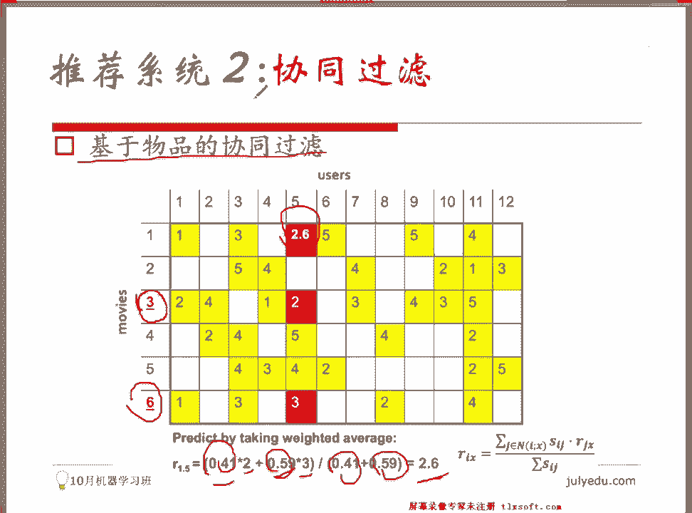

# 人工智能—推荐系统公开课（P6）：基于内容和协同过滤的推荐系统 🧠

在本节课中，我们将学习推荐系统中两种经典且重要的方法：基于内容的推荐和协同过滤推荐。我们将了解它们的基本原理、适用场景以及如何实现。

## 概述 📋

推荐系统是现代互联网应用的核心功能之一。本节课将重点介绍两种基础的推荐算法：基于内容的推荐和协同过滤推荐。我们将探讨它们如何工作、各自的优缺点以及在实际场景中的应用。

---

## 一、基于内容的推荐 📚

上一节我们概述了课程内容，本节中我们来看看第一种推荐方法：基于内容的推荐。

基于内容的推荐方法被称为 **content based recommendation**。这种方法有其独特的作用。推荐系统面临一个常见挑战，即“冷启动”问题。如果一个新平台没有大量用户历史行为数据，许多高级算法将无法有效工作。然而，基于内容的算法受此影响较小。

这种方法通常用于与文本相关的产品推荐。它完全基于用户喜欢的物品的属性进行推荐。因此，需要额外分析物品的内容。例如，分析一本书的章节、主题或作者风格，并为其添加标签。

其核心思想是：无需考虑用户之间的关联，只需考虑用户与当前商品之间的匹配程度。

### 核心概念与实现

以下是基于内容的推荐系统构建步骤：

1.  **构建物品特征向量**：为每个待推荐的内容（如新闻、书籍）构建一份特征资料。常用方法是 **TF-IDF**。
    *   **TF (Term Frequency)**：词在当前文档中出现的频率。频率越高，重要性可能越高。
    *   **IDF (Inverse Document Frequency)**：词在所有文档中出现的频率的倒数。在所有文档中出现越频繁，其区分度越低，重要性可能越低。
    *   通过TF-IDF，可以为文档中的每个词计算一个权重，从而将文档表示为一个权重向量。

    ```python
    # 伪代码示例：使用TF-IDF构建文档向量
    from sklearn.feature_extraction.text import TfidfVectorizer
    documents = [“文档1内容”, “文档2内容”, ...]
    vectorizer = TfidfVectorizer()
    tfidf_matrix = vectorizer.fit_transform(documents) # 得到文档-词权重矩阵
    ```

2.  **构建用户偏好向量**：根据用户历史浏览或喜欢的多个文档，计算这些文档向量的平均值或通过类似TF-IDF的方法，得到一个代表用户偏好的权重向量。

3.  **计算相似度并推荐**：获得物品向量和用户向量后，计算它们之间的相似度。常用方法是**余弦相似度**。
    *   公式：`cosine_similarity(A, B) = (A·B) / (||A|| * ||B||)`
    *   值越接近1，表示方向越一致，相似度越高。
    *   对所有候选物品计算与用户偏好向量的相似度，选取相似度最高的物品进行推荐。

### 示例说明

假设一个用户喜欢书籍 *《Building Data Mining Applications for CRM》*。系统会：
1.  为所有书籍（包括用户喜欢的这本）的标题构建TF-IDF向量。
2.  将用户喜欢的这本书的向量作为其偏好向量。
3.  计算其他书籍向量与该偏好向量的余弦相似度。
4.  推荐相似度最高的前三本书。

---

## 二、协同过滤推荐 🤝

上一节我们介绍了基于内容的推荐，本节中我们来看看另一种主流方法：协同过滤。

协同过滤是一种基于邻域的算法。其核心思想是“物以类聚，人以群分”。如果你想知道某部电影是否好看，可以询问兴趣相投的朋友的意见。协同过滤正是基于这种逻辑。

它主要分为两种模式：

### 1. 基于用户的协同过滤

基于用户的协同过滤的核心是找到与目标用户兴趣相似的其他用户（邻居），然后根据这些邻居的喜好来预测目标用户的喜好。

**工作流程如下：**
1.  找到与目标用户有共同评分行为的其他用户。
2.  计算目标用户与这些用户之间的相似度（如余弦相似度、皮尔逊相关系数）。
3.  选取最相似的K个用户作为“邻居”。
4.  根据邻居们对某个物品的评分，进行加权平均，预测目标用户对该物品的评分。
    *   公式（加权平均）：`预测评分 = sum(邻居相似度 * 邻居对该物品评分) / sum(邻居相似度)`

### 2. 基于物品的协同过滤

基于物品的协同过滤的核心是计算物品之间的相似度。如果用户喜欢物品A，而物品B与A非常相似，那么用户也可能喜欢物品B。

**工作流程如下：**
1.  构建用户-物品评分矩阵（一个稀疏矩阵）。
2.  计算物品之间的相似度。通常只考虑同时对两个物品都有评分的用户向量。
    *   常用相似度度量：调整余弦相似度、皮尔逊相关系数。
    *   皮尔逊相关系数公式（简化理解）：先减去各自评分的均值，再计算余弦相似度。
3.  对于目标用户未评分的物品，找出与该物品最相似的K个物品（这些物品用户已评分）。
4.  根据这K个相似物品的评分和相似度，加权预测目标用户对当前物品的评分。

### 相似度/距离度量

在协同过滤中，衡量用户或物品之间的相似性至关重要。以下是几种常见方法：

*   **欧氏距离**：衡量空间中的直线距离。距离越小，相似度越高。
    *   公式：`distance = sqrt(sum((xi - yi)^2))`
*   **杰卡德相似系数**：适用于只有交互行为（如点击、购买）而无具体评分的场景。衡量集合的交集与并集的比例。
    *   公式：`J(A,B) = |A∩B| / |A∪B|`
*   **余弦相似度**：衡量两个向量在方向上的差异，忽略长度。常用于文本和评分向量。
    *   公式：`cosine_sim(A,B) = (A·B) / (||A|| * ||B||)`
*   **皮尔逊相关系数**：衡量两个变量之间的线性相关性。在计算相似度前会先减去各自的平均值，能消除用户评分尺度不一的影响。

### 基于物品的协同过滤实例

假设有一个用户-电影评分矩阵，我们想预测用户5对电影1的评分。
1.  计算电影1与其他所有电影的相似度（例如使用皮尔逊相关系数）。
2.  发现与电影1最相似的两部电影是电影3和电影6，相似度分别为0.41和0.59。
3.  用户5对电影3评分为2，对电影6评分为3。
4.  预测用户5对电影1的评分 = `(0.41*2 + 0.59*3) / (0.41+0.59) = 2.6`

通过这种方式，可以填充评分矩阵中的空白值，从而为用户生成推荐列表。

---

## 总结 🎯

本节课中我们一起学习了推荐系统的两种基础而强大的算法。

*   **基于内容的推荐**：通过分析物品本身的属性/特征，为用户匹配与其历史喜好相似的物品。它不受“冷启动”问题严重困扰，特别适合文本、音乐等特征易于提取的领域。其核心是**TF-IDF特征提取**和**余弦相似度计算**。
*   **协同过滤推荐**：利用群体智慧进行推荐，分为基于用户和基于物品两种。
    *   **基于用户的协同过滤**：找到相似用户，根据他们的喜好做推荐。关键是计算**用户相似度**。
    *   **基于物品的协同过滤**：找到相似物品，根据用户的历史喜好做推荐。关键是计算**物品相似度**。
    *   两者都依赖于**用户-物品评分矩阵**，并使用各种**相似度度量方法**（如余弦相似度、皮尔逊相关系数）进行计算。




这两种方法奠定了现代推荐系统的基础，理解它们对于学习更复杂的混合推荐、深度学习推荐模型至关重要。