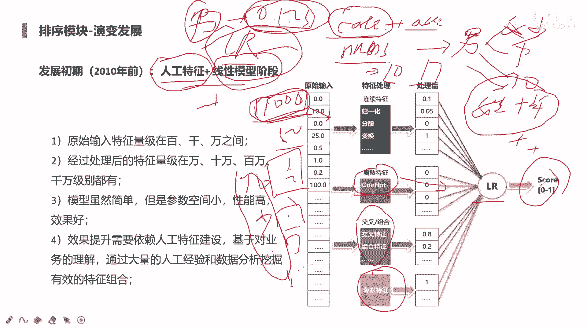
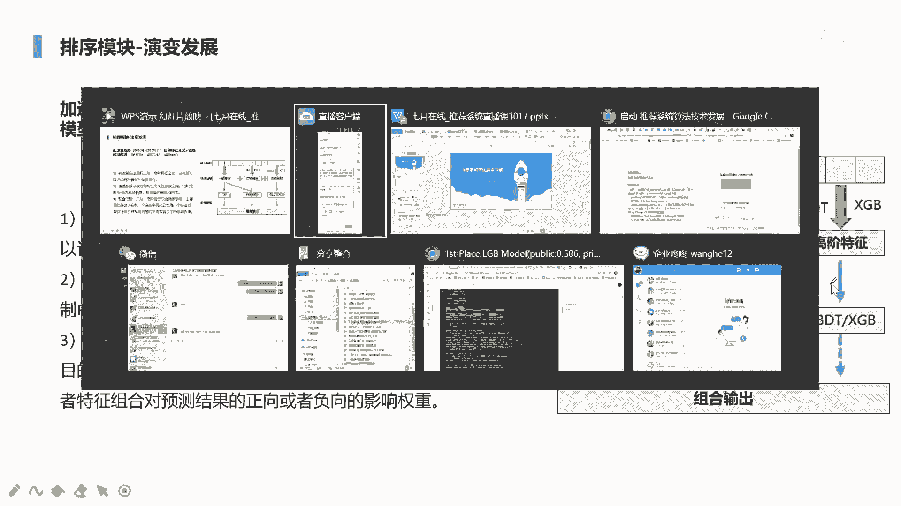
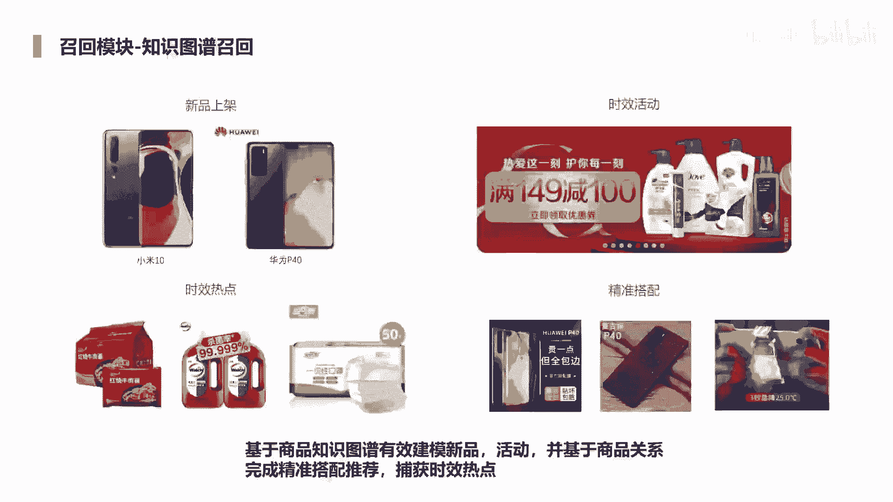
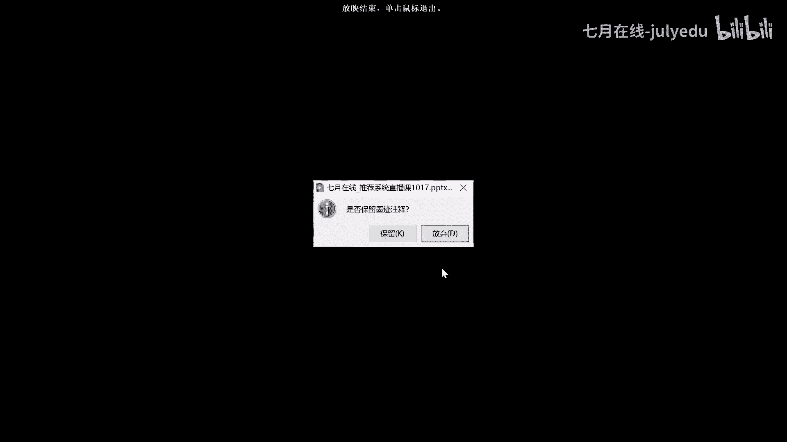
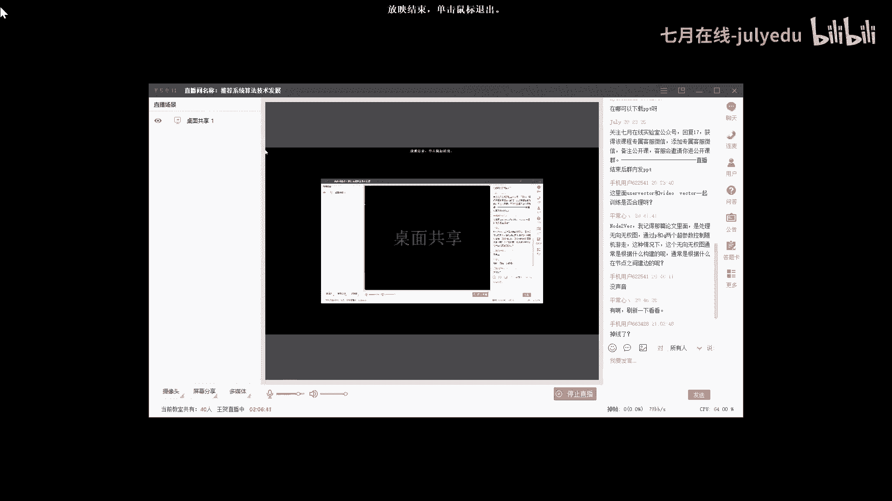
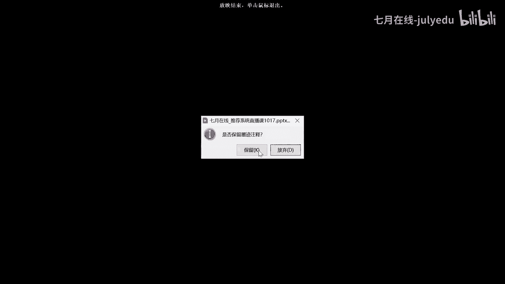
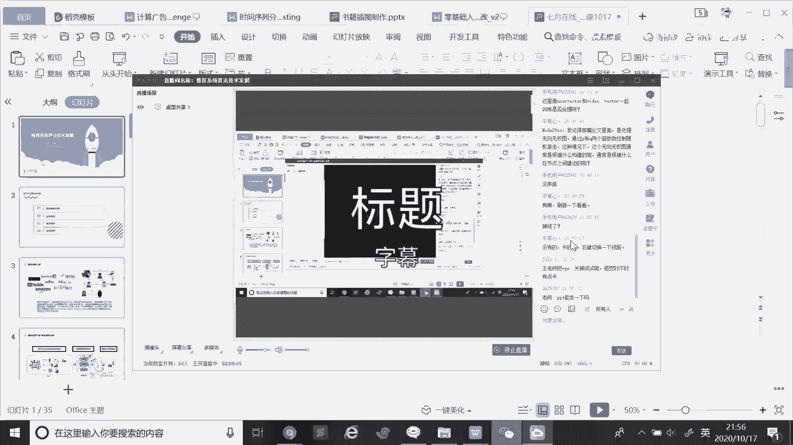

# 人工智能—推荐系统公开课（七月在线出品） - P8：推荐系统算法技术发展（各模型的演进） 📈


在本节课中，我们将要学习推荐系统核心算法技术的发展脉络，重点聚焦于召回与排序两大模块的演进历程。我们将从最基础的协同过滤开始，逐步深入到当前主流的深度学习模型，了解每个阶段的核心思想、代表性模型及其解决的问题。

## 概述

推荐系统在我们的数字生活中无处不在，无论是观看视频还是在线购物，我们所接触的内容大多由推荐系统生成。对于亚马逊、京东、字节跳动等平台而言，推荐和广告系统的收益占比极高。推荐系统主要基于用户的行为数据，学习其兴趣偏好，进而进行个性化推荐。

其核心流程通常分为两步：**召回**和**排序**。召回阶段负责从海量商品（如千万甚至上亿级别）中快速筛选出数百个候选物品，模型相对简单，注重效率。排序阶段则对召回结果进行精细排序，使用更复杂的模型和丰富的特征，以选出最符合用户兴趣的Top-N个物品进行最终推荐。部分场景下还会进行**重排序**以进一步提升效果。

---

## 第一部分：召回模块的发展

上一节我们概述了推荐系统的整体流程，本节中我们来看看召回模块的具体算法是如何演进的。召回的目标是缩小搜索范围，从全量物品中快速筛选出用户可能感兴趣的候选集。

### 1. 协同过滤（Collaborative Filtering）

协同过滤是推荐系统最经典的算法之一，其核心思想是利用用户或物品之间的相似性进行推荐。它主要分为两类：基于用户的协同过滤和基于物品的协同过滤。

**基于用户的协同过滤（UserCF）**：寻找兴趣相似的用户，将相似用户喜欢的物品推荐给目标用户。它更适用于社交性强、用户兴趣相对稳定的场景，如新闻推荐。
**公式**：计算用户相似度常用余弦相似度。例如，用户A和用户B的向量分别为 `Va` 和 `Vb`，其相似度为：
`sim(A, B) = (Va · Vb) / (||Va|| * ||Vb||)`

**基于物品的协同过滤（ItemCF）**：寻找物品之间的相似性，将与用户历史喜欢物品相似的物品推荐给用户。它更适用于用户兴趣变化快、物品相对稳定的场景，如电商推荐。

### 2. 关联规则召回

关联规则召回基于用户的行为序列，挖掘物品之间的共现关系。其核心思想是，在同一行为窗口（如同一购物车、同一浏览会话）内出现的物品具有关联性。

**核心概念**：关联强度不仅取决于是否共现，还受到共现距离的影响。距离越近的物品，关联性越强。
**公式**：通常会给关联强度一个基础分（如0.8），并根据共现距离进行衰减。例如，物品i和j的关联分数可定义为：`score(i, j) = base_score ^ |pos(i) - pos(j)|`，其中 `pos` 表示物品在序列中的位置。

以下是关联召回的基本步骤：
1.  从用户历史行为序列中，滑动窗口提取物品对。
2.  根据上述公式计算每对物品的关联分数。
3.  对于目标用户，聚合其历史物品的所有关联物品，并按分数排序。
4.  剔除用户已交互过的物品，取Top-N作为召回结果。

### 3. 单向量召回（Single Embedding）

单向量召回的核心思想是为每个用户和物品学习一个稠密的向量表示（Embedding），通过向量相似度（如余弦相似度）进行快速匹配。线上服务时，使用近似最近邻搜索（如Faiss库）加速检索。

**经典模型：YouTube DNN**
该模型是业界标杆。它将用户观看历史、搜索历史等特征通过Embedding层和池化层（如平均池化）转化为固定长度的向量，再经过多层全连接网络，最终输出用户向量。物品向量则通过Softmax层的权重得到。由于物品数量巨大，训练时会采用负采样技术。

**经典模型：双塔模型（DSSM）**
双塔模型最初用于语义匹配，后被引入推荐系统。它包含两个独立的“塔”式神经网络，分别处理用户特征（如历史行为、人口属性）和物品特征。两个塔的输出向量进行点积或余弦相似度计算，得到匹配分数。线上服务时，同样预存物品向量，通过向量检索进行召回。

### 4. 多向量召回（Multi-Embedding）

单向量召回假设用户兴趣是单一的，但实际用户兴趣往往是多元的。用一个向量表示所有兴趣，可能会被高频兴趣主导，导致推荐多样性不足。

**经典模型：MIND（Multi-Interest Network with Dynamic Routing）**
MIND模型使用胶囊网络（Capsule Network）为用户生成多个兴趣向量。其关键结构是动态路由层，它能够根据当前候选物品，自适应地激活和组合用户的不同兴趣胶囊，从而生成更具针对性的用户表示。这更好地建模了用户的多方面兴趣。

### 5. 图嵌入召回（Graph Embedding）

图嵌入召回将用户行为序列构建成图结构，利用图算法学习物品的Embedding。它能捕获物品之间复杂、高阶的关联关系。

**经典算法：DeepWalk**
DeepWalk通过随机游走（Random Walk）在用户-物品交互图上生成物品序列，然后将这些序列视为“句子”，使用Word2Vec中的Skip-gram模型来学习物品的向量表示。游走时可以设置边权（如点击、购买赋予不同权重）来影响游走路径。

**经典算法：Node2Vec**
Node2Vec是DeepWalk的扩展，它通过调整游走策略，在广度优先搜索（BFS）和深度优先搜索（DFS）之间取得平衡。BFS倾向于学习结构的相似性（同质性），DFS倾向于学习内容的相似性（结构性），从而得到更丰富的节点表示。

### 6. 增强图嵌入与知识图谱召回

基础的图嵌入仅使用了物品ID信息，对于新品或冷门物品（冷启动问题）效果不佳。





**经典模型：EGES（Enhanced Graph Embedding with Side Information）**
EGES模型在DeepWalk的基础上，引入了物品的边信息（Side Information），如类别、品牌、价格等。它为每种边信息也学习一个Embedding，然后通过注意力机制加权融合物品ID的Embedding和所有边信息的Embedding，生成最终的物品向量。这有效缓解了冷启动问题。

**知识图谱召回**
知识图谱召回利用结构化的知识库（包含商品、类别、属性、品牌等实体及它们之间的关系）进行推荐。它可以实现更精准的搭配推荐（如手机配手机壳），并能结合时效性热点（如利用历史爆款信息预测新品潜力）。通过在图谱上推理，可以挖掘用户深层的兴趣概念，而不仅仅是具体的商品ID。

---

## 第二部分：排序模块的发展

上一节我们介绍了召回模块如何从海量数据中快速筛选候选集，本节中我们来看看排序模块如何对这些候选进行精细打分与排序。排序阶段是推荐系统的“精加工”环节，模型复杂，特征工程至关重要。

### 1. 人工特征与线性模型时代（2010年前）

这个阶段的核心是**特征工程**。模型本身（如逻辑回归LR）相对简单，效果严重依赖于人工构建的特征质量。

**特征处理方式**：
*   **类别特征**：先进行Label Encoding（转换为0,1,2,...），再进行One-Hot Encoding，转化为稀疏向量。
*   **连续特征**：进行归一化（如Min-Max Scaling），以消除量纲影响。也可进行分桶（Binning），将其转化为类别特征，便于后续交叉。
*   **特征交叉**：人工构造二阶、三阶特征组合（如“性别_年龄_职业”），以捕捉特征间的交互作用。
*   **专家特征**：基于业务理解构造的特征（如复购周期、购买力）。

模型通常采用**逻辑回归（LR）**，其输出是一个0到1之间的概率值，表示用户点击或转化的可能性。
**公式**：`P(y=1|x) = 1 / (1 + exp(-(w0 + Σ wi*xi)))`，其中 `xi` 是特征，`wi` 是权重。

### 2. 自动特征交叉与非线性模型发展期（2010-2015）

此阶段，模型开始具备自动学习特征交叉的能力，减轻了对人工特征工程的依赖。

**因子分解机（FM）**
FM在LR的基础上，增加了自动学习二阶特征交叉的能力。它通过为每个特征学习一个隐向量，通过隐向量的内积来建模特征交叉的权重。
**公式**：`y(x) = w0 + Σ wi*xi + Σ Σ <vi, vj> * xi * xj`。FM的参数复杂度是线性的，计算高效。

**场感知因子分解机（FFM）**
FFM是FM的改进，引入了“场”的概念。同一个特征在与不同特征域的特征进行交叉时，会使用不同的隐向量，建模更加精细。

**梯度提升树（GBDT）+ LR**
Facebook提出的经典模型。先用GBDT对原始特征进行自动组合与筛选，GBDT每棵树的叶子节点对应一种特征组合。然后将样本落入的叶子节点进行One-Hot编码，生成新的高维稀疏特征向量，再输入给LR进行训练。GBDT负责进行高阶特征交叉，LR负责最终拟合。

### 3. 深度学习时代（2015年至今）

深度学习模型通过多层神经网络自动学习高阶、非线性的特征交互，成为当前的主流。

**模型演进的核心方向**：
1.  **离散特征Embedding化**：将高维稀疏的类别特征映射为低维稠密向量，作为模型输入。
2.  **显式与隐式特征交叉**：
    *   **显式交叉**：如PNN（Product-based Neural Network）在Embedding层后显式地引入内积/外积操作来捕获二阶交互。
    *   **隐式交叉**：通过多层全连接网络（DNN）自动学习高阶特征交互。
3.  **记忆与泛化结合**：
    *   **记忆**：通过线性模型（Wide部分）记忆历史数据中频繁出现的特征模式。
    *   **泛化**：通过深度网络（Deep部分）泛化到未曾出现过的特征组合。
4.  **引入注意力机制**：对用户历史行为序列中的不同物品赋予不同的权重，动态响应当前候选物品。

**经典模型：Wide & Deep**
谷歌提出的模型，结构简单有效。Wide部分是线性模型（如LR），用于记忆；Deep部分是DNN，用于泛化。两部分联合训练。
```python
# 伪代码概念
final_logits = linear_layer(wide_features) + dnn_layer(deep_features)
output = sigmoid(final_logits)
```

**经典模型：DeepFM**
DeepFM用FM替换了Wide & Deep中的Wide部分。FM负责显式地学习二阶特征交叉，DNN负责学习高阶隐式交叉。两者共享Embedding层输入，端到端训练。

**经典模型：DIN（Deep Interest Network）**
DIN针对用户历史行为序列设计。传统方法（如平均池化）平等对待所有历史行为。DIN引入了注意力机制，根据当前候选物品，动态计算用户历史行为中每个物品的权重，从而生成与当前候选相关的用户兴趣表示。
**核心思想**：用户兴趣是多样的，且针对不同的候选物品，其兴趣的侧重点应不同。

**多任务学习**
在实际业务中，我们往往需要同时优化多个目标，如点击率（CTR）和转化率（CVR）。多任务学习模型通过共享底层特征和网络参数，同时学习多个相关任务，能有效利用数据，缓解数据稀疏问题，并防止模型在单一任务上过拟合。

---

## 第三部分：总结与展望

本节课中我们一起学习了推荐系统召回与排序两大核心模块的技术演进史。

**召回模块**的发展从基于规则的协同过滤和关联召回，发展到基于表示学习的单向量/多向量召回、图嵌入召回，再到融合丰富信息的增强图嵌入与知识图谱召回。其趋势是：从**统计规则**走向**表示学习**，从**单一兴趣**建模走向**多元兴趣**与**复杂关系**建模，并不断融合更多**辅助信息**以解决冷启动等问题。

**排序模块**的发展从依赖**人工特征工程**的线性模型，演进到具备**自动特征交叉**能力的因子分解机和树模型，最终进入以**深度学习**为主导的时期。深度学习模型通过Embedding、复杂网络结构（如注意力机制、序列建模）、以及多任务学习等技术，极大地提升了模型的表达能力和效果。









**未来趋势**包括但不限于：强化学习与推荐的结合以实现更优的长期收益；更强大的序列建模（如Transformer）在推荐中的应用；以及多模态信息（图像、文本、视频）的深度融合。



总而言之，推荐系统算法的发展是一个不断吸收机器学习、深度学习、自然语言处理、图计算等领域最新成果的过程，其核心目标始终是更精准、更高效、更个性化地连接用户与内容。