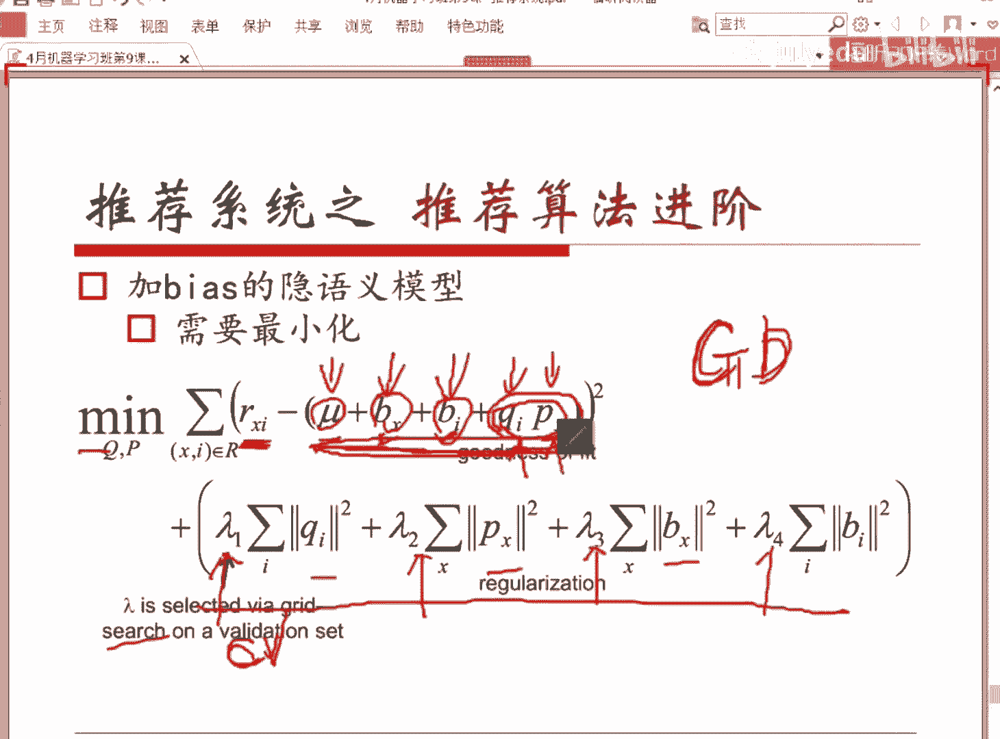
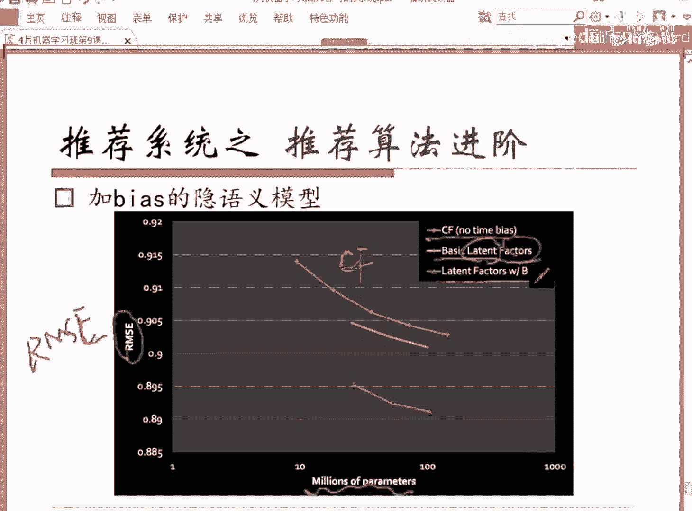
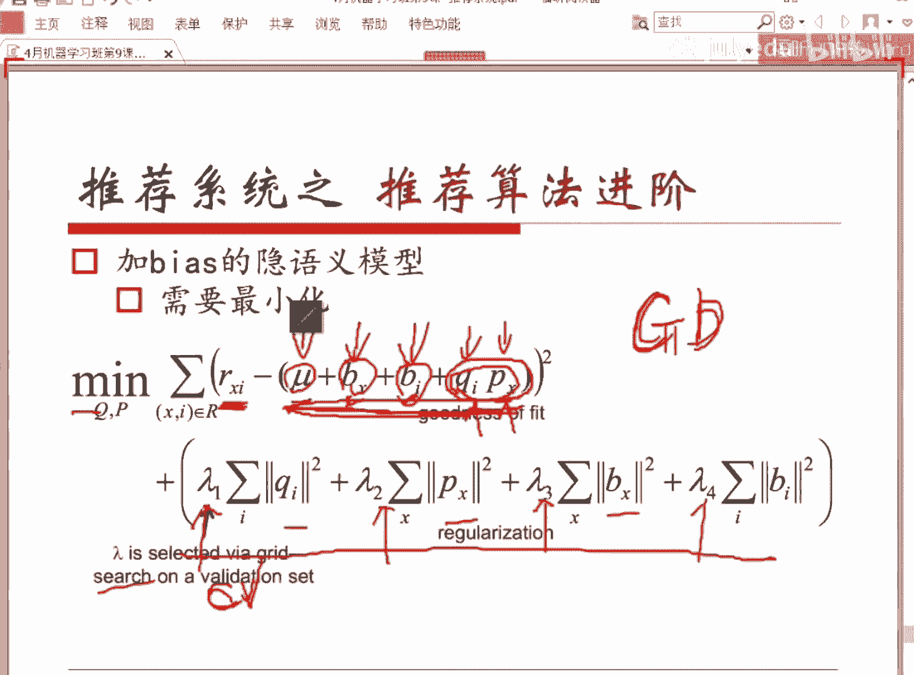
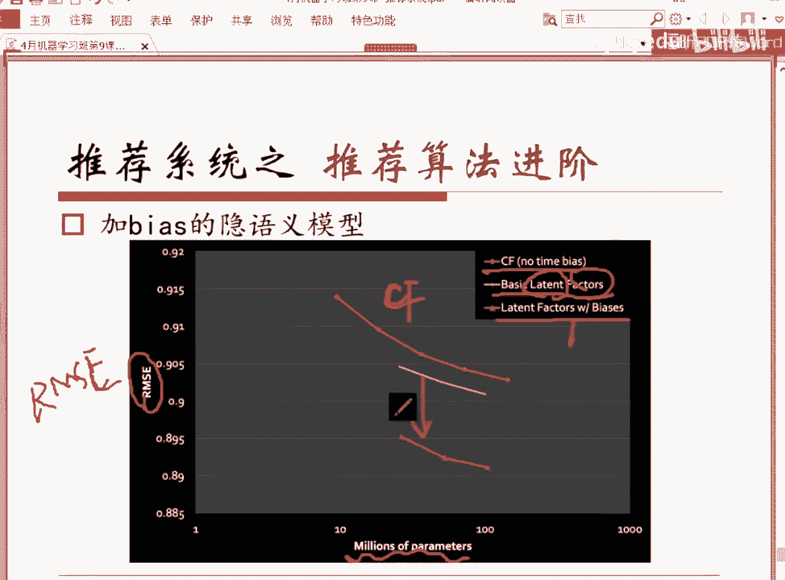
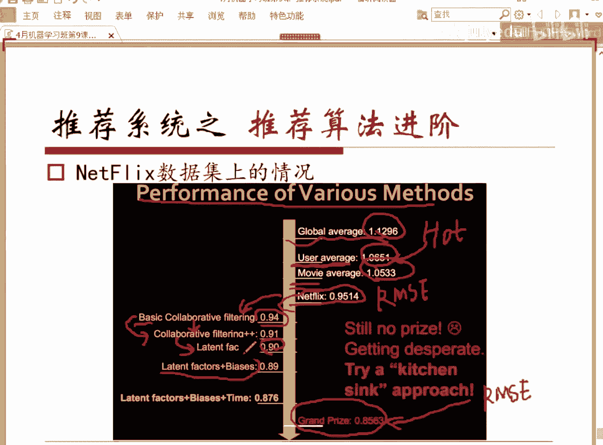
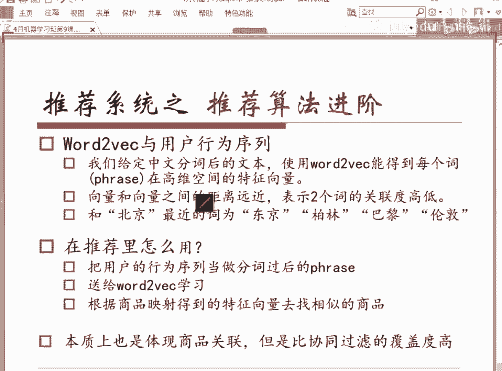
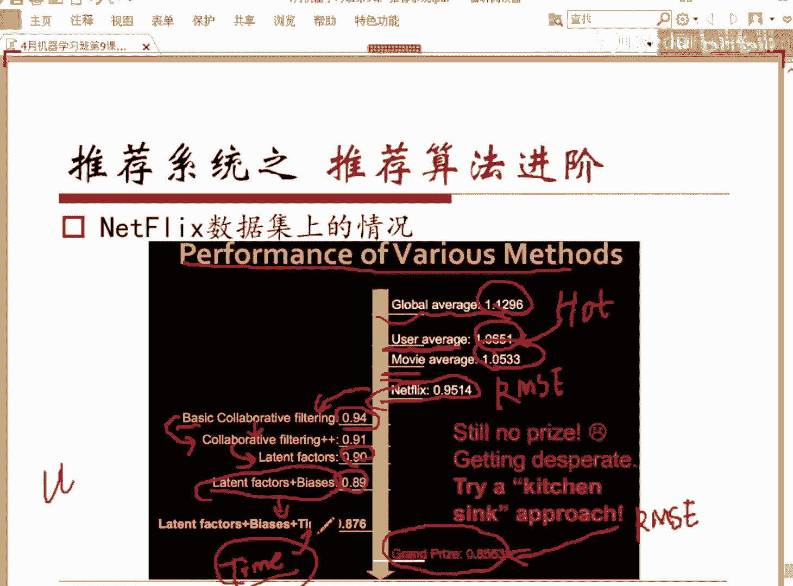
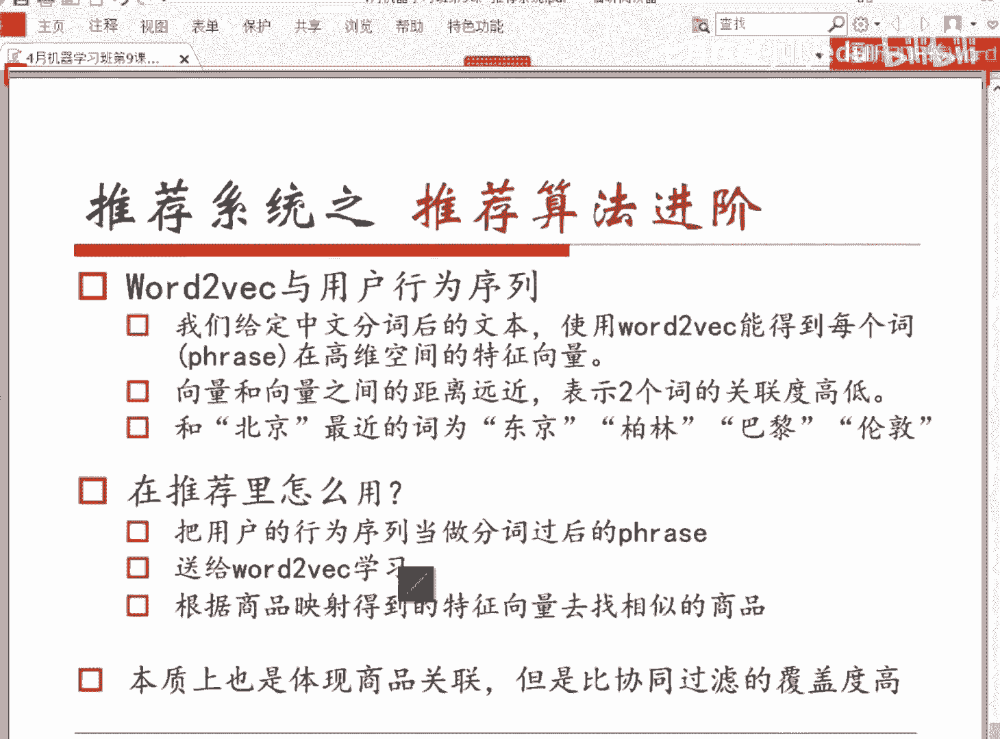
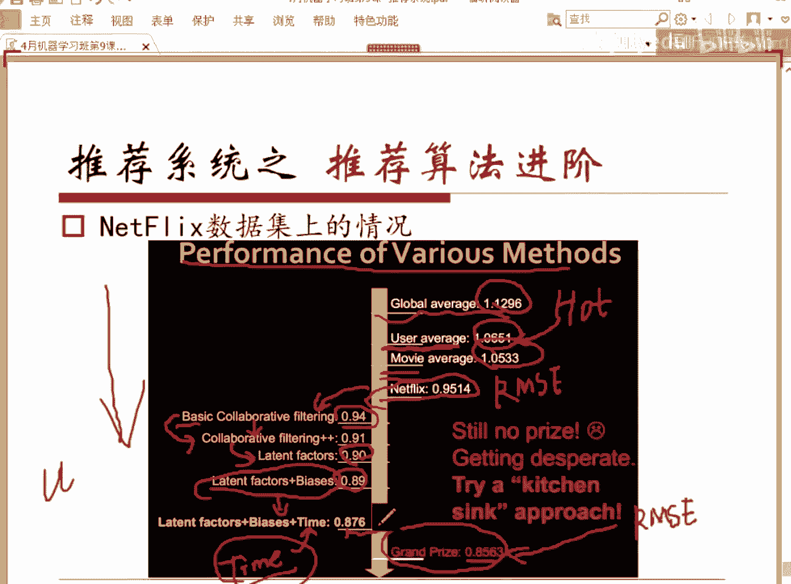
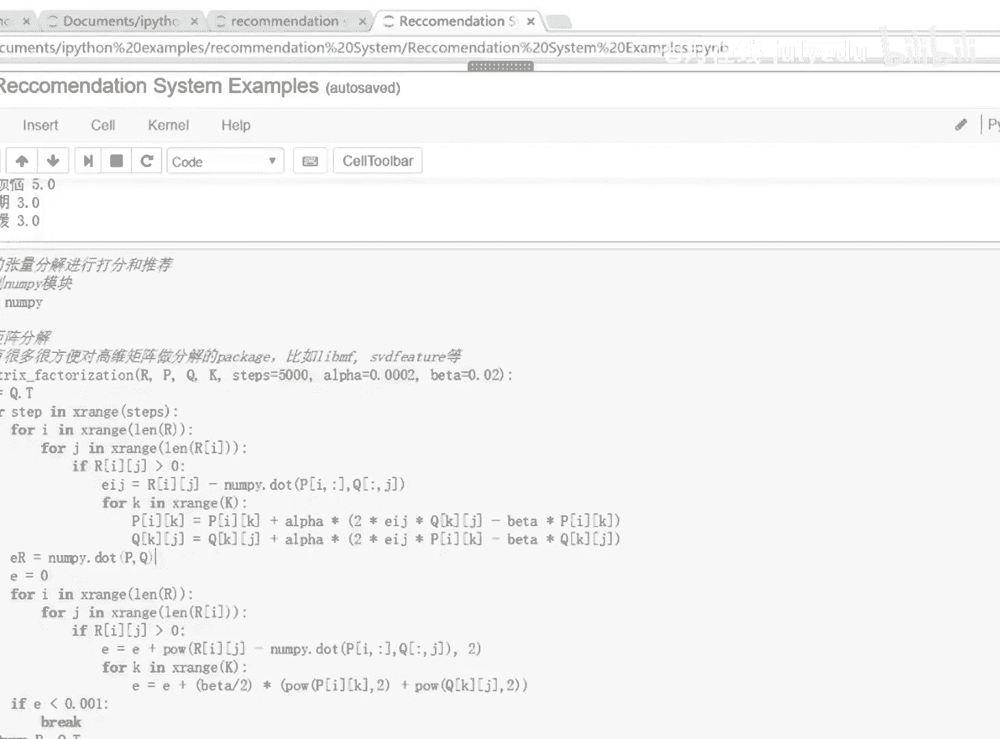

# 人工智能—推荐系统公开课（七月在线出品） - P9：推荐系统导论：从推荐算法到案例应用

## 概述

在本节课中，我们将要学习推荐系统的基本概念、核心算法及其评估方法。课程将从推荐系统的存在意义讲起，介绍其基本结构和评估准则，然后深入讲解一系列在工业界非常实用的推荐算法，包括内容推荐、协同过滤、矩阵分解以及基于用户行为序列的Word2Vec应用。最后，我们会通过简单的代码案例来理解部分算法的实现。

---

## 为什么需要推荐系统？

互联网数据量爆炸式增长带来了信息过载问题。一个人每天接触到的文字、声音和图像信息量巨大，各类平台每天新增的内容也远超个人的处理能力。为了解决用户在海量信息中快速找到所需内容的问题，推荐系统应运而生。

早期的解决方案是分类导航（如雅虎）和搜索引擎，它们需要用户主动提供关键词。然而，人们越来越希望系统能主动发现其兴趣和需求，甚至带来惊喜（Surprise）。推荐系统正是为了满足这种“被动获取个性化信息”的需求而存在。

对于用户而言，推荐系统能帮助发现新鲜事物、辅助决策、节省时间。对于商家而言，它能提供更个性化的服务，提高用户粘性和信任度，并直接带来显著的营收增长。例如，Netflix三分之二的电影观看源于推荐，亚马逊35%的营业额来自推荐，今日头条半数以上的点击也来源于推荐。

---

## 推荐系统是什么？

### 通俗理解

推荐系统会根据用户的历史行为、社交关系、兴趣点以及当前所处的上下文环境，来判断用户的当前需求和兴趣点，并将合适的商品或内容推荐给用户。

*   **历史行为**：是判断用户兴趣的主要数据来源，例如阅读过的新闻、购买过的商品。
*   **社交关系**：当用户历史行为数据不足（冷启动问题）时，可以通过其社交关系来推测其可能喜好。
*   **兴趣点**：可通过用户注册信息或历史行为挖掘获得。
*   **上下文环境**：指用户当前的情境或浏览内容，对于提升推荐精准度至关重要。例如，即使用户历史喜欢衬衫，但若当前一直在浏览牛仔裤，则推荐牛仔裤可能更有效。

### 数学定义

用数学语言更精确地描述，推荐系统要做的是：

给定全体用户集合 **C** 和全体商品（或内容）集合 **S**，以及一个评估函数 **U**。对于任意一个用户 **c ∈ C**，推荐系统需要遍历所有商品 **s ∈ S**，计算评估函数 **U(c, s)** 的值，然后选择使该函数值最大的商品 **s** 推荐给用户 **c**。

用公式表示核心决策过程为：
```
s' = argmax_{s ∈ S} U(c, s)
```
其中，**U(c, s)** 衡量了将商品 **s** 推荐给用户 **c** 的效用或得分。

---

## 推荐系统的基本结构

一个典型的推荐系统结构包含线下（Offline）和线上（Online）两部分。


*   **线下部分（Offline）**：
    *   **数据处理**：包括数据清洗、特征提取等，为模型准备干净、有效的输入数据。
    *   **模型训练**：使用处理后的数据训练推荐模型，目标是优化准确度等指标。
*   **线上部分（Online）**：
    *   **模型加载**：将训练好的模型部署到线上环境。
    *   **上下文感知**：结合用户当前的实时行为和环境信息。
    *   **生成推荐**：利用模型和上下文信息，实时生成推荐结果并返回给用户。

线下部分的核心是模型**准确度**，线上部分则对**速度**和**实时性**有极高要求。

---

## 如何评估推荐系统？

评估推荐系统好坏需要多方面的标准，而不仅仅是准确度。

### 1. 准确度（针对打分系统）

对于允许用户显式评分（如5星评分）的系统，常用均方根误差（RMSE）和平均绝对误差（MAE）来衡量预测评分与实际评分的差距。

*   **RMSE（均方根误差）**：
    ```
    RMSE = sqrt( (1/|T|) * Σ_{(u,i)∈T} (r_{ui} - r̂_{ui})^2 )
    ```
    其中，`r_{ui}` 是用户 **u** 对商品 **i** 的实际评分，`r̂_{ui}` 是预测评分，**T** 是测试集。
*   **MAE（平均绝对误差）**：
    ```
    MAE = (1/|T|) * Σ_{(u,i)∈T} |r_{ui} - r̂_{ui}|
    ```

### 2. 准确率与召回率（针对Top-N推荐）

对于隐式反馈（如点击/购买）系统，用户只有“感兴趣”或“不感兴趣”的行为。常用准确率（Precision）和召回率（Recall）来评估。

*   **准确率**：推荐的商品中，用户真正感兴趣的比例。
    ```
    Precision = |推荐集 ∩ 用户真实感兴趣集| / |推荐集|
    ```
*   **召回率**：用户真正感兴趣的商品中，被系统推荐出来的比例。
    ```
    Recall = |推荐集 ∩ 用户真实感兴趣集| / |用户真实感兴趣集|
    ```

### 3. 覆盖率

覆盖率衡量推荐系统能够发掘长尾商品、避免马太效应（热门商品越来越热）的能力。

*   **简单覆盖率**：被推荐过的商品种类数占总商品种类数的比例。
    ```
    Coverage = |被推荐过的商品集合| / |总商品集合|
    ```
*   **信息熵覆盖率**：考虑商品被推荐次数的分布均匀性，分布越均匀，覆盖率质量越高。
    ```
    H = -Σ_{i=1}^{n} p_i log p_i
    ```
    其中，`p_i` 是商品 **i** 被推荐的概率（次数占比）。

### 4. 多样性

多样性指推荐列表内商品之间的不相似性。高的多样性可以增加用户的选择空间，可能提升购买转化率。
```
Diversity = 1 - ( Σ_{i∈R, j∈R, i≠j} sim(i, j) ) / (0.5 * |R| * (|R|-1) )
```
其中，`sim(i, j)` 是商品 **i** 和 **j** 的相似度，**R** 是推荐列表。需要对所有用户的多样性求平均。

### 5. 其他指标

*   **惊喜度**：推荐用户不知道但会很喜欢的内容的能力，能极大提高用户粘性。
*   **新颖度**：推荐结果的新鲜程度，避免重复推荐。
*   **信任度**：提供推荐理由（如“你的朋友也喜欢”），能增加用户对推荐结果的接受度。
*   **实时性**：对于新闻等场景尤为重要。

---

## 经典推荐算法

本节我们将介绍一系列经典的推荐算法，这些算法在Netflix推荐大赛中获奖团队均有使用，在工业界非常实用。

### 1. 基于内容的推荐

该方法基于用户过去喜欢的商品（Item）的属性，推荐与之内容相似的其他商品。

**核心思想**：
1.  为每个待推荐的商品建立一份内容资料（Profile），通常使用**TF-IDF**等方法将文本内容转化为特征向量。
2.  为用户建立一份资料，基于其历史喜欢商品的内容特征向量聚合（如平均）而成。
3.  计算待推荐商品与用户资料向量的相似度（如**余弦相似度**），按相似度高低进行推荐。

**优点**：不需要其他用户的行为数据，能解决新商品的冷启动问题。
**缺点**：依赖内容特征挖掘，推荐结果多样性可能受限，难以产生惊喜。

### 2. 协同过滤

协同过滤是应用最广泛的推荐算法之一，它仅使用用户-商品的交互数据（评分、点击等），而不需要商品内容信息。

#### User-Based 协同过滤

**核心思想**：找到与目标用户兴趣相似的用户群体（邻居），然后将邻居喜欢的商品推荐给目标用户。
1.  **计算用户相似度**：利用用户-商品评分矩阵，计算目标用户与其他用户的相似度（如余弦相似度、皮尔逊相关系数）。皮尔逊相关系数通过减去用户平均分来消除用户打分严格度差异的影响。
2.  **生成推荐**：根据相似用户的评分，加权预测目标用户对未评分商品的兴趣。

#### Item-Based 协同过滤

**核心思想**：找到与目标商品相似的商品集合，然后将这些相似商品推荐给喜欢目标商品的用户。
1.  **计算商品相似度**：利用用户-商品评分矩阵，计算商品之间的相似度。
2.  **生成推荐**：根据用户历史喜欢的商品，找出其相似商品进行推荐。

**工业界更常用Item-Based CF的原因**：
*   商品数量通常远小于用户数量，计算和存储相似度矩阵更高效。
*   商品相似度相对稳定，而用户兴趣可能随时间变化。

**协同过滤的优缺点**：
*   **优点**：不需要领域知识，仅凭用户行为就能产生推荐；在用户行为丰富时准确度高。
*   **缺点**：
    *   **冷启动问题**：新用户或新商品缺少足够交互数据。
    *   **稀疏性问题**：用户-商品矩阵非常稀疏时，难以找到可靠关联。
    *   **同款问题**：无法自动关联不同ID的同款商品。

### 3. 隐语义模型（矩阵分解）

为了克服协同过滤的稀疏性问题，隐语义模型被提出。它通过降维技术来发现用户和商品背后隐藏的“因子”。

**核心思想**：将用户-商品评分矩阵 **R** (m×n) 分解为两个低维矩阵的乘积：
```
R ≈ P * Q^T
```
其中，**P** (m×k) 是用户-隐因子矩阵，表示用户对各个隐因子的兴趣程度；**Q** (n×k) 是商品-隐因子矩阵，表示商品在各个隐因子上的强度。**k** 是隐因子的数量，远小于 m 和 n。

**优化目标**：最小化预测评分与实际评分的差异，并加入正则化项防止过拟合。
```
min_{P,Q} Σ_{(u,i)∈已知评分} (r_{ui} - p_u · q_i^T)^2 + λ(||p_u||^2 + ||q_i||^2)
```
通常使用**随机梯度下降**来求解 **P** 和 **Q**。

**进阶**：引入偏置项，考虑全局平均分、用户偏置、商品偏置，使模型更精准：
```
预测评分 = μ + b_u + b_i + p_u · q_i^T
```
其中，`μ` 是全局平均分，`b_u` 是用户偏置，`b_i` 是商品偏置。

### 4. 基于用户行为序列的建模（Word2Vec思想的应用）

将用户在会话中的商品点击序列类比为自然语言中的句子，将每个商品视为一个“词”。应用 **Word2Vec** 中的 **Skip-gram** 等模型进行训练，可以得到每个商品的向量表示（Embedding）。

**核心思想**：在序列中相邻的商品，其向量在嵌入空间中也应该接近。这捕捉了商品之间的“上下文”关联，这种关联基于用户的实际行为模式，而非商品本身的属性。

**作用**：这种方法能有效挖掘商品间的深层关联，补充协同过滤在覆盖率上的不足，尤其擅长发现行为上的搭配关系。

---

## 案例与代码示例

上一节我们介绍了多种推荐算法的原理，本节中我们来看看简单的代码实现，以加深理解。

以下是两个简化示例：





### 示例1：User-Based 协同过滤（Python手写示例）





这个示例演示了如何计算用户相似度并做出推荐。

```python
# 计算用户相似度（以欧氏距离为例）
def euclidean_distance(rating1, rating2):
    distance = 0
    for key in rating1:
        if key in rating2:
            distance += (rating1[key] - rating2[key]) ** 2
    return distance ** 0.5











# 寻找最近邻用户
def find_nearest_neighbor(username, users):
    distances = []
    for user in users:
        if user != username:
            distance = euclidean_distance(users[user], users[username])
            distances.append((distance, user))
    distances.sort() # 按距离排序
    return distances

# 生成推荐
def recommend(username, users):
    nearest = find_nearest_neighbor(username, users)[0][1] # 取最近邻
    recommendations = []
    neighbor_ratings = users[nearest]
    user_ratings = users[username]
    for item in neighbor_ratings:
        if item not in user_ratings:
            recommendations.append((item, neighbor_ratings[item]))
    return sorted(recommendations, key=lambda x: x[1], reverse=True) # 按评分排序

# 示例数据
users = {
    "小明": {"电影A": 5, "电影B": 3, "电影C": 4},
    "小红": {"电影A": 3, "电影B": 4, "电影D": 5},
    "小刚": {"电影B": 2, "电影C": 5, "电影D": 3},
}
print(recommend("小明", users))
```

### 示例2：矩阵分解（Python手写SGD示例）

这个示例演示了如何使用梯度下降进行简单的矩阵分解。

```python
import numpy as np

def matrix_factorization(R, P, Q, K, steps=5000, alpha=0.0002, beta=0.02):
    Q = Q.T
    for step in range(steps):
        for i in range(len(R)):
            for j in range(len(R[i])):
                if R[i][j] > 0: # 只对已知评分进行训练
                    eij = R[i][j] - np.dot(P[i,:], Q[:,j])
                    for k in range(K):
                        P[i][k] = P[i][k] + alpha * (2 * eij * Q[k][j] - beta * P[i][k])
                        Q[k][j] = Q[k][j] + alpha * (2 * eij * P[i][k] - beta * Q[k][j])
        # 计算总误差
        e = 0
        for i in range(len(R)):
            for j in range(len(R[i])):
                if R[i][j] > 0:
                    e = e + (R[i][j] - np.dot(P[i,:], Q[:,j])) ** 2
                    for k in range(K):
                        e = e + (beta/2) * (P[i][k]**2 + Q[k][j]**2)
        if e < 0.001:
            break
    return P, Q.T

# 示例：一个4x4的评分矩阵，0表示未评分
R = np.array([
    [5, 3, 0, 1],
    [4, 0, 0, 1],
    [1, 1, 0, 5],
    [1, 0, 0, 4],
    [0, 1, 5, 4],
])

N, M = R.shape
K = 2 # 隐因子数量

P = np.random.rand(N, K)
Q = np.random.rand(M, K)

P_new, Q_new = matrix_factorization(R, P, Q, K)
# 重构的评分矩阵
R_pred = np.dot(P_new, Q_new.T)
print(R_pred)
```
运行后，`R_pred`矩阵中原本为0的位置会被填上预测的分数。

---

## 总结

本节课中我们一起学习了推荐系统的核心知识。我们从推荐系统存在的必要性讲起，理解了其数学定义和基本架构。重点探讨了如何从准确度、召回率、覆盖率、多样性等多维度评估一个推荐系统。

随后，我们深入讲解了四大类经典且实用的推荐算法：基于内容的推荐、协同过滤（User-Based与Item-Based）、隐语义模型（矩阵分解）以及基于Word2Vec思想的用户行为序列建模。我们分析了它们的原理、优缺点及适用场景，并通过简单的代码示例演示了协同过滤和矩阵分解的基本实现。




推荐系统是一个复杂的工程系统，在实际应用中通常需要融合多种算法，并结合产品设计、实时计算、A/B测试等，才能达到最佳效果。希望本课程为你打开了推荐系统的大门。