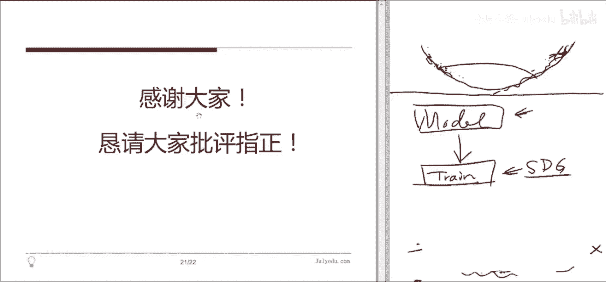
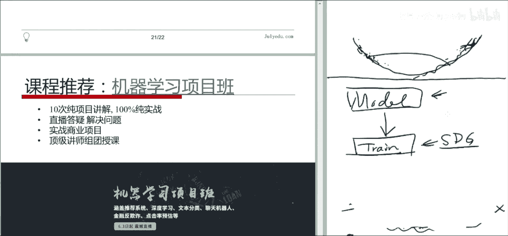

# 人工智能—机器学习中的数学（七月在线出品） - P11：随机梯度下降算法综述 📚

## 概述

在本节课中，我们将学习随机梯度下降算法的核心原理、其面临的主要挑战，以及一系列旨在解决这些挑战的改进算法。我们将从基础的梯度下降法出发，逐步深入到各种变体，并理解它们的设计思想和适用场景。

---

## 第一节：梯度下降法简介 📉

梯度下降法是机器学习中用于优化模型参数的核心方法。其基本思想是：通过计算目标函数在当前参数点处的梯度（即函数值上升最快的方向），然后沿着梯度的反方向更新参数，以期望找到函数的极小值点。

具体更新公式如下：
\[
\theta_{t+1} = \theta_t - \eta \cdot \nabla J(\theta_t)
\]
其中，\(\theta\) 是模型参数，\(\eta\) 是学习率，\(\nabla J(\theta_t)\) 是目标函数 \(J\) 在点 \(\theta_t\) 处的梯度。

该方法包含两个核心步骤：
1.  **计算梯度**：对目标函数求导，得到下降方向。
2.  **选择学习率**：决定沿着该方向前进的步长。

然而，这种方法在实践中面临两大主要困难：
1.  **梯度计算开销大**：当训练样本数量巨大时，计算所有样本的梯度之和非常耗时。
2.  **学习率难以选择**：学习率过大可能导致震荡不收敛，过小则收敛缓慢，且通常需要针对具体问题手动调整。

---

## 第二节：从梯度下降到随机梯度下降 🔄

上一节我们介绍了梯度下降法及其挑战，本节中我们来看看如何通过引入“随机性”来应对第一个挑战——梯度计算开销过大。

### 随机梯度下降（SGD）

为了解决全量梯度计算慢的问题，随机梯度下降法在每次参数更新时，**只随机使用一个训练样本**来计算梯度。其更新公式为：
\[
\theta_{t+1} = \theta_t - \eta \cdot \nabla J(\theta_t; x_i, y_i)
\]
其中，\((x_i, y_i)\) 是随机选取的单个样本。

**优点**：
*   **计算高效**：避免了冗余计算，大大加快了每次迭代的速度。
*   **可能跳出局部极小值**：由于梯度的随机性，算法有机会跳出较差的局部最优点。

**缺点**：
*   **更新方向震荡大**：单个样本的梯度不能代表整体数据的梯度方向，导致参数更新路径不稳定，收敛过程波动剧烈。

### 小批量随机梯度下降（Mini-batch SGD）

为了在计算效率和稳定性之间取得平衡，最常用的方法是**小批量随机梯度下降**。它每次随机选取一小批（例如32、64、128个）样本计算梯度。
\[
\theta_{t+1} = \theta_t - \eta \cdot \frac{1}{m} \sum_{i=1}^{m} \nabla J(\theta_t; x_i, y_i)
\]
其中，\(m\) 是小批量的大小。

**优点**：
*   **计算仍高效**：可以利用现代计算库（如NumPy）的向量化操作，并行计算小批量梯度。
*   **更新更稳定**：小批量梯度的方差比单样本小，收敛路径更平滑。
*   **成为实际标准**：在深度学习领域，通常所说的“SGD”默认指的就是Mini-batch SGD。

**实现细节**：
以下是关于小批量处理的一些常见做法：
*   将整个训练集划分为若干个小批量。
*   遍历所有小批量完成一次训练称为一个“epoch”。
*   在每个epoch开始前，对训练数据进行**洗牌（Shuffle）**，然后重新划分小批量，这有助于避免数据顺序对训练结果产生潜在影响。

---

## 第三节：随机梯度下降面临的挑战 ⚠️

虽然随机梯度下降法解决了计算效率问题，但它（以及所有梯度下降类方法）仍然面临一系列核心挑战，这些挑战催生了后续的各种改进算法。

1.  **病态曲率与震荡**：在高维非凸优化中，损失函数的曲面可能在某些方向非常陡峭，而在另一些方向相对平坦（如峡谷地形）。标准的SGD会在陡峭方向来回震荡，导致在平坦的主下降方向上进展缓慢。
2.  **学习率调度困难**：虽然可以通过预先设定规则（如随时间衰减）来降低学习率以促进收敛，但如何为不同数据集自动设计合适的衰减策略仍是一个难题。
3.  **参数更新频率不均**：对于稀疏数据，某些特征很少出现。如果对所有参数使用相同的、且逐渐衰减的学习率，这些稀疏特征对应的参数可能得不到充分更新。
4.  **陷入鞍点**：在高维空间中，鞍点（某些方向是极小值，某些方向是极大值）比局部极小值更常见。在鞍点附近梯度很小，SGD容易停滞不前。

---

## 第四节：应对挑战的改进算法 🛠️

上一节我们总结了SGD的主要挑战，本节中我们将逐一介绍为解决这些挑战而设计的经典改进算法。每种算法都针对特定问题提供了直观的解决方案。

### 1. 动量法（Momentum）—— 缓解震荡

动量法受物理学启发，旨在解决在病态曲率区域（如峡谷地形）的震荡问题。它引入了“速度”变量，让参数更新不仅考虑当前梯度，还积累之前更新的方向，从而在主要下降方向上获得加速，并抑制垂直方向的摆动。

**核心公式**：
\[
\begin{aligned}
v_t &= \gamma v_{t-1} + \eta \nabla J(\theta_t) \\
\theta_{t+1} &= \theta_t - v_t
\end{aligned}
\]
其中，\(v_t\) 是当前速度，\(\gamma\) 是动量系数（通常取0.9），用于衰减历史速度。

**物理类比**：想象推一个重球下山。它有惯性（动量），不会因为路面的小坑洼而剧烈转向，能更平稳地沿着山谷向下滚动。

### 2. Nesterov 加速梯度（NAG）—— 更聪明的动量

动量法的一个问题是，当球滚到谷底时，积累的动量可能让它冲上对面的山坡。NAG对此做了“前瞻性”改进：它先根据累积动量向前看一步，在那个“未来”的位置计算梯度，然后用这个梯度来修正当前的更新方向。

**核心公式**：
\[
\begin{aligned}
v_t &= \gamma v_{t-1} + \eta \nabla J(\theta_t - \gamma v_{t-1}) \\
\theta_{t+1} &= \theta_t - v_t
\end{aligned}
\]

**直观理解**：这好比在滚球时，先看看如果按当前动量滚下去，前面路况如何（坡度怎样），然后提前调整发力，起到“刹车”或“转向”的作用，使收敛更稳定。

### 3. Adagrad —— 自适应学习率（针对稀疏特征）

Adagrad 旨在为每个参数自动适应不同的学习率，特别适合处理稀疏数据。它为每个参数维护一个历史梯度平方的累积和。更新频繁的参数，累积和大，学习率会自动减小；更新稀少的参数，累积和小，学习率相对较大。

**核心公式**：
\[
\begin{aligned}
G_{t, ii} &= G_{t-1, ii} + (\nabla J(\theta_t)_i)^2 \\
\theta_{t+1, i} &= \theta_{t, i} - \frac{\eta}{\sqrt{G_{t, ii} + \epsilon}} \cdot \nabla J(\theta_t)_i
\end{aligned}
\]
其中，\(G_t\) 是一个对角矩阵，其元素 \(G_{t, ii}\) 是参数 \(\theta_i\) 历史梯度平方的累积。

**优点**：无需手动调整学习率衰减，且对稀疏特征友好。
**缺点**：随着训练进行，分母中的累积和会单调递增，导致学习率过早、过度衰减，可能使训练提前终止。

### 4. RMSprop —— 解决 Adagrad 学习率急剧衰减

RMSprop 改进了 Adagrad，将历史梯度平方的累积和改为**指数移动平均**，从而解决了学习率单调下降过快的问题。它更关注近期梯度的变化。

**核心公式**：
\[
\begin{aligned}
E[g^2]_t &= \beta E[g^2]_{t-1} + (1-\beta)(\nabla J(\theta_t))^2 \\
\theta_{t+1} &= \theta_t - \frac{\eta}{\sqrt{E[g^2]_t + \epsilon}} \cdot \nabla J(\theta_t)
\end{aligned}
\]
其中，\(E[g^2]_t\) 是梯度平方的指数移动平均，\(\beta\) 是衰减率（通常为0.9）。

### 5. Adam —— 结合动量与自适应学习率

Adam（Adaptive Moment Estimation）可以说是当前最流行、默认推荐的优化器。它**同时结合了动量法（一阶矩估计）和RMSprop（二阶矩估计）的优点**，即同时考虑梯度方向的历史信息和梯度大小的历史信息。

**核心公式**：
\[
\begin{aligned}
m_t &= \beta_1 m_{t-1} + (1-\beta_1) \nabla J(\theta_t) \quad &\text{(一阶矩，有偏估计)} \\
v_t &= \beta_2 v_{t-1} + (1-\beta_2) (\nabla J(\theta_t))^2 \quad &\text{(二阶矩，有偏估计)} \\
\hat{m}_t &= \frac{m_t}{1 - \beta_1^t} \quad &\text{(修正一阶矩)} \\
\hat{v}_t &= \frac{v_t}{1 - \beta_2^t} \quad &\text{(修正二阶矩)} \\
\theta_{t+1} &= \theta_t - \frac{\eta}{\sqrt{\hat{v}_t} + \epsilon} \hat{m}_t
\end{aligned}
\]
其中，\(\beta_1, \beta_2\) 通常取0.9和0.999。对 \(m_t\) 和 \(v_t\) 进行偏差修正是为了在训练初期使其估计更准确。

**优点**：通常收敛速度快，对超参数选择相对鲁棒，是许多场景下的“默认”选择。

---

## 第五节：其他优化技巧 💡

除了修改参数更新规则的核心算法外，还有一些重要的技巧可以提升SGD的训练效果。

以下是几种常用的辅助优化技巧：

*   **数据洗牌（Shuffling）**：在每个训练周期（epoch）开始前，随机打乱训练数据顺序，有助于模型学习更通用的模式，避免因数据顺序带来的偏差。
*   **批规范化（Batch Normalization）**：对每一层神经网络的输入进行标准化处理（减均值、除标准差），可以稳定网络的训练过程，允许使用更高的学习率，并具有一定的正则化效果。
*   **早停（Early Stopping）**：在训练过程中持续监控模型在验证集上的性能。当验证集误差不再下降甚至开始上升时，即使训练误差还在下降，也停止训练，以防止过拟合。
*   **梯度噪声（Gradient Noise）**：在梯度中加入少量随机噪声。这有助于模型跳出较差的局部极小值或鞍点，增加找到更好解的可能性。噪声的幅度通常随训练进行而衰减。

---

## 第六节：如何选择优化算法？ 🤔

面对众多优化算法，初学者可能会感到困惑。以下是一些指导原则：

1.  **理解问题特性**：如果你的数据稀疏，考虑自适应学习率算法（Adagrad, Adadelta, RMSprop, Adam）。如果你的优化地形非常复杂（崎岖），考虑使用带动量的方法（Momentum, NAG, Adam）。
2.  **Adam 作为强力的默认选择**：在大多数情况下，**Adam** 优化器因其结合了动量和自适应学习率的优点，往往能提供快速且稳定的收敛，是一个非常好的起点。
3.  **经典的 SGD + Momentum 仍有价值**：虽然 Adam 很流行，但一些研究表明，精心调参的 SGD with Momentum 有时能达到更好的最终精度，尽管其收敛可能需要更长时间。
4.  **实践是检验真理的唯一标准**：对于你的特定任务和数据集，最好的方法是通过实验（例如，在验证集上比较收敛速度和最终性能）来选择优化器。可以先用 Adam 快速得到一个基准，再尝试其他算法看是否有提升。

---

## 总结

本节课中，我们一起学习了随机梯度下降算法的演进之路。
我们从最基础的**梯度下降法**出发，认识了其计算瓶颈。
随后引入了**随机性**，诞生了**随机梯度下降（SGD）**及其更实用的变体**小批量SGD**，解决了效率问题。
接着，我们探讨了SGD面临的**四大核心挑战**：病态曲率震荡、学习率调度难、稀疏参数更新不均以及鞍点问题。
针对这些挑战，我们深入讲解了一系列改进算法：用**动量法（Momentum）** 抑制震荡，用**Nesterov加速梯度**实现更智能的动量，用**Adagrad**为稀疏特征自适应学习率，用**RMSprop**改进其衰减过程，最终学习了集大成的**Adam**算法。
此外，我们还了解了一些重要的**辅助技巧**，如数据洗牌、批规范化和早停。
最后，我们讨论了**算法选择**的策略，建议将Adam作为默认的强力选择，并根据具体问题特性进行调整和实验。

通过本教程，希望你不仅掌握了这些算法的公式，更理解了它们背后要解决的实际问题，从而能在实践中做出更明智的选择。