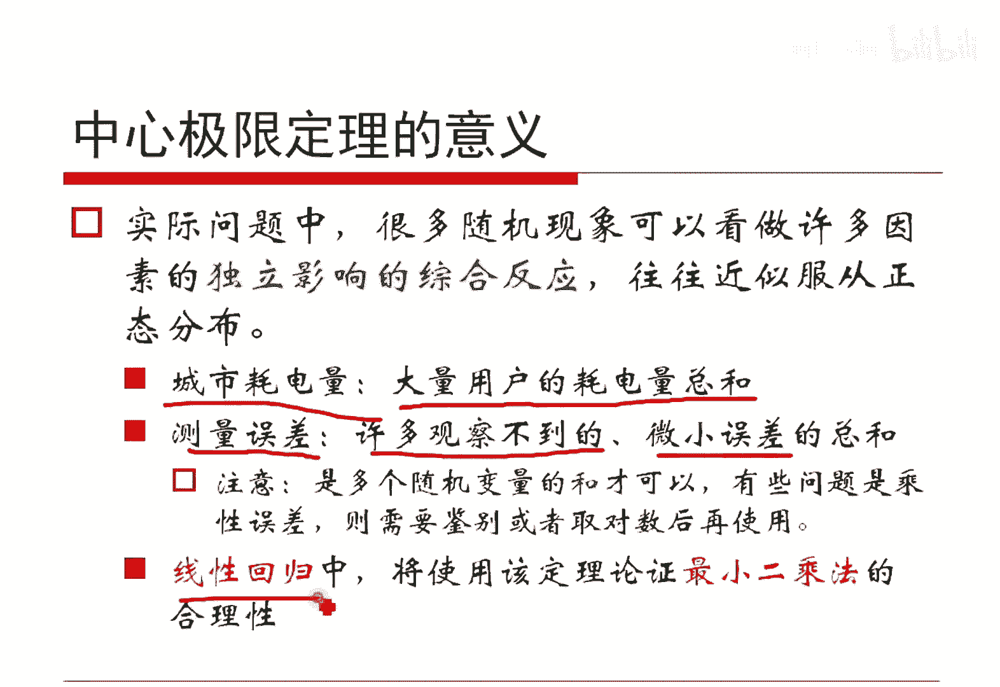
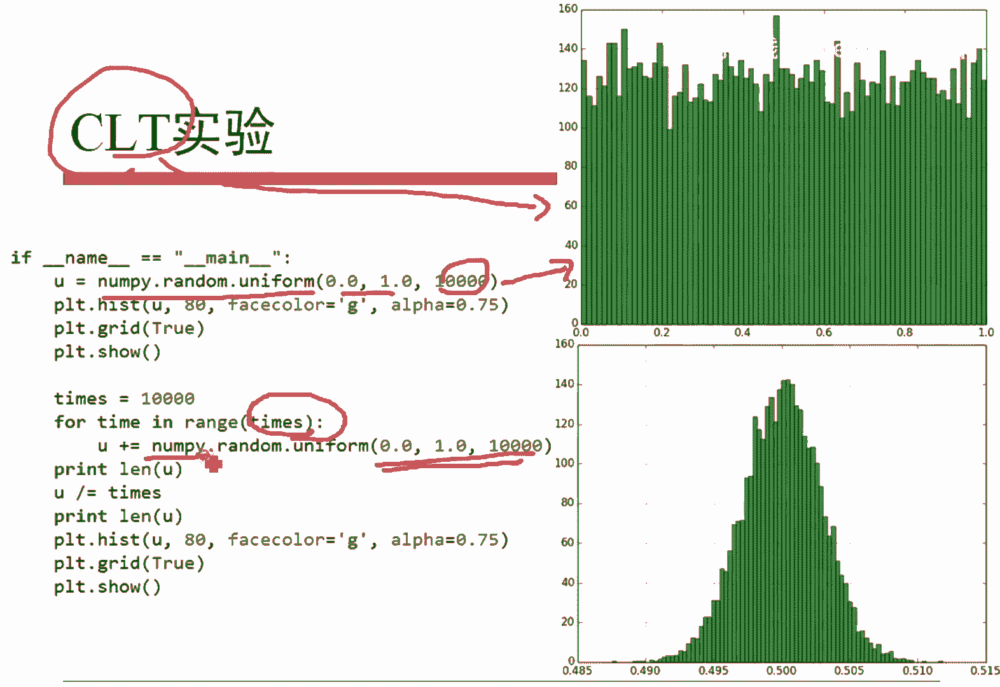
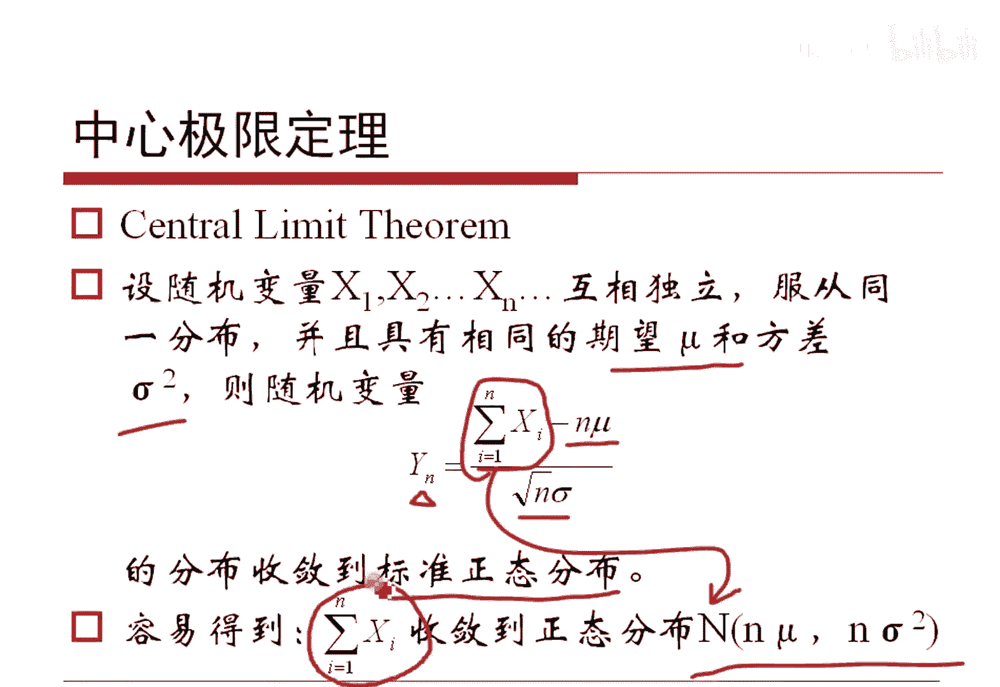
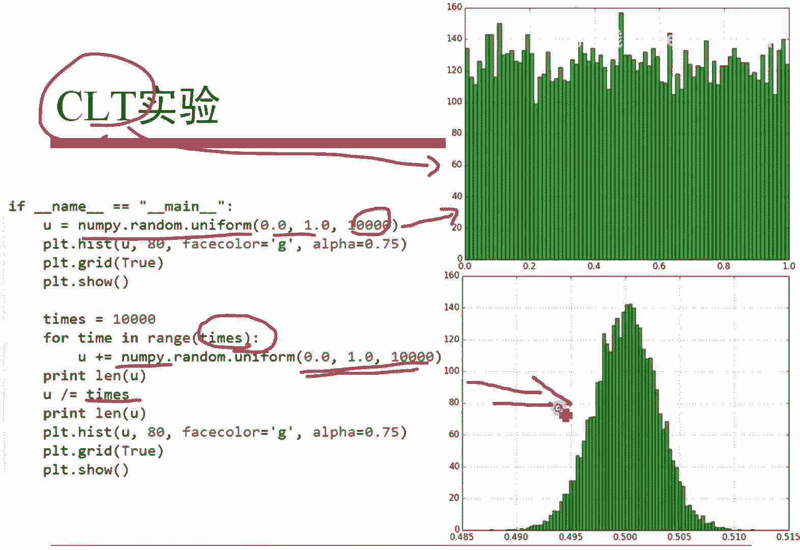

# 人工智能—机器学习中的数学（七月在线出品） - P14：中心极限定理 📊

在本节课中，我们将要学习概率论中两个极其重要的定理：大数定律与中心极限定理。它们为统计学和机器学习中的许多方法提供了坚实的理论基础。

## 概述

切比雪夫不等式揭示了方差的物理意义：方差越小，随机变量取值集中在期望附近的概率越大。这个不等式是证明大数定律的关键工具。

上一节我们介绍了方差与期望的关系，本节中我们来看看如何从切比雪夫不等式出发，理解随机现象的长期稳定性与分布规律。

## 大数定律

大数定律描述了当独立重复试验次数足够多时，随机事件发生的频率会稳定地趋近于其概率。

设 `X1, X2, ..., Xn` 是相互独立且具有相同期望 `μ` 和方差 `σ²` 的随机变量。定义 `Yn = (X1 + X2 + ... + Xn) / n`。

根据切比雪夫不等式，可以证明当 `n` 趋向于无穷大时，`Yn` 以概率 `1` 收敛于期望 `μ`。公式表示为：

`P( lim_{n→∞} Yn = μ ) = 1`

这意味着，尽管单个随机变量的方差可能很大，但将大量独立同分布的随机变量取平均后，其结果会稳定在期望值附近。

以下是关于大数定律的几个要点：

*   **频率与概率的关系**：对于一个事件 `A`，其发生概率为 `p`。在 `n` 次独立重复试验中，事件 `A` 发生的次数记为 `NA`，则频率 `NA/n` 以概率 `1` 收敛于概率 `p`。这几乎为概率提供了操作性的定义，即概率是频率的稳定值。
*   **实践应用**：大数定律是许多机器学习参数估计方法（如正态分布的参数估计、贝叶斯分类中的先验学习等）的理论依据，它使得我们能够用观测到的数据（频率）去推断未知的参数（概率）。

## 中心极限定理

中心极限定理则解释了为什么许多自然和社会现象都近似服从正态分布。

设 `X1, X2, ..., Xn` 是相互独立且具有相同期望 `μ` 和方差 `σ²` 的随机变量。考虑它们的和 `Sn = X1 + X2 + ... + Xn`。

中心极限定理指出，当 `n` 足够大时，标准化后的和 `(Sn - nμ) / (√n * σ)` 的分布会趋近于标准正态分布 `N(0, 1)`。其和 `Sn` 本身则近似服从正态分布 `N(nμ, nσ²)`。

以下是中心极限定理的核心思想与应用场景：

*   **现象解释**：如果一个结果是由大量微小、独立的随机因素共同作用产生的，那么这个结果的分布往往近似于正态分布。
*   **实例说明**：
    *   **城市用电量**：可以看作是大量用户独立用电量的总和，因此近似服从正态分布。
    *   **测量误差**：由许多无法控制的微小因素（如环境、仪器波动）综合导致，通常服从正态分布。
    *   **学生成绩**：受智力、努力程度、临场状态等多种独立因素影响，一个班级的成绩分布通常也近似正态。如果严重偏离，可能暗示存在异常（如大面积作弊或试题设计不当）。
*   **实验验证**：下图展示了中心极限定理的模拟实验。从一个均匀分布中多次抽样并计算均值，这些均值的分布会呈现出正态分布的形状。

## 总结

本节课中我们一起学习了概率论的两大基石：大数定律与中心极限定理。

*   大数定律保证了在长期或大量的重复中，随机事件的频率会稳定在其概率附近，这为用样本推断总体提供了理论支持。
*   中心极限定理则揭示了无论原始随机变量服从什么分布，只要独立同分布且数量足够多，其和的标准化形式就会趋近于正态分布。这解释了正态分布在现实世界中的普遍性，并为许多统计推断方法（如线性回归中的最小二乘法）奠定了理论基础。

理解这两个定理，对于深入掌握机器学习和数据分析中的统计思想至关重要。