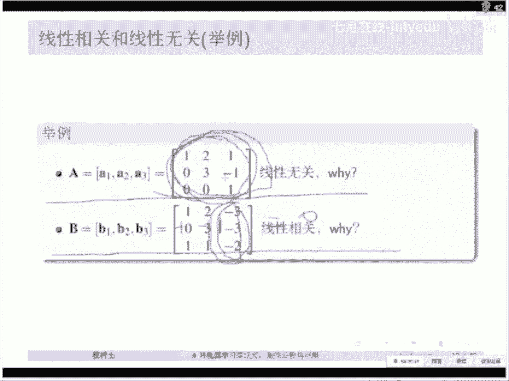

# 人工智能—机器学习中的数学（七月在线出品） - P15：重新理解矩阵 🧮


在本节课中，我们将从一个全新的视角重新理解矩阵方程 `AX = B`。我们将探讨其行视图与列视图的几何意义，并引出线性代数中的核心概念，如线性相关、线性无关、基与子空间。随后，我们将深入探讨矩阵分解，包括特征值分解与奇异值分解，并揭示它们之间的内在联系，最终构建一个完整的知识框架。

## 线性代数的基本知识

上一节我们概述了课程目标，本节中我们来看看线性代数的一些基本符号和概念，为后续内容打下基础。

以下是本节课将使用的主要数学符号表：

*   **R^n**：n维实向量空间。
*   **R^(m×n)**：m行n列的实矩阵集合。
*   **A^T**：矩阵A的转置。
*   **det(A)**：矩阵A的行列式。
*   **C(A)**：矩阵A的列空间。
*   **N(A)**：矩阵A的零空间（核空间）。
*   **A^(-1)**：矩阵A的逆矩阵。
*   **diag(v)**：将向量v转化为对角矩阵。
*   **tr(A)**：矩阵A的迹（对角线元素之和）。
*   **A^H**：矩阵A的共轭转置（本节课仅讨论实数，可暂时视同A^T）。
*   **rank(A)**：矩阵A的秩。

> **说明**：红色框标注的内容代表最重要的定理或概念，绿色框标注的则是帮助理解的示例。

## 重新理解 AX = B

我们从一个最基础的矩阵方程开始。考虑方程 `AX = B`，其中 A 是一个矩阵，X 和 B 是向量。教科书通常从行列式讲起，但我们将从更直观的几何视角——行视图和列视图——来切入。

### 行视图：方程组的交点

对于方程 `AX = B`，行视图将其理解为一系列线性方程的交集。

例如，给定矩阵和向量：
```
A = [[2, -1],
     [1,  1]]
X = [x, y]^T
B = [1, 5]^T
```
方程 `AX = B` 等价于方程组：
```
2x - y = 1
x + y = 5
```
在二维空间中，每个方程代表一条直线。方程有解，意味着这两条直线相交于一点 `(x=2, y=3)`。

推广到三维，例如一个 `3x3` 的系统，每个方程代表一个平面。三个平面相交于一点，即该方程组的解。更高维的情况可以类推，每个方程定义一个“超平面”，解就是所有超平面的交点。

> 这个视角与机器学习中的“超平面”概念紧密相关，例如，约束 `A^T X = b` 就定义了一个超平面。

### 列视图：向量的线性组合

现在，我们从列的角度审视同一个方程 `AX = B`。我们可以将矩阵A按列分块：
```
A = [a1, a2]
```
那么方程 `AX = B` 可以重写为：
```
x * a1 + y * a2 = B
```
这意味着，**结果向量 B 是矩阵 A 各列向量的一个线性组合**，组合系数就是向量 X 中的元素。

对于上面的例子：
```
A的列向量： a1 = [2, 1]^T, a2 = [-1, 1]^T
B = [1, 5]^T
```
解 `X = [2, 3]^T` 意味着：
```
2 * [2, 1]^T + 3 * [-1, 1]^T = [1, 5]^T
```
从几何上看，我们将向量 `a1` 拉伸2倍，将向量 `a2` 拉伸3倍，然后通过向量加法（平行四边形法则），恰好得到了向量 `B`。

**行视图与列视图的联系与区别**：
*   行视图关注方程描述的几何对象（直线、平面、超平面）如何相交。
*   列视图关注矩阵的列向量如何通过伸缩与相加来合成目标向量。
*   两者是同一数学事实的两种几何表现，但列视图更贴近线性代数“线性组合”的核心思想。

## 线性相关与线性无关

从列视图的讨论中，我们自然引出一个问题：是否任意向量 B 都能被一组给定的列向量组合出来？这直接关系到“线性相关”与“线性无关”的概念。

### 定义

给定一组向量 `{v1, v2, ..., vn}`：

*   **线性相关**：存在一组**不全为零**的标量 `c1, c2, ..., cn`，使得：
    `c1*v1 + c2*v2 + ... + cn*vn = 0`
    这意味着至少有一个向量可以被其他向量线性表示。
*   **线性无关**：只有当所有标量 `c1, c2, ..., cn` **全为零**时，上式才成立。即，没有任何一个向量可以表示为其他向量的线性组合。

### 示例与理解

考虑矩阵 `A = [[1, 2, 3], [0, 1, 1], [1, 3, 4]]` 的列向量：
*   **列向量线性相关**：因为 `-1*[1,0,1]^T + (-1)*[2,1,3]^T + 1*[3,1,4]^T = [0,0,0]^T`。我们发现第三列是前两列之和，它是“多余”的。
*   **列向量线性无关**：对于矩阵 `A = [[1, 0, 0], [0, 1, 0], [0, 0, 1]]`（单位阵），其列向量是线性无关的。你无法找到非零系数使它们的线性组合为零向量。

**与方程 `AX=0` 的联系**：
方程 `AX = 0` 称为齐次方程。将其写作列向量形式：
`x1*a1 + x2*a2 + ... + xn*an = 0`
*   如果 `A` 的列向量线性无关，那么上式成立**当且仅当** `x1 = x2 = ... = xn = 0`。此时 `AX=0` 只有零解，矩阵 `A` 是可逆的（对于方阵而言）。
*   如果 `A` 的列向量线性相关，那么存在非零向量 `X` 使得 `AX=0`。这意味着 `A` 的列空间无法充满整个空间，`A` 不可逆。

## 基与子空间

理解了线性无关，我们就可以定义“基”和“子空间”这两个核心概念。

*   **基**：向量空间 `V` 中一组**线性无关**的向量，并且它们能够**张成**（即通过线性组合表示）整个空间 `V`。空间 `V` 的维数等于基中向量的个数。
*   **子空间**：一个向量空间的子集，如果它自身也满足向量空间的公理（对加法和数乘封闭），则称为子空间。矩阵 `A` 的**列空间** `C(A)`（所有列向量的线性组合构成的集合）和**零空间** `N(A)`（所有满足 `AX=0` 的向量 `X` 的集合）是两个最重要的子空间。

## 矩阵分解：特征值分解 (EVD)

对于方阵，一种重要的分解方式是特征值分解。

### 定义与公式

若 `n×n` 方阵 `A` 有 `n` 个线性无关的特征向量，则可被分解为：
`A = P * Λ * P^(-1)`
其中：
*   `P` 是由 `A` 的 `n` 个线性无关的特征向量组成的矩阵。
*   `Λ` 是由对应的特征值构成的对角矩阵，`Λ = diag(λ1, λ2, ..., λn)`。

### 特殊情形：对称矩阵

当 `A` 是实对称矩阵（`A = A^T`）时，情况更优美：
*   其特征值都是实数。
*   不同特征值对应的特征向量相互正交。
*   它可以被正交对角化：
    `A = Q * Λ * Q^T`
    其中 `Q` 是由单位正交特征向量组成的正交矩阵（`Q^T * Q = I`，即 `Q^(-1) = Q^T`）。

对称矩阵的特征值分解是理解**二次型** `X^T A X` 的基础，在优化问题（如判断凸性）中至关重要。

## 矩阵分解：奇异值分解 (SVD)

特征值分解只适用于方阵。对于任意 `m×n` 的矩阵 `A`，我们有一种“万能”的分解方法——奇异值分解。

### 定义与公式

任意实矩阵 `A (m×n)` 都可以分解为：
`A = U * Σ * V^T`
其中：
*   `U` 是一个 `m×m` 的正交矩阵，其列向量称为左奇异向量，构成 `A * A^T` 的特征向量基。
*   `V` 是一个 `n×n` 的正交矩阵，其列向量称为右奇异向量，构成 `A^T * A` 的特征向量基。
*   `Σ` 是一个 `m×n` 的矩形对角矩阵，其对角线上的非负元素称为奇异值，通常按降序排列 `σ1 ≥ σ2 ≥ ... ≥ σr > 0`，`r = rank(A)`。

### SVD 与子空间的联系

SVD 完美地揭示了矩阵的四大基本子空间：
*   `U` 的前 `r` 列：张成列空间 `C(A)`。
*   `U` 的后 `m-r` 列：张成左零空间 `N(A^T)`。
*   `V` 的前 `r` 列：张成行空间 `C(A^T)`。
*   `V` 的后 `n-r` 列：张成零空间 `N(A)`。

### SVD 与 EVD 的关系

*   对于对称矩阵 `A`，其 SVD 与特征值分解本质相同，奇异值就是特征值的绝对值。
*   `A^T * A` 的特征值是 `A` 的奇异值的平方，其特征向量组成了 `V`。
*   `A * A^T` 的特征值也是 `A` 的奇异值的平方，其特征向量组成了 `U`。

## 知识框架总结

本节课中，我们一起学习了如何从多个角度理解线性代数：

1.  **起点**：我们从矩阵方程 `AX = B` 出发，建立了**行视图**（方程交点）和**列视图**（向量线性组合）的几何直观。
2.  **核心概念**：由列视图引出了**线性相关/无关**、**基**和**子空间**（列空间、零空间）这些构建线性代数大厦的基石。
3.  **矩阵分解**：
    *   对于方阵，我们学习了**特征值分解 (EVD)**，特别是对称矩阵的优美性质。
    *   对于任意矩阵，我们介绍了强大的**奇异值分解 (SVD)**，它统一了四大子空间，并广泛应用于数据降维（PCA）、推荐系统、图像压缩等领域。
4.  **内在联系**：SVD 是 EVD 的推广，它们通过矩阵 `A^T A` 和 `A A^T` 相联系。所有这些概念都围绕着矩阵 `A` 及其基本子空间展开，形成了一个连贯的知识网络。




理解这个框架后，你在学习更具体的线性代数细节或应用机器学习算法时，就能清楚地知道每个数学工具在整个知识体系中的位置和作用。