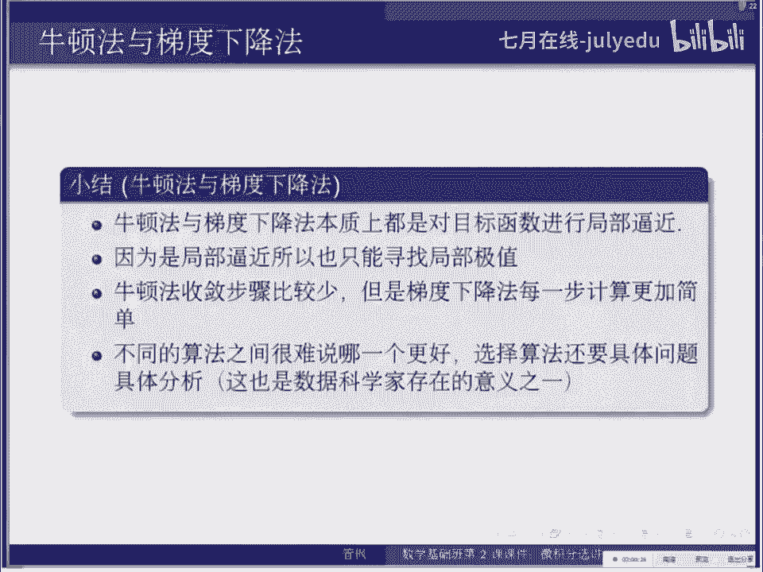

# 人工智能—机器学习中的数学（七月在线出品） - P16：牛顿法与梯度下降法 🧠

在本节课中，我们将要学习两种在机器学习和优化问题中至关重要的算法：牛顿法与梯度下降法。我们将探讨它们的数学原理、核心思想、各自的优缺点以及它们之间的联系。这两种算法的本质都是通过“逼近”来寻找函数的最优解。

## 背景与问题定义

上一节我们介绍了微积分中的逼近思想。本节中我们来看看如何将这种思想应用于实际的优化问题。

很多机器学习或统计学习问题，最终都会转化为一个优化问题。例如，训练一个模型通常意味着最小化某个损失函数或代价函数。在本课程范围内，我们考虑的函数都是可微分的。

优化的核心问题是：对于一个可微分的函数，如何找到它的极值点？极值点分为全局极小值和局部极小值。
*   **全局极小值**：对于定义域内的任意点 \( x \)，其函数值 \( f(x) \) 都大于等于 \( f(x^*) \)，则 \( x^* \) 是全局极小值点。
*   **局部极小值**：存在一个正数 \( \delta \)，只要点 \( x \) 与 \( x^* \) 的距离小于 \( \delta \)，就有 \( f(x^*) \leq f(x) \)，则 \( x^* \) 是局部极小值点。

无论是全局还是局部极值点，对于可微函数，在该点处的导数（一元函数）或梯度（多元函数）一定为零。我们将利用这个条件来设计寻找极值点的算法。

## 算法概述与比较

在深入细节之前，我们先对牛顿法和梯度下降法做一个整体的比较，了解它们的适用范围和特点。

以下是两种算法的核心对比：

*   **优化类型**：两者都是**局部优化**算法。因为它们都基于在某一点附近的逼近，所以只能找到初始点附近的局部极值，而非全局极值。
*   **数学原理**：
    *   牛顿法使用**二阶逼近**（泰勒展开到二阶），利用了函数的曲率信息。
    *   梯度下降法使用**一阶逼近**（泰勒展开到一阶），只利用了函数的斜率信息。
*   **收敛速度**：牛顿法通常比梯度下降法**收敛速度更快**，因为它使用了更多信息，能以更少的迭代步数达到较好的精度。
*   **计算成本**：牛顿法需要计算并求逆**Hessian矩阵**（二阶导数的矩阵），计算量大且复杂。梯度下降法只需计算梯度，每一步的计算更简单。
*   **初始点与稳定性**：两者都需要一个初始点。牛顿法对初始点更敏感，可能收敛到极大值点或鞍点。梯度下降法（因其“下降”特性）通常不会找到极大值，但若步长设置不当，也可能在极小值点附近震荡。

## 牛顿法详解 🔨

上一节我们概述了两种算法。本节中我们深入探讨牛顿法的具体原理。

牛顿法的核心思想是：在当前位置 \( x_0 \) 处，用原函数 \( f(x) \) 的**二阶泰勒展开**来逼近它，然后直接求解这个二次逼近函数的极值点，以此作为对原函数极值点的估计。

对于一个一元函数 \( f(x) \)，在点 \( x_0 \) 处的二阶泰勒展开为：
\[
f(x) \approx f(x_0) + f'(x_0)(x - x_0) + \frac{1}{2}f''(x_0)(x - x_0)^2
\]
我们将右边除余项外的部分记为一个二次函数 \( g(x) \)。我们知道二次函数 \( g(x) \) 的极值点在其导数为零处，即：
\[
g'(x) = f'(x_0) + f''(x_0)(x - x_0) = 0
\]
解这个方程，得到：
\[
x = x_0 - \frac{f'(x_0)}{f''(x_0)}
\]
我们将这个 \( x \) 记为 \( x_1 \)，作为对 \( f(x) \) 极值点的第一次估计。然后以 \( x_1 \) 为新的起点，重复这个过程，就得到了牛顿法的迭代公式：
\[
x_{n} = x_{n-1} - \frac{f'(x_{n-1})}{f''(x_{n-1})}
\]

对于多元函数 \( f(\mathbf{x}) \)，其中 \( \mathbf{x} \) 是一个向量，公式需要推广。我们用梯度 \( \nabla f \) 代替一阶导数，用 Hessian 矩阵 \( H(f) \) 代替二阶导数。Hessian 矩阵 \( H \) 的元素是函数的二阶偏导数：
\[
H_{ij} = \frac{\partial^2 f}{\partial x_i \partial x_j}
\]
多元情况下的牛顿法迭代公式为：
\[
\mathbf{x}_{n} = \mathbf{x}_{n-1} - H(f)(\mathbf{x}_{n-1})^{-1} \nabla f(\mathbf{x}_{n-1})
\]
这里 \( H(f)(\mathbf{x}_{n-1})^{-1} \) 表示在点 \( \mathbf{x}_{n-1} \) 处的 Hessian 矩阵的逆。

## 梯度下降法详解 📉

了解了利用二阶信息的牛顿法后，本节我们来看看只利用一阶信息的梯度下降法。

梯度下降法的思想更直观：既然梯度 \( \nabla f \) 的方向是函数值上升最快的方向，那么它的反方向 \( -\nabla f \) 就是函数值下降最快的方向。我们沿着这个方向走一小步，就能让函数值减小。

对于多元函数 \( f(\mathbf{x}) \)，在点 \( \mathbf{x}_0 \) 处的一阶泰勒展开为：
\[
f(\mathbf{x}) \approx f(\mathbf{x}_0) + \nabla f(\mathbf{x}_0)^T (\mathbf{x} - \mathbf{x}_0)
\]
记右边为线性函数 \( g(\mathbf{x}) \)。线性函数没有极值点，但它指明了变化的方向。为了使 \( f(\mathbf{x}) \) 减小，我们应该让 \( \mathbf{x} \) 朝着 \( -\nabla f(\mathbf{x}_0) \) 的方向移动。但移动多远呢？一阶逼近无法告诉我们，因此我们需要手动设定一个步长 \( \alpha \)（学习率）。

由此得到梯度下降法的迭代公式：
\[
\mathbf{x}_{n} = \mathbf{x}_{n-1} - \alpha \nabla f(\mathbf{x}_{n-1})
\]

**示例**：考虑函数 \( f(x, y) = x^2 + y^2 \)，在点 \( (1, 1) \) 处。
*   梯度 \( \nabla f = (2x, 2y) \)，在 \( (1,1) \) 处为 \( (2, 2) \)。
*   负梯度方向为 \( (-2, -2) \)。
*   若选择学习率 \( \alpha = 0.1 \)，则下一个点为：
    \[
    (x_1, y_1) = (1, 1) - 0.1 * (2, 2) = (0.8, 0.8)
    \]
    可以验证 \( f(0.8,0.8) = 1.28 < f(1,1) = 2 \)，函数值确实下降了。

梯度下降法因为只使用了梯度信息，不知道每一步应该走多远（需要调参），所以收敛速度通常慢于牛顿法。

## 核心概念辨析与常见问题

在学习了两种算法的原理后，我们来澄清一些关键概念并解答常见疑问。

以下是关于梯度和算法选择的要点：

*   **梯度与导数的关系**：对于一元函数，梯度就是导数，是一个标量。对于多元函数，梯度是所有一阶偏导数构成的向量，它指向函数值增长最快的方向。
*   **梯度下降的方向**：梯度是上升最快的方向，因此 **负梯度方向** 才是下降最快的方向。这就是迭代公式中带有负号的原因。
*   **Hessian矩阵不可逆怎么办**：这在牛顿法中是一个实际问题。如果Hessian矩阵奇异（不可逆），则无法计算迭代步长。这通常意味着初始点选择不当，或者需要采用改进的牛顿法（如拟牛顿法）。
*   **如何选择初始点和学习率**：初始点的选择依赖于具体问题，有时可以采用网格搜索等启发式方法。学习率 \( \alpha \) 是梯度下降法的关键超参数，太小会导致收敛慢，太大会导致震荡甚至发散，需要仔细调整。
*   **如何找到全局最小值**：标准的牛顿法和梯度下降法都是局部优化算法，无法保证找到全局最小值。解决全局优化问题需要更复杂的方法，如随机初始化多次运行、模拟退火、遗传算法等。
*   **牛顿法与梯度下降法如何选择**：没有绝对答案。如果计算Hessian矩阵及其逆的代价可以接受，且希望快速收敛，牛顿法可能是好选择。如果数据维度很高，计算Hessian矩阵太昂贵，或者问题非常大规模，梯度下降法及其变种（如随机梯度下降）更为实用。

## 总结与回顾

本节课中我们一起学习了机器学习和优化中两个基础而重要的算法：牛顿法与梯度下降法。

我们首先明确了优化问题的背景，即寻找函数的极值点。接着，我们对比了两种算法的特性：牛顿法使用二阶逼近，收敛快但计算量大；梯度下降法使用一阶逼近，计算简单但收敛慢。两者都是局部优化方法，效果依赖于初始点。

然后，我们深入推导了牛顿法的迭代公式，它通过不断用二次函数逼近并求解其极值来寻找原函数的极值点。对于多元函数，这涉及梯度向量和Hessian矩阵。

之后，我们探讨了梯度下降法，其核心是沿着当前点负梯度的方向，以一个固定步长（学习率）前进，逐步逼近极小值点。

最后，我们辨析了梯度等核心概念，并讨论了算法在实际应用中可能遇到的问题，如初始点选择、全局优化困境以及算法选择策略。

理解这两种算法的原理和权衡，是深入学习更高级优化技术（如共轭梯度法、拟牛顿法、Adam等）的重要基础。