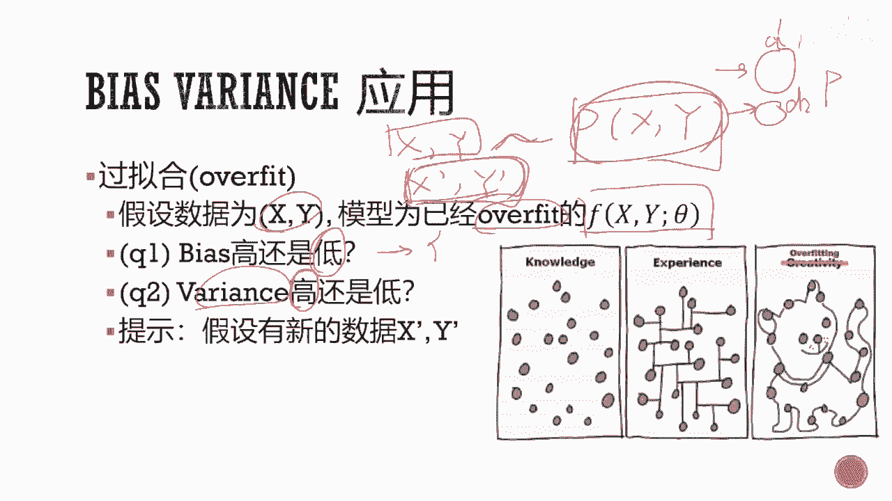
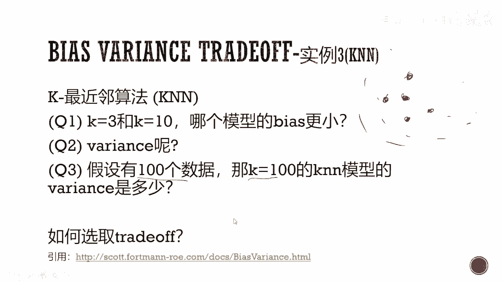
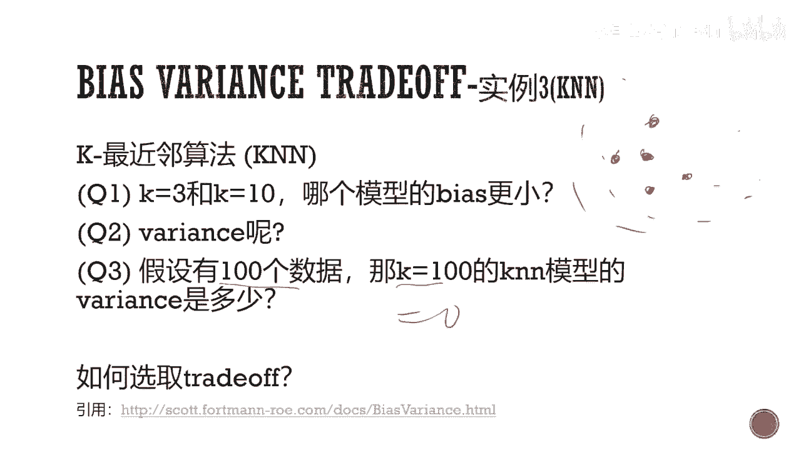

# 人工智能—机器学习中的数学（七月在线出品） - P17：偏差方差均衡和模型选择 📊

## 概述
在本节课中，我们将要学习机器学习中一个核心概念：偏差-方差均衡。我们将探讨偏差和方差的定义、它们如何影响模型性能，以及如何通过模型选择和正则化来平衡这两者，从而构建泛化能力更强的模型。

---

## 基础知识回顾
在深入探讨偏差-方差均衡之前，我们需要回顾几个核心的基础概念，包括线性回归、正态分布和最大似然估计。这些概念是理解后续内容的关键。

### 线性回归
线性回归是回归问题中最简单的模型。我们假设观测到的数据为 `(X1, Y1), (X2, Y2), ..., (Xn, Yn)`，其中 `X` 是特征向量，`Y` 是连续的标签值。

模型的目标是找到一个线性函数 `f(X) = X * θ` 来预测 `Y`。我们通过最小化预测值 `Y_hat` 与真实值 `Y` 之间的均方误差来求解参数 `θ`。

**目标函数（均方误差）**：
```
L(θ) = (1/n) * Σ (Y_i - X_i * θ)^2
```

通过最小化 `L(θ)`，我们可以得到参数 `θ` 的解析解：
```
θ_hat = (X^T * X)^(-1) * X^T * Y
```

### 正态分布
正态分布是一种常见的连续概率分布。对于一个正态分布 `N(μ, σ^2)`，`μ` 是期望（均值），`σ^2` 是方差。

**概率密度函数**：
```
f(x) = (1 / √(2πσ^2)) * exp(-(x-μ)^2 / (2σ^2))
```

期望 `μ` 描述了分布的中心位置，方差 `σ^2` 描述了数据围绕均值的离散程度。方差越大，分布越“宽”；方差越小，分布越“尖”。

### 最大似然估计
最大似然估计是一种参数估计方法，其核心思想是：在已知观测数据的情况下，选择能使这些数据出现概率最大的参数值。

对于线性回归，假设误差服从正态分布，那么最小化均方误差等价于进行最大似然估计。




---

## 什么是偏差和方差？
上一节我们回顾了基础知识，本节中我们来看看偏差和方差的正式定义。理解这两个概念是掌握偏差-方差均衡的前提。

我们假设存在一个真实的参数 `θ`，而我们通过模型从数据中估计出的参数是 `θ_hat`。由于数据是随机采样得到的，因此 `θ_hat` 也是一个随机变量。

*   **偏差**：衡量的是估计值的期望与真实值之间的差距。
    ```
    Bias(θ_hat) = E[θ_hat] - θ
    ```
    偏差反映了模型本身的系统性误差。偏差高，意味着模型过于简单，无法捕捉数据中的真实规律（欠拟合）。

*   **方差**：衡量的是估计值自身的离散程度，即其波动性。
    ```
    Variance(θ_hat) = E[(θ_hat - E[θ_hat])^2]
    ```
    方差反映了模型对训练数据中随机噪声的敏感程度。方差高，意味着模型过于复杂，过度拟合了训练数据中的细节和噪声（过拟合）。

**一个关键的理解**：这里的随机性来源于数据。因为我们用于训练模型的数据只是从真实数据分布中随机抽取的一个样本，所以基于不同数据样本训练出的模型参数 `θ_hat` 会有所不同，因此我们可以讨论它的期望和方差。

---

## 偏差-方差均衡
理解了偏差和方差的定义后，本节我们来看看它们如何共同决定模型的总体误差，以及为什么需要在两者之间进行权衡。

模型的总体误差（期望泛化误差）可以分解为偏差、方差和一个不可约的噪声项。对于平方误差损失，其分解公式如下：
```
Error = E[(Y - f_hat(X))^2] = Bias(f_hat)^2 + Variance(f_hat) + Noise
```



从这个公式可以看出：
1.  **偏差的平方**：模型预测值与真实值平均差异的平方。
2.  **方差**：模型预测值自身的波动范围。
3.  **噪声**：数据中固有的、无法被任何模型消除的随机误差。


**偏差-方差均衡的核心思想**：在模型复杂度和泛化能力之间取得平衡。
*   **简单模型**（如线性回归）：通常具有**高偏差、低方差**。模型不够灵活，可能无法拟合数据的真实结构（欠拟合），但对数据扰动不敏感，表现稳定。
*   **复杂模型**（如高阶多项式、深度神经网络）：通常具有**低偏差、高方差**。模型非常灵活，可以几乎完美拟合训练数据，但过度学习了数据中的噪声，导致在新数据上表现不稳定（过拟合）。




我们的目标是找到一个“甜蜜点”，使得偏差和方差之和最小，从而获得最佳的泛化性能。

---

## 应用：模型选择与正则化
上一节我们介绍了偏差-方差均衡的理论，本节中我们来看看它在实践中的两个主要应用：模型选择和正则化。

### 模型选择
模型选择的核心是找到那个使偏差和方差之和最小的模型复杂度。以下是一些常见的方法：

**以下是几种模型选择策略：**
*   **交叉验证**：将数据分为训练集和验证集（或K折），在训练集上训练不同复杂度的模型，在验证集上评估其性能，选择性能最好的模型。这直接评估了模型在未见数据上的表现（泛化误差）。
*   **信息准则**：如AIC（赤池信息准则）和BIC（贝叶斯信息准则）。它们在模型的对数似然值上加上一个与模型参数个数成正比的惩罚项，平衡拟合优度和模型复杂度。选择AIC或BIC值最小的模型。
    ```
    AIC = -2 * log(L) + 2 * k
    BIC = -2 * log(L) + log(n) * k
    ```
    （其中 `L` 是似然函数值，`k` 是参数个数，`n` 是样本数）

### 正则化
正则化是一种在模型训练过程中显式地控制模型复杂度、降低方差的技术。它通过在损失函数中增加一个对模型参数的惩罚项来实现。

**最常见的两种正则化范数：**
*   **L2正则化（岭回归）**：惩罚项是参数向量的L2范数平方。它倾向于让所有参数值都较小且分布均匀，但通常不会将参数压缩至零。
    ```
    损失函数 = 原始损失 + λ * Σ(θ_i^2)
    ```
*   **L1正则化（LASSO回归）**：惩罚项是参数向量的L1范数。它倾向于产生稀疏解，即会将一些不重要的特征对应的参数压缩至零，因此也具有特征选择的功能。
    ```
    损失函数 = 原始损失 + λ * Σ|θ_i|
    ```

参数 `λ` 控制正则化的强度：
*   `λ` 越大，惩罚越重，模型参数值被限制得越小，模型越简单（**高偏差，低方差**）。
*   `λ` 越小，惩罚越轻，模型越倾向于拟合训练数据（**低偏差，高方差**）。


通过调整 `λ`，我们实际上是在偏差和方差之间进行权衡，寻找最优的平衡点。选择 `λ` 的过程本身也是一个模型选择问题，通常通过交叉验证来完成。

---

## 总结
本节课中我们一起学习了机器学习中的核心概念——偏差-方差均衡。

我们首先回顾了线性回归和正态分布等基础知识。然后，我们明确了偏差和方差的定义：偏差源于模型本身的错误假设，方差源于模型对训练数据随机波动的过度敏感。接着，我们看到了模型的总体误差可以分解为偏差、方差和噪声之和，这揭示了模型复杂度与泛化能力之间需要权衡的本质。


最后，我们探讨了这一理论的两个重要实践应用：通过交叉验证或信息准则进行模型选择，以及通过L1/L2正则化在训练中直接控制模型复杂度。理解并应用偏差-方差均衡，是构建稳健、高性能机器学习模型的关键。