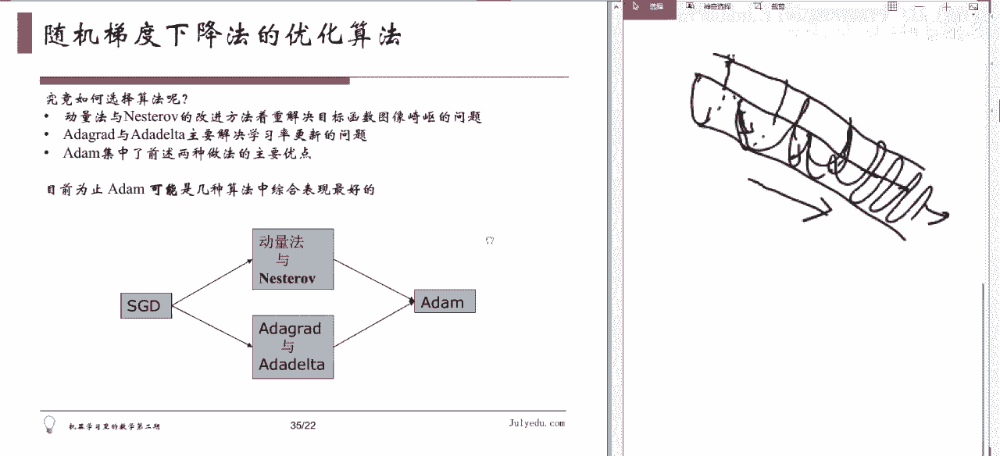

# 人工智能—机器学习中的数学（七月在线出品） - P18：随机梯度下降法的困难与变种 🧠

## 概述
在本节课中，我们将要学习梯度下降法在机器学习应用中遇到的两个主要困难，以及工程师们为解决这些困难而提出的一系列改进算法，特别是随机梯度下降法及其各种变种。

---

## 梯度下降法的两个主要困难

上一节我们介绍了梯度下降法的基本原理。然而，在具体的工程实践中，标准的梯度下降法会遇到两个显著的困难。

### 困难一：梯度计算开销大
在机器学习中，目标函数通常不是由一个简单的公式给出。它通常是大量样本损失函数的求和。对这样的函数求梯度，需要对每个样本的损失函数分别求导后再求和。当样本量巨大时，这个过程会非常耗时耗力。

### 困难二：学习率难以选择
学习率的选择是一个棘手的问题。学习率设置过小，会导致算法收敛速度极慢。学习率设置过大，则可能导致算法在最优解附近震荡，甚至无法收敛。对于新问题，通常需要反复试验来寻找合适的学习率，这非常耗费时间。

---

## 随机梯度下降法 (Stochastic Gradient Descent, SGD)

为了解决梯度计算开销大的问题，工程师们提出了随机梯度下降法。这是目前工程上使用最广泛的梯度下降类优化算法。

### 基本思想
既然对所有样本计算梯度太慢，那么每次只用一个样本计算梯度。最原始的随机梯度下降法正是这样做的：每次迭代时，随机选取一个样本计算梯度并更新参数。

以下是其核心更新公式的简化表示：
`θ = θ - η * ∇J_i(θ)`
其中，`∇J_i(θ)` 是第 `i` 个样本的损失函数梯度，`η` 是学习率。

### 优点与缺点
以下是随机梯度下降法的主要特点：

*   **优点1：计算高效**：每次迭代只计算一个样本的梯度，大大减少了计算量。
*   **优点2：可能跳出局部极小值**：由于梯度估计带有随机噪声，这增加了算法跳出局部极小值的潜力。
*   **缺点：路径震荡**：单个样本的梯度方向不能代表整体数据的梯度方向，导致优化路径非常嘈杂、震荡剧烈，可能影响收敛。

为了应对路径震荡的问题，在实践中通常会采用一个策略：**逐渐缩小学习率**。开始时使用一个较大的学习率进行快速探索，随后逐渐减小学习率，使算法最终能够稳定收敛。

---

## 小批量随机梯度下降法 (Mini-batch SGD)

只使用一个样本虽然快，但梯度估计的噪声太大，不够稳定。因此，更常用的改进版本是小批量随机梯度下降法。

### 核心做法
每次梯度计算时，不使用全部样本，也不只使用一个样本，而是随机抽取一小批样本（例如100个）来计算梯度的平均值，并用此平均值来更新参数。

其更新公式可表示为：
`θ = θ - η * (1/m) * Σ ∇J_k(θ)`
其中，`m` 是小批量的大小，`Σ ∇J_k(θ)` 是该批样本梯度的总和。

### 为何成为主流
以下是它成为主流方法的原因：

*   **平衡效率与稳定性**：它比标准梯度下降法计算更快，比原始SGD的梯度估计更稳定。
*   **硬件友好**：小批量的计算可以很好地利用现代计算库（如针对矩阵运算优化的库）进行并行加速。
*   **术语惯例**：在深度学习领域，通常所说的“SGD”指的就是小批量随机梯度下降法。

关于“随机”二字的含义：它主要指在每轮训练开始前，会将训练数据集随机打乱顺序，然后按顺序依次抽取小批量。这确保了每个样本都有机会被使用，且顺序是随机的。

---

## 标准梯度下降法的其他局限

随机梯度下降法主要解决了计算开销的问题，但对于学习率选择困难以及某些复杂函数地形下的优化问题，仍然存在局限。

### 问题一：在“峡谷”地形中表现不佳
考虑一种像狭窄倾斜峡谷的地形。整体下降方向是沿着峡谷走向，但峡谷两侧的壁非常陡峭。梯度下降法在局部点计算梯度时，陡峭侧壁的方向分量可能很大，导致更新路径在峡谷两侧来回震荡，像“之”字形前进，整体收敛速度很慢。

### 问题二：学习率对所有参数“一视同仁”
在复杂模型中，不同参数的重要性、更新频率可能不同。理想情况下，对于不常更新的参数，一旦有机会更新，应该用较大的学习率；对于频繁更新的参数，则应用较小的学习率进行精细调整。固定的全局学习率无法做到这一点。

---

## 随机梯度下降法的改进变种

为了解决上述问题，研究者们提出了多种改进算法。

### 1. 动量法 (Momentum)
动量法旨在解决“峡谷”地形中的震荡问题。它的思想类似于物理学中的动量：在更新时不仅考虑当前的梯度，还会保留一部分上一次的更新方向。这有助于抵消不同方向上的震荡，使优化方向更加一致地沿着峡谷走向前进。

### 2. AdaGrad / RMSProp
这类方法旨在解决参数自适应学习率的问题。其核心思想是：**对于历史上更新频繁（梯度平方和较大）的参数，给予较小的学习率；对于更新不频繁（梯度平方和较小）的参数，给予较大的学习率。** 这样每个参数都拥有了自己的、随时间调整的学习率。

### 3. Adam (Adaptive Moment Estimation)
Adam方法结合了动量法和自适应学习率方法的优点。它既像动量法一样记录梯度的一阶矩（均值）来保持方向，又像RMSProp一样记录梯度的二阶矩（未中心化的方差）来为每个参数调整学习率。因此，它能同时应对崎岖地形和参数学习率自适应的问题。

---

## 如何选择优化算法

了解不同算法的设计目的，能帮助我们做出更合适的选择。以下是一个简单的选择思路：

*   如果你的模型训练相对平稳，没有明显的“峡谷”地形问题，可以优先选择**RMSProp**或**Adam**，它们能自适应调整学习率。
*   如果你的优化问题地形复杂，存在大量震荡，可以尝试使用**动量法**。
*   如果你不确定问题的特性，或者希望有一个表现稳健的默认选择，**Adam**优化器通常是一个不错的起点，因为它结合了多种优点。

在实际应用中，主流深度学习框架（如TensorFlow, PyTorch）都内置了这些优化器，我们只需在配置模型时选择即可。

---

## 总结
本节课中我们一起学习了梯度下降法在工程实践中的两大困难：巨大的梯度计算开销和难以选择的学习率。为了克服这些困难，我们介绍了**随机梯度下降法（SGD）**及其更实用的版本**小批量随机梯度下降法**，它们通过减少每次迭代的计算量来提升效率。此外，我们还探讨了标准方法在复杂优化地形中的局限，并介绍了几种重要的改进变种：**动量法**用于减少震荡、**AdaGrad/RMSProp**用于为每个参数自适应学习率，以及综合二者优点的**Adam**算法。理解这些算法的核心思想，将帮助你在实际项目中更有效地选择和运用优化工具。