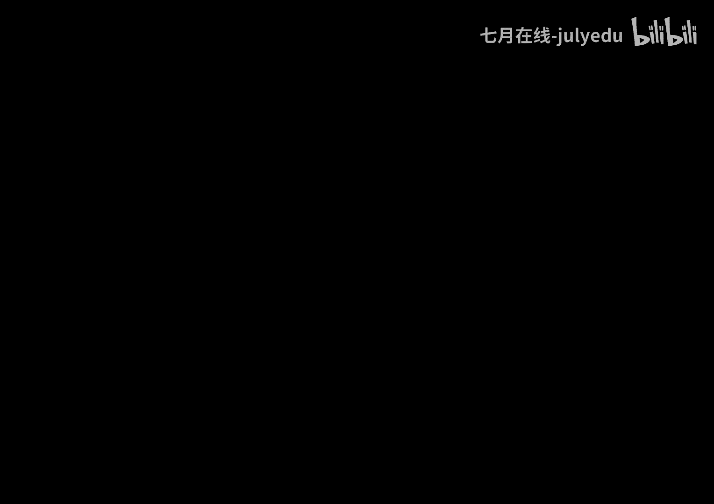
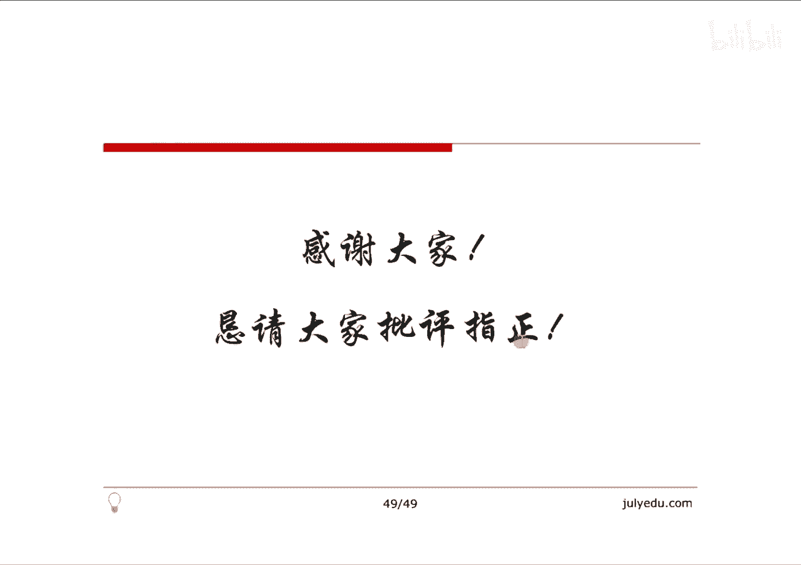

# 人工智能—机器学习中的数学（七月在线出品） - P2：半小时梳理凸优化

## 📚 概述

在本节课中，我们将共同讨论凸优化相关的问题。主要内容将从凸集、凸函数和凸优化这三个核心方面展开。通过本节课的学习，你将理解凸优化的基本概念、性质以及其在机器学习中的重要性。

---

## 🧱 第一部分：凸集

上一节我们介绍了课程的整体结构，本节中我们来看看凸集。凸集是凸优化的基础，理解凸集有助于我们后续理解凸函数和凸优化问题。

### 凸集的定义

如果一个集合 C 满足：对于集合内任意两点，连接这两点的线段上的所有点也都在该集合内，那么这个集合就是一个凸集。

用数学公式描述如下：
对于任意 \( x_1, x_2 \in C \) 和任意 \( \theta \in [0, 1] \)，都有：
\[
\theta x_1 + (1 - \theta) x_2 \in C
\]

以下是凸集与非凸集的例子：
*   一个任意的凸多边形是一个凸集。
*   一条线段是一个凸集。
*   一个内部有凹陷的扇形区域不是一个凸集。
*   一个边界有缺失的多边形不是一个凸集。

### 超平面与半空间

超平面和半空间是构建更复杂凸集（如多面体）的基本单元。

*   **超平面**：由方程 \( a^T x = b \) 定义的所有点 \( x \) 的集合，其中 \( a \) 是一个非零向量。
*   **半空间**：由不等式 \( a^T x \leq b \) 或 \( a^T x \geq b \) 定义的所有点 \( x \) 的集合。

在二维空间中，超平面是一条直线，\( a \) 是其法线方向。半空间则是这条直线某一侧的所有点。

### 多面体

多面体是由有限个线性不等式和等式定义的集合。其标准形式为：
\[
\begin{cases}
Ax \preceq b \\
Cx = d
\end{cases}
\]
其中 \( A \) 和 \( C \) 是矩阵，\( b \) 和 \( d \) 是向量。满足这些条件的 \( x \) 的集合就是一个多面体。

多面体是凸集。在有些文献中，有界的多面体也被称为多胞形。

### 保持凸性的运算

某些运算作用于凸集后，结果仍然是凸集，这些运算称为保凸运算。

以下是几种重要的保凸运算：
*   **交集**：任意多个凸集的交集仍然是凸集。
*   **仿射变换**：若 \( f(x) = Ax + b \) 是一个仿射变换（\( A \) 是矩阵，\( b \) 是向量），则凸集 \( S \) 在 \( f \) 下的像 \( f(S) \) 是凸集；反之，若 \( f(S) \) 是凸集，则原像 \( S \) 也是凸集。
*   **透视变换**：函数 \( P: \mathbb{R}^{n+1} \rightarrow \mathbb{R}^n \) 定义为 \( P(z, t) = z/t \)（其中 \( t > 0 \)）。凸集在透视变换下的像仍然是凸集。
*   **投射函数（线性分式变换）**：这是仿射函数与透视函数的复合，形式为 \( f(x) = (Ax + b) / (c^T x + d) \)，其定义域为 \( \{x | c^T x + d > 0\} \)。投射函数也是保凸运算。

---

## 📈 第二部分：凸函数

在理解了凸集之后，本节我们来看看凸函数。凸函数在优化问题中具有极好的性质，例如局部最小值就是全局最小值。

### 凸函数的定义

一个函数 \( f: \mathbb{R}^n \rightarrow \mathbb{R} \) 是凸函数，如果其定义域 \( \text{dom } f \) 是凸集，且对于所有 \( x, y \in \text{dom } f \) 和 \( \theta \in [0, 1] \)，满足：
\[
f(\theta x + (1-\theta) y) \leq \theta f(x) + (1-\theta) f(y)
\]
这个不等式的几何意义是：函数图像上任意两点间的线段（割线）位于函数图像的上方。

### 凸函数的一阶条件

如果函数 \( f \) 一阶可微，那么 \( f \) 是凸函数当且仅当其定义域是凸集，且对于所有 \( x, y \in \text{dom } f \)，满足：
\[
f(y) \geq f(x) + \nabla f(x)^T (y - x)
\]
这个不等式的意义是：函数在任何一点的一阶泰勒展开式（即该点处的切线或切平面）是函数的一个全局下估计。

### 凸函数的二阶条件

如果函数 \( f \) 二阶可微，那么 \( f \) 是凸函数当且仅当其定义域是凸集，且其 Hessian 矩阵是半正定的：
\[
\nabla^2 f(x) \succeq 0
\]
对于一元函数，这等价于二阶导数 \( f''(x) \geq 0 \)。

### 上镜图

函数 \( f \) 的上镜图定义为：
\[
\text{epi } f = \{ (x, t) | x \in \text{dom } f, f(x) \leq t \}
\]
一个函数是凸函数，当且仅当它的上镜图是凸集。这个性质将凸函数与凸集紧密联系了起来。

### Jensen 不等式

凸函数的定义可以推广到多个点和连续的情形，这就是 Jensen 不等式。

离散形式：若 \( f \) 是凸函数，则
\[
f(\sum_{i=1}^k \theta_i x_i) \leq \sum_{i=1}^k \theta_i f(x_i)
\]
其中 \( \theta_i \geq 0 \) 且 \( \sum_{i=1}^k \theta_i = 1 \)。

连续/期望形式：若 \( f \) 是凸函数，则
\[
f(\mathbb{E}[x]) \leq \mathbb{E}[f(x)]
\]
Jensen 不等式是证明许多其他不等式（如算术-几何平均不等式、KL散度非负性）的基础工具。

### 保持函数凸性的运算

与凸集类似，对凸函数进行某些运算后，结果仍然是凸函数。

以下是几种保持凸性的运算：
*   **非负加权和**：若 \( f_1, ..., f_k \) 是凸函数，\( \omega_1, ..., \omega_k \geq 0 \)，则 \( f = \sum_{i=1}^k \omega_i f_i \) 是凸函数。
*   **与仿射函数复合**：若 \( f \) 是凸函数，则 \( g(x) = f(Ax + b) \) 也是凸函数。
*   **逐点取最大值**：若 \( f_1, ..., f_k \) 是凸函数，则 \( f(x) = \max\{f_1(x), ..., f_k(x)\} \) 是凸函数。
*   **逐点上确界**：若对于每个 \( y \in \mathcal{A} \)，函数 \( f(x, y) \) 关于 \( x \) 是凸的，则函数 \( g(x) = \sup_{y \in \mathcal{A}} f(x, y) \) 关于 \( x \) 是凸的。

逐点取最大值运算的凸性，可以直观理解为：若干条直线（凸函数）在每一点处取最高的那条，形成的“屋顶”形状仍然是凸的。

---

## ⚙️ 第三部分：凸优化

掌握了凸集和凸函数，我们现在可以正式进入凸优化部分。凸优化问题因其良好的性质，是机器学习中许多算法的基础。

### 优化问题的一般形式

一个优化问题通常可以写成如下形式：
\[
\begin{aligned}
& \underset{x}{\text{minimize}}
& & f_0(x) \\
& \text{subject to}
& & f_i(x) \leq 0, \; i = 1, \ldots, m \\
& & & h_j(x) = 0, \; j = 1, \ldots, p
\end{aligned}
\]
其中 \( x \in \mathbb{R}^n \) 是优化变量，\( f_0 \) 是目标函数，\( f_i \) 是不等式约束函数，\( h_j \) 是等式约束函数。

### 凸优化问题的定义

如果上述一般形式中的目标函数 \( f_0 \) 和所有不等式约束函数 \( f_i \) 都是凸函数，并且所有等式约束函数 \( h_j \) 都是仿射函数（即 \( h_j(x) = a_j^T x - b_j \)），那么该问题就是一个凸优化问题。

凸优化问题的关键性质是：其可行域是凸集，并且任何局部最优解都是全局最优解。

### 拉格朗日对偶

对于不一定为凸的一般优化问题，我们可以通过拉格朗日对偶将其转化为一个凸优化问题（对偶问题）。

首先，为原问题构造拉格朗日函数，引入拉格朗日乘子 \( \lambda_i \)（对应不等式约束）和 \( \nu_j \)（对应等式约束）：
\[
L(x, \lambda, \nu) = f_0(x) + \sum_{i=1}^m \lambda_i f_i(x) + \sum_{j=1}^p \nu_j h_j(x)
\]
其中要求 \( \lambda_i \geq 0 \)。

然后，定义拉格朗日对偶函数 \( g \) 为拉格朗日函数关于 \( x \) 的下确界：
\[
g(\lambda, \nu) = \inf_{x \in \mathcal{D}} L(x, \lambda, \nu)
\]
对偶函数 \( g(\lambda, \nu) \) 具有一个非常重要的性质：**无论原问题是否为凸，对偶函数 \( g \) 总是凹函数**。这是因为对于固定的 \( x \)，\( L(x, \lambda, \nu) \) 是关于 \( (\lambda, \nu) \) 的仿射函数，而一系列仿射函数逐点取**下确界**的结果是凹函数。

对偶函数给出了原问题最优值 \( p^* \) 的一个下界：对于任意 \( \lambda \succeq 0 \) 和 \( \nu \)，有 \( g(\lambda, \nu) \leq p^* \)。

### 对偶问题与强对偶性

为了得到最紧的下界，我们求解对偶问题，即最大化对偶函数：
\[
\begin{aligned}
& \underset{\lambda, \nu}{\text{maximize}}
& & g(\lambda, \nu) \\
& \text{subject to}
& & \lambda \succeq 0
\end{aligned}
\]
由于 \( g \) 是凹函数，且约束是简单的非负约束，因此**对偶问题总是一个凸优化问题**。

设对偶问题的最优值为 \( d^* \)。根据定义，总有 \( d^* \leq p^* \)，这个性质称为**弱对偶性**。如果等号成立，即 \( d^* = p^* \)，则称**强对偶性**成立。

### KKT 条件

当原问题是凸优化问题且满足某些约束规范（如 Slater 条件）时，强对偶性通常成立。此时，原问题最优解 \( x^* \) 和对偶问题最优解 \( \lambda^*, \nu^* \) 必须满足一组称为 **Karush-Kuhn-Tucker (KKT) 条件** 的方程。

KKT 条件包括：
1.  **原始可行性**：\( f_i(x^*) \leq 0, \quad h_j(x^*) = 0 \)
2.  **对偶可行性**：\( \lambda_i^* \geq 0 \)
3.  **互补松弛条件**：\( \lambda_i^* f_i(x^*) = 0 \)
4.  **梯度为零**：\( \nabla f_0(x^*) + \sum_{i=1}^m \lambda_i^* \nabla f_i(x^*) + \sum_{j=1}^p \nu_j^* \nabla h_j(x^*) = 0 \)

对于凸优化问题，如果强对偶性成立，那么满足 KKT 条件的点就是原问题和对偶问题的最优解。

### 实例：最小二乘问题的对偶

考虑一个受线性等式约束的最小二乘问题：
\[
\begin{aligned}
& \underset{x}{\text{minimize}}
& & x^T x \\
& \text{subject to}
& & Ax = b
\end{aligned}
\]
其拉格朗日函数为 \( L(x, \nu) = x^T x + \nu^T (Ax - b) \)。通过对 \( x \) 求导并令其为零，可以求出对偶函数 \( g(\nu) \)，再最大化 \( g(\nu) \) 得到对偶解。最终可以验证，通过求解这个对偶凸优化问题得到的最优解 \( x^* \)，与直接求解原问题得到的结果一致，这证明了该问题具有强对偶性。

---

## 🎯 总结

本节课中，我们一起学习了凸优化的核心内容。

我们首先从**凸集**开始，理解了其定义、相关概念（如超平面、半空间、多面体）以及保持凸性的运算（交集、仿射变换等）。

接着，我们深入探讨了**凸函数**，学习了其定义、一阶和二阶判定条件、上镜图概念、Jensen不等式以及保持函数凸性的运算（如加权和、与仿射函数复合、逐点取最大值）。

最后，我们将前两部分知识应用于**凸优化**。我们定义了凸优化问题，并介绍了处理更一般优化问题的强大工具——**拉格朗日对偶**。通过构建对偶问题，我们总能得到一个凸优化问题，并在满足强对偶性的情况下，利用**KKT条件**来求解原问题的最优解。

凸优化为机器学习中的许多模型（如支持向量机、逻辑回归）提供了坚实的理论基础和高效的求解思路。

