# 人工智能—机器学习中的数学（七月在线出品） - P3：概率计算与拒绝采样 🎲


在本节课中，我们将要学习概率论中的两个核心概念：事件独立性的判断与拒绝采样方法。我们将从一个有趣的“机场会面”问题入手，探讨如何用几何概型解决概率计算，并深入理解如何利用一个已知的随机数生成器来构造另一个随机数生成器。

## 回顾：机场会面问题 ✈️

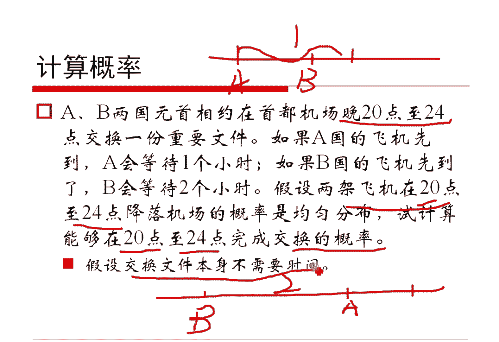

上一节我们介绍了如何用分段积分计算概率，本节中我们来看看如何用更直观的几何概型来解决一个经典问题。

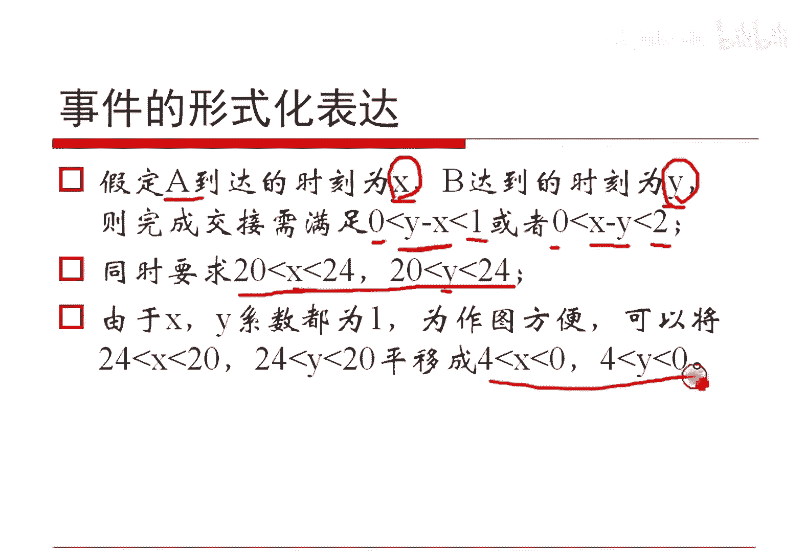

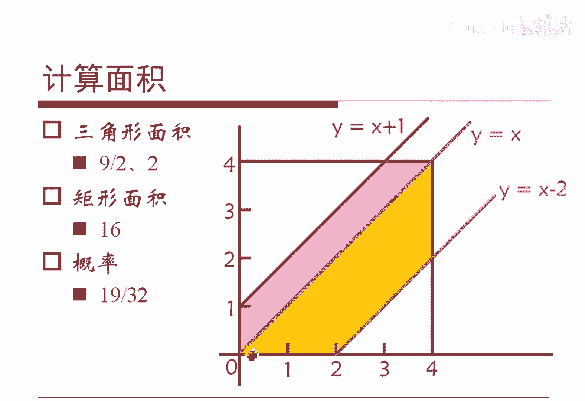

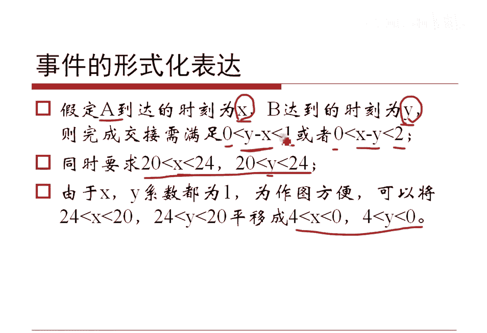

问题描述如下：A国和B国的元首约定在晚上8点到0点之间于机场交换文件。A国飞机先到会等待1小时，B国飞机先到会等待2小时。假设两架飞机在8点到0点间到达的时刻服从均匀分布，且行动相互独立。求他们能成功交换文件的概率。

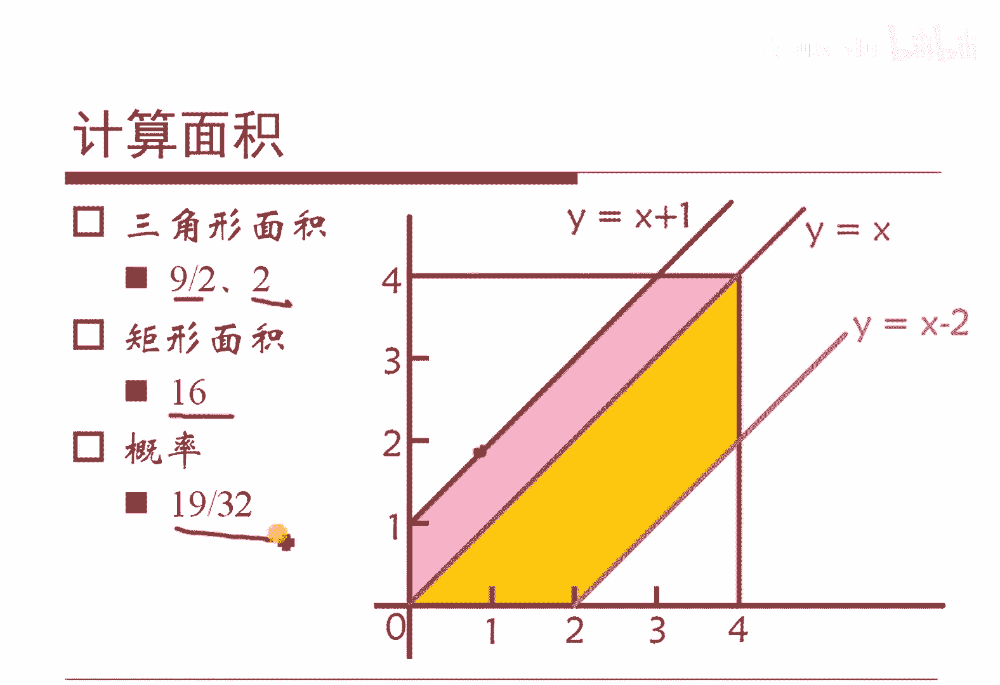

我们可以将A、B到达的时刻分别设为随机变量X和Y。由于时间区间是8点到0点，为方便计算，我们可以将其平移到0到4小时。那么，成功交换的条件可以表示为：
*   当A先到（X < Y）时，需满足 `Y - X <= 1`。
*   当B先到（Y < X）时，需满足 `X - Y <= 2`。

同时，X和Y都必须落在区间[0, 4]内。

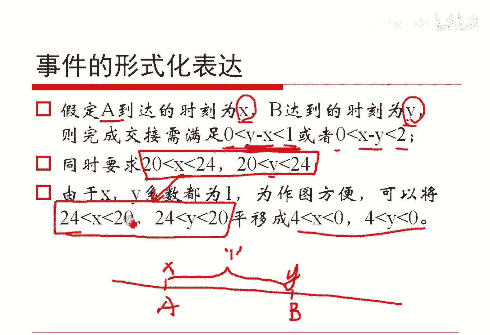

### 几何概型解法 📐

我们可以建立一个平面直角坐标系，横轴为X（A到达时刻），纵轴为Y（B到达时刻）。总的基本事件区域是边长为4的正方形，其面积为 `4 * 4 = 16`。

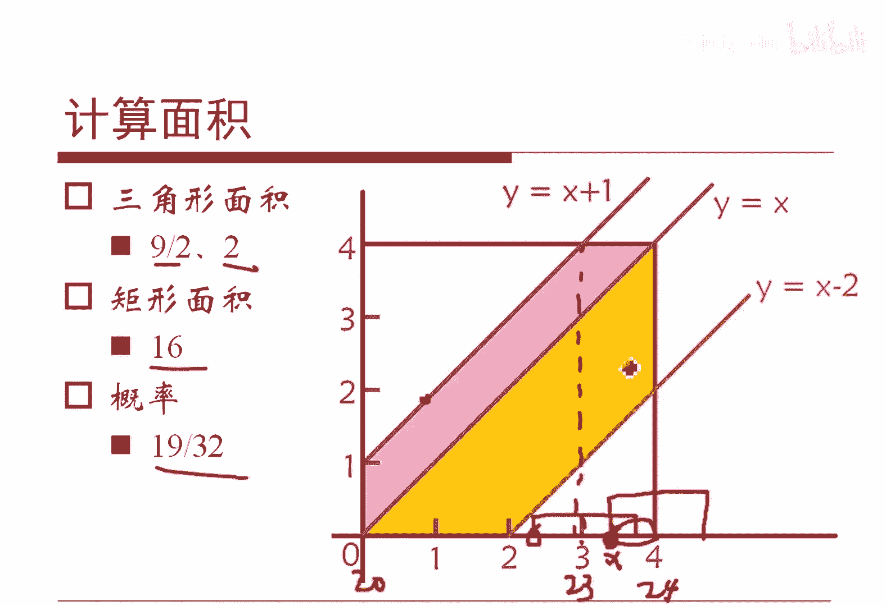

在这个正方形内，满足交换条件的区域由以下三条直线围成：
*   `Y = X` （对角线）
*   `Y = X + 1` （A等待线）
*   `Y = X - 2` （B等待线）

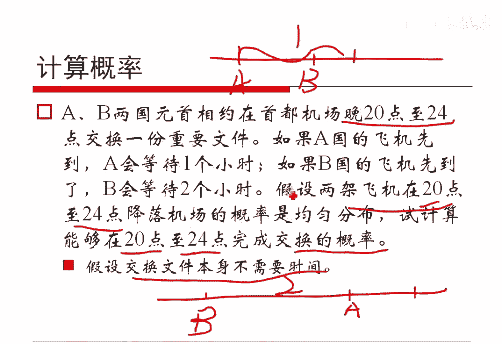

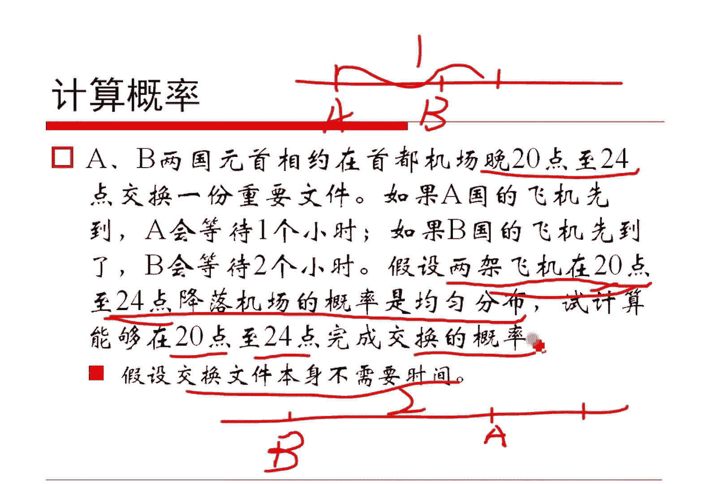

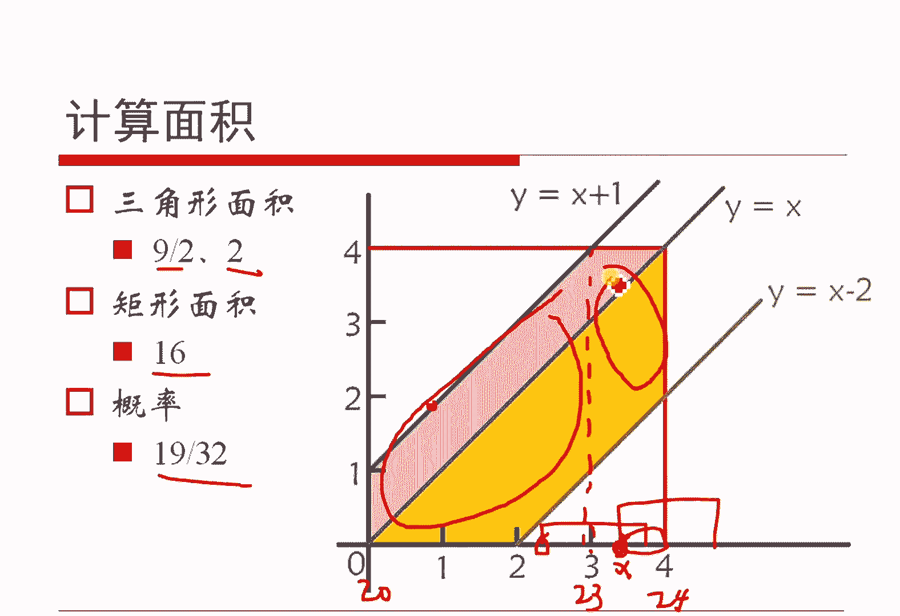

阴影区域（即满足 `|X-Y| <= 1` 或 `|X-Y| <= 2` 且在正方形内的部分）的面积与正方形总面积之比，即为所求概率。通过计算两个空白三角形的面积，再用总面积减去它们，可以方便地得到阴影面积，最终算出概率值。

**核心公式**：
```
P(成功交换) = 阴影区域面积 / 正方形总面积
```

## 从随机到随机：拒绝采样法 🎯

解决了会面问题，我们来看另一个经典问题：如何利用一个已知的均匀随机数生成器，构造另一个我们需要的均匀随机数生成器。

具体问题是：假设有一个函数 `rand7()`，可以均匀地返回1到7之间的整数。要求仅使用 `rand7()` 来构造一个函数 `rand10()`，使其能均匀地返回1到10之间的整数。

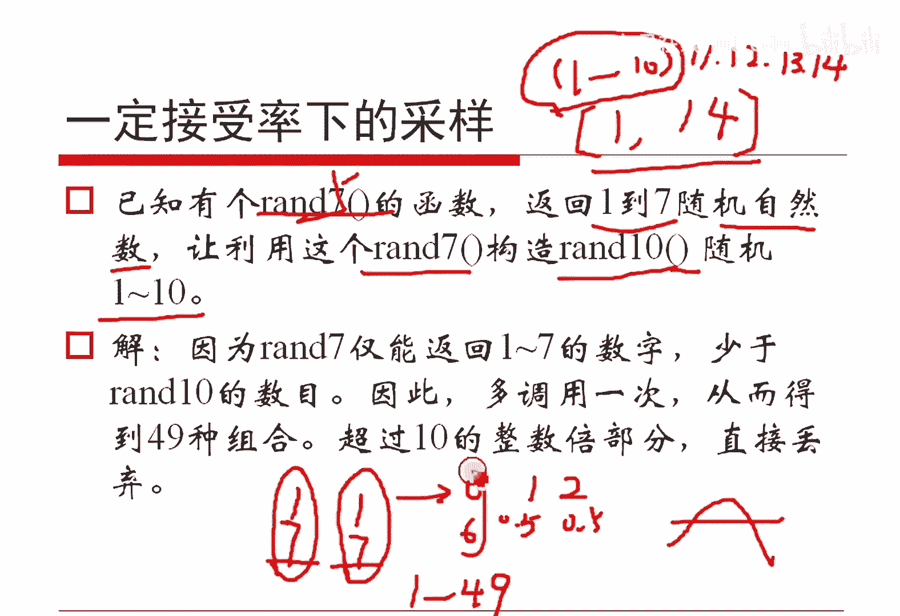

一个直观但错误的想法是：将两次 `rand7()` 的结果相加或相减。例如 `rand7() + rand7() - 4`，其取值范围是1到10，但**其分布不再是均匀的**。因为两个均匀分布的和的分布会趋向于正态分布（中心极限定理）。

### 正确的构造方法：拒绝采样

以下是构造 `rand10()` 的正确步骤：

1.  **扩大采样空间**：利用 `rand7()` 构造一个更大范围的均匀分布。我们可以将两次调用 `rand7()` 的结果看作一个两位的7进制数。
    *   令 `a = rand7() - 1`，得到均匀的 `[0, 6]`。
    *   令 `b = rand7() - 1`，得到另一个均匀的 `[0, 6]`。
    *   计算 `num = a * 7 + b`。这样，`num` 可以均匀地覆盖 `0` 到 `48`（即 `7*7 - 1`）这49个整数。

2.  **拒绝非均匀部分**：我们的目标是1到10，即10个均匀的数。49不是10的整数倍，所以不能直接映射。我们采用“拒绝采样”策略：只接受 `0` 到 `39` 这40个数字（因为40是10的整数倍），拒绝 `40` 到 `48` 这9个数字。
    *   如果 `num >= 40`，则本次采样无效，重新执行步骤1。
    *   如果 `num < 40`，则进入步骤3。

3.  **均匀映射到目标区间**：对于被接受的 `num`（取值范围0~39），我们通过 `num % 10 + 1` 将其均匀映射到 `[1, 10]` 区间。

**代码描述**：
```python
def rand10():
    while True:
        a = rand7() - 1  # [0, 6]
        b = rand7() - 1  # [0, 6]
        num = a * 7 + b   # [0, 48]
        if num < 40:      # 拒绝采样，只保留[0, 39]
            return num % 10 + 1  # 映射到[1, 10]
```
这种方法保证了 `rand10()` 返回每个数字的概率严格相等，均为 `1/10`。其采样效率（接受率）为 `40/49`。

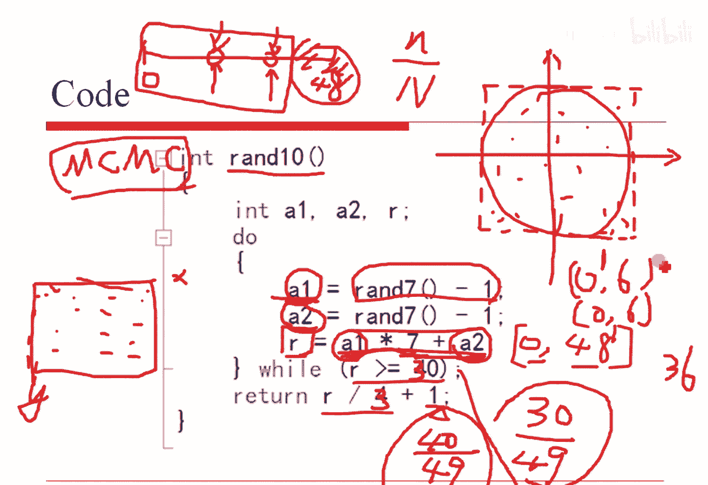

## 事件的独立性与信息度量 ⚖️

在解决了具体的概率计算和采样问题后，我们需要回到理论层面，理解事件间的关系。

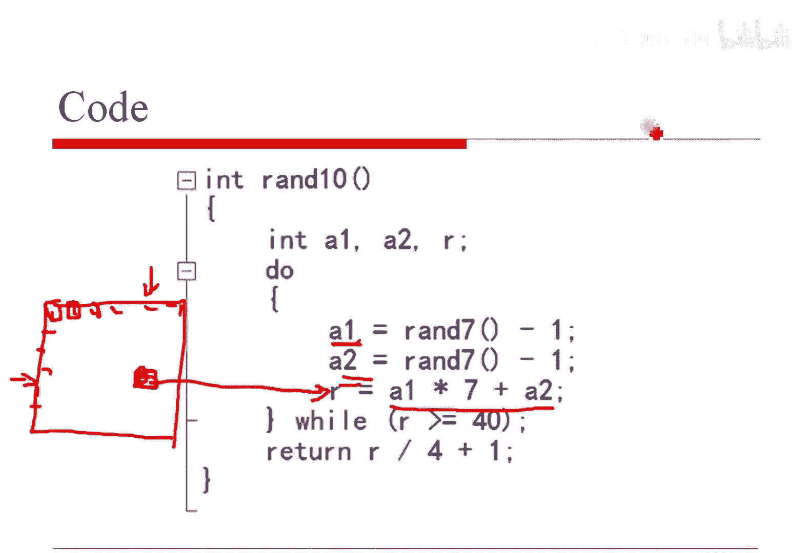

### 事件独立的定义

对于两个事件A和B，如果它们满足以下公式，则称A和B相互独立：
```
P(A ∩ B) = P(A) * P(B)
```
这个公式的含义是，事件A和B同时发生的概率，等于它们各自发生概率的乘积。根据条件概率公式 `P(A|B) = P(A∩B) / P(B)`，当A和B独立时，可以推导出 `P(A|B) = P(A)`。这意味着，知道B是否发生，完全不影响A发生的概率。在实践中，我们常常根据事件的实际意义（如两次独立的实验）来判断其独立性，而非直接计算上述公式。

### 如何度量事件间的信息关联？

一个自然的想法是：如果两个事件独立，它们之间“共享的信息量”应该为0。那么，如何量化这种“共享的信息量”呢？

以下是几种思路：
*   **基于条件概率的差值**：可以定义为 `P(A) - P(A|B)` 或 `P(A|B) - P(A)`。当独立时，差值为0。但这种定义可能不对称。
*   **基于概率比的对数**：更常见的思路是观察比值 `P(A|B) / P(A)`。当独立时，比值为1。对其取对数 `log[ P(A|B) / P(A) ]`，独立时结果即为0。这个量在信息论中与“互信息”的概念紧密相关，它对称地度量了两个变量之间共享的信息。

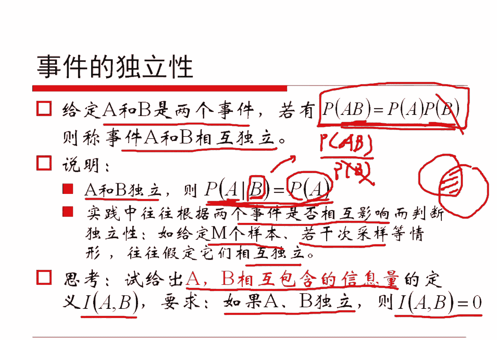

## 总结 📝

本节课中我们一起学习了：
1.  **几何概型在概率计算中的应用**：通过将“机场会面”问题转化为二维平面上的面积计算，我们得到了一个直观且高效的解法。
2.  **拒绝采样法**：掌握了如何利用一个基础的均匀随机源（`rand7()`），通过“采样-拒绝-映射”的步骤，构造出另一个均匀随机生成器（`rand10()`）。这是蒙特卡洛方法中的重要基础。
3.  **事件的独立性**：从数学定义（`P(AB)=P(A)P(B)`）和直观意义（一个事件的发生不影响另一个）两个角度理解了独立性。
4.  **信息关联的度量**：初步探讨了如何量化两个事件之间的信息关联，引出了基于概率比的对数思想，为后续学习信息论概念（如互信息）做了铺垫。

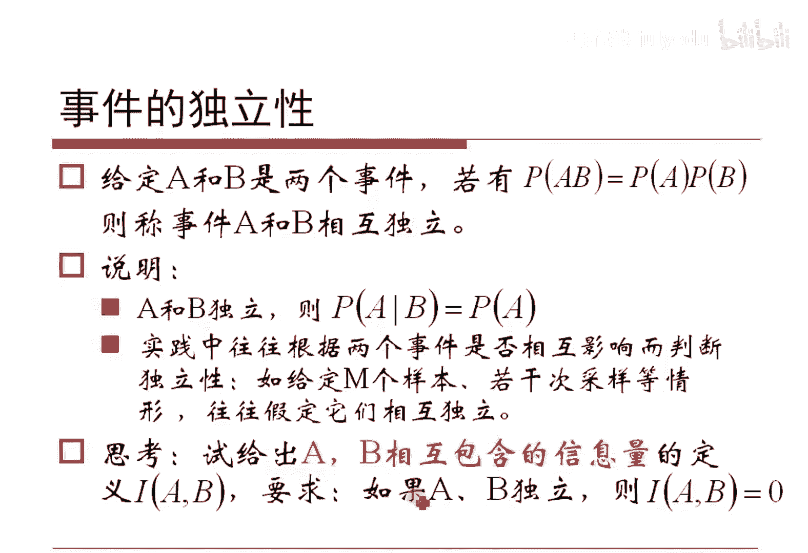

这些内容将概率论的基本思想与解决实际问题的技巧相结合，是理解更复杂机器学习算法中随机过程的基础。