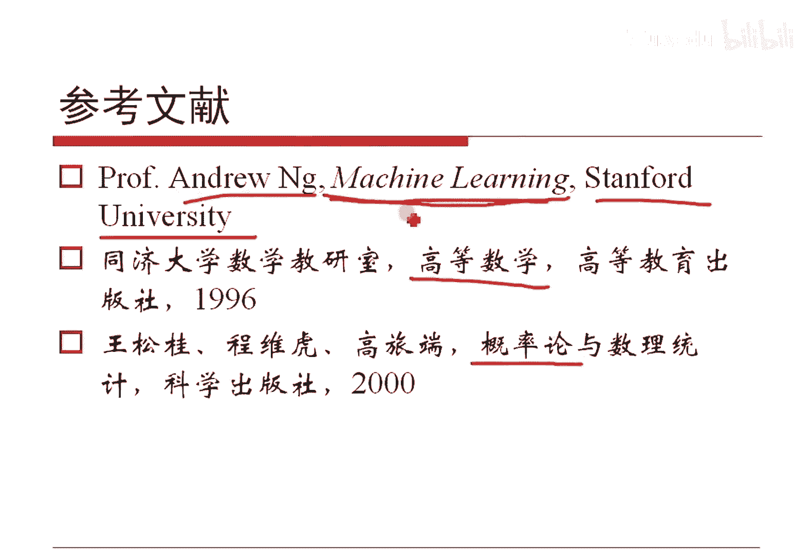

# 人工智能—机器学习中的数学（七月在线出品） - P4：概率论基础

在本节课中，我们将要学习概率论的基础知识，这是理解机器学习模型背后原理的基石。我们将从概率的基本定义出发，探讨概率密度、累积分布等核心概念，并通过实例理解条件概率、贝叶斯公式等重要思想。

## 概率的基本认识 🎲

如果一个事件X发生的可能性是一定会发生，我们记作1。如果一定不会发生，则记作0。因此，概率可以看作是关于事件X的一个函数，记作 **P(X)**。这个概率值一定是从0到1的，可以取0，也可以取1。

但是需要注意，反过来并不总是成立。如果一个事件一定不发生，其概率一定是0，这句话没错。然而，如果一个事件发生的概率为0，并不意味着这个事件一定不会发生。例如，在一个桌面上投针，投之前针尖落在桌面任意一个特定点的概率为0（因为点的面积除以桌面面积是0），但投掷后，针尖总会落在某个具体的点上，这个事件就发生了。

同理，概率为1也并不意味着事件一定发生。例如，模拟退火算法以概率1收敛于全局最优解，但并不意味着它一定会收敛到全局最优解。

## 离散与连续概率 📊

如果X是一个离散的随机变量，那么 **P(X = x0)** 表示X取特定值x0的概率。如果X是连续的，我们通常使用概率密度函数来描述。概率密度函数是累积分布函数的导数。

在计算机科学和机器学习的视角下，离散情况的求和（Σ）与连续情况的积分（∫）本质是相同的，只是处理的对象不同。

## 累积分布函数 📈

给定概率分布后，我们可以计算累积概率分布函数（CDF）。对于随机变量X，其累积分布函数 **F(x0)** 定义为 **P(X ≤ x0)**。这个函数是单调非减的。当x0取定义域的最小值时，F(x0)为0；当x0取最大值时，F(x0)为1。

反过来思考，如果一个函数 **y = F(x)** 的值域是[0, 1]并且是单调递增的，那么它可以被看作是某个随机变量的累积分布函数。对其求导即可得到概率密度函数（PDF）。逻辑回归等模型正是基于这个思想构建的。

*   **概率密度函数** 简称 **PDF**。
*   **累积分布函数** 简称 **CDF**。

## 古典概型实例 🧮

上一节我们介绍了概率的基本概念，本节中我们来看看如何应用这些概念解决实际问题。以下是几个古典概型的例子。

**例1：生日悖论**
将n个人随机分配到N=365天（生日）中，计算至少有两人生日相同的概率。所有基本事件数为 **N^n**。有效事件（所有人生日都不同）数为排列数 **P(N, n)**。因此，至少两人生日相同的概率为 **1 - P(N, n) / N^n**。当人数达到50时，这个概率高达约97%，这与直觉相悖，故称“生日悖论”。

**例2：麻将无将概率**
标准麻将136张牌，分为34种牌，每种4张。庄家起手摸14张牌，计算没有“将”（两张相同的牌）的概率。
*   基本事件总数：从136张中选14张，即 **C(136, 14)**。
*   有效事件数：先从34种牌中选出14种，然后在这14种牌中各选1张，即 **C(34, 14) * 4^14**。
两者相除即可得到概率，计算结果约为0.012，意味着打约80次牌可能会遇到一次起手无将的情况。

**例3：装箱问题**
将15件商品（12正品，3次品）随机放入3个箱子，每箱5件。求每个箱子恰好有1件次品的概率。
*   基本事件总数：15件商品分成3组（5,5,5），方法数为 **15! / (5!5!5!)**。
*   有效事件数：先将3件次品分别放入3个箱子（3!种方法），再将12件正品放入3个箱子，每箱4件，方法数为 **12! / (4!4!4!)**。
概率为两者相乘再除以基本事件总数。此问题可推广为：将N个物品分成k组，各组数量为n1, n2, ..., nk的分组方法总数为 **N! / (n1! n2! ... nk!)**。

## 条件概率与贝叶斯公式 🔄

现在我们从单一事件的概率转向事件之间的关系。条件概率描述在已知一个事件发生的条件下，另一个事件发生的概率。

给定事件B发生的条件下，事件A发生的条件概率定义为：**P(A|B) = P(A∩B) / P(B)**。

利用条件概率和全概率公式，我们可以推导出贝叶斯公式：
**P(Bi|A) = [P(A|Bi) * P(Bi)] / Σ_j [P(A|Bj) * P(Bj)]**

贝叶斯公式的意义在于，它允许我们根据观察到的结果（A）来更新对原因（Bi）的信念。它在一定程度上“颠倒”了因果，我们只关心事件之间的关联强度，而不预设绝对的因果关系。

**实例：校准枪支**
有8支步枪，5支校准过，3支未校准。射手用校准过的枪中靶概率为0.8，用未校准的枪中靶概率为0.3。随机选一支枪射击并中靶，问这支枪是校准过的概率。
*   设事件B1：枪已校准，P(B1)=5/8。
*   设事件B2：枪未校准，P(B2)=3/8。
*   设事件A：中靶。P(A|B1)=0.8， P(A|B2)=0.3。
求P(B1|A)。直接代入贝叶斯公式即可计算。

基于对概率中“参数”是否固定的不同看法，形成了频率学派和贝叶斯学派。两者无高低之分，都是认识世界的工具。在大数据时代，频率学派的方法展现了强大的生命力。

## 常见概率分布 📉

上一节我们讨论了概率的运算规则，本节中我们来看看几种在机器学习中至关重要的概率分布。以下是几个核心分布及其关键特性。

**离散分布**
*   **伯努利分布**：单次试验，成功概率为p。期望E[X]=p，方差Var[X]=p(1-p)。
*   **二项分布**：n次独立伯努利试验的成功次数。期望E[X]=np，方差Var[X]=np(1-p)。
*   **泊松分布**：描述单位时间内随机事件发生次数的概率分布。其概率质量函数为 **P(X=k) = (λ^k * e^{-λ}) / k!**。可以通过泰勒展开式 **e^λ = Σ (λ^k / k!)** 推导出来。期望和方差均为λ。

**连续分布**
*   **均匀分布**：在区间[a, b]上概率密度恒定。期望E[X]=(a+b)/2，方差Var[X]=(b-a)²/12。
*   **指数分布**：具有无记忆性，即 **P(X>s+t | X>s) = P(X>t)**。常用于描述寿命或等待时间。
*   **正态（高斯）分布**：最重要的连续分布，概率密度函数为 **f(x) = (1 / √(2πσ²)) * exp(-(x-μ)²/(2σ²))**。期望为μ，方差为σ²。其多元形式在机器学习中广泛应用。

## 指数族分布 🌟

一个深刻的见解是，许多常见分布（伯努利、高斯、泊松等）都可以统一写成指数族分布的形式：
**P(y; η) = b(y) * exp(η^T * T(y) - a(η))**
其中，η是自然参数，T(y)是充分统计量，a(η)是对数配分函数。

例如，伯努利分布可以写成此形式，其连接函数（自然参数η与均值μ的关系函数）恰好是Logistic函数（或称Sigmoid函数）：
**μ = 1 / (1 + e^{-η})**
这个函数的曲线是S型，值域(0,1)，单调递增，非常适合表示概率。它也是逻辑回归模型的核心以及神经网络中常用的激活函数。其导数有一个优美的形式：**f'(x) = f(x) * (1 - f(x))**。

高斯分布也属于指数族。指数族分布的统一形式为构建广义线性模型（GLM）提供了理论基础。

## 扩展知识：伽马分布与思考题 💡

**伽马分布**
伽马分布是另一种有用的连续分布，其概率密度函数涉及伽马函数 **Γ(α)**。伽马函数是阶乘在实数域上的推广，**Γ(n) = (n-1)!** 对于正整数n成立。一个有趣的结果是 **Γ(1/2) = √π**。伽马分布在主题模型（如LDA）中有所涉及。

**思考题**
1.  **几何概型题**：两架飞机分别从机场东西两条跑道独立起飞，各自需要10分钟准备时间，但只能在准备完成后立即起飞。如果它们准备完成的时间点在某个小时内均匀随机，求它们不会相撞（即起飞时间间隔大于2分钟）的概率。
2.  **采样题**：已知一个可以生成随机数0和1的伯努利发生器，其生成1的概率为p（p未知）。如何利用它构造一个生成0和1概率各为1/2的公平伯努利发生器？

## 推荐阅读与总结 📚

**推荐资料**
*   Andrew Ng的《机器学习》课程讲义：内容通俗，与工程结合紧密。
*   《Pattern Recognition and Machine Learning》（PRML）、《Machine Learning: A Probabilistic Perspective》（MLAPP）、《统计学习方法》：更深入的教材。
*   任何经典的《高等数学》、《数学分析》和《概率论与数理统计》教材，用于巩固基础。

**总结**
本节课中我们一起学习了概率论的核心基础。我们从概率的定义出发，区分了概率为0与不可能事件的区别。接着，我们探讨了离散与连续随机变量的描述方式，以及累积分布函数的意义。通过生日悖论、麻将等实例，我们实践了古典概型的计算。然后，我们深入学习了条件概率和强大的贝叶斯公式，并了解了频率学派与贝叶斯学派的区别。我们回顾了几种关键的概率分布（伯努利、二项、泊松、均匀、指数、正态），并揭示了它们都可以纳入指数族分布的统一框架，其中Logistic函数的导出尤为关键。最后，我们简要介绍了伽马分布并留下了两个值得深思的问题。掌握这些概率论知识，将为后续学习机器学习算法打下坚实的数学基础。