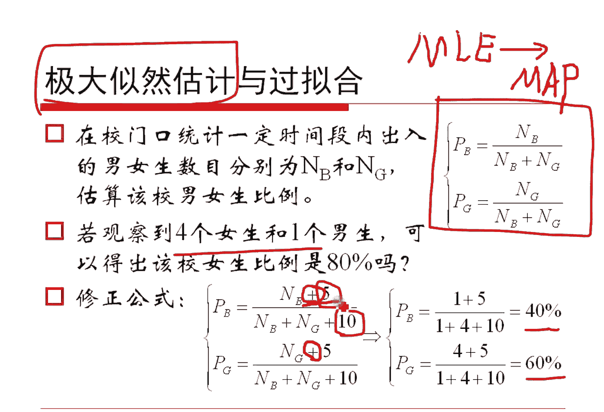

# 人工智能—机器学习中的数学（七月在线出品） - P5：极大似然估计 📊

在本节课中，我们将要学习机器学习中一个非常重要的参数估计方法——极大似然估计。我们将从贝叶斯公式出发，理解其核心思想，并通过具体的例子来掌握其应用方法。

## 从贝叶斯公式到极大似然估计 🔄

上一节我们介绍了参数估计的基本概念，本节中我们来看看如何通过贝叶斯公式引出极大似然估计的思想。

我们考察这样一个事情。假定我们回想贝叶斯公式。在给定条件 `D` 的时候，计算事件 `A` 的概率。这个公式我们已经讲过了。

现在我们把 `D` 看作是已知的样本，这是条件。那么就是说给定了样本之后，计算分布的参数。我们这样来看贝叶斯公式。那就是在给定样本的情况下，看看哪一组参数取得的概率最大。

我们就认为哪一组参数是最有可能的，最应该被我们估计的那个值。根据贝叶斯公式，既然是这个东西，我们来观察一下这个事情。假定对于样本 `D` 而言，它可能得出一个结论 `A1`，可能得出一个结论 `A2`，最终可能得到 `AN`。假定可能有 `N` 种可能。也就是我想估计一下，在样本 `D` 这个数据给定的时候，看看哪一个 `Ai` 它的概率最大。

那么我就是想计算一下这个值的最大值是什么。它取最大值的时候，看哪个 `i` 能够符合我的最大值。根据贝叶斯公式，这个东西直接带入贝叶斯公式，就是它。注意，上面这个东西跟 `Ai` 是有关的。底下这个 `P(D)` 是我们样本本身发生的概率。样本都给你了，样本发生的概率是一个常数。所以对它而言是个常数，我们不要这个分母了。只剩下了这样一个东西。

如果我们进一步假定，原始的在没有给定数据之前，结论 `A1, A2, ..., AN` 他们是等概率出现的，或者是近似等概率出现的，大体上差不多。也就是没有任何相应信息的情况下，`P(Ai)` 大体是相等的，我们把它再给扔了。

那么把它扔了之后，就得到这样一个东西。这是什么呢？我们把中间这个过程全部忽略掉，左边是这个，右边是这个，也就是写成第二行的式子。大家发现问题了没有？我们本来要做的事情是看一下在样本给定的时候，看看哪一个结论是最大的。但是我们在实践上，在社会上都会发生的一个思想是，我们反过来看，看看哪一个参数能够使得这个数据最大可能地发生。我们就把那样子的一个参数看作是我们最有可能估计的值。

这个东西如果给它讲故事的话，相当于颠倒黑白，互为因果，把因和果给倒过来了。倒过来做的事情对不对呢？但其实我们利用贝叶斯公式真的是可以解释的。有些时候颠倒因果是有道理的，因为贝叶斯公式是成立的，我们只能承认它。这就是关于这个事情。那我们就利用这一点，不再去看哪一个数据给定的时候，哪个参数可能值最大，而是看一下哪一个参数能够使得这个数据产生的概率最大。这个就是极大似然估计的基本想法。

## 极大似然估计的数学定义 📐

上一节我们介绍了极大似然估计的思想来源，本节中我们来看看它的具体数学定义。

我们假定一个总体的分布是长这样子的，`θ` 是我们不知道但想知道的一个参数。`X` 是我们的基本事件，我们的研究对象。

这里面的 `X1, X2, ..., Xn` 是我们通过这个总体采样得到的一些样本，`n` 个样本。首先这 `n` 个样本是来自于同样一个分布的。假定他们是独立的，也就是独立同分布的。

既然他们是独立的，对于 `X1` 而言，它发生的概率就是给定参数时 `X1` 的概率。`X2` 就是 `X2` 的概率。如果他们是独立的，独立意味着如果 `X` 和 `Y` 的联合概率可以写成各自概率的乘积。我们这里不是 `X` 和 `Y`，而是 `X1, X2, ..., Xn`，这里边就是 `Xi` 的值各自乘起来，就是这样一个式子。无非就是把它做了 `n` 个变化而已。这个参数我们假定有 `k` 个。

这个东西是它就写成这样一个东西了。这是什么？这个是我们样本发生的概率。第一个样本拿到的概率是这个，第二个样本拿到的概率是这个，到第 `n` 个也是这个，乘起来。这其实是我们拿到这个样本的概率。既然发生了这么一个事情，那就是像那个样子发生了。把这个东西说得文雅一点，就是“似然”。像什么什么的样子，似然嘛。因此这个东西是个似然函数，记作 `L`。它表示的是我们样本发生的概率。

另外我们可以想象到的是，这里边拿到手的这 `n` 个样本，其实已经是放在这里我们能够看见的东西了。我们看不见的东西是 `θ1, θ2, ..., θk`。我们转一个视角来看，把这样一个似然函数看作是关于未知参数 `θ1` 到 `θk` 的一个函数也是可以的。因为样本虽然用 `X` 表示，它已经是给我们的了，它已经采样得到了，`θ` 是未知的。所以这个似然函数我们看作这个东西关于 `θ` 的函数，这是一个似然。

下面的工作就是我们去求某一个 `θ`，使得这个似然函数能够概率取最大。那就是我们的极大似然估计。这个也就是刚才说的，看看哪一个参数能够使得这个 `D` 概率最大，不就是这个事情吗？

在实践当中，我们由于求导的需要，往往是对似然函数先取对数，得到对数似然函数。对这个对数似然函数求导数，然后得到若干个方程，然后让它求驻点，往往求的驻点就是极大值。就这么做法。所以我们先对它取对数，取对数之后，这个大 `L` 变成了这个小 `l`。我们一般用小 `l` 来表达，这个东西是它。

然后分别对 `θ1, θ2, ..., θk` 求偏导，得到这个东西，这其实是个方程组，解方程就是了。

**核心公式：似然函数与对数似然函数**
*   似然函数：`L(θ) = ∏_{i=1}^{n} P(x_i | θ)`
*   对数似然函数：`l(θ) = log L(θ) = ∑_{i=1}^{n} log P(x_i | θ)`

## 应用示例：抛硬币实验 🪙

上一节我们定义了极大似然估计的数学形式，本节中我们通过一个简单的例子来看看它是如何工作的。

我们已经说了，本质就是去找出与样本的分布最接近的那个分布值。举个例子，比方说我们抛了10次硬币。如果大家没听懂，继续听例子就懂了。

我们假设抛个硬币，抛10次。第一次是个正，第二次又是个正，第三次是个反，第四次是个正等等，抛了10次。我们拿到了这10次的抛币结果。我们现在来假设 `p` 是每次抛硬币结果为正的概率。我们现在想来估计一下这个 `p` 等于几。这个 `p` 是我们未知的，其实就是那个二项分布的唯一那个参数。我们想估计这个 `p` 等于几，怎么做呢？

第一次是正，这个正它发生的概率就是 `p`。第二次是正，发生的概率就是 `p`。第三次是反，所以它的发生概率是 `1-p`。第四次是正，那就是 `p`。每一个都这么写出来，其实就是一个 `p` 的7次方乘以 `(1-p)` 的3次方。这个东西相当于是关于 `p` 的一个未知的函数，这个函数记作 `L(p)`。其实这个东西就是那个大 `L`。我们现在想来求这个大 `L` 的极大值是什么？谁能够使得大 `L` 取极大值，谁就是我要估计的那个 `p` 的最优的那个值。`p` 的那个最优值其实是等于0.7的。请问怎么做的？

我们现在把这个东西做一个理论化的说法，到底为什么能够算出0.7呢？其实很简单。

以下是抛硬币实验的极大似然估计推导步骤：

1.  **定义问题**：抛硬币进行了 `N` 次实验，有 `n` 次朝上，有 `N-n` 次朝下。假定朝上的概率是 `p`。
2.  **写出似然函数**：给定 `p` 的时候，观测到 `n` 次朝上的概率（似然函数）是：`L(p) = C(N, n) * p^n * (1-p)^(N-n)`。其中 `C(N, n)` 是组合数。
3.  **取对数得到对数似然**：`l(p) = log L(p) = log C(N, n) + n*log(p) + (N-n)*log(1-p)`。记作关于 `p` 的函数 `h(p)`。
4.  **对参数求导**：对 `l(p)` 关于 `p` 求导：`dl/dp = n/p - (N-n)/(1-p)`。
5.  **令导数为零求解**：令 `dl/dp = 0`，解得 `p = n / N`。

这个结论跟我们的直观想象没有任何区别。你进行 `N` 次实验，有 `n` 次朝上，你不说这一套理论，问个小学生，他也会用 `n/N` 来估计朝上的概率。我们现在利用极大似然估计得到了一个结论，并且这个结论跟我们的实际是没有矛盾的。说明在一定意义上，极大似然估计是对的。我们不能说它一定对，总之，我们通过这个假定，给出了一个最终的结论，这个结论跟我们的直观是相符的，是能够解释的。所以我们整个的推理没有发生大的偏差。

## 应用示例：正态分布的参数估计 📈

上一节我们通过抛硬币的例子熟悉了极大似然估计的流程，本节中我们来看一个更常见的例子——估计正态分布的参数。

给你 `X1, X2, ..., Xn` 这 `n` 个样本，那么假定它来自于高斯分布，你能够估计这个高斯分布的均值和方差吗？还记得之前我们用矩估计给出了期望跟方差的结论。我们现在用极大似然估计再来算算到底结论是什么。

以下是正态分布参数估计的步骤：

1.  **写出概率密度函数**：高斯分布的概率密度函数是：`f(x|μ, σ^2) = (1/√(2πσ^2)) * exp(-(x-μ)^2/(2σ^2))`。
2.  **构建似然函数**：把样本 `xi` 带入，让 `i` 从 `1` 到 `n` 乘起来，得到似然函数：`L(μ, σ^2) = ∏_{i=1}^{n} f(x_i | μ, σ^2)`。
3.  **取对数得到对数似然**：`l(μ, σ^2) = log L(μ, σ^2) = ∑_{i=1}^{n} log f(x_i | μ, σ^2) = -n/2 * log(2πσ^2) - 1/(2σ^2) * ∑_{i=1}^{n} (x_i - μ)^2`。
4.  **分别对参数求偏导**：
    *   对 `μ` 求偏导：`∂l/∂μ = (1/σ^2) * ∑_{i=1}^{n} (x_i - μ)`
    *   对 `σ^2` 求偏导：`∂l/∂(σ^2) = -n/(2σ^2) + 1/(2σ^4) * ∑_{i=1}^{n} (x_i - μ)^2`
5.  **令偏导为零并求解**：
    *   令 `∂l/∂μ = 0`，解得 `μ = (1/n) * ∑_{i=1}^{n} x_i`。
    *   令 `∂l/∂(σ^2) = 0`，并将 `μ` 的估计值代入，解得 `σ^2 = (1/n) * ∑_{i=1}^{n} (x_i - μ)^2`。

这个结论很漂亮。这是什么？这就是我们样本的均值，就是总体的均值的估计。样本的（伪）方差，就是总体的方差的估计。这个结论跟我们刚才矩估计的那个结论是完全一致的，没有区别。二者虽然更多的统计学家是把方差定义做 `1/(n-1)` 的，但是这个极大似然估计和矩估计，他们都指向了一个除以 `n` 的结论。所以说除 `n` 是有一定的意义的，不是就真错了。除 `n` 是有意义的。我有时候把它叫伪方差。因为经典统计还是除 `n-1`。这个结论我们后面在谈到EM算法、高斯混合模型时仍然会用到。

## 极大似然估计的思考与扩展 💡

上一节我们完成了对正态分布参数的估计，本节中我们通过一个例子来思考极大似然估计的局限性，并引出其扩展。

既然你刚才给了我这个极大似然估计结论，我就跟上这个结论给你做一点点的思考。我到底看看你到底跟实际符不符合，我们倒一个例子出来。

比如说我们的校门口去统计一段时间出入门口的男生跟女生的数目。我们记作 `N_boy` 跟 `N_girl` 两个记号。用这个东西来去估算男女生的比例。根据刚才我们极大似然估计抛硬币那个例子，那么就是一个是朝上，一个是朝下嘛，所有的值是 `N = N_boy + N_girl`。所以这个结论很容易求，一个是 `boy` 的概率 `P_boy = N_boy / N`，一个是 `girl` 的概率 `P_girl = N_girl / N`。

我现在统计了一段时间，发现出来了有4位女生跟1位男生。带入这个公式，我说该校的女生比例是 `4/5=80%`。这样对吗？很显然，这样做是不合理的。因为一个学校的人数是很多的，但是你只拿到了4个女生跟1个男生，你就得到一个80%的结论，似乎有点不太地道。

那我们可不可以做一点点的修正呢？比如说我这里边让分子加上一个数，让分母也加上一个数。比如让 `N_boy` 和 `N_girl` 各自加上 `5`，那么 `P_boy = (1+5)/(5+10)=6/15=40%`，`P_girl = (4+5)/(5+10)=9/15=60%`。似乎比刚才的80%更靠谱。我们不能说40%跟60%也是对的，但是似乎比这个更合理一点。

现在问题就是：
1.  你为什么知道要加上一个数呢？这个加有道理吗？
2.  你要加的话，你应该加几呢？

先回答第二个问题。如果要是加，我们承认它的话，加几这个东西是一个超参数，是无法通过我们的样本就能够估计出来的。我们需要做一个交叉验证才可以。这个加几，我是自己把它随便试出来的一个数，我觉得这样还不错，然后就给出了一个这个东西。没有什么更多的结论，这个例子是我构造的。

然后这是第一个。第二个呢就是加这个东西，其实意味着我们没有完全取信于极大似然估计的这个结论，而是做了一个变化。这个变化来自于哪儿呢？来自于前边，我们把它再倒回去，看看我们最开始讲极大似然估计到底是怎么说的。

我们说，这个里边如果在假定 `P(Ai)` 的概率近似相等的时候，就可以推导出来极大似然估计是正确的。那如果这个 `P(Ai)` 近似不相等呢？如果 `P(Ai)` 服从某一个分布呢？比如说后面这个例子，我如果假定它的参数是服从伽马分布的，或者是多元的就服从狄利克雷分布的，它就可以加上一个数来去得到结论了。这个就是极大似然估计，把这个东西加上一个先验，就得到了极大后验概率估计的原因。这是一个非常有趣的概念。如果大家了解过LDA主题模型应该清楚了，那个LDA其实就这么干的，它就是加了一个超参数。

所以，我一直在强调，我们的前几次数学课，真的不是复习数学而已。只是我们用机器学习的眼光来看待数学，来看看它到底里边有什么跟我们相关的事情。

## 总结 🎯

本节课中我们一起学习了极大似然估计。

我们首先从贝叶斯公式出发，理解了“哪个参数最可能产生观测到的数据”这一核心思想，并将其形式化为求似然函数最大值的问题。我们学习了似然函数和对数似然函数的定义。

接着，我们通过**抛硬币**和**正态分布参数估计**两个经典例子，一步步演示了如何应用极大似然估计：
1.  写出似然函数 `L(θ)`。
2.  取对数简化计算，得到 `l(θ)`。
3.  对参数 `θ` 求（偏）导。
4.  令导数为零，解出参数的估计值。

最后，我们通过一个校门口统计性别的简单例子，探讨了极大似然估计在样本量很小时可能不够稳健，并引出了可以通过加入先验信息（如狄利克雷分布）进行平滑的**极大后验概率估计**，这为后续学习更复杂的模型（如LDA）打下了基础。

极大似然估计是连接概率论与统计推断的桥梁，是机器学习中许多模型（如逻辑回归、高斯混合模型）进行参数学习的理论基础，务必掌握其思想与计算方法。