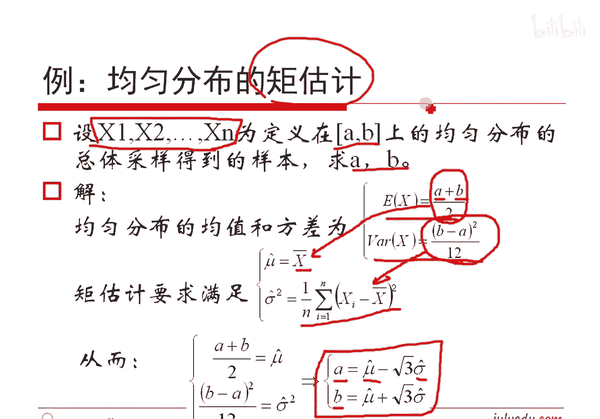

# 人工智能—机器学习中的数学（七月在线出品） - P6：矩估计

## 📚 课程概述
在本节课中，我们将要学习参数估计的一种重要方法——矩估计。我们将理解总体与样本的区别，学习如何利用样本数据计算统计量，并最终通过建立样本矩与总体矩的等式关系来估计未知的总体参数。

---

## 🎼 样本统计量
上一节我们介绍了总体的矩（如期望、方差），本节中我们来看看如何从样本数据中计算类似的统计量。

假设我们有一组样本数据：`X1, X2, ..., XN`。我们可以基于这些样本值计算以下统计量：

*   **样本均值**：将所有样本值相加后除以样本数量 `N`。
    *   公式：`样本均值 = (X1 + X2 + ... + XN) / N`
*   **样本方差**：将每个样本值与样本均值的差进行平方，求和后再除以 `N-1`。
    *   公式：`样本方差 = [(X1 - 均值)^2 + (X2 - 均值)^2 + ... + (XN - 均值)^2] / (N-1)`

**核心概念区分**：
*   **总体矩**：基于已知的概率分布（概率密度函数）计算出的理论值。
*   **样本统计量**：基于实际观测到的样本数据计算出的数值。

关于样本方差除以 `N-1` 而非 `N`，是为了保证估计的**无偏性**。在实践中，有时也会使用除以 `N` 的版本，这被称为**伪方差**。

---

## 📊 样本矩的定义
仿照总体矩的定义，我们可以定义样本的矩。

以下是样本矩的定义：
*   **样本的K阶原点矩**：样本值的K次幂之和除以 `N`。
    *   公式：`A_k = (X1^k + X2^k + ... + XN^k) / N`
*   **样本的K阶中心矩**：样本值减去样本均值后的K次幂之和除以 `N`。
    *   公式：`B_k = [(X1 - 均值)^k + (X2 - 均值)^k + ... + (XN - 均值)^k] / N`

根据定义：
*   一阶原点矩 `A_1` 就是**样本均值**。
*   二阶中心矩 `B_2`（若除以 `N`）就是**样本伪方差**；若除以 `N-1` 则是**样本方差**。

---

## 🔗 矩估计的核心思想
现在，我们来看看如何利用样本矩来估计总体参数。这是矩估计方法的核心。

我们假设总体服从一个由参数 `θ` 决定的分布。`θ` 是未知的，但客观存在。例如：
*   高斯分布：`θ = (μ, σ)`
*   泊松分布：`θ = λ`
*   均匀分布：`θ = (a, b)`

我们从总体中独立同分布地抽取了样本 `X1, X2, ..., XN`。

**矩估计的思路**：
1.  利用样本，我们可以计算出各阶样本矩（如 `A_1`, `A_2`, `B_2` 等），这些是已知的**数值**。
2.  总体的各阶矩（如期望 `E(X)`、方差 `D(X)` 等）是未知参数 `θ` 的**函数**。
3.  令**样本矩等于对应的总体矩**，建立关于未知参数 `θ` 的方程组。
4.  解这个方程组，即可得到参数 `θ` 的估计值 `θ_hat`。

**简单来说**：用样本计算出的“平均特征”（矩）去匹配理论分布的“平均特征”，从而反推出分布的参数。

---

## 🧮 矩估计的应用实例
上一节我们介绍了矩估计的原理，本节中我们通过具体例子来看看如何应用。

### 实例一：估计正态分布的参数
假设总体服从正态分布 `N(μ, σ^2)`，参数 `μ` 和 `σ^2` 未知。
*   总体一阶矩（期望）：`E(X) = μ`
*   总体二阶原点矩：`E(X^2) = D(X) + [E(X)]^2 = σ^2 + μ^2`

根据矩估计法，令样本矩等于总体矩：
1.  `样本均值 A_1 = μ`
2.  `样本二阶原点矩 A_2 = σ^2 + μ^2`

解此方程组，得到参数的矩估计量：
*   `μ_hat = A_1 = 样本均值`
*   `σ^2_hat = A_2 - (A_1)^2 = 样本二阶原点矩 - (样本均值)^2`

可以发现，`σ^2_hat` 正是之前定义的**样本伪方差**。

**矩估计结论**：对于任何分布，均可用**样本均值**估计总体期望，用**样本伪方差**估计总体方差。

### 实例二：估计均匀分布的参数
假设总体服从区间 `[a, b]` 上的均匀分布，参数 `a` 和 `b` 未知。
已知均匀分布的性质：
*   总体期望：`E(X) = (a + b) / 2`
*   总体方差：`D(X) = (b - a)^2 / 12`

令样本矩等于总体矩：
1.  `样本均值 = (a + b) / 2`
2.  `样本伪方差 = (b - a)^2 / 12`

设 `μ_hat` 为样本均值，`σ_hat^2` 为样本伪方差。解方程组可得：
*   `a_hat = μ_hat - √(3 * σ_hat^2)`
*   `b_hat = μ_hat + √(3 * σ_hat^2)`

这样，我们就通过样本数据估计出了均匀分布的区间范围 `[a_hat, b_hat]`。

---

## 📝 课程总结
本节课中我们一起学习了参数估计的**矩估计法**。

我们首先区分了**总体矩**与**样本统计量**，然后定义了**样本原点矩**和**样本中心矩**。矩估计的核心思想是建立**样本矩等于总体矩**的方程，通过求解方程组来估计未知的总体参数。我们以正态分布和均匀分布为例，演示了矩估计的具体应用步骤。矩估计原理直观、计算简单，是参数估计的一种基本而重要的方法。