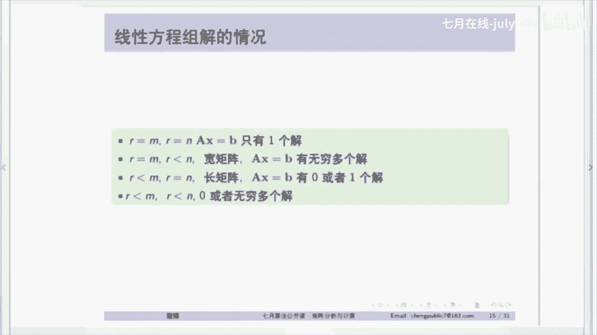

# 人工智能—机器学习中的数学（七月在线出品） - P7：矩阵基础综述 📊

在本节课中，我们将要学习矩阵和线性代数的一些核心基础知识。理解这些概念对于后续学习图像处理、机器学习等复杂算法至关重要。我们将从矩阵的基本概念出发，逐步深入到线性方程组、子空间以及特征分解，旨在帮助大家建立对矩阵的深刻理解，而不仅仅是停留在表面计算。

## 矩阵的本质与视角 🔍

上一节我们介绍了课程的目标和重要性，本节中我们来看看矩阵到底是什么。矩阵不仅仅是数字的排列，它可以从多个层面进行理解。

一个矩阵，例如一个4x3的矩阵，通常被简单地视为用方括号括起来的一组数字。然而，这种理解是浅显的。更深入地，我们可以通过线性方程组 `AX = B` 来理解矩阵。

对于这个方程组，存在三种不同层次的理解：
1.  **行视角（几何交点）**：将每个方程视为一条直线（或平面），方程组的解就是这些直线（或平面）的交点。这是初中数学的层面。
2.  **列视角（线性组合）**：将矩阵 `A` 的每一列视为一个向量。`AX` 的结果 `B` 就是这些列向量的线性组合，组合系数由向量 `X` 提供。这是理解矩阵乘法的关键视角之一。
3.  **子空间视角**：所有可能的线性组合 `AX`（即所有可能的 `B`）构成了一个向量空间，称为矩阵 `A` 的列空间。这是最高层次的理解，将矩阵与向量空间理论联系起来。

## 矩阵乘法的四种表示形式 ✖️

理解了矩阵的多种视角后，我们来看看矩阵乘法的具体表示。矩阵乘法 `C = A * B` 有四种等价的表示形式，这有助于我们从不同角度理解运算的本质。

以下是矩阵乘法的四种表示形式：
*   **内积表示**：`C` 的第 `i` 行第 `j` 列元素 `c_ij`，等于 `A` 的第 `i` 行与 `B` 的第 `j` 列的内积。这是教科书中最常见的形式。
*   **列表示**：`C` 的每一列，都是矩阵 `A` 的所有列以 `B` 的对应列为系数的线性组合。即 `C` 的第 `j` 列 = `A * (B的第j列)`。
*   **行表示**：`C` 的每一行，都是矩阵 `B` 的所有行以 `A` 的对应行为系数的线性组合。即 `C` 的第 `i` 行 = `(A的第i行) * B`。
*   **外积表示**：`C` 可以表示为一系列秩为1的矩阵之和。具体地，`C = Σ (A的第k列) * (B的第k行转置)`。这揭示了矩阵乘法可以分解为多个简单矩阵的和。

## 线性代数基础概念回顾 📐

矩阵运算建立在坚实的线性代数基础之上。本节我们将回顾向量组的线性相关性、张成空间等核心概念，这些是理解矩阵子空间的基石。

一组向量 `{a1, a2, ..., an}` 是**线性无关**的，当且仅当方程 `c1*a1 + c2*a2 + ... + cn*an = 0` 的唯一解是所有系数 `c1, c2, ..., cn` 都为零。这意味着没有一个向量可以表示为其他向量的线性组合。反之，则是线性相关。

向量组 `{a1, a2, ..., an}` 的**张成空间**，记作 `Span{a1, ..., an}`，是指由这些向量的所有可能线性组合构成的集合。这个集合满足**子空间**的两个条件：
1.  对加法封闭：如果 `u` 和 `v` 在子空间中，则 `u + v` 也在。
2.  对数乘封闭：如果 `u` 在子空间中，`c` 是任意标量，则 `c * u` 也在。
**任何子空间都必须包含零向量**。

## 矩阵的四个基本子空间 🧩

从子空间的角度理解矩阵是线性代数的精髓。任何一个 `m x n` 的矩阵 `A` 都关联着四个重要的子空间，它们揭示了矩阵 `A` 的结构和性质。

以下是矩阵 `A` 的四个基本子空间：
*   **列空间**：记作 `C(A)`。由矩阵 `A` 的所有列向量张成的子空间，是 `R^m` 的子空间。`AX = b` 有解，当且仅当向量 `b` 位于 `A` 的列空间中。
*   **零空间**：记作 `N(A)`。由所有满足 `AX = 0` 的解向量 `x` 构成的子空间，是 `R^n` 的子空间。
*   **行空间**：记作 `C(A^T)`。由矩阵 `A` 的所有行向量（即 `A^T` 的列向量）张成的子空间，是 `R^n` 的子空间。
*   **左零空间**：记作 `N(A^T)`。由所有满足 `A^T y = 0` 的解向量 `y` 构成的子空间，是 `R^m` 的子空间。

这四个子空间之间存在优美的正交关系：**行空间与零空间在 `R^n` 中正交，列空间与左零空间在 `R^m` 中正交**。并且它们的维数满足：
*   `dim(C(A)) = dim(C(A^T)) = rank(A)` （秩）
*   `dim(N(A)) = n - rank(A)`
*   `dim(N(A^T)) = m - rank(A)`

## 矩阵的秩与线性方程组的解 🧮

矩阵的秩是连接子空间维数与方程组解的存在性的桥梁。理解了秩，就能清晰地判断 `AX = b` 的解的情况。

矩阵 `A` 的**秩**是其列（或行）向量中最大线性无关组的向量个数，也就是其列空间的维数。矩阵的秩决定了线性方程组 `AX = b` 的解的性质：

以下是不同情况下 `AX = b` 的解的总结：
*   **方阵且满秩**：当 `A` 是 `n x n` 方阵且 `rank(A) = n` 时，`A` 可逆。对于任意 `b`，方程有唯一解 `x = A^{-1}b`。
*   **“胖”矩阵**：当 `A` 是 `m x n` 矩阵且 `rank(A) = m < n`（行满秩）时，方程 `AX = b` 要么无解，要么有无穷多解。解存在的条件是 `b` 必须位于 `A` 的列空间内。
*   **“瘦”矩阵**：当 `A` 是 `m x n` 矩阵且 `rank(A) = n < m`（列满秩）时，方程 `AX = b` 可能有唯一解，也可能无解。当 `b` 不在列空间内时无解，此时引入**最小二乘法**，寻找一个 `x` 使得 `||Ax - b||^2` 最小，这对应于将 `b` 投影到列空间上。

## 特征值与特征分解 🔬

特征值与特征分解是分析矩阵，尤其是对称矩阵的强大工具。它不仅在理论分析中重要，在计算矩阵高次幂等实际问题中也非常高效。

对于方阵 `A`，如果存在标量 `λ` 和非零向量 `v`，使得 `Av = λv` 成立，则称 `λ` 为 `A` 的**特征值**，`v` 为对应的**特征向量**。几何上，这意味着矩阵 `A` 对向量 `v` 的作用仅仅是缩放（系数为 `λ`），而不改变其方向。

特征值通过求解特征方程 `det(A - λI) = 0` 得到。如果 `A` 是 `n x n` 矩阵且有 `n` 个线性无关的特征向量 `v1, v2, ..., vn`，对应的特征值为 `λ1, λ2, ..., λn`，那么 `A` 可以进行**特征分解**（也称对角化）：
`A = V Λ V^{-1}`
其中 `V` 是以特征向量为列的矩阵，`Λ` 是以特征值为对角元素的对角矩阵。

这个分解的威力在于，例如计算 `A` 的 `k` 次幂变得非常简单：`A^k = V Λ^k V^{-1}`，而 `Λ^k` 只需将对角元素各自取 `k` 次幂。

特别地，对于**实对称矩阵** `A`，其特征值都是实数，且不同特征值对应的特征向量相互正交。因此，其特征分解可以写成更优美的形式：
`A = U Λ U^T`
其中 `U` 是正交矩阵（`U^T U = I`），其列是 `A` 的单位正交特征向量。此时，矩阵的列空间和零空间可以直接与 `U` 的列向量联系起来：列空间由对应非零特征值的特征向量张成，零空间由对应零特征值的特征向量张成。

## 总结 📝

本节课中我们一起学习了矩阵与线性代数的核心基础。我们从矩阵的三种理解视角（行、列、子空间）出发，深入探讨了矩阵乘法的四种表示形式。我们重点回顾并构建了以**四个基本子空间**为核心的理论框架，理解了列空间、零空间、行空间和左零空间的定义、相互关系及其维数定理。在此基础上，我们分析了矩阵的秩如何决定线性方程组 `AX = b` 解的存在性与唯一性，并引出了最小二乘的概念。最后，我们学习了特征值与特征分解，特别是实对称矩阵的优美性质，并将其与子空间理论联系起来。

掌握这些基础概念，是从更高维度理解后续机器学习、图像处理中复杂矩阵运算和模型的关键。希望大家能通过子空间的观点重新审视矩阵，将其视为构建向量空间的工具，而不仅仅是数字的表格。